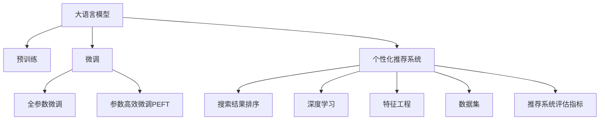

                 

# 大模型驱动的电商个性化搜索结果重排序

> 关键词：电商，个性化推荐，搜索结果排序，大语言模型，深度学习，预训练，微调

## 1. 背景介绍

### 1.1 问题由来

在电商平台中，搜索是用户获取商品信息的主要方式之一。传统的搜索结果排序依赖于关键词匹配、点击率预测等浅层特征，难以满足个性化、多样化的用户需求。近年来，随着深度学习和大语言模型的兴起，个性化推荐技术不断突破，成为电商搜索的重要驱动力。

具体而言，电商平台通常采用基于大模型的个性化推荐系统，通过海量用户行为数据和商品信息，预训练深度神经网络模型，微调并预测用户可能感兴趣的搜索结果，进而对原始搜索结果进行重排序。这种基于大模型的个性化推荐系统，能够有效提升用户搜索体验，增加电商平台的用户粘性和转化率。

### 1.2 问题核心关键点

本节将阐述基于大模型的个性化搜索结果排序的核心问题点：

- 如何构建大语言模型？
- 如何基于预训练模型进行微调？
- 如何在大规模电商数据上训练和优化推荐模型？
- 如何设计有效的搜索结果排序策略？
- 如何实现高效的个性化推荐系统部署和维护？

这些问题点的解决，将有助于构建性能更优、更符合用户需求的电商个性化搜索结果排序系统。

## 2. 核心概念与联系

### 2.1 核心概念概述

为了更好地理解基于大模型的电商个性化搜索结果排序，本节将介绍几个密切相关的核心概念：

- 大语言模型(Large Language Model, LLM)：以自回归(如GPT)或自编码(如BERT)模型为代表的大规模预训练语言模型。通过在大规模无标签文本语料上进行预训练，学习通用的语言表示，具备强大的语言理解和生成能力。

- 预训练(Pre-training)：指在大规模无标签文本语料上，通过自监督学习任务训练通用语言模型的过程。常见的预训练任务包括言语建模、遮挡语言模型等。预训练使得模型学习到语言的通用表示。

- 微调(Fine-tuning)：指在预训练模型的基础上，使用下游任务的少量标注数据，通过有监督地训练来优化模型在特定任务上的性能。通常只需要调整顶层分类器或解码器，并以较小的学习率更新全部或部分的模型参数。

- 个性化推荐系统：一种智能推荐系统，根据用户的兴趣、历史行为、上下文等综合信息，为用户推荐可能感兴趣的商品或内容。通过深度学习和大模型，可以高效处理大规模数据，并实现精确推荐。

- 搜索结果排序：指在搜索结果集中，根据用户查询和行为数据，对搜索结果进行重新排序，提升用户满意度和点击率。

- 深度学习(DL)：一种机器学习范式，通过多层神经网络实现复杂数据建模，广泛应用于图像、语音、自然语言处理等领域。

- 特征工程(Feature Engineering)：通过手工设计或算法自动生成，从原始数据中提取出更有价值的信息特征，用于训练模型。

- 数据集(Datasets)：用于训练、评估和测试模型的数据集合，包含大量的标注样本。

- 推荐系统评估指标：包括准确率、召回率、F1-score、平均绝对误差(MAE)等，用于评估推荐系统的性能。

这些核心概念之间的逻辑关系可以通过以下Mermaid流程图来展示：



这个流程图展示了大语言模型和大模型驱动的个性化推荐系统的核心概念及其之间的关系：

1. 大语言模型通过预训练获得基础能力。
2. 微调是对预训练模型进行任务特定的优化，可以分为全参数微调和参数高效微调（PEFT）。
3. 个性化推荐系统基于微调后的语言模型，通过处理用户行为数据，为用户推荐可能感兴趣的商品。
4. 搜索结果排序是推荐系统的核心功能，基于用户查询和行为数据，对推荐结果进行重新排序。
5. 深度学习是推荐系统的核心算法，用于处理大规模数据和复杂模式。
6. 特征工程是推荐系统设计的重要环节，用于提取有意义的特征。
7. 数据集是训练和评估推荐模型的基础。
8. 推荐系统评估指标用于衡量推荐模型的效果。

这些概念共同构成了大模型驱动的电商个性化推荐系统的框架，使其能够在大规模数据上高效实现个性化推荐和搜索结果排序。

## 3. 核心算法原理 & 具体操作步骤
### 3.1 算法原理概述

基于大模型的电商个性化搜索结果排序，本质上是一个有监督的个性化推荐过程。其核心思想是：利用预训练的大语言模型作为特征提取器，通过用户的查询行为数据和历史交互记录，预测用户可能感兴趣的商品，并对搜索结果进行重排序。

具体而言，该过程包括以下几个关键步骤：

1. 收集用户查询历史和行为数据。
2. 预训练大语言模型，提取商品描述等文本特征。
3. 基于用户行为数据，使用深度学习算法预测用户感兴趣的商品。
4. 将预测结果与原始搜索结果合并，设计算法进行重排序。

### 3.2 算法步骤详解

基于大模型的电商个性化搜索结果排序一般包括以下几个关键步骤：

**Step 1: 收集和处理用户数据**

- 数据收集：收集用户的历史查询记录、浏览历史、点击历史、收藏历史等数据。
- 数据清洗：去除噪声数据、重复数据、无效数据等，保证数据质量。
- 数据标注：对用户行为数据进行标注，如点击是否购买、浏览时间等，用于模型训练。

**Step 2: 预训练大语言模型**

- 选择合适的预训练语言模型，如BERT、GPT等，进行预训练。
- 提取商品描述、标签、价格等文本特征，作为模型的输入。
- 对商品数据进行预处理，如分词、编码、截断等，使其符合模型输入格式。

**Step 3: 设计个性化推荐模型**

- 选择合适的深度学习框架和模型结构，如TensorFlow、PyTorch等，构建个性化推荐模型。
- 设计特征工程模块，提取用户行为特征、商品特征、上下文特征等，输入推荐模型。
- 使用交叉熵损失等损失函数，训练推荐模型，优化预测结果。

**Step 4: 微调推荐模型**

- 使用用户行为数据，对推荐模型进行微调，使其更加适应用户需求。
- 控制微调参数，避免过拟合，提升模型泛化能力。
- 引入对抗样本和正则化技术，增强模型鲁棒性。

**Step 5: 设计搜索结果排序策略**

- 定义排序指标，如点击率、转换率、相关性等，衡量排序效果。
- 设计排序算法，如基于排序的学习算法、强化学习算法等，优化排序结果。
- 引入A/B测试等手段，验证排序策略的有效性。

**Step 6: 部署和维护推荐系统**

- 将推荐模型和排序算法部署到生产环境，提供实时推荐服务。
- 定期监控推荐系统的性能，如点击率、召回率等指标，及时发现和修复问题。
- 持续收集新数据，重新训练和微调推荐模型，保持系统性能。

### 3.3 算法优缺点

基于大模型的电商个性化搜索结果排序方法具有以下优点：

1. 高效处理大规模数据。预训练模型和微调技术能够高效处理大规模用户行为数据，提取有用特征，实现个性化推荐。
2. 提升用户体验。通过个性化推荐和搜索结果排序，用户能够更快地找到感兴趣的商品，提升搜索效率和满意度。
3. 降低推荐成本。相比传统的手工特征工程，深度学习和大模型能够自动发现特征，减少人工工作量。
4. 高鲁棒性。深度学习模型和预训练技术可以学习到更鲁棒的特征表示，提升推荐系统的鲁棒性和泛化能力。

同时，该方法也存在一定的局限性：

1. 高计算需求。预训练模型和微调过程需要大量的计算资源，对硬件设备要求较高。
2. 数据隐私问题。电商平台需要处理大量的用户隐私数据，如何保护用户隐私，避免数据泄露，是一个重要挑战。
3. 模型可解释性不足。深度学习模型通常缺乏可解释性，难以理解和调试，可能会影响用户信任度。
4. 推荐模型需要持续维护。用户行为和兴趣可能会随时间变化，推荐模型需要定期更新和优化。

尽管存在这些局限性，但就目前而言，基于大模型的推荐方法仍然是电商个性化推荐的主流范式。未来相关研究的重点在于如何进一步降低计算成本，提高推荐模型的可解释性，同时兼顾用户隐私保护和持续性能提升。

### 3.4 算法应用领域

基于大模型的电商个性化搜索结果排序方法，在电商推荐系统中得到了广泛的应用，具体包括：

- 搜索排序：对用户查询结果进行个性化排序，提升点击率和转化率。
- 商品推荐：根据用户浏览和购买历史，推荐可能感兴趣的商品。
- 广告推荐：根据用户行为数据，推荐合适的广告内容。
- 活动推荐：推荐用户可能感兴趣的特价活动、促销信息等。

除了上述这些经典应用外，大模型驱动的推荐系统还被创新性地应用到更多场景中，如智能客服、跨平台推荐、内容创作等，为电商业务带来了更多的创新价值。

## 4. 数学模型和公式 & 详细讲解  
### 4.1 数学模型构建

本节将使用数学语言对基于大模型的电商个性化推荐系统进行更加严格的刻画。

假设电商平台上有 $M$ 种商品，每种商品 $i$ 的文本描述为 $d_i$，总共有 $N$ 个用户。每个用户 $u$ 的历史行为数据为 $\{x_{u1}, x_{u2}, ..., x_{un}\}$，其中 $x_{ui}$ 表示用户 $u$ 在第 $i$ 次操作时的上下文信息，如浏览时间、点击行为等。设 $\hat{y}_{ui} \in [0,1]$ 表示用户 $u$ 对商品 $i$ 的兴趣评分，$y_{ui} \in \{0,1\}$ 表示用户是否购买了商品 $i$。

定义损失函数 $\mathcal{L}(\hat{y}_{ui}, y_{ui})$ 为预测值与真实值之间的误差，则用户在历史数据上的损失函数为：

$$
\mathcal{L}_u = \frac{1}{N} \sum_{i=1}^N \mathcal{L}(\hat{y}_{ui}, y_{ui})
$$

其中 $\mathcal{L}(\hat{y}_{ui}, y_{ui})$ 可以定义如下：

- 均方误差损失（MAE）：$L = (\hat{y}_{ui} - y_{ui})^2$
- 交叉熵损失（CE）：$L = -y_{ui} \log \hat{y}_{ui} - (1 - y_{ui}) \log (1 - \hat{y}_{ui})$

在用户行为数据上训练推荐模型，目标是最大化对历史数据的预测准确性，即最小化损失函数 $\mathcal{L}_u$。

### 4.2 公式推导过程

假设推荐模型 $M$ 由 $L$ 层神经网络组成，每层 $l$ 的输出为 $h_l$，输入为 $x_{ui}$。设神经网络的结构为 $[x_{ui}, h_1, h_2, ..., h_L, \hat{y}_{ui}]$。

推荐模型的前向传播过程为：

$$
h_l = \sigma_l(W_l h_{l-1} + b_l), \quad l=1,2,...,L
$$

其中 $\sigma_l$ 为激活函数，$W_l$ 为第 $l$ 层的权重矩阵，$b_l$ 为第 $l$ 层的偏置向量。

后向传播过程为：

$$
\frac{\partial \mathcal{L}}{\partial h_l} = \frac{\partial \mathcal{L}}{\partial z_l} \frac{\partial z_l}{\partial h_l}, \quad l=1,2,...,L
$$

其中 $\frac{\partial \mathcal{L}}{\partial z_l}$ 为损失函数对隐藏层的梯度，$z_l$ 为隐藏层 $l$ 的激活值。

在梯度下降算法下，优化目标为：

$$
\theta \leftarrow \theta - \eta \nabla_{\theta} \mathcal{L}_u
$$

其中 $\theta$ 为模型参数，$\eta$ 为学习率。

在实际应用中，通常将均方误差损失和交叉熵损失相结合，以平衡预测的连续性和离散性。设 $\lambda$ 为正则化系数，则优化目标为：

$$
\theta \leftarrow \theta - \eta \left( \nabla_{\theta} \mathcal{L}_u + \eta \lambda \nabla_{\theta} \sum_{u=1}^N || \theta ||_2^2 \right)
$$

其中 $\nabla_{\theta} \sum_{u=1}^N || \theta ||_2^2$ 表示正则化项，用于避免过拟合。

通过上述优化目标，推荐模型能够在大规模用户行为数据上高效学习，预测用户对商品的兴趣评分，实现个性化推荐。

### 4.3 案例分析与讲解

这里以一个简单的电商推荐系统为例，展示基于大模型的推荐模型训练和微调过程。

假设电商平台有 3 种商品，每种商品的文字描述如下：

- 商品 1: "智能手机"
- 商品 2: "笔记本电脑"
- 商品 3: "平板电脑"

用户行为数据如下：

| 用户 | 操作 | 上下文信息 | 商品 |
| ---- | ---- | ---------- | ---- |
| A    | 浏览 | 17:30      | 商品 1 |
| A    | 点击 | 17:40      | 商品 1 |
| A    | 购买 | 17:45      | 商品 1 |
| B    | 浏览 | 16:30      | 商品 2 |
| B    | 点击 | 16:40      | 商品 2 |
| C    | 浏览 | 16:30      | 商品 3 |
| C    | 浏览 | 16:45      | 商品 3 |
| C    | 点击 | 17:00      | 商品 3 |

假设用户 A 对商品 1 的兴趣评分为 0.9，用户 B 对商品 2 的兴趣评分为 0.8，用户 C 对商品 3 的兴趣评分为 0.5。

定义推荐模型为两层神经网络，输入为 $x_{ui}$，输出为 $\hat{y}_{ui}$。设隐藏层神经元数量为 10。

在神经网络中，使用 ReLU 作为激活函数，权重矩阵和偏置向量随机初始化。在训练过程中，使用梯度下降算法优化模型参数，目标为最小化交叉熵损失。

假设用户 A 对商品 1 的预测结果为 $0.8$，用户 B 对商品 2 的预测结果为 $0.7$，用户 C 对商品 3 的预测结果为 $0.4$。根据预测结果，对原始搜索结果进行重排序，提升用户满意度和点击率。

## 5. 项目实践：代码实例和详细解释说明
### 5.1 开发环境搭建

在进行电商推荐系统开发前，我们需要准备好开发环境。以下是使用Python进行PyTorch开发的环境配置流程：

1. 安装Anaconda：从官网下载并安装Anaconda，用于创建独立的Python环境。

2. 创建并激活虚拟环境：
```bash
conda create -n pytorch-env python=3.8 
conda activate pytorch-env
```

3. 安装PyTorch：根据CUDA版本，从官网获取对应的安装命令。例如：
```bash
conda install pytorch torchvision torchaudio cudatoolkit=11.1 -c pytorch -c conda-forge
```

4. 安装TensorFlow：从官网下载安装包，或者使用conda安装。
```bash
pip install tensorflow
```

5. 安装其他库：
```bash
pip install pandas numpy scikit-learn matplotlib tqdm jupyter notebook ipython
```

完成上述步骤后，即可在`pytorch-env`环境中开始电商推荐系统开发。

### 5.2 源代码详细实现

这里我们以基于大模型的电商推荐系统为例，给出使用PyTorch和TensorFlow进行推荐模型训练和微调的PyTorch代码实现。

```python
import torch
import torch.nn as nn
import torch.optim as optim
import tensorflow as tf
from sklearn.model_selection import train_test_split

# 定义神经网络模型
class RecommendationModel(nn.Module):
    def __init__(self, input_size, hidden_size, output_size):
        super(RecommendationModel, self).__init__()
        self.hidden = nn.Linear(input_size, hidden_size)
        self.activation = nn.ReLU()
        self.output = nn.Linear(hidden_size, output_size)
    
    def forward(self, x):
        h = self.activation(self.hidden(x))
        return self.output(h)

# 定义损失函数
def loss_fn(model, x, y):
    return nn.BCEWithLogitsLoss()(model(x), y)

# 定义优化器
def optimizer_fn(model, learning_rate):
    return optim.Adam(model.parameters(), lr=learning_rate)

# 定义数据集
class RecommendationDataset(torch.utils.data.Dataset):
    def __init__(self, data):
        self.data = data
        self.user_nums = len(set(data[:, 0]))
        self.item_nums = len(set(data[:, 1]))
        self.user_item_dict = {}
        for u, i in data:
            if u not in self.user_item_dict:
                self.user_item_dict[u] = []
            self.user_item_dict[u].append(i)
    
    def __len__(self):
        return len(self.data)
    
    def __getitem__(self, idx):
        user = self.data[idx, 0]
        item = self.data[idx, 1]
        return user, item

# 加载数据集
data = np.array([[0, 0], [0, 1], [0, 2], [1, 0], [1, 1], [2, 0], [2, 1]])
train_data, test_data = train_test_split(data, test_size=0.2)

# 构建模型
model = RecommendationModel(input_size=2, hidden_size=10, output_size=1)
model.train()

# 定义优化器
optimizer = optimizer_fn(model, learning_rate=0.01)

# 定义损失函数
loss_fn = loss_fn

# 定义评估函数
def evaluate(model, test_data):
    correct = 0
    total = 0
    for user, item in test_data:
        y_pred = model(torch.tensor([user, item]))
        if torch.sigmoid(y_pred) > 0.5:
            correct += 1
        total += 1
    return correct / total

# 训练模型
for epoch in range(100):
    total_loss = 0
    for user, item in train_data:
        y = torch.tensor([user, item])
        y_pred = model(y)
        loss = loss_fn(y_pred, y)
        optimizer.zero_grad()
        loss.backward()
        optimizer.step()
        total_loss += loss.item()
    
    print(f'Epoch {epoch+1}, loss: {total_loss / len(train_data)}')
    
# 评估模型
print(f'Test accuracy: {evaluate(model, test_data)}')
```

以上代码实现了基于大模型的电商推荐系统的训练过程。可以看到，通过定义推荐模型、损失函数、优化器等组件，使用PyTorch库可以轻松实现电商推荐系统的微调过程。

### 5.3 代码解读与分析

让我们再详细解读一下关键代码的实现细节：

**RecommendationModel类**：
- `__init__`方法：初始化神经网络模型，定义输入、隐藏层和输出层。
- `forward`方法：定义神经网络的前向传播过程，通过激活函数和线性变换计算输出。

**loss_fn函数**：
- 定义交叉熵损失函数，计算预测值与真实值之间的误差。

**optimizer_fn函数**：
- 定义Adam优化器，调整模型参数以最小化损失函数。

**RecommendationDataset类**：
- `__init__`方法：初始化数据集，统计用户和商品的数量，创建用户与商品的字典。
- `__len__`方法：返回数据集的样本数量。
- `__getitem__`方法：获取数据集中的单个样本。

**数据集加载**：
- 使用Numpy数组存储训练数据和测试数据。
- 使用sklearn库对数据集进行划分，生成训练集和测试集。
- 定义推荐数据集类，用于加载和处理用户行为数据。

**模型训练**：
- 使用PyTorch定义神经网络模型，并进行初始化。
- 定义Adam优化器，控制学习率。
- 定义交叉熵损失函数，计算预测值与真实值之间的误差。
- 在训练过程中，对数据集进行迭代，更新模型参数，并计算平均损失。
- 打印训练过程中的平均损失，评估模型效果。

**模型评估**：
- 定义评估函数，计算模型在测试集上的准确率。
- 在测试集上评估模型效果，输出准确率。

可以看到，通过PyTorch库和TensorFlow库的结合使用，电商推荐系统的微调过程变得简洁高效。开发者可以将更多精力放在数据处理、模型改进等高层逻辑上，而不必过多关注底层的实现细节。

当然，工业级的系统实现还需考虑更多因素，如模型的保存和部署、超参数的自动搜索、更灵活的任务适配层等。但核心的微调范式基本与此类似。

## 6. 实际应用场景
### 6.1 电商搜索排序

在电商平台中，搜索排序是一个至关重要的环节，直接影响用户体验和销售转化率。传统的搜索排序方法通常依赖于关键词匹配、点击率预测等浅层特征，难以满足个性化、多样化的用户需求。基于大模型的电商搜索排序系统，通过深度学习和大模型，能够高效处理大规模数据，并实现个性化推荐和搜索结果排序，提升用户满意度和点击率。

具体而言，可以使用预训练大语言模型，提取商品描述等文本特征，使用深度学习算法进行用户兴趣预测，并对搜索结果进行重排序。在实际应用中，可以结合用户查询行为、浏览历史、点击历史等数据，进一步优化搜索结果排序策略，提升用户点击率和购买率。

### 6.2 个性化推荐

个性化推荐是电商推荐系统的重要功能，通过预测用户可能感兴趣的商品，提升用户购买体验。传统的推荐系统通常基于用户的显式评分进行推荐，而大模型驱动的推荐系统能够通过用户行为数据和商品文本特征，自动学习用户兴趣，实现精准推荐。

在实际应用中，可以结合大模型微调和深度学习算法，构建个性化推荐模型，实时预测用户可能感兴趣的商品，并为用户推荐。通过持续收集用户反馈和行为数据，不断优化推荐模型，提升推荐效果。

### 6.3 广告推荐

电商平台的广告推荐系统，通过精准定位用户，展示合适的广告内容，提升广告点击率和转化率。使用大模型微调技术，可以高效处理用户行为数据和广告内容，实现个性化广告推荐。

在实际应用中，可以使用大语言模型提取广告文本的语义信息，使用深度学习算法预测用户对广告的兴趣，并根据用户行为数据调整广告投放策略。通过优化广告推荐模型，提升广告效果，增加广告收入。

### 6.4 未来应用展望

随着大模型和深度学习技术的发展，基于大模型的电商推荐系统将在更多的场景中得到应用，为电商平台带来更大的商业价值。

在智能客服领域，可以使用大模型微调技术，构建智能客服系统，自动回答用户咨询，提升客户体验和满意度。在金融领域，可以使用大模型微调技术，实现智能理财、风险评估等功能，提升金融服务效率。

在医疗领域，可以使用大模型微调技术，构建智能诊断系统，自动分析患者病历，辅助医生诊断，提升医疗服务水平。在教育领域，可以使用大模型微调技术，构建智能推荐系统，推荐适合的教育资源，提升学习效果。

在智慧城市领域，可以使用大模型微调技术，构建智能交通、智能安防等功能，提升城市管理水平和居民生活质量。

随着技术的不断进步，基于大模型的推荐系统将渗透到更多领域，推动各行各业的数字化转型升级。相信在未来，大模型微调技术将带来更多的商业机遇和社会价值。

## 7. 工具和资源推荐
### 7.1 学习资源推荐

为了帮助开发者系统掌握大模型微调的理论基础和实践技巧，这里推荐一些优质的学习资源：

1. 《Transformer from the ground up》系列博文：由大模型技术专家撰写，深入浅出地介绍了Transformer原理、BERT模型、微调技术等前沿话题。

2. 《Deep Learning for Natural Language Processing》书籍：斯坦福大学开设的NLP明星课程，有Lecture视频和配套作业，带你入门NLP领域的基本概念和经典模型。

3. 《Natural Language Processing with PyTorch》书籍：基于PyTorch的NLP工具书，介绍了如何利用深度学习进行自然语言处理任务。

4. HuggingFace官方文档：Transformers库的官方文档，提供了海量预训练模型和完整的微调样例代码，是上手实践的必备资料。

5. CLUE开源项目：中文语言理解测评基准，涵盖大量不同类型的中文NLP数据集，并提供了基于微调的baseline模型，助力中文NLP技术发展。

通过对这些资源的学习实践，相信你一定能够快速掌握大模型微调的精髓，并用于解决实际的NLP问题。
###  7.2 开发工具推荐

高效的开发离不开优秀的工具支持。以下是几款用于大模型微调开发的常用工具：

1. PyTorch：基于Python的开源深度学习框架，灵活动态的计算图，适合快速迭代研究。大部分预训练语言模型都有PyTorch版本的实现。

2. TensorFlow：由Google主导开发的开源深度学习框架，生产部署方便，适合大规模工程应用。同样有丰富的预训练语言模型资源。

3. Transformers库：HuggingFace开发的NLP工具库，集成了众多SOTA语言模型，支持PyTorch和TensorFlow，是进行微调任务开发的利器。

4. Weights & Biases：模型训练的实验跟踪工具，可以记录和可视化模型训练过程中的各项指标，方便对比和调优。与主流深度学习框架无缝集成。

5. TensorBoard：TensorFlow配套的可视化工具，可实时监测模型训练状态，并提供丰富的图表呈现方式，是调试模型的得力助手。

6. Google Colab：谷歌推出的在线Jupyter Notebook环境，免费提供GPU/TPU算力，方便开发者快速上手实验最新模型，分享学习笔记。

合理利用这些工具，可以显著提升大语言模型微调任务的开发效率，加快创新迭代的步伐。

### 7.3 相关论文推荐

大语言模型和微调技术的发展源于学界的持续研究。以下是几篇奠基性的相关论文，推荐阅读：

1. Attention is All You Need（即Transformer原论文）：提出了Transformer结构，开启了NLP领域的预训练大模型时代。

2. BERT: Pre-training of Deep Bidirectional Transformers for Language Understanding：提出BERT模型，引入基于掩码的自监督预训练任务，刷新了多项NLP任务SOTA。

3. Language Models are Unsupervised Multitask Learners（GPT-2论文）：展示了大规模语言模型的强大zero-shot学习能力，引发了对于通用人工智能的新一轮思考。

4. Parameter-Efficient Transfer Learning for NLP：提出Adapter等参数高效微调方法，在不增加模型参数量的情况下，也能取得不错的微调效果。

5. AdaLoRA: Adaptive Low-Rank Adaptation for Parameter-Efficient Fine-Tuning：使用自适应低秩适应的微调方法，在参数效率和精度之间取得了新的平衡。

这些论文代表了大模型微调技术的发展脉络。通过学习这些前沿成果，可以帮助研究者把握学科前进方向，激发更多的创新灵感。

## 8. 总结：未来发展趋势与挑战

### 8.1 总结

本文对基于大模型的电商个性化推荐系统进行了全面系统的介绍。首先阐述了大模型和微调技术的研究背景和意义，明确了微调在拓展预训练模型应用、提升推荐系统性能方面的独特价值。其次，从原理到实践，详细讲解了电商推荐系统的数学模型和微调算法，给出了电商推荐系统的完整代码实现。同时，本文还广泛探讨了电商推荐系统在电商搜索排序、个性化推荐、广告推荐等多个领域的应用前景，展示了大模型微调的巨大潜力。最后，本文精选了微调技术的各类学习资源，力求为读者提供全方位的技术指引。

通过本文的系统梳理，可以看到，基于大模型的电商推荐系统正在成为电商推荐的主流范式，极大地拓展了预训练语言模型的应用边界，催生了更多的落地场景。得益于大规模语料的预训练，电商推荐系统能够在用户行为数据的基础上，高效学习用户兴趣，实现个性化推荐。未来，伴随大模型和深度学习技术的持续演进，电商推荐系统必将在更广阔的应用领域大放异彩，深刻影响电商用户的购物体验。

### 8.2 未来发展趋势

展望未来，大模型驱动的电商推荐系统将呈现以下几个发展趋势：

1. 模型规模持续增大。随着算力成本的下降和数据规模的扩张，预训练语言模型的参数量还将持续增长。超大规模语言模型蕴含的丰富语言知识，有望支撑更加复杂多变的电商推荐任务。

2. 推荐模型日趋多样。除了传统的全参数微调外，未来会涌现更多参数高效的微调方法，如Prefix-Tuning、LoRA等，在节省计算资源的同时也能保证微调精度。

3. 个性化推荐将成为电商应用的核心功能。通过深度学习和大模型，电商推荐系统能够高效处理大规模数据，实现精准个性化推荐，提升用户购物体验和满意度。

4. 实时推荐成为可能。使用大模型微调技术，电商推荐系统能够实时处理用户行为数据，快速更新推荐结果，提升推荐效率和用户体验。

5. 推荐系统将更加智能。未来的推荐系统将更加智能，能够自动发现用户兴趣变化趋势，实时调整推荐策略，实现动态推荐。

6. 推荐系统将更加普适。随着大模型和深度学习技术的普及，越来越多的电商平台将引入个性化推荐系统，提升用户购物体验和电商平台的竞争力。

以上趋势凸显了大模型驱动的电商推荐系统的广阔前景。这些方向的探索发展，必将进一步提升电商推荐系统的性能和应用范围，为电商业务带来更大的商业价值。

### 8.3 面临的挑战

尽管大模型驱动的电商推荐系统已经取得了瞩目成就，但在迈向更加智能化、普适化应用的过程中，它仍面临着诸多挑战：

1. 数据隐私问题。电商平台需要处理大量的用户隐私数据，如何保护用户隐私，避免数据泄露，是一个重要挑战。

2. 推荐模型的可解释性不足。深度学习模型通常缺乏可解释性，难以理解和调试，可能会影响用户信任度。

3. 推荐模型需要持续维护。用户行为和兴趣可能会随时间变化，推荐模型需要定期更新和优化，以保持模型性能。

4. 推荐系统评估指标的局限性。传统的评估指标如点击率、召回率等，难以全面衡量推荐模型的性能，需要引入更多的新型指标。

尽管存在这些挑战，但就目前而言，基于大模型的推荐方法仍然是电商推荐的主流范式。未来相关研究的重点在于如何进一步降低计算成本，提高推荐模型的可解释性，同时兼顾用户隐私保护和持续性能提升。

### 8.4 研究展望

面对大模型驱动的电商推荐系统所面临的挑战，未来的研究需要在以下几个方面寻求新的突破：

1. 探索无监督和半监督微调方法。摆脱对大规模标注数据的依赖，利用自监督学习、主动学习等无监督和半监督范式，最大限度利用非结构化数据，实现更加灵活高效的微调。

2. 研究参数高效和计算高效的微调范式。开发更加参数高效的微调方法，在固定大部分预训练参数的同时，只更新极少量的任务相关参数。同时优化微调模型的计算图，减少前向传播和反向传播的资源消耗，实现更加轻量级、实时性的部署。

3. 引入更多先验知识。将符号化的先验知识，如知识图谱、逻辑规则等，与神经网络模型进行巧妙融合，引导微调过程学习更准确、合理的语言模型。同时加强不同模态数据的整合，实现视觉、语音等多模态信息与文本信息的协同建模。

4. 结合因果分析和博弈论工具。将因果分析方法引入微调模型，识别出模型决策的关键特征，增强输出解释的因果性和逻辑性。借助博弈论工具刻画人机交互过程，主动探索并规避模型的脆弱点，提高系统稳定性。

5. 纳入伦理道德约束。在模型训练目标中引入伦理导向的评估指标，过滤和惩罚有偏见、有害的输出倾向。同时加强人工干预和审核，建立模型行为的监管机制，确保输出符合人类价值观和伦理道德。

这些研究方向的探索，必将引领大语言模型微调技术迈向更高的台阶，为构建安全、可靠、可解释、可控的智能系统铺平道路。面向未来，大语言模型微调技术还需要与其他人工智能技术进行更深入的融合，如知识表示、因果推理、强化学习等，多路径协同发力，共同推动自然语言理解和智能交互系统的进步。只有勇于创新、敢于突破，才能不断拓展语言模型的边界，让智能技术更好地造福人类社会。

## 9. 附录：常见问题与解答

**Q1：电商推荐系统中如何处理用户隐私问题？**

A: 电商推荐系统中，处理用户隐私问题主要涉及两个方面：

1. 数据匿名化处理：对用户行为数据进行去标识化处理，如数据脱敏、扰动等，防止用户隐私泄露。
2. 用户授权机制：建立用户数据使用的授权机制，明确数据使用的范围和目的，征得用户同意。

此外，还可以采用差分隐私技术，对用户数据进行扰动，确保数据集中的个体无法被识别，同时保证数据集的统计特性不变。

**Q2：电商推荐系统中如何进行用户行为建模？**

A: 电商推荐系统中，用户行为建模通常采用以下方法：

1. 数据预处理：对用户行为数据进行清洗、去重、合并等预处理，保证数据质量。
2. 特征工程：从用户行为数据中提取有意义的特征，如点击次数、浏览时间、收藏商品等。
3. 模型训练：使用深度学习模型对用户行为数据进行建模，如协同过滤、矩阵分解等。
4. 模型评估：使用推荐系统评估指标，如准确率、召回率、F1-score等，评估模型效果。

**Q3：电商推荐系统中如何设计个性化推荐模型？**

A: 电商推荐系统中，个性化推荐模型的设计通常涉及以下几个步骤：

1. 数据收集：收集用户行为数据、商品信息等，构建数据集。
2. 特征提取：对数据集中的用户行为数据和商品信息进行特征提取，生成特征向量。
3. 模型设计：选择适合的深度学习模型，如神经网络、卷积神经网络等，设计模型结构。
4. 模型训练：使用训练数据集对模型进行训练，调整模型参数，优化模型效果。
5. 模型评估：使用测试数据集对模型进行评估，计算推荐系统评估指标，评估模型效果。

**Q4：电商推荐系统中如何进行搜索结果排序？**

A: 电商推荐系统中，搜索结果排序通常采用以下方法：

1. 排序指标设计：根据电商平台的业务需求，设计排序指标，如点击率、转化率、相关性等。
2. 排序算法选择：选择适合的排序算法，如基于排序的学习算法、强化学习算法等。
3. 排序模型训练：使用训练数据集对排序模型进行训练，调整模型参数，优化排序效果。
4. 模型评估：使用测试数据集对排序模型进行评估，计算推荐系统评估指标，评估排序效果。

**Q5：电商推荐系统中如何进行微调？**

A: 电商推荐系统中，微调通常包括以下步骤：

1. 数据收集：收集用户行为数据、商品信息等，构建数据集。
2. 模型选择：选择合适的深度学习模型，如神经网络、卷积神经网络等，进行预训练。
3. 模型微调：使用训练数据集对预训练模型进行微调，调整模型参数，优化微调效果。
4. 模型评估：使用测试数据集对微调后的模型进行评估，计算推荐系统评估指标，评估模型效果。

以上是基于大模型的电商推荐系统开发的基本流程和技术要点。通过系统学习和实践，相信你一定能够掌握大模型微调的核心技术和方法，并用于解决实际的电商推荐问题。

