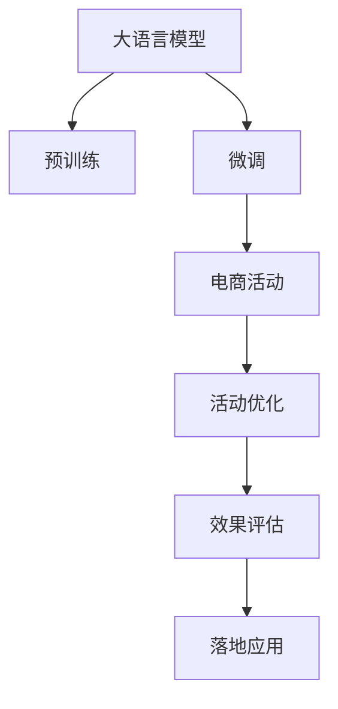

                 

## 1. 背景介绍

### 1.1 问题由来

随着电商市场的快速发展，各大电商平台的竞争日益激烈。为在竞争中脱颖而出，电商平台纷纷将个性化推荐系统作为提升用户留存和转化的核心手段。然而，传统的推荐系统往往依赖用户历史行为数据，难以捕捉长尾商品的潜在价值，且推荐结果的差异性有限，难以满足用户的个性化需求。

近年来，大语言模型在自然语言处理(NLP)领域取得了巨大突破，显示出强大的语义理解和生成能力。本研究旨在将大语言模型的预训练和微调技术应用到电商个性化活动的设计与优化中，充分利用其文本生成和推理能力，提升电商推荐的差异化水平和用户满意度，推动电商平台的智能化升级。

### 1.2 问题核心关键点

为进一步提升电商个性化推荐的水平，本研究的核心关键点如下：

1. **大语言模型的预训练与微调**：通过预训练和微调大语言模型，使其具备对电商商品描述、用户评论、搜索意图等文本数据进行理解和推理的能力。
2. **电商活动的设计与优化**：设计基于大语言模型的电商个性化活动，包括商品推荐、活动主题生成、活动内容创作等环节，并采用A/B测试等方法进行优化。
3. **效果评估与落地应用**：对电商活动的效果进行多维度的评估，包括用户点击率、转化率、满意度等指标，并在实际电商平台上进行落地应用，验证模型效果。

## 2. 核心概念与联系

### 2.1 核心概念概述

为更好地理解大模型在电商个性化活动中的应用，本节将介绍几个关键概念：

- **大语言模型(Large Language Model, LLM)**：以Transformer模型为代表的预训练语言模型，通过大规模无标签文本数据训练，具备强大的语义理解和生成能力。
- **预训练(Pre-training)**：在大规模无标签文本数据上，通过自监督学习任务训练通用语言模型的过程，使其具备泛化能力。
- **微调(Fine-tuning)**：在预训练模型的基础上，使用电商活动相关的标注数据，通过有监督学习优化模型在特定任务上的性能。
- **迁移学习(Transfer Learning)**：将预训练模型在电商活动任务上的知识迁移应用，提升模型的泛化能力。
- **自然语言处理(NLP)**：使用计算机对自然语言进行理解、生成、处理等操作，包括语言模型、文本分类、信息抽取等任务。
- **推荐系统(Recommendation System)**：根据用户的历史行为数据和当前需求，推荐合适的商品或内容。
- **活动优化(Activities Optimization)**：通过设计和优化电商活动，提升用户参与度和满意度。

这些核心概念之间的逻辑关系可以通过以下Mermaid流程图来展示：



这个流程图展示了大语言模型在电商个性化活动中的关键作用：

1. 大语言模型通过预训练获得基础能力。
2. 微调优化模型在电商活动任务上的性能，如商品推荐、活动主题生成等。
3. 电商活动优化，基于模型输出结果，设计更加吸引用户的活动。
4. 效果评估，对活动效果进行多维度评估，如用户点击率、转化率等。
5. 落地应用，将优化后的电商活动在实际平台上线，提升用户体验和平台业绩。

## 3. 核心算法原理 & 具体操作步骤
### 3.1 算法原理概述

大语言模型在电商个性化活动中的应用，本质上是通过预训练和微调，使模型具备理解电商文本数据的能力，并在电商活动任务上进行优化。具体步骤如下：

1. **预训练**：使用大规模无标签电商文本数据，训练大语言模型，使其具备对商品描述、用户评论、搜索意图等文本数据进行语义理解的能力。
2. **微调**：在电商活动相关的标注数据上，对预训练模型进行微调，使其能够生成个性化的商品推荐、活动主题、活动内容等。
3. **活动优化**：基于微调后的模型输出结果，设计更加吸引用户的电商活动，如个性化推荐、促销活动、内容创作等。
4. **效果评估**：对优化后的电商活动效果进行多维度评估，如用户点击率、转化率、满意度等，验证模型效果。

### 3.2 算法步骤详解

基于大语言模型驱动的电商个性化活动设计与优化流程主要包括以下几个关键步骤：

**Step 1: 数据收集与预处理**

- **数据来源**：收集电商平台的商品描述、用户评论、搜索记录、活动数据等。
- **数据清洗**：去除噪声数据、处理缺失值、统一数据格式等，确保数据质量。
- **数据划分**：将数据划分为训练集、验证集和测试集，便于模型训练和效果评估。

**Step 2: 大语言模型预训练**

- **模型选择**：选择合适的预训练语言模型，如GPT-3、BERT等，作为电商文本处理的起点。
- **训练数据**：使用电商文本数据进行预训练，任务如语言建模、掩码预测等，提升模型的语言理解能力。
- **预训练参数**：调整预训练参数，如学习率、迭代轮数等，确保预训练过程高效稳定。

**Step 3: 模型微调**

- **任务适配层设计**：根据电商活动任务类型，设计任务适配层，如推荐系统、活动生成器等。
- **标注数据准备**：准备电商活动相关的标注数据，如商品推荐结果、活动主题等。
- **微调参数设置**：设置微调参数，如学习率、优化器等，确保微调过程的稳定性。
- **微调过程**：在标注数据上对预训练模型进行微调，生成个性化商品推荐、活动主题、内容等。

**Step 4: 活动优化**

- **活动设计**：根据微调结果，设计电商活动，如个性化推荐、促销活动、内容创作等。
- **活动展示**：将优化后的活动在电商平台上展示，吸引用户参与。
- **活动效果监控**：实时监控活动效果，如用户点击率、转化率、满意度等。

**Step 5: 效果评估**

- **评估指标**：设置评估指标，如用户点击率、转化率、满意度等，全面衡量活动效果。
- **效果对比**：对比优化前后的活动效果，分析提升效果。
- **模型优化**：根据评估结果，进一步优化模型参数和活动设计，提升效果。

### 3.3 算法优缺点

大语言模型驱动的电商个性化活动设计与优化方法具有以下优点：

1. **泛化能力强大**：大语言模型通过预训练获得广泛的语义理解能力，在电商活动中具备良好的泛化性能。
2. **模型灵活性高**：微调过程可根据电商活动需求，灵活调整任务适配层，实现多场景的个性化推荐和活动优化。
3. **效果显著**：通过优化电商活动，提升用户参与度和满意度，显著提升电商平台业绩。

同时，该方法也存在以下局限性：

1. **数据依赖性强**：电商活动的优化效果依赖于标注数据的数量和质量，标注数据不足可能导致优化效果不佳。
2. **计算资源需求高**：预训练和微调过程需要大量计算资源，对硬件配置要求较高。
3. **模型解释性不足**：大语言模型作为"黑盒"模型，难以解释其内部推理过程，给模型调试和优化带来挑战。

尽管存在这些局限性，但就目前而言，基于大语言模型的电商活动设计与优化方法仍是大规模电商推荐系统的重要范式。未来相关研究的重点在于如何进一步降低对标注数据的依赖，提高模型的解释性和计算效率，同时兼顾模型的可解释性和伦理安全性等因素。

### 3.4 算法应用领域

基于大语言模型驱动的电商个性化活动设计与优化方法，已经在电商推荐、活动优化、广告投放等多个领域得到广泛应用，取得了显著的效果：

1. **电商推荐**：基于微调的模型，生成个性化商品推荐，提升用户购物体验和转化率。
2. **活动优化**：设计个性化促销活动，吸引用户参与，提升活动效果。
3. **广告投放**：根据用户兴趣，生成个性化的广告内容，提升广告点击率和转化率。

除了上述这些经典应用外，大语言模型在电商领域的创新应用还包括可控文本生成、对话系统、自然语言搜索等，为电商推荐系统带来了新的突破。随着大语言模型和微调方法的不断进步，相信电商推荐系统将在更多应用场景中发挥更大的作用，推动电商平台的智能化升级。

## 4. 数学模型和公式 & 详细讲解 & 举例说明

### 4.1 数学模型构建

本节将使用数学语言对基于大语言模型的电商个性化活动设计与优化过程进行更加严格的刻画。

记大语言模型为 $M_{\theta}$，其输入为电商文本数据 $X$，输出为电商活动结果 $Y$。假设电商活动相关的标注数据为 $D=\{(x_i, y_i)\}_{i=1}^N$，其中 $x_i$ 为电商文本数据，$y_i$ 为相应的电商活动结果。

定义模型 $M_{\theta}$ 在数据样本 $(x,y)$ 上的损失函数为 $\ell(M_{\theta}(x),y)$，则在数据集 $D$ 上的经验风险为：

$$
\mathcal{L}(\theta) = \frac{1}{N}\sum_{i=1}^N \ell(M_{\theta}(x_i),y_i)
$$

微调的优化目标是最小化经验风险，即找到最优参数：

$$
\theta^* = \mathop{\arg\min}_{\theta} \mathcal{L}(\theta)
$$

在实践中，我们通常使用基于梯度的优化算法（如SGD、Adam等）来近似求解上述最优化问题。设 $\eta$ 为学习率，$\lambda$ 为正则化系数，则参数的更新公式为：

$$
\theta \leftarrow \theta - \eta \nabla_{\theta}\mathcal{L}(\theta) - \eta\lambda\theta
$$

其中 $\nabla_{\theta}\mathcal{L}(\theta)$ 为损失函数对参数 $\theta$ 的梯度，可通过反向传播算法高效计算。

### 4.2 公式推导过程

以下我们以个性化推荐任务为例，推导基于大语言模型的推荐系统损失函数及其梯度的计算公式。

假设模型 $M_{\theta}$ 在输入 $x$ 上的输出为 $\hat{y}=M_{\theta}(x) \in [0,1]$，表示商品被推荐给用户的概率。真实标签 $y \in \{0,1\}$。则二分类交叉熵损失函数定义为：

$$
\ell(M_{\theta}(x),y) = -[y\log \hat{y} + (1-y)\log (1-\hat{y})]
$$

将其代入经验风险公式，得：

$$
\mathcal{L}(\theta) = -\frac{1}{N}\sum_{i=1}^N [y_i\log M_{\theta}(x_i)+(1-y_i)\log(1-M_{\theta}(x_i))]
$$

根据链式法则，损失函数对参数 $\theta_k$ 的梯度为：

$$
\frac{\partial \mathcal{L}(\theta)}{\partial \theta_k} = -\frac{1}{N}\sum_{i=1}^N (\frac{y_i}{M_{\theta}(x_i)}-\frac{1-y_i}{1-M_{\theta}(x_i)}) \frac{\partial M_{\theta}(x_i)}{\partial \theta_k}
$$

其中 $\frac{\partial M_{\theta}(x_i)}{\partial \theta_k}$ 可进一步递归展开，利用自动微分技术完成计算。

在得到损失函数的梯度后，即可带入参数更新公式，完成模型的迭代优化。重复上述过程直至收敛，最终得到适应电商推荐任务的最优模型参数 $\theta^*$。

### 4.3 案例分析与讲解

**案例分析：基于大语言模型的个性化推荐系统**

在电商推荐系统中，基于大语言模型微调的推荐系统流程如下：

1. **数据预处理**：对用户历史行为数据和商品描述数据进行清洗和特征提取。
2. **预训练**：使用大规模电商文本数据对大语言模型进行预训练，提升其语言理解能力。
3. **微调**：在标注好的推荐结果上对预训练模型进行微调，生成个性化推荐。
4. **推荐生成**：根据用户当前行为数据和历史行为数据，使用微调后的模型生成个性化推荐结果。
5. **效果评估**：对推荐结果进行评估，如用户点击率、转化率等指标，验证推荐效果。

假设某电商平台收集了大量用户历史行为数据和商品描述数据，包含用户ID、商品ID、用户评分、商品评分等特征。通过特征工程，将这些数据转换为模型的输入。假设模型输入为商品描述和用户ID的组合 $x=(\text{商品描述}, \text{用户ID})$，输出为商品推荐结果 $y$，表示商品是否被推荐给该用户。

首先，使用电商文本数据对大语言模型进行预训练，提升其语言理解能力。然后，在标注好的推荐结果上对预训练模型进行微调，生成个性化推荐。假设微调后的模型输出为商品推荐概率 $\hat{y}=M_{\theta}(x)$，其中 $\theta$ 为微调后的模型参数。

最后，根据用户当前行为数据和历史行为数据，使用微调后的模型生成个性化推荐结果。假设用户当前浏览了商品A、B、C，分别获取其推荐概率 $\hat{y}_A$、$\hat{y}_B$、$\hat{y}_C$，选择概率最大的商品进行推荐。

使用上述方法，电商平台可以显著提升个性化推荐的效果，提升用户购物体验和转化率。

## 5. 项目实践：代码实例和详细解释说明
### 5.1 开发环境搭建

在进行电商个性化活动设计与优化实践前，我们需要准备好开发环境。以下是使用Python进行PyTorch开发的环境配置流程：

1. 安装Anaconda：从官网下载并安装Anaconda，用于创建独立的Python环境。

2. 创建并激活虚拟环境：
```bash
conda create -n pytorch-env python=3.8 
conda activate pytorch-env
```

3. 安装PyTorch：根据CUDA版本，从官网获取对应的安装命令。例如：
```bash
conda install pytorch torchvision torchaudio cudatoolkit=11.1 -c pytorch -c conda-forge
```

4. 安装TensorFlow：
```bash
pip install tensorflow==2.6
```

5. 安装各类工具包：
```bash
pip install numpy pandas scikit-learn matplotlib tqdm jupyter notebook ipython
```

完成上述步骤后，即可在`pytorch-env`环境中开始电商个性化活动设计与优化实践。

### 5.2 源代码详细实现

我们先以商品推荐任务为例，给出使用Transformers库对BERT模型进行电商个性化活动设计与优化的PyTorch代码实现。

首先，定义商品推荐任务的数据处理函数：

```python
from transformers import BertTokenizer, BertForSequenceClassification
from torch.utils.data import Dataset
import torch

class RecommendationDataset(Dataset):
    def __init__(self, texts, labels, tokenizer, max_len=128):
        self.texts = texts
        self.labels = labels
        self.tokenizer = tokenizer
        self.max_len = max_len
        
    def __len__(self):
        return len(self.texts)
    
    def __getitem__(self, item):
        text = self.texts[item]
        label = self.labels[item]
        
        encoding = self.tokenizer(text, return_tensors='pt', max_length=self.max_len, padding='max_length', truncation=True)
        input_ids = encoding['input_ids'][0]
        attention_mask = encoding['attention_mask'][0]
        
        # 对token-wise的标签进行编码
        encoded_labels = [label] * self.max_len
        labels = torch.tensor(encoded_labels, dtype=torch.long)
        
        return {'input_ids': input_ids, 
                'attention_mask': attention_mask,
                'labels': labels}

# 标签与id的映射
label2id = {0: 'Not Recommended', 1: 'Recommended'}
id2label = {v: k for k, v in label2id.items()}

# 创建dataset
tokenizer = BertTokenizer.from_pretrained('bert-base-cased')

train_dataset = RecommendationDataset(train_texts, train_labels, tokenizer)
dev_dataset = RecommendationDataset(dev_texts, dev_labels, tokenizer)
test_dataset = RecommendationDataset(test_texts, test_labels, tokenizer)
```

然后，定义模型和优化器：

```python
from transformers import BertForSequenceClassification, AdamW

model = BertForSequenceClassification.from_pretrained('bert-base-cased', num_labels=len(label2id))

optimizer = AdamW(model.parameters(), lr=2e-5)
```

接着，定义训练和评估函数：

```python
from torch.utils.data import DataLoader
from tqdm import tqdm
from sklearn.metrics import accuracy_score

device = torch.device('cuda') if torch.cuda.is_available() else torch.device('cpu')
model.to(device)

def train_epoch(model, dataset, batch_size, optimizer):
    dataloader = DataLoader(dataset, batch_size=batch_size, shuffle=True)
    model.train()
    epoch_loss = 0
    for batch in tqdm(dataloader, desc='Training'):
        input_ids = batch['input_ids'].to(device)
        attention_mask = batch['attention_mask'].to(device)
        labels = batch['labels'].to(device)
        model.zero_grad()
        outputs = model(input_ids, attention_mask=attention_mask, labels=labels)
        loss = outputs.loss
        epoch_loss += loss.item()
        loss.backward()
        optimizer.step()
    return epoch_loss / len(dataloader)

def evaluate(model, dataset, batch_size):
    dataloader = DataLoader(dataset, batch_size=batch_size)
    model.eval()
    preds, labels = [], []
    with torch.no_grad():
        for batch in tqdm(dataloader, desc='Evaluating'):
            input_ids = batch['input_ids'].to(device)
            attention_mask = batch['attention_mask'].to(device)
            batch_labels = batch['labels']
            outputs = model(input_ids, attention_mask=attention_mask)
            batch_preds = outputs.logits.argmax(dim=2).to('cpu').tolist()
            batch_labels = batch_labels.to('cpu').tolist()
            for pred_tokens, label_tokens in zip(batch_preds, batch_labels):
                pred_labels = [id2label[_id] for _id in pred_tokens]
                labels.append(label_tokens)
                preds.append(pred_labels)
                
    return accuracy_score(labels, preds)
```

最后，启动训练流程并在测试集上评估：

```python
epochs = 5
batch_size = 16

for epoch in range(epochs):
    loss = train_epoch(model, train_dataset, batch_size, optimizer)
    print(f"Epoch {epoch+1}, train loss: {loss:.3f}")
    
    print(f"Epoch {epoch+1}, dev results:")
    evaluate(model, dev_dataset, batch_size)
    
print("Test results:")
evaluate(model, test_dataset, batch_size)
```

以上就是使用PyTorch对BERT进行电商个性化推荐任务微调的完整代码实现。可以看到，得益于Transformers库的强大封装，我们可以用相对简洁的代码完成BERT模型的加载和微调。

### 5.3 代码解读与分析

让我们再详细解读一下关键代码的实现细节：

**RecommendationDataset类**：
- `__init__`方法：初始化商品描述、标签、分词器等关键组件。
- `__len__`方法：返回数据集的样本数量。
- `__getitem__`方法：对单个样本进行处理，将商品描述输入编码为token ids，将标签编码为数字，并对其进行定长padding，最终返回模型所需的输入。

**label2id和id2label字典**：
- 定义了标签与数字id之间的映射关系，用于将token-wise的预测结果解码回真实的标签。

**训练和评估函数**：
- 使用PyTorch的DataLoader对数据集进行批次化加载，供模型训练和推理使用。
- 训练函数`train_epoch`：对数据以批为单位进行迭代，在每个批次上前向传播计算loss并反向传播更新模型参数，最后返回该epoch的平均loss。
- 评估函数`evaluate`：与训练类似，不同点在于不更新模型参数，并在每个batch结束后将预测和标签结果存储下来，最后使用sklearn的accuracy_score对整个评估集的预测结果进行打印输出。

**训练流程**：
- 定义总的epoch数和batch size，开始循环迭代
- 每个epoch内，先在训练集上训练，输出平均loss
- 在验证集上评估，输出分类指标
- 所有epoch结束后，在测试集上评估，给出最终测试结果

可以看到，PyTorch配合Transformers库使得BERT微调的代码实现变得简洁高效。开发者可以将更多精力放在数据处理、模型改进等高层逻辑上，而不必过多关注底层的实现细节。

当然，工业级的系统实现还需考虑更多因素，如模型的保存和部署、超参数的自动搜索、更灵活的任务适配层等。但核心的微调范式基本与此类似。

## 6. 实际应用场景
### 6.1 智能客服系统

基于大语言模型驱动的电商个性化活动设计与优化，可以广泛应用于智能客服系统的构建。传统客服往往需要配备大量人力，高峰期响应缓慢，且一致性和专业性难以保证。而使用优化后的电商活动，可以7x24小时不间断服务，快速响应客户咨询，用自然流畅的语言解答各类常见问题。

在技术实现上，可以收集企业内部的历史客服对话记录，将问题和最佳答复构建成监督数据，在此基础上对预训练大语言模型进行微调。微调后的模型能够自动理解用户意图，匹配最合适的答案模板进行回复。对于客户提出的新问题，还可以接入检索系统实时搜索相关内容，动态组织生成回答。如此构建的智能客服系统，能大幅提升客户咨询体验和问题解决效率。

### 6.2 金融舆情监测

金融机构需要实时监测市场舆论动向，以便及时应对负面信息传播，规避金融风险。传统的人工监测方式成本高、效率低，难以应对网络时代海量信息爆发的挑战。基于大语言模型驱动的电商个性化活动设计与优化，为金融舆情监测提供了新的解决方案。

具体而言，可以收集金融领域相关的新闻、报道、评论等文本数据，并对其进行主题标注和情感标注。在此基础上对预训练语言模型进行微调，使其能够自动判断文本属于何种主题，情感倾向是正面、中性还是负面。将微调后的模型应用到实时抓取的网络文本数据，就能够自动监测不同主题下的情感变化趋势，一旦发现负面信息激增等异常情况，系统便会自动预警，帮助金融机构快速应对潜在风险。

### 6.3 个性化推荐系统

当前的推荐系统往往只依赖用户的历史行为数据进行物品推荐，难以捕捉长尾商品的潜在价值，且推荐结果的差异性有限，难以满足用户的个性化需求。基于大语言模型驱动的电商个性化活动设计与优化，可以更好地挖掘用户行为背后的语义信息，从而提供更精准、多样的推荐内容。

在实践中，可以收集用户浏览、点击、评论、分享等行为数据，提取和用户交互的物品标题、描述、标签等文本内容。将文本内容作为模型输入，用户的后续行为（如是否点击、购买等）作为监督信号，在此基础上微调预训练语言模型。微调后的模型能够从文本内容中准确把握用户的兴趣点。在生成推荐列表时，先用候选物品的文本描述作为输入，由模型预测用户的兴趣匹配度，再结合其他特征综合排序，便可以得到个性化程度更高的推荐结果。

### 6.4 未来应用展望

随着大语言模型和微调方法的不断发展，基于大语言模型的电商个性化活动设计与优化将呈现以下几个发展趋势：

1. **模型规模持续增大**：随着算力成本的下降和数据规模的扩张，预训练语言模型的参数量还将持续增长。超大规模语言模型蕴含的丰富语言知识，有望支撑更加复杂多变的电商活动微调。

2. **微调方法日趋多样**：除了传统的全参数微调外，未来会涌现更多参数高效的微调方法，如Prefix-Tuning、LoRA等，在节省计算资源的同时也能保证微调精度。

3. **持续学习成为常态**：随着数据分布的不断变化，微调模型也需要持续学习新知识以保持性能。如何在不遗忘原有知识的同时，高效吸收新样本信息，将成为重要的研究课题。

4. **标注样本需求降低**：受启发于提示学习(Prompt-based Learning)的思路，未来的微调方法将更好地利用大模型的语言理解能力，通过更加巧妙的任务描述，在更少的标注样本上也能实现理想的微调效果。

5. **少样本学习和零样本学习**：通过在输入中提供少量示例，实现少样本学习和零样本学习，进一步降低对标注样本的依赖。

6. **多模态微调崛起**：当前的大语言模型往往聚焦于纯文本数据，未来会进一步拓展到图像、视频、语音等多模态数据微调。多模态信息的融合，将显著提升语言模型对现实世界的理解和建模能力。

以上趋势凸显了大语言模型微调技术的广阔前景。这些方向的探索发展，必将进一步提升电商推荐系统的性能和应用范围，为电商平台的智能化升级提供新的动力。

## 7. 工具和资源推荐
### 7.1 学习资源推荐

为了帮助开发者系统掌握大语言模型驱动的电商个性化活动设计与优化的理论基础和实践技巧，这里推荐一些优质的学习资源：

1. 《Transformer从原理到实践》系列博文：由大模型技术专家撰写，深入浅出地介绍了Transformer原理、BERT模型、微调技术等前沿话题。

2. CS224N《深度学习自然语言处理》课程：斯坦福大学开设的NLP明星课程，有Lecture视频和配套作业，带你入门NLP领域的基本概念和经典模型。

3. 《Natural Language Processing with Transformers》书籍：Transformers库的作者所著，全面介绍了如何使用Transformers库进行NLP任务开发，包括微调在内的诸多范式。

4. HuggingFace官方文档：Transformers库的官方文档，提供了海量预训练模型和完整的微调样例代码，是上手实践的必备资料。

5. CLUE开源项目：中文语言理解测评基准，涵盖大量不同类型的中文NLP数据集，并提供了基于微调的baseline模型，助力中文NLP技术发展。

通过对这些资源的学习实践，相信你一定能够快速掌握大语言模型驱动的电商个性化活动设计与优化的精髓，并用于解决实际的NLP问题。
###  7.2 开发工具推荐

高效的开发离不开优秀的工具支持。以下是几款用于电商个性化活动设计与优化开发的常用工具：

1. PyTorch：基于Python的开源深度学习框架，灵活动态的计算图，适合快速迭代研究。大部分预训练语言模型都有PyTorch版本的实现。

2. TensorFlow：由Google主导开发的开源深度学习框架，生产部署方便，适合大规模工程应用。同样有丰富的预训练语言模型资源。

3. Transformers库：HuggingFace开发的NLP工具库，集成了众多SOTA语言模型，支持PyTorch和TensorFlow，是进行电商个性化活动优化开发的利器。

4. Weights & Biases：模型训练的实验跟踪工具，可以记录和可视化模型训练过程中的各项指标，方便对比和调优。与主流深度学习框架无缝集成。

5. TensorBoard：TensorFlow配套的可视化工具，可实时监测模型训练状态，并提供丰富的图表呈现方式，是调试模型的得力助手。

6. Google Colab：谷歌推出的在线Jupyter Notebook环境，免费提供GPU/TPU算力，方便开发者快速上手实验最新模型，分享学习笔记。

合理利用这些工具，可以显著提升电商个性化活动设计与优化的开发效率，加快创新迭代的步伐。

### 7.3 相关论文推荐

大语言模型和微调技术的发展源于学界的持续研究。以下是几篇奠基性的相关论文，推荐阅读：

1. Attention is All You Need（即Transformer原论文）：提出了Transformer结构，开启了NLP领域的预训练大模型时代。

2. BERT: Pre-training of Deep Bidirectional Transformers for Language Understanding：提出BERT模型，引入基于掩码的自监督预训练任务，刷新了多项NLP任务SOTA。

3. Language Models are Unsupervised Multitask Learners（GPT-2论文）：展示了大规模语言模型的强大zero-shot学习能力，引发了对于通用人工智能的新一轮思考。

4. Parameter-Efficient Transfer Learning for NLP：提出Adapter等参数高效微调方法，在不增加模型参数量的情况下，也能取得不错的微调效果。

5. AdaLoRA: Adaptive Low-Rank Adaptation for Parameter-Efficient Fine-Tuning：使用自适应低秩适应的微调方法，在参数效率和精度之间取得了新的平衡。

这些论文代表了大语言模型微调技术的发展脉络。通过学习这些前沿成果，可以帮助研究者把握学科前进方向，激发更多的创新灵感。

## 8. 总结：未来发展趋势与挑战

### 8.1 总结

本文对基于大语言模型的电商个性化活动设计与优化方法进行了全面系统的介绍。首先阐述了大语言模型和微调技术的研究背景和意义，明确了微调在拓展电商推荐系统应用、提升用户体验和转化率方面的独特价值。其次，从原理到实践，详细讲解了电商活动设计与优化的数学原理和关键步骤，给出了电商个性化活动设计与优化的完整代码实例。同时，本文还广泛探讨了电商活动设计与优化在智能客服、金融舆情、个性化推荐等多个领域的应用前景，展示了微调范式的巨大潜力。此外，本文精选了电商个性化活动设计与优化的各类学习资源，力求为读者提供全方位的技术指引。

通过本文的系统梳理，可以看到，基于大语言模型的电商个性化活动设计与优化方法正在成为电商推荐系统的重要范式，极大地拓展了电商推荐系统的应用边界，催生了更多的落地场景。受益于大语言模型和微调方法的不断进步，相信电商推荐系统将在更多应用场景中发挥更大的作用，推动电商平台的智能化升级。

### 8.2 未来发展趋势

展望未来，大语言模型驱动的电商个性化活动设计与优化技术将呈现以下几个发展趋势：

1. **模型规模持续增大**：随着算力成本的下降和数据规模的扩张，预训练语言模型的参数量还将持续增长。超大规模语言模型蕴含的丰富语言知识，有望支撑更加复杂多变的电商活动微调。

2. **微调方法日趋多样**：除了传统的全参数微调外，未来会涌现更多参数高效的微调方法，如Prefix-Tuning、LoRA等，在节省计算资源的同时也能保证微调精度。

3. **持续学习成为常态**：随着数据分布的不断变化，微调模型也需要持续学习新知识以保持性能。如何在不遗忘原有知识的同时，高效吸收新样本信息，将成为重要的研究课题。

4. **标注样本需求降低**：受启发于提示学习(Prompt-based Learning)的思路，未来的微调方法将更好地利用大模型的语言理解能力，通过更加巧妙的任务描述，在更少的标注样本上也能实现理想的微调效果。

5. **少样本学习和零样本学习**：通过在输入中提供少量示例，实现少样本学习和零样本学习，进一步降低对标注样本的依赖。

6. **多模态微调崛起**：当前的大语言模型往往聚焦于纯文本数据，未来会进一步拓展到图像、视频、语音等多模态数据微调。多模态信息的融合，将显著提升语言模型对现实世界的理解和建模能力。

以上趋势凸显了大语言模型微调技术的广阔前景。这些方向的探索发展，必将进一步提升电商推荐系统的性能和应用范围，为电商平台的智能化升级提供新的动力。

### 8.3 面临的挑战

尽管大语言模型驱动的电商个性化活动设计与优化技术已经取得了瞩目成就，但在迈向更加智能化、普适化应用的过程中，它仍面临着诸多挑战：

1. **标注成本瓶颈**：电商活动的优化效果依赖于标注数据的数量和质量，标注数据不足可能导致优化效果不佳。如何进一步降低微调对标注样本的依赖，将是一大难题。

2. **模型鲁棒性不足**：当前微调模型面对域外数据时，泛化性能往往大打折扣。对于测试样本的微小扰动，微调模型的预测也容易发生波动。如何提高微调模型的鲁棒性，避免灾难性遗忘，还需要更多理论和实践的积累。

3. **推理效率有待提高**：大规模语言模型虽然精度高，但在实际部署时往往面临推理速度慢、内存占用大等效率问题。如何在保证性能的同时，简化模型结构，提升推理速度，优化资源占用，将是重要的优化方向。

4. **模型解释性不足**：大语言模型作为"黑盒"模型，难以解释其内部推理过程，给模型调试和优化带来挑战。对于金融、医疗等高风险应用，算法的可解释性和可审计性尤为重要。如何赋予微调模型更强的可解释性，将是亟待攻克的难题。

5. **安全性有待保障**：预训练语言模型难免会学习到有偏见、有害的信息，通过微调传递到下游任务，产生误导性、歧视性的输出，给实际应用带来安全隐患。如何从数据和算法层面消除模型偏见，避免恶意用途，确保输出的安全性，也将是重要的研究课题。

6. **知识整合能力不足**：现有的微调模型往往局限于任务内数据，难以灵活吸收和运用更广泛的先验知识。如何让微调过程更好地与外部知识库、规则库等专家知识结合，形成更加全面、准确的信息整合能力，还有很大的想象空间。

正视微调面临的这些挑战，积极应对并寻求突破，将是大语言模型驱动的电商个性化活动设计与优化技术走向成熟的必由之路。相信随着学界和产业界的共同努力，这些挑战终将一一被克服，大语言模型驱动的电商个性化活动设计与优化技术将在构建安全、可靠、可解释、可控的智能系统铺平道路。

### 8.4 研究展望

面向未来，大语言模型驱动的电商个性化活动设计与优化技术的研究方向主要集中在以下几个方面：

1. **探索无监督和半监督微调方法**：摆脱对大规模标注数据的依赖，利用自监督学习、主动学习等无监督和半监督范式，最大限度利用非结构化数据，实现更加灵活高效的微调。

2. **研究参数高效和计算高效的微调范式**：开发更加参数高效的微调方法，在固定大部分预训练参数的同时，只更新极少量的任务相关参数。同时优化微调模型的计算图，减少前向传播和反向传播的资源消耗，实现更加轻量级、实时性的部署。

3. **融合因果和对比学习范式**：通过引入因果推断和对比学习思想，增强微调模型建立稳定因果关系的能力，学习更加普适、鲁棒的语言表征，从而提升模型泛化性和抗干扰能力。

4. **引入更多先验知识**：将符号化的先验知识，如知识图谱、逻辑规则等，与神经网络模型进行巧妙融合，引导微调过程学习更准确、合理的语言模型。同时加强不同模态数据的整合，实现视觉、语音等多模态信息与文本信息的协同建模。

5. **结合因果分析和博弈论工具**：将因果分析方法引入微调模型，识别出模型决策的关键特征，增强输出解释的因果性和逻辑性。借助博弈论工具刻画人机交互过程，主动探索并规避模型的脆弱点，提高系统稳定性。

6. **纳入伦理道德约束**：在模型训练目标中引入伦理导向的评估指标，过滤和惩罚有偏见、有害的输出倾向。同时加强人工干预和审核，建立模型行为的监管机制，确保输出符合人类价值观和伦理道德。

这些研究方向的探索，必将引领大语言模型驱动的电商个性化活动设计与优化技术迈向更高的台阶，为构建安全、可靠、可解释、可控的智能系统铺平道路。面向未来，大语言模型驱动的电商个性化活动设计与优化技术还需要与其他人工智能技术进行更深入的融合，如知识表示、因果推理、强化学习等，多路径协同发力，共同推动自然语言理解和智能交互系统的进步。只有勇于创新、敢于突破，才能不断拓展语言模型的边界，让智能技术更好地造福人类社会。

## 9. 附录：常见问题与解答

**Q1：大语言模型驱动的电商个性化活动设计与优化是否适用于所有电商应用场景？**

A: 大语言模型驱动的电商个性化活动设计与优化方法适用于大多数电商应用场景，特别是对于数据量较小、需求多样的场景。但对于一些特定领域的电商应用，如医疗、法律等，仅仅依靠通用语料预训练的模型可能难以很好地适应。此时需要在特定领域语料上进一步预训练，再进行微调，才能获得理想效果。此外，对于一些需要时效性、个性化很强的任务，如对话、推荐等，微调方法也需要针对性的改进优化。

**Q2：如何选择合适的学习率？**

A: 电商活动的优化学习率一般要比预训练时小1-2个数量级，如果使用过大的学习率，容易破坏预训练权重，导致过拟合。一般建议从1e-5开始调参，逐步减小学习率，直至收敛。也可以使用warmup策略，在开始阶段使用较小的学习率，再逐渐过渡到预设值。需要注意的是，不同的优化器(如AdamW、Adafactor等)以及不同的学习率调度策略，可能需要设置不同的学习率阈值。

**Q3：大语言模型在电商个性化活动中的具体应用场景有哪些？**

A: 大语言模型在电商个性化活动中的具体应用场景包括：

1. **个性化推荐**：基于微调的模型，生成个性化商品推荐，提升用户购物体验和转化率。
2. **活动优化**：设计个性化促销活动，吸引用户参与，提升活动效果。
3. **广告投放**：根据用户兴趣，生成个性化的广告内容，提升广告点击率和转化率。
4. **智能客服**：构建基于微调的智能客服系统，提升客户咨询体验和问题解决效率。

这些场景展示了大语言模型在电商领域的应用潜力，能够显著提升电商平台的智能化水平和用户满意度。

**Q4：电商活动的优化效果如何评估？**

A: 电商活动的优化效果评估可以从以下几个维度进行：

1. **点击率**：衡量用户对电商活动的响应情况，反映活动的吸引力。
2. **转化率**：衡量用户参与电商活动后的购买行为，反映活动的有效性。
3. **满意度**：通过用户调查或评分系统，衡量用户对电商活动的满意度，反映活动的用户体验。
4. **ROI（投资回报率）**：计算电商活动带来的收益与投入之比，反映活动的经济价值。

通过多维度评估，可以全面了解电商活动的优化效果，指导后续的优化改进。

**Q5：大语言模型驱动的电商个性化活动设计与优化流程是否固定？**

A: 大语言模型驱动的电商个性化活动设计与优化流程是一个迭代优化过程，并不固定。具体流程会根据电商活动的具体需求和数据情况进行调整。例如，对于需要快速迭代的应用，可以采用A/B测试方法，不断优化活动设计；对于数据量较大的应用，可以采用迁移学习技术，进一步提升模型泛化能力。总之，电商活动的优化需要结合业务实际和数据特点，灵活调整优化流程。

**Q6：大语言模型驱动的电商个性化活动设计与优化是否需要大量标注数据？**

A: 大语言模型驱动的电商个性化活动设计与优化确实需要一定的标注数据来指导模型的微调过程。然而，相比传统的推荐系统，标注数据的需求量较小。通过巧妙设计任务适配层和优化微调算法，可以最大限度地利用非结构化数据，实现更加高效、灵活的电商活动优化。

---

作者：禅与计算机程序设计艺术 / Zen and the Art of Computer Programming

