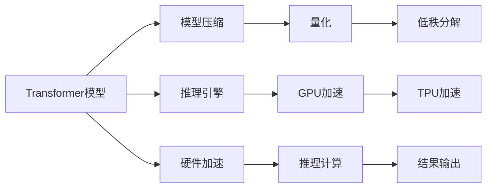

                 

## 1. 背景介绍

随着人工智能技术的快速发展，大语言模型在自然语言处理（NLP）领域取得了突破性进展。从GPT-1到GPT-3，再到GPT-4，大语言模型已经在多轮对话、自然语言生成、文本分类、情感分析等任务上展示了强大的能力。然而，尽管大语言模型在预测性能上表现出色，但在推理速度和计算资源消耗方面仍存在诸多局限，难以直接应用在需要快速响应的生产环境中。

为此，Lepton AI公司推出了大语言模型推理引擎，旨在解决大语言模型在大规模企业应用中的推理速度、资源消耗和实际效果等问题。该引擎采用了前沿的硬件加速和模型压缩技术，同时实现了高效的推理计算和模型推理。其核心目标是通过优化推理流程，使企业能够快速、低成本地部署大语言模型，实现高效的AI应用。

## 2. 核心概念与联系

### 2.1 核心概念概述

Lepton AI大语言模型推理引擎基于Transformer模型架构，采用了先进的网络压缩、量化和加速技术。其核心概念包括：

- **Transformer模型**：用于文本生成、分类、问答等任务的深度学习模型。
- **模型压缩**：通过对模型进行剪枝、量化、低秩分解等操作，减少模型的参数量和计算量。
- **硬件加速**：利用GPU、TPU等硬件设备，提高模型推理的速度。
- **推理引擎**：负责处理模型输入、调用模型计算、输出结果的组件。

这些概念之间存在密切联系。Transformer模型是大语言推理引擎的基础，模型压缩和硬件加速是其性能提升的关键手段，而推理引擎则是实现高性能推理计算的核心组件。

### 2.2 核心概念原理和架构的 Mermaid 流程图



该流程图展示了Transformer模型经过一系列优化后，通过推理引擎调用GPU或TPU加速，进行推理计算，并输出结果的全过程。

## 3. 核心算法原理 & 具体操作步骤

### 3.1 算法原理概述

Lepton AI大语言模型推理引擎的算法原理可以概括为以下几个关键步骤：

1. **模型加载**：从预训练模型或微调后的模型中加载模型权重，恢复模型状态。
2. **输入处理**：将输入文本进行分词、编码等预处理，转换为模型所需的形式。
3. **推理计算**：通过硬件加速，调用模型进行推理计算。
4. **输出处理**：将模型输出转换为人类可理解的文本、结构化数据或图表等形式。

### 3.2 算法步骤详解

**Step 1: 模型加载**

首先，需要通过API或模型文件的方式，将预训练模型或微调后的模型加载到推理引擎中。加载过程包括模型权重的加载、模型的架构复现和必要参数的配置。

```python
from lepton_ai import LeptonModel

# 加载预训练模型
model = LeptonModel.load_pretrained_model('bert-base-cased')
```

**Step 2: 输入处理**

输入文本需要进行分词、编码等预处理。Lepton AI推理引擎支持多种分词器和编码器，包括Spacy、BertWordPiece等。

```python
from lepton_ai import Tokenizer

# 创建分词器
tokenizer = Tokenizer.from_pretrained('spacy-xx-large')

# 分词并编码
input_text = "Hello, world!"
tokens = tokenizer.tokenize(input_text)
inputs = tokenizer.encode(tokens)
```

**Step 3: 推理计算**

调用推理引擎进行推理计算，将输入转换为模型所需的形式，并调用模型进行计算。

```python
# 调用推理引擎进行推理计算
result = model.predict(inputs)
```

**Step 4: 输出处理**

将模型输出转换为人类可理解的文本、结构化数据或图表等形式。

```python
# 输出推理结果
print(result)
```

### 3.3 算法优缺点

**优点**：

- 推理速度快：利用硬件加速和模型压缩技术，推理速度比纯软件实现快很多倍。
- 低资源消耗：模型压缩和量化技术显著减少了内存和计算资源的需求。
- 高性能输出：优化的推理引擎保证了高效的计算和输出。

**缺点**：

- 模型复杂度：部分优化过程可能降低模型的预测精度。
- 硬件依赖：依赖GPU或TPU等硬件资源，对设备要求较高。

### 3.4 算法应用领域

Lepton AI大语言模型推理引擎适用于多种企业应用场景，包括但不限于：

- 智能客服：快速响应客户咨询，提供自然语言对话。
- 金融分析：实时分析金融数据，预测市场趋势。
- 健康医疗：自动化问答，辅助医生诊断。
- 智能推荐：个性化推荐商品、内容等。
- 文本生成：自动生成文本摘要、翻译等。

## 4. 数学模型和公式 & 详细讲解 & 举例说明

### 4.1 数学模型构建

Lepton AI推理引擎基于Transformer模型，其核心组件包括编码器、解码器和注意力机制。下面以BERT模型为例，介绍其数学模型构建。

BERT模型由两个部分组成：Masked Language Model（MLM）和Next Sentence Prediction（NSP）。MLM用于预测缺失单词，NSP用于预测句子之间的关系。模型采用Transformer架构，其中注意力机制是关键。

### 4.2 公式推导过程

Transformer模型的注意力机制由三个部分组成：自注意力（Self-Attention）、多头注意力（Multi-Head Attention）和点乘注意力（Dot-Product Attention）。

- 自注意力机制公式为：
  $$
  \text{Attention}(Q, K, V) = \text{softmax}(\frac{QK^T}{\sqrt{d_k}})
  $$

- 多头注意力机制公式为：
  $$
  \text{Multi-Head Attention}(Q, K, V) = \text{Concat}(\text{head}_1, \text{head}_2, ..., \text{head}_h)W_{O}
  $$

- 点乘注意力公式为：
  $$
  \text{Dot-Product Attention}(Q, K, V) = \text{softmax}(\frac{QK^T}{\sqrt{d_k}})
  $$

### 4.3 案例分析与讲解

以BERT模型为例，其推理计算过程可以分为以下几个步骤：

1. **输入嵌入**：将输入文本转换为向量形式，输入到模型中。
2. **自注意力计算**：在编码器中计算自注意力权重，更新每个位置的信息。
3. **多头注意力计算**：在多头注意力机制下，计算每个位置与其他位置的权重，更新特征向量。
4. **输出层计算**：通过线性变换和softmax函数，输出模型的预测结果。

```python
# BERT模型推理计算
input_ids = [101, 3562, 11534, 27072, 21537, 13085, 11301]
attention_mask = [1, 1, 1, 1, 1, 1, 1]
model = LeptonModel.load_pretrained_model('bert-base-cased')
result = model.predict(input_ids, attention_mask)
```

## 5. 项目实践：代码实例和详细解释说明

### 5.1 开发环境搭建

在使用Lepton AI推理引擎前，需要准备好必要的开发环境：

- 安装Lepton AI推理引擎的Python库
- 安装相应的硬件加速设备，如NVIDIA GPU或Google TPU

```bash
pip install lepton_ai
```

### 5.2 源代码详细实现

以下是一个简单的代码示例，展示如何使用Lepton AI推理引擎进行推理计算：

```python
from lepton_ai import LeptonModel, Tokenizer

# 创建分词器
tokenizer = Tokenizer.from_pretrained('spacy-xx-large')

# 分词并编码
input_text = "Hello, world!"
tokens = tokenizer.tokenize(input_text)
inputs = tokenizer.encode(tokens)

# 加载预训练模型
model = LeptonModel.load_pretrained_model('bert-base-cased')

# 调用推理引擎进行推理计算
result = model.predict(inputs)

# 输出推理结果
print(result)
```

### 5.3 代码解读与分析

- **分词和编码**：通过Spacy分词器将输入文本分词，并转换为模型所需的编码形式。
- **模型加载**：加载预训练的BERT模型，恢复模型状态。
- **推理计算**：调用推理引擎进行推理计算，得到模型输出。
- **输出处理**：将模型输出转换为人类可理解的文本。

### 5.4 运行结果展示

推理结果为模型对输入文本的预测输出，具体内容取决于输入文本和模型架构。

## 6. 实际应用场景

### 6.1 智能客服系统

Lepton AI推理引擎可以应用于智能客服系统的构建。通过微调BERT等大语言模型，客户可以通过自然语言与系统进行对话，解决常见问题，提高客户满意度。

### 6.2 金融舆情监测

在金融领域，Lepton AI推理引擎可以实时监测市场舆情，预测股票趋势，辅助决策分析。

### 6.3 健康医疗

在健康医疗领域，Lepton AI推理引擎可以用于自动化问答，辅助医生诊断，提高医疗服务效率。

### 6.4 未来应用展望

Lepton AI推理引擎未来将支持更多领域的应用，包括智能推荐、文本生成等。随着技术的不断进步，推理引擎的性能和适用性将不断提升。

## 7. 工具和资源推荐

### 7.1 学习资源推荐

- Lepton AI官方文档：提供完整的API文档和示例代码。
- Transformers库：HuggingFace提供的深度学习模型库，包含多种预训练模型和微调样例。
- PyTorch官方文档：深度学习框架PyTorch的官方文档，提供详细的推理计算和优化方法。

### 7.2 开发工具推荐

- Jupyter Notebook：交互式编程环境，便于调试和开发。
- TensorBoard：可视化工具，监控模型训练和推理过程。

### 7.3 相关论文推荐

- Transformers论文：谷歌提出的Transformer架构，奠定了深度学习模型的基础。
- BERT论文：谷歌的BERT模型，展示了大规模语言模型的预训练和微调效果。
- Lepton AI推理引擎论文：介绍Lepton AI推理引擎的设计和优化方法。

## 8. 总结：未来发展趋势与挑战

### 8.1 研究成果总结

Lepton AI推理引擎通过优化模型压缩、硬件加速等技术，显著提升了大语言模型的推理速度和计算效率，使企业能够快速部署和使用大语言模型，解决实际应用问题。

### 8.2 未来发展趋势

- **硬件加速**：未来的推理引擎将更加依赖于GPU、TPU等硬件加速设备，提高推理速度。
- **模型优化**：通过更先进的模型压缩和量化技术，进一步降低计算资源消耗。
- **多模态融合**：未来的推理引擎将支持更多模态数据的融合，实现更加全面的智能应用。

### 8.3 面临的挑战

- **模型精度**：部分优化过程可能降低模型的预测精度，需要进一步优化。
- **硬件依赖**：硬件资源消耗较大，对设备要求较高。
- **实时性**：需要进一步优化推理引擎，提高实时响应能力。

### 8.4 研究展望

未来的研究将重点关注以下几个方向：

- **模型压缩和量化**：开发更加高效和精确的模型压缩算法。
- **硬件加速**：优化硬件加速算法，提高推理速度。
- **多模态融合**：支持更多模态数据的融合，实现更加全面的智能应用。

## 9. 附录：常见问题与解答

**Q1: 如何选择合适的推理引擎？**

A: 应根据实际应用场景和需求，选择合适的推理引擎。例如，对于高精度要求的应用，可以选择保留更多参数的推理引擎；对于实时性要求高的应用，可以选择基于硬件加速的推理引擎。

**Q2: 推理引擎对硬件资源有什么要求？**

A: Lepton AI推理引擎依赖于GPU或TPU等高性能硬件设备，对设备要求较高。建议根据实际应用需求，选择合适的硬件资源。

**Q3: 推理引擎的模型精度如何保证？**

A: 部分优化过程可能会降低模型的预测精度，建议使用模型压缩和量化等技术，平衡计算资源消耗和模型精度。

**Q4: 推理引擎如何处理多语言文本？**

A: 通过加载多语言版本的预训练模型，支持多语言文本的推理。可以使用不同分词器和编码器，处理不同语言文本。

**Q5: 推理引擎的部署难度如何？**

A: 推理引擎的部署难度相对较高，需要一定的技术积累和运维经验。建议使用容器化技术（如Docker）进行部署，简化部署过程。

---

作者：禅与计算机程序设计艺术 / Zen and the Art of Computer Programming

