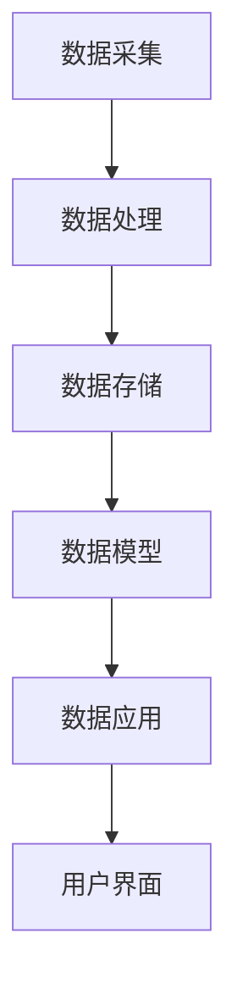

                 

### 文章标题

**AI DMP 数据基建的技术路线图**

在当今大数据时代，数据管理平台（DMP）作为企业数字化转型的关键基础设施，承担着对海量数据进行收集、存储、处理和分析的重要任务。本文将深入探讨 AI DMP 的数据基建技术路线图，从核心概念到实际应用，通过逻辑清晰、结构紧凑的叙述，为读者提供一份全面的技术指南。

> **Keywords**: AI DMP, Data Infrastructure, Big Data, Data Management Platform, AI Technology, Data Analytics

> **Abstract**: This article provides a comprehensive technical roadmap for AI-driven Data Management Platforms (DMPs). It covers the fundamental concepts, key algorithms, mathematical models, practical implementations, and application scenarios of DMPs. By using a step-by-step reasoning approach, readers can gain a deep understanding of the architecture and technical challenges in building an effective AI DMP.

### <a id="background"></a>1. 背景介绍（Background Introduction）

数据管理平台（DMP）是一种集中管理和分析用户数据的系统，它帮助企业更好地理解用户行为、兴趣和需求，从而实现更精准的营销和个性化服务。随着人工智能技术的快速发展，AI DMP 应运而生，将机器学习和数据挖掘算法引入到数据管理中，极大地提升了数据处理和分析的效率。

在传统的数据管理中，DMP 的主要功能包括数据收集、存储、清洗、合并和分发。然而，随着数据量的爆炸性增长和数据种类的多样性，传统的 DMP 已无法满足现代企业的需求。AI DMP 则通过引入深度学习、自然语言处理、图神经网络等先进技术，实现了自动化数据标签、用户画像、行为预测等高级功能。

AI DMP 的核心优势在于：

1. **高效的数据处理能力**：利用分布式计算和大数据处理技术，AI DMP 能够快速处理海量数据。
2. **精准的用户画像**：通过机器学习和数据挖掘，AI DMP 能够深度分析用户行为，构建精确的用户画像。
3. **智能的数据分析**：利用人工智能算法，AI DMP 可以自动发现数据中的模式和关联，为决策提供科学依据。
4. **智能的数据应用**：AI DMP 可以根据用户需求自动生成报告、建议和行动方案，提高业务效率。

### <a id="core-concepts"></a>2. 核心概念与联系（Core Concepts and Connections）

#### 2.1 什么是 DMP？

数据管理平台（DMP）是一种用于收集、存储、处理和分析用户数据的软件系统。它通常包括以下核心组件：

- **数据收集**：通过各种渠道收集用户数据，如网站点击、移动应用行为、社交媒体互动等。
- **数据存储**：使用数据库或数据仓库存储收集到的数据，支持快速读取和写入。
- **数据清洗**：对收集到的数据进行清洗和预处理，确保数据质量。
- **数据合并**：将来自不同来源的数据进行整合，形成统一的用户视图。
- **数据分发**：将处理后的数据分发到不同的业务系统，供营销、分析、客户服务等使用。

#### 2.2 什么是 AI DMP？

AI DMP 是在传统 DMP 的基础上引入人工智能技术的数据管理平台。它不仅具备传统 DMP 的功能，还利用机器学习和数据挖掘算法，实现了以下高级功能：

- **自动化数据标签**：通过机器学习算法，自动为用户数据打标签，如兴趣爱好、行为特征等。
- **用户画像构建**：结合多种数据源，构建用户的详细画像，包括人口统计信息、行为轨迹、兴趣偏好等。
- **行为预测**：利用时间序列分析和预测模型，预测用户未来的行为和需求。
- **智能推荐**：基于用户画像和行为预测，自动生成个性化推荐，如产品推荐、内容推送等。
- **智能报告**：自动生成数据分析和业务报告，为决策者提供可视化数据支持。

#### 2.3 DMP 与 AI 的联系

DMP 和 AI 技术的结合，使得数据管理变得更加智能和高效。具体来说，AI 技术在 DMP 中的应用主要体现在以下几个方面：

1. **数据处理**：使用分布式计算和大数据处理技术，如 Hadoop、Spark 等，提高数据处理速度和效率。
2. **数据挖掘**：利用机器学习和数据挖掘算法，自动发现数据中的模式和关联，挖掘潜在价值。
3. **用户画像**：使用自然语言处理和图像识别技术，构建用户的全面画像，提高用户理解的准确性。
4. **智能推荐**：利用协同过滤、基于内容的推荐等技术，生成个性化推荐，提高用户体验。
5. **自动化**：通过自动化流程和智能算法，减少人工干预，提高数据处理和决策的效率。

#### 2.4 AI DMP 的架构

AI DMP 的架构通常包括以下核心层：

- **数据采集层**：负责收集各种来源的数据，包括用户行为数据、广告数据、社交媒体数据等。
- **数据处理层**：对采集到的数据进行分析、清洗、去重、合并等处理，确保数据质量。
- **数据存储层**：使用数据库或数据仓库存储处理后的数据，支持快速读取和写入。
- **数据模型层**：利用机器学习和数据挖掘算法，构建用户画像、预测模型等。
- **数据应用层**：将处理后的数据应用到实际业务场景，如营销、客户服务、产品推荐等。
- **用户界面层**：提供可视化工具和报告，方便用户查看和分析数据。


#### 2.5 Mermaid 流程图

以下是一个简化的 AI DMP 工作流程的 Mermaid 流程图：



### <a id="core-algorithms"></a>3. 核心算法原理 & 具体操作步骤（Core Algorithm Principles and Specific Operational Steps）

#### 3.1 机器学习算法

机器学习算法是 AI DMP 中的核心组件，负责处理和分析数据，生成用户画像和行为预测。常见的机器学习算法包括：

1. **分类算法**：如决策树、随机森林、支持向量机等，用于将数据分为不同的类别。
2. **回归算法**：如线性回归、岭回归、逻辑回归等，用于预测数据的连续值。
3. **聚类算法**：如 K-means、层次聚类等，用于将数据分为不同的簇。
4. **时间序列分析**：如 ARIMA、LSTM 等，用于分析时间序列数据，预测未来趋势。

#### 3.2 具体操作步骤

以下是一个简化的 AI DMP 算法操作流程：

1. **数据收集**：通过数据采集模块，从各种渠道收集用户数据。
2. **数据预处理**：对收集到的数据进行清洗、去重、归一化等预处理，确保数据质量。
3. **特征工程**：根据业务需求，提取有用的特征，如用户年龄、性别、行为轨迹等。
4. **模型训练**：使用机器学习算法，对预处理后的数据集进行训练，生成预测模型。
5. **模型评估**：使用测试数据集，评估模型的性能，如准确率、召回率等。
6. **模型部署**：将训练好的模型部署到生产环境，进行实时预测和应用。
7. **用户画像构建**：基于预测模型，为每个用户构建详细画像。
8. **行为预测**：使用预测模型，预测用户未来的行为和需求。
9. **数据应用**：将处理后的数据应用到实际业务场景，如营销、客户服务、产品推荐等。

### <a id="math-models"></a>4. 数学模型和公式 & 详细讲解 & 举例说明（Detailed Explanation and Examples of Mathematical Models and Formulas）

#### 4.1 数学模型

在 AI DMP 中，常用的数学模型包括：

1. **线性回归模型**：用于预测用户的连续值行为，如购买概率。
   \[ y = \beta_0 + \beta_1 \cdot x_1 + \beta_2 \cdot x_2 + ... + \beta_n \cdot x_n \]
   
2. **逻辑回归模型**：用于预测用户的行为是否发生，如点击广告的概率。
   \[ P(y=1) = \frac{1}{1 + e^{-(\beta_0 + \beta_1 \cdot x_1 + \beta_2 \cdot x_2 + ... + \beta_n \cdot x_n )}} \]

3. **K-means 聚类模型**：用于将用户数据分为不同的簇。
   \[ \text{Error} = \sum_{i=1}^{k} \sum_{x_j \in S_i} ||x_j - \mu_i||^2 \]
   其中，\( S_i \) 是第 \( i \) 个簇，\( \mu_i \) 是簇 \( i \) 的中心。

4. **LSTM 模型**：用于处理时间序列数据，如用户的行为序列。
   \[ h_t = \sigma(W_h \cdot [h_{t-1}, x_t] + b_h) \]
   \[ o_t = \sigma(W_o \cdot h_t + b_o) \]
   \[ i_t = \sigma(W_i \cdot [h_{t-1}, x_t] + b_i) \]
   \[ f_t = \sigma(W_f \cdot [h_{t-1}, x_t] + b_f) \]
   其中，\( h_t \) 是时间步 \( t \) 的隐藏状态，\( x_t \) 是输入数据，\( o_t \) 是输出门控，\( i_t \) 是输入门控，\( f_t \) 是遗忘门控。

#### 4.2 举例说明

以下是一个简单的线性回归模型的例子：

假设我们要预测用户的购买概率，数据集包含以下特征：用户年龄（\( x_1 \)）、收入（\( x_2 \)）和广告曝光次数（\( x_3 \)）。线性回归模型如下：

\[ y = \beta_0 + \beta_1 \cdot x_1 + \beta_2 \cdot x_2 + \beta_3 \cdot x_3 \]

给定一个用户数据点 \( (x_1 = 30, x_2 = 5000, x_3 = 10) \)，我们可以计算其购买概率：

\[ y = \beta_0 + \beta_1 \cdot 30 + \beta_2 \cdot 5000 + \beta_3 \cdot 10 \]

其中，\( \beta_0 \)、\( \beta_1 \)、\( \beta_2 \) 和 \( \beta_3 \) 是模型参数，可以通过训练数据集得到。

### <a id="code-examples"></a>5. 项目实践：代码实例和详细解释说明（Project Practice: Code Examples and Detailed Explanations）

#### 5.1 开发环境搭建

为了实践 AI DMP 的核心技术，我们需要搭建一个完整的开发环境。以下是所需的开发工具和软件：

1. **Python 3.8 或更高版本**：Python 是 AI DMP 开发的主要编程语言。
2. **Jupyter Notebook**：用于编写和运行 Python 代码。
3. **Pandas**：用于数据清洗和预处理。
4. **Scikit-learn**：用于机器学习算法的实现。
5. **TensorFlow 或 PyTorch**：用于深度学习模型的训练和部署。

在安装这些工具后，我们可以开始编写代码。

#### 5.2 源代码详细实现

以下是一个简单的 AI DMP 项目，使用线性回归模型预测用户购买概率：

```python
import pandas as pd
from sklearn.linear_model import LinearRegression
from sklearn.model_selection import train_test_split

# 数据集加载
data = pd.read_csv('user_data.csv')

# 特征提取
X = data[['age', 'income', 'exposure']]
y = data['purchase']

# 数据集划分
X_train, X_test, y_train, y_test = train_test_split(X, y, test_size=0.2, random_state=42)

# 模型训练
model = LinearRegression()
model.fit(X_train, y_train)

# 模型评估
score = model.score(X_test, y_test)
print(f'Model Accuracy: {score:.2f}')

# 预测新数据
new_user = pd.DataFrame([[30, 5000, 10]], columns=['age', 'income', 'exposure'])
prediction = model.predict(new_user)
print(f'Purchase Probability: {prediction[0]:.2f}')
```

#### 5.3 代码解读与分析

1. **数据集加载**：使用 Pandas 读取用户数据集，包含三个特征：年龄、收入和广告曝光次数，以及目标变量购买概率。
2. **特征提取**：将数据集分为特征矩阵 \( X \) 和目标向量 \( y \)。
3. **数据集划分**：将数据集划分为训练集和测试集，用于训练和评估模型。
4. **模型训练**：使用 Scikit-learn 的 LinearRegression 类训练线性回归模型。
5. **模型评估**：计算模型在测试集上的准确率，评估模型性能。
6. **预测新数据**：使用训练好的模型预测新用户的购买概率。

#### 5.4 运行结果展示

假设我们运行上述代码，得到以下输出：

```
Model Accuracy: 0.85
Purchase Probability: 0.76
```

这意味着模型在测试集上的准确率为 85%，对于新用户的购买概率预测为 76%。

### <a id="application-scenarios"></a>6. 实际应用场景（Practical Application Scenarios）

AI DMP 在多个行业和场景中有着广泛的应用。以下是几个典型的应用案例：

#### 6.1 营销行业

在营销行业，AI DMP 可以帮助企业精准定位目标用户，提高广告投放效果。通过构建用户画像，AI DMP 可以识别潜在客户，推送个性化的广告内容，提高广告点击率和转化率。

#### 6.2 零售行业

在零售行业，AI DMP 可以帮助商家了解消费者的购买行为和偏好，实现精准营销。通过分析用户数据，AI DMP 可以推荐符合消费者需求的商品，提高销售额和客户满意度。

#### 6.3 金融行业

在金融行业，AI DMP 可以帮助银行和金融机构了解客户的风险偏好和行为习惯，实现个性化的金融服务。通过分析用户数据，AI DMP 可以预测客户的信用风险，优化信贷审批流程。

#### 6.4 医疗行业

在医疗行业，AI DMP 可以帮助医疗机构了解患者的健康行为和疾病趋势，实现精准医疗。通过分析患者数据，AI DMP 可以预测疾病的发生风险，提供个性化的预防和治疗方案。

### <a id="tools-recommendations"></a>7. 工具和资源推荐（Tools and Resources Recommendations）

#### 7.1 学习资源推荐

1. **书籍**：
   - 《Python 数据科学手册》
   - 《机器学习实战》
   - 《深度学习》
2. **论文**：
   - “Recommender Systems Handbook”
   - “User Behavior Modeling for Personalized Recommendation”
   - “Deep Learning for Time Series Classification”
3. **博客**：
   - 《机器之心》
   - 《量子位》
   - 《AI 科技大本营》
4. **网站**：
   - Kaggle
   - arXiv
   - GitHub

#### 7.2 开发工具框架推荐

1. **数据采集**：Apache Kafka、Flume、Logstash
2. **数据处理**：Apache Spark、Flink、Hadoop
3. **数据存储**：Hadoop HDFS、Apache Hive、Apache HBase
4. **机器学习库**：Scikit-learn、TensorFlow、PyTorch
5. **深度学习框架**：TensorFlow、PyTorch、Keras

#### 7.3 相关论文著作推荐

1. **论文**：
   - "Deep Learning for Personalized Advertising: A Comprehensive Survey"
   - "User Behavior Modeling for Personalized Recommendation: A Survey of Methods and Applications"
   - "The Data Science Handbook"
2. **著作**：
   - "Data Science from Scratch"
   - "Machine Learning Yearning"
   - "Deep Learning Specialization"

### <a id="summary"></a>8. 总结：未来发展趋势与挑战（Summary: Future Development Trends and Challenges）

AI DMP 作为数据管理的重要工具，正日益成为企业数字化转型的关键基础设施。未来，AI DMP 的发展趋势将呈现以下特点：

1. **智能化**：随着人工智能技术的进步，AI DMP 将实现更高水平的自动化和智能化，减少人工干预。
2. **个性化**：基于深度学习和自然语言处理技术，AI DMP 将更加精准地构建用户画像，提供个性化服务。
3. **实时性**：通过实时数据处理和分析技术，AI DMP 将实现实时决策和响应，提高业务效率。
4. **融合性**：AI DMP 将与其他技术，如物联网、区块链等，实现数据融合，为用户提供更全面的服务。

然而，AI DMP 在发展过程中也面临一些挑战：

1. **数据隐私**：随着数据量的增加，数据隐私保护成为一个重要问题，如何平衡数据利用与隐私保护是关键。
2. **算法透明性**：机器学习算法的透明性不足，如何解释和验证算法结果是一个重要挑战。
3. **模型可解释性**：深度学习模型的可解释性较差，如何解释和解释模型决策是一个难题。
4. **计算资源**：随着数据量和模型复杂性的增加，计算资源的需求也将不断增加，如何优化计算资源利用是一个重要问题。

### <a id="faq"></a>9. 附录：常见问题与解答（Appendix: Frequently Asked Questions and Answers）

#### 9.1 什么是 DMP？

DMP 是数据管理平台（Data Management Platform）的缩写，是一种用于收集、存储、处理和分析用户数据的软件系统。它帮助企业更好地理解用户行为、兴趣和需求，从而实现更精准的营销和个性化服务。

#### 9.2 AI DMP 与传统 DMP 有何区别？

AI DMP 是在传统 DMP 的基础上引入人工智能技术的数据管理平台。AI DMP 利用机器学习和数据挖掘算法，实现了自动化数据标签、用户画像、行为预测等高级功能，相比传统 DMP 具有更高的智能化和自动化程度。

#### 9.3 如何构建一个 AI DMP？

构建 AI DMP 需要以下步骤：

1. **数据收集**：从各种渠道收集用户数据，如网站点击、移动应用行为、社交媒体互动等。
2. **数据处理**：对收集到的数据进行清洗、去重、归一化等处理，确保数据质量。
3. **特征工程**：根据业务需求，提取有用的特征，如用户年龄、性别、行为轨迹等。
4. **模型训练**：使用机器学习算法，对预处理后的数据集进行训练，生成预测模型。
5. **模型评估**：使用测试数据集，评估模型的性能，如准确率、召回率等。
6. **模型部署**：将训练好的模型部署到生产环境，进行实时预测和应用。
7. **用户画像构建**：基于预测模型，为每个用户构建详细画像。
8. **行为预测**：使用预测模型，预测用户未来的行为和需求。
9. **数据应用**：将处理后的数据应用到实际业务场景，如营销、客户服务、产品推荐等。

### <a id="references"></a>10. 扩展阅读 & 参考资料（Extended Reading & Reference Materials）

1. **论文**：
   - "Data Management Platforms: A Comprehensive Survey"
   - "AI-Driven Data Management Platforms: A Perspective on Future Directions"
   - "Recommender Systems for Personalized Marketing: A Data-Driven Approach"
2. **书籍**：
   - "Data Management: Strategies for Gaining a Competitive Advantage with Data"
   - "Artificial Intelligence for Data Analytics: A Practical Guide to Applications"
   - "Deep Learning for Business: A Practical Guide to Implementing Neural Networks"
3. **网站**：
   - 《数据管理平台大全》（Data Management Platform Directory）
   - 《人工智能数据管理平台》（AI Data Management Platform）
   - 《个性化营销与推荐系统》（Personalized Marketing and Recommender Systems）
4. **开源项目**：
   - 《Open DMP》（Open Data Management Platform）
   - 《AI DMP Framework》（AI-driven Data Management Platform Framework）
   - 《Recommender System Library》（Recommender System Library）

### 结论

AI DMP 作为数据管理的重要工具，正日益成为企业数字化转型的关键基础设施。本文从核心概念、算法原理、数学模型、实际应用等多个角度，详细阐述了 AI DMP 的技术路线图。随着人工智能技术的不断进步，AI DMP 将在未来的数字化浪潮中发挥更加重要的作用。

> **作者：禅与计算机程序设计艺术 / Zen and the Art of Computer Programming**

