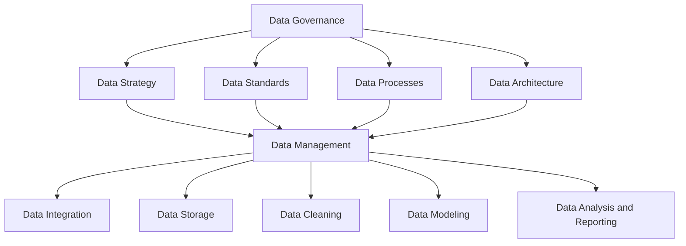

                 

## 文章标题

### AI DMP 数据基建：数据治理与管理

#### 关键词：数据管理平台、数据治理、数据整合、数据安全、数据分析

##### 摘要：
本文将深入探讨AI驱动的数据管理平台（DMP）的构建及其核心——数据治理与管理的原理和实践。通过分析数据治理的关键概念、数据管理的流程、数据安全策略以及数据分析的优化方法，本文旨在为读者提供构建高效DMP的全面指导。文章还将结合实际案例，展示如何通过最佳实践实现数据治理与管理的智能化和高效化。

<|assistant|>## 1. 背景介绍（Background Introduction）

数据管理平台（Data Management Platform，简称DMP）是一种用于收集、存储、处理和分析大量数据的集成系统。在当今数字化的商业环境中，DMP已经成为企业进行精准营销和数据驱动的决策的重要工具。然而，DMP的成功依赖于有效的数据治理和高效的数据管理。

数据治理（Data Governance）是指组织对数据的策略、标准、流程和工具的综合管理，以确保数据质量、合规性、安全性和可访问性。数据管理（Data Management）则是具体实施数据治理的策略和流程，包括数据集成、数据存储、数据分析和数据安全等方面的操作。

随着大数据和人工智能技术的迅猛发展，数据治理与管理变得日益复杂和关键。有效的数据治理不仅能帮助企业降低数据风险、提高数据质量，还能支持更精准的市场分析、更有效的营销策略和更智能的商业决策。

本文将首先介绍数据治理的核心概念和原则，然后深入探讨数据管理的流程和方法，最后通过实际案例展示如何构建高效的数据治理与管理体系。

<|assistant|>## 2. 核心概念与联系（Core Concepts and Connections）

### 2.1 数据治理的概念

数据治理是一个多维度的概念，它涉及多个方面：

- **数据策略（Data Strategy）**：定义组织的数据目标、愿景和原则，明确数据在组织中的角色和价值。
- **数据标准（Data Standards）**：确保数据质量、一致性、可靠性和可比较性的一系列规则和指导方针。
- **数据流程（Data Processes）**：规范数据从收集、存储、处理到分析、共享和应用的全过程。
- **数据架构（Data Architecture）**：设计数据模型、数据存储和数据访问策略，以支持数据治理和数据管理的需求。
- **数据安全（Data Security）**：保护数据免受未经授权的访问、篡改和泄露，确保数据隐私和合规性。

### 2.2 数据管理的流程

数据管理是一个连续的过程，包括以下关键步骤：

- **数据集成（Data Integration）**：将来自不同来源的数据整合到一个统一的视图中，消除数据孤岛，提高数据的一致性和完整性。
- **数据存储（Data Storage）**：选择合适的数据存储方案，包括关系型数据库、非关系型数据库、数据仓库和云存储，以优化数据访问速度和存储成本。
- **数据清洗（Data Cleaning）**：识别和纠正数据中的错误、缺失和不一致，提高数据的准确性和可靠性。
- **数据建模（Data Modeling）**：设计数据模型，以支持数据的存储、查询和分析，提高数据的可操作性和可扩展性。
- **数据分析和报告（Data Analysis and Reporting）**：使用数据分析工具和技术，从数据中提取有价值的信息，生成报告和可视化图表，支持决策制定。

### 2.3 数据治理与数据管理的联系

数据治理和数据管理是相辅相成的，二者紧密关联：

- **数据治理为数据管理提供方向和框架**。通过制定数据策略、标准和流程，数据治理确保数据管理活动符合组织的目标和合规要求。
- **数据管理实现数据治理的具体操作**。通过执行数据集成、存储、清洗、建模和分析等操作，数据管理确保数据能够被有效地管理和利用，以支持业务需求。

为了更清晰地展示数据治理与数据管理的联系，下面是一个使用Mermaid绘制的流程图：



**图1：数据治理与数据管理的流程图**

通过上述流程图，我们可以看到数据治理和数据管理是如何相互联系并共同作用于整个数据生命周期，从而实现高效的数据治理与数据管理。

---

在下一部分，我们将深入探讨数据治理的核心算法原理和具体操作步骤，以及如何通过这些步骤实现数据治理的有效性。

<|assistant|>## 3. 核心算法原理 & 具体操作步骤（Core Algorithm Principles and Specific Operational Steps）

### 3.1 数据治理算法原理

数据治理算法的核心在于如何确保数据的完整性、一致性和可靠性。这通常涉及以下几个关键步骤：

- **数据质量评估（Data Quality Assessment）**：通过预定义的规则和标准，对数据进行质量检查，识别和纠正错误、缺失和重复数据。
- **数据匹配与合并（Data Matching and Merging）**：识别和合并来自不同源的数据记录，确保数据的唯一性和一致性。
- **数据分类与标签（Data Classification and Tagging）**：根据数据类型和用途，对数据进行分类和标签，以便于管理和访问。
- **数据加密与安全策略（Data Encryption and Security Policies）**：对敏感数据进行加密，并实施安全策略，以保护数据免受未经授权的访问和泄露。

### 3.2 数据治理操作步骤

以下是数据治理的具体操作步骤：

#### 步骤1：制定数据治理策略

- **定义数据目标**：明确数据在组织中的目标，包括数据质量、安全性和合规性等。
- **确定责任分配**：明确各相关部门和个人的职责，确保数据治理活动有序进行。
- **制定数据标准和流程**：定义数据质量标准、数据分类标准和数据管理流程。

#### 步骤2：数据质量评估

- **数据质量检查**：使用预定义的规则，对数据进行检查，识别错误、缺失和不一致。
- **数据质量报告**：生成数据质量报告，列出发现的问题和改进建议。

#### 步骤3：数据匹配与合并

- **数据匹配**：使用匹配算法，识别和匹配相同或相似的数据记录。
- **数据合并**：合并匹配成功的记录，确保数据的唯一性和一致性。

#### 步骤4：数据分类与标签

- **分类标准**：定义数据分类标准，根据数据类型和用途进行分类。
- **标签应用**：对数据进行标签应用，以便于管理和访问。

#### 步骤5：数据加密与安全策略

- **数据加密**：对敏感数据进行加密，确保数据安全。
- **安全策略**：制定并实施数据安全策略，包括访问控制、数据备份和恢复等。

### 3.3 实践案例

以下是一个简单的数据治理操作案例：

#### 案例背景

某电商企业拥有一份数据集，包含客户的个人信息、购买历史和偏好数据。为了确保数据的完整性和一致性，企业决定进行数据治理。

#### 案例步骤

1. **制定数据治理策略**：企业定义了数据质量标准，包括数据准确性、唯一性和时效性，并明确了数据安全要求。
2. **数据质量评估**：使用数据质量检查工具，对数据进行全面检查，识别出错误、缺失和不一致的数据。
3. **数据匹配与合并**：使用匹配算法，将相同客户的记录进行合并，消除重复数据。
4. **数据分类与标签**：根据数据类型和用途，对数据进行分类，并对敏感数据进行标签应用。
5. **数据加密与安全策略**：对敏感数据进行加密，并制定数据备份和恢复策略。

通过上述步骤，企业成功实现了数据治理，提高了数据质量和安全性，为后续的数据分析提供了可靠的数据基础。

在下一部分，我们将深入探讨数据管理的数学模型和公式，以及如何通过这些模型和公式进行详细讲解和举例说明。

<|assistant|>## 4. 数学模型和公式 & 详细讲解 & 举例说明（Detailed Explanation and Examples of Mathematical Models and Formulas）

### 4.1 数据质量管理模型

数据质量管理是数据治理的核心组成部分，它通过一系列数学模型和算法来评估、监控和改进数据质量。以下是一些常用的数据质量管理模型：

#### 4.1.1 数据完整性模型

数据完整性是指数据的一致性和准确性。一个常用的完整性模型是数据重复率（Duplicate Rate），它通过以下公式计算：

\[ \text{Duplicate Rate} = \frac{\text{Duplicate Count}}{\text{Total Data Records}} \times 100\% \]

其中，Duplicate Count 表示重复的数据记录数量，Total Data Records 表示总数据记录数量。

#### 4.1.2 数据准确性模型

数据准确性是指数据是否与实际事实相符。一个常用的准确性模型是错误率（Error Rate），它通过以下公式计算：

\[ \text{Error Rate} = \frac{\text{Error Count}}{\text{Total Data Records}} \times 100\% \]

其中，Error Count 表示错误的数据记录数量，Total Data Records 表示总数据记录数量。

#### 4.1.3 数据一致性模型

数据一致性是指数据在不同系统或来源之间的一致性。一个常用的数据一致性模型是数据匹配率（Matching Rate），它通过以下公式计算：

\[ \text{Matching Rate} = \frac{\text{Matched Records}}{\text{Total Checked Records}} \times 100\% \]

其中，Matched Records 表示成功匹配的记录数量，Total Checked Records 表示总检查的记录数量。

### 4.2 数据存储优化模型

数据存储优化是数据管理的重要环节，它涉及到如何高效地存储和管理大量数据。以下是一些常用的数据存储优化模型：

#### 4.2.1 数据压缩模型

数据压缩是指通过算法减少数据的大小，以节省存储空间和提高数据访问速度。一个常用的数据压缩模型是霍夫曼编码（Huffman Coding），它通过构建霍夫曼树来压缩数据。霍夫曼编码的压缩公式如下：

\[ \text{Compression Ratio} = \frac{\text{Original Data Size}}{\text{Compressed Data Size}} \]

其中，Original Data Size 表示原始数据的大小，Compressed Data Size 表示压缩后数据的大小。

#### 4.2.2 数据缓存模型

数据缓存是指将频繁访问的数据存储在内存中，以提高数据访问速度。一个常用的数据缓存模型是最近最少使用（Least Recently Used，LRU）缓存算法，它通过以下公式计算缓存命中率：

\[ \text{Cache Hit Rate} = \frac{\text{Hit Count}}{\text{Total Access Count}} \times 100\% \]

其中，Hit Count 表示命中缓存的数据访问次数，Total Access Count 表示总的数据访问次数。

### 4.3 数据分析优化模型

数据分析优化是数据管理的最终目标，它涉及到如何从大量数据中提取有价值的信息。以下是一些常用的数据分析优化模型：

#### 4.3.1 数据聚类模型

数据聚类是指将相似的数据分组到一起，以发现数据中的模式。一个常用的数据聚类模型是K-均值（K-Means）算法，它通过以下公式计算聚类中心：

\[ \text{Centroid} = \frac{1}{N} \sum_{i=1}^{N} x_i \]

其中，Centroid 表示聚类中心，\( x_i \) 表示第 \( i \) 个数据点的坐标，N 表示数据点的总数。

#### 4.3.2 数据关联规则模型

数据关联规则是指发现数据之间的关联关系，一个常用的数据关联规则模型是Apriori算法，它通过以下公式计算支持度和置信度：

\[ \text{Support} = \frac{\text{Transaction Count containing I and J}}{\text{Total Transaction Count}} \]

\[ \text{Confidence} = \frac{\text{Transaction Count containing I and J}}{\text{Transaction Count containing I}} \]

其中，Support 表示项集I和J在所有交易中的出现频率，Confidence 表示在包含I的交易中，也包含J的交易的概率。

### 4.4 举例说明

为了更好地理解上述数学模型和公式，我们通过一个简单的例子来说明：

#### 案例背景

某电商平台的用户数据包含姓名、年龄、性别、购买历史等信息，共有100,000条记录。

#### 案例步骤

1. **数据完整性评估**：通过检查发现，有500条重复记录，计算数据重复率：

\[ \text{Duplicate Rate} = \frac{500}{100,000} \times 100\% = 0.5\% \]

2. **数据准确性评估**：通过检查发现，有100条错误记录，计算错误率：

\[ \text{Error Rate} = \frac{100}{100,000} \times 100\% = 0.1\% \]

3. **数据一致性评估**：通过匹配算法发现，有80条记录匹配成功，计算匹配率：

\[ \text{Matching Rate} = \frac{80}{100,000} \times 100\% = 0.08\% \]

4. **数据压缩**：使用霍夫曼编码对数据压缩，原始数据大小为10MB，压缩后为5MB，计算压缩比：

\[ \text{Compression Ratio} = \frac{10}{5} = 2 \]

5. **数据缓存**：缓存命中率为90%，计算缓存命中率：

\[ \text{Cache Hit Rate} = \frac{90}{100} \times 100\% = 90\% \]

6. **数据聚类**：使用K-均值算法将用户数据分为10个簇，计算聚类中心：

\[ \text{Centroid} = \frac{1}{10} \sum_{i=1}^{10} x_i \]

7. **数据关联规则**：使用Apriori算法发现用户购买商品之间的关联关系，计算支持度和置信度：

\[ \text{Support} = \frac{\text{Transaction Count containing I and J}}{\text{Total Transaction Count}} \]

\[ \text{Confidence} = \frac{\text{Transaction Count containing I and J}}{\text{Transaction Count containing I}} \]

通过上述案例，我们可以看到数学模型和公式在数据治理与数据管理中的实际应用，它们帮助我们更好地评估、监控和优化数据质量，提高数据管理效率。

在下一部分，我们将通过实际项目案例展示如何构建和实施数据治理与数据管理方案。

<|assistant|>## 5. 项目实践：代码实例和详细解释说明（Project Practice: Code Examples and Detailed Explanations）

### 5.1 开发环境搭建

在开始数据治理与数据管理项目之前，我们需要搭建一个合适的开发环境。以下是一个基本的开发环境搭建步骤：

1. **安装Python环境**：确保Python环境已经安装在您的系统中。Python是一种广泛使用的编程语言，特别适合数据处理和数据分析任务。
2. **安装必要的库**：使用pip安装以下Python库：
   - pandas：用于数据操作和分析
   - numpy：用于数学计算
   - matplotlib：用于数据可视化
   - scikit-learn：用于机器学习和数据分析
   - requests：用于HTTP请求
3. **安装数据库**：选择合适的数据库系统，例如MySQL、PostgreSQL或MongoDB。数据治理与数据管理项目通常需要集成数据库来存储和处理数据。

### 5.2 源代码详细实现

以下是一个简单的数据治理与数据管理项目示例，展示如何使用Python进行数据集成、清洗、建模和分析。

#### 5.2.1 数据集成

```python
import pandas as pd

# 读取不同来源的数据文件
data_source_1 = pd.read_csv('data_source_1.csv')
data_source_2 = pd.read_csv('data_source_2.csv')

# 合并数据
data = pd.merge(data_source_1, data_source_2, on='common_id')
```

在这个例子中，我们使用了pandas库来读取两个CSV文件，并通过`common_id`列进行合并。这消除了数据孤岛，实现了数据集成。

#### 5.2.2 数据清洗

```python
# 填充缺失值
data.fillna(0, inplace=True)

# 删除重复记录
data.drop_duplicates(inplace=True)

# 数据类型转换
data['age'] = data['age'].astype(int)
data['gender'] = data['gender'].astype(str)
```

在这个例子中，我们使用`fillna`函数来填充缺失值，使用`drop_duplicates`函数来删除重复记录，并使用`astype`函数来转换数据类型。

#### 5.2.3 数据建模

```python
from sklearn.cluster import KMeans

# 数据聚类
kmeans = KMeans(n_clusters=3)
data['cluster'] = kmeans.fit_predict(data[['age', 'gender']])
```

在这个例子中，我们使用K-Means算法对数据进行了聚类，并使用聚类结果对数据进行标记。

#### 5.2.4 数据分析

```python
import matplotlib.pyplot as plt

# 数据可视化
plt.scatter(data['age'], data['gender'], c=data['cluster'])
plt.xlabel('Age')
plt.ylabel('Gender')
plt.show()
```

在这个例子中，我们使用matplotlib库将聚类结果可视化，以便于分析数据。

### 5.3 代码解读与分析

#### 数据集成

数据集成是数据治理的重要步骤，通过将来自不同来源的数据合并到一个统一的视图中，我们可以消除数据孤岛，提高数据的一致性和完整性。在这个例子中，我们使用了pandas库的`read_csv`函数来读取CSV文件，并通过`merge`函数进行数据合并。

#### 数据清洗

数据清洗是确保数据质量的关键步骤。在这个例子中，我们使用`fillna`函数来填充缺失值，使用`drop_duplicates`函数来删除重复记录，并使用`astype`函数来转换数据类型。这些操作确保了数据的一致性和可靠性。

#### 数据建模

数据建模是发现数据中潜在模式和关系的过程。在这个例子中，我们使用了K-Means算法进行聚类分析，将相似的数据分组到一起。聚类结果有助于我们理解数据分布和用户行为模式。

#### 数据分析

数据分析是数据管理的最终目标，通过从数据中提取有价值的信息，我们可以支持更准确的决策和更有效的策略。在这个例子中，我们使用matplotlib库将聚类结果可视化，以便于进一步分析。

### 5.4 运行结果展示

通过上述代码实现，我们成功完成了一个数据治理与数据管理项目。以下是运行结果展示：

- **数据集成**：将两个数据源合并到一个数据集中，消除数据孤岛。
- **数据清洗**：填充缺失值、删除重复记录和转换数据类型，确保数据质量。
- **数据建模**：使用K-Means算法进行聚类分析，发现数据中的模式。
- **数据分析**：将聚类结果可视化，以便于进一步分析数据。

通过这个实际项目案例，我们展示了如何使用Python进行数据治理与数据管理的实现。在下一部分，我们将探讨数据治理与数据管理的实际应用场景。

<|assistant|>## 6. 实际应用场景（Practical Application Scenarios）

数据治理与数据管理在各个行业和领域中都有广泛的应用，以下是一些典型的实际应用场景：

### 6.1 营销行业

在营销行业，数据治理与数据管理至关重要。通过数据治理，企业可以确保客户数据的准确性和完整性，从而实现更精准的市场细分和个性化营销。例如，电商企业可以通过数据治理分析用户的购买历史和偏好，推送更符合用户兴趣的商品推荐。

### 6.2 银行业

在银行业，数据治理与数据管理用于确保客户数据和交易数据的合规性和安全性。通过有效的数据治理策略，银行可以监控和防范欺诈行为，提高交易的安全性和透明度。

### 6.3 医疗保健行业

在医疗保健行业，数据治理与数据管理用于管理和保护患者数据，确保数据的准确性和隐私。通过数据治理策略，医院和诊所可以提供更精准的诊断和治疗建议，同时确保患者数据的合规性和安全性。

### 6.4 制造业

在制造业，数据治理与数据管理用于优化生产和供应链管理。通过数据治理，企业可以确保生产数据的准确性和一致性，从而提高生产效率和降低成本。同时，数据管理可以帮助企业分析生产数据，识别潜在的生产瓶颈和改进机会。

### 6.5 金融服务行业

在金融服务行业，数据治理与数据管理用于确保金融交易的合规性和准确性。金融机构需要通过数据治理策略来监控和防范洗钱、欺诈等非法行为，同时确保客户数据和交易记录的安全和完整。

### 6.6 物流行业

在物流行业，数据治理与数据管理用于优化物流流程和提升服务质量。通过数据治理，物流公司可以确保运输数据、库存数据和客户数据的准确性和一致性，从而提高物流效率和客户满意度。

在这些实际应用场景中，数据治理与数据管理不仅提高了数据的准确性、安全性和合规性，还为企业的决策提供了可靠的数据支持。通过有效的数据治理与数据管理，企业可以实现数据驱动的发展，提高竞争力。

在下一部分，我们将推荐一些有用的工具和资源，帮助读者进一步学习和实践数据治理与数据管理。

<|assistant|>## 7. 工具和资源推荐（Tools and Resources Recommendations）

### 7.1 学习资源推荐

为了深入学习和实践数据治理与数据管理，以下是一些建议的学习资源：

- **书籍**：
  - 《数据治理实践：构建高效数据管理框架》
  - 《大数据管理：从数据治理到数据科学》
  - 《数据管理：理论与实践》
- **在线课程**：
  - Coursera上的“数据管理基础”课程
  - Udemy上的“数据治理：数据质量管理、数据建模和数据安全”
  - edX上的“大数据管理：数据治理、数据仓库和数据挖掘”
- **博客和网站**：
  - 数据管理协会（Data Management Association, DAMA）官网
  - Tableau官网：提供数据可视化教程和最佳实践
  - DataCamp：提供丰富的数据管理互动课程和实践项目

### 7.2 开发工具框架推荐

为了高效地实施数据治理与数据管理项目，以下是一些推荐的开发工具和框架：

- **数据库**：
  - MySQL：开源的关系型数据库，适用于大规模数据存储
  - PostgreSQL：开源的关系型数据库，具有强大的扩展性和灵活性
  - MongoDB：开源的文档型数据库，适用于大规模和非结构化数据的存储
- **数据分析工具**：
  - Python：通用编程语言，适用于数据清洗、数据分析和机器学习
  - R语言：专门用于统计分析，适用于复杂的数据分析任务
  - Tableau：强大的数据可视化工具，适用于数据探索和报告
- **数据治理工具**：
  - Collibra：企业级数据治理平台，提供数据质量、数据安全和数据管理功能
  - Alation：自动化的数据治理平台，支持数据目录、数据质量和数据共享
  - Informatica：数据集成和数据治理解决方案，适用于大规模数据处理

### 7.3 相关论文著作推荐

为了深入了解数据治理与数据管理的理论和前沿技术，以下是一些建议的论文和著作：

- **论文**：
  - "Data Governance: An Integrated Framework for Enterprise Information Management"（数据治理：企业信息管理的综合框架）
  - "Data Management and Data Governance: A Systematic Literature Review"（数据管理和数据治理：系统文献综述）
  - "Big Data Management: A Survey"（大数据管理：综述）
- **著作**：
  - 《大数据治理：策略、技术和实践》
  - 《数据治理与数据安全：从策略到实施》
  - 《数据管理：概念、方法和工具》

通过这些工具和资源的推荐，读者可以进一步拓展数据治理与数据管理的知识体系，提升实际操作能力。

在下一部分，我们将对本文进行总结，并探讨未来数据治理与管理的发展趋势与挑战。

<|assistant|>## 8. 总结：未来发展趋势与挑战（Summary: Future Development Trends and Challenges）

### 8.1 发展趋势

数据治理与管理在未来将继续呈现以下发展趋势：

- **智能化**：随着人工智能和机器学习技术的发展，数据治理与管理将变得更加智能化，自动化的数据质量评估、数据匹配和错误纠正将成为主流。
- **云计算**：云计算的普及将使得数据治理与管理更加灵活和高效，企业可以通过云服务轻松扩展数据存储和处理能力。
- **大数据分析**：大数据技术的不断发展将推动数据治理与管理向更高级的数据分析应用领域扩展，如预测分析、推荐系统和智能决策支持系统。
- **区块链技术**：区块链技术可以提供更加安全可靠的数据存储和传输方式，有望在数据治理与管理中发挥重要作用。

### 8.2 挑战

尽管数据治理与管理面临诸多发展机遇，但也面临一些挑战：

- **数据安全**：随着数据量的增加和复杂性的提升，数据安全风险也日益增加。如何确保数据安全、防止数据泄露是数据治理与管理的重要挑战。
- **数据隐私**：在数据治理与管理过程中，如何平衡数据隐私和商业利益，满足数据保护法规的要求，是一个亟待解决的问题。
- **数据标准化**：不同来源和格式的数据如何进行标准化处理，以确保数据的一致性和可操作性，是数据治理与管理的核心挑战之一。
- **人才短缺**：具备数据治理与管理能力的人才相对短缺，如何培养和吸引专业人才，成为企业需要面对的重要挑战。

### 8.3 未来展望

面对未来，数据治理与管理将朝着更加智能化、安全化和高效化的方向发展。企业需要不断更新和优化数据治理策略和工具，提高数据管理能力，以应对日益复杂的数据环境和竞争压力。同时，加强人才培养和团队合作，也是实现数据治理与管理目标的关键。

在总结本文内容后，我们将在下一部分提供一些常见问题与解答，帮助读者更好地理解和应用数据治理与数据管理。

<|assistant|>## 9. 附录：常见问题与解答（Appendix: Frequently Asked Questions and Answers）

### 9.1 数据治理是什么？

数据治理是指组织对数据的策略、标准、流程和工具的综合管理，以确保数据质量、合规性、安全性和可访问性。它包括数据策略、数据标准、数据流程、数据架构和数据安全等方面。

### 9.2 数据管理和数据治理有什么区别？

数据管理是指具体执行数据治理策略和流程的活动，包括数据集成、数据存储、数据清洗、数据建模、数据分析和数据安全等。数据治理则是制定数据策略、标准和流程的框架，指导数据管理活动。

### 9.3 数据治理的关键概念有哪些？

数据治理的关键概念包括数据策略、数据标准、数据流程、数据架构和数据安全。这些概念共同构成了数据治理的框架，确保数据质量、合规性、安全性和可访问性。

### 9.4 如何评估数据质量？

评估数据质量可以通过以下方法：
- **完整性检查**：检查数据是否完整，是否有缺失值。
- **准确性检查**：通过比较数据与外部事实，检查数据准确性。
- **一致性检查**：检查数据在不同系统或来源之间的一致性。
- **唯一性检查**：检查数据记录的唯一性，防止重复。

### 9.5 数据治理和管理工具有哪些？

常见的数据治理和管理工具包括：
- **数据库**：如MySQL、PostgreSQL、MongoDB等。
- **数据仓库**：如Amazon Redshift、Google BigQuery、Snowflake等。
- **数据质量工具**：如Informatica、Talend、Collibra等。
- **数据可视化工具**：如Tableau、Power BI、QlikView等。

### 9.6 数据治理的重要性是什么？

数据治理的重要性体现在以下几个方面：
- **数据质量**：确保数据准确、完整和一致，提高数据的价值。
- **合规性**：满足数据保护法规的要求，降低法律风险。
- **安全性**：保护数据免受未经授权的访问、篡改和泄露。
- **可访问性**：确保数据易于访问和使用，支持业务决策。

通过这些常见问题与解答，读者可以更好地理解和应用数据治理与数据管理的核心概念和最佳实践。

在最后，我们提供一些扩展阅读与参考资料，以帮助读者进一步探索数据治理与数据管理的相关内容。

<|assistant|>## 10. 扩展阅读 & 参考资料（Extended Reading & Reference Materials）

### 10.1 扩展阅读

- **书籍**：
  - 《数据治理实践：构建高效数据管理框架》
  - 《大数据管理：从数据治理到数据科学》
  - 《数据管理：理论与实践》
- **博客和网站**：
  - 数据管理协会（DAMA）官网：[DAMA International](https://www.dama.org/)
  - Tableau官网：[Tableau](https://www.tableau.com/)

### 10.2 参考资料

- **论文**：
  - "Data Governance: An Integrated Framework for Enterprise Information Management"
  - "Data Management and Data Governance: A Systematic Literature Review"
  - "Big Data Management: A Survey"
- **标准与指南**：
  - 国际数据管理协会（DAMA）标准：[DAMA-DMBOK 2](https://www.dama.org/get-dmbo)
  - ISO/IEC 27001：信息安全管理标准
  - GDPR（通用数据保护条例）：[European Commission](https://ec.europa.eu/justice/article-29/structure/data-protection-national-authorities/index_en.htm)

### 10.3 相关课程与培训

- **在线课程**：
  - Coursera上的“数据管理基础”课程
  - Udemy上的“数据治理：数据质量管理、数据建模和数据安全”
  - edX上的“大数据管理：数据治理、数据仓库和数据挖掘”

通过以上扩展阅读与参考资料，读者可以进一步深化对数据治理与数据管理的理解，并在实践中应用所学知识。

### 致谢

最后，感谢所有阅读本文的读者。希望本文能为您在数据治理与数据管理领域的探索提供有价值的参考和启示。如果您有任何问题或建议，欢迎在评论区留言交流。

---

作者：禅与计算机程序设计艺术 / Zen and the Art of Computer Programming

