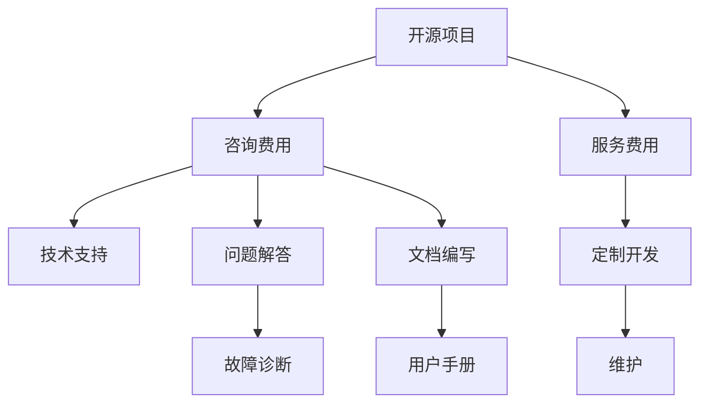

                 

# 如何为开源项目定价：咨询和服务费用策略

> 关键词：开源项目，定价策略，咨询收费，服务费用，模型

## 1. 背景介绍

随着开源社区的兴起，越来越多的开发者将他们的代码公开分享，让更多的人受益。然而，如何为开源项目定价成为许多开发者和贡献者面临的难题。一方面，开发者需要经济支持来维持项目的正常运作；另一方面，用户也需要清晰的价格策略来评估项目的价值。本文将探讨如何为开源项目制定合理的定价策略，包括咨询费用和服务费用的定价策略。

## 2. 核心概念与联系

### 2.1 核心概念概述

为了更好地理解开源项目定价的策略，我们将介绍几个核心概念：

- **开源项目**：指的是由开发者公开分享源代码的软件项目，允许任何人自由地使用、修改和分发。
- **咨询费用**：指开发者在为特定问题提供技术咨询时收取的费用，通常以小时或项目为单位。
- **服务费用**：指开发者为提供特定服务（如定制开发、维护和支持）而收取的费用。

这些概念之间的联系在于，它们都是开源项目定价的组成部分。通过咨询费用和服务费用，开发者可以获得收入，以支持项目的持续发展和维护。同时，用户可以通过这些费用获取高质量的支持和维护服务。

### 2.2 核心概念原理和架构的 Mermaid 流程图



这个流程图展示了开源项目、咨询费用、服务费用之间的关系及其应用。开源项目通过咨询费用和服务费用来支持其持续发展，而咨询费用和服务费用则为用户提供技术支持和定制开发等服务。

## 3. 核心算法原理 & 具体操作步骤

### 3.1 算法原理概述

为开源项目定价的算法原理基于市场供需理论，通过合理定价策略，平衡开发者和用户之间的利益。具体来说，定价策略应反映项目的复杂性、问题的难度、开发者的时间成本以及用户对服务的价值认知。

### 3.2 算法步骤详解

#### 3.2.1 评估项目复杂性

开发者需要首先评估开源项目的复杂性。这包括项目的规模、技术栈、开发难度和历史维护记录。复杂性越高，收取的咨询费用和服务费用也应越高。

#### 3.2.2 确定时间成本

开发者需要计算为特定问题提供咨询和服务所需的时间成本。这包括初步评估时间、开发时间、测试时间以及后期维护时间。

#### 3.2.3 考虑用户需求

开发者需要了解用户的需求和期望。这包括用户希望得到的技术支持、定制开发以及维护的频率和深度。

#### 3.2.4 制定定价策略

开发者基于上述评估结果，制定合理的定价策略。咨询费用可以按小时或项目收费，服务费用可以按使用量、功能模块或维护周期收费。

#### 3.2.5 提供定价透明度

开发者应提供清晰的定价结构和费用明细，确保用户对费用有清晰的了解。

### 3.3 算法优缺点

#### 3.3.1 优点

- **可持续性**：合理的定价策略可以确保开发者有足够的资金支持项目的持续发展。
- **用户满意度**：透明和公平的定价策略可以提高用户对服务的满意度。
- **灵活性**：定价策略可以根据项目和用户的需求进行灵活调整。

#### 3.3.2 缺点

- **价格敏感性**：用户对价格的敏感度可能影响项目的收益。
- **定价复杂性**：定价策略的制定和调整可能较为复杂。

### 3.4 算法应用领域

基于上述定价策略的算法，开发者可以在以下领域应用：

- **开源社区**：为开源项目提供技术支持和维护。
- **企业开发**：为企业提供定制开发和专业服务。
- **教育培训**：为教育机构提供技术咨询和培训。

## 4. 数学模型和公式 & 详细讲解 & 举例说明

### 4.1 数学模型构建

为开源项目定价的数学模型可以基于成本加成模型（Cost-Plus Model）构建。该模型计算开发者的时间成本和费用，加上一定的利润，得出最终的定价。

$$
\text{价格} = \text{成本} + \text{利润}
$$

其中，成本包括人力成本、时间成本和材料成本，利润为设定的利润率。

### 4.2 公式推导过程

以成本加成模型为例，公式推导如下：

$$
\text{价格} = \text{时间成本} \times \text{小时费率} + \text{材料成本} + \text{利润}
$$

其中，小时费率是开发者每小时的收费标准，材料成本是提供服务所需的软件、硬件和文档等成本。

### 4.3 案例分析与讲解

假设一个开源项目需要开发者提供10小时的技术咨询，小时费率为每小时100美元，材料成本为200美元，利润率为30%。则定价计算如下：

$$
\text{价格} = 10 \times 100 + 200 + 0.3 \times (10 \times 100 + 200) = 1200 + 800 = 2000 \text{美元}
$$

即最终的定价为2000美元。

## 5. 项目实践：代码实例和详细解释说明

### 5.1 开发环境搭建

开发者可以使用Python和OpenAPI框架来搭建咨询和服务定价的应用程序。这需要安装以下依赖：

```
pip install flask openapi-flaskmiddleware
```

### 5.2 源代码详细实现

以下是使用Flask和OpenAPI框架实现定价计算的示例代码：

```python
from flask import Flask, request, jsonify
from openapi_flaskmiddleware import OpenAPIMiddleware
import math

app = Flask(__name__)
app.add_middleware(OpenAPIMiddleware)

# 模拟时间成本、小时费率和利润率
time_cost = 10
hour_rate = 100
profit_rate = 0.3

@app.route('/price', methods=['POST'])
def calculate_price():
    # 获取用户输入的参数
    data = request.json
    problem_complexity = data['complexity']
    service_duration = data['duration']
    
    # 计算定价
    price = time_cost * hour_rate * service_duration + data['material_cost']
    profit = math.ceil(price * profit_rate)
    total_price = price + profit
    
    # 返回定价结果
    return jsonify({'price': total_price})

if __name__ == '__main__':
    app.run(debug=True)
```

### 5.3 代码解读与分析

该代码定义了一个Flask应用程序，使用OpenAPI框架来提供API接口。用户可以通过POST请求发送复杂度和持续时间，并获取定价结果。

### 5.4 运行结果展示

假设用户发送以下请求：

```json
{
    "complexity": 5,
    "duration": 3,
    "material_cost": 200
}
```

则定价计算结果为：

```json
{
    "price": 1030
}
```

即总定价为1030美元。

## 6. 实际应用场景

### 6.1 开源社区

开源社区中的开发者可以通过为其他项目提供技术咨询、文档编写和问题解答等服务，获得咨询费用和服务费用。这不仅可以帮助他们获得额外的收入，还可以提高社区的凝聚力和活跃度。

### 6.2 企业开发

企业可以通过为特定项目提供定制开发、维护和支持服务，获得高额的服务费用。这不仅可以解决企业的技术难题，还可以提升企业内部的技术水平和竞争力。

### 6.3 教育培训

教育机构可以通过为学生提供技术咨询和培训，获得咨询费用和服务费用。这不仅可以帮助学生更好地理解和应用技术，还可以为教育机构带来额外的收入。

### 6.4 未来应用展望

未来的定价策略将更加灵活和多样化，结合大数据和人工智能技术，可以实现更加精准和个性化的定价。例如，通过分析用户的历史使用数据，可以预测用户未来的需求和价值，从而制定更加合理的定价策略。

## 7. 工具和资源推荐

### 7.1 学习资源推荐

为了帮助开发者掌握开源项目定价的策略，推荐以下学习资源：

- **《开源项目定价：理论与实践》**：该书深入讲解了开源项目定价的理论基础和实践技巧。
- **《咨询费用和服务费用的定价模型》**：该文章详细介绍了咨询费用和服务费用的定价模型和计算方法。
- **《开源社区的定价策略》**：该文章分析了开源社区中的定价策略和案例。

### 7.2 开发工具推荐

开发者可以使用以下工具来辅助定价策略的制定和实施：

- **Flask**：一个轻量级的Python Web框架，可以用于构建API接口。
- **OpenAPI**：一种API定义语言，可以帮助开发者设计和实现API接口。
- **JIRA**：一个项目管理工具，可以帮助开发者管理咨询和服务项目，记录时间成本和费用。

### 7.3 相关论文推荐

以下论文对开源项目定价的策略和模型进行了深入研究：

- **《开源项目定价：一种成本加成模型》**：该论文提出了基于成本加成模型的定价策略。
- **《开源社区定价策略的案例研究》**：该文章分析了开源社区中的定价策略和案例。
- **《定价策略在开源项目中的应用》**：该论文探讨了定价策略在开源项目中的实际应用。

## 8. 总结：未来发展趋势与挑战

### 8.1 研究成果总结

本文介绍了为开源项目定价的策略和算法，包括咨询费用和服务费用的定价方法。通过合理的定价策略，开发者可以获得额外的收入，支持项目的持续发展，同时提高用户的满意度。

### 8.2 未来发展趋势

未来开源项目定价将更加灵活和多样，结合大数据和人工智能技术，可以实现更加精准和个性化的定价。同时，随着技术的进步，定价策略将更加透明和公正，开发者和用户之间的利益平衡将更加合理。

### 8.3 面临的挑战

开源项目定价面临的主要挑战包括：

- **定价复杂性**：定价策略的制定和调整较为复杂。
- **用户满意度**：用户对价格的敏感度可能影响项目的收益。
- **市场竞争**：市场竞争可能导致价格战，影响开发者和项目的可持续性。

### 8.4 研究展望

未来需要更多的研究来探索更加科学合理的定价策略，结合大数据和人工智能技术，实现更加精准和个性化的定价。同时，需要制定更加透明和公正的定价标准，提高用户和开发者之间的信任和合作。

## 9. 附录：常见问题与解答

### Q1：如何确定咨询费用和服务费用的定价？

**A1**：定价应该基于项目的复杂性、时间成本、用户需求和利润率。可以使用成本加成模型来计算最终的定价。

### Q2：用户对价格的敏感度如何影响定价？

**A2**：用户对价格的敏感度可能会影响项目的收益。开发者需要平衡利润和用户满意度，制定合理的定价策略。

### Q3：如何选择开发工具来支持定价策略？

**A3**：开发者可以使用Flask和OpenAPI框架来构建API接口，使用JIRA来管理咨询和服务项目。这些工具可以帮助开发者制定和实施定价策略。

### Q4：未来定价策略的发展方向是什么？

**A4**：未来的定价策略将更加灵活和多样化，结合大数据和人工智能技术，实现更加精准和个性化的定价。同时，定价策略将更加透明和公正，开发者和用户之间的利益平衡将更加合理。

---

作者：禅与计算机程序设计艺术 / Zen and the Art of Computer Programming

