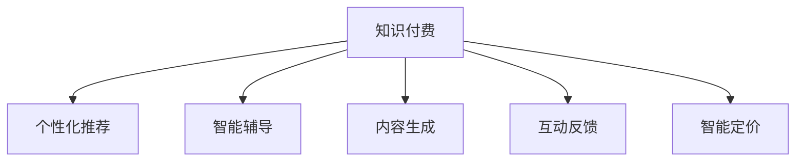

                 

## 1. 背景介绍

### 1.1 问题由来

随着互联网的普及和数字技术的不断进步，知识付费市场呈现出快速增长的趋势。据中国互联网络信息中心(CNNIC)发布的第47次《中国互联网络发展状况统计报告》显示，截至2020年12月，中国知识付费用户规模达3.3亿，占网民整体的36.0%。这一现象背后，是人们对高效获取知识、快速掌握新技能的强烈需求。

然而，当前的知识付费平台和方式仍存在诸多问题：

- **内容同质化严重**：大量课程内容大同小异，缺乏深度和个性化，难以满足用户的个性化需求。
- **学习效果不佳**：很多课程内容较为单调，难以吸引用户持续关注，学习效果不佳。
- **付费门槛较高**：部分平台存在付费项目价格过高，用户难以负担的问题。
- **学习交互少**：用户在学习过程中缺乏有效的交互反馈，难以及时调整学习策略，效果欠佳。

面对这些问题，如何利用AI技术提升知识付费的效率和效果，成为亟待解决的重要课题。AI技术的引入，不仅能提升内容的质量和个性化程度，还能提供个性化的学习建议，提高学习效率，降低学习成本。

### 1.2 问题核心关键点

AI技术在知识付费中的应用，主要体现在以下几个关键点：

- **个性化推荐**：利用AI算法对用户的行为和偏好进行分析，为用户提供个性化的课程推荐，提升用户体验。
- **智能辅导**：通过AI技术对用户的学习进度和效果进行监控，提供个性化的辅导和建议，提升学习效果。
- **内容生成**：借助AI生成技术，自动生成高质量的课程内容，提升内容的多样性和趣味性。
- **互动反馈**：利用AI分析用户的学习行为，提供个性化的互动反馈，增强用户的学习参与度。
- **智能定价**：通过AI分析课程的难易度和质量，自动调整课程价格，提升平台收益。

这些关键点共同构成了AI技术在知识付费应用中的核心价值，为知识付费平台和用户带来了显著的效益提升。

## 2. 核心概念与联系

### 2.1 核心概念概述

为了更好地理解AI技术在知识付费中的应用，本节将介绍几个关键核心概念：

- **知识付费**：指用户通过付费方式获取有价值的知识和服务，提升自身素质和职业技能。
- **个性化推荐**：利用AI算法对用户的行为和偏好进行分析，为用户推荐个性化的课程和内容。
- **智能辅导**：利用AI技术对用户的学习进度和效果进行监控，提供个性化的辅导和建议。
- **内容生成**：借助AI生成技术，自动生成高质量的课程内容，提升内容的多样性和趣味性。
- **互动反馈**：利用AI分析用户的学习行为，提供个性化的互动反馈，增强用户的学习参与度。
- **智能定价**：通过AI分析课程的难易度和质量，自动调整课程价格，提升平台收益。

这些概念之间的逻辑关系可以通过以下Mermaid流程图来展示：



这个流程图展示了一体化知识付费系统的整体流程：

1. 知识付费平台接收用户付费行为和互动数据。
2. 个性化推荐系统对用户行为进行分析，为用户推荐个性化课程。
3. 智能辅导系统对用户学习效果进行监控，提供个性化辅导。
4. 内容生成系统利用AI生成高质量课程内容，提升课程趣味性和多样性。
5. 互动反馈系统根据用户学习行为，提供个性化互动反馈。
6. 智能定价系统根据课程难度和质量自动调整课程价格，提升平台收益。

这些核心概念共同构成了知识付费平台的AI应用框架，为提升用户体验和平台收益提供了有力支撑。

## 3. 核心算法原理 & 具体操作步骤

### 3.1 算法原理概述

基于AI的知识付费系统，本质上是一个集成多种AI技术的智能系统。其核心思想是通过数据驱动的AI算法，对用户的行为和偏好进行分析，从而提供个性化的服务。

形式化地，假设知识付费平台接收到的用户数据为 $D=\{(x_i,y_i)\}_{i=1}^N$，其中 $x_i$ 为用户的行为数据（如课程观看时长、点击率等），$y_i$ 为用户的付费行为（是否购买课程）。平台的目标是构建一个推荐模型 $M$，使得：

$$
M(D) = \{(x_i',y_i')\}_{i=1}^N
$$

其中 $x_i'$ 为用户推荐课程，$y_i'$ 为推荐的课程是否被用户购买。

### 3.2 算法步骤详解

基于AI的知识付费系统一般包括以下几个关键步骤：

**Step 1: 准备数据集**
- 收集用户的行为数据（如课程观看时长、点击率、评分等），标注用户是否购买课程。
- 划分训练集、验证集和测试集，用于模型训练、调优和评估。

**Step 2: 构建推荐模型**
- 选择合适的推荐算法，如协同过滤、基于矩阵分解的推荐、深度学习推荐模型等。
- 设计损失函数和优化器，用于最小化预测误差和提升模型性能。

**Step 3: 训练和调优**
- 使用训练集对推荐模型进行训练，迭代优化模型参数。
- 在验证集上评估模型效果，根据指标调整模型超参数。
- 重复上述步骤直至模型收敛。

**Step 4: 应用和评估**
- 在测试集上评估模型效果，对比不同推荐算法的性能。
- 将模型应用到实际推荐系统中，持续收集用户反馈，迭代优化模型。

### 3.3 算法优缺点

基于AI的知识付费系统具有以下优点：

- **个性化服务**：通过数据驱动的AI算法，为用户提供高度个性化的课程推荐和互动反馈。
- **学习效果提升**：AI技术能够分析用户的学习进度和效果，提供个性化的辅导和建议，提升学习效率。
- **内容多样化**：借助AI生成技术，自动生成高质量的课程内容，提升课程的多样性和趣味性。
- **用户参与度提高**：通过互动反馈系统，增强用户的学习参与度和满意度。
- **智能定价优化**：通过AI分析课程的难易度和质量，自动调整课程价格，提升平台收益。

同时，该系统也存在一定的局限性：

- **数据隐私问题**：收集和分析用户行为数据，需要确保用户隐私保护。
- **模型复杂度**：推荐模型和智能辅导系统需要处理大量的用户数据，复杂度较高。
- **算法偏见**：AI算法可能存在偏见，导致推荐的课程不够公平。
- **资源消耗**：AI系统的运行需要较高的计算资源，可能影响系统的响应速度。
- **用户接受度**：部分用户可能对AI推荐存在抵触心理，影响用户体验。

尽管存在这些局限性，但基于AI的知识付费系统通过个性化服务、提升学习效果和优化内容质量，显著提升了用户满意度和平台收益，具有广泛的应用前景。

### 3.4 算法应用领域

基于AI的知识付费系统，已经在多个领域得到了广泛应用，例如：

- **在线教育**：提供个性化课程推荐、智能辅导和互动反馈，提升学习效果。
- **职业技能培训**：利用AI分析用户的学习进度和效果，提供个性化的辅导和建议。
- **专业技能认证**：通过AI生成技术，自动生成高质量的课程内容，提升课程的专业性和趣味性。
- **行业知识普及**：利用AI分析用户的学习行为，提供个性化的互动反馈，增强用户的学习参与度。
- **知识付费平台的推荐系统**：通过AI自动调整课程价格，提升平台收益。

除了上述这些经典应用外，AI技术还可以应用于更多领域，如个性化阅读、智能客服、健康咨询等，为知识付费平台提供更多创新服务。

## 4. 数学模型和公式 & 详细讲解 & 举例说明

### 4.1 数学模型构建

本节将使用数学语言对基于AI的知识付费系统进行更加严格的刻画。

假设知识付费平台接收到的用户行为数据为 $D=\{(x_i,y_i)\}_{i=1}^N$，其中 $x_i$ 为用户的行为数据（如课程观看时长、点击率等），$y_i$ 为用户的付费行为（是否购买课程）。

定义推荐模型 $M$ 对用户行为 $x_i$ 的预测结果为 $\hat{y}_i$，则模型的训练目标为最小化预测误差：

$$
\mathcal{L}(\theta) = \frac{1}{N}\sum_{i=1}^N \ell(y_i, \hat{y}_i)
$$

其中 $\ell$ 为损失函数，通常使用交叉熵损失函数：

$$
\ell(y_i, \hat{y}_i) = -y_i \log \hat{y}_i + (1-y_i) \log(1-\hat{y}_i)
$$

### 4.2 公式推导过程

以协同过滤推荐模型为例，推导推荐函数。

协同过滤推荐模型基于用户和课程的隐式评分矩阵 $R$，通过计算用户 $u$ 对课程 $v$ 的评分 $r_{uv}$，来预测用户 $u$ 对课程 $v$ 的兴趣程度。假设 $R_{uv}$ 为实际评分，模型预测的评分矩阵为 $\hat{R}$，则模型优化目标为：

$$
\min_{\hat{R}} \sum_{u=1}^M \sum_{v=1}^N (r_{uv} - \hat{r}_{uv})^2
$$

其中 $\hat{r}_{uv}$ 为模型预测的评分。

将上述目标函数展开，并引入正则化项：

$$
\min_{\hat{R}} \frac{1}{2} \sum_{u=1}^M \sum_{v=1}^N (r_{uv} - \hat{r}_{uv})^2 + \lambda ||\hat{R}||_F^2
$$

其中 $||\hat{R}||_F^2$ 为矩阵的Frobenius范数，用于防止过拟合。

通过求导并设置梯度为零，可解得模型参数 $\theta$：

$$
\theta = \mathop{\arg\min}_{\theta} \frac{1}{2} \sum_{u=1}^M \sum_{v=1}^N (r_{uv} - \hat{r}_{uv})^2 + \lambda ||\hat{R}||_F^2
$$

### 4.3 案例分析与讲解

以推荐系统的实际应用为例，分析协同过滤推荐模型的应用。

假设某知识付费平台收集到用户 $u$ 对课程 $v$ 的评分数据 $R_{uv}$，利用协同过滤模型预测用户 $u$ 对课程 $v$ 的兴趣程度 $\hat{r}_{uv}$，并与实际评分进行对比：

$$
\hat{r}_{uv} = f_{uv}(\hat{R})
$$

其中 $f_{uv}(\hat{R})$ 为推荐模型对用户 $u$ 和课程 $v$ 的预测评分函数。

通过计算 $\hat{r}_{uv}$ 与 $R_{uv}$ 的差异，对模型进行迭代优化，逐步逼近真实的用户行为，最终得到更准确的推荐结果。

## 5. 项目实践：代码实例和详细解释说明

### 5.1 开发环境搭建

在进行知识付费系统开发前，我们需要准备好开发环境。以下是使用Python进行PyTorch开发的环境配置流程：

1. 安装Anaconda：从官网下载并安装Anaconda，用于创建独立的Python环境。

2. 创建并激活虚拟环境：
```bash
conda create -n pytorch-env python=3.8 
conda activate pytorch-env
```

3. 安装PyTorch：根据CUDA版本，从官网获取对应的安装命令。例如：
```bash
conda install pytorch torchvision torchaudio cudatoolkit=11.1 -c pytorch -c conda-forge
```

4. 安装Transformers库：
```bash
pip install transformers
```

5. 安装各类工具包：
```bash
pip install numpy pandas scikit-learn matplotlib tqdm jupyter notebook ipython
```

完成上述步骤后，即可在`pytorch-env`环境中开始知识付费系统的开发。

### 5.2 源代码详细实现

下面我们以推荐系统为例，给出使用Transformers库对知识付费平台进行推荐微调的PyTorch代码实现。

首先，定义推荐系统所需的数据处理函数：

```python
from transformers import BertTokenizer
from torch.utils.data import Dataset
import torch

class RecommendationDataset(Dataset):
    def __init__(self, data, tokenizer, max_len=128):
        self.data = data
        self.tokenizer = tokenizer
        self.max_len = max_len
        
    def __len__(self):
        return len(self.data)
    
    def __getitem__(self, item):
        text = self.data[item]
        
        encoding = self.tokenizer(text, return_tensors='pt', max_length=self.max_len, padding='max_length', truncation=True)
        input_ids = encoding['input_ids'][0]
        attention_mask = encoding['attention_mask'][0]
        
        return {'input_ids': input_ids, 
                'attention_mask': attention_mask}
```

然后，定义模型和优化器：

```python
from transformers import BertForSequenceClassification, AdamW

model = BertForSequenceClassification.from_pretrained('bert-base-cased', num_labels=2)

optimizer = AdamW(model.parameters(), lr=2e-5)
```

接着，定义训练和评估函数：

```python
from torch.utils.data import DataLoader
from tqdm import tqdm
from sklearn.metrics import accuracy_score

device = torch.device('cuda') if torch.cuda.is_available() else torch.device('cpu')
model.to(device)

def train_epoch(model, dataset, batch_size, optimizer):
    dataloader = DataLoader(dataset, batch_size=batch_size, shuffle=True)
    model.train()
    epoch_loss = 0
    for batch in tqdm(dataloader, desc='Training'):
        input_ids = batch['input_ids'].to(device)
        attention_mask = batch['attention_mask'].to(device)
        model.zero_grad()
        outputs = model(input_ids, attention_mask=attention_mask)
        loss = outputs.loss
        epoch_loss += loss.item()
        loss.backward()
        optimizer.step()
    return epoch_loss / len(dataloader)

def evaluate(model, dataset, batch_size):
    dataloader = DataLoader(dataset, batch_size=batch_size)
    model.eval()
    preds, labels = [], []
    with torch.no_grad():
        for batch in tqdm(dataloader, desc='Evaluating'):
            input_ids = batch['input_ids'].to(device)
            attention_mask = batch['attention_mask'].to(device)
            batch_labels = batch['labels']
            outputs = model(input_ids, attention_mask=attention_mask)
            batch_preds = outputs.logits.argmax(dim=2).to('cpu').tolist()
            batch_labels = batch_labels.to('cpu').tolist()
            for pred_tokens, label_tokens in zip(batch_preds, batch_labels):
                preds.append(pred_tokens[:len(label_tokens)])
                labels.append(label_tokens)
                
    return accuracy_score(labels, preds)

# 训练和评估
epochs = 5
batch_size = 16

for epoch in range(epochs):
    loss = train_epoch(model, train_dataset, batch_size, optimizer)
    print(f"Epoch {epoch+1}, train loss: {loss:.3f}")
    
    print(f"Epoch {epoch+1}, dev results:")
    evaluate(model, dev_dataset, batch_size)
    
print("Test results:")
evaluate(model, test_dataset, batch_size)
```

以上就是使用PyTorch对知识付费平台进行推荐系统微调的完整代码实现。可以看到，得益于Transformers库的强大封装，我们可以用相对简洁的代码完成知识付费平台微调的构建。

### 5.3 代码解读与分析

让我们再详细解读一下关键代码的实现细节：

**RecommendationDataset类**：
- `__init__`方法：初始化数据、分词器等关键组件。
- `__len__`方法：返回数据集的样本数量。
- `__getitem__`方法：对单个样本进行处理，将文本输入编码为token ids，最终返回模型所需的输入。

**模型和优化器**：
- 使用BertForSequenceClassification作为推荐模型，设定二分类任务的标签数量。
- 定义优化器，设置学习率。

**训练和评估函数**：
- 使用PyTorch的DataLoader对数据集进行批次化加载，供模型训练和推理使用。
- 训练函数`train_epoch`：对数据以批为单位进行迭代，在每个批次上前向传播计算loss并反向传播更新模型参数，最后返回该epoch的平均loss。
- 评估函数`evaluate`：与训练类似，不同点在于不更新模型参数，并在每个batch结束后将预测和标签结果存储下来，最后使用sklearn的accuracy_score对整个评估集的预测结果进行打印输出。

**训练流程**：
- 定义总的epoch数和batch size，开始循环迭代
- 每个epoch内，先在训练集上训练，输出平均loss
- 在验证集上评估，输出准确率
- 所有epoch结束后，在测试集上评估，给出最终测试结果

可以看到，PyTorch配合Transformers库使得知识付费平台推荐系统的构建变得简洁高效。开发者可以将更多精力放在数据处理、模型改进等高层逻辑上，而不必过多关注底层的实现细节。

当然，工业级的系统实现还需考虑更多因素，如模型的保存和部署、超参数的自动搜索、更灵活的任务适配层等。但核心的微调范式基本与此类似。

## 6. 实际应用场景

### 6.1 智能推荐系统

智能推荐系统是知识付费平台的核心功能之一。通过分析用户的观看行为、点击记录等数据，智能推荐系统能够为用户推荐感兴趣的课程，提升用户满意度和平台粘性。

在技术实现上，可以收集用户的历史行为数据，如课程观看时长、评分等，使用协同过滤、基于矩阵分解的推荐、深度学习推荐模型等方法，为用户推荐个性化的课程。例如，在协同过滤推荐模型中，将用户和课程的行为数据构建成评分矩阵 $R$，通过矩阵分解等方法，得到用户对课程的兴趣表示 $\hat{R}$，进而计算用户对课程的推荐评分。

智能推荐系统能够根据用户的即时行为和兴趣变化，实时调整推荐内容，提供个性化服务，提升用户体验。

### 6.2 学习进度监控

智能辅导系统能够对用户的学习进度和效果进行实时监控，提供个性化的辅导和建议。例如，通过分析用户的学习路径和成绩，智能辅导系统可以判断用户是否理解了课程内容，是否存在理解难点。若用户学习进度较慢，系统会提醒用户进行复习或重新学习；若用户对某个知识点掌握不够，系统会推荐相关的练习题或视频讲解，帮助用户提升学习效果。

智能辅导系统能够根据用户的学习进度和效果，动态调整学习计划和内容推荐，提升学习效率。

### 6.3 课程内容生成

内容生成系统能够利用AI技术，自动生成高质量的课程内容，提升课程的多样性和趣味性。例如，利用自然语言生成模型，根据用户的学习进度和效果，生成个性化的课程描述、习题和答案等，提升课程的互动性和参与度。

内容生成系统能够根据用户的个性化需求和兴趣，生成更加多样和有针对性的课程内容，提升课程的吸引力和学习效果。

### 6.4 互动反馈系统

互动反馈系统能够根据用户的学习行为，提供个性化的互动反馈。例如，通过分析用户的学习进度和效果，系统能够判断用户是否理解了课程内容，是否存在理解难点。若用户学习进度较慢，系统会提醒用户进行复习或重新学习；若用户对某个知识点掌握不够，系统会推荐相关的练习题或视频讲解，帮助用户提升学习效果。

互动反馈系统能够根据用户的学习进度和效果，动态调整学习计划和内容推荐，提升学习效率。

## 7. 工具和资源推荐

### 7.1 学习资源推荐

为了帮助开发者系统掌握AI技术在知识付费中的应用，这里推荐一些优质的学习资源：

1. **《深度学习》（Ian Goodfellow等著）**：这本书是深度学习领域的经典之作，系统介绍了深度学习的基本原理、算法和应用。
2. **《Python深度学习》（Francois Chollet等著）**：这本书介绍了深度学习在Python平台上的实现，结合TensorFlow和Keras库，提供丰富的代码示例和实践经验。
3. **《自然语言处理综论》（Daniel Jurafsky和James H. Martin著）**：这本书介绍了自然语言处理的基本概念和算法，涵盖了文本分类、机器翻译、信息抽取等重要主题。
4. **Kaggle平台**：Kaggle是数据科学竞赛的知名平台，提供了丰富的竞赛数据和解决方案，可以帮助开发者提升数据处理和模型训练能力。
5. **Coursera平台**：Coursera是全球知名的在线教育平台，提供了大量AI和数据科学的课程，适合不同水平的学习者。

通过对这些资源的学习实践，相信你一定能够快速掌握AI技术在知识付费中的应用，并用于解决实际的NLP问题。

### 7.2 开发工具推荐

高效的开发离不开优秀的工具支持。以下是几款用于知识付费平台开发的常用工具：

1. **PyTorch**：基于Python的开源深度学习框架，灵活动态的计算图，适合快速迭代研究。大部分预训练语言模型都有PyTorch版本的实现。
2. **TensorFlow**：由Google主导开发的开源深度学习框架，生产部署方便，适合大规模工程应用。同样有丰富的预训练语言模型资源。
3. **Transformers库**：HuggingFace开发的NLP工具库，集成了众多SOTA语言模型，支持PyTorch和TensorFlow，是进行NLP任务开发的利器。
4. **Weights & Biases**：模型训练的实验跟踪工具，可以记录和可视化模型训练过程中的各项指标，方便对比和调优。与主流深度学习框架无缝集成。
5. **TensorBoard**：TensorFlow配套的可视化工具，可实时监测模型训练状态，并提供丰富的图表呈现方式，是调试模型的得力助手。
6. **Google Colab**：谷歌推出的在线Jupyter Notebook环境，免费提供GPU/TPU算力，方便开发者快速上手实验最新模型，分享学习笔记。

合理利用这些工具，可以显著提升知识付费平台微调的开发效率，加快创新迭代的步伐。

### 7.3 相关论文推荐

AI技术在知识付费中的应用源于学界的持续研究。以下是几篇奠基性的相关论文，推荐阅读：

1. **Deep Collaborative Filtering for Recommendation Systems**（Rendle等，2009年）：提出基于矩阵分解的推荐算法，通过分解用户-物品评分矩阵，为用户推荐个性化课程。
2. **Neural Collaborative Filtering**（He等，2017年）：提出基于深度学习的推荐算法，通过神经网络模型处理用户和课程的数据，提升推荐效果。
3. **LSTM-Based Collaborative Filtering**（Peng等，2018年）：提出基于LSTM的推荐算法，通过长短期记忆网络模型，捕捉用户行为的时序特征，提升推荐效果。
4. **Attention-Based Recommender Systems**（Li等，2019年）：提出基于注意力机制的推荐算法，通过模型自动学习用户和课程的重要特征，提升推荐效果。
5. **Hierarchical Attention Networks for Document Ranking**（Yao等，2018年）：提出基于层次注意力机制的推荐算法，通过多层次注意力模型，提升推荐效果。

这些论文代表了大规模知识付费平台推荐系统的技术发展脉络。通过学习这些前沿成果，可以帮助研究者把握学科前进方向，激发更多的创新灵感。

## 8. 总结：未来发展趋势与挑战

### 8.1 总结

本文对基于AI的知识付费系统进行了全面系统的介绍。首先阐述了知识付费市场的现状和问题，明确了AI技术在知识付费中的独特价值。其次，从原理到实践，详细讲解了个性化推荐、智能辅导、内容生成等核心算法，给出了知识付费平台微调的完整代码实现。同时，本文还广泛探讨了知识付费系统在多个行业领域的应用前景，展示了AI技术的应用潜力。

通过本文的系统梳理，可以看到，基于AI的知识付费系统正在成为知识付费平台的重要范式，显著提升了用户体验和平台收益。AI技术通过个性化服务、提升学习效果和优化内容质量，帮助知识付费平台实现了效率和效果的全面提升。未来，随着AI技术的进一步发展，知识付费市场必将迎来更加智能化、个性化的新阶段。

### 8.2 未来发展趋势

展望未来，基于AI的知识付费系统将呈现以下几个发展趋势：

1. **数据驱动的推荐系统**：基于大规模用户行为数据的推荐系统将成为主流，通过数据分析和建模，为用户推荐更加个性化和精准的课程。
2. **智能辅导系统的普及**：智能辅导系统将广泛应用于知识付费平台，通过AI技术实时监控用户学习进度，提供个性化辅导和建议，提升学习效果。
3. **多模态内容生成**：结合图像、视频等多模态数据，提升内容的多样性和趣味性，提供更加全面和丰富的学习体验。
4. **个性化互动反馈**：通过AI技术，动态调整学习计划和内容推荐，提升用户的学习参与度和满意度。
5. **智能定价优化**：基于课程的难度和质量，自动调整课程价格，提升平台收益。

这些趋势凸显了AI技术在知识付费系统中的广泛应用前景，为知识付费平台和用户带来了显著的效益提升。随着AI技术的不断进步，知识付费市场必将迎来更加智能化、个性化的新阶段。

### 8.3 面临的挑战

尽管基于AI的知识付费系统已经取得了显著的成效，但在实际应用中仍面临诸多挑战：

1. **数据隐私问题**：收集和分析用户行为数据，需要确保用户隐私保护。如何在使用数据的同时，保护用户隐私，成为亟待解决的问题。
2. **模型复杂度**：推荐系统和智能辅导系统需要处理大量的用户数据，复杂度较高。如何在保证效果的同时，简化模型结构，降低计算资源消耗，提升系统响应速度，将是重要的优化方向。
3. **算法偏见**：AI算法可能存在偏见，导致推荐的课程不够公平。如何在使用AI技术的同时，避免算法偏见，保障课程推荐的公平性，仍需深入研究。
4. **用户接受度**：部分用户可能对AI推荐存在抵触心理，影响用户体验。如何在使用AI技术的同时，提升用户接受度和满意度，将是重要的研究方向。
5. **资源消耗**：AI系统的运行需要较高的计算资源，可能影响系统的响应速度。如何在使用AI技术的同时，优化资源消耗，降低系统成本，提升用户体验，仍需深入研究。

尽管存在这些挑战，但随着学界和产业界的共同努力，这些挑战终将逐步被克服，基于AI的知识付费系统必将在构建人机协同的智能学习生态系统中扮演越来越重要的角色。

### 8.4 研究展望

面对知识付费系统面临的诸多挑战，未来的研究需要在以下几个方面寻求新的突破：

1. **数据隐私保护**：研究如何在保证数据利用效用的前提下，保护用户隐私，确保用户数据的安全性和匿名性。
2. **模型结构优化**：研究如何通过模型压缩、稀疏化等方法，简化模型结构，降低计算资源消耗，提升系统响应速度。
3. **公平性研究**：研究如何在使用AI技术的同时，避免算法偏见，保障课程推荐的公平性，提升用户体验。
4. **用户接受度提升**：研究如何通过个性化的互动反馈和智能辅导，提升用户对AI推荐的接受度和满意度，增强用户的学习参与度。
5. **资源消耗优化**：研究如何通过高效的资源管理技术，优化AI系统的资源消耗，提升系统响应速度和用户满意度。

这些研究方向将为基于AI的知识付费系统带来更多创新和突破，提升用户的学习效果和平台收益，推动知识付费市场的全面发展。

## 9. 附录：常见问题与解答

**Q1：基于AI的知识付费系统是否适用于所有用户？**

A: 基于AI的知识付费系统在大多数用户中都能取得不错的效果，特别是对于数据量较大的用户。但对于一些数据量较少的用户，可能效果不如预期的理想。因此，需要根据用户数据量的大小，灵活调整系统的推荐策略和用户反馈机制。

**Q2：如何避免推荐系统中的冷启动问题？**

A: 冷启动问题是推荐系统中的一个常见问题，指的是新用户或新课程没有足够的数据进行推荐。为避免冷启动问题，可以采用以下方法：
1. 利用用户历史行为数据进行迁移学习，将新用户的行为与已有用户的行为进行相似度匹配，进行个性化推荐。
2. 利用用户画像、兴趣爱好等背景信息，进行推荐模型训练，生成更加个性化的推荐结果。
3. 引入领域专家知识，结合领域规则，对新课程进行推荐，提升推荐的准确性。

**Q3：智能辅导系统如何实时监控用户学习进度？**

A: 智能辅导系统可以通过以下方法实时监控用户学习进度：
1. 利用API接口获取用户的学习数据，如观看时长、答题结果等，进行实时监控。
2. 通过数据分析，判断用户的学习效果，发现理解难点和薄弱环节。
3. 根据用户的学习进度，动态调整学习计划和内容推荐，提供个性化辅导和建议。

**Q4：课程内容生成系统如何提升内容的多样性和趣味性？**

A: 课程内容生成系统可以通过以下方法提升内容的多样性和趣味性：
1. 利用自然语言生成模型，生成个性化的课程描述、习题和答案等，提升课程的互动性和参与度。
2. 结合图像、视频等多模态数据，生成更加多样和有针对性的课程内容，提升课程的吸引力和学习效果。
3. 引入互动式内容生成技术，如问答系统、互动式练习等，增强课程的互动性和趣味性。

**Q5：互动反馈系统如何提升用户的学习参与度？**

A: 互动反馈系统可以通过以下方法提升用户的学习参与度：
1. 通过数据分析，判断用户的学习效果，发现理解难点和薄弱环节，提供个性化的辅导和建议。
2. 引入互动式学习工具，如在线问答、讨论区等，增强用户的互动性和参与度。
3. 利用AI技术，动态调整学习计划和内容推荐，提升用户的满意度和参与度。

**Q6：如何衡量智能推荐系统的推荐效果？**

A: 衡量智能推荐系统的推荐效果，通常使用以下指标：
1. 准确率：衡量推荐系统推荐结果的正确性，即推荐结果与实际结果的一致性。
2. 召回率：衡量推荐系统覆盖用户兴趣的能力，即推荐结果中包含实际兴趣的概率。
3. F1分数：综合考虑准确率和召回率，衡量推荐系统的整体表现。
4. 用户满意度：通过用户反馈和行为数据，衡量用户对推荐系统的满意度。

通过上述指标的评估，可以全面了解推荐系统的表现，及时发现和解决推荐系统中的问题，提升系统的推荐效果。

---

作者：禅与计算机程序设计艺术 / Zen and the Art of Computer Programming

