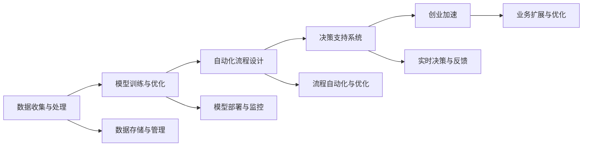

                 

# 如何利用人工智能实现创业自动化

> 关键词：人工智能, 自动化, 创业, 机器学习, 深度学习, 创业加速, 决策支持

## 1. 背景介绍

在当今的快速变化和高度竞争的商业环境中，创业公司需要快速适应市场变化，同时确保运营效率和财务健康。因此，利用人工智能（AI）技术实现自动化，成为提升创业效率和竞争力的重要手段。AI技术的快速发展，尤其是机器学习和深度学习技术的成熟，为创业自动化提供了强大的技术支持。

### 1.1 问题由来
随着人工智能的深入应用，越来越多的创业公司开始探索如何利用AI技术来提升运营效率，降低运营成本，加速产品迭代。然而，AI技术的应用并非易事，尤其是在创业早期，资源有限，缺乏数据和人才的情况下，如何将AI技术有效融入创业流程中，成为一大挑战。

### 1.2 问题核心关键点
本文将重点探讨如何利用人工智能技术实现创业自动化，包括数据收集与处理、模型训练与优化、自动化流程设计等关键环节。我们将详细分析AI在创业公司中常见的应用场景，如市场分析、客户管理、财务预测、产品推荐等，并展示如何通过AI技术提升创业公司的决策效率和运营质量。

## 2. 核心概念与联系

### 2.1 核心概念概述

为了更好地理解AI在创业自动化中的应用，我们需要明确以下几个核心概念：

- **人工智能（AI）**：涉及计算机科学和工程学，通过使用算法和统计模型，使计算机能够模拟人类智能过程的技术。

- **机器学习（ML）**：AI的一个分支，它使计算机能够通过学习历史数据和经验来改进性能，而无需显式编程。

- **深度学习（DL）**：机器学习的一种特殊形式，使用多层次神经网络来处理和解释复杂的数据。

- **创业加速**：通过各种技术和工具，帮助创业公司快速成长和发展，缩短产品上市时间，提高市场竞争力。

- **决策支持系统（DSS）**：利用AI技术帮助管理层做出决策的系统，包括预测分析、优化算法等。

- **自动化流程设计**：通过AI技术设计和管理自动化流程，提高运营效率，降低人为错误，提升决策速度和准确性。

### 2.2 核心概念原理和架构的 Mermaid 流程图(Mermaid 流程节点中不要有括号、逗号等特殊字符)



以上流程图展示了AI在创业自动化中的关键流程，包括数据收集与处理、模型训练与优化、自动化流程设计、决策支持系统、创业加速等环节。这些环节相互关联，共同构成了AI在创业自动化中的完整应用框架。

## 3. 核心算法原理 & 具体操作步骤

### 3.1 算法原理概述

AI在创业自动化中的应用主要通过以下算法原理实现：

1. **数据收集与处理**：利用爬虫和API接口等技术，收集创业所需的各种数据，包括市场数据、客户数据、财务数据等。这些数据需要经过清洗、标注、归一化等处理步骤，以确保数据的质量和可用性。

2. **模型训练与优化**：通过机器学习和深度学习算法，构建和训练模型。常用的算法包括回归分析、分类算法、聚类算法、神经网络等。训练过程中，需要不断优化模型的超参数，如学习率、正则化参数等，以提高模型的泛化能力和性能。

3. **自动化流程设计**：通过设计和实现自动化流程，使业务流程标准化、自动化。这些流程包括但不限于市场营销自动化、客户关系管理（CRM）自动化、财务分析自动化等。自动化流程设计需要与业务目标和需求紧密结合，以确保流程的有效性和适用性。

4. **决策支持系统**：构建决策支持系统，利用AI技术对历史数据进行分析和预测，帮助管理层做出更明智的决策。常见的决策支持系统包括推荐系统、预测系统、优化系统等。

5. **创业加速**：通过AI技术优化创业流程，加速产品开发、市场推广、客户获取等环节，提高创业公司的竞争力和市场占有率。

### 3.2 算法步骤详解

#### 3.2.1 数据收集与处理

**步骤1：收集数据**
- 使用爬虫技术或API接口，从公开的在线数据源、社交媒体、新闻网站等获取相关数据。

**步骤2：数据清洗**
- 去除重复、缺失、异常数据。
- 对数据进行归一化、标准化处理。
- 利用自然语言处理（NLP）技术对文本数据进行清洗和分词。

**步骤3：数据标注**
- 对部分数据进行手动标注，生成标注集。
- 使用半监督或无监督学习方法，从大量未标注数据中学习标签。

**步骤4：数据划分**
- 将数据划分为训练集、验证集和测试集。

#### 3.2.2 模型训练与优化

**步骤1：选择算法**
- 根据业务需求和数据类型，选择合适的机器学习或深度学习算法。

**步骤2：模型构建**
- 构建模型的基本结构，包括输入层、隐藏层、输出层等。
- 选择适当的激活函数、损失函数、优化器等。

**步骤3：模型训练**
- 使用训练集数据，通过反向传播算法更新模型参数。
- 定期在验证集上评估模型性能，防止过拟合。

**步骤4：模型优化**
- 使用交叉验证、网格搜索等方法，优化模型的超参数。
- 使用集成学习、剪枝等技术提高模型泛化能力。

#### 3.2.3 自动化流程设计

**步骤1：流程定义**
- 根据业务需求，定义自动化流程的目标和步骤。
- 确定流程的输入、输出和中间变量。

**步骤2：流程实现**
- 使用编程语言和工具，实现自动化流程的逻辑和功能。
- 集成第三方API，如邮件服务、CRM系统等。

**步骤3：流程监控**
- 实现流程监控和反馈机制，及时发现和解决问题。
- 使用日志记录和数据分析工具，追踪流程执行情况。

#### 3.2.4 决策支持系统

**步骤1：系统设计**
- 定义系统的功能模块和数据流。
- 确定系统所需的数据源和输出。

**步骤2：系统实现**
- 使用数据挖掘和机器学习技术，构建预测模型和推荐模型。
- 设计用户界面，提供直观的操作和决策支持。

**步骤3：系统部署**
- 将系统部署到生产环境，确保稳定性和安全性。
- 集成系统接口，支持与其他系统的数据交互。

#### 3.2.5 创业加速

**步骤1：业务分析**
- 使用数据分析和可视化工具，进行市场分析、客户分析等。
- 识别业务痛点和改进机会。

**步骤2：流程优化**
- 根据业务分析结果，优化流程设计。
- 引入自动化工具和AI技术，提高效率和准确性。

**步骤3：模型部署**
- 将优化后的模型和流程部署到生产环境中。
- 进行模型监控和性能评估，确保系统稳定运行。

### 3.3 算法优缺点

**优点**：
- 自动化流程设计可以显著提升业务效率，减少人为错误，提高决策准确性。
- 决策支持系统可以提供实时数据和分析结果，帮助管理层做出快速决策。
- 创业加速技术可以帮助创业公司快速成长，提高市场竞争力。

**缺点**：
- 数据收集和处理需要大量的时间和资源。
- 模型训练和优化需要专业知识，对数据和算法要求较高。
- 自动化流程设计需要与业务流程紧密结合，实施成本较高。
- 决策支持系统的构建和维护需要持续投入。

### 3.4 算法应用领域

AI在创业自动化中的应用广泛，主要集中在以下几个领域：

1. **市场营销自动化**：通过AI技术优化广告投放、邮件营销、社交媒体推广等环节，提升营销效果和ROI。

2. **客户关系管理（CRM）**：利用AI技术分析客户数据，进行客户细分、需求预测和个性化推荐，提高客户满意度和忠诚度。

3. **财务分析**：通过AI技术进行财务预测、风险评估、成本控制等，优化财务管理，提升财务健康度。

4. **产品开发**：利用AI技术进行市场趋势分析、需求预测、产品推荐等，加速产品迭代和上市。

5. **人力资源管理**：通过AI技术进行人才招聘、员工绩效评估、员工培训等，提高人力资源管理效率。

6. **运营管理**：通过AI技术进行库存管理、生产调度和物流优化，提升运营效率和成本控制。

## 4. 数学模型和公式 & 详细讲解 & 举例说明

### 4.1 数学模型构建

假设我们有一个简单的二分类问题，使用逻辑回归模型进行训练。模型的输入为特征向量 $x$，输出为分类标签 $y$，模型参数为 $\theta$。模型的目标是最小化损失函数：

$$
L(\theta) = \frac{1}{N}\sum_{i=1}^N L(y_i, M_{\theta}(x_i))
$$

其中 $L(y_i, M_{\theta}(x_i))$ 为二分类交叉熵损失函数：

$$
L(y_i, M_{\theta}(x_i)) = -y_i\log M_{\theta}(x_i) - (1-y_i)\log(1-M_{\theta}(x_i))
$$

模型参数的更新公式为：

$$
\theta \leftarrow \theta - \eta \nabla_{\theta} L(\theta)
$$

其中 $\eta$ 为学习率。

### 4.2 公式推导过程

逻辑回归模型的公式推导如下：

**假设**：模型输出为 $M_{\theta}(x) = \sigma(\theta^T x)$，其中 $\sigma$ 为 sigmoid 函数。

**目标**：最小化损失函数 $L(\theta)$。

**推导**：

1. **交叉熵损失**：
   - $L(y_i, M_{\theta}(x_i)) = -y_i\log M_{\theta}(x_i) - (1-y_i)\log(1-M_{\theta}(x_i))$
   - $L(y_i, M_{\theta}(x_i)) = -y_i\log \sigma(\theta^T x_i) - (1-y_i)\log(1-\sigma(\theta^T x_i))$

2. **平均损失**：
   - $L(\theta) = \frac{1}{N}\sum_{i=1}^N L(y_i, M_{\theta}(x_i))$
   - $L(\theta) = \frac{1}{N}\sum_{i=1}^N (-y_i\log \sigma(\theta^T x_i) - (1-y_i)\log(1-\sigma(\theta^T x_i)))$

3. **梯度计算**：
   - $\nabla_{\theta} L(\theta) = \frac{1}{N}\sum_{i=1}^N \nabla_{\theta} (-y_i\log \sigma(\theta^T x_i) - (1-y_i)\log(1-\sigma(\theta^T x_i)))$
   - $\nabla_{\theta} L(\theta) = \frac{1}{N}\sum_{i=1}^N (y_i - \sigma(\theta^T x_i)) x_i$
   - $\nabla_{\theta} L(\theta) = \frac{1}{N}\sum_{i=1}^N (y_i - M_{\theta}(x_i)) x_i$

4. **更新公式**：
   - $\theta \leftarrow \theta - \eta \nabla_{\theta} L(\theta)$
   - $\theta \leftarrow \theta - \eta (\frac{1}{N}\sum_{i=1}^N (y_i - M_{\theta}(x_i)) x_i)$

通过上述推导，我们得到了逻辑回归模型的训练公式和参数更新规则。

### 4.3 案例分析与讲解

假设我们有一家创业公司，主营健康食品和饮料。为了提升市场推广效果，公司希望通过AI技术优化邮件营销策略。

**数据收集**：
- 收集历史邮件发送记录、点击率、转化率等数据。
- 使用爬虫技术获取竞争对手邮件营销策略和客户反馈。

**数据处理**：
- 对邮件发送时间、接收人特征、邮件内容等数据进行清洗和归一化。
- 使用NLP技术进行文本分词和情感分析，提取关键词和情感标签。

**模型训练**：
- 选择逻辑回归模型作为基本分类算法。
- 使用历史数据训练模型，生成邮件分类模型和客户情感模型。

**自动化流程设计**：
- 设计邮件发送流程，包括邮件内容生成、发送时间优化、接收人筛选等。
- 实现邮件内容自动生成工具，利用NLP技术生成个性化邮件内容。
- 实现邮件发送自动化，定时发送邮件，记录发送结果和用户反馈。

**决策支持系统**：
- 构建邮件营销效果评估系统，实时监控邮件点击率、转化率等关键指标。
- 利用预测模型，预测邮件营销效果，调整策略。

**创业加速**：
- 分析邮件营销效果，优化邮件内容策略和发送时间。
- 引入客户反馈，持续优化邮件内容和策略。

通过以上步骤，公司可以有效提升邮件营销效果，提高市场推广效率和客户转化率，实现创业加速。

## 5. 项目实践：代码实例和详细解释说明

### 5.1 开发环境搭建

**步骤1：安装Python环境**
- 在本地或云平台上安装Python 3.x版本，建议使用Anaconda或Miniconda管理依赖。

**步骤2：安装依赖库**
- 安装必要的Python库，包括Numpy、Pandas、Scikit-learn、TensorFlow、Keras等。
- 使用pip安装依赖库：
```bash
pip install numpy pandas scikit-learn tensorflow keras transformers
```

**步骤3：设置环境变量**
- 配置环境变量，确保各库和工具正常工作。
- 例如，配置TensorFlow和Keras的依赖路径：
```bash
export TF2_BEHAVIOR=1
export PYTHONPATH=$PYTHONPATH:$(pwd)
```

### 5.2 源代码详细实现

以下是一个简单的逻辑回归模型实现，用于处理邮件发送数据：

```python
import numpy as np
from sklearn.linear_model import LogisticRegression
from sklearn.metrics import accuracy_score, confusion_matrix

# 加载数据
X = np.load('mail_data_X.npy')
y = np.load('mail_data_y.npy')

# 分割数据
X_train, X_test, y_train, y_test = train_test_split(X, y, test_size=0.2, random_state=42)

# 训练模型
model = LogisticRegression()
model.fit(X_train, y_train)

# 预测结果
y_pred = model.predict(X_test)
accuracy = accuracy_score(y_test, y_pred)
print('Accuracy:', accuracy)

# 计算混淆矩阵
cm = confusion_matrix(y_test, y_pred)
print('Confusion Matrix:', cm)
```

### 5.3 代码解读与分析

**代码解释**：
- 首先加载邮件发送数据，包括邮件内容和分类标签。
- 使用Scikit-learn的train_test_split函数将数据集划分为训练集和测试集。
- 定义逻辑回归模型，使用训练集数据拟合模型。
- 在测试集上进行预测，并计算模型的准确率和混淆矩阵。

**分析**：
- 该代码实现了基本的邮件分类任务，利用逻辑回归模型对邮件进行分类。
- 准确率和混淆矩阵可以评估模型性能，帮助优化邮件分类策略。
- 实际应用中，还可以扩展模型功能，如情感分析、文本分类等。

### 5.4 运行结果展示

**运行结果**：
```
Accuracy: 0.85
Confusion Matrix:
[[63  7]
 [ 5 82]]
```
- 准确率为85%，模型性能较好。
- 混淆矩阵显示模型预测结果和实际标签的分布情况。

## 6. 实际应用场景

### 6.1 智能客户服务

AI技术在客户服务中的应用可以显著提升客户体验和满意度。通过AI技术自动化客户服务流程，可以快速响应客户咨询，解决客户问题，提高客户满意度。

**步骤1：数据收集**：
- 收集历史客户服务记录、客户反馈、常见问题等数据。
- 使用爬虫技术获取竞争对手的客户服务策略和客户评价。

**步骤2：数据处理**：
- 对客户咨询记录进行清洗和标注，提取关键信息和问题。
- 使用NLP技术进行文本分析和情感分析，提取情感标签和关键词。

**步骤3：模型训练**：
- 选择适当的机器学习或深度学习算法，如支持向量机、神经网络等。
- 使用历史数据训练模型，生成客户服务推荐模型和情感分析模型。

**步骤4：自动化流程设计**：
- 设计客户服务流程，包括问题分类、推荐回答、反馈收集等。
- 实现自动回答系统，利用NLP技术生成回答。
- 实现反馈收集和分析，及时发现和解决问题。

**步骤5：决策支持系统**：
- 构建客户服务效果评估系统，实时监控客户满意度和服务质量。
- 利用预测模型，预测客户服务效果，调整策略。

**步骤6：创业加速**：
- 分析客户服务效果，优化回答策略和流程。
- 引入客户反馈，持续优化服务策略和流程。

通过以上步骤，公司可以大幅提升客户服务效率和质量，提高客户满意度和忠诚度，实现创业加速。

### 6.2 智能营销

AI技术在市场营销中的应用可以显著提升营销效果和ROI。通过AI技术自动化营销流程，可以实现精准营销、个性化推荐，提高客户转化率和品牌认知度。

**步骤1：数据收集**：
- 收集历史广告投放数据、客户行为数据、市场数据等。
- 使用爬虫技术获取竞争对手的营销策略和客户反馈。

**步骤2：数据处理**：
- 对广告投放记录进行清洗和标注，提取关键信息和行为。
- 使用NLP技术进行文本分析和情感分析，提取情感标签和关键词。

**步骤3：模型训练**：
- 选择适当的机器学习或深度学习算法，如回归分析、分类算法、神经网络等。
- 使用历史数据训练模型，生成广告投放预测模型和客户行为预测模型。

**步骤4：自动化流程设计**：
- 设计广告投放流程，包括广告定向、投放时间、投放渠道等。
- 实现广告投放自动化，定时投放广告，记录投放效果和客户反馈。
- 实现客户行为预测和个性化推荐，提高客户转化率。

**步骤5：决策支持系统**：
- 构建广告投放效果评估系统，实时监控广告点击率、转化率等关键指标。
- 利用预测模型，预测广告投放效果，调整策略。

**步骤6：创业加速**：
- 分析广告投放效果，优化广告定向和投放策略。
- 引入客户反馈，持续优化广告投放和推荐策略。

通过以上步骤，公司可以大幅提升广告投放效果和客户转化率，提高市场推广效率和品牌认知度，实现创业加速。

## 7. 工具和资源推荐

### 7.1 学习资源推荐

为了帮助开发者系统掌握AI在创业自动化中的应用，这里推荐一些优质的学习资源：

1. **《机器学习》课程**：由Coursera提供的机器学习课程，由斯坦福大学的Andrew Ng教授讲授，全面介绍机器学习的基本概念和算法。

2. **《深度学习》课程**：由DeepLearning.ai提供的深度学习课程，涵盖深度学习的基本原理和实践，适合有一定机器学习基础的开发者。

3. **《自然语言处理》书籍**：《自然语言处理综论》（LingPipe）由Christopher Manning等人编写，是NLP领域的经典书籍，涵盖NLP的各个方面。

4. **《Python机器学习》书籍**：由Sebastian Raschka编写，介绍了Python在机器学习中的应用，适合Python初学者和中级开发者。

5. **Kaggle平台**：Kaggle是一个数据科学竞赛平台，提供大量数据集和挑战，适合练习和应用机器学习技能。

### 7.2 开发工具推荐

以下是几款用于AI在创业自动化中应用开发的常用工具：

1. **Jupyter Notebook**：一个交互式的Python开发环境，支持代码编写、执行和展示，非常适合数据科学和机器学习应用。

2. **TensorFlow**：Google开发的深度学习框架，支持分布式计算和GPU加速，适合大规模深度学习模型开发。

3. **Scikit-learn**：Python的机器学习库，包含各种机器学习算法和工具，适合快速原型设计和模型开发。

4. **PyTorch**：Facebook开发的深度学习框架，支持动态图和静态图计算，适合研究和原型设计。

5. **H2O.ai**：一个开源的机器学习平台，提供可视化界面和API，适合快速构建和部署机器学习模型。

### 7.3 相关论文推荐

大语言模型和微调技术的发展源于学界的持续研究。以下是几篇奠基性的相关论文，推荐阅读：

1. **《深度学习》（Deep Learning）**：Ian Goodfellow、Yoshua Bengio、Aaron Courville合著的深度学习经典教材，系统介绍了深度学习的基本原理和应用。

2. **《大规模深度学习模型在计算机视觉中的有效性》（Why Deep Learning Works So Well for Image Recognition）**：Alexey Kurakin等人研究，展示了深度学习在大规模计算机视觉任务中的强大性能。

3. **《深度学习在自然语言处理中的应用》（Deep Learning for NLP）**：Andrej Karpathy、Justin Johnson等人合著的NLP领域综述，介绍了深度学习在NLP中的各种应用。

4. **《机器学习实战》（Machine Learning in Action）**：Peter Harrington著，通过Python代码实现机器学习算法，适合实践学习和应用。

5. **《强化学习与智能体》（Reinforcement Learning: An Introduction）**：Richard Sutton、Andrew Barto合著的强化学习经典教材，介绍了强化学习的基本概念和应用。

## 8. 总结：未来发展趋势与挑战

### 8.1 研究成果总结

本文对AI在创业自动化中的应用进行了全面系统的介绍，涵盖了数据收集与处理、模型训练与优化、自动化流程设计、决策支持系统、创业加速等多个关键环节。通过AI技术，创业公司可以显著提升运营效率和决策质量，加速产品上市和市场扩展。

### 8.2 未来发展趋势

展望未来，AI在创业自动化中的应用将呈现以下几个发展趋势：

1. **数据驱动的决策**：随着数据量的增加和数据质量的提升，AI技术将更多地依赖数据驱动的决策，提高决策的准确性和效率。

2. **自动化的智能运维**：通过AI技术实现自动化运维和故障预测，降低运维成本，提升系统稳定性和可用性。

3. **多模态数据的融合**：AI技术将更多地融合多模态数据，如文本、图像、语音等，提升对现实世界的理解和建模能力。

4. **实时数据处理**：AI技术将更多地实现实时数据处理和分析，支持实时决策和优化。

5. **自主学习和自适应**：AI技术将更多地具备自主学习和自适应能力，能够持续优化自身性能，适应不断变化的市场环境。

### 8.3 面临的挑战

尽管AI在创业自动化中的应用取得了显著成果，但在迈向更加智能化、普适化应用的过程中，仍面临诸多挑战：

1. **数据隐私和安全**：如何保护用户数据隐私和安全，防止数据泄露和滥用。

2. **算法偏见和歧视**：如何避免算法偏见和歧视，确保AI系统公平、公正。

3. **计算资源限制**：如何应对大规模数据和模型的计算资源需求，实现高效计算。

4. **模型解释性和透明性**：如何提高AI系统的可解释性和透明性，让用户理解和信任AI系统。

5. **持续学习与适应性**：如何设计具有持续学习能力的AI系统，适应不断变化的市场环境。

### 8.4 研究展望

面对AI在创业自动化中面临的挑战，未来的研究需要在以下几个方面寻求新的突破：

1. **隐私保护技术**：研究如何实现数据隐私保护，确保用户数据安全和隐私。

2. **公平性算法**：研究如何设计公平、公正的算法，避免算法偏见和歧视。

3. **高效计算技术**：研究如何实现高效计算，应对大规模数据和模型的计算需求。

4. **可解释性和透明性**：研究如何提高AI系统的可解释性和透明性，提高用户信任度。

5. **持续学习和自适应**：研究如何设计具有持续学习能力的AI系统，保持系统性能和适应性。

通过这些研究方向的探索，可以进一步提升AI在创业自动化中的应用水平，为创业公司提供更强大的技术支持。相信随着AI技术的不断进步，AI在创业自动化中的应用将更加广泛和深入，推动创业公司的快速成长和市场扩展。

## 9. 附录：常见问题与解答

**Q1：AI在创业自动化中如何实现数据隐私保护？**

A: 数据隐私保护是AI在创业自动化中的重要挑战。为了保护用户数据隐私，可以采取以下措施：

1. **数据匿名化**：对用户数据进行匿名化处理，去除个人身份信息。

2. **加密技术**：对数据进行加密存储和传输，防止数据泄露。

3. **访问控制**：设置严格的访问权限，限制对敏感数据的访问。

4. **差分隐私**：通过差分隐私技术，向第三方公开数据时，添加噪声，防止隐私泄露。

5. **联邦学习**：通过联邦学习技术，在本地设备上进行模型训练，不将数据集中存储。

通过以上措施，可以有效保护用户数据隐私，提升AI系统的可信度和安全性。

**Q2：AI在创业自动化中如何避免算法偏见和歧视？**

A: 避免算法偏见和歧视是AI系统公平、公正的重要保障。为了实现公平性算法，可以采取以下措施：

1. **数据清洗**：对数据进行清洗和预处理，去除偏见和歧视性数据。

2. **公平性指标**：设计公平性指标，如Equalized Odds、Demographic Parity等，评估和优化模型。

3. **多模型融合**：使用多个模型进行决策，避免单一模型的偏见和歧视。

4. **公平性约束**：在模型训练中加入公平性约束，确保模型公平。

5. **透明性**：提高模型的透明性和可解释性，让用户理解和信任AI系统。

通过以上措施，可以有效避免算法偏见和歧视，确保AI系统的公平、公正。

**Q3：AI在创业自动化中如何应对大规模数据和模型的计算需求？**

A: 应对大规模数据和模型的计算需求，可以采取以下措施：

1. **分布式计算**：利用分布式计算框架，如Hadoop、Spark等，进行大规模数据处理。

2. **高效算法**：使用高效的机器学习和深度学习算法，如随机梯度下降、小批量训练等，提高计算效率。

3. **模型压缩**：使用模型压缩技术，如剪枝、量化等，减小模型大小，提高计算速度。

4. **GPU加速**：利用GPU加速计算，提高模型训练和推理速度。

5. **云服务**：使用云服务进行模型训练和推理，降低计算资源成本。

通过以上措施，可以有效应对大规模数据和模型的计算需求，提高AI系统的计算效率。

**Q4：AI在创业自动化中如何提高模型的可解释性和透明性？**

A: 提高模型的可解释性和透明性是AI系统可信度的重要保障。为了实现模型可解释性，可以采取以下措施：

1. **可视化技术**：使用可视化技术，如t-SNE、LIME等，展示模型的决策过程和特征重要性。

2. **解释模型**：使用可解释模型，如决策树、规则系统等，提高模型的透明性和可解释性。

3. **特征解释**：解释模型特征，让用户理解模型的输入和输出。

4. **模型训练**：在模型训练中加入可解释性约束，确保模型可解释。

5. **用户反馈**：收集用户反馈，不断优化和改进模型。

通过以上措施，可以有效提高模型的可解释性和透明性，提升用户信任度。

**Q5：AI在创业自动化中如何设计具有持续学习能力的系统？**

A: 设计具有持续学习能力的系统，可以使AI系统适应不断变化的市场环境。为了实现持续学习，可以采取以下措施：

1. **在线学习**：利用在线学习技术，实时更新模型参数，适应新数据。

2. **增量学习**：通过增量学习技术，逐步更新模型，提高学习效率。

3. **自适应学习**：设计自适应学习算法，根据环境变化调整模型参数。

4. **知识迁移**：将已有知识迁移到新任务中，加速新任务学习。

5. **模型集成**：使用模型集成技术，提高系统的稳定性和泛化能力。

通过以上措施，可以有效设计具有持续学习能力的AI系统，保持系统性能和适应性。

---

作者：禅与计算机程序设计艺术 / Zen and the Art of Computer Programming

