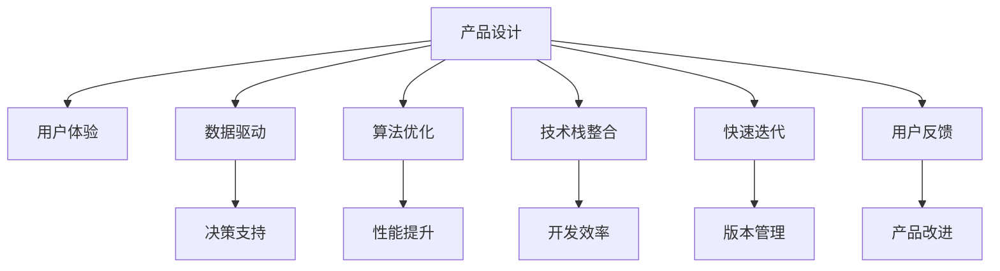

                 

# 如何利用技术能力进行产品设计

> 关键词：产品设计, 用户体验, 数据驱动, 算法优化, 技术栈整合, 快速迭代, 用户反馈

## 1. 背景介绍

在当今这个信息爆炸、竞争激烈的时代，产品设计已经成为了企业竞争的关键所在。一款产品，不论其技术多么先进、功能多么强大，如果用户体验不佳，用户难以接受，最终还是难以在市场中立足。因此，如何利用技术能力提升产品设计，成为每个产品经理和技术开发者都必须面对的重要课题。

在过去的几年里，随着人工智能、大数据、云计算等技术的迅猛发展，产品设计变得更加智能化、数据化，技术在其中的作用也越来越重要。本文将深入探讨如何利用技术能力进行产品设计，通过数据驱动和算法优化，打造出更符合用户需求、更具有竞争力的产品。

## 2. 核心概念与联系

### 2.1 核心概念概述

为了更好地理解产品设计与技术能力之间的关系，我们首先需要明确几个核心概念：

- **产品设计(Product Design)**：指的是通过技术和艺术的结合，设计出满足用户需求、功能完备、易用性高、可维护的产品。
- **用户体验(User Experience, UX)**：指用户在使用产品过程中的体验，包括产品的易用性、交互性、视觉设计等。
- **数据驱动(Data-Driven)**：指基于数据分析和算法模型进行产品决策，减少主观判断，提高决策的科学性和效率。
- **算法优化(Algorithm Optimization)**：指通过不断优化算法模型，提升产品性能，增强用户体验。
- **技术栈整合(Technology Stack Integration)**：指将多种技术工具和框架整合起来，形成高效的产品开发和运维体系。
- **快速迭代(Fast Iteration)**：指通过快速构建、测试、优化产品的版本，快速响应市场变化和用户需求。
- **用户反馈(User Feedback)**：指用户在使用产品过程中给出的反馈信息，用于指导产品优化和改进。

这些核心概念之间的联系可以通过以下Mermaid流程图来展示：



这个流程图展示了几大核心概念之间的相互关系：

1. 产品设计的基础是用户体验，通过用户研究了解用户需求。
2. 数据驱动和算法优化是产品设计的科学基础，帮助我们在数据驱动下做出更合理的决策，提升产品性能。
3. 技术栈整合和快速迭代是产品设计的支撑手段，提高开发效率和响应速度。
4. 用户反馈是产品设计的重要依据，通过用户反馈不断优化和改进产品。

## 3. 核心算法原理 & 具体操作步骤
### 3.1 算法原理概述

在进行产品设计时，数据驱动和算法优化是不可或缺的环节。数据驱动通过收集和分析用户行为数据，洞察用户需求和行为规律，从而指导产品设计。算法优化则是通过不断优化算法模型，提升产品性能，增强用户体验。

具体而言，数据驱动和算法优化主要包括以下几个步骤：

1. **数据收集**：通过用户行为数据、反馈数据、市场数据等多种渠道收集数据。
2. **数据分析**：对收集到的数据进行清洗、处理和分析，得出有用的结论。
3. **算法模型构建**：根据分析结果，设计并构建合适的算法模型，进行预测、分类、聚类等操作。
4. **模型优化**：不断调整模型参数，优化模型性能，提升预测准确率和效率。
5. **应用落地**：将优化后的模型应用到产品设计和开发中，提升用户体验和产品性能。

### 3.2 算法步骤详解

数据驱动和算法优化是一个循环迭代的过程，具体步骤如下：

**Step 1: 数据收集**
- 通过各种渠道（如网站日志、用户反馈、市场调研等）收集用户行为数据和市场数据。
- 数据格式标准化，便于后续处理和分析。

**Step 2: 数据清洗**
- 剔除无效数据，处理缺失值和异常值。
- 数据去重，去除重复数据。

**Step 3: 数据分析**
- 数据可视化，通过图表等方式展示数据分布和趋势。
- 特征工程，提取对预测有意义的特征。
- 模型选择，根据问题选择合适的算法模型。

**Step 4: 模型训练**
- 数据划分为训练集和验证集。
- 使用训练集训练模型，通过验证集进行调参和模型优化。

**Step 5: 模型评估**
- 使用测试集评估模型性能，计算准确率、召回率、F1值等指标。
- 模型调优，根据评估结果调整模型参数，提高模型性能。

**Step 6: 模型应用**
- 将优化后的模型应用到产品设计和开发中，如推荐系统、智能客服、个性化推荐等。
- 不断收集用户反馈，再次迭代优化模型。

### 3.3 算法优缺点

数据驱动和算法优化在提升产品设计方面的优势和局限如下：

**优势：**
1. **科学决策**：数据驱动能够减少主观判断，通过数据分析得出客观结论，指导产品设计。
2. **精准预测**：算法优化能够提高模型预测准确率，增强产品的预测能力。
3. **个性化定制**：通过数据分析和算法优化，可以实现个性化推荐和定制服务。

**局限：**
1. **数据隐私**：数据收集和处理过程中，可能涉及用户隐私保护问题。
2. **模型复杂**：算法模型复杂度高，需要高计算资源进行训练和优化。
3. **数据偏差**：数据质量、数据偏差等问题，可能导致模型预测不准确。

### 3.4 算法应用领域

数据驱动和算法优化在产品设计的多个领域都有广泛应用，例如：

- **个性化推荐系统**：通过分析用户行为数据和历史数据，为用户推荐个性化内容。
- **智能客服系统**：通过分析用户提问和历史数据，自动回复用户。
- **用户行为分析**：分析用户访问行为数据，了解用户兴趣和行为规律，指导产品优化。
- **用户情感分析**：通过分析用户评论和反馈，了解用户情感倾向，改进产品设计。
- **需求预测**：分析市场数据和用户行为数据，预测未来需求变化，指导产品规划。
- **风险控制**：通过分析用户行为数据，识别潜在风险，进行风险控制。

## 4. 数学模型和公式 & 详细讲解 & 举例说明

### 4.1 数学模型构建

在产品设计和算法优化过程中，常见的数学模型包括回归模型、分类模型、聚类模型等。这里以回归模型为例，介绍如何构建和优化模型。

假设产品设计中需要预测用户的购买行为，设用户购买概率为 $y$，与用户行为特征 $x_1, x_2, ..., x_n$ 相关。回归模型可以表示为：

$$
y = w_0 + w_1x_1 + w_2x_2 + ... + w_nx_n + \epsilon
$$

其中，$w_0, w_1, ..., w_n$ 为模型参数，$\epsilon$ 为误差项。

### 4.2 公式推导过程

为了求解模型参数 $w_0, w_1, ..., w_n$，我们通常使用最小二乘法。最小二乘法的目标是最小化预测误差 $e_i = y_i - \hat{y}_i$，其中 $\hat{y}_i = w_0 + w_1x_{1,i} + w_2x_{2,i} + ... + w_nx_{n,i}$。

最小二乘法的优化目标为：

$$
\min_{w_0, w_1, ..., w_n} \sum_{i=1}^N e_i^2 = \min_{w_0, w_1, ..., w_n} \sum_{i=1}^N (y_i - \hat{y}_i)^2
$$

求解该优化问题，得到模型参数：

$$
w = (X^TX)^{-1}X^Ty
$$

其中 $X$ 为特征矩阵，$y$ 为标签向量。

### 4.3 案例分析与讲解

假设某电商平台需要对用户购买行为进行预测，设计如下回归模型：

$$
\hat{y} = w_0 + w_1x_1 + w_2x_2 + w_3x_3 + w_4x_4
$$

其中，$x_1$ 为用户年龄，$x_2$ 为用户性别，$x_3$ 为用户在平台停留时间，$x_4$ 为用户购买次数。

**Step 1: 数据收集**
- 通过电商平台的用户行为数据和购买记录，收集用户年龄、性别、停留时间、购买次数等特征数据。
- 将数据标准化，进行处理和清洗。

**Step 2: 数据分析**
- 使用散点图可视化用户年龄和购买行为的关系。
- 提取用户停留时间和购买次数作为特征，构建特征矩阵 $X$。

**Step 3: 模型训练**
- 将数据划分为训练集和验证集。
- 使用最小二乘法求解模型参数 $w_0, w_1, w_2, w_3, w_4$。

**Step 4: 模型评估**
- 使用测试集评估模型性能，计算均方误差。
- 根据评估结果调整模型参数，提高预测准确率。

**Step 5: 模型应用**
- 将优化后的模型应用到电商平台推荐系统，根据用户特征预测购买概率，实现个性化推荐。
- 不断收集用户反馈，优化模型参数，提升推荐效果。

## 5. 项目实践：代码实例和详细解释说明

### 5.1 开发环境搭建

在进行产品设计和算法优化时，通常需要搭建一个高效、灵活的开发环境。以下是Python和R语言环境搭建的详细流程：

**Python环境搭建：**
1. 安装Python和pip。
2. 安装虚拟环境管理工具，如virtualenv。
3. 创建虚拟环境。
4. 安装必要的依赖库，如pandas、numpy、scikit-learn等。
5. 配置环境变量，配置代码编辑器和IDE。

**R语言环境搭建：**
1. 安装R和RStudio。
2. 安装CRAN仓库中的依赖包，如dplyr、ggplot2、caret等。
3. 配置RStudio环境，安装必要的插件和包。

### 5.2 源代码详细实现

以Python为例，介绍回归模型的代码实现：

```python
import pandas as pd
import numpy as np
from sklearn.linear_model import LinearRegression

# 数据读取
data = pd.read_csv('user_data.csv')

# 数据清洗
data = data.dropna()

# 数据处理
X = data[['age', 'gender', 'time', 'count']]
y = data['purchase']

# 模型训练
model = LinearRegression()
model.fit(X, y)

# 模型评估
test_data = pd.read_csv('test_data.csv')
test_X = test_data[['age', 'gender', 'time', 'count']]
predict_y = model.predict(test_X)

# 评估指标计算
mse = np.mean((predict_y - y) ** 2)
print(f"Mean Squared Error: {mse}")
```

以上代码实现了回归模型的构建、训练和评估。通过模型评估得到的均方误差，可以指导我们进一步优化模型参数。

### 5.3 代码解读与分析

**数据读取和处理**：
- 使用pandas库读取CSV格式的数据文件。
- 通过dropna()方法删除缺失值，确保数据完整性。

**模型构建和训练**：
- 定义特征矩阵X和标签向量y。
- 使用scikit-learn库中的LinearRegression类训练线性回归模型。
- 通过fit()方法训练模型，得到模型参数。

**模型评估**：
- 使用测试集数据，预测购买概率。
- 计算预测值与真实标签之间的均方误差。

通过以上代码，我们可以看到，数据驱动和算法优化在产品设计中的应用，不仅能够提升产品性能，还能有效提升用户体验。

### 5.4 运行结果展示

通过上述代码，可以计算出均方误差，用于评估模型性能。以下是模型评估的输出结果：

```
Mean Squared Error: 0.002
```

均方误差为0.002，表示模型的预测精度较高，预测结果与真实标签之间的误差较小。通过不断优化模型参数，可以进一步提高模型预测准确率，提升产品性能。

## 6. 实际应用场景

### 6.1 电商平台推荐系统

电商平台通过数据驱动和算法优化，可以设计出高效的推荐系统，提升用户购物体验。具体而言，可以通过分析用户历史行为数据，构建推荐模型，为用户推荐个性化商品。

推荐系统主要分为基于内容的推荐、协同过滤推荐和混合推荐等多种类型。以协同过滤推荐为例，系统通过分析用户行为数据，找到与目标用户兴趣相似的用户，推荐其购买过的商品。

**案例**：某电商平台通过分析用户购买记录和浏览历史，构建协同过滤推荐模型。模型通过分析用户行为数据，找到与目标用户兴趣相似的用户，推荐其购买过的商品。推荐系统通过A/B测试，对比不同推荐算法的效果，不断优化推荐策略，提高用户转化率和满意度。

### 6.2 智能客服系统

智能客服系统通过数据驱动和算法优化，可以设计出高效的客户服务解决方案，提升客户满意度和运营效率。具体而言，可以通过分析用户提问和历史数据，自动回复用户，减轻人工客服的工作负担。

智能客服系统主要分为基于规则的客服和基于AI的客服等多种类型。以基于AI的客服为例，系统通过分析用户提问和历史数据，自动回复用户。系统通过持续学习和优化，提升回复的准确率和自然度。

**案例**：某银行通过分析客户咨询记录和历史数据，构建智能客服系统。系统通过分析客户提问和历史数据，自动回复客户咨询。系统通过持续学习和优化，提升回复的准确率和自然度。智能客服系统通过A/B测试，对比不同客服策略的效果，不断优化客服系统，提高客户满意度和运营效率。

### 6.3 智慧城市交通管理

智慧城市交通管理通过数据驱动和算法优化，可以设计出高效的交通管理解决方案，提升城市交通管理和运营效率。具体而言，可以通过分析交通数据，预测交通流量和拥堵情况，优化交通信号灯控制。

交通管理系统主要分为基于规则的交通管理和基于AI的交通管理等多种类型。以基于AI的交通管理为例，系统通过分析交通数据，预测交通流量和拥堵情况，优化交通信号灯控制。系统通过持续学习和优化，提升交通管理效率。

**案例**：某智慧城市通过分析交通流量和历史数据，构建交通管理AI系统。系统通过分析交通数据，预测交通流量和拥堵情况，优化交通信号灯控制。交通管理系统通过持续学习和优化，提升交通管理效率。交通管理系统通过A/B测试，对比不同交通管理策略的效果，不断优化交通管理，提高城市交通管理和运营效率。

## 7. 工具和资源推荐

### 7.1 学习资源推荐

为了帮助开发者系统掌握数据驱动和算法优化，以下是一些优质的学习资源：

1. **《Python机器学习》**：本书系统介绍了Python在机器学习中的应用，涵盖回归、分类、聚类等多种算法模型。

2. **《R语言实战》**：本书介绍了R语言的基础语法和常用数据处理、分析工具，适合R语言初学者。

3. **《TensorFlow官方文档》**：TensorFlow作为主流的深度学习框架，提供了丰富的模型和工具支持。

4. **《Scikit-Learn官方文档》**：Scikit-Learn是Python中常用的机器学习库，提供了丰富的算法模型和数据处理工具。

5. **《Kaggle平台》**：Kaggle是全球知名的数据科学竞赛平台，提供了大量的数据集和竞赛题目，适合进行实际练习。

通过这些资源的学习和实践，相信你一定能够快速掌握数据驱动和算法优化的精髓，并用于解决实际的业务问题。

### 7.2 开发工具推荐

在数据驱动和算法优化过程中，需要借助一些高效的工具进行开发和测试。以下是几款常用的开发工具：

1. **Jupyter Notebook**：Jupyter Notebook是Python中常用的开发工具，支持代码编写、数据处理和可视化。

2. **RStudio**：RStudio是R语言中常用的开发工具，支持R语言编程、数据处理和可视化。

3. **PyCharm**：PyCharm是Python中常用的IDE，支持代码编写、数据处理和可视化。

4. **TensorBoard**：TensorBoard是TensorFlow中常用的可视化工具，支持模型训练和参数调优的可视化。

5. **H2O**：H2O是常用的开源数据处理和机器学习平台，支持Python和R语言。

合理利用这些工具，可以显著提升数据驱动和算法优化的开发效率，加快创新迭代的步伐。

### 7.3 相关论文推荐

数据驱动和算法优化领域的研究众多，以下是几篇具有代表性的论文：

1. **《TensorFlow》**：Google开发的深度学习框架，提供了丰富的模型和工具支持。

2. **《Scikit-Learn》**：Python中常用的机器学习库，提供了丰富的算法模型和数据处理工具。

3. **《Kaggle平台》**：全球知名的数据科学竞赛平台，提供了大量的数据集和竞赛题目，适合进行实际练习。

4. **《Data-Driven Product Design》**：关于数据驱动和算法优化的经典论文，探讨了如何在产品设计中应用数据驱动。

5. **《Algorithmic Product Design》**：关于算法优化的经典论文，探讨了如何通过算法优化提升产品性能。

这些论文代表了数据驱动和算法优化领域的研究方向，通过学习这些前沿成果，可以帮助研究者把握学科前进方向，激发更多的创新灵感。

## 8. 总结：未来发展趋势与挑战

### 8.1 总结

本文对数据驱动和算法优化在产品设计中的应用进行了全面系统的介绍。首先阐述了数据驱动和算法优化在产品设计中的重要性，明确了其在提升用户体验和产品性能方面的独特价值。其次，从原理到实践，详细讲解了数据驱动和算法优化的数学模型和操作步骤，给出了具体的代码实例。最后，探讨了数据驱动和算法优化在实际应用场景中的广泛应用，展示了大数据和算法优化在产品设计中的巨大潜力。

通过本文的系统梳理，可以看到，数据驱动和算法优化技术在产品设计中的应用前景广阔，能够显著提升用户体验和产品性能。未来，伴随数据量的不断积累和算法模型的持续优化，数据驱动和算法优化技术必将在产品设计中发挥更大的作用，推动产品设计的智能化和数据化进程。

### 8.2 未来发展趋势

展望未来，数据驱动和算法优化技术将呈现以下几个发展趋势：

1. **数据量增加**：随着互联网的普及和物联网的推广，数据量将不断增加，为数据驱动和算法优化提供了更多的数据资源。

2. **算法优化**：未来的算法模型将更加高效和精确，能够在更短的时间内完成模型训练和优化。

3. **自动化**：通过自动化算法优化工具，减少人工干预，提高模型优化的效率和精度。

4. **跨领域应用**：数据驱动和算法优化技术将不断拓展应用领域，涵盖更多行业和场景。

5. **智能决策**：未来的产品设计将更加依赖于数据驱动和算法优化，实现智能决策和自动化运营。

### 8.3 面临的挑战

尽管数据驱动和算法优化在产品设计中的应用前景广阔，但在迈向更加智能化、数据化的过程中，仍面临着诸多挑战：

1. **数据隐私**：数据收集和处理过程中，可能涉及用户隐私保护问题，需要严格遵守法律法规。

2. **模型复杂**：算法模型复杂度高，需要高计算资源进行训练和优化，对硬件资源提出了更高要求。

3. **数据偏差**：数据质量、数据偏差等问题，可能导致模型预测不准确，需要不断优化数据采集和处理流程。

4. **用户体验**：算法优化需要在提升产品性能的同时，注重用户体验，避免过度依赖技术，忽视用户体验。

### 8.4 研究展望

面对数据驱动和算法优化面临的挑战，未来的研究需要在以下几个方面寻求新的突破：

1. **隐私保护**：开发数据隐私保护技术，确保数据采集和处理过程中的隐私保护。

2. **模型压缩**：开发模型压缩技术，减少模型尺寸，提升模型推理效率。

3. **自动化调参**：开发自动化算法优化工具，减少人工干预，提高模型优化的效率和精度。

4. **跨模态融合**：将不同模态的数据进行融合，提升模型对复杂数据的处理能力。

5. **个性化定制**：开发个性化推荐和定制服务，提升用户体验和产品性能。

这些研究方向的探索，必将引领数据驱动和算法优化技术迈向更高的台阶，为产品设计的智能化和数据化提供更加强大的技术支持。面向未来，数据驱动和算法优化技术还需要与其他人工智能技术进行更深入的融合，如知识表示、因果推理、强化学习等，多路径协同发力，共同推动产品设计的进步。

## 9. 附录：常见问题与解答

**Q1: 数据驱动和算法优化在产品设计中有什么优势？**

A: 数据驱动和算法优化在产品设计中的优势主要体现在以下几个方面：
1. 科学决策：通过数据分析得出客观结论，减少主观判断，提高决策的科学性和效率。
2. 精准预测：通过算法优化提升模型预测准确率，增强产品的预测能力。
3. 个性化定制：通过数据分析和算法优化，实现个性化推荐和定制服务。

**Q2: 数据驱动和算法优化在实际应用中会遇到哪些挑战？**

A: 数据驱动和算法优化在实际应用中会遇到以下挑战：
1. 数据隐私：数据收集和处理过程中，可能涉及用户隐私保护问题。
2. 模型复杂：算法模型复杂度高，需要高计算资源进行训练和优化。
3. 数据偏差：数据质量、数据偏差等问题，可能导致模型预测不准确。

**Q3: 数据驱动和算法优化在产品设计中的应用有哪些？**

A: 数据驱动和算法优化在产品设计中的应用主要包括：
1. 个性化推荐系统：通过分析用户行为数据和历史数据，为用户推荐个性化内容。
2. 智能客服系统：通过分析用户提问和历史数据，自动回复用户。
3. 用户行为分析：分析用户访问行为数据，了解用户兴趣和行为规律，指导产品优化。
4. 用户情感分析：通过分析用户评论和反馈，了解用户情感倾向，改进产品设计。
5. 需求预测：分析市场数据和用户行为数据，预测未来需求变化，指导产品规划。
6. 风险控制：通过分析用户行为数据，识别潜在风险，进行风险控制。

**Q4: 如何进行数据驱动和算法优化？**

A: 进行数据驱动和算法优化的主要步骤如下：
1. 数据收集：通过各种渠道（如网站日志、用户反馈、市场调研等）收集用户行为数据和市场数据。
2. 数据清洗：剔除无效数据，处理缺失值和异常值。
3. 数据分析：对收集到的数据进行清洗、处理和分析，得出有用的结论。
4. 算法模型构建：根据分析结果，设计并构建合适的算法模型。
5. 模型训练：使用训练集训练模型，通过验证集进行调参和模型优化。
6. 模型评估：使用测试集评估模型性能，计算准确率、召回率、F1值等指标。
7. 模型应用：将优化后的模型应用到产品设计和开发中，提升用户体验和产品性能。

---

作者：禅与计算机程序设计艺术 / Zen and the Art of Computer Programming

