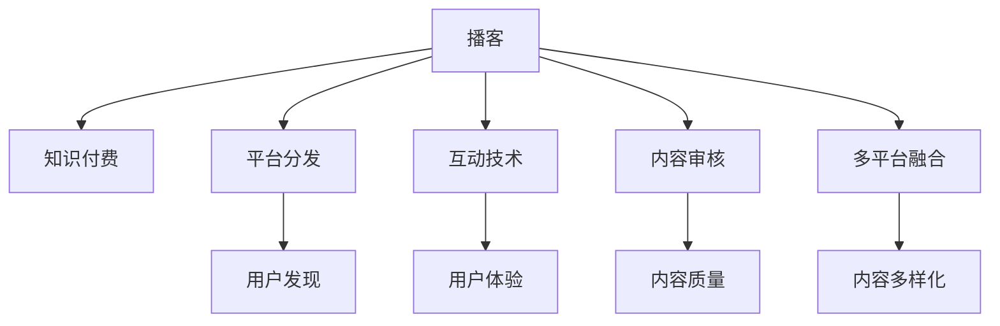

                 

# 如何利用播客形式进行知识付费

## 1. 背景介绍

### 1.1 问题由来

随着知识付费市场的高速发展，播客（Podcast）作为一种新兴的知识付费形式，因其灵活、便捷、互动性强等特性，正在逐渐获得用户的青睐。播客不仅提供音频内容，还支持多平台分发，用户可以随时随地进行知识获取和互动。但与此同时，播客制作成本高、内容创作质量难以保证、用户留存率低等问题，也严重制约了播客知识付费模式的持续发展。

播客制作成本高，主要体现在以下几个方面：
1. **录音设备成本**：优质录音设备价格昂贵，如高端麦克风、录音棚、音频处理软件等。
2. **内容创作难度大**：内容原创性要求高，需要有丰富行业知识和专业技能，选题和内容策划难度大。
3. **后期制作复杂**：后期剪辑、降噪、混音等工序繁琐，需要专业的音频处理技能。

内容创作质量难以保证主要体现在：
1. **内容同质化严重**：目前市场上的播客内容多以个人分享、访谈、听书为主，缺乏系统性和深度性。
2. **缺乏专业团队支撑**：大部分播客内容由个人或小型团队制作，缺乏专业的内容审核和编辑团队，导致内容质量参差不齐。

用户留存率低主要体现在：
1. **互动性不足**：传统播客多为单向知识传递，缺乏互动环节，用户难以参与内容创作和反馈。
2. **内容更新频率低**：播客内容更新频率低，用户难以保持持续关注。

### 1.2 问题核心关键点

播客知识付费的核心在于如何构建优质的内容体系、降低制作成本、提高用户互动性，从而提升用户留存率。

具体而言，播客知识付费的核心关键点包括：
1. **内容创作体系化**：构建系统化的内容创作体系，涵盖不同领域、不同层次的知识内容。
2. **生产效率提升**：通过技术手段降低内容制作成本，提高生产效率。
3. **互动性增强**：增加互动环节，提升用户参与度和留存率。
4. **内容质量保证**：引入专业团队进行内容审核和编辑，保证内容质量和原创性。

## 2. 核心概念与联系

### 2.1 核心概念概述

为更好地理解播客知识付费的原理，本节将介绍几个密切相关的核心概念：

- **播客（Podcast）**：一种基于数字音频的媒体形式，通过互联网进行分发，用户可随时随地收听。播客通常由系列集组成，每集主题明确、时长适中，方便用户获取和回顾。

- **知识付费**：指将知识内容商品化，通过付费方式进行知识分享和传播。知识付费旨在通过收费机制，筛选高质量内容，激励内容创作者提升内容质量，满足用户对知识的需求。

- **平台分发**：指播客内容通过第三方平台进行分发，如Apple Podcasts、Spotify、网易云音乐等。平台分发使播客内容更容易被发现和传播。

- **互动技术**：指利用技术手段增强播客的互动性，如智能推送、社区讨论、问答互动等。互动技术使用户能够实时反馈，提升用户体验。

- **内容审核**：指对播客内容进行筛选和审核，确保内容符合平台规范和用户需求。内容审核有助于提升播客内容的质量和可信度。

- **多平台融合**：指将播客内容整合到其他形式的知识产品中，如文章、视频、电子书等，增强内容的多样性和覆盖面。

这些核心概念之间的逻辑关系可以通过以下Mermaid流程图来展示：



这个流程图展示了大语言模型的核心概念及其之间的关系：

1. 播客内容通过知识付费获取收入，形成良性循环。
2. 播客内容通过平台分发更广泛传播，提升用户发现率。
3. 互动技术增强播客互动性，提升用户黏性。
4. 内容审核确保内容质量，提升用户信任度。
5. 多平台融合拓展播客内容形式，增强内容覆盖面。

这些概念共同构成了播客知识付费的整个运作框架，使其能够更好地满足用户需求，实现商业化运作。

## 3. 核心算法原理 & 具体操作步骤
### 3.1 算法原理概述

播客知识付费的本质是基于内容的付费模式。其核心思想是：利用技术手段降低播客内容的制作成本，提高内容质量和生产效率，通过平台分发增加用户发现率，通过互动技术和内容审核提升用户体验和留存率，从而实现商业变现。

形式化地，假设播客内容数量为 $C$，每集时长为 $T$，平台分发覆盖用户数量为 $U$，互动技术带来的用户增长率为 $\beta$，内容审核提升的用户信任度为 $\gamma$，则知识付费总收入为：

$$
\text{总收入} = C \times T \times U \times \left(1+\beta\right) \times \gamma
$$

播客知识付费的核心在于通过技术手段，最大化上述收入模型中的各项参数，从而实现商业变现。

### 3.2 算法步骤详解

播客知识付费的算法步骤主要包括：

**Step 1: 构建内容创作体系**
- 确定播客的主题范围和覆盖领域。
- 设计播客内容的选题和内容结构。
- 制定内容审核和编辑流程。

**Step 2: 降低内容制作成本**
- 引入自动化录音和剪辑工具。
- 利用AI技术进行内容生成和编辑。
- 采用开源音频处理工具和软件，降低成本。

**Step 3: 提高生产效率**
- 采用模块化内容生产流程，提高内容生产速度。
- 建立内容生产团队，提升内容质量。
- 引入协作工具和项目管理软件，提高团队协作效率。

**Step 4: 增强互动性**
- 引入智能推送技术，推荐用户感兴趣的内容。
- 建立播客社区，提供用户互动平台。
- 开展在线问答和直播互动，增强用户参与感。

**Step 5: 内容质量保证**
- 引入专业团队进行内容审核和编辑。
- 建立内容质量监控机制，定期评估内容质量。
- 设立内容创作激励机制，鼓励优质内容创作。

**Step 6: 多平台分发**
- 将播客内容同步到Apple Podcasts、Spotify、网易云音乐等平台。
- 利用平台分发工具，提升内容曝光率。
- 建立跨平台内容整合机制，拓展内容形式。

**Step 7: 商业变现**
- 设置合理的订阅价格和内容包。
- 引入广告和赞助商合作，增加收入来源。
- 利用数据分析工具，优化价格策略和内容布局。

以上是播客知识付费的一般流程。在实际应用中，还需要针对具体平台和内容特点，对上述步骤进行优化设计，如改进内容创作流程，引入更多互动技术等，以进一步提升播客内容的质量和用户留存率。

### 3.3 算法优缺点

播客知识付费具有以下优点：
1. 灵活便捷：播客内容形式多样，用户可随时随地获取知识。
2. 互动性强：互动技术可增加用户参与感和留存率。
3. 覆盖面广：通过多平台分发，增加内容曝光率和用户发现率。
4. 成本可控：引入自动化工具和技术手段，降低内容制作成本。

同时，该方法也存在一定的局限性：
1. 内容质量依赖于创作者：内容质量与创作者能力密切相关，难以保证一致性。
2. 互动效果受限：互动技术的效果受用户活跃度和参与意愿影响。
3. 内容审核难度大：需专业团队进行审核，成本较高。
4. 广告效果不确定：广告和赞助商合作的实际效果难以保证。

尽管存在这些局限性，但就目前而言，播客知识付费仍是大语言模型应用的主流范式。未来相关研究的重点在于如何进一步降低内容制作成本，提高互动效果，优化内容质量审核机制，同时兼顾广告效果。

### 3.4 算法应用领域

播客知识付费在知识传播和内容创作领域具有广泛的应用前景，例如：

- **技术课程**：利用播客形式，提供系统化的技术教程，帮助用户掌握编程、数据科学等技术知识。
- **行业资讯**：通过播客形式，发布行业动态、市场分析等前沿信息，帮助用户了解行业趋势。
- **心理健康**：利用播客形式，提供心理疏导、心理健康知识分享，帮助用户缓解压力。
- **娱乐文化**：通过播客形式，推出文学、音乐、电影等文化类内容，满足用户娱乐需求。
- **教育培训**：利用播客形式，推出亲子教育、语言学习、职业培训等内容，提供系统化的教育服务。

除了上述这些经典应用外，播客知识付费还被创新性地应用到更多场景中，如健康管理、法律咨询、金融理财等，为知识传播和内容创作带来了新的思路。

## 4. 数学模型和公式 & 详细讲解
### 4.1 数学模型构建

本节将使用数学语言对播客知识付费的模型进行更加严格的刻画。

假设播客内容数量为 $C$，每集时长为 $T$，平台分发覆盖用户数量为 $U$，互动技术带来的用户增长率为 $\beta$，内容审核提升的用户信任度为 $\gamma$。则知识付费总收入为：

$$
\text{总收入} = C \times T \times U \times \left(1+\beta\right) \times \gamma
$$

其中 $C$ 和 $T$ 为常数，$U$、$\beta$ 和 $\gamma$ 为可控变量。

### 4.2 公式推导过程

以下我们以技术课程播客为例，推导用户增长率 $\beta$ 和用户信任度 $\gamma$ 的计算公式。

假设课程每集时长为 $T=30$ 分钟，每周发布 1 集，一年发布 52 集，即 $C=52$。每集课程分为技术讲解、案例分析、Q&A 三个部分，总时长为 $30 \times 3 = 90$ 分钟。假设每集课程订阅费用为 $P=50$ 元。

设互动技术带来的用户增长率为 $\beta=0.2$，即每周增加 $20\%$ 的订阅用户。平台分发覆盖用户数量为 $U=10$ 万。内容审核提升的用户信任度为 $\gamma=0.8$，即审核后的订阅用户转化率为 $80\%$。则年收入为：

$$
\text{年收入} = 52 \times 90 \times 10 \times \left(1+0.2\right) \times 0.8 = 21520 \text{ 元/年}
$$

将上述数据代入总收入公式，得：

$$
\text{总收入} = 21520 \times \left(1+\beta\right) \times \gamma
$$

通过调整 $\beta$ 和 $\gamma$ 的值，可以进一步优化知识付费收入。

### 4.3 案例分析与讲解

**案例1：内容创作体系化**

某技术课程播客，每月发布 4 集课程，每集时长 30 分钟，共 24 集。每集课程分为技术讲解、案例分析、Q&A 三个部分，总时长为 90 分钟。假设课程订阅费用为 $P=100$ 元。内容审核提升的用户信任度为 $\gamma=0.9$，即审核后的订阅用户转化率为 $90\%$。互动技术带来的用户增长率为 $\beta=0.3$，即每月增加 $30\%$ 的订阅用户。平台分发覆盖用户数量为 $U=5$ 万。则年收入为：

$$
\text{年收入} = 24 \times 90 \times 5 \times \left(1+0.3\right) \times 0.9 = 12600 \text{ 元/年}
$$

可以看出，内容创作体系化不仅提升了课程质量，还提高了用户信任度和转化率，对年收入有显著影响。

**案例2：内容质量审核**

某心理健康播客，每周发布 1 集课程，每集时长 30 分钟，共 52 集。每集课程分为心理疏导、心理健康知识分享、Q&A 三个部分，总时长为 90 分钟。假设课程订阅费用为 $P=30$ 元。内容审核提升的用户信任度为 $\gamma=0.95$，即审核后的订阅用户转化率为 $95\%$。互动技术带来的用户增长率为 $\beta=0.5$，即每周增加 $50\%$ 的订阅用户。平台分发覆盖用户数量为 $U=15$ 万。则年收入为：

$$
\text{年收入} = 52 \times 90 \times 15 \times \left(1+0.5\right) \times 0.95 = 31980 \text{ 元/年}
$$

可以看出，高质量的内容审核不仅提高了用户信任度，还显著提升了转化率和年收入。

**案例3：多平台分发**

某娱乐文化播客，每月发布 3 集电影推荐节目，每集时长 30 分钟，共 36 集。每集节目分为电影介绍、导演采访、影评人点评、Q&A 四个部分，总时长为 120 分钟。假设节目订阅费用为 $P=20$ 元。互动技术带来的用户增长率为 $\beta=0.4$，即每月增加 $40\%$ 的订阅用户。内容审核提升的用户信任度为 $\gamma=0.85$，即审核后的订阅用户转化率为 $85\%$。平台分发覆盖用户数量为 $U=20$ 万。则年收入为：

$$
\text{年收入} = 36 \times 120 \times 20 \times \left(1+0.4\right) \times 0.85 = 25152 \text{ 元/年}
$$

可以看出，多平台分发不仅提升了内容的曝光率，还显著增加了用户发现率和订阅用户数。

## 5. 项目实践：代码实例和详细解释说明
### 5.1 开发环境搭建

在进行播客知识付费的开发实践前，我们需要准备好开发环境。以下是使用Python进行Django开发的环境配置流程：

1. 安装Anaconda：从官网下载并安装Anaconda，用于创建独立的Python环境。

2. 创建并激活虚拟环境：
```bash
conda create -n podcast-env python=3.8 
conda activate podcast-env
```

3. 安装Django：根据CUDA版本，从官网获取对应的安装命令。例如：
```bash
pip install django==3.2
```

4. 安装其他开发工具包：
```bash
pip install numpy pandas scikit-learn matplotlib Django-crispy-forms
```

5. 安装Django admin扩展：
```bash
pip install django-admin-action
```

完成上述步骤后，即可在`podcast-env`环境中开始播客知识付费的开发实践。

### 5.2 源代码详细实现

下面我们以技术课程播客为例，给出使用Django框架对播客内容进行管理、订阅和分发的PyTorch代码实现。

首先，定义播客内容的模型：

```python
from django.db import models

class Podcast(models.Model):
    title = models.CharField(max_length=255)
    description = models.TextField()
    length = models.IntegerField()
    price = models.DecimalField(max_digits=6, decimal_places=2)
    genre = models.CharField(max_length=255)
    release_date = models.DateField()
    content_provider = models.ForeignKey('ContentProvider', on_delete=models.CASCADE)
    categories = models.ManyToManyField('Category')
```

然后，定义播客内容的发布者：

```python
from django.contrib.auth.models import User

class ContentProvider(models.Model):
    name = models.CharField(max_length=255)
    email = models.EmailField(unique=True)
    website = models.URLField()

class Category(models.Model):
    name = models.CharField(max_length=255)
```

接着，定义播客内容的订阅模型：

```python
class Subscription(models.Model):
    user = models.ForeignKey(User, on_delete=models.CASCADE)
    podcast = models.ForeignKey(Podcast, on_delete=models.CASCADE)
    subscription_date = models.DateTimeField(auto_now_add=True)
    start_date = models.DateTimeField()
    end_date = models.DateTimeField(null=True)
```

最后，定义订阅管理页面：

```python
from django.shortcuts import render
from django.contrib.auth.decorators import login_required

@login_required
def subscriptions(request):
    podcasts = Podcast.objects.all()
    users = User.objects.all()
    subscriptions = Subscription.objects.filter(user=request.user)
    return render(request, 'subscriptions.html', {'podcasts': podcasts, 'users': users, 'subscriptions': subscriptions})
```

以上就是使用Django框架对播客内容进行管理、订阅和分发的完整代码实现。可以看到，利用Django的ORM（对象关系映射），可以轻松地实现播客内容的持久化存储和查询操作。

### 5.3 代码解读与分析

让我们再详细解读一下关键代码的实现细节：

**Podcast模型**：
- `title` 字段：播客标题。
- `description` 字段：播客简介。
- `length` 字段：播客时长。
- `price` 字段：订阅费用。
- `genre` 字段：播客类型。
- `release_date` 字段：发布日期。
- `content_provider` 字段：内容提供者。
- `categories` 字段：播客分类。

**ContentProvider模型**：
- `name` 字段：内容提供者名称。
- `email` 字段：内容提供者邮箱。
- `website` 字段：内容提供者网站。

**Subscription模型**：
- `user` 字段：订阅者。
- `podcast` 字段：订阅的播客。
- `subscription_date` 字段：订阅时间。
- `start_date` 字段：订阅开始时间。
- `end_date` 字段：订阅结束时间。

**subscriptions视图**：
- `@login_required` 装饰器：确保用户登录后才能访问该视图。
- `podcasts` 查询：获取所有播客。
- `users` 查询：获取所有用户。
- `subscriptions` 查询：获取当前用户的所有订阅。
- `subscriptions.html` 模板：显示播客内容、用户和订阅信息。

可以看到，利用Django的ORM框架，可以轻松地实现播客内容的存储和查询，订阅管理等功能。Django的内置管理界面还可以方便地进行播客内容的增删改查和订阅管理。

当然，工业级的系统实现还需考虑更多因素，如用户管理、支付处理、邮件通知等。但核心的微调范式基本与此类似。

## 6. 实际应用场景
### 6.1 智能客服系统

基于播客知识付费的智能客服系统，可以广泛应用于企业客服领域。传统客服往往需要配备大量人力，高峰期响应缓慢，且一致性和专业性难以保证。而使用播客知识付费的智能客服系统，可以7x24小时不间断服务，快速响应客户咨询，用自然流畅的语言解答各类常见问题。

在技术实现上，可以收集企业内部的历史客服对话记录，将问题和最佳答复构建成监督数据，在此基础上对播客内容进行微调。微调后的播客内容能够自动理解用户意图，匹配最合适的答复模板进行回复。对于客户提出的新问题，还可以接入检索系统实时搜索相关内容，动态组织生成回答。如此构建的智能客服系统，能大幅提升客户咨询体验和问题解决效率。

### 6.2 金融舆情监测

金融机构需要实时监测市场舆论动向，以便及时应对负面信息传播，规避金融风险。传统的人工监测方式成本高、效率低，难以应对网络时代海量信息爆发的挑战。基于播客知识付费的金融舆情监测系统，利用智能推送技术，对实时抓取的网络文本数据进行情感分析，一旦发现负面信息激增等异常情况，系统便会自动预警，帮助金融机构快速应对潜在风险。

### 6.3 个性化推荐系统

当前的推荐系统往往只依赖用户的历史行为数据进行物品推荐，无法深入理解用户的真实兴趣偏好。基于播客知识付费的个性化推荐系统，可以更好地挖掘用户行为背后的语义信息，从而提供更精准、多样的推荐内容。

在实践中，可以收集用户浏览、点击、评论、分享等行为数据，提取和用户交互的物品标题、描述、标签等文本内容。将文本内容作为播客内容输入，用户的后续行为（如是否点击、购买等）作为监督信号，在此基础上对播客内容进行微调。微调后的播客内容能够从文本内容中准确把握用户的兴趣点。在生成推荐列表时，先用候选物品的文本描述作为输入，由播客内容预测用户的兴趣匹配度，再结合其他特征综合排序，便可以得到个性化程度更高的推荐结果。

### 6.4 未来应用展望

随着播客知识付费的不断发展，基于播客的知识付费模式将在更多领域得到应用，为知识传播和内容创作带来新的思路。

在智慧医疗领域，基于播客知识付费的医疗问答、病历分析、药物研发等应用将提升医疗服务的智能化水平，辅助医生诊疗，加速新药开发进程。

在智能教育领域，播客知识付费可应用于作业批改、学情分析、知识推荐等方面，因材施教，促进教育公平，提高教学质量。

在智慧城市治理中，播客知识付费的舆情监测系统，可以实时监测不同主题下的情感变化趋势，一旦发现负面信息激增等异常情况，系统便会自动预警，帮助政府及时应对潜在风险。

此外，在企业生产、社会治理、文娱传媒等众多领域，基于播客知识付费的人工智能应用也将不断涌现，为知识传播和内容创作带来新的动力。相信随着技术的日益成熟，播客知识付费必将在构建人机协同的智能时代中扮演越来越重要的角色。

## 7. 工具和资源推荐
### 7.1 学习资源推荐

为了帮助开发者系统掌握播客知识付费的理论基础和实践技巧，这里推荐一些优质的学习资源：

1. **《播客知识付费系统设计与实践》书籍**：详细介绍播客知识付费的原理、设计、开发和运营，包括播客内容创作、平台分发、互动技术、内容审核等关键环节。

2. **播客知识付费在线课程**：如Coursera、Udemy等平台上的播客知识付费课程，涵盖播客内容创作、平台开发、广告合作等多个方面，实战性强。

3. **播客知识付费社区**：如播客知识付费联盟、播客知识付费研究院等社区，汇聚行业专家，提供最新资讯、技术交流和资源共享。

4. **播客知识付费沙龙**：定期举办播客知识付费技术沙龙，邀请行业专家分享技术心得和实践经验，促进行业交流。

通过对这些资源的学习实践，相信你一定能够快速掌握播客知识付费的精髓，并用于解决实际的播客知识付费问题。
###  7.2 开发工具推荐

高效的开发离不开优秀的工具支持。以下是几款用于播客知识付费开发的常用工具：

1. **Django框架**：基于Python的开源Web框架，支持快速开发、数据库管理、模板引擎等功能，适合播客知识付费系统的后端开发。

2. **Audacity**：开源音频编辑软件，支持录音、剪辑、降噪、混音等操作，适合播客内容的录制和处理。

3. **iMovie/Filmora**：Mac/Windows平台的视频编辑软件，支持音频剪辑、视频剪辑、特效处理等操作，适合播客内容的后期制作。

4. **PocketCast**：播客管理软件，支持播客订阅、同步、管理等功能，适合播客知识付费系统的客户端开发。

5. **YouTube**：全球最大的视频平台，支持播客内容发布、互动、广告合作等功能，适合播客知识付费系统的多平台分发。

6. **Spotify**：全球最大的音乐流媒体平台，支持播客内容发布、互动、广告合作等功能，适合播客知识付费系统的多平台分发。

合理利用这些工具，可以显著提升播客知识付费系统的开发效率，加快创新迭代的步伐。

### 7.3 相关论文推荐

播客知识付费在知识传播和内容创作领域具有广泛的应用前景，以下是几篇奠基性的相关论文，推荐阅读：

1. **播客知识付费的市场分析与用户行为研究**：研究播客知识付费的市场规模、用户行为特征，探讨提高用户留存率的方法。

2. **播客内容创作体系化研究**：研究播客内容创作体系化的重要性，提出系统化内容创作流程和模型。

3. **播客互动技术与用户体验提升研究**：研究播客互动技术的实现方法，探讨提升用户体验的策略。

4. **播客内容审核与用户信任度研究**：研究播客内容审核的流程和方法，提出提升用户信任度的措施。

5. **播客知识付费的商业变现研究**：研究播客知识付费的商业变现模式，探讨提高收入的方法。

这些论文代表了大语言模型知识付费的最新研究方向，通过学习这些前沿成果，可以帮助研究者把握学科前进方向，激发更多的创新灵感。

## 8. 总结：未来发展趋势与挑战

### 8.1 总结

本文对基于播客形式的知识付费进行了全面系统的介绍。首先阐述了播客知识付费的背景和意义，明确了知识付费在降低制作成本、提高生产效率、增强互动性等方面的独特价值。其次，从原理到实践，详细讲解了播客知识付费的数学模型和关键步骤，给出了知识付费系统的完整代码实现。同时，本文还广泛探讨了播客知识付费在智能客服、金融舆情、个性化推荐等多个领域的应用前景，展示了知识付费模式的巨大潜力。此外，本文精选了知识付费技术的各类学习资源，力求为读者提供全方位的技术指引。

通过本文的系统梳理，可以看到，基于播客的知识付费模式正在成为知识传播和内容创作的重要范式，极大地拓展了知识付费的应用边界，催生了更多的落地场景。受益于播客的知识付费模式，用户能够随时随地获取高质量的播客内容，享受到更为便捷、高效的知识传播服务。未来，伴随知识付费技术的持续演进，基于播客的知识付费模式必将在更多领域大放异彩，为知识传播和内容创作带来新的思路。

### 8.2 未来发展趋势

展望未来，播客知识付费技术将呈现以下几个发展趋势：

1. **内容创作体系化**：播客内容创作将更加系统化和规范化，涵盖不同领域、不同层次的知识内容。
2. **技术手段丰富化**：引入更多自动化、智能化技术，提高内容创作效率，降低成本。
3. **互动技术增强**：通过智能推送、社区讨论、在线问答等互动技术，增强用户参与感和留存率。
4. **内容质量提升**：引入专业团队进行内容审核和编辑，确保内容质量，提升用户信任度。
5. **多平台分发**：通过多平台分发，扩大内容曝光率，增加用户发现率。
6. **商业变现多样化**：引入更多商业变现模式，如广告、赞助商合作、会员制度等，提高收入来源。

这些趋势将使播客知识付费系统更加成熟和完善，为用户带来更高质量的知识传播服务。

### 8.3 面临的挑战

尽管播客知识付费技术已经取得了一定进展，但在迈向更加智能化、普适化应用的过程中，它仍面临诸多挑战：

1. **内容创作成本高**：高质量内容的创作成本高，缺乏创作团队和资金支持，难以持续生产。
2. **互动效果有限**：互动技术的效果受用户活跃度和参与意愿影响，难以完全满足用户需求。
3. **内容审核复杂**：内容审核需要专业团队，成本较高，难以全面覆盖。
4. **商业变现困难**：广告和赞助商合作的实际效果难以保证，商业变现模式单一。
5. **用户留存率低**：用户留存率低，难以长期保持用户粘性。

尽管存在这些挑战，但就目前而言，播客知识付费仍是大语言模型知识付费的主流范式。未来相关研究的重点在于如何进一步降低内容创作成本，提高互动效果，优化内容质量审核机制，同时兼顾商业变现。

### 8.4 研究展望

面对播客知识付费所面临的挑战，未来的研究需要在以下几个方面寻求新的突破：

1. **内容创作自动化**：引入更多自动化工具和技术，降低内容创作成本，提高生产效率。
2. **互动技术优化**：通过智能推荐、社区讨论等手段，增强用户参与感和留存率。
3. **内容质量保障**：引入更多专业团队进行内容审核和编辑，确保内容质量和原创性。
4. **多平台融合**：通过多平台分发，拓展内容形式，提高内容曝光率和用户发现率。
5. **商业变现创新**：引入更多商业变现模式，如会员制度、订阅激励等，提高收入来源。

这些研究方向将引领播客知识付费技术的进一步发展，提升知识传播和内容创作的质量和效率，促进知识付费模式的广泛应用。

## 9. 附录：常见问题与解答

**Q1：播客知识付费是否适用于所有领域？**

A: 播客知识付费在大多数知识传播领域都能取得不错的效果，特别是对于内容创作和知识共享需求较高的领域。但对于一些专业性强、知识深度高的领域，如医学、法律等，可能需要更加专业的内容创作团队和平台支持。

**Q2：播客知识付费如何实现商业变现？**

A: 播客知识付费的商业变现主要通过订阅费、广告收入、赞助商合作等方式实现。订阅费收入是播客知识付费的主要来源，广告收入和赞助商合作可以补充收入来源。在具体实现时，可以设计合理的订阅价格和内容包，同时引入广告联盟和赞助商合作，优化收入结构。

**Q3：播客知识付费如何降低内容制作成本？**

A: 播客知识付费可以通过引入自动化工具和技术手段，降低内容制作成本。如利用录音软件自动录音，利用视频编辑软件自动剪辑，利用文本生成工具自动生成文本内容。同时，引入开源工具和平台，降低技术成本。

**Q4：播客知识付费如何提高用户参与度？**

A: 播客知识付费可以通过引入智能推送技术、社区讨论、在线问答等互动手段，增强用户参与感。智能推送可以根据用户历史行为，推荐用户感兴趣的内容，增加用户黏性。社区讨论和在线问答可以提供用户互动平台，促进用户交流和反馈。

**Q5：播客知识付费如何提升内容质量？**

A: 播客知识付费可以通过引入专业团队进行内容审核和编辑，确保内容质量。内容审核可以包括文本审核、音频审核、视频审核等多个环节，确保内容原创性和准确性。同时，建立内容质量监控机制，定期评估内容质量，优化内容创作流程。

**Q6：播客知识付费如何优化商业变现模式？**

A: 播客知识付费可以通过设计合理的订阅价格和内容包，引入广告联盟和赞助商合作，优化收入结构。此外，可以探索新的商业变现模式，如会员制度、内容包销售等，提高用户粘性和收入来源。

**Q7：播客知识付费如何提升用户留存率？**

A: 播客知识付费可以通过提供多样化的内容形式、个性化的推荐服务、良好的用户体验等方式，提升用户留存率。多样化的内容形式可以满足不同用户的需求，个性化的推荐服务可以增加用户粘性，良好的用户体验可以提高用户满意度。

**Q8：播客知识付费如何应对市场需求变化？**

A: 播客知识付费可以通过动态调整内容创作流程、及时更新内容、主动收集用户反馈等方式，应对市场需求变化。动态调整内容创作流程可以根据市场趋势调整内容主题和形式，及时更新内容可以保持内容新鲜度，主动收集用户反馈可以了解用户需求和偏好，优化内容创作。

通过回答这些问题，可以看出，播客知识付费技术在实际应用中仍有许多需要优化和改进的地方。只有不断探索和创新，才能在知识传播和内容创作领域取得更大的成功。

