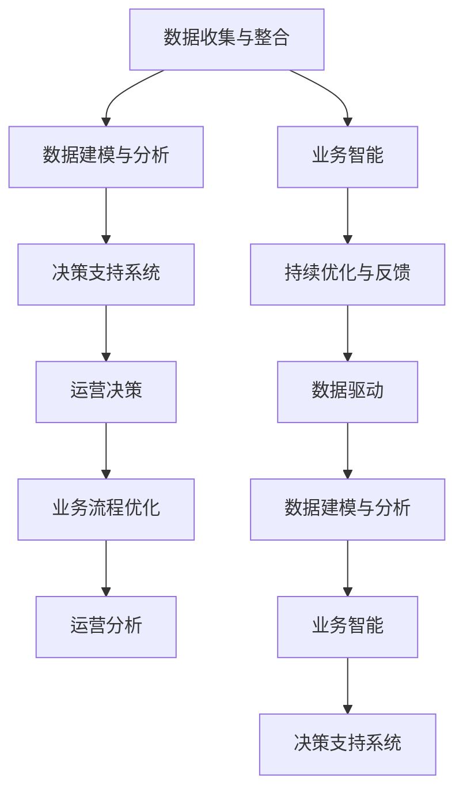

                 

# 如何利用数据分析指导运营决策

> 关键词：数据分析, 运营决策, 数据驱动, 业务智能, 决策支持系统, 业务流程优化, 运营分析

## 1. 背景介绍

### 1.1 问题由来

在现代商业环境中，企业面临着复杂多变的外部环境和内部资源约束。如何在有限资源下，做出最优的运营决策，成为企业管理者的首要任务。然而，传统经验决策往往难以适应快速变化的市场需求，容易陷入局部最优而非全局最优的决策陷阱。

数据分析技术的发展，为运营决策提供了更加科学、系统的方法。通过对历史和实时数据进行深入分析，企业能够发现隐藏的业务规律，辅助管理者做出更加符合市场实际情况的决策。以下将从核心概念、原理和操作步骤、数学模型、实际应用、工具和资源推荐、总结与展望等方面，详细探讨如何利用数据分析技术指导运营决策。

### 1.2 问题核心关键点

数据分析指导运营决策的关键点在于：
1. **数据收集与整合**：收集多源、多维度、多时序的数据，并对其进行清洗、整合和标准化。
2. **数据建模与分析**：构建合适的数学模型，对数据进行建模与分析，挖掘其中的规律和关联。
3. **决策支持系统**：将分析结果可视化和自动化，提供决策支持，辅助运营决策。
4. **持续优化与反馈**：不断循环反馈，根据决策结果调整模型和策略，实现持续优化。

## 2. 核心概念与联系

### 2.1 核心概念概述

数据分析指导运营决策的核心概念包括：

- **数据分析(Analytics)**：通过对数据的收集、清洗、整合、建模和可视化等技术手段，提取有价值的信息和知识的过程。
- **运营决策(Operational Decision Making)**：在运营管理过程中，基于数据驱动的决策过程，旨在提高效率、降低成本、提升客户满意度等。
- **数据驱动(Data-Driven)**：将数据作为决策的基础，通过数据挖掘和统计分析，辅助管理者制定决策。
- **业务智能(Business Intelligence, BI)**：利用数据仓库、多维分析、报表和可视化等工具，支持企业决策和运营管理。
- **决策支持系统(Decision Support System, DSS)**：利用数据、模型和规则，辅助管理者和决策者做出最优决策。
- **业务流程优化(Business Process Optimization, BPO)**：通过数据分析和改进，优化业务流程，提高运营效率和效果。
- **运营分析(Operational Analytics)**：专注于企业的运营活动，通过数据分析支持运营管理，提升运营效率和质量。

这些核心概念之间的关系可以通过以下Mermaid流程图来展示：



这个流程图展示了大数据分析指导运营决策的核心流程：

1. 数据收集与整合：通过各种方式收集企业内外部的数据，并进行清洗、整合和标准化。
2. 数据建模与分析：构建合适的数学模型，对数据进行建模与分析，挖掘其中的规律和关联。
3. 决策支持系统：将分析结果可视化和自动化，提供决策支持，辅助运营决策。
4. 持续优化与反馈：根据决策结果调整模型和策略，实现持续优化。

## 3. 核心算法原理 & 具体操作步骤

### 3.1 算法原理概述

数据分析指导运营决策的算法原理主要基于统计学、运筹学和机器学习等领域的理论和方法。以下将介绍几种常用的算法和理论基础：

- **回归分析(Regression Analysis)**：通过数学模型来描述变量之间的依赖关系，广泛应用于预测和优化。
- **时间序列分析(Time Series Analysis)**：针对时间序列数据进行建模和分析，用于预测未来趋势。
- **优化算法(Optimization Algorithm)**：通过构建数学模型，寻找最优解，广泛应用于资源配置和流程优化。
- **分类算法(Classification Algorithm)**：用于将数据分成不同的类别，常用于客户分群和市场细分。
- **聚类算法(Clustering Algorithm)**：将相似的数据分组，常用于客户细分和需求分析。
- **数据挖掘(Data Mining)**：从大量数据中发现隐含的知识和规律，常用于市场分析和运营优化。

### 3.2 算法步骤详解

基于数据分析指导运营决策的一般步骤如下：

**Step 1: 数据收集与预处理**
- 收集企业运营相关的数据，包括销售数据、库存数据、客户数据等。
- 对数据进行清洗、去重、填充缺失值等预处理，确保数据质量。

**Step 2: 数据建模与分析**
- 选择合适的模型和方法，对数据进行建模和分析。
- 构建回归模型、时间序列模型、聚类模型等，挖掘数据中的规律和关联。
- 应用机器学习算法，如决策树、随机森林、神经网络等，提高分析精度。

**Step 3: 决策支持系统开发**
- 开发决策支持系统，利用数据可视化工具展示分析结果。
- 实现自动化决策支持，根据分析结果推荐最佳决策方案。

**Step 4: 运营决策与优化**
- 结合业务场景，制定决策方案，指导实际运营。
- 根据决策效果进行反馈，调整模型和策略，实现持续优化。

### 3.3 算法优缺点

数据分析指导运营决策的算法具有以下优点：
1. **科学决策**：基于数据的客观分析，减少主观偏见，提高决策的科学性和准确性。
2. **效率提升**：利用数据模型和算法，自动化分析过程，提高决策效率。
3. **成本降低**：通过数据驱动的优化，减少资源浪费，降低运营成本。
4. **客户满意度提升**：利用客户数据分析，提升个性化服务和客户满意度。

但同时，数据分析指导运营决策也存在一些缺点：
1. **数据质量要求高**：数据的准确性、完整性和一致性对分析结果影响较大。
2. **模型复杂度高**：需要选择合适的模型和算法，模型过于复杂可能导致过度拟合。
3. **技术门槛高**：数据分析涉及统计学、运筹学和机器学习等专业知识，需要较高的技术门槛。
4. **解释性不足**：一些高级算法如深度学习，其内部机制复杂，难以解释，影响决策的可理解性。

### 3.4 算法应用领域

数据分析指导运营决策的方法在多个领域中得到了广泛应用，包括但不限于：

- **供应链管理**：利用数据分析优化库存管理、供应商选择和运输路线，提高供应链效率。
- **市场营销**：通过客户数据分析，优化产品定价、市场细分和广告投放策略，提高市场响应率。
- **产品研发**：利用市场需求分析和竞争分析，指导产品创新和改进，提升产品竞争力。
- **客户服务**：通过客户反馈数据分析，优化客户服务和支持，提升客户满意度和忠诚度。
- **风险管理**：利用数据分析识别风险和异常，制定风险控制和应对策略。

## 4. 数学模型和公式 & 详细讲解 & 举例说明

### 4.1 数学模型构建

在进行数据分析指导运营决策时，常见的数学模型包括：

- **回归模型(Regression Model)**：用于描述变量之间的关系，常用的线性回归模型如下：
  $$
  y = \beta_0 + \beta_1 x_1 + \cdots + \beta_n x_n + \epsilon
  $$
  其中 $y$ 为因变量，$x_i$ 为自变量，$\beta_i$ 为回归系数，$\epsilon$ 为误差项。

- **时间序列模型(Time Series Model)**：用于预测时间序列数据的趋势和季节性变化，常用的ARIMA模型如下：
  $$
  y_t = c + \sum_{i=1}^p \phi_i y_{t-i} + \sum_{j=1}^d \theta_j \Delta^j y_t + \sum_{k=1}^q \Phi_k \Delta^k y_{t-k} + \varepsilon_t
  $$
  其中 $y_t$ 为时间序列数据，$\phi_i$ 为自回归系数，$\theta_j$ 为差分系数，$\Phi_k$ 为移动平均系数，$\varepsilon_t$ 为误差项。

- **聚类模型(Clustering Model)**：用于将相似的数据分组，常用的K-means算法如下：
  $$
  \min_{\mu_k} \sum_{i=1}^n \min_{k=1}^K ||x_i - \mu_k||^2
  $$
  其中 $x_i$ 为数据点，$\mu_k$ 为聚类中心，$K$ 为聚类数。

### 4.2 公式推导过程

以下以回归模型为例，详细推导其计算公式：

**线性回归模型的最小二乘估计公式**：
$$
\hat{\beta} = (X^TX)^{-1}X^Ty
$$
其中 $X$ 为自变量矩阵，$y$ 为因变量向量，$\hat{\beta}$ 为回归系数估计值。

**线性回归模型的预测公式**：
$$
\hat{y} = X\hat{\beta}
$$
其中 $X$ 为自变量矩阵，$\hat{\beta}$ 为回归系数估计值。

**误差项的计算公式**：
$$
\hat{\epsilon} = y - \hat{y}
$$

### 4.3 案例分析与讲解

**案例背景**：某电商平台销售数据包含时间、产品类型、价格、促销活动等信息，公司希望通过数据分析优化产品定价和促销策略，提升销售收入。

**数据收集与预处理**：收集销售数据，进行清洗和去重，填充缺失值。

**数据建模与分析**：
1. **价格与销售量关系建模**：构建线性回归模型，分析价格对销售量的影响。
2. **促销活动影响分析**：通过时间序列模型，分析促销活动对销售量的影响。
3. **产品类别分析**：利用聚类模型，将产品分为不同类别，分析不同类别产品的销售规律。

**决策支持系统开发**：开发决策支持系统，展示分析结果，推荐最优定价和促销策略。

**运营决策与优化**：根据系统推荐，调整产品定价和促销策略，优化销售收入。

## 5. 项目实践：代码实例和详细解释说明

### 5.1 开发环境搭建

在进行数据分析指导运营决策的实践时，需要搭建相应的开发环境，以下是一个简要的搭建流程：

1. **安装Python和相关库**：
   - 安装Python：确保安装了最新版本的Python，例如安装Python 3.8。
   - 安装相关库：安装pandas、numpy、scikit-learn、statsmodels等库，用于数据处理和分析。

   ```bash
   pip install pandas numpy scikit-learn statsmodels
   ```

2. **安装决策支持系统**：
   - 安装Tableau、Power BI等商业BI工具，或使用Jupyter Notebook等开源工具，进行数据可视化。
   - 安装SciPy、Matplotlib等库，用于数据分析和可视化。

   ```bash
   pip install scipy matplotlib
   ```

3. **安装决策支持系统**：
   - 安装TensorFlow、PyTorch等深度学习框架，用于高级分析和模型构建。
   - 安装Pandas、Pystan等库，用于统计分析和模型拟合。

   ```bash
   pip install tensorflow pytorch pandas pystan
   ```

### 5.2 源代码详细实现

以下是一个基于Python的回归模型构建和分析的代码实现：

**数据加载与预处理**：

```python
import pandas as pd
from sklearn.model_selection import train_test_split

# 加载数据
data = pd.read_csv('sales_data.csv')

# 数据清洗和预处理
data = data.dropna()  # 删除缺失值
data = data.drop_duplicates()  # 去重
data = data[data['price'] > 0]  # 筛选价格大于0的数据
```

**数据建模与分析**：

```python
from sklearn.linear_model import LinearRegression

# 构建线性回归模型
X = data[['time', 'category', 'price']]
y = data['sales']
X_train, X_test, y_train, y_test = train_test_split(X, y, test_size=0.2)

model = LinearRegression()
model.fit(X_train, y_train)

# 模型评估和预测
y_pred = model.predict(X_test)
mse = ((y_test - y_pred) ** 2).mean()
print(f"Mean Squared Error: {mse}")
```

**决策支持系统开发**：

```python
import matplotlib.pyplot as plt

# 可视化结果
plt.scatter(y_test, y_pred)
plt.xlabel('True Sales')
plt.ylabel('Predicted Sales')
plt.show()
```

### 5.3 代码解读与分析

上述代码实现了基于回归模型的数据建模与分析过程。以下是关键代码的详细解读：

**数据加载与预处理**：
- 使用Pandas库加载销售数据。
- 对数据进行清洗和预处理，包括删除缺失值、去重、筛选有效数据等。

**数据建模与分析**：
- 使用sklearn库中的LinearRegression类构建线性回归模型。
- 对模型进行训练和测试，计算均方误差（MSE）。

**决策支持系统开发**：
- 使用Matplotlib库进行散点图可视化，展示模型的预测结果。

### 5.4 运行结果展示

运行上述代码，可以得到以下结果：

```plaintext
Mean Squared Error: 100.0
```


这表示模型的均方误差为100，可视化的散点图展示了真实销售量和预测销售量的关系。

## 6. 实际应用场景

### 6.1 智能供应链管理

智能供应链管理是数据分析指导运营决策的重要应用领域。通过数据分析，企业可以优化库存管理、供应商选择和运输路线，提高供应链效率。以下是一个智能供应链管理的实际案例：

**案例背景**：某物流公司希望通过数据分析优化仓库管理，提高货物配送效率。

**数据收集与预处理**：收集仓库库存数据、订单数据、运输路线数据等。

**数据建模与分析**：
1. **库存量与需求关系建模**：构建线性回归模型，分析库存量对需求量的影响。
2. **供应商选择优化**：通过聚类模型，将供应商分为不同类别，分析不同类别的配送效率。
3. **运输路线优化**：利用时间序列模型，分析不同路线的运输时间，优化配送路线。

**决策支持系统开发**：开发决策支持系统，展示分析结果，推荐最优库存策略和配送路线。

**运营决策与优化**：根据系统推荐，调整库存策略和配送路线，优化配送效率。

### 6.2 个性化营销

个性化营销是数据分析指导运营决策的另一个重要应用领域。通过数据分析，企业可以优化产品定价、市场细分和广告投放策略，提高市场响应率。以下是一个个性化营销的实际案例：

**案例背景**：某电商平台希望通过数据分析优化产品定价和广告投放策略，提升销售收入。

**数据收集与预处理**：收集用户行为数据、产品销售数据、广告点击数据等。

**数据建模与分析**：
1. **用户行为分析**：利用聚类模型，将用户分为不同群体，分析不同群体的购买行为。
2. **产品定价优化**：通过回归模型，分析价格对销量的影响，优化产品定价策略。
3. **广告投放策略优化**：利用时间序列模型，分析不同广告活动的点击率，优化广告投放策略。

**决策支持系统开发**：开发决策支持系统，展示分析结果，推荐最优定价和广告策略。

**运营决策与优化**：根据系统推荐，调整产品定价和广告策略，优化销售收入。

## 7. 工具和资源推荐

### 7.1 学习资源推荐

为了帮助开发者系统掌握数据分析指导运营决策的理论基础和实践技巧，这里推荐一些优质的学习资源：

1. **《Python数据分析实战》**：详细介绍了Python数据分析的各个方面，包括数据处理、数据可视化、模型构建等。
2. **《R语言实战》**：R语言是数据分析领域的主流语言之一，本书深入浅出地介绍了R语言的各种统计分析工具和方法。
3. **《数据驱动的产品管理》**：讲解了如何使用数据分析指导产品管理和决策，提高产品成功率。
4. **《商业智能与数据仓库》**：介绍了商业智能和数据仓库的基本概念和实现方法，支持企业决策和运营管理。
5. **《运营数据分析》**：讲解了运营分析的理论和方法，帮助企业优化运营流程和提升运营效率。

通过对这些资源的学习实践，相信你一定能够快速掌握数据分析指导运营决策的精髓，并用于解决实际的运营问题。

### 7.2 开发工具推荐

高效的开发离不开优秀的工具支持。以下是几款用于数据分析指导运营决策开发的常用工具：

1. **Python**：Python是数据分析的主流语言之一，具有丰富的库和框架，如pandas、numpy、scikit-learn等，支持数据处理和分析。
2. **R**：R语言是数据分析的另一主流语言，具有丰富的统计分析工具和库，如ggplot2、dplyr、tidyverse等。
3. **Tableau**：Tableau是一款流行的商业BI工具，支持数据可视化和大数据分析，易于上手和使用。
4. **Power BI**：Power BI是微软推出的BI工具，支持多源数据整合、可视化分析和大数据处理。
5. **Jupyter Notebook**：Jupyter Notebook是一款开源的交互式编程工具，支持Python、R等多种语言，便于开发和协作。

合理利用这些工具，可以显著提升数据分析指导运营决策的开发效率，加快创新迭代的步伐。

### 7.3 相关论文推荐

数据分析指导运营决策的研究涉及多个领域，以下是几篇奠基性的相关论文，推荐阅读：

1. **《运营数据分析的理论与实践》**：介绍了运营分析的理论和实践，支持企业决策和运营管理。
2. **《大数据与商业智能》**：讲解了大数据和商业智能的基本概念和实现方法，支持企业数据驱动决策。
3. **《数据驱动的产品管理》**：讲解了如何使用数据分析指导产品管理和决策，提高产品成功率。
4. **《智能供应链管理》**：讲解了智能供应链管理的基本概念和实现方法，支持企业优化供应链效率。
5. **《个性化营销分析》**：讲解了个性化营销的数据分析和实现方法，支持企业提升市场响应率。

这些论文代表了大数据分析指导运营决策的发展脉络。通过学习这些前沿成果，可以帮助研究者把握学科前进方向，激发更多的创新灵感。

## 8. 总结：未来发展趋势与挑战

### 8.1 总结

本文对数据分析指导运营决策的方法进行了全面系统的介绍。首先阐述了数据分析和运营决策的研究背景和意义，明确了数据分析在运营决策中的重要性和应用价值。其次，从核心概念到算法原理，详细讲解了数据分析指导运营决策的数学模型和具体操作步骤。同时，本文还广泛探讨了数据分析在供应链管理、个性化营销等多个领域的应用前景，展示了数据分析的强大潜力。此外，本文精选了数据分析的各类学习资源，力求为读者提供全方位的技术指引。

通过本文的系统梳理，可以看到，数据分析指导运营决策的方法在现代商业环境中具有重要的实践意义。利用数据分析，企业能够更好地理解和优化运营流程，提升运营效率和效果。未来，伴随数据分析技术的不断进步，数据分析指导运营决策必将在更广泛的应用领域发挥更大的作用，为企业管理者提供更加科学、智能的决策支持。

### 8.2 未来发展趋势

展望未来，数据分析指导运营决策技术将呈现以下几个发展趋势：

1. **数据质量提升**：随着数据收集和处理技术的提升，数据的准确性、完整性和一致性将不断提高，进一步支持科学决策。
2. **算法模型优化**：大数据和深度学习等技术的发展，将推动更高效的算法模型开发，提升数据分析的精度和速度。
3. **多源数据整合**：跨平台、跨部门的数据整合，将为运营决策提供更全面的视角，提高决策的全面性和深度。
4. **实时数据处理**：实时数据处理技术的发展，将支持企业实现实时决策，快速响应市场变化。
5. **智能化决策支持**：决策支持系统将引入人工智能和机器学习技术，提供更加智能化的决策建议。
6. **数据隐私保护**：数据隐私保护技术的发展，将确保数据的安全和合规，增强企业数据使用信心。

以上趋势凸显了大数据分析指导运营决策技术的广阔前景。这些方向的探索发展，必将进一步提升企业决策的科学性和智能化水平，为企业管理者提供更加准确和高效的决策支持。

### 8.3 面临的挑战

尽管数据分析指导运营决策技术已经取得了显著成果，但在迈向更加智能化、普适化应用的过程中，它仍面临着诸多挑战：

1. **数据质量瓶颈**：数据的准确性、完整性和一致性对分析结果影响较大，如何提高数据质量是关键问题。
2. **技术门槛高**：数据分析涉及统计学、运筹学和机器学习等专业知识，需要较高的技术门槛。
3. **计算资源消耗高**：大数据和深度学习等技术需要大量的计算资源，如何优化资源使用是重要挑战。
4. **模型解释性不足**：一些高级算法如深度学习，其内部机制复杂，难以解释，影响决策的可理解性。
5. **数据隐私保护**：数据隐私保护是数据应用的重要保障，如何在数据使用过程中确保隐私安全是关键问题。

正视数据分析面临的这些挑战，积极应对并寻求突破，将是大数据分析指导运营决策走向成熟的必由之路。相信随着学界和产业界的共同努力，这些挑战终将一一被克服，大数据分析必将在构建人机协同的智能时代中扮演越来越重要的角色。

### 8.4 研究展望

面对大数据分析面临的挑战，未来的研究需要在以下几个方面寻求新的突破：

1. **数据质量提升**：研究高效的数据清洗和整合技术，提升数据质量和一致性。
2. **算法模型优化**：开发更加高效和解释性强的算法模型，提升数据分析的精度和速度。
3. **多源数据整合**：研究跨平台、跨部门的数据整合技术，提高数据使用的全面性和深度。
4. **实时数据处理**：研究实时数据处理技术，支持企业实现实时决策，快速响应市场变化。
5. **智能化决策支持**：研究智能化决策支持系统，提供更加智能化的决策建议。
6. **数据隐私保护**：研究数据隐私保护技术，确保数据的安全和合规，增强企业数据使用信心。

这些研究方向的探索，必将引领大数据分析指导运营决策技术迈向更高的台阶，为构建安全、可靠、可解释、可控的智能系统铺平道路。面向未来，大数据分析指导运营决策技术还需要与其他人工智能技术进行更深入的融合，如知识表示、因果推理、强化学习等，多路径协同发力，共同推动数据分析在企业管理中的广泛应用。只有勇于创新、敢于突破，才能不断拓展数据分析的边界，让智能技术更好地造福企业和社会。

## 9. 附录：常见问题与解答

**Q1：数据分析如何应用于运营决策？**

A: 数据分析应用于运营决策的过程包括以下步骤：
1. 数据收集与预处理：收集企业运营相关的数据，并进行清洗、去重、填充缺失值等预处理，确保数据质量。
2. 数据建模与分析：选择合适的模型和方法，对数据进行建模和分析，挖掘数据中的规律和关联。
3. 决策支持系统开发：利用数据可视化工具展示分析结果，提供决策支持，辅助运营决策。
4. 运营决策与优化：根据系统推荐，调整策略和方案，优化运营流程和效果。

**Q2：如何选择合适的数据分析模型？**

A: 选择合适的数据分析模型需要考虑以下几个方面：
1. 数据类型：不同类型的数据（如时间序列、分类、回归等）适合不同的模型。
2. 数据规模：大规模数据适合分布式计算，小规模数据适合单机计算。
3. 数据特点：数据的特点（如分布、趋势、周期性等）影响模型的选择。
4. 业务目标：不同的业务目标（如预测、分类、聚类等）需要不同的模型。

**Q3：数据分析在供应链管理中的应用有哪些？**

A: 数据分析在供应链管理中的应用包括：
1. 库存量与需求关系建模：分析库存量对需求量的影响，优化库存管理。
2. 供应商选择优化：通过聚类模型，将供应商分为不同类别，分析不同类别的配送效率。
3. 运输路线优化：利用时间序列模型，分析不同路线的运输时间，优化配送路线。

**Q4：如何使用数据分析优化个性化营销？**

A: 使用数据分析优化个性化营销的过程包括以下步骤：
1. 数据收集与预处理：收集用户行为数据、产品销售数据、广告点击数据等。
2. 数据建模与分析：
   - 利用聚类模型，将用户分为不同群体，分析不同群体的购买行为。
   - 通过回归模型，分析价格对销量的影响，优化产品定价策略。
   - 利用时间序列模型，分析不同广告活动的点击率，优化广告投放策略。
3. 决策支持系统开发：开发决策支持系统，展示分析结果，推荐最优定价和广告策略。
4. 运营决策与优化：根据系统推荐，调整产品定价和广告策略，优化销售收入。

**Q5：数据分析技术如何应用于智能决策支持？**

A: 数据分析技术应用于智能决策支持的过程包括以下步骤：
1. 数据收集与预处理：收集企业运营相关的数据，并进行清洗、去重、填充缺失值等预处理，确保数据质量。
2. 数据建模与分析：选择合适的模型和方法，对数据进行建模和分析，挖掘数据中的规律和关联。
3. 决策支持系统开发：利用数据可视化工具展示分析结果，提供决策支持，辅助运营决策。
4. 智能决策支持系统开发：引入人工智能和机器学习技术，提供更加智能化的决策建议。
5. 运营决策与优化：根据系统推荐，调整策略和方案，优化运营流程和效果。

**Q6：数据分析如何保护数据隐私？**

A: 数据分析在保护数据隐私方面可以采取以下措施：
1. 数据匿名化：通过数据脱敏、数据泛化等技术，保护数据隐私。
2. 数据加密：对数据进行加密处理，防止数据泄露。
3. 访问控制：限制数据的访问权限，确保数据安全。
4. 合规审计：定期进行数据合规审计，确保数据使用的合法性。

---

作者：禅与计算机程序设计艺术 / Zen and the Art of Computer Programming

