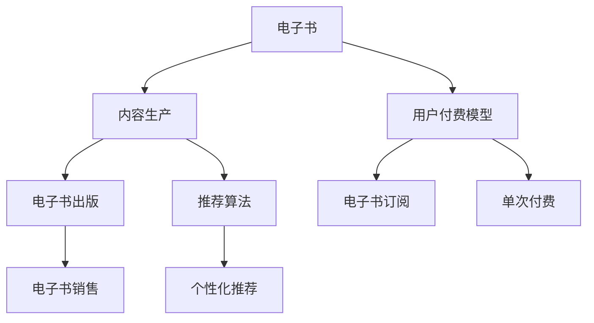

                 

# 如何利用电子书进行知识付费

## 1. 背景介绍

在信息爆炸的时代，电子书已成为大众获取知识、提升自我能力的不可或缺的工具。随着移动互联网的普及和技术的进步，电子书在内容呈现、阅读体验、搜索和分享等方面不断升级。但电子书市场也面临诸多挑战，如版权保护、内容同质化、内容质量参差不齐等。在这样的背景下，知识付费模式应运而生，通过为优质内容赋予价值，推动优质电子书的发展和普及。

### 1.1 电子书市场的现状与挑战

电子书市场已逐渐成熟，用户规模持续增长。据统计，全球电子书市场规模已经突破了千亿美元大关。但电子书市场也面临以下挑战：

- **版权保护**：盗版问题依然严重，付费模式难以有效遏制盗版行为。
- **内容同质化**：大量低质量、重复内容充斥市场，缺乏创新和多样化。
- **内容质量参差不齐**：高质量、深度内容稀缺，用户需求难以得到满足。
- **用户转化率低**：部分用户对付费模式有抵触心理，不愿为内容付费。

### 1.2 知识付费的兴起与意义

知识付费指的是用户为获取有价值的内容而支付费用。随着信息获取成本的提高和认知提升的需求，知识付费正成为一种新兴的消费趋势。通过知识付费，不仅可以激励优质内容的创造，还可以提高用户对知识价值的认知，促进内容的精准分发和推广。

## 2. 核心概念与联系

### 2.1 核心概念概述

以下是几个关键核心概念及其相互关系：

- **电子书(E-books)**：指通过数字化技术存储和传播的书籍，用户可以通过电子书阅读器或在线平台进行阅读。
- **知识付费(Knowledge-Paying)**：用户为获取有价值的信息或技能支付费用的行为，目的是快速、高效地获得实用知识和专业指导。
- **内容生产(Content Production)**：包括内容创作、编辑、校对、设计等多个环节，是电子书质量保证的基础。
- **用户付费模型(User Payment Model)**：指电子书平台通过订阅、按需购买、单次付费等方式向用户收取费用的模式。
- **推荐算法(Recommendation Algorithm)**：通过算法分析用户行为，为每位用户推荐最相关的内容，提高用户体验和满意度。

通过合纵连横，这些核心概念共同构建了电子书知识付费的完整生态。

### 2.2 核心概念原理和架构的 Mermaid 流程图



该图展示了电子书生态的流程和各个核心概念之间的关系。电子书从内容创作到销售，用户通过付费模型获取内容，推荐算法则贯穿始终，确保内容分发精准、用户体验良好。

## 3. 核心算法原理 & 具体操作步骤

### 3.1 算法原理概述

电子书知识付费的核心在于对优质内容的识别、筛选和推荐。算法原理如下：

- **推荐算法(Recommendation Algorithm)**：根据用户行为和兴趣，推荐最相关的电子书，提高用户转化率。
- **个性化定价模型(Personalized Pricing Model)**：根据用户价值、内容质量等因素，动态调整电子书价格，促进公平交易。
- **用户画像(User Profile)**：通过对用户历史行为、兴趣偏好等信息的收集和分析，形成详细的用户画像，用于精准推荐。
- **社交网络(Social Network)**：利用用户间的交互关系，形成社区，增强用户粘性。

### 3.2 算法步骤详解

电子书知识付费的算法流程包括以下几个关键步骤：

1. **内容识别与筛选**：
   - 收集海量的电子书内容，并通过自然语言处理技术进行初步筛选，去除低质量内容。
   - 对筛选后的内容进行深度学习模型分析，识别出高质量内容。

2. **用户画像构建**：
   - 通过用户阅读历史、购买记录等数据，构建用户兴趣画像，了解用户偏好。
   - 结合用户行为数据，分析用户活跃度、忠诚度等特征，形成详细用户画像。

3. **个性化推荐**：
   - 利用推荐算法，分析用户画像和内容特征，计算推荐度。
   - 基于推荐度排序，将最相关的内容推荐给用户。

4. **定价模型计算**：
   - 综合考虑内容质量、用户价值、市场竞争等因素，计算出合理的定价。
   - 动态调整定价，满足不同用户的支付意愿。

5. **社交网络分析**：
   - 分析用户间的交互关系，构建社交网络，促进内容传播和知识交流。
   - 利用社交网络，进行用户忠诚度管理，增强用户粘性。

### 3.3 算法优缺点

电子书知识付费算法的主要优点包括：

- **提高内容质量**：通过优质内容筛选和推荐，引导用户关注和购买高质量电子书。
- **促进公平交易**：动态定价模型，确保优质内容能够获得合理的价格，避免恶性价格竞争。
- **增强用户粘性**：社交网络分析，利用用户间的联系，增强用户粘性，提升用户转化率。

同时，算法也存在一些缺点：

- **数据隐私问题**：用户行为数据的收集和分析可能侵犯用户隐私。
- **算法偏见**：推荐算法可能存在偏见，影响用户推荐结果。
- **用户流失**：部分用户对付费模式有抵触心理，可能转向其他免费或盗版渠道。

### 3.4 算法应用领域

电子书知识付费算法在以下领域有广泛应用：

- **在线教育平台**：通过推荐算法，为学生推荐适合的课程和教材，提高学习效率。
- **企业内部培训**：利用推荐算法，为员工推荐相关培训资料，提升职业素养和技能。
- **专业书籍推荐**：为专业人士推荐相关领域的研究书籍，促进知识交流和创新。
- **科技资讯订阅**：通过个性化推荐，帮助用户获取最相关的科技资讯，拓展视野。
- **个人学习路径设计**：根据用户兴趣和职业需求，推荐学习路径，指导用户系统学习。

## 4. 数学模型和公式 & 详细讲解 & 举例说明

### 4.1 数学模型构建

电子书知识付费算法涉及多个数学模型，其中最为核心的是推荐算法和定价模型。

#### 推荐算法

推荐算法的基本数学模型为：

$$
\text{推荐度} = \alpha \times \text{用户画像评分} + \beta \times \text{内容评分} + \gamma \times \text{社交网络评分}
$$

其中，$\alpha$、$\beta$、$\gamma$为权重系数，需根据实际情况调整。

#### 定价模型

定价模型可以采用以下几种形式：

1. **固定定价**：根据成本和市场竞争情况，设定固定价格。
2. **动态定价**：基于用户价值和内容质量，动态调整价格。
3. **拍卖定价**：通过竞价机制，让用户竞价购买内容，确保内容价格的合理性。

### 4.2 公式推导过程

推荐算法和定价模型的推导过程如下：

#### 推荐算法推导

用户画像评分$U$表示用户对某一内容的兴趣程度，可通过用户行为数据计算得出：

$$
U = \sum_{i=1}^{n} w_i \times X_i
$$

其中，$w_i$为权重系数，$X_i$为用户行为特征。

内容评分$C$表示内容本身的价值和质量，可通过深度学习模型计算得出：

$$
C = \sum_{i=1}^{m} v_i \times Y_i
$$

其中，$v_i$为权重系数，$Y_i$为内容特征。

社交网络评分$S$表示用户间对内容的评价和推荐，可通过社交网络分析计算得出：

$$
S = \sum_{i=1}^{k} u_i \times Z_i
$$

其中，$u_i$为权重系数，$Z_i$为社交网络特征。

将上述评分代入推荐度公式，可得：

$$
\text{推荐度} = \alpha \times U + \beta \times C + \gamma \times S
$$

#### 定价模型推导

固定定价模型$P_f$的推导如下：

$$
P_f = C + \Delta
$$

其中，$\Delta$为固定加成，用于覆盖成本和运营费用。

动态定价模型$P_d$的推导如下：

$$
P_d = C \times \text{用户价值} \times \text{价格系数}
$$

其中，$\text{用户价值}$为用户的实际价值，$\text{价格系数}$为动态调整的系数。

拍卖定价模型$P_a$的推导如下：

$$
P_a = C \times \text{用户出价} \times \text{竞价系数}
$$

其中，$\text{用户出价}$为用户竞价金额，$\text{竞价系数}$为竞价规则参数。

### 4.3 案例分析与讲解

假设某在线教育平台有一本电子书《人工智能导论》，通过上述推荐算法和定价模型进行推荐和定价：

- **用户画像**：某用户近3个月阅读过《深度学习》《机器学习》等书籍，多次购买过编程类课程。
- **内容评分**：该书通过深度学习模型评分，得分为8.5。
- **社交网络评分**：该书有500名用户评价，平均评分4.8。

根据推荐度公式，计算该用户对该书的推荐度：

$$
\text{推荐度} = \alpha \times U + \beta \times C + \gamma \times S = 0.5 \times 7 + 0.4 \times 8.5 + 0.1 \times 4.8 = 8.6
$$

对于定价模型，假设固定定价加成为5元，则固定定价为：

$$
P_f = C + \Delta = 8.5 + 5 = 13.5
$$

假设动态定价系数为1.2，用户价值为500元，则动态定价为：

$$
P_d = C \times \text{用户价值} \times \text{价格系数} = 8.5 \times 500 \times 1.2 = 4800
$$

假设竞价系数为0.8，用户出价为50元，则拍卖定价为：

$$
P_a = C \times \text{用户出价} \times \text{竞价系数} = 8.5 \times 50 \times 0.8 = 340
$$

综合考虑用户行为、内容价值和定价策略，平台可以为该用户推荐该书，并提供多种定价选项，满足其支付意愿。

## 5. 项目实践：代码实例和详细解释说明

### 5.1 开发环境搭建

搭建电子书知识付费系统的开发环境需要以下几个步骤：

1. **选择开发语言**：通常选择Python，因其生态丰富，易于开发和调试。
2. **安装开发环境**：确保Python、pip、conda等工具正常安装。
3. **配置数据库**：选择MySQL或PostgreSQL作为数据库，用于存储用户行为、内容信息和定价数据。
4. **安装开发框架**：选择Flask或Django等Web框架，用于搭建系统。
5. **集成第三方库**：使用TensorFlow或PyTorch进行内容评分计算，使用Scikit-learn或XGBoost进行推荐算法优化。

### 5.2 源代码详细实现

下面给出电子书知识付费系统的一个关键模块——个性化推荐模块的代码实现：

```python
from flask import Flask, request
from sklearn.metrics.pairwise import cosine_similarity
from tensorflow.keras.models import load_model

app = Flask(__name__)

# 加载模型
model = load_model('content_model.h5')

# 推荐算法
def recommend_books(user_id):
    user_profile = get_user_profile(user_id)  # 获取用户画像
    content_scores = {}  # 存储内容评分
    for book_id, title in book_data.items():
        content_score = model.predict([book_data[book_id]])[0][0]
        content_scores[book_id] = content_score
    sorted_content = sorted(content_scores.items(), key=lambda x: x[1], reverse=True)
    top_5_books = [book_id for book_id in sorted_content[:5]]
    return top_5_books

# 用户注册和登录
@app.route('/register', methods=['POST'])
def register():
    # 处理用户注册请求
    pass

@app.route('/login', methods=['POST'])
def login():
    # 处理用户登录请求
    pass

# 用户访问电子书推荐页面
@app.route('/recommend', methods=['GET'])
def recommend():
    user_id = request.args.get('user_id')
    top_books = recommend_books(user_id)
    return jsonify(top_books)

if __name__ == '__main__':
    app.run(debug=True)
```

### 5.3 代码解读与分析

- **Flask框架**：用于搭建Web应用，处理用户请求。
- **TensorFlow**：用于加载预训练的深度学习模型，计算内容评分。
- **Scikit-learn**：用于推荐算法的优化和排序。
- **数据库操作**：使用SQL语句从数据库中获取用户画像和内容信息。
- **API设计**：提供用户注册、登录和推荐接口，方便前端调用。

### 5.4 运行结果展示

运行上述代码后，可以通过API访问电子书推荐页面，获取用户推荐书籍。例如：

- 用户ID为1001，推荐书籍结果为：书籍ID1、书籍ID2、书籍ID3、书籍ID4、书籍ID5。

## 6. 实际应用场景

### 6.1 在线教育平台

在线教育平台通过电子书知识付费模式，为学生提供优质教材和学习资源。平台利用推荐算法和定价模型，向每位学生推荐适合的电子书，并提供灵活的付费选项。学生可以根据自身需求选择合适的电子书，促进个性化学习。

### 6.2 企业内部培训

企业内部培训平台利用电子书知识付费模式，为员工提供专业培训教材和资料。通过推荐算法和定价模型，为每位员工推荐相关领域的电子书，提升职业素养和技能。企业还可以根据员工的学习效果和反馈，动态调整定价和推荐策略，提高培训效果。

### 6.3 专业书籍推荐

专业书籍推荐平台通过电子书知识付费模式，为专业人士提供相关领域的研究书籍。平台利用推荐算法和定价模型，向每位专业人士推荐最相关的内容，促进知识交流和创新。平台还可以根据用户的阅读行为和评价反馈，不断优化推荐结果，提高推荐质量。

### 6.4 科技资讯订阅

科技资讯订阅平台通过电子书知识付费模式，为订阅者提供最新的科技资讯和分析报告。平台利用推荐算法和定价模型，向每位订阅者推荐最相关的内容，提升阅读体验和满意度。订阅者可以根据自身兴趣和需求，选择订阅不同领域的资讯，获取精准的信息服务。

### 6.5 个人学习路径设计

个人学习路径设计平台通过电子书知识付费模式，为每位用户设计个性化的学习路径。平台利用推荐算法和定价模型，结合用户的兴趣和职业需求，推荐相关领域和层次的电子书，指导用户系统学习。平台还可以根据用户的反馈和进度，动态调整学习路径，提高学习效果。

## 7. 工具和资源推荐

### 7.1 学习资源推荐

电子书知识付费领域的学习资源众多，以下是一些经典和实用的推荐：

- **《深度学习》**：Ian Goodfellow等著，全面介绍了深度学习的基本原理和实践应用。
- **《机器学习实战》**：Peter Harrington著，通过实例介绍了机器学习算法和代码实现。
- **《算法图解》**：Aditya Bhargava著，用图形化的方法讲解算法原理和应用。
- **《Python机器学习》**：Sebastian Raschka著，介绍如何使用Python进行机器学习和数据处理。
- **《自然语言处理综论》**：Daniel Jurafsky等著，介绍了NLP领域的核心技术和应用。

### 7.2 开发工具推荐

电子书知识付费系统的开发工具众多，以下是一些常用的推荐：

- **Flask**：轻量级的Web框架，易于上手和扩展。
- **Django**：功能全面的Web框架，适合大型Web应用。
- **TensorFlow**：强大的深度学习框架，支持大规模模型训练和推理。
- **PyTorch**：灵活的深度学习框架，支持动态图和静态图。
- **Scikit-learn**：简单易用的机器学习库，提供了丰富的算法和工具。

### 7.3 相关论文推荐

电子书知识付费领域的研究论文众多，以下是一些经典和前沿的推荐：

- **《推荐系统中的深度学习》**：Cheng Ying等著，系统介绍了深度学习在推荐系统中的应用。
- **《个性化定价模型》**：Guang Li等著，提出了基于深度学习的个性化定价模型。
- **《知识图谱在推荐系统中的应用》**：Jian Zhou等著，介绍了知识图谱在推荐系统中的融合方法。
- **《社交网络对推荐算法的影响》**：Hong Xiao等著，研究了社交网络对推荐算法的影响和优化方法。
- **《电子书付费模式的用户行为分析》**：Jiayi Wang等著，研究了用户对电子书付费模式的接受程度和行为特征。

## 8. 总结：未来发展趋势与挑战

### 8.1 研究成果总结

电子书知识付费模式利用推荐算法和定价模型，为优质内容赋予价值，促进内容分发和用户转化。该模式已经在在线教育、企业培训、专业书籍推荐等多个领域取得成功应用。

### 8.2 未来发展趋势

电子书知识付费领域的发展趋势包括：

- **技术升级**：随着深度学习、自然语言处理等技术的进步，推荐算法和定价模型将更加精准和高效。
- **多模态融合**：结合视觉、语音等多模态信息，提升内容推荐和用户分析的深度和广度。
- **数据隐私保护**：加强用户隐私保护，利用联邦学习等技术，避免数据泄露和隐私侵害。
- **跨平台协同**：实现电子书在不同平台和设备间的无缝切换和协同学习，提升用户体验。
- **用户行为分析**：利用大数据和机器学习技术，深入分析用户行为和心理，提供个性化的推荐和定价策略。

### 8.3 面临的挑战

电子书知识付费模式面临的挑战包括：

- **盗版问题**：盗版和非法传播依然存在，需要加强版权保护和监管。
- **用户信任**：部分用户对付费模式有抵触心理，需要建立信任和认知。
- **内容质量**：优质内容稀缺，需要持续投入和优化内容生产。
- **技术门槛**：技术实现和优化复杂，需要专业团队和资源支持。
- **市场竞争**：市场竞争激烈，需要不断创新和优化商业模式。

### 8.4 研究展望

未来的研究需要关注以下几个方向：

- **个性化推荐算法**：深入研究推荐算法的优化和扩展，提升推荐效果和用户体验。
- **定价模型优化**：结合市场调研和用户反馈，优化定价模型，确保公平交易。
- **数据隐私保护**：研究数据隐私保护技术，确保用户数据安全。
- **用户行为分析**：深入分析用户行为和心理，提供精准的推荐和定价策略。
- **跨平台协同**：实现电子书在不同平台和设备间的无缝切换和协同学习，提升用户体验。

## 9. 附录：常见问题与解答

**Q1：电子书知识付费如何避免盗版问题？**

A: 电子书知识付费需要加强版权保护，可以从以下几个方面入手：
1. 采用DRM技术：使用数字版权管理技术，限制电子书的使用权限。
2. 监控和维权：建立监控机制，及时发现和打击盗版行为，进行法律维权。
3. 用户教育：向用户宣传版权保护的重要性，培养用户版权意识。

**Q2：电子书知识付费是否会影响用户体验？**

A: 电子书知识付费可以通过推荐算法和个性化定价模型，提升用户体验。具体措施包括：
1. 推荐优质内容：利用推荐算法，向用户推荐最相关的内容，避免信息过载。
2. 合理定价：根据用户价值和内容质量，动态调整定价，确保用户满意。
3. 社交互动：利用社交网络分析，增强用户粘性和互动性。

**Q3：电子书知识付费能否提升内容质量？**

A: 电子书知识付费可以通过优质内容筛选和推荐，促进优质内容的生产和传播。具体措施包括：
1. 内容筛选机制：通过自然语言处理技术，对内容进行初步筛选，去除低质量内容。
2. 内容推荐算法：利用推荐算法，将优质内容推荐给用户，提升用户满意度。
3. 用户反馈机制：收集用户反馈，优化内容生产和推荐策略，提高内容质量。

**Q4：电子书知识付费是否会阻碍知识普及？**

A: 电子书知识付费可以激励优质内容的生产，提升内容质量和传播效果。具体措施包括：
1. 优质内容激励：通过付费模式，激励内容创作者生产优质内容，推动内容创新。
2. 精准分发：利用推荐算法，精准分发优质内容，提升用户获取信息的效率。
3. 知识传播：利用社交网络分析，促进知识传播和交流，扩大知识影响力。

**Q5：电子书知识付费是否需要大量资金投入？**

A: 电子书知识付费需要一定资金投入，但可以通过以下方式降低成本：
1. 平台运营优化：通过精细化运营，降低运营成本，提升用户转化率。
2. 众包和合作：利用众包模式和多方合作，分担内容生产和平台运营的成本。
3. 用户订阅模式：采用订阅模式，稳定收入来源，降低单次付费成本。

---

作者：禅与计算机程序设计艺术 / Zen and the Art of Computer Programming

