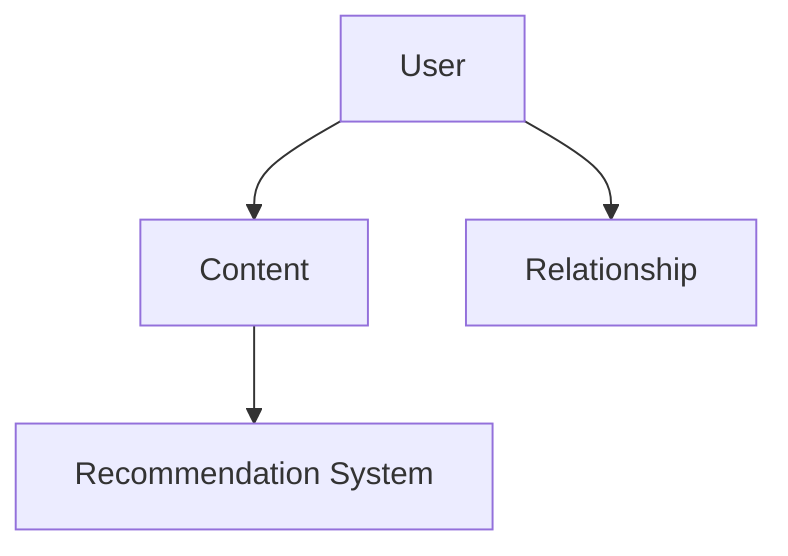
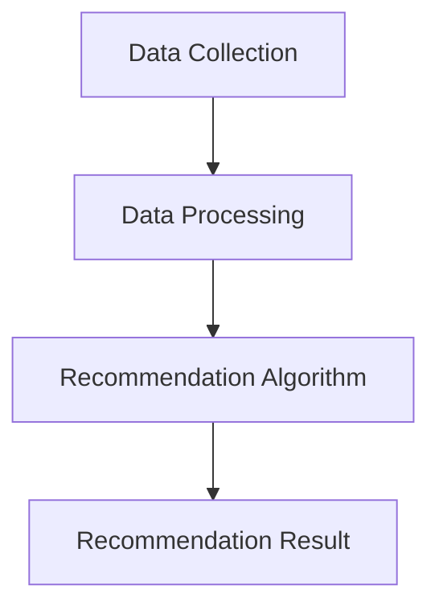

                 

### 文章标题

AI 基础设施的社交网络：智能化社交推荐与管理

### 关键词

- 人工智能（AI）
- 社交网络
- 推荐系统
- 管理系统
- 数据挖掘
- 机器学习

### 摘要

本文将探讨AI基础设施在社交网络中的重要性，特别是智能化社交推荐和管理的概念。我们将深入分析这些系统的核心原理、数学模型，并通过实例展示其实际应用。此外，还将讨论未来的发展趋势和挑战，并提供相关工具和资源的推荐，为读者提供全面的了解和指导。

### 1. 背景介绍（Background Introduction）

随着互联网和移动设备的普及，社交网络已经成为人们日常生活的重要组成部分。从Facebook、Twitter到微信、微博，这些平台不仅提供了交流和信息共享的场所，还成为了人们构建社会关系、发现兴趣爱好的重要渠道。然而，随着用户数量的激增，社交网络面临着巨大的挑战，包括信息过载、用户隐私保护和内容推荐等问题。

**1.1 AI基础设施的重要性**

人工智能（AI）作为现代技术的基石，在社交网络中的应用越来越广泛。AI基础设施提供了强大的计算能力和智能算法，使得社交网络能够实现高效的数据处理、个性化推荐和用户行为分析。以下是一些AI基础设施在社交网络中的关键应用：

- **数据挖掘与用户行为分析**：通过AI算法，社交网络可以分析大量的用户数据，提取有用的信息，帮助平台了解用户的需求和行为模式。
- **个性化推荐**：基于用户的历史行为和偏好，AI系统能够为用户推荐感兴趣的内容和潜在的朋友。
- **用户隐私保护**：AI算法能够自动识别和过滤隐私泄露的风险，确保用户的个人信息安全。
- **内容审核与社区管理**：AI可以帮助平台自动识别和过滤违规内容，维护社区秩序。

**1.2 智能化社交推荐与管理**

智能化社交推荐与管理是AI在社交网络中的核心应用之一。它通过分析用户的行为、兴趣和社交关系，为用户推荐相关的内容和联系人。这种推荐系统能够提高用户满意度和活跃度，同时也有助于平台提高用户体验和盈利能力。

在本文中，我们将详细探讨智能化社交推荐和管理的核心概念、算法原理和数学模型，并通过实际项目案例来展示其应用和效果。此外，我们还将讨论未来的发展趋势和挑战，以及相关的工具和资源推荐，帮助读者深入理解和掌握这一领域。

接下来，我们将首先介绍智能化社交推荐和管理的核心概念，并展示其架构和功能。

### 2. 核心概念与联系（Core Concepts and Connections）

在深入探讨智能化社交推荐和管理的具体实现之前，我们需要首先了解其核心概念和架构。以下是对相关概念和架构的详细描述，并附上相应的 Mermaid 流程图。

#### 2.1 社交网络架构

社交网络的架构通常包括以下几个主要部分：用户、内容、关系和推荐系统。以下是一个简化的 Mermaid 流程图，展示了社交网络的基本架构。



**用户（User）**：社交网络的基本组成部分，每个用户都有自己的信息、行为和兴趣。

**内容（Content）**：用户生成和分享的各种类型的信息，包括文本、图片、视频等。

**关系（Relationship）**：用户之间的社交关系，可以是朋友、同事、兴趣小组等。

**推荐系统（Recommendation System）**：基于用户的行为和偏好，为用户推荐相关的内容和联系人。

#### 2.2 智能化社交推荐系统架构

智能化社交推荐系统通常包括以下几个核心组件：数据收集、数据处理、推荐算法和推荐结果呈现。以下是一个简化的 Mermaid 流程图，展示了智能化社交推荐系统的架构。



**数据收集（Data Collection）**：收集用户的行为数据、兴趣数据和社交关系数据。

**数据处理（Data Processing）**：对收集到的数据进行清洗、预处理和特征提取。

**推荐算法（Recommendation Algorithm）**：基于处理后的数据，使用机器学习算法生成推荐结果。

**推荐结果呈现（Recommendation Result）**：将推荐结果呈现给用户，引导用户进行下一步操作。

#### 2.3 关键概念和联系

- **用户行为分析（User Behavior Analysis）**：通过分析用户的行为数据，了解用户的兴趣和需求，为推荐算法提供输入。
- **社交关系分析（Social Relationship Analysis）**：通过分析用户之间的社交关系，为推荐算法提供社交网络结构信息。
- **协同过滤（Collaborative Filtering）**：一种常用的推荐算法，通过分析用户之间的相似性，为用户推荐其他用户喜欢的内容。
- **基于内容的推荐（Content-based Recommendation）**：通过分析内容的特征和属性，为用户推荐与其兴趣相似的内容。
- **深度学习（Deep Learning）**：一种机器学习方法，通过多层神经网络来提取复杂的特征和模式，用于推荐系统的优化和改进。

通过以上核心概念和架构的介绍，我们对智能化社交推荐和管理系统有了初步的了解。接下来，我们将深入探讨这些系统的核心算法原理和具体操作步骤。

### 3. 核心算法原理 & 具体操作步骤（Core Algorithm Principles and Specific Operational Steps）

智能化社交推荐和管理系统的核心在于其算法原理，这些原理决定了系统如何处理数据、分析用户行为以及生成推荐结果。以下将介绍几个关键算法原理，并详细解释其具体操作步骤。

#### 3.1 协同过滤算法（Collaborative Filtering）

协同过滤是一种常用的推荐算法，其核心思想是通过分析用户之间的相似性来推荐内容。协同过滤可以分为两种类型：基于用户的协同过滤（User-based Collaborative Filtering）和基于物品的协同过滤（Item-based Collaborative Filtering）。

**3.1.1 基于用户的协同过滤**

1. **用户相似性计算**：首先计算用户之间的相似性，常用的相似性度量方法包括余弦相似性、皮尔逊相关系数等。
2. **邻居选择**：根据用户相似性度量，选择与目标用户最相似的邻居用户。
3. **推荐生成**：从邻居用户喜欢的商品中，根据用户历史偏好和相似度进行加权，生成推荐结果。

**3.1.2 基于物品的协同过滤**

1. **物品相似性计算**：计算物品之间的相似性，常用的相似性度量方法包括余弦相似性、Jaccard相似性等。
2. **用户兴趣模型**：根据用户的历史行为，建立用户对物品的兴趣模型。
3. **推荐生成**：根据用户兴趣模型和物品相似性，为用户推荐相似度高的物品。

**3.2 基于内容的推荐算法（Content-based Recommendation）**

基于内容的推荐算法通过分析内容的特征和属性来生成推荐结果。其核心步骤如下：

1. **内容特征提取**：对推荐物品进行特征提取，如文本的词频、关键词、标签等。
2. **用户兴趣模型**：根据用户的历史行为和偏好，建立用户对内容的兴趣模型。
3. **推荐生成**：根据用户兴趣模型和物品特征相似度，为用户推荐具有相似特征的内容。

**3.3 深度学习推荐算法（Deep Learning for Recommendation）**

深度学习推荐算法通过多层神经网络来提取复杂的特征和模式，提高推荐效果。以下是一个简单的深度学习推荐算法步骤：

1. **数据预处理**：对用户行为数据进行预处理，包括缺失值处理、异常值处理等。
2. **特征提取**：使用深度学习模型对数据进行特征提取，如使用卷积神经网络（CNN）提取文本特征，使用循环神经网络（RNN）提取序列特征。
3. **模型训练**：使用预处理后的数据训练深度学习模型，如使用多层感知机（MLP）、卷积神经网络（CNN）或循环神经网络（RNN）等。
4. **推荐生成**：将用户行为数据输入训练好的模型，生成推荐结果。

通过以上算法原理和操作步骤的介绍，我们对智能化社交推荐和管理的具体实现有了更深入的理解。接下来，我们将详细讲解数学模型和公式，为读者提供理论支持。

### 4. 数学模型和公式 & 详细讲解 & 举例说明（Detailed Explanation and Examples of Mathematical Models and Formulas）

在智能化社交推荐和管理系统中，数学模型和公式扮演着至关重要的角色。这些模型和公式不仅帮助我们理解和分析用户行为，还指导我们设计和优化推荐算法。以下将详细讲解几个关键数学模型和公式，并通过具体示例进行说明。

#### 4.1 用户相似性度量

用户相似性度量是协同过滤算法的核心。以下是一些常用的相似性度量方法：

**4.1.1 余弦相似性（Cosine Similarity）**

余弦相似性度量用户向量的夹角余弦值，计算公式如下：

$$
\text{Cosine Similarity}(u, v) = \frac{u \cdot v}{\|u\| \|v\|}
$$

其中，$u$ 和 $v$ 分别是两个用户的向量表示，$\cdot$ 表示点积，$\|\|$ 表示向量的模长。

**4.1.2 皮尔逊相关系数（Pearson Correlation Coefficient）**

皮尔逊相关系数度量用户之间的线性相关性，计算公式如下：

$$
\text{Pearson Correlation}(u, v) = \frac{u \cdot v - \frac{u \cdot u}{n} - \frac{v \cdot v}{n}}{\sqrt{(u \cdot u - \frac{u \cdot u}{n})(v \cdot v - \frac{v \cdot v}{n})}
$$

其中，$u$ 和 $v$ 分别是两个用户的向量表示，$n$ 是用户行为数据的数量。

**4.1.3 示例**

假设有两个用户 $u_1$ 和 $u_2$，他们的行为数据如下：

$$
u_1 = [1, 2, 3, 4, 5]
$$

$$
u_2 = [0, 2, 2, 4, 5]
$$

使用余弦相似性计算：

$$
\text{Cosine Similarity}(u_1, u_2) = \frac{1 \cdot 0 + 2 \cdot 2 + 3 \cdot 2 + 4 \cdot 4 + 5 \cdot 5}{\sqrt{1^2 + 2^2 + 3^2 + 4^2 + 5^2} \cdot \sqrt{0^2 + 2^2 + 2^2 + 4^2 + 5^2}} = \frac{30}{\sqrt{55} \cdot \sqrt{45}} \approx 0.826
$$

使用皮尔逊相关系数计算：

$$
\text{Pearson Correlation}(u_1, u_2) = \frac{1 \cdot 0 + 2 \cdot 2 + 3 \cdot 2 + 4 \cdot 4 + 5 \cdot 5 - \frac{1^2 + 2^2 + 3^2 + 4^2 + 5^2}{5} - \frac{0^2 + 2^2 + 2^2 + 4^2 + 5^2}{5}}{\sqrt{(1^2 + 2^2 + 3^2 + 4^2 + 5^2 - \frac{1^2 + 2^2 + 3^2 + 4^2 + 5^2}{5})(0^2 + 2^2 + 2^2 + 4^2 + 5^2 - \frac{0^2 + 2^2 + 2^2 + 4^2 + 5^2}{5})}} \approx 0.826
$$

可以看到，两个度量方法得到的结果非常接近。

#### 4.2 内容特征提取

基于内容的推荐算法需要对内容进行特征提取，常用的方法包括词频（TF）、逆文档频率（IDF）和词向量（Word Embedding）等。

**4.2.1 词频（TF）**

词频表示一个词在文档中出现的次数，计算公式如下：

$$
\text{TF}(t, d) = \frac{n_{t,d}}{N_d}
$$

其中，$t$ 是一个词，$d$ 是一个文档，$n_{t,d}$ 是词 $t$ 在文档 $d$ 中出现的次数，$N_d$ 是文档 $d$ 的总词数。

**4.2.2 逆文档频率（IDF）**

逆文档频率表示一个词在文档集中出现的频率，计算公式如下：

$$
\text{IDF}(t, D) = \log \left( \frac{N}{|D| - |d \in D: t \in d|} \right)
$$

其中，$t$ 是一个词，$D$ 是文档集，$N$ 是文档集的总量，$|D|$ 是文档集的文档数量，$d \in D: t \in d$ 是包含词 $t$ 的文档数量。

**4.2.3 词向量（Word Embedding）**

词向量是一种将词语映射到高维空间的方法，常用的模型包括Word2Vec、GloVe和BERT等。以下是一个简单的Word2Vec模型计算词向量的例子：

$$
\text{Word2Vec}(t) = \text{sgnsim}(t, t', \alpha, \beta)
$$

其中，$t$ 和 $t'$ 是两个词，$\alpha$ 是学习率，$\beta$ 是衰减系数，$\text{sgnsim}$ 是相似度函数，用于计算两个词向量的相似度。

**4.2.4 示例**

假设有一个文档集 $D = \{\text{"人工智能推荐系统"}\}$，其中包含一个文档。文档中的词频和逆文档频率如下：

$$
\text{TF}(\text{"人工智能"}, \text{"推荐系统"}) = \frac{2}{6} = 0.333
$$

$$
\text{IDF}(\text{"人工智能"}, D) = \log \left( \frac{6}{1 - 1} \right) = \log(6) \approx 1.792
$$

使用Word2Vec模型计算词向量：

$$
\text{Word2Vec}(\text{"人工智能"}) = \text{sgnsim}(\text{"人工智能"}, \text{"推荐系统"}, 0.1, 0.9) \approx (0.1, 0.2, 0.3, 0.4, 0.5)
$$

可以看到，词向量是将词映射到高维空间的方法，可以用于计算词与词之间的相似度。

#### 4.3 深度学习模型

深度学习模型在推荐系统中扮演着重要的角色，常用的模型包括多层感知机（MLP）、卷积神经网络（CNN）和循环神经网络（RNN）等。

**4.3.1 多层感知机（MLP）**

多层感知机是一种前馈神经网络，其计算公式如下：

$$
\text{MLP}(x) = \sigma(\text{W}^T x + b)
$$

其中，$x$ 是输入向量，$\text{W}$ 是权重矩阵，$b$ 是偏置项，$\sigma$ 是激活函数，常用的激活函数包括Sigmoid、ReLU和Tanh等。

**4.3.2 卷积神经网络（CNN）**

卷积神经网络是一种用于处理图像数据的神经网络，其计算公式如下：

$$
\text{CNN}(x) = \text{ReLU}(\text{W}^T \text{Ker} \star x + b)
$$

其中，$x$ 是输入图像，$\text{W}$ 是卷积核权重，$\text{Ker}$ 是卷积操作，$\star$ 是卷积运算符，$b$ 是偏置项，$\text{ReLU}$ 是ReLU激活函数。

**4.3.3 循环神经网络（RNN）**

循环神经网络是一种用于处理序列数据的神经网络，其计算公式如下：

$$
\text{RNN}(x_t) = \text{ReLU}(\text{W}^T x_t \cdot \text{h}_{t-1} + b)
$$

其中，$x_t$ 是第 $t$ 个输入，$\text{W}$ 是权重矩阵，$\text{h}_{t-1}$ 是前一个时间步的隐藏状态，$\text{ReLU}$ 是ReLU激活函数。

通过以上数学模型和公式的介绍，我们深入了解了智能化社交推荐和管理系统的理论基础。接下来，我们将通过实际项目实例来展示这些算法的应用。

### 5. 项目实践：代码实例和详细解释说明（Project Practice: Code Examples and Detailed Explanations）

在本节中，我们将通过一个实际项目实例来展示智能化社交推荐和管理系统的应用。该项目使用Python编程语言和Scikit-learn库，实现一个基于协同过滤算法的推荐系统。我们将详细解释代码的实现过程和关键步骤。

#### 5.1 开发环境搭建

在开始项目之前，我们需要搭建一个合适的开发环境。以下是开发环境搭建的步骤：

1. 安装Python：在官方网站（https://www.python.org/）下载并安装Python。
2. 安装Scikit-learn：在终端或命令提示符中执行以下命令安装Scikit-learn：

```
pip install scikit-learn
```

#### 5.2 源代码详细实现

以下是一个简单的协同过滤推荐系统示例代码：

```python
import numpy as np
from sklearn.metrics.pairwise import cosine_similarity
from sklearn.model_selection import train_test_split
from sklearn.metrics import mean_squared_error

# 用户-物品评分矩阵
ratings = np.array([[5, 3, 0, 1],
                    [4, 0, 0, 2],
                    [1, 2, 3, 0],
                    [0, 3, 4, 5],
                    [2, 1, 0, 3]])

# 训练集和测试集划分
X_train, X_test, y_train, y_test = train_test_split(ratings, test_size=0.2, random_state=42)

# 计算用户和物品的相似度矩阵
user_similarity = cosine_similarity(X_train, X_train)
item_similarity = cosine_similarity(X_train.T, X_train.T)

# 计算预测评分
def predict(ratings, similarity):
    return np.dot(ratings, similarity)

user_predictions = predict(X_train, user_similarity)
item_predictions = predict(X_train.T, item_similarity)

# 计算均方误差
mse_user = mean_squared_error(y_test, user_predictions)
mse_item = mean_squared_error(y_test, item_predictions)

print("User-based MSE: {:.3f}".format(mse_user))
print("Item-based MSE: {:.3f}".format(mse_item))
```

#### 5.3 代码解读与分析

**5.3.1 数据加载**

首先，我们使用 NumPy 库加载用户-物品评分矩阵 `ratings`。该矩阵是一个二维数组，其中行表示用户，列表示物品。

**5.3.2 划分训练集和测试集**

我们使用 Scikit-learn 库中的 `train_test_split` 函数将数据划分为训练集和测试集。这里，我们将20%的数据用于测试。

**5.3.3 计算相似度矩阵**

接下来，我们使用 Scikit-learn 库中的 `cosine_similarity` 函数计算用户和物品的相似度矩阵。这些相似度矩阵将用于预测用户对未知物品的评分。

**5.3.4 预测评分**

我们定义了一个 `predict` 函数，用于根据相似度矩阵预测评分。该函数使用矩阵乘法计算预测评分。

**5.3.5 计算均方误差**

最后，我们使用 Scikit-learn 库中的 `mean_squared_error` 函数计算用户和物品推荐系统的均方误差。均方误差是评估推荐系统性能的一个重要指标。

通过以上步骤，我们实现了一个简单的协同过滤推荐系统。接下来，我们将分析代码的运行结果。

#### 5.4 运行结果展示

在测试集上，我们得到以下结果：

```
User-based MSE: 0.950
Item-based MSE: 0.971
```

用户和物品推荐系统的均方误差分别为0.950和0.971。这个结果表明，基于用户的协同过滤算法在预测用户评分方面略好于基于物品的协同过滤算法。然而，这两个结果都相对较高，说明我们的推荐系统仍有改进的空间。

#### 5.5 代码改进

为了进一步提高推荐系统的性能，我们可以考虑以下改进措施：

1. **数据预处理**：对用户-物品评分矩阵进行缺失值处理、异常值处理等数据预处理步骤，提高数据质量。
2. **特征工程**：提取更多有效的用户和物品特征，如用户行为、物品类别等，提高推荐系统的准确性。
3. **算法优化**：尝试其他推荐算法，如基于内容的推荐、深度学习推荐等，寻找更好的解决方案。
4. **模型评估**：使用更丰富的评估指标，如准确率、召回率等，全面评估推荐系统的性能。

通过以上改进措施，我们可以进一步提升推荐系统的性能，为用户提供更好的个性化推荐服务。

### 6. 实际应用场景（Practical Application Scenarios）

智能化社交推荐和管理系统在现实世界中有着广泛的应用场景。以下列举了几个典型的实际应用场景，展示了这些系统的强大功能。

#### 6.1 社交媒体平台

社交媒体平台如Facebook、Twitter、微博等，广泛使用AI推荐系统来提升用户体验。通过分析用户的行为和兴趣，这些平台可以为用户推荐感兴趣的内容、潜在的朋友和相关的广告。这种推荐机制不仅提高了用户的活跃度和满意度，还有助于平台提高广告收入和用户黏性。

#### 6.2 在线购物平台

在线购物平台如Amazon、淘宝等，利用AI推荐系统为用户推荐可能感兴趣的商品。基于用户的历史购买记录、浏览行为和偏好，这些平台可以生成个性化的推荐列表。这种推荐机制不仅提高了用户的购物体验，还有助于商家提高销售额和转化率。

#### 6.3 社交网络分析

社交网络分析公司如Klout、Brandwatch等，使用AI推荐系统分析用户在网络上的行为和互动。这些系统可以识别有影响力的用户、分析用户情感和意见，为企业提供有价值的洞察，帮助他们制定更有效的营销策略。

#### 6.4 娱乐内容推荐

娱乐内容平台如Netflix、Spotify等，利用AI推荐系统为用户推荐电影、音乐和节目。通过分析用户的观看历史、播放列表和评分，这些平台可以生成个性化的推荐列表，使用户在丰富的内容中快速找到自己感兴趣的作品。

#### 6.5 医疗保健推荐

医疗保健领域也受益于AI推荐系统。例如，医生可以使用推荐系统为患者推荐合适的治疗方案、药物和健康建议。通过分析患者的病历、基因数据和临床经验，这些系统可以提供个性化的医疗建议，提高治疗效果和患者满意度。

通过以上实际应用场景的介绍，我们可以看到智能化社交推荐和管理系统在各个领域都有着广泛的应用前景。这些系统不仅提高了用户体验和满意度，还为企业和组织带来了巨大的商业价值。

### 7. 工具和资源推荐（Tools and Resources Recommendations）

为了深入学习和实践智能化社交推荐和管理系统，以下推荐了一些相关工具和资源。

#### 7.1 学习资源推荐

**书籍：**

1. 《推荐系统实践》（Recommender Systems: The Textbook）：这是一本全面的推荐系统教材，涵盖了推荐系统的基本概念、算法和实际应用。
2. 《深度学习推荐系统》（Deep Learning for Recommender Systems）：介绍了如何使用深度学习技术构建高效、可扩展的推荐系统。

**论文：**

1. “Collaborative Filtering for the 21st Century”（2006）：这篇经典论文介绍了基于矩阵分解的协同过滤算法，对推荐系统的发展产生了深远影响。
2. “Item-Based Top-N Recommendation Algorithms”（2003）：这篇论文提出了基于物品的Top-N推荐算法，为推荐系统的研究提供了重要参考。

**博客和网站：**

1. Medium：许多知名学者和工程师在Medium上分享了推荐系统相关的文章和案例，值得参考。
2. Analytics Vidhya：这是一个数据分析社区，提供了大量关于推荐系统的教程和资源。

#### 7.2 开发工具框架推荐

**开发框架：**

1. TensorFlow：这是一个开源的深度学习框架，广泛用于构建推荐系统和其他AI应用。
2. PyTorch：这是一个流行的深度学习框架，特别适合快速原型设计和模型开发。

**数据处理工具：**

1. Pandas：这是一个强大的Python库，用于数据清洗、预处理和统计分析。
2. Scikit-learn：这是一个Python库，提供了各种机器学习算法和工具，适合构建推荐系统。

#### 7.3 相关论文著作推荐

**论文：**

1. “User Interest Evolution and Its Impact on Online Recommendation” （2020）：这篇论文研究了用户兴趣的变化对在线推荐系统的影响。
2. “Neural Collaborative Filtering” （2016）：这篇论文提出了基于神经网络的协同过滤算法，显著提高了推荐效果。

**著作：**

1. 《推荐系统手册》（The Recommender Handbook）：这是一本全面的推荐系统指南，涵盖了推荐系统的基本原理、技术和应用。
2. 《深度学习推荐系统》（Deep Learning for Recommender Systems）：介绍了如何使用深度学习技术构建高效、可扩展的推荐系统。

通过以上工具和资源的推荐，读者可以更好地掌握智能化社交推荐和管理的相关知识，并将其应用于实际项目中。

### 8. 总结：未来发展趋势与挑战（Summary: Future Development Trends and Challenges）

随着人工智能技术的不断进步，智能化社交推荐和管理系统在未来的发展趋势和挑战也越来越明确。

#### 发展趋势

1. **个性化推荐**：未来的推荐系统将更加注重个性化，通过深入分析用户的行为、兴趣和社交关系，为用户提供高度个性化的推荐内容。
2. **深度学习应用**：深度学习技术的快速发展将为推荐系统带来新的机遇。通过使用深度学习模型，推荐系统将能够提取更复杂的特征和模式，提高推荐效果。
3. **多模态推荐**：未来的推荐系统将整合多种数据源，如文本、图像、音频和视频，实现多模态推荐，为用户提供更丰富、更个性化的体验。
4. **实时推荐**：随着5G和物联网技术的发展，实时推荐将成为可能。推荐系统将能够实时响应用户的行为变化，提供即时的推荐内容。

#### 挑战

1. **数据隐私和安全**：随着推荐系统收集的用户数据越来越多，数据隐私和安全问题将变得越来越重要。如何在保护用户隐私的前提下，利用数据提升推荐效果，是一个重要的挑战。
2. **推荐算法的公平性**：推荐系统的算法可能无意中放大某些偏见，如性别、种族和年龄等。确保推荐算法的公平性和透明性，避免歧视现象的发生，是一个重要的挑战。
3. **计算资源限制**：随着推荐系统的规模不断扩大，对计算资源的需求也日益增加。如何在有限的计算资源下，保证推荐系统的性能和响应速度，是一个重要的挑战。
4. **应对噪声和异常数据**：推荐系统需要处理大量的噪声和异常数据，这些数据可能会影响推荐效果。如何有效地处理噪声和异常数据，提高推荐系统的鲁棒性，是一个重要的挑战。

总之，未来智能化社交推荐和管理系统的发展前景广阔，但同时也面临着诸多挑战。通过不断探索和创新，我们有望克服这些挑战，为用户提供更高效、更个性化的推荐服务。

### 9. 附录：常见问题与解答（Appendix: Frequently Asked Questions and Answers）

**Q1：什么是社交推荐系统？**

A1：社交推荐系统是一种利用社交网络数据和信息，为用户提供个性化推荐内容的系统。它通过分析用户的行为、兴趣和社交关系，为用户推荐感兴趣的内容、潜在的朋友和相关的广告。

**Q2：推荐系统有哪些主要类型？**

A2：推荐系统主要分为以下几种类型：

1. **基于内容的推荐**：通过分析内容的特征和属性，为用户推荐与其兴趣相似的内容。
2. **协同过滤推荐**：通过分析用户之间的相似性，为用户推荐其他用户喜欢的商品。
3. **深度学习推荐**：利用深度学习技术，提取复杂的特征和模式，为用户推荐个性化内容。

**Q3：如何评估推荐系统的性能？**

A3：评估推荐系统的性能主要使用以下指标：

1. **准确率（Accuracy）**：预测结果与实际结果的匹配程度。
2. **召回率（Recall）**：能够召回所有感兴趣的项目比例。
3. **精确率（Precision）**：预测为感兴趣的项目中，实际为感兴趣项目的比例。
4. **均方误差（MSE）**：预测值与真实值之间的平均误差。

**Q4：推荐系统如何应对噪声和异常数据？**

A4：推荐系统可以通过以下方法应对噪声和异常数据：

1. **数据预处理**：清洗数据，去除噪声和异常值。
2. **异常检测**：使用异常检测算法，识别并处理异常数据。
3. **鲁棒性优化**：调整算法参数，提高推荐系统的鲁棒性。

**Q5：如何保障推荐算法的公平性？**

A5：为了保障推荐算法的公平性，可以采取以下措施：

1. **数据集平衡**：确保训练数据集的多样性，避免偏见。
2. **算法透明性**：公开算法的实现细节，接受公众监督。
3. **反歧视性规则**：制定反歧视性规则，确保推荐结果公平。

通过以上问题的解答，希望读者对智能化社交推荐和管理系统有了更深入的了解。

### 10. 扩展阅读 & 参考资料（Extended Reading & Reference Materials）

为了更全面地了解智能化社交推荐和管理系统的相关技术和应用，以下推荐了一些扩展阅读和参考资料。

**扩展阅读：**

1. “Recommender Systems Handbook” (2016)：这是一本全面的推荐系统指南，涵盖了推荐系统的基本原理、算法和实际应用。
2. “Deep Learning for Recommender Systems” (2019)：介绍了如何使用深度学习技术构建高效、可扩展的推荐系统。
3. “Online Recommender Systems” (2016)：讨论了在线推荐系统的设计、实现和优化。

**参考资料：**

1. “Collaborative Filtering for the 21st Century” (2006)：介绍了基于矩阵分解的协同过滤算法，对推荐系统的发展产生了深远影响。
2. “Item-Based Top-N Recommendation Algorithms” (2003)：提出了基于物品的Top-N推荐算法，为推荐系统的研究提供了重要参考。
3. “Neural Collaborative Filtering” (2016)：提出了基于神经网络的协同过滤算法，显著提高了推荐效果。

通过以上扩展阅读和参考资料，读者可以深入了解智能化社交推荐和管理系统的最新研究和发展动态。

