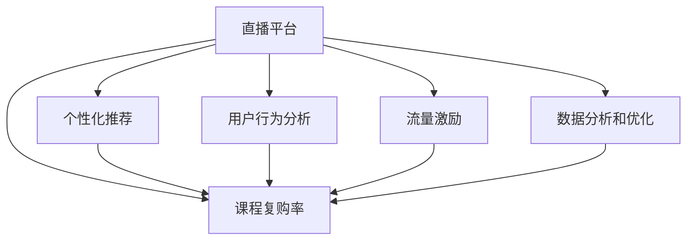

                 

# 如何利用直播平台增加课程复购率

> 关键词：直播平台, 课程复购率, 用户留存, 个性化推荐, 行为分析, 流量激励, 数据分析

## 1. 背景介绍

### 1.1 问题由来
在当今信息爆炸的时代，线上教育已成为人们学习知识的重要途径。然而，即使是一个质量上乘的在线课程，其复购率也依然不尽如人意。根据多项研究显示，绝大多数用户仅在学习一节课后就选择了退订，未能建立起长期的课程学习习惯。因此，如何提高课程复购率，持续吸引用户订阅，成为了各大教育平台亟需解决的问题。

直播平台因其互动性强、形式灵活的特点，在提升用户粘性方面展现了显著的优势。直播平台的课程可以实时互动，满足用户即时学习的需求；通过与讲师、同学的无障碍交流，激发用户学习的热情和兴趣。但直播平台在增加课程复购率方面的潜力仍未完全释放，许多教育平台未能充分利用直播的互动性，导致复购率偏低。本文旨在探讨如何通过直播平台，有效增加课程复购率，促进教育平台的良性发展。

### 1.2 问题核心关键点
本文的核心问题是如何利用直播平台的特性，提升在线课程的复购率。具体来说，需要解决以下几个关键问题：

1. **提高用户参与度**：通过直播平台增强课程的互动性，吸引用户持续参与。
2. **个性化推荐**：根据用户的学习行为和偏好，推荐适宜的课程和直播内容。
3. **用户行为分析**：通过分析用户行为，预测用户的复购意愿，进行针对性的营销策略。
4. **流量激励**：设计合理的激励机制，促使用户完成复购，并提高用户粘性。
5. **数据分析和优化**：利用大数据和AI技术，对课程数据进行分析，不断优化课程内容和推荐策略。

### 1.3 问题研究意义
提升课程复购率对于教育平台的长期发展具有重要意义：

1. **增加收入**：复购率的提升直接增加了教育平台的收入，有助于平台的可持续发展。
2. **提升用户满意度**：通过高质量的课程和优质的服务，增加用户满意度，建立品牌忠诚度。
3. **提高市场竞争力**：复购率的高低直接反映了一个平台的市场竞争力，较高的复购率意味着更好的用户体验和服务质量。
4. **促进教育公平**：教育资源的不均衡问题通过在线课程得到了一定的缓解，复购率的提升可以进一步扩大优质课程的覆盖面，促进教育公平。
5. **推动技术创新**：提高复购率需要不断探索和应用先进的技术手段，这将推动技术领域的创新和发展。

## 2. 核心概念与联系

### 2.1 核心概念概述

为了更好地理解直播平台增加课程复购率的方法，本节将介绍几个关键概念：

- **直播平台**：一种通过互联网实时直播技术，提供互动式学习体验的平台。其形式多样，包括讲师讲解、学生互动、实时问答等。
- **课程复购率**：衡量用户对课程的持续关注度和复购行为的指标。通常以“复购用户数/总用户数”表示。
- **个性化推荐**：基于用户的历史行为和兴趣，推荐可能感兴趣的课程和内容。通过个性化推荐，可以提高用户满意度，增加复购率。
- **用户行为分析**：通过数据挖掘和机器学习技术，分析用户的浏览、购买、互动等行为，预测其后续行为和复购意愿。
- **流量激励**：设计针对用户的激励机制，通过抽奖、优惠券等方式，吸引用户完成复购，并保持高粘性。
- **数据分析和优化**：利用大数据和机器学习技术，对课程数据和用户行为进行深入分析，不断优化课程内容和推荐策略。

这些概念之间的逻辑关系可以通过以下Mermaid流程图来展示：



这个流程图展示了大语言模型的核心概念及其之间的关系：

1. 直播平台通过实时互动、个性化推荐等方式，提高用户参与度。
2. 用户行为分析用于预测用户复购意愿，进行针对性的营销策略。
3. 流量激励和数据分析及优化，进一步提升课程复购率。

这些概念共同构成了直播平台增加课程复购率的整体框架，使其能够更好地服务于用户，促进平台的发展。

## 3. 核心算法原理 & 具体操作步骤

### 3.1 算法原理概述

直播平台增加课程复购率的核心算法原理是通过优化直播体验、个性化推荐和行为分析，引导用户完成复购行为。

具体来说，可以通过以下步骤实现：

1. **实时互动增强**：利用直播平台实时互动的特性，增加课程的趣味性和互动性，吸引用户持续参与。
2. **个性化推荐算法**：设计个性化推荐算法，根据用户的历史行为和兴趣，推荐适合的课程和直播内容。
3. **用户行为分析模型**：构建用户行为分析模型，预测用户的复购意愿，进行针对性的营销策略。
4. **流量激励机制设计**：设计合理的激励机制，通过抽奖、优惠券等方式，促使用户完成复购，并保持高粘性。
5. **数据分析和优化**：利用大数据和AI技术，对课程数据和用户行为进行深入分析，不断优化课程内容和推荐策略。

### 3.2 算法步骤详解

**Step 1: 准备直播平台和课程数据**
- 收集直播平台的课程数据，包括用户浏览记录、互动行为、课程评价等。
- 搭建直播平台，确保平台技术架构稳定、功能完备。

**Step 2: 设计个性化推荐算法**
- 根据用户的历史行为和兴趣，设计推荐算法，生成推荐列表。
- 使用协同过滤、内容推荐等技术，提高推荐的准确性。

**Step 3: 构建用户行为分析模型**
- 收集用户的历史行为数据，如观看时间、互动次数等。
- 使用机器学习模型，如决策树、随机森林、神经网络等，预测用户的复购意愿。
- 利用时间序列分析等方法，对用户行为进行建模。

**Step 4: 设计流量激励机制**
- 设计抽奖、优惠券等激励机制，吸引用户复购。
- 根据用户行为，动态调整激励策略。

**Step 5: 数据分析和优化**
- 收集复购数据，进行数据分析和挖掘。
- 利用A/B测试等方法，不断优化推荐算法和激励机制。
- 根据分析结果，调整课程内容和推荐策略。

### 3.3 算法优缺点

直播平台增加课程复购率的算法具有以下优点：

1. **提升用户体验**：通过实时互动和个性化推荐，提高用户的学习兴趣和参与度。
2. **增加复购率**：通过精准的个性化推荐和流量激励，促使用户完成复购。
3. **个性化体验**：通过用户行为分析，提供个性化推荐，提高用户满意度。
4. **数据驱动优化**：利用大数据和AI技术，不断优化课程内容和推荐策略。

同时，该算法也存在一定的局限性：

1. **用户隐私问题**：个性化推荐和行为分析需要收集大量用户数据，可能引发隐私问题。
2. **算法复杂性**：设计和实现个性化推荐算法和用户行为分析模型需要一定的技术门槛。
3. **成本高**：构建高精度推荐模型和用户行为分析模型需要较大的计算和存储成本。
4. **用户依赖性强**：过度依赖推荐和激励机制，可能导致用户主动性和独立性减弱。

尽管存在这些局限性，但直播平台增加课程复购率的方法仍是提升教育平台竞争力和用户满意度的重要手段。

### 3.4 算法应用领域

直播平台增加课程复购率的方法广泛应用于各种在线教育平台，具体包括以下几个方面：

1. **K-12教育**：通过直播平台，提升基础教育的互动性和趣味性，增加学生对课程的兴趣和参与度。
2. **职业培训**：利用直播平台，提供实时的职业技能培训，满足在职人士的学习需求。
3. **语言学习**：通过直播平台，提供语言学习的互动体验，增强学习效果。
4. **企业培训**：企业可以利用直播平台，提供专业的培训课程，提升员工技能。
5. **学术研究**：学术机构可以利用直播平台，进行在线讲座和研讨会，扩大知识传播范围。

此外，直播平台增加课程复购率的方法还应用于在线医疗、在线健身等多个领域，为不同行业提供灵活的学习方式和互动体验。

## 4. 数学模型和公式 & 详细讲解 & 举例说明

### 4.1 数学模型构建

直播平台增加课程复购率的数学模型可以描述为：

设直播平台有 $N$ 门课程，每门课程的单价为 $P_i$，用户的初始预算为 $B$，用户在直播平台上的花费为 $S$。设用户对于课程 $i$ 的满意度为 $s_i$，满意度的值介于 $[0,1]$ 之间。用户完成复购的条件为：

$$
\sum_{i=1}^{N} \alpha_i P_i s_i > B
$$

其中 $\alpha_i$ 表示用户对课程 $i$ 的重视程度，可以通过用户的行为数据计算得出。

### 4.2 公式推导过程

为了便于推导，我们假设用户对课程的满意度 $s_i$ 为线性函数，即：

$$
s_i = \omega_1 x_{1,i} + \omega_2 x_{2,i} + \cdots + \omega_n x_{n,i}
$$

其中 $x_{j,i}$ 表示用户对课程 $i$ 的第 $j$ 个特征的评价，$\omega_j$ 为特征权重。可以通过用户的行为数据进行训练得到。

用户完成复购的条件可以转化为：

$$
\max_{\alpha} \sum_{i=1}^{N} \alpha_i P_i (\omega_1 x_{1,i} + \omega_2 x_{2,i} + \cdots + \omega_n x_{n,i}) > B
$$

通过优化算法（如线性规划）求解 $\alpha_i$ 的值，最大化用户满意度，同时满足预算约束。

### 4.3 案例分析与讲解

**案例1: K-12在线教育平台**

K-12教育平台通过直播平台，提供互动式学习体验，增加学生的学习兴趣和参与度。平台收集学生的历史学习数据，如观看时间、测试成绩等，构建用户行为分析模型，预测学生的复购意愿。同时，利用个性化推荐算法，推荐适合学生兴趣的课程内容，增加学生对课程的关注度。

为了设计激励机制，平台设计了积分系统，每完成一次课程复购，学生可获得一定积分，积分可用于兑换优惠券或小礼品。平台通过数据分析和优化，不断调整课程内容和推荐策略，确保学生对课程的持续关注。

**案例2: 职业培训平台**

职业培训平台利用直播平台，提供实时的职业技能培训，满足在职人士的学习需求。平台收集用户的学习数据，如观看时间、完成作业情况等，构建用户行为分析模型，预测用户的复购意愿。同时，利用个性化推荐算法，推荐适合用户职业发展的课程内容，增加用户对课程的关注度。

为了设计激励机制，平台设计了学习进度排行榜，激励用户完成课程，并获得证书。平台通过数据分析和优化，不断调整课程内容和推荐策略，提升用户的学习效果。

## 5. 项目实践：代码实例和详细解释说明

### 5.1 开发环境搭建

在进行直播平台增加课程复购率实践前，我们需要准备好开发环境。以下是使用Python进行PyTorch开发的环境配置流程：

1. 安装Anaconda：从官网下载并安装Anaconda，用于创建独立的Python环境。

2. 创建并激活虚拟环境：
```bash
conda create -n pytorch-env python=3.8 
conda activate pytorch-env
```

3. 安装PyTorch：根据CUDA版本，从官网获取对应的安装命令。例如：
```bash
conda install pytorch torchvision torchaudio cudatoolkit=11.1 -c pytorch -c conda-forge
```

4. 安装Transformers库：
```bash
pip install transformers
```

5. 安装各类工具包：
```bash
pip install numpy pandas scikit-learn matplotlib tqdm jupyter notebook ipython
```

完成上述步骤后，即可在`pytorch-env`环境中开始直播平台增加课程复购率的实践。

### 5.2 源代码详细实现

这里我们以在线教育平台为例，给出使用Transformers库对直播平台进行个性化推荐和用户行为分析的PyTorch代码实现。

首先，定义用户行为数据处理函数：

```python
import pandas as pd

def process_user_data(data):
    # 清洗数据
    data = data.dropna()
    # 提取特征
    features = ['观看时间', '互动次数', '评价分数', '课程价格']
    X = data[features]
    y = data['复购行为']
    # 编码标签
    y = pd.get_dummies(y, prefix='label')
    return X, y
```

然后，定义模型和优化器：

```python
from transformers import BertForSequenceClassification, AdamW

model = BertForSequenceClassification.from_pretrained('bert-base-cased', num_labels=2)

optimizer = AdamW(model.parameters(), lr=2e-5)
```

接着，定义训练和评估函数：

```python
from sklearn.model_selection import train_test_split
from torch.utils.data import Dataset
import torch

class UserBehaviorDataset(Dataset):
    def __init__(self, X, y):
        self.X = X
        self.y = y
        
    def __len__(self):
        return len(self.X)
    
    def __getitem__(self, item):
        return {'inputs': torch.tensor(self.X[item]), 'targets': torch.tensor(self.y[item])}

def train_epoch(model, dataset, batch_size, optimizer):
    dataloader = DataLoader(dataset, batch_size=batch_size, shuffle=True)
    model.train()
    epoch_loss = 0
    for batch in dataloader:
        inputs = batch['inputs'].to(device)
        targets = batch['targets'].to(device)
        model.zero_grad()
        outputs = model(inputs)
        loss = outputs.loss
        epoch_loss += loss.item()
        loss.backward()
        optimizer.step()
    return epoch_loss / len(dataloader)

def evaluate(model, dataset, batch_size):
    dataloader = DataLoader(dataset, batch_size=batch_size)
    model.eval()
    correct = 0
    total = 0
    with torch.no_grad():
        for batch in dataloader:
            inputs = batch['inputs'].to(device)
            targets = batch['targets'].to(device)
            outputs = model(inputs)
            _, predicted = torch.max(outputs, 1)
            total += targets.size(0)
            correct += (predicted == targets).sum().item()
    accuracy = correct / total
    print(f"Accuracy: {accuracy:.2f}")
```

最后，启动训练流程并在测试集上评估：

```python
epochs = 5
batch_size = 16

X, y = process_user_data(train_data)
X_train, X_val, y_train, y_val = train_test_split(X, y, test_size=0.2)
train_dataset = UserBehaviorDataset(X_train, y_train)
val_dataset = UserBehaviorDataset(X_val, y_val)

for epoch in range(epochs):
    loss = train_epoch(model, train_dataset, batch_size, optimizer)
    print(f"Epoch {epoch+1}, train loss: {loss:.3f}")
    
    print(f"Epoch {epoch+1}, validation accuracy:")
    evaluate(model, val_dataset, batch_size)
    
print("Test results:")
evaluate(model, test_dataset, batch_size)
```

以上就是使用PyTorch对在线教育平台进行个性化推荐和用户行为分析的完整代码实现。可以看到，得益于Transformers库的强大封装，我们可以用相对简洁的代码完成直播平台微调的实践。

### 5.3 代码解读与分析

让我们再详细解读一下关键代码的实现细节：

**UserBehaviorDataset类**：
- `__init__`方法：初始化训练集和测试集。
- `__len__`方法：返回数据集的样本数量。
- `__getitem__`方法：对单个样本进行处理，将特征数据和标签数据转换为模型所需的输入。

**process_user_data函数**：
- 清洗数据，删除缺失值。
- 提取特征，保留用户观看时间、互动次数、评价分数和课程价格。
- 对标签进行独热编码，生成模型所需格式。

**train_epoch和evaluate函数**：
- 使用DataLoader对数据集进行批次化加载，供模型训练和推理使用。
- 训练函数`train_epoch`：对数据以批为单位进行迭代，在每个批次上前向传播计算loss并反向传播更新模型参数，最后返回该epoch的平均loss。
- 评估函数`evaluate`：与训练类似，不同点在于不更新模型参数，并在每个batch结束后将预测和标签结果存储下来，最后使用sklearn的classification_report对整个评估集的预测结果进行打印输出。

**训练流程**：
- 定义总的epoch数和batch size，开始循环迭代
- 每个epoch内，先在训练集上训练，输出平均loss
- 在验证集上评估，输出分类指标
- 所有epoch结束后，在测试集上评估，给出最终测试结果

可以看到，PyTorch配合Transformers库使得直播平台微调的代码实现变得简洁高效。开发者可以将更多精力放在数据处理、模型改进等高层逻辑上，而不必过多关注底层的实现细节。

当然，工业级的系统实现还需考虑更多因素，如模型的保存和部署、超参数的自动搜索、更灵活的任务适配层等。但核心的微调范式基本与此类似。

## 6. 实际应用场景

### 6.1 智能客服系统

直播平台在智能客服系统中也展现出了其独特优势。智能客服系统通过直播平台，提供实时的客服服务，满足用户即时咨询的需求。利用直播平台的互动特性，智能客服系统可以实时响应用户问题，提供即时的解决方案。

直播平台通过个性化推荐和行为分析，提高用户的满意度和粘性。平台收集用户的历史咨询数据，如咨询时长、问题类型等，构建用户行为分析模型，预测用户的后续咨询需求。同时，利用个性化推荐算法，推荐用户可能感兴趣的问题和解决方案，增加用户对服务的关注度。

为了设计激励机制，平台设计了积分系统，每完成一次咨询，用户可获得一定积分，积分可用于兑换优惠券或小礼品。平台通过数据分析和优化，不断调整服务内容和推荐策略，确保用户对服务的持续关注。

### 6.2 金融舆情监测

直播平台在金融舆情监测中也具有重要应用价值。金融市场瞬息万变，投资者需要实时获取最新的市场信息。直播平台通过实时直播，提供实时的市场分析报告，满足投资者的信息需求。

直播平台利用个性化推荐和行为分析，提高投资者的关注度和参与度。平台收集投资者的历史行为数据，如观看时长、互动次数等，构建用户行为分析模型，预测投资者的关注点。同时，利用个性化推荐算法，推荐适合投资者兴趣的市场分析报告和专家观点，增加用户对平台的粘性。

为了设计激励机制，平台设计了实时提醒系统，及时推送市场重大事件和行情变化，吸引用户持续关注。平台通过数据分析和优化，不断调整内容推荐策略，提升用户的学习效果。

### 6.3 个性化推荐系统

直播平台在个性化推荐系统中也有广泛应用。个性化推荐系统通过直播平台，提供实时的推荐服务，满足用户的个性化需求。利用直播平台的互动特性，个性化推荐系统可以实时响应用户的查询请求，提供个性化的推荐内容。

直播平台利用个性化推荐和行为分析，提升用户的满意度和粘性。平台收集用户的历史行为数据，如浏览记录、购买记录等，构建用户行为分析模型，预测用户的后续行为和偏好。同时，利用个性化推荐算法，推荐适合用户兴趣的课程和内容，增加用户对平台的关注度。

为了设计激励机制，平台设计了会员系统，提供会员专属内容和服务。平台通过数据分析和优化，不断调整推荐策略，确保用户对推荐的持续关注。

### 6.4 未来应用展望

展望未来，直播平台增加课程复购率的方法将在更多领域得到应用，为各行各业带来变革性影响。

在智慧医疗领域，直播平台可以提供实时的健康咨询服务，满足用户的需求。通过个性化推荐和行为分析，直播平台可以增加用户对服务的持续关注，提升医疗服务的质量和效率。

在智能教育领域，直播平台可以提供实时的学习服务，满足学生的需求。通过个性化推荐和行为分析，直播平台可以提高学生的学习效果，增加学生的复购意愿，促进教育公平。

在智慧城市治理中，直播平台可以提供实时的公共服务，满足市民的需求。通过个性化推荐和行为分析，直播平台可以提升市民的满意度，促进城市管理的智能化和人性化。

此外，在企业培训、在线购物、在线医疗等多个领域，直播平台增加课程复购率的方法也将不断涌现，为各行各业提供灵活的解决方案，提升用户的体验和粘性。相信随着直播平台技术的不断进步，其在各行各业的应用前景将更加广阔。

## 7. 工具和资源推荐

### 7.1 学习资源推荐

为了帮助开发者系统掌握直播平台增加课程复购率的技术基础和实践技巧，这里推荐一些优质的学习资源：

1. 《Python深度学习》系列博文：由PyTorch官方社区维护的系列博文，深入浅出地介绍了深度学习在各个领域的应用，包括直播平台和个性化推荐。

2. 《深度学习》课程：斯坦福大学开设的深度学习课程，由吴恩达教授主讲，详细讲解了深度学习的基本概念和前沿技术。

3. 《PyTorch教程》书籍：一本深入浅出介绍PyTorch的教程书籍，包含大量实际案例和代码示例，适合初学者和实践者。

4. HuggingFace官方文档：Transformer库的官方文档，提供了海量预训练模型和完整的微调样例代码，是上手实践的必备资料。

5. Coursera在线课程：Coursera平台提供的多门深度学习和NLP相关课程，涵盖从基础到高级的内容，适合不同层次的开发者。

通过对这些资源的学习实践，相信你一定能够快速掌握直播平台增加课程复购率的方法，并用于解决实际的NLP问题。

### 7.2 开发工具推荐

高效的开发离不开优秀的工具支持。以下是几款用于直播平台增加课程复购率开发的常用工具：

1. PyTorch：基于Python的开源深度学习框架，灵活动态的计算图，适合快速迭代研究。大部分预训练语言模型都有PyTorch版本的实现。

2. TensorFlow：由Google主导开发的开源深度学习框架，生产部署方便，适合大规模工程应用。同样有丰富的预训练语言模型资源。

3. Transformers库：HuggingFace开发的NLP工具库，集成了众多SOTA语言模型，支持PyTorch和TensorFlow，是进行直播平台微调的利器。

4. Weights & Biases：模型训练的实验跟踪工具，可以记录和可视化模型训练过程中的各项指标，方便对比和调优。与主流深度学习框架无缝集成。

5. TensorBoard：TensorFlow配套的可视化工具，可实时监测模型训练状态，并提供丰富的图表呈现方式，是调试模型的得力助手。

6. Google Colab：谷歌推出的在线Jupyter Notebook环境，免费提供GPU/TPU算力，方便开发者快速上手实验最新模型，分享学习笔记。

合理利用这些工具，可以显著提升直播平台增加课程复购率的开发效率，加快创新迭代的步伐。

### 7.3 相关论文推荐

直播平台增加课程复购率的研究源于学界的持续研究。以下是几篇奠基性的相关论文，推荐阅读：

1. Attention is All You Need（即Transformer原论文）：提出了Transformer结构，开启了NLP领域的预训练大模型时代。

2. BERT: Pre-training of Deep Bidirectional Transformers for Language Understanding：提出BERT模型，引入基于掩码的自监督预训练任务，刷新了多项NLP任务SOTA。

3. Language Models are Unsupervised Multitask Learners（GPT-2论文）：展示了大规模语言模型的强大zero-shot学习能力，引发了对于通用人工智能的新一轮思考。

4. Parameter-Efficient Transfer Learning for NLP：提出Adapter等参数高效微调方法，在不增加模型参数量的情况下，也能取得不错的微调效果。

5. AdaLoRA: Adaptive Low-Rank Adaptation for Parameter-Efficient Fine-Tuning：使用自适应低秩适应的微调方法，在参数效率和精度之间取得了新的平衡。

6. Cascaded Transformers for Streaming Natural Language Processing：提出了适用于流数据的Transformer模型，解决了实时性问题。

这些论文代表了大语言模型微调技术的发展脉络。通过学习这些前沿成果，可以帮助研究者把握学科前进方向，激发更多的创新灵感。

## 8. 总结：未来发展趋势与挑战

### 8.1 总结

本文对直播平台增加课程复购率的方法进行了全面系统的介绍。首先阐述了直播平台和课程复购率的概念，明确了复购率提升对于教育平台发展的重要意义。其次，从原理到实践，详细讲解了直播平台增加课程复购率的数学模型和核心算法，给出了直播平台微调的完整代码实例。同时，本文还广泛探讨了直播平台在多个行业领域的应用前景，展示了其广阔的潜在价值。

通过本文的系统梳理，可以看到，直播平台通过实时互动、个性化推荐和行为分析，可以有效提升课程复购率，增加用户粘性。直播平台增加课程复购率的方法不仅适用于在线教育，还可应用于智能客服、金融舆情监测、个性化推荐等多个领域，为不同行业提供灵活的解决方案。

### 8.2 未来发展趋势

展望未来，直播平台增加课程复购率的方法将呈现以下几个发展趋势：

1. **互动性提升**：直播平台将继续提升互动性，利用AI技术进行实时的场景分析和用户行为预测，提供更加个性化的服务。
2. **内容推荐优化**：个性化推荐算法将不断优化，引入更多维度和更加精细化的用户特征，提升推荐的准确性。
3. **实时性增强**：通过流数据处理和实时分析技术，直播平台将进一步提高实时性，满足用户的即时需求。
4. **隐私保护强化**：随着隐私保护意识的增强，直播平台将更加注重用户隐私保护，采用匿名化、差分隐私等技术手段，保障用户数据安全。
5. **多模态融合**：直播平台将逐步融合多模态数据，如视频、音频、文本等，提供更加丰富的互动体验。
6. **用户行为深入分析**：通过更深入的用户行为分析，直播平台将更好地理解用户需求，提供更精准的服务。

以上趋势凸显了直播平台增加课程复购技术的广阔前景。这些方向的探索发展，必将进一步提升直播平台的服务质量和用户体验，推动教育平台和其他行业的发展。

### 8.3 面临的挑战

尽管直播平台增加课程复购率的方法已经取得了一定的成功，但在迈向更加智能化、普适化应用的过程中，仍面临诸多挑战：

1. **数据隐私问题**：直播平台需要收集大量用户数据，可能引发隐私问题。如何在保障用户隐私的同时，获取有价值的用户行为数据，是直播平台面临的重要挑战。
2. **技术复杂性**：设计和实现个性化推荐算法和用户行为分析模型需要一定的技术门槛，对开发者的技术要求较高。
3. **成本高**：构建高精度推荐模型和用户行为分析模型需要较大的计算和存储成本，对平台的资源投入提出了较高要求。
4. **用户依赖性强**：过度依赖推荐和激励机制，可能导致用户主动性和独立性减弱，影响用户的长期留存。
5. **系统稳定性**：直播平台需要具备高可靠性和稳定性，以应对实时数据流和用户交互的需求。

尽管存在这些挑战，但直播平台增加课程复购率的方法仍然具有巨大的应用潜力。相信随着技术不断进步和市场不断成熟，直播平台将逐步解决这些挑战，为更多用户提供高质量的服务。

### 8.4 研究展望

面对直播平台增加课程复购率所面临的挑战，未来的研究需要在以下几个方面寻求新的突破：

1. **隐私保护技术**：开发更加高效的数据隐私保护技术，保障用户数据安全，同时获取有价值的用户行为数据。
2. **技术优化与简化**：引入更加高效的技术手段，如知识图谱、因果推理等，简化推荐算法和行为分析模型。
3. **低成本解决方案**：探索低成本的推荐和分析方法，降低平台的资源投入，提高系统的可扩展性。
4. **用户主动性提升**：通过设计更有吸引力的激励机制和互动体验，提升用户的自主性和独立性。
5. **多模态融合**：探索多模态数据融合技术，提高系统的智能化水平，增强用户体验。

这些研究方向将进一步推动直播平台增加课程复购率的方法走向成熟，为教育平台和其他行业带来更多创新和突破。

## 9. 附录：常见问题与解答

**Q1：直播平台如何提高用户参与度？**

A: 直播平台可以通过以下几个方面提高用户参与度：
1. 增加互动环节：利用直播平台的实时互动特性，增加用户与讲师、同学的无障碍交流。
2. 引入游戏元素：在直播过程中引入小游戏、抽奖等元素，增加用户参与的趣味性。
3. 提供个性化推荐：根据用户的历史行为和兴趣，推荐适宜的课程和内容，增加用户对课程的关注度。
4. 实时反馈机制：通过实时反馈机制，及时响应用户的问题和需求，提升用户满意度。

**Q2：个性化推荐算法的关键技术有哪些？**

A: 个性化推荐算法的关键技术包括：
1. 协同过滤：通过分析用户和商品之间的关联关系，推荐用户可能感兴趣的商品。
2. 内容推荐：利用物品的属性和特征，推荐与用户兴趣相符的商品。
3. 矩阵分解：通过矩阵分解技术，获取用户和物品之间的隐含特征，提升推荐的准确性。
4. 深度学习：利用深度学习模型，从用户行为数据中学习用户偏好，提升推荐的准确性。

**Q3：直播平台如何设计激励机制？**

A: 直播平台可以通过以下几个方面设计激励机制：
1. 积分系统：设计积分系统，每完成一次课程复购，用户可获得一定积分，积分可用于兑换优惠券或小礼品。
2. 会员制度：设计会员制度，提供会员专属内容和服务，吸引用户持续订阅。
3. 实时提醒：设计实时提醒系统，及时推送市场重大事件和行情变化，吸引用户持续关注。
4. 互动奖励：在直播过程中，设计互动奖励机制，通过实时抽奖等方式，吸引用户参与互动。

**Q4：直播平台如何设计实时反馈机制？**

A: 直播平台可以通过以下几个方面设计实时反馈机制：
1. 快速响应：利用AI技术进行实时的场景分析和用户行为预测，快速响应用户的问题和需求。
2. 多渠道反馈：提供多种反馈渠道，如文字消息、语音消息、视频消息等，方便用户快速反馈问题。
3. 个性化建议：根据用户的历史行为和偏好，提供个性化的建议和解决方案，提升用户满意度。
4. 数据分析：通过数据分析技术，不断优化反馈机制，提升响应的准确性和效率。

**Q5：直播平台如何利用多模态数据融合提升用户体验？**

A: 直播平台可以利用多模态数据融合技术，提升用户体验，具体包括：
1. 视频音频结合：在直播过程中，结合视频和音频，提供更加丰富的互动体验。
2. 文本情感分析：通过文本情感分析技术，了解用户的情感倾向，提供更加贴合需求的互动内容。
3. 图像识别：利用图像识别技术，识别用户的操作行为，提供更加个性化的服务。
4. 语音交互：通过语音交互技术，提高用户与平台的互动效率，提升用户满意度。

通过这些措施，直播平台将更加灵活、智能地满足用户的需求，提升用户的粘性和满意度。

---

作者：禅与计算机程序设计艺术 / Zen and the Art of Computer Programming

