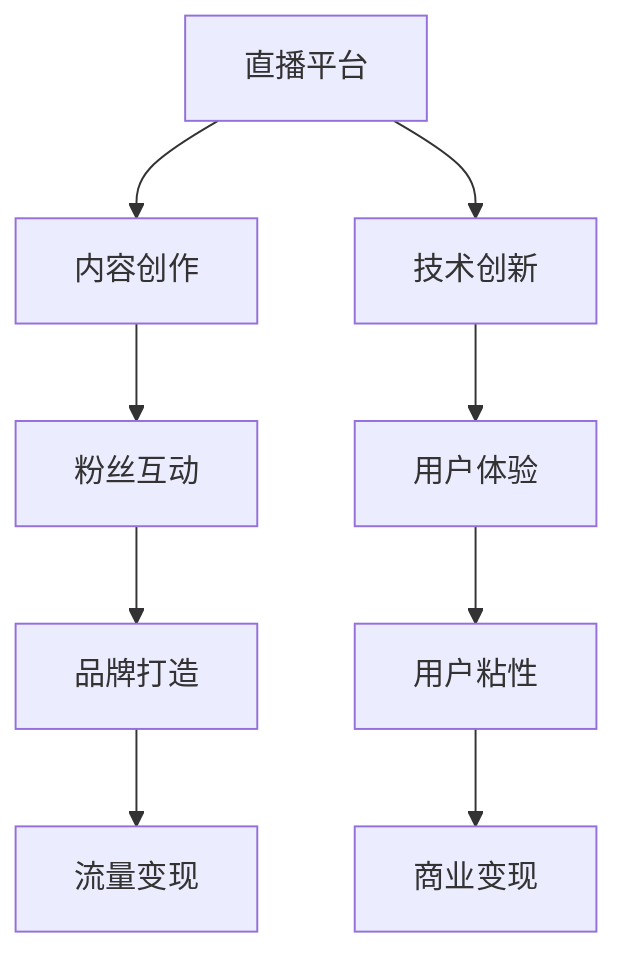

                 

# 如何利用直播平台建立个人IP

> 关键词：直播平台, 个人IP, 内容创作, 粉丝互动, 品牌打造, 流量变现, 技术创新

## 1. 背景介绍

在数字化时代，内容创造者们通过多样化的媒介进行自我表达和价值输出。直播平台，作为新兴的社交媒体形式，正迅速成为个人IP塑造和品牌打造的重要平台。本文旨在探讨如何通过直播平台，高效地建立并运营个人IP，进而实现内容变现和商业价值的转化。

### 1.1 直播平台兴起与趋势

直播平台的兴起，源于移动互联网的普及和技术的进步，使得实时视频内容的交互变得更加便捷和广泛。随着抖音、快手、Bilibili等平台的大放异彩，直播已成为内容创造、品牌曝光和社交互动的重要手段。直播平台趋势包括：
- 社交化特征强化：直播与短视频、图文、直播带货等多种形式的融合。
- 技术创新推动：AI辅助直播、虚拟主播、互动技术等技术不断提升用户体验。
- 商业化加速：直播电商、打赏机制等商业模式逐渐成熟，为内容变现提供了更多渠道。

### 1.2 个人IP与品牌价值

个人IP（Individual Brand）是指具有独特魅力和广泛影响力的个体，通常由内容创造、品牌表达、价值传递等多方面组成。建立个人IP不仅能提升粉丝忠诚度，还能在品牌曝光、商业变现等方面带来显著收益。

直播平台为个人IP的塑造提供了便利的渠道和广阔的空间。通过直播，内容创作者可以即时展示其专业技能、分享专业知识、展示个人魅力，从而与观众建立深度连接，形成稳定的粉丝群体。在此基础上，内容创作者可进一步探索商业变现模式，如品牌代言、广告植入、电商带货等。

## 2. 核心概念与联系

### 2.1 核心概念概述

本文将重点讨论以下几个核心概念：
- 直播平台（Live Platforms）：指提供直播服务、支持视频互动的社交媒体平台。
- 个人IP（Individual Brand）：具有独特魅力和广泛影响力的个体，通过内容创作形成品牌效应。
- 内容创作（Content Creation）：指通过各种媒介，创造具有吸引力和传播力的内容。
- 粉丝互动（Fan Interaction）：指与粉丝群体建立深度联系和互动，提升用户粘性。
- 品牌打造（Brand Building）：指通过品牌价值传播，建立独特品牌形象，实现商业价值转化。
- 流量变现（Traffic Monetization）：指通过内容变现和商业广告，实现平台收益。

### 2.2 核心概念联系

以上概念间的关系如下图所示。



直播平台提供技术支持，使内容创作者能够高效进行内容创作和粉丝互动。内容创作吸引粉丝关注，提升用户粘性，进而推动品牌打造和流量变现。同时，技术创新和用户体验优化亦能进一步增强用户粘性，提升商业变现效率。

## 3. 核心算法原理 & 具体操作步骤
### 3.1 算法原理概述

个人IP的建立是一个多步骤过程，涉及内容创作、粉丝互动、品牌打造和流量变现等环节。以下是核心算法原理和具体操作步骤的概述：

1. **内容创作算法**：通过个性化推荐算法，推荐适合的内容创作方向和主题，提升内容创作效率和效果。
2. **粉丝互动算法**：通过情感分析、行为预测等技术，分析粉丝群体特征和互动偏好，优化互动策略。
3. **品牌打造算法**：通过数据挖掘和情感分析，构建品牌价值模型，形成独特品牌形象。
4. **流量变现算法**：通过用户行为分析，优化商业变现模式，实现多渠道收益。

### 3.2 算法步骤详解

#### 步骤1: 内容创作

**内容创作算法步骤**：
1. 用户注册：用户通过平台注册账户，输入基本身份信息。
2. 内容偏好分析：平台通过问卷调查、历史行为数据等，分析用户内容偏好。
3. 内容推荐：平台根据用户偏好推荐合适的内容创作方向和主题。
4. 内容创作：用户根据推荐内容方向，创作视频、图文等互动内容。
5. 内容优化：平台通过反馈机制，实时调整内容创作策略。

#### 步骤2: 粉丝互动

**粉丝互动算法步骤**：
1. 用户互动：用户在直播或互动过程中，与内容创作者进行实时交流。
2. 互动行为分析：平台通过情感分析、行为预测等技术，分析粉丝互动特征。
3. 互动优化：平台根据分析结果，调整互动策略，提升粉丝粘性。
4. 粉丝运营：平台通过管理工具，进行粉丝分组、互动监控等操作。

#### 步骤3: 品牌打造

**品牌打造算法步骤**：
1. 品牌定位：平台通过数据分析，确定个人IP的品牌定位和价值主张。
2. 品牌传播：通过内容创作、直播互动等方式，推广品牌形象。
3. 品牌维护：通过定期监测品牌口碑和粉丝互动，及时调整品牌策略。

#### 步骤4: 流量变现

**流量变现算法步骤**：
1. 流量监测：平台实时监测用户流量数据，分析用户行为。
2. 变现模式选择：平台根据用户行为和内容特点，推荐合适的变现模式。
3. 商业合作：平台与广告商、电商等进行合作，实现流量变现。
4. 变现效果评估：平台对变现效果进行评估，优化变现策略。

### 3.3 算法优缺点

#### 优点

- **高效内容创作**：个性化推荐算法提升内容创作效率和效果。
- **精准粉丝互动**：情感分析、行为预测等技术提升互动效果。
- **独特品牌形象**：数据挖掘和情感分析形成独特品牌形象。
- **多渠道变现**：用户行为分析优化商业变现模式，实现多渠道收益。

#### 缺点

- **数据隐私问题**：数据收集和分析可能引发隐私保护争议。
- **用户粘性管理**：粉丝互动管理复杂，需要持续优化策略。
- **品牌一致性**：品牌打造需保持长期一致性，避免品牌形象混淆。
- **技术依赖度高**：算法依赖高精度、大数据分析，技术门槛较高。

### 3.4 算法应用领域

直播平台建立个人IP的算法可应用于多个领域，包括但不限于：

- **电商直播**：通过直播带货、互动推荐等方式，提升电商转化率。
- **教育直播**：通过直播授课、互动答疑等方式，提升教育质量和用户体验。
- **旅游直播**：通过直播旅游、互动介绍等方式，提升旅游行业用户体验。
- **公益直播**：通过直播公益活动、募捐互动等方式，提升公益活动参与度。

## 4. 数学模型和公式 & 详细讲解

### 4.1 数学模型构建

直播平台建立个人IP的核心算法可以抽象为以下几个数学模型：
- **内容推荐模型**：基于协同过滤和矩阵分解技术，推荐适合的内容创作方向和主题。
- **粉丝互动模型**：基于情感分析和行为预测，分析粉丝互动特征和偏好。
- **品牌打造模型**：基于数据挖掘和情感分析，构建品牌价值模型，形成独特品牌形象。
- **流量变现模型**：基于用户行为分析，优化商业变现模式，实现多渠道收益。

### 4.2 公式推导过程

#### 内容推荐模型

假设用户特征为 $\mathbf{x}$，内容特征为 $\mathbf{y}$，则推荐算法可以表示为：

$$
\mathbf{y}^* = \arg\max_{\mathbf{y}} \mathbf{x}^T\mathbf{W}\mathbf{y} - \frac{1}{2}\mathbf{y}^T\mathbf{W}\mathbf{y}
$$

其中，$\mathbf{W}$ 为推荐模型权重矩阵。

通过求解上述优化问题，可以推荐适合用户的内容创作方向和主题。

#### 粉丝互动模型

假设粉丝特征为 $\mathbf{u}$，互动行为为 $\mathbf{v}$，则互动算法可以表示为：

$$
\mathbf{v}^* = \arg\max_{\mathbf{v}} \mathbf{u}^T\mathbf{A}\mathbf{v} - \frac{1}{2}\mathbf{v}^T\mathbf{A}\mathbf{v}
$$

其中，$\mathbf{A}$ 为互动模型权重矩阵。

通过求解上述优化问题，可以优化粉丝互动策略，提升用户粘性。

#### 品牌打造模型

假设品牌特征为 $\mathbf{p}$，用户特征为 $\mathbf{u}$，则品牌打造算法可以表示为：

$$
\mathbf{p}^* = \arg\min_{\mathbf{p}} \sum_{i=1}^n (\mathbf{u}_i^T\mathbf{p} - r_i)^2
$$

其中，$r_i$ 为用户对品牌的评分。

通过求解上述优化问题，可以构建品牌价值模型，形成独特品牌形象。

#### 流量变现模型

假设流量特征为 $\mathbf{f}$，变现模式为 $\mathbf{m}$，则流量变现算法可以表示为：

$$
\mathbf{m}^* = \arg\max_{\mathbf{m}} \mathbf{f}^T\mathbf{B}\mathbf{m} - \frac{1}{2}\mathbf{m}^T\mathbf{B}\mathbf{m}
$$

其中，$\mathbf{B}$ 为流量变现模型权重矩阵。

通过求解上述优化问题，可以优化变现模式，实现多渠道收益。

### 4.3 案例分析与讲解

#### 案例一：电商直播

电商直播中，内容创作者通过直播展示商品，与观众实时互动。平台通过以下步骤实现品牌打造和流量变现：
1. 内容创作：直播电商通过直播展示商品，展示销售过程。
2. 粉丝互动：观众在直播中实时提出问题，与创作者互动。
3. 品牌打造：品牌形象通过直播展示和互动传播。
4. 流量变现：观众通过直播购买商品，平台实现流量变现。

#### 案例二：教育直播

教育直播中，内容创作者通过直播授课，与观众互动答疑。平台通过以下步骤实现品牌打造和流量变现：
1. 内容创作：直播教师通过直播授课，展示专业知识。
2. 粉丝互动：观众在直播中提问，与教师互动。
3. 品牌打造：教师品牌通过直播展示和互动传播。
4. 流量变现：观众通过直播报名课程，平台实现流量变现。

## 5. 项目实践：代码实例和详细解释说明

### 5.1 开发环境搭建

直播平台建立个人IP的开发环境搭建包括以下步骤：
1. 安装Python：Python是主要的编程语言，建议安装最新版本。
2. 安装PyTorch：PyTorch提供了强大的机器学习库，支持深度学习和数据处理。
3. 安装Flask：Flask是一个轻量级Web框架，用于搭建平台管理后台。
4. 安装TensorBoard：TensorBoard用于实时监测模型训练和推理结果。
5. 安装TensorFlow：TensorFlow是一个强大的机器学习库，支持各种深度学习模型。

### 5.2 源代码详细实现

直播平台建立个人IP的核心代码包括内容推荐系统、粉丝互动系统、品牌打造系统和流量变现系统。以下以内容推荐系统为例，介绍代码实现。

```python
import numpy as np
from sklearn.metrics.pairwise import cosine_similarity

# 用户特征矩阵
user_features = np.array([[0.1, 0.2, 0.3], [0.2, 0.3, 0.4]])

# 内容特征矩阵
content_features = np.array([[0.2, 0.3, 0.4], [0.3, 0.4, 0.5]])

# 计算相似度
similarity_matrix = cosine_similarity(user_features, content_features)

# 内容推荐
top_content = np.argsort(similarity_matrix, axis=1)[0][-1]
print("推荐内容：", top_content)
```

### 5.3 代码解读与分析

上述代码实现了一个基于余弦相似度的内容推荐算法，通过计算用户和内容的相似度，推荐相似度最高的内容。

1. **用户特征矩阵**：表示用户特征向量。
2. **内容特征矩阵**：表示内容特征向量。
3. **相似度计算**：使用余弦相似度计算用户和内容的相似度。
4. **内容推荐**：选择相似度最高的内容进行推荐。

通过上述步骤，可以高效地实现内容推荐，提升内容创作效率和效果。

## 6. 实际应用场景

### 6.1 电商直播

电商直播已成为零售行业的核心流量来源，通过直播带货和互动推荐，提升电商转化率。

### 6.2 教育直播

教育直播使得知识传播更加高效便捷，通过直播授课和互动答疑，提升教育质量和用户体验。

### 6.3 旅游直播

旅游直播通过直播旅游和互动介绍，提升旅游行业用户体验和推广效果。

### 6.4 公益直播

公益直播通过直播公益活动和募捐互动，提升公益活动参与度和影响力。

## 7. 工具和资源推荐

### 7.1 学习资源推荐

1. 《深度学习：实践指南》：深入浅出地介绍深度学习原理和实践，适合初学者学习。
2. 《机器学习实战》：通过实例讲解机器学习算法和应用，适合快速上手。
3. Kaggle：数据科学竞赛平台，提供大量数据集和竞赛机会，适合实战练习。
4. Coursera：提供多种机器学习和深度学习课程，涵盖理论和实践。

### 7.2 开发工具推荐

1. PyTorch：深度学习框架，支持动态计算图和GPU加速。
2. TensorFlow：深度学习框架，支持静态计算图和分布式训练。
3. Flask：轻量级Web框架，适合搭建API和后台管理界面。
4. TensorBoard：实时监测工具，适合调试和可视化模型训练过程。
5. Python：高效通用的编程语言，适合快速开发和算法实现。

### 7.3 相关论文推荐

1. "Content-based Recommendation Systems"：介绍基于内容的推荐算法。
2. "Collaborative Filtering for Recommender Systems"：介绍协同过滤推荐算法。
3. "Deep Learning for Recommender Systems"：介绍深度学习在推荐系统中的应用。
4. "Interactive Mining of Recommendations"：介绍交互式推荐算法。

## 8. 总结：未来发展趋势与挑战

### 8.1 研究成果总结

本文探讨了通过直播平台建立个人IP的方法，提出了内容推荐、粉丝互动、品牌打造和流量变现等核心算法，并通过案例分析进行了详细讲解。同时，本文还介绍了相关开发环境搭建和代码实现，为实际应用提供了参考。

### 8.2 未来发展趋势

直播平台建立个人IP的未来发展趋势包括：
1. **AI驱动技术**：AI技术将在内容推荐、互动分析、品牌打造等方面发挥更大作用。
2. **多模态融合**：直播将融合多种模态数据，提升用户体验和互动效果。
3. **个性化推荐**：个性化推荐算法将更精准高效，提升内容创作和用户粘性。
4. **社会化传播**：直播平台将利用社交媒体特性，实现更大范围的社会化传播。

### 8.3 面临的挑战

直播平台建立个人IP面临的挑战包括：
1. **数据隐私**：数据收集和分析可能引发隐私保护争议。
2. **用户粘性管理**：粉丝互动管理复杂，需要持续优化策略。
3. **品牌一致性**：品牌打造需保持长期一致性，避免品牌形象混淆。
4. **技术门槛高**：算法依赖高精度、大数据分析，技术门槛较高。

### 8.4 研究展望

未来的研究将重点关注：
1. **用户行为分析**：通过更深入的用户行为分析，提升内容推荐和互动效果。
2. **内容生成技术**：通过内容生成技术，实现更丰富、多样的直播内容。
3. **跨平台整合**：实现直播平台与其他社交媒体平台的整合，提升用户粘性和品牌影响力。
4. **社会责任**：在直播内容创作和传播中，承担更多社会责任，促进社会正能量。

## 9. 附录：常见问题与解答

**Q1：直播平台建立个人IP的主要步骤是什么？**

A: 直播平台建立个人IP的主要步骤包括：内容创作、粉丝互动、品牌打造和流量变现。

**Q2：如何提升直播内容的质量和效果？**

A: 提升直播内容质量和效果的关键在于个性化推荐和内容优化。平台通过用户行为数据和内容特征，推荐适合的内容创作方向和主题。同时，平台通过反馈机制，实时调整内容创作策略，提升内容创作效果。

**Q3：如何管理粉丝互动，提升用户粘性？**

A: 管理粉丝互动，提升用户粘性的关键在于情感分析和行为预测。平台通过情感分析技术，分析粉丝互动特征和偏好，优化互动策略。同时，通过行为预测技术，提前识别粉丝需求和兴趣，提升互动效果。

**Q4：如何构建品牌价值模型，形成独特品牌形象？**

A: 构建品牌价值模型的关键在于数据挖掘和情感分析。平台通过分析用户行为和反馈，挖掘品牌价值要素，构建品牌价值模型。同时，通过情感分析技术，分析粉丝对品牌的情感反应，形成独特品牌形象。

**Q5：如何实现多渠道流量变现？**

A: 实现多渠道流量变现的关键在于用户行为分析和变现模式选择。平台通过用户行为分析，识别变现机会和用户需求，选择适合的变现模式。同时，通过实时监测变现效果，优化变现策略，实现多渠道收益。

---

作者：禅与计算机程序设计艺术 / Zen and the Art of Computer Programming

