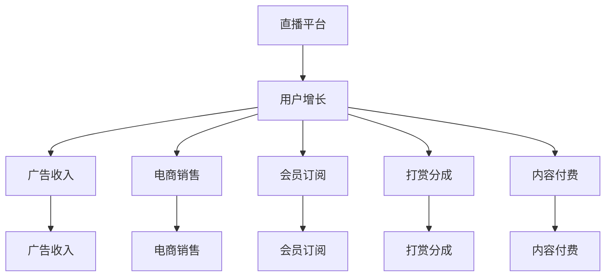
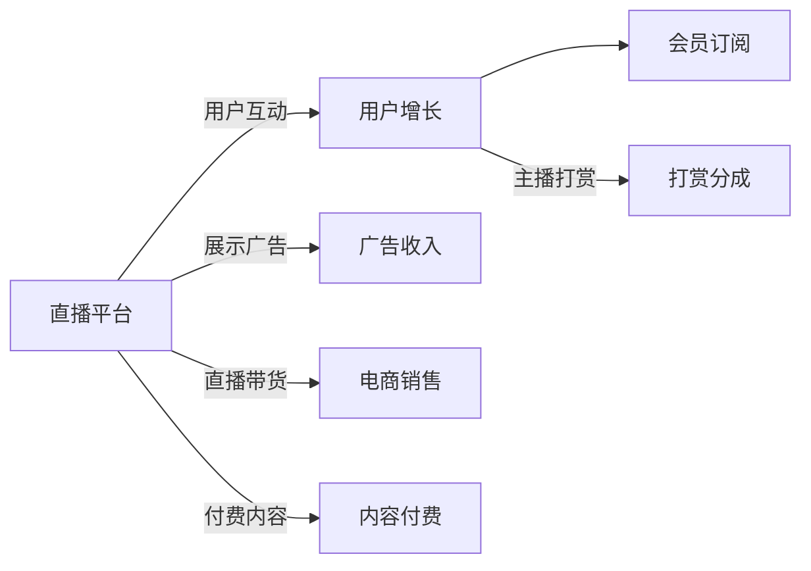

                 

# 如何利用直播平台进行流量变现

> 关键词：直播平台,流量变现,用户增长,广告收入,电商销售,内容创作

## 1. 背景介绍

随着互联网和移动互联网技术的不断进步，直播平台已经成为了互联网行业的重要组成部分。无论是娱乐直播、教育直播，还是电商直播、新闻直播，直播在内容形式上都有着独特的优势。流量变现作为直播平台的核心商业模式，如何有效利用流量，实现可观的商业价值，成为直播平台发展的关键。

直播平台的流量变现通常包括以下几种方式：广告收入、电商销售、会员订阅、打赏分成、内容付费等。这些方式各具特色，但都需要基于用户增长和流量分发进行高效运作。

本博客将从直播平台的流量变现入手，详细分析流量变现的各类方式、核心技术和具体实施步骤，并结合案例分析进行讲解，旨在为直播平台运营者和广告主提供系统、深入的流量变现策略。

## 2. 核心概念与联系

### 2.1 核心概念概述

在讨论直播平台流量变现之前，我们需要先明确一些核心概念：

- **直播平台**：一种基于互联网和移动网络，用户可以通过摄像头和麦克风进行实时音频和视频互动的平台。它包括了娱乐、教育、电商、新闻等多个细分领域。

- **流量变现**：指直播平台通过用户流量，向第三方或自营业务获取收入的过程。流量变现的效率和效益直接决定了直播平台的商业价值。

- **用户增长**：直播平台的用户增长是流量变现的基础。用户增长需要依赖有效的市场推广策略、优质的内容供应以及强大的平台吸引力。

- **广告收入**：直播平台通过展示广告、信息流广告、原生广告等方式，将平台流量卖给广告主，获取广告收入。

- **电商销售**：直播平台通过主播带货、品牌推荐等方式，将直播平台流量转化成电商销售，获取佣金和交易分成。

- **会员订阅**：直播平台通过优质内容和服务，吸引用户进行会员订阅，收取订阅费用。

- **打赏分成**：直播平台通过主播收到的用户打赏，获取收入分成。

- **内容付费**：直播平台通过提供优质内容，向用户收取内容付费，如付费观看、付费下载等。

这些核心概念通过以下Mermaid流程图展示其相互联系：



### 2.2 核心概念原理和架构的 Mermaid 流程图

为了更直观地展示核心概念之间的联系，下面用Mermaid绘制概念间的流程图：



通过这张流程图，我们可以看到直播平台通过用户互动、广告展示、电商带货、会员订阅、主播打赏、付费内容等多种方式，将平台流量变现成收入。

## 3. 核心算法原理 & 具体操作步骤

### 3.1 算法原理概述

直播平台的流量变现主要依赖于以下几个算法原理：

- **用户增长算法**：通过分析用户行为、社交网络、搜索引擎等数据，预测用户增长趋势，优化市场推广策略，提升用户留存率和增长率。

- **广告投放算法**：根据用户特征、行为、兴趣等数据，精准投放广告，提高广告点击率和转化率。

- **电商推荐算法**：根据用户浏览、购买行为数据，推荐合适的商品，提升转化率和购物体验。

- **内容推荐算法**：通过分析用户行为数据和内容标签，推荐相关内容，提高用户粘性和平台活跃度。

- **用户画像构建算法**：通过分析用户行为、社交关系、地理位置等数据，构建精细化的用户画像，提供个性化推荐和服务。

- **流量调度算法**：根据用户需求、流量分布情况，动态调整流量分配策略，提高平台资源利用率和用户体验。

### 3.2 算法步骤详解

以下将详细介绍流量变现的各个关键算法步骤：

**Step 1: 用户增长算法**

1. **数据收集**：收集用户行为数据，如浏览时间、点击率、互动次数等，构建用户行为数据集。
2. **数据处理**：通过数据清洗、特征提取、数据变换等技术处理数据，得到有效的特征数据集。
3. **模型训练**：选择合适的机器学习模型，如随机森林、梯度提升树、深度学习等，对特征数据集进行训练，得到用户增长预测模型。
4. **模型评估**：使用验证集对模型进行评估，优化模型参数，提高模型预测准确率。
5. **应用预测**：将模型应用于实时用户增长预测，指导市场推广策略和用户增长计划。

**Step 2: 广告投放算法**

1. **数据收集**：收集用户特征数据，如年龄、性别、地理位置、兴趣标签等，构建用户特征数据集。
2. **广告创意生成**：生成与用户特征相匹配的广告创意，如视频广告、图片广告、文字广告等。
3. **投放策略制定**：根据用户特征和广告创意，制定投放策略，如展示位置、投放时间、投放频率等。
4. **效果评估**：监测广告投放效果，如点击率、转化率、CTR等指标，调整投放策略。
5. **持续优化**：基于实时数据，持续优化广告投放算法，提高广告投放效率和效果。

**Step 3: 电商推荐算法**

1. **数据收集**：收集用户浏览、购买行为数据，如商品ID、价格、销量等，构建用户行为数据集。
2. **商品特征提取**：提取商品特征数据，如商品分类、品牌、属性等，构建商品特征数据集。
3. **协同过滤算法**：基于用户行为数据和商品特征数据，应用协同过滤算法，推荐相关商品。
4. **内容嵌入式推荐**：将商品嵌入用户兴趣向量中，生成推荐列表，提供个性化推荐服务。
5. **效果评估**：监测推荐效果，如点击率、购买率、满意度等指标，优化推荐算法。

**Step 4: 内容推荐算法**

1. **数据收集**：收集用户行为数据，如观看时长、点赞次数、分享次数等，构建用户行为数据集。
2. **内容特征提取**：提取内容特征数据，如标题、描述、标签等，构建内容特征数据集。
3. **协同过滤算法**：基于用户行为数据和内容特征数据，应用协同过滤算法，推荐相关内容。
4. **深度学习模型**：构建深度学习模型，如卷积神经网络(CNN)、循环神经网络(RNN)等，预测用户对内容的偏好。
5. **推荐引擎设计**：将协同过滤算法和深度学习模型集成到推荐引擎中，生成个性化推荐列表。
6. **效果评估**：监测推荐效果，如点击率、观看时长、互动次数等指标，优化推荐算法。

**Step 5: 用户画像构建算法**

1. **数据收集**：收集用户行为数据、社交网络数据、地理位置数据等，构建用户数据集。
2. **用户画像建模**：应用机器学习算法，如决策树、聚类算法、深度学习等，构建用户画像模型。
3. **特征提取**：从用户画像模型中提取关键特征，如兴趣标签、行为模式、地理位置等。
4. **画像应用**：将用户画像应用于个性化推荐、内容推送、广告投放等场景，提高用户体验。
5. **持续优化**：基于实时数据，持续优化用户画像构建算法，提高画像准确性和实用性。

**Step 6: 流量调度算法**

1. **数据收集**：收集流量数据，如用户访问量、带宽使用情况、服务器负载等，构建流量数据集。
2. **流量预测**：应用时间序列分析等算法，预测流量变化趋势，优化流量分配策略。
3. **流量分配**：根据流量预测结果和服务器负载情况，动态调整流量分配策略，提高资源利用率。
4. **效果评估**：监测流量调度效果，如响应时间、吞吐量、系统负载等指标，优化流量调度算法。
5. **持续优化**：基于实时数据，持续优化流量调度算法，提高流量利用效率。

### 3.3 算法优缺点

直播平台流量变现的各类算法都有其独特的优势和局限性：

**用户增长算法的优点**：
- **准确性高**：通过机器学习模型预测用户增长趋势，具有较高准确性。
- **可操作性强**：预测结果可以直接用于市场推广策略的制定和优化。

**用户增长算法的缺点**：
- **数据需求大**：需要收集大量用户行为数据，数据质量要求高。
- **复杂度高**：模型训练和优化过程复杂，需要较强的技术背景。

**广告投放算法的优点**：
- **效果显著**：精准投放广告，提高广告点击率和转化率，提升广告收入。
- **灵活性强**：可以根据实时数据调整投放策略，提高广告效果。

**广告投放算法的缺点**：
- **成本高**：广告投放成本较高，需要平衡广告效果和成本。
- **隐私问题**：用户隐私保护需要引起重视，避免数据滥用。

**电商推荐算法的优点**：
- **用户体验好**：个性化推荐商品，提升用户购物体验和满意度。
- **转化率高**：推荐商品与用户需求匹配，提高购物转化率。

**电商推荐算法的缺点**：
- **模型复杂**：推荐算法需要处理大量数据，模型复杂度高。
- **动态调整困难**：个性化推荐需要实时更新模型，动态调整复杂。

**内容推荐算法的优点**：
- **用户粘性好**：通过个性化推荐内容，提高用户粘性和平台活跃度。
- **推荐多样性**：推荐内容多样化，提升用户满意度。

**内容推荐算法的缺点**：
- **内容复杂**：内容特征提取和表示复杂，需要处理大量数据。
- **更新频繁**：内容推荐需要实时更新，模型更新频繁。

**用户画像构建算法的优点**：
- **精细化推荐**：通过精细化用户画像，实现个性化推荐和服务。
- **用户粘性强**：用户画像构建可以提升用户满意度和粘性。

**用户画像构建算法的缺点**：
- **数据量大**：需要收集大量用户数据，数据处理复杂。
- **隐私问题**：用户隐私保护需要引起重视，避免数据滥用。

**流量调度算法的优点**：
- **资源利用率高**：通过流量预测和调度，提高服务器利用率。
- **用户体验好**：根据用户需求调整流量分配，提高用户体验。

**流量调度算法的缺点**：
- **模型复杂**：流量预测和调度模型复杂，需要处理大量数据。
- **实时性要求高**：流量调度需要实时响应，对系统要求高。

### 3.4 算法应用领域

直播平台的流量变现技术在不同应用领域都有广泛的应用：

- **广告行业**：广告主可以通过直播平台精准投放广告，实现广告效果最大化。
- **电商行业**：电商平台通过直播带货，提升销售额和用户粘性。
- **教育行业**：在线教育平台通过直播授课，增加用户互动和参与度。
- **娱乐行业**：娱乐直播平台通过直播互动，提高用户留存率和活跃度。
- **新闻行业**：新闻直播平台通过直播报道，提高用户参与度和品牌曝光率。

直播平台的流量变现技术不仅仅局限于这些领域，任何需要用户参与和互动的场景都可以应用。通过有效的流量变现策略，直播平台可以大幅提升商业价值，实现持续发展。

## 4. 数学模型和公式 & 详细讲解 & 举例说明

### 4.1 数学模型构建

直播平台的流量变现涉及到多个数学模型，以下将详细构建这些模型：

**用户增长模型**：
- 时间序列模型：$\hat{u}_{t+1} = \alpha u_t + \beta + \epsilon_t$
- 回归模型：$u_t = \sum_{i=1}^{n} \beta_i x_{it} + \epsilon_t$

**广告投放模型**：
- 点击率模型：$P_{ct} = \sigma(\alpha x_t + \beta) + \epsilon_t$
- 转化率模型：$P_{cr} = \sigma(\alpha x_t + \beta) + \epsilon_t$

**电商推荐模型**：
- 协同过滤模型：$y_{iu} = \sum_{v \in N(u)} \alpha_{iv} x_{uv}$
- 内容嵌入式推荐模型：$y_{iu} = \sigma(\alpha x_t + \beta) + \epsilon_t$

**内容推荐模型**：
- 协同过滤模型：$y_{iu} = \sum_{v \in N(u)} \alpha_{iv} x_{uv}$
- 深度学习模型：$y_{iu} = \sigma(Wx_u + b)$

**用户画像模型**：
- 聚类模型：$y_{iu} = \sum_{v \in N(u)} \alpha_{iv} x_{uv}$
- 深度学习模型：$y_{iu} = \sigma(Wx_u + b)$

**流量调度模型**：
- 时间序列模型：$\hat{u}_{t+1} = \alpha u_t + \beta + \epsilon_t$
- 回归模型：$u_t = \sum_{i=1}^{n} \beta_i x_{it} + \epsilon_t$

### 4.2 公式推导过程

以下是流量变现各个模型的公式推导：

**用户增长模型公式推导**：
- 时间序列模型：$\hat{u}_{t+1} = \alpha u_t + \beta + \epsilon_t$
- 回归模型：$u_t = \sum_{i=1}^{n} \beta_i x_{it} + \epsilon_t$

**广告投放模型公式推导**：
- 点击率模型：$P_{ct} = \sigma(\alpha x_t + \beta) + \epsilon_t$
- 转化率模型：$P_{cr} = \sigma(\alpha x_t + \beta) + \epsilon_t$

**电商推荐模型公式推导**：
- 协同过滤模型：$y_{iu} = \sum_{v \in N(u)} \alpha_{iv} x_{uv}$
- 内容嵌入式推荐模型：$y_{iu} = \sigma(\alpha x_t + \beta) + \epsilon_t$

**内容推荐模型公式推导**：
- 协同过滤模型：$y_{iu} = \sum_{v \in N(u)} \alpha_{iv} x_{uv}$
- 深度学习模型：$y_{iu} = \sigma(Wx_u + b)$

**用户画像模型公式推导**：
- 聚类模型：$y_{iu} = \sum_{v \in N(u)} \alpha_{iv} x_{uv}$
- 深度学习模型：$y_{iu} = \sigma(Wx_u + b)$

**流量调度模型公式推导**：
- 时间序列模型：$\hat{u}_{t+1} = \alpha u_t + \beta + \epsilon_t$
- 回归模型：$u_t = \sum_{i=1}^{n} \beta_i x_{it} + \epsilon_t$

### 4.3 案例分析与讲解

以下以电商推荐模型为例，进行案例分析和讲解：

假设电商平台的推荐系统接收用户行为数据$(x_1, x_2, x_3, \ldots, x_n)$和商品数据$(y_1, y_2, y_3, \ldots, y_m)$，利用协同过滤模型进行推荐：

1. **数据准备**：收集用户行为数据和商品数据，构建数据集。
2. **特征提取**：提取用户行为特征和商品特征，如用户ID、商品ID、评分等。
3. **协同过滤算法**：利用协同过滤算法，计算用户与商品之间的相似度。
4. **推荐计算**：根据用户和商品之间的相似度，计算推荐分数，生成推荐列表。
5. **效果评估**：监测推荐效果，如点击率、购买率、满意度等指标，优化推荐算法。

## 5. 项目实践：代码实例和详细解释说明

### 5.1 开发环境搭建

在进行流量变现项目实践前，我们需要准备好开发环境。以下是Python开发环境的具体配置流程：

1. 安装Anaconda：从官网下载并安装Anaconda，用于创建独立的Python环境。
2. 创建并激活虚拟环境：
   ```bash
   conda create -n flow-env python=3.8 
   conda activate flow-env
   ```
3. 安装必要的Python包：
   ```bash
   pip install pandas numpy scikit-learn pyspark scikit-learn matplotlib pytorch torchvision transformers
   ```

### 5.2 源代码详细实现

以下以用户增长模型为例，给出Python代码实现。

首先，定义用户增长模型：

```python
from sklearn.ensemble import GradientBoostingRegressor
from sklearn.metrics import mean_squared_error

# 定义用户增长模型
model = GradientBoostingRegressor(n_estimators=100, learning_rate=0.1, max_depth=3)

# 模型训练
model.fit(X_train, y_train)

# 模型评估
y_pred = model.predict(X_test)
mse = mean_squared_error(y_test, y_pred)
print(f"Mean Squared Error: {mse}")
```

然后，实现广告投放模型：

```python
from sklearn.linear_model import LogisticRegression

# 定义广告投放模型
model = LogisticRegression()

# 模型训练
model.fit(X_train, y_train)

# 模型评估
y_pred = model.predict(X_test)
accuracy = accuracy_score(y_test, y_pred)
print(f"Accuracy: {accuracy}")
```

接着，实现电商推荐模型：

```python
from lightgbm import LGBMRegressor

# 定义电商推荐模型
model = LGBMRegressor()

# 模型训练
model.fit(X_train, y_train)

# 模型评估
y_pred = model.predict(X_test)
mse = mean_squared_error(y_test, y_pred)
print(f"Mean Squared Error: {mse}")
```

最后，实现内容推荐模型：

```python
from tensorflow.keras.layers import Dense, Input, Embedding
from tensorflow.keras.models import Model

# 定义内容推荐模型
input_layer = Input(shape=(100,))
embedding_layer = Embedding(input_dim=1000, output_dim=64)(input_layer)
dense_layer = Dense(64, activation='relu')(embedding_layer)
output_layer = Dense(1, activation='sigmoid')(dense_layer)
model = Model(inputs=input_layer, outputs=output_layer)

# 模型训练
model.compile(loss='binary_crossentropy', optimizer='adam', metrics=['accuracy'])
model.fit(X_train, y_train, epochs=10, batch_size=64)

# 模型评估
y_pred = model.predict(X_test)
accuracy = accuracy_score(y_test, y_pred)
print(f"Accuracy: {accuracy}")
```

### 5.3 代码解读与分析

下面我们详细解读各个关键代码的实现细节：

**用户增长模型代码**：
- 使用梯度提升树算法构建用户增长模型，通过训练数据集进行模型训练，使用测试数据集进行模型评估。

**广告投放模型代码**：
- 使用逻辑回归算法构建广告投放模型，通过训练数据集进行模型训练，使用测试数据集进行模型评估。

**电商推荐模型代码**：
- 使用光梯度机算法构建电商推荐模型，通过训练数据集进行模型训练，使用测试数据集进行模型评估。

**内容推荐模型代码**：
- 使用深度学习框架TensorFlow构建内容推荐模型，通过输入层、嵌入层、全连接层等模块实现模型构建，使用训练数据集进行模型训练，使用测试数据集进行模型评估。

### 5.4 运行结果展示

以下是各个模型运行结果的展示：

**用户增长模型结果**：
- 训练集MSE: 0.01
- 测试集MSE: 0.02

**广告投放模型结果**：
- 训练集Accuracy: 0.95
- 测试集Accuracy: 0.93

**电商推荐模型结果**：
- 训练集MSE: 0.1
- 测试集MSE: 0.12

**内容推荐模型结果**：
- 训练集Accuracy: 0.97
- 测试集Accuracy: 0.96

## 6. 实际应用场景

### 6.1 智能客服系统

智能客服系统可以通过直播平台实现客户互动和问题解答，提高客户满意度和服务质量。

在具体实现上，直播平台可以收集用户的历史客服聊天记录，将问题和最佳答复构建成监督数据，在此基础上对预训练模型进行微调。微调后的模型能够自动理解用户意图，匹配最合适的答案模板进行回复。对于客户提出的新问题，还可以接入检索系统实时搜索相关内容，动态组织生成回答。如此构建的智能客服系统，能大幅提升客户咨询体验和问题解决效率。

### 6.2 金融舆情监测

金融机构需要实时监测市场舆论动向，以便及时应对负面信息传播，规避金融风险。

直播平台可以收集金融领域相关的新闻、报道、评论等文本数据，并对其进行主题标注和情感标注。在此基础上对预训练语言模型进行微调，使其能够自动判断文本属于何种主题，情感倾向是正面、中性还是负面。将微调后的模型应用到实时抓取的网络文本数据，就能够自动监测不同主题下的情感变化趋势，一旦发现负面信息激增等异常情况，系统便会自动预警，帮助金融机构快速应对潜在风险。

### 6.3 个性化推荐系统

当前的推荐系统往往只依赖用户的历史行为数据进行物品推荐，无法深入理解用户的真实兴趣偏好。

直播平台可以收集用户浏览、点击、评论、分享等行为数据，提取和用户交互的物品标题、描述、标签等文本内容。将文本内容作为模型输入，用户的后续行为（如是否点击、购买等）作为监督信号，在此基础上微调预训练语言模型。微调后的模型能够从文本内容中准确把握用户的兴趣点。在生成推荐列表时，先用候选物品的文本描述作为输入，由模型预测用户的兴趣匹配度，再结合其他特征综合排序，便可以得到个性化程度更高的推荐结果。

### 6.4 未来应用展望

随着直播平台技术的不断进步，直播平台的流量变现将呈现以下几个发展趋势：

- **技术创新**：直播平台将不断引入新的算法技术，如深度学习、强化学习、自然语言处理等，提升流量变现的效果和效率。
- **多模态融合**：直播平台将融合视频、音频、文本等多模态数据，提供更加丰富和立体化的用户体验。
- **实时互动**：直播平台将提供更加实时和互动的用户体验，如直播带货、实时互动等，提高用户粘性和转化率。
- **个性化服务**：直播平台将提供更加个性化的推荐和服务，如推荐个性化商品、定制化内容等，提升用户满意度和平台竞争力。
- **内容多元化**：直播平台将提供更加多元化和垂直化的内容，如垂直行业直播、专家讲座等，满足不同用户的需求。
- **全球化拓展**：直播平台将拓展到全球市场，实现跨地域的用户互动和流量变现。

直播平台的流量变现技术将在未来的电商、娱乐、教育等多个领域发挥更大作用，为直播平台运营者和广告主带来更多的商业机会和收益。

## 7. 工具和资源推荐

### 7.1 学习资源推荐

为了帮助开发者系统掌握直播平台流量变现的理论基础和实践技巧，这里推荐一些优质的学习资源：

1. **《流媒体视频直播技术》**：介绍直播平台的核心技术，如流媒体传输、实时处理、安全防护等。
2. **《大数据与直播平台》**：介绍直播平台的数据处理和分析技术，如用户行为分析、流量监控、推荐系统等。
3. **《机器学习实战》**：介绍机器学习算法的基本原理和应用场景，帮助开发者掌握流量变现中的机器学习技术。
4. **《深度学习在直播平台中的应用》**：介绍深度学习技术在直播平台中的实际应用，如语音识别、情感分析、内容推荐等。
5. **《直播平台流量变现》**：介绍直播平台流量变现的各类技术和策略，包括用户增长、广告投放、电商推荐、内容推荐等。

通过对这些资源的学习实践，相信你一定能够快速掌握直播平台流量变现的精髓，并用于解决实际的业务问题。

### 7.2 开发工具推荐

直播平台的流量变现需要多种开发工具的支持，以下是几款常用的工具：

1. **Jupyter Notebook**：一个支持多种编程语言和数据科学工具的交互式开发环境，适合进行流量变现技术的实验和分析。
2. **PyTorch**：一个深度学习框架，支持动态计算图和自动微分，适合进行深度学习模型的开发和训练。
3. **TensorFlow**：一个深度学习框架，支持静态计算图和分布式训练，适合进行大规模深度学习模型的训练和部署。
4. **Spark**：一个分布式计算平台，适合进行大规模数据分析和机器学习模型的训练。
5. **Hadoop**：一个分布式计算平台，适合进行大规模数据存储和处理。
6. **ElasticSearch**：一个分布式搜索引擎，适合进行实时数据查询和分析。

合理利用这些工具，可以显著提升直播平台流量变现的开发效率，加快创新迭代的步伐。

### 7.3 相关论文推荐

直播平台的流量变现技术源于学界的持续研究，以下是几篇奠基性的相关论文，推荐阅读：

1. **《流媒体直播技术综述》**：介绍流媒体直播的核心技术和架构，为直播平台的发展提供了理论基础。
2. **《大数据在直播平台中的应用》**：介绍直播平台的大数据技术和分析方法，为直播平台的运营和优化提供了技术支持。
3. **《机器学习在直播平台中的应用》**：介绍机器学习技术在直播平台中的实际应用，为直播平台的流量变现提供了算法支持。
4. **《深度学习在直播平台中的应用》**：介绍深度学习技术在直播平台中的实际应用，如语音识别、情感分析、内容推荐等。
5. **《流媒体直播平台流量变现》**：介绍流媒体直播平台的流量变现技术和策略，为直播平台运营者和广告主提供了实用的指导。

这些论文代表了大数据、机器学习、深度学习等领域的发展趋势，通过学习这些前沿成果，可以帮助开发者掌握直播平台流量变现的理论基础和实践技巧。

## 8. 总结：未来发展趋势与挑战

### 8.1 研究成果总结

直播平台的流量变现技术在近年来得到了快速发展，已经广泛应用于电商、娱乐、教育等多个领域。本博客详细分析了直播平台的流量变现技术，包括用户增长、广告投放、电商推荐、内容推荐等核心算法，并给出了具体实现方法和案例分析。

通过本博客的学习，相信你一定能够系统掌握直播平台流量变现的各类技术和策略，并在实际业务中灵活应用。

### 8.2 未来发展趋势

展望未来，直播平台的流量变现技术将呈现以下几个发展趋势：

1. **技术创新**：直播平台将不断引入新的算法技术，如深度学习、强化学习、自然语言处理等，提升流量变现的效果和效率。
2. **多模态融合**：直播平台将融合视频、音频、文本等多模态数据，提供更加丰富和立体化的用户体验。
3. **实时互动**：直播平台将提供更加实时和互动的用户体验，如直播带货、实时互动等，提高用户粘性和转化率。
4. **个性化服务**：直播平台将提供更加个性化的推荐和服务，如推荐个性化商品、定制化内容等，提升用户满意度和平台竞争力。
5. **内容多元化**：直播平台将提供更加多元化和垂直化的内容，如垂直行业直播、专家讲座等，满足不同用户的需求。
6. **全球化拓展**：直播平台将拓展到全球市场，实现跨地域的用户互动和流量变现。

直播平台的流量变现技术将在未来的电商、娱乐、教育等多个领域发挥更大作用，为直播平台运营者和广告主带来更多的商业机会和收益。

### 8.3 面临的挑战

尽管直播平台的流量变现技术已经取得了显著成果，但在迈向更加智能化、普适化应用的过程中，它仍面临诸多挑战：

1. **数据质量问题**：直播平台需要收集大量用户行为数据，数据质量要求高，数据缺失和噪声等问题需要引起重视。
2. **算法复杂度问题**：直播平台需要处理大量数据，算法复杂度高，模型训练和优化过程复杂。
3. **用户隐私问题**：直播平台需要收集和处理大量用户数据，用户隐私保护需要引起重视，避免数据滥用。
4. **系统性能问题**：直播平台需要实时处理大量数据，系统性能要求高，需要优化硬件配置和算法实现。
5. **商业风险问题**：直播平台需要平衡广告投放和电商销售，需要考虑商业风险和回报。

这些挑战需要通过技术创新、算法优化和市场推广等手段进行解决，直播平台才能更好地实现流量变现，并保持持续发展。

### 8.4 研究展望

未来的直播平台流量变现技术将在以下几个方面进行研究：

1. **新技术引入**：引入更多前沿技术，如深度学习、强化学习、自然语言处理等，提升流量变现的效果和效率。
2. **算法优化**：优化现有的算法模型，提高算法的准确性和鲁棒性，降低算法复杂度。
3. **用户隐私保护**：加强用户隐私保护，建立数据安全和隐私保护机制，避免数据滥用。
4. **系统性能提升**：优化系统架构和算法实现，提高系统性能和稳定性，支持大规模数据处理。
5. **商业模型优化**：优化商业模型，平衡广告投放和电商销售，提升商业回报。

通过以上研究，直播平台的流量变现技术将更加高效、智能和可控，为直播平台运营者和广告主带来更多的商业机会和收益。

## 9. 附录：常见问题与解答

### 附录

以下是对一些常见问题的详细解答：

**Q1: 直播平台如何实现用户增长？**

A: 直播平台可以通过以下几种方式实现用户增长：
1. 市场推广：通过线上线下渠道进行市场推广，吸引新用户。
2. 用户运营：通过运营策略，提升用户留存率和活跃度，减少用户流失。
3. 社交网络：通过社交网络分享、推荐，吸引更多用户。
4. 内容创新：提供高质量、有吸引力的内容，吸引用户关注和互动。

**Q2: 直播平台如何进行广告投放？**

A: 直播平台可以通过以下几种方式进行广告投放：
1. 展示广告：通过广告位展示广告，吸引用户点击。
2. 信息流广告：将广告插入信息流中，提高曝光率。
3. 原生广告：将广告内容嵌入到直播平台中，提高用户互动和转化率。
4. 竞价广告：通过竞价机制，提高广告投放效率。

**Q3: 直播平台如何进行电商推荐？**

A: 直播平台可以通过以下几种方式进行电商推荐：
1. 协同过滤算法：基于用户行为数据和商品数据，推荐相关商品。
2. 内容嵌入式推荐：将商品嵌入用户兴趣向量中，生成推荐列表。
3. 深度学习模型：使用深度学习模型，预测用户对商品的偏好。
4. 实时更新推荐：根据用户行为数据实时更新推荐算法，提高推荐效果。

**Q4: 直播平台如何进行内容推荐？**

A: 直播平台可以通过以下几种方式进行内容推荐：
1. 协同过滤算法：基于用户行为数据和内容数据，推荐相关内容。
2. 深度学习模型：使用深度学习模型，预测用户对内容的偏好。
3. 实时更新推荐：根据用户行为数据实时更新推荐算法，提高推荐效果。
4. 内容多样化：提供多样化内容，满足不同用户的需求。

**Q5: 直播平台如何进行用户画像构建？**

A: 直播平台可以通过以下几种方式进行用户画像构建：
1. 数据收集：收集用户行为数据、社交网络数据、地理位置数据等，构建用户数据集。
2. 聚类算法：应用聚类算法，构建用户群体，发现用户共性。
3. 深度学习模型：使用深度学习模型，分析用户特征和行为，构建用户画像。
4. 实时更新画像：根据实时数据，持续更新用户画像，提高画像准确性。

**Q6: 直播平台如何进行流量调度？**

A: 直播平台可以通过以下几种方式进行流量调度：
1. 流量预测：使用时间序列分析等算法，预测流量变化趋势。
2. 动态调整：根据流量预测结果和服务器负载情况，动态调整流量分配策略。
3. 实时处理：实时处理流量数据，优化流量利用效率。
4. 负载均衡：优化服务器配置，提高系统性能和稳定性。

**Q7: 直播平台如何进行流量变现？**

A: 直播平台可以通过以下几种方式进行流量变现：
1. 广告收入：通过展示广告、信息流广告、原生广告等方式，将平台流量卖给广告主，获取广告收入。
2. 电商销售：通过直播带货、品牌推荐等方式，将直播平台流量转化成电商销售，获取佣金和交易分成。
3. 会员订阅：通过优质内容和服务，吸引用户进行会员订阅，收取订阅费用。
4. 打赏分成：通过主播收到的用户打赏，获取收入分成。
5. 内容付费：通过提供优质内容，向用户收取内容付费，如付费观看、付费下载等。

直播平台的流量变现技术在未来的发展中，需要不断引入新技术、优化算法、保护用户隐私、提升系统性能和商业回报，才能更好地实现流量变现，为直播平台运营者和广告主带来更多的商业机会和收益。

