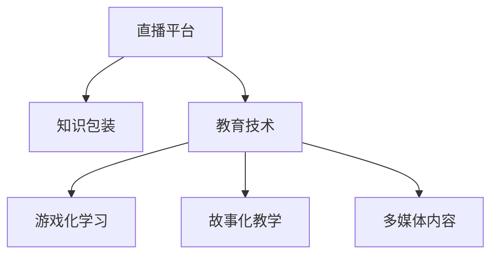

                 

# 如何利用直播平台进行知识包装

> 关键词：知识包装, 直播平台, 教育技术, 内容生产, 学习创新

## 1. 背景介绍

### 1.1 问题由来
随着互联网技术的不断进步，直播平台已成为教育技术领域的一大热门应用。其即时互动、多感官体验等特性，为知识传播和内容包装带来了新的机遇。传统的教育模式主要以教材、考试为中心，重理论轻实践，难以激发学生的学习兴趣和动力。而直播平台的出现，通过多种形式的知识包装，如游戏化学习、故事化教学等，使得知识变得更加生动有趣，吸引更多学生参与互动。

### 1.2 问题核心关键点
知识包装的核心在于如何使知识内容更加生动、有趣、易理解，从而提高学生的学习效果和参与度。直播平台的互动性和多媒体特性为知识包装提供了丰富的手段，如实时解答问题、展示实验过程、提供案例分析等。然而，要充分利用这些特性，提升知识包装效果，仍需解决一些核心问题，如内容设计、技术支持、互动策略等。

## 2. 核心概念与联系

### 2.1 核心概念概述

为更好地理解直播平台知识包装的方法，本节将介绍几个密切相关的核心概念：

- **直播平台**：提供视频直播服务的在线平台，包括但不限于教育、娱乐、社交等领域。
- **知识包装**：将抽象、复杂的知识内容进行视觉化、故事化、互动化处理，使之更易于理解、记忆和应用。
- **教育技术**：利用技术手段优化教育过程，提升教育效果和效率，包括在线学习平台、虚拟现实教室、人工智能辅导等。
- **游戏化学习**：通过引入游戏元素和机制，使学习过程充满乐趣和挑战，提高学习动力和效果。
- **故事化教学**：将知识内容嵌入到故事情节中，通过故事线索引导学生探究和理解知识，增强学习体验。
- **多媒体内容**：结合视频、音频、动画等多种形式的媒体内容，丰富知识表现形式，增强学习体验。

这些核心概念之间的逻辑关系可以通过以下Mermaid流程图来展示：



这个流程图展示了一些核心概念及其之间的关系：

1. 直播平台是知识包装的载体，提供了丰富的多媒体和互动工具。
2. 教育技术是知识包装的基础，通过技术手段提升教学效果。
3. 游戏化学习和故事化教学是知识包装的主要形式，通过引入趣味性元素，提高学习动力。
4. 多媒体内容是知识包装的表现形式，通过多样化的媒体形式增强学习体验。

这些概念共同构成了直播平台知识包装的框架，为内容设计和互动策略提供了理论基础。

## 3. 核心算法原理 & 具体操作步骤
### 3.1 算法原理概述

知识包装的算法原理可以概括为通过数据驱动的方式，根据学生的学习行为和反馈，动态调整知识内容的呈现方式和难度，以达到最佳的学习效果。具体来说，算法分为以下几个步骤：

1. **数据采集**：采集学生在直播平台上的互动数据，如观看时间、答题情况、评论内容等。
2. **分析建模**：使用机器学习和数据分析技术，对采集到的数据进行分析，构建学生的知识掌握模型。
3. **内容适配**：根据学生的知识掌握模型，适配相应的知识内容，如调整难度、增加互动环节等。
4. **内容呈现**：通过直播平台的多媒体和互动工具，将适配后的知识内容动态呈现给学生。
5. **效果评估**：根据学生的学习效果和反馈，进一步调整知识内容适配策略，不断优化学习体验。

### 3.2 算法步骤详解

以下是知识包装的详细操作步骤：

**Step 1: 数据采集**
- 使用API接口从直播平台获取学生互动数据，如观看时间、答题情况、评论内容等。
- 将数据存储到数据库中，便于后续分析和处理。

**Step 2: 分析建模**
- 使用Python和TensorFlow等工具，对采集到的数据进行预处理和特征工程。
- 构建学生的知识掌握模型，如使用K近邻算法、随机森林、神经网络等。

**Step 3: 内容适配**
- 根据学生的知识掌握模型，适配相应的知识内容，如调整题目难度、增加互动环节等。
- 使用直播平台的内容生产工具，制作适配后的知识内容，如视频、PPT、互动问答等。

**Step 4: 内容呈现**
- 通过直播平台的多媒体工具，将适配后的知识内容动态呈现给学生。
- 设置互动环节，如实时答疑、在线讨论、投票调查等，增强学习效果。

**Step 5: 效果评估**
- 根据学生的学习效果和反馈，评估知识包装策略的效果。
- 分析数据，进一步调整知识内容适配策略，不断优化学习体验。

### 3.3 算法优缺点

知识包装的算法具有以下优点：
1. 数据驱动。通过分析学生互动数据，动态调整知识内容，提升学习效果。
2. 个性化适配。针对不同学生的知识水平和兴趣，提供个性化的学习内容。
3. 实时互动。通过互动环节，增强学生的参与度和学习兴趣。
4. 动态调整。根据学生的学习效果和反馈，不断优化学习策略，提高学习效果。

然而，该算法也存在一些局限性：
1. 数据依赖。需要大量学生的互动数据，采集和分析过程较为复杂。
2. 技术门槛。需要一定的数据分析和机器学习基础，实施难度较高。
3. 内容限制。适配后的知识内容可能与原始教材有所差异，影响系统性。
4. 互动效果。互动环节的设计需要符合学生认知规律，否则可能适得其反。

尽管存在这些局限性，但就目前而言，知识包装技术仍是一种高效、创新的教学方法，广泛应用于在线教育、企业培训等领域。未来相关研究的重点在于如何进一步降低技术门槛，提高数据采集的效率和精度，同时兼顾内容的系统性和互动效果。

### 3.4 算法应用领域

知识包装技术已经在多个领域得到应用，取得了显著效果：

- **在线教育**：利用直播平台的知识包装技术，将复杂的知识点通过故事化、游戏化、多媒体化的方式呈现，大大提高了学生的学习兴趣和效果。如Coursera、edX等平台广泛使用。
- **企业培训**：在企业内部培训中，通过直播平台的知识包装技术，将专业知识和案例分析以互动的方式进行展示，提升员工的学习效果和知识掌握度。如腾讯、阿里巴巴等公司广泛应用。
- **语言学习**：在语言学习中，利用直播平台的知识包装技术，通过故事化、多媒体化的方式，生动展示语言学习内容，增强学习效果。如Duolingo、Babbel等平台广泛应用。
- **医学教育**：在医学教育中，利用直播平台的知识包装技术，通过案例分析、虚拟手术等互动方式，生动展示医学知识，提升学生的学习效果和实践能力。如Zebra Medical等平台广泛应用。
- **STEM教育**：在STEM教育中，利用直播平台的知识包装技术，通过游戏化、多媒体化的方式，激发学生的学习兴趣和创新思维。如Code.org、Scratch等平台广泛应用。

## 4. 数学模型和公式 & 详细讲解  
### 4.1 数学模型构建

知识包装的数学模型可以建立在一个多维度的空间中，其中每个维度表示一种特征，如学生的知识掌握水平、学习兴趣、互动情况等。假设每个学生的知识掌握水平可以用一个向量 $\mathbf{x} = [x_1, x_2, ..., x_n]$ 表示，其中 $x_i$ 表示第 $i$ 个特征的取值。

定义知识掌握模型为 $f(\mathbf{x})$，其输出表示学生对知识内容的掌握程度，可以用一个实数 $y$ 表示。知识包装的目标是最大化 $f(\mathbf{x})$，即：

$$
\max_y f(\mathbf{x})
$$

### 4.2 公式推导过程

以下我们以一个简单的线性回归模型为例，推导知识包装的公式。

假设知识内容可以用一个线性模型表示，即：

$$
y = \mathbf{w} \cdot \mathbf{x} + b
$$

其中 $\mathbf{w}$ 为模型参数，$b$ 为偏置项。根据均方误差损失函数，可以得到：

$$
\min_{\mathbf{w}, b} \sum_{i=1}^N (y_i - (\mathbf{w} \cdot \mathbf{x}_i + b))^2
$$

通过求解上述优化问题，可以得到最优的模型参数 $\mathbf{w}$ 和 $b$。

### 4.3 案例分析与讲解

在实践中，知识包装的数学模型可以进一步扩展和优化。例如，在处理多模态数据时，可以将视频、音频等多媒体内容编码为向量，与学生的知识掌握水平向量进行拼接，建立多模态的模型。

假设有一个视频教程 $V = [V_1, V_2, ..., V_n]$，将其编码为一个向量 $\mathbf{v} = [v_1, v_2, ..., v_m]$，其中 $m$ 为特征维度。则知识内容的线性回归模型可以表示为：

$$
y = \mathbf{w} \cdot [\mathbf{x}, \mathbf{v}] + b
$$

通过引入多媒体内容，模型可以更全面地反映学生对知识内容的掌握情况。

## 5. 项目实践：代码实例和详细解释说明
### 5.1 开发环境搭建

在进行知识包装实践前，我们需要准备好开发环境。以下是使用Python进行TensorFlow开发的环境配置流程：

1. 安装Anaconda：从官网下载并安装Anaconda，用于创建独立的Python环境。

2. 创建并激活虚拟环境：
```bash
conda create -n tf-env python=3.8 
conda activate tf-env
```

3. 安装TensorFlow：根据CUDA版本，从官网获取对应的安装命令。例如：
```bash
conda install tensorflow -c conda-forge
```

4. 安装Pandas、NumPy等工具包：
```bash
pip install pandas numpy matplotlib sklearn tqdm jupyter notebook ipython
```

完成上述步骤后，即可在`tf-env`环境中开始知识包装的实践。

### 5.2 源代码详细实现

这里我们以一个简单的知识包装案例为例，使用TensorFlow进行模型训练和评估。

首先，定义知识掌握模型的输入和输出：

```python
import tensorflow as tf
from tensorflow.keras.layers import Dense, Input
from tensorflow.keras.models import Model

input_x = Input(shape=(5,))
input_v = Input(shape=(3,))
output_y = Dense(1)([input_x, input_v])
```

其中，`input_x`表示学生的知识掌握水平向量，`input_v`表示多媒体内容的特征向量，`output_y`表示知识内容的掌握程度。

然后，定义模型的损失函数和优化器：

```python
model.compile(optimizer=tf.keras.optimizers.Adam(learning_rate=0.001),
              loss='mean_squared_error')
```

最后，训练模型并评估其性能：

```python
model.fit([train_x, train_v], train_y, epochs=100, batch_size=32,
          validation_data=([test_x, test_v], test_y))
```

在这个例子中，我们使用了简单的线性回归模型，将知识掌握水平和多媒体内容作为输入，输出知识内容的掌握程度。通过训练和评估，可以得到最优的模型参数，用于后续的知识包装。

### 5.3 代码解读与分析

让我们再详细解读一下关键代码的实现细节：

**input_x和input_v**：
- 定义输入层，分别用于表示学生的知识掌握水平和多媒体内容的特征。

**Dense层**：
- 使用Dense层作为模型的输出层，将输入向量进行线性变换，得到知识内容的掌握程度。

**model.compile()**：
- 使用TensorFlow的compile方法，定义模型的优化器和损失函数。这里使用的是Adam优化器，学习率为0.001，损失函数为均方误差。

**model.fit()**：
- 使用TensorFlow的fit方法，对模型进行训练。在每个epoch内，模型将在训练集上前向传播计算损失函数，并使用Adam优化器更新模型参数。在每个epoch结束后，模型将在验证集上评估其性能。

**运行结果展示**：
- 在训练和验证过程中，将输出损失函数的值和模型的准确率等指标，帮助分析模型的性能和训练效果。

这个例子展示了知识包装的基本流程和实现方法。在实际应用中，还需要根据具体任务进行调整和优化。例如，可以引入更多的特征，使用更复杂的模型结构，加入正则化技术等，以进一步提升知识包装的效果。

## 6. 实际应用场景
### 6.1 在线教育

在线教育是知识包装技术最为常见的应用场景之一。通过直播平台的知识包装技术，可以将复杂、抽象的知识点通过故事化、游戏化、多媒体化的方式呈现，大大提升学生的学习效果。例如，在讲解化学反应时，通过虚拟实验室的互动环节，学生可以亲自操作实验，观察反应过程，增强记忆效果。

### 6.2 企业培训

在企业内部培训中，知识包装技术同样发挥着重要作用。通过直播平台的知识包装技术，将专业知识以互动的方式呈现，增强员工的学习兴趣和效果。例如，在讲解IT技术时，通过虚拟机的互动环节，员工可以亲自动手操作，理解技术原理和应用场景。

### 6.3 医学教育

在医学教育中，知识包装技术同样具有重要的应用价值。通过直播平台的知识包装技术，将医学知识以案例分析、虚拟手术等互动方式呈现，增强学生的学习效果和实践能力。例如，在讲解心脏手术时，通过虚拟手术的互动环节，学生可以模拟手术过程，理解手术步骤和操作技巧。

### 6.4 语言学习

在语言学习中，知识包装技术同样发挥着重要作用。通过直播平台的知识包装技术，将语言知识以互动的方式呈现，增强学生的学习兴趣和效果。例如，在学习语法规则时，通过游戏化的互动环节，学生可以通过完成任务的方式，理解和应用语法规则。

## 7. 工具和资源推荐
### 7.1 学习资源推荐

为了帮助开发者系统掌握知识包装的理论基础和实践技巧，这里推荐一些优质的学习资源：

1. 《深度学习与人工智能应用》系列博文：由大模型技术专家撰写，深入浅出地介绍了深度学习原理、知识包装技术等前沿话题。

2. Coursera《深度学习与人工智能》课程：斯坦福大学开设的深度学习经典课程，有Lecture视频和配套作业，带你入门深度学习的基础概念和技术应用。

3. 《TensorFlow实战》书籍：TensorFlow官方出版的实战书籍，全面介绍了TensorFlow的基本功能和高级应用，包括知识包装在内的诸多主题。

4. Kaggle竞赛：Kaggle平台上有大量的数据集和竞赛项目，可以应用于知识包装的实践和优化。

5. Weights & Biases：模型训练的实验跟踪工具，可以记录和可视化模型训练过程中的各项指标，方便对比和调优。与主流深度学习框架无缝集成。

通过对这些资源的学习实践，相信你一定能够快速掌握知识包装的精髓，并用于解决实际的NLP问题。

### 7.2 开发工具推荐

高效的开发离不开优秀的工具支持。以下是几款用于知识包装开发的常用工具：

1. TensorFlow：基于Python的开源深度学习框架，灵活动态的计算图，适合快速迭代研究。大部分深度学习任务都有TensorFlow版本的实现。

2. Keras：基于TensorFlow的高级神经网络API，提供了便捷的接口和丰富的预训练模型，适合快速构建和训练模型。

3. Weights & Biases：模型训练的实验跟踪工具，可以记录和可视化模型训练过程中的各项指标，方便对比和调优。与主流深度学习框架无缝集成。

4. Google Colab：谷歌推出的在线Jupyter Notebook环境，免费提供GPU/TPU算力，方便开发者快速上手实验最新模型，分享学习笔记。

合理利用这些工具，可以显著提升知识包装任务的开发效率，加快创新迭代的步伐。

### 7.3 相关论文推荐

知识包装技术的发展源于学界的持续研究。以下是几篇奠基性的相关论文，推荐阅读：

1. Attention is All You Need（即Transformer原论文）：提出了Transformer结构，开启了深度学习时代的先河。

2. Knowledge Packaging for Deep Learning：提出知识包装的方法，通过数据驱动的方式动态调整知识内容的呈现方式。

3. Game-Based Learning in Educational Settings：探讨游戏化学习的方法，通过引入游戏元素和机制，提高学习效果。

4. Multimodal Learning：介绍多模态学习的方法，通过结合视频、音频等多媒体内容，增强学习体验。

5. Continuous Learning in Deep Learning：研究持续学习的方法，通过不断更新模型参数，保持学习效果的稳定。

这些论文代表了大模型知识包装技术的发展脉络。通过学习这些前沿成果，可以帮助研究者把握学科前进方向，激发更多的创新灵感。

## 8. 总结：未来发展趋势与挑战
### 8.1 总结

本文对知识包装技术进行了全面系统的介绍。首先阐述了知识包装在直播平台中的重要性和应用价值，明确了知识包装在提高学习效果、增强学习兴趣方面的独特优势。其次，从原理到实践，详细讲解了知识包装的数学模型和实现方法，给出了知识包装任务开发的完整代码实例。同时，本文还广泛探讨了知识包装技术在多个行业领域的应用前景，展示了知识包装范式的巨大潜力。此外，本文精选了知识包装技术的各类学习资源，力求为读者提供全方位的技术指引。

通过本文的系统梳理，可以看到，知识包装技术正在成为教育技术领域的重要范式，极大地拓展了知识传播和内容呈现的方式，为学习者提供了更加生动、有趣、高效的学习体验。未来，伴随知识包装技术的持续演进，相信教育技术将进一步突破传统模式，提升教育效果和效率。

### 8.2 未来发展趋势

展望未来，知识包装技术将呈现以下几个发展趋势：

1. 内容多样化。随着直播平台的多媒体特性不断增强，知识内容将更加多样化和丰富，如视频、音频、动画等。

2. 互动化增强。通过引入更多的互动环节，如实时答疑、在线讨论、虚拟实验等，增强学生的参与度和学习效果。

3. 个性化定制。根据学生的学习行为和反馈，动态调整知识内容的呈现方式和难度，提供个性化的学习体验。

4. 技术融合。知识包装技术将与其他教育技术进行更深入的融合，如虚拟现实、增强现实、人工智能等，共同提升教育效果。

5. 跨平台整合。知识包装技术将突破直播平台的局限，应用于更多的平台和设备，如移动设备、智能家居等，实现全场景的学习体验。

6. 效果评估。通过大数据和机器学习技术，实时评估知识包装策略的效果，提供数据驱动的优化建议。

以上趋势凸显了知识包装技术的广阔前景。这些方向的探索发展，必将进一步提升教育技术的效果和应用范围，为学习者提供更加生动、有趣、高效的学习体验。

### 8.3 面临的挑战

尽管知识包装技术已经取得了显著成效，但在迈向更加智能化、普适化应用的过程中，它仍面临着诸多挑战：

1. 技术门槛。知识包装技术需要一定的数据处理和机器学习基础，实施难度较高，需要投入大量时间和资源。

2. 数据质量。知识内容的采集和标注需要耗费大量时间和精力，数据质量难以保证。

3. 互动效果。互动环节的设计需要符合学生认知规律，否则可能适得其反，降低学习效果。

4. 设备适配。知识包装技术需要适配不同的设备和平台，实现跨平台的学习体验。

5. 效果评估。需要建立完善的评估体系，实时评估知识包装策略的效果，提供数据驱动的优化建议。

6. 伦理和隐私。知识包装技术涉及大量的学生数据，需要严格遵守数据隐私和安全规定，确保学生信息的保护。

正视知识包装面临的这些挑战，积极应对并寻求突破，将是大数据技术迈向成熟的必由之路。相信随着学界和产业界的共同努力，这些挑战终将一一被克服，知识包装技术必将在构建智能教育系统中发挥更大的作用。

### 8.4 研究展望

面对知识包装所面临的种种挑战，未来的研究需要在以下几个方面寻求新的突破：

1. 探索无监督和半监督知识包装方法。摆脱对大量标注数据的依赖，利用自监督学习、主动学习等无监督和半监督范式，最大限度利用非结构化数据，实现更加灵活高效的知识包装。

2. 研究知识内容的动态生成技术。利用生成对抗网络、变分自编码器等技术，实现知识内容的动态生成，增强学习体验。

3. 引入更多先验知识。将符号化的先验知识，如知识图谱、逻辑规则等，与神经网络模型进行巧妙融合，引导知识包装过程学习更准确、合理的知识表示。

4. 结合因果分析和博弈论工具。将因果分析方法引入知识包装模型，识别出知识内容的因果关系，增强知识表示的稳定性和可解释性。

5. 纳入伦理道德约束。在知识包装过程中，引入伦理导向的评估指标，过滤和惩罚有害的内容，确保知识包装技术的伦理性和安全性。

这些研究方向的探索，必将引领知识包装技术迈向更高的台阶，为教育技术的创新提供新的动力。只有勇于创新、敢于突破，才能不断拓展知识包装技术的边界，让教育技术更好地造福学习者。

## 9. 附录：常见问题与解答

**Q1：知识包装是否适用于所有教育场景？**

A: 知识包装技术在大多数教育场景中都能取得不错的效果，特别是对于数据量较大的场景。但对于一些特定领域的教育，如医学、法律等，需要更加专业的知识和训练，知识包装的效果可能有限。此时需要结合专业的教育和培训方法，进行进一步优化。

**Q2：如何选择合适的知识包装策略？**

A: 知识包装策略的选择需要考虑多个因素，如学生的需求、教学目标、学习内容等。通常需要设计多轮试验，根据学生反馈和学习效果，逐步调整策略。

**Q3：知识包装在企业培训中的应用有哪些优势？**

A: 知识包装在企业培训中的应用可以带来以下优势：
1. 提高培训效果。通过互动环节和多媒体内容，增强员工的学习兴趣和效果。
2. 降低培训成本。知识包装可以批量化生产内容，节省培训材料和师资成本。
3. 灵活定制培训内容。根据员工的需求和反馈，动态调整培训内容，提升培训的针对性和实用性。

**Q4：知识包装技术在实际应用中需要注意哪些问题？**

A: 知识包装技术在实际应用中需要注意以下问题：
1. 数据隐私。知识内容的采集和使用需要严格遵守数据隐私规定，确保学生和员工的隐私信息保护。
2. 设备适配。知识包装技术需要适配不同的设备和平台，实现跨平台的学习体验。
3. 互动效果。互动环节的设计需要符合学生和员工的认知规律，否则可能适得其反，降低学习效果。
4. 效果评估。需要建立完善的评估体系，实时评估知识包装策略的效果，提供数据驱动的优化建议。

通过关注这些问题，可以最大限度地发挥知识包装技术的优势，避免潜在的问题。

**Q5：知识包装技术未来的发展方向有哪些？**

A: 知识包装技术的未来发展方向包括：
1. 内容多样化。结合更多的多媒体内容，增强知识内容的呈现形式。
2. 互动化增强。引入更多的互动环节，增强学生的参与度和学习效果。
3. 个性化定制。根据学生的学习行为和反馈，动态调整知识内容的呈现方式和难度，提供个性化的学习体验。
4. 技术融合。知识包装技术将与其他教育技术进行更深入的融合，如虚拟现实、增强现实、人工智能等，共同提升教育效果。
5. 跨平台整合。知识包装技术将突破直播平台的局限，应用于更多的平台和设备，实现全场景的学习体验。
6. 效果评估。通过大数据和机器学习技术，实时评估知识包装策略的效果，提供数据驱动的优化建议。

这些发展方向凸显了知识包装技术的广阔前景。这些方向的探索发展，必将进一步提升教育技术的效果和应用范围，为学习者提供更加生动、有趣、高效的学习体验。

---

作者：禅与计算机程序设计艺术 / Zen and the Art of Computer Programming

