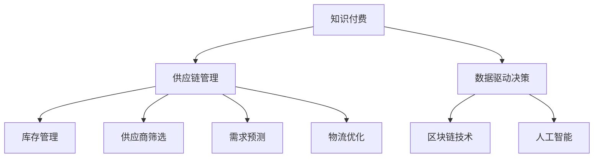

                 

# 如何利用知识付费实现供应链管理与优化？

> 关键词：知识付费, 供应链管理, 优化, 区块链, 大数据, 人工智能, 决策支持

## 1. 背景介绍

### 1.1 问题由来

在快速变化的商业环境中，企业供应链管理面临着诸多挑战，如需求波动、物流成本高企、库存水平不合理等。传统的供应链管理方法已难以应对这些挑战，需要新的技术手段进行优化和升级。知识付费作为新兴的商业模式，为供应链管理带来了新的视角和方法。

### 1.2 问题核心关键点

知识付费是一种基于内容创造和知识分享的商业模式，通过向用户提供有价值的知识，获得相应的经济回报。在供应链管理中，知识付费可以应用于多个环节，如供应商筛选、库存管理、需求预测、物流优化等。通过高效利用专家的知识和经验，帮助企业降低成本、提升效率，实现更灵活的供应链管理。

### 1.3 问题研究意义

研究知识付费在供应链管理中的应用，对于提升供应链管理效率、降低运营成本、提高企业竞争力具有重要意义：

1. 提升决策质量。知识付费提供专家级的数据分析、策略建议等，帮助企业做出更加科学的决策。
2. 降低信息不对称。通过知识付费平台，企业可以获取更多关于供应商、市场动态的信息，优化供应链布局。
3. 增强灵活性。知识付费为供应链管理提供灵活的策略和工具，帮助企业应对市场变化。
4. 促进持续改进。通过持续的知识分享和学习，供应链管理水平得到不断提升，形成良性循环。

## 2. 核心概念与联系

### 2.1 核心概念概述

为更好地理解知识付费在供应链管理中的应用，本节将介绍几个关键概念：

- 知识付费：基于知识内容的商业模式，用户为获取有价值的信息和经验付费。常见的知识付费平台包括但不限于得到、知识星球、知乎付费文章等。
- 供应链管理：涉及产品设计、原材料采购、生产制造、库存管理、物流配送等多个环节的管理活动。目标是实现物流、信息流、资金流的无缝对接，提高供应链整体效率。
- 数据驱动决策：利用大数据和人工智能技术，对供应链数据进行分析，支持企业做出科学的决策。
- 区块链技术：一种去中心化的分布式账本技术，保证数据透明、不可篡改，适用于供应链数据的记录和验证。
- 人工智能：通过机器学习、深度学习等技术，对供应链数据进行挖掘和分析，提升供应链管理效率。

这些概念之间的逻辑关系可以通过以下Mermaid流程图来展示：



这个流程图展示的知识付费在供应链管理中的应用框架：

1. 知识付费平台提供专家级的数据分析和策略建议。
2. 数据驱动决策系统利用知识付费中的数据进行智能分析，优化供应链管理。
3. 区块链技术保证数据透明，防止篡改。
4. 人工智能技术从海量数据中挖掘规律，支持供应链的智能化运营。

这些核心概念共同构成了供应链管理的新范式，为企业提供了更多元、高效的管理手段。

## 3. 核心算法原理 & 具体操作步骤

### 3.1 算法原理概述

知识付费在供应链管理中的应用，本质上是利用专家的知识和经验，对供应链数据进行有针对性的分析和优化。其核心思想是：通过付费获取专家的知识和经验，将这些知识与供应链管理中的数据和模型结合，提升决策质量和运营效率。

具体而言，知识付费在供应链管理中的应用可以分为以下几个步骤：

1. 收集供应链数据：从供应链各个环节收集相关的数据，如供应商信息、库存水平、需求预测、物流状态等。
2. 选择知识付费平台：根据企业的实际需求，选择适合的专家和知识付费平台，获取专家的分析和建议。
3. 数据融合与分析：将专家提供的知识与供应链数据进行融合，利用数据驱动决策和人工智能技术进行深入分析，生成优化方案。
4. 实施优化方案：根据优化方案，对供应链的各个环节进行调整和优化，实现成本降低、效率提升。
5. 持续改进：对优化后的供应链进行持续监控和评估，根据反馈不断调整和优化策略。

### 3.2 算法步骤详解

以下是知识付费在供应链管理中应用的详细步骤：

**Step 1: 数据收集**
- 收集供应链各个环节的数据，如供应商信息、库存水平、需求预测、物流状态等。
- 利用数据采集工具和系统，自动化收集数据，确保数据完整性和及时性。

**Step 2: 专家选择**
- 根据企业的需求，选择合适的专家和知识付费平台。例如，需要供应商筛选建议，可以选择在平台上搜索相关领域的专家。
- 查看专家的评价、案例等，评估其可信度和专业性。

**Step 3: 数据融合与分析**
- 将专家的知识和经验与供应链数据进行融合，例如专家建议某供应商需密切关注物流动态，结合物流数据进行详细分析。
- 利用数据驱动决策系统，如大数据分析和人工智能模型，对融合后的数据进行深入挖掘和分析，生成优化建议。
- 通过可视化工具展示分析结果，帮助决策者理解数据背后的逻辑和趋势。

**Step 4: 实施优化**
- 根据数据融合与分析结果，制定供应链优化方案。例如，若分析结果显示某供应商物流延迟较多，可以采取调整订单策略或替换供应商。
- 利用区块链技术，记录供应链优化过程中的数据变化和操作，确保数据透明和可追溯。
- 实施优化方案，并对供应链的各个环节进行调整和优化，实现成本降低和效率提升。

**Step 5: 持续改进**
- 对优化后的供应链进行持续监控和评估，通过数据反馈和专家复评，不断调整和优化策略。
- 建立持续改进机制，确保供应链管理水平不断提升。

### 3.3 算法优缺点

知识付费在供应链管理中的应用具有以下优点：

1. 提升决策质量：通过专家级的知识和经验，帮助企业做出更加科学的决策。
2. 降低信息不对称：通过知识付费平台，企业可以获取更多关于供应商、市场动态的信息，优化供应链布局。
3. 增强灵活性：知识付费为供应链管理提供灵活的策略和工具，帮助企业应对市场变化。

同时，该方法也存在一些缺点：

1. 依赖专家的能力：知识付费的效果很大程度上取决于专家的专业性和经验，如果专家提供的信息不准确或不及时，可能导致决策失误。
2. 费用较高：知识付费需要支付一定的费用获取专家知识和经验，对于部分中小企业而言，成本可能较高。
3. 数据质量问题：如果供应链数据本身存在质量问题，如数据不完整、数据异常等，知识付费的效果也会受到影响。
4. 技术依赖性强：知识付费的应用需要依赖数据分析、人工智能等技术，对于技术水平较低的企业，可能存在一定的技术障碍。

### 3.4 算法应用领域

知识付费在供应链管理中的应用领域非常广泛，涵盖了供应链管理的各个环节，例如：

- 供应商筛选：通过知识付费平台，获取供应商的详细评价和分析，选择最合适的供应商。
- 库存管理：利用专家知识优化库存水平，避免库存积压或短缺。
- 需求预测：通过专家分析和历史数据，提高需求预测的准确性，优化库存和生产计划。
- 物流优化：利用专家建议和数据分析，优化物流路线、运输方式等，降低物流成本。
- 质量控制：通过专家反馈和数据分析，提高产品质量，减少次品率。

除了上述这些经典应用外，知识付费还创新性地应用于更多场景中，如供应链风险管理、供应链透明度提升、智能合约等，为供应链管理带来了新的突破。

## 4. 数学模型和公式 & 详细讲解 & 举例说明

### 4.1 数学模型构建

知识付费在供应链管理中的应用，可以抽象为一个数学模型，以最大化供应链效率为目标。设供应链总效率为 $E$，优化目标为：

$$
\max E = f(supplier, inventory, demand, logistics)
$$

其中 $supplier$ 表示供应商的选择和评估，$inventory$ 表示库存管理策略，$demand$ 表示需求预测，$logistics$ 表示物流优化。

### 4.2 公式推导过程

以下我们以需求预测为例，推导需求预测的优化公式。

假设需求预测模型为 $D(t)$，其中 $t$ 表示时间，模型的预测误差服从正态分布 $N(\mu, \sigma^2)$。

- 模型预测误差 $\epsilon$ 的期望为 $0$，即 $\mathbb{E}[\epsilon] = 0$。
- 模型预测误差 $\epsilon$ 的方差为 $\sigma^2$，即 $\mathbb{Var}[\epsilon] = \sigma^2$。

根据贝叶斯定理，结合历史数据 $d(t)$，可以得到：

$$
\begin{align*}
P(d(t)|D(t)) &= \frac{P(D(t)|d(t)) P(d(t))}{P(D(t))} \\
&= \frac{\frac{1}{\sqrt{2\pi\sigma^2}} e^{-\frac{(d(t)-D(t))^2}{2\sigma^2}} P(d(t))}{\int \frac{1}{\sqrt{2\pi\sigma^2}} e^{-\frac{(d(t)-D(t))^2}{2\sigma^2}} P(d(t)) dt} \\
&= \frac{1}{\sqrt{2\pi\sigma^2}} e^{-\frac{(d(t)-D(t))^2}{2\sigma^2}}
\end{align*}
$$

其中 $P(d(t))$ 表示历史数据 $d(t)$ 的概率密度函数，$P(D(t))$ 表示模型 $D(t)$ 的先验概率密度函数。

利用历史数据 $d(t)$ 和模型 $D(t)$ 进行训练，可以得到最优的预测模型 $D(t)$。此时，模型的预测误差 $\epsilon$ 服从 $N(0, \sigma^2)$，方差为 $\sigma^2$。

### 4.3 案例分析与讲解

假设某电商企业需要优化其需求预测，可以使用知识付费平台获取专家建议，利用大数据和机器学习技术进行预测优化。

- 专家建议：根据历史销售数据和市场趋势，专家建议采用ARIMA模型进行需求预测。
- 数据融合与分析：利用电商平台的历史销售数据和市场动态数据，训练ARIMA模型，生成预测结果。
- 预测结果：通过可视化工具展示预测结果，帮助企业制定更合理的需求计划。
- 持续改进：利用实时数据和专家复评，不断调整和优化预测模型，确保预测结果的准确性。

## 5. 项目实践：代码实例和详细解释说明

### 5.1 开发环境搭建

在进行知识付费在供应链管理中的应用实践前，我们需要准备好开发环境。以下是使用Python进行Pandas、NumPy、Scikit-Learn等库开发的环境配置流程：

1. 安装Anaconda：从官网下载并安装Anaconda，用于创建独立的Python环境。

2. 创建并激活虚拟环境：
```bash
conda create -n supplychain-env python=3.8 
conda activate supplychain-env
```

3. 安装相关库：
```bash
conda install pandas numpy scikit-learn matplotlib tqdm jupyter notebook ipython
```

4. 安装知识付费平台API：
```bash
pip install knowledge-payment-api
```

完成上述步骤后，即可在`supplychain-env`环境中开始实践。

### 5.2 源代码详细实现

下面我们以库存管理为例，给出使用Pandas和Scikit-Learn对库存管理进行优化的Python代码实现。

首先，定义库存管理的数据处理函数：

```python
import pandas as pd
from sklearn.model_selection import train_test_split

def process_data(df):
    # 将库存数据按照时间序列排序
    df = df.sort_index()
    
    # 提取库存量和需求量
    inventory = df['inventory'].values
    demand = df['demand'].values
    
    # 处理缺失值和异常值
    inventory = df.fillna(method='ffill').values
    demand = df.fillna(method='ffill').values
    
    # 划分训练集和测试集
    inventory_train, inventory_test = train_test_split(inventory, test_size=0.2, random_state=42)
    demand_train, demand_test = train_test_split(demand, test_size=0.2, random_state=42)
    
    return inventory_train, demand_train, inventory_test, demand_test
```

然后，定义优化函数：

```python
from sklearn.linear_model import LinearRegression
from sklearn.metrics import mean_squared_error

def optimize_inventory(inventory_train, demand_train, inventory_test):
    # 初始化模型
    model = LinearRegression()
    
    # 训练模型
    model.fit(inventory_train, demand_train)
    
    # 预测并评估模型
    inventory_pred = model.predict(inventory_test)
    mse = mean_squared_error(inventory_test, inventory_pred)
    
    return mse
```

最后，启动优化流程并输出结果：

```python
inventory_train, demand_train, inventory_test, demand_test = process_data(df)
mse = optimize_inventory(inventory_train, demand_train, inventory_test)
print(f"库存管理优化后的均方误差为：{mse:.2f}")
```

以上就是使用Python对库存管理进行优化的完整代码实现。可以看到，得益于Pandas和Scikit-Learn库的强大封装，我们可以用相对简洁的代码完成库存管理的优化。

### 5.3 代码解读与分析

让我们再详细解读一下关键代码的实现细节：

**process_data函数**：
- 对库存数据按照时间序列排序，确保时间顺序的一致性。
- 提取库存量和需求量，并进行缺失值处理，确保数据完整性。
- 将数据划分为训练集和测试集，分别用于模型训练和评估。

**optimize_inventory函数**：
- 初始化线性回归模型，利用训练集数据进行模型训练。
- 对测试集数据进行预测，计算预测值与实际值之间的均方误差。
- 返回均方误差，作为库存管理优化的指标。

**优化流程**：
- 利用process_data函数处理数据，确保数据完整和有序。
- 调用optimize_inventory函数，进行线性回归模型的训练和评估。
- 输出优化后的均方误差，作为库存管理优化的结果。

可以看出，利用Pandas和Scikit-Learn库，我们可以快速、高效地实现库存管理的优化，并基于优化结果进一步提升供应链的整体效率。

当然，在实际应用中，还需要根据具体业务场景，对优化函数进行进一步优化和扩展，如引入知识付费平台的专家建议，结合专家知识和数据进行更加复杂的优化。

## 6. 实际应用场景

### 6.1 智能合约

智能合约是一种自动化的合约执行系统，基于区块链技术，可以在不需要第三方干预的情况下，自动执行合同条款。在供应链管理中，智能合约可以用于自动化支付、订单执行、库存管理等环节。

具体而言，企业可以通过知识付费平台获取专家的建议和数据，利用区块链技术记录合同条款和执行状态，确保合同的透明和不可篡改。同时，智能合约可以实时监控供应链状态，自动调整合同条款，提升供应链的灵活性和透明度。

### 6.2 需求预测

利用知识付费平台，企业可以获取专家的历史数据和市场趋势分析，结合大数据和机器学习技术，生成更准确的需求预测模型。根据需求预测结果，企业可以优化库存水平和生产计划，避免库存积压和短缺。

例如，某电商平台可以获取专家的市场分析和历史销售数据，训练ARIMA模型进行需求预测，并将预测结果用于库存管理和订单调度。这样，企业可以更加准确地预测用户需求，优化供应链管理，提升用户体验。

### 6.3 供应链透明度

区块链技术可以记录供应链的各个环节，确保数据透明和不可篡改。通过知识付费平台获取专家的建议和数据，企业可以全面了解供应链的各个环节，提升供应链的透明度。

例如，某食品企业可以利用区块链技术记录供应链的各个环节，如原材料采购、生产制造、物流配送等，确保数据的真实和可追溯。同时，企业可以通过知识付费平台获取专家的建议，优化供应链布局和流程，提升供应链的透明度和可靠性。

### 6.4 未来应用展望

随着知识付费和区块链技术的不断发展，其在供应链管理中的应用将不断拓展，为供应链管理带来新的变革。

在智慧物流领域，知识付费和区块链技术可以结合，记录物流状态和运输过程，提升物流的透明和可追溯性，降低物流成本。

在智能采购领域，企业可以通过知识付费平台获取供应商的评价和建议，结合区块链技术，确保采购数据的透明和可追溯，提升采购效率和质量。

在供应链风险管理领域，利用知识付费平台获取专家的风险评估和建议，结合区块链技术，记录风险事件和应急处理流程，提升供应链的抗风险能力。

此外，在智慧城市、智能制造、智能交通等多个领域，知识付费和区块链技术的结合，将为供应链管理带来新的突破，推动社会和经济的持续发展。

## 7. 工具和资源推荐

### 7.1 学习资源推荐

为了帮助开发者系统掌握知识付费和供应链管理的相关技术，这里推荐一些优质的学习资源：

1. Coursera《大数据科学与工程》课程：由清华大学开设，系统讲解大数据技术在供应链管理中的应用，包括数据采集、存储、分析和可视化等。

2. Udacity《区块链技术》课程：由IBM开设，系统讲解区块链技术的基本原理和应用场景，包括智能合约、供应链金融等。

3. 《供应链管理》书籍：系统介绍供应链管理的理论和实践，涵盖供应链规划、库存管理、物流优化等多个环节。

4. 《大数据在供应链管理中的应用》书籍：详细介绍大数据和人工智能技术在供应链管理中的应用，包括需求预测、库存优化、物流调度等。

5. 《区块链技术与供应链管理》白皮书：全面介绍区块链技术在供应链管理中的应用，包括数据透明、不可篡改、智能合约等。

通过对这些资源的学习实践，相信你一定能够快速掌握知识付费和供应链管理的关键技术，并用于解决实际的供应链问题。

### 7.2 开发工具推荐

高效的开发离不开优秀的工具支持。以下是几款用于知识付费和供应链管理开发的常用工具：

1. Jupyter Notebook：交互式编程环境，支持Python、R等语言，适用于数据处理和模型开发。

2. Python：广泛使用的编程语言，支持Pandas、NumPy、Scikit-Learn等库，适用于数据处理和机器学习开发。

3. Tableau：数据可视化工具，支持多种数据格式，适用于数据可视化和大数据分析。

4. Power BI：商业智能工具，支持多种数据源，适用于数据可视化和大数据分析。

5. Weights & Biases：模型训练的实验跟踪工具，可以记录和可视化模型训练过程中的各项指标，方便对比和调优。

6. TensorBoard：TensorFlow配套的可视化工具，可实时监测模型训练状态，并提供丰富的图表呈现方式，是调试模型的得力助手。

合理利用这些工具，可以显著提升知识付费和供应链管理的开发效率，加快创新迭代的步伐。

### 7.3 相关论文推荐

知识付费和供应链管理的发展源于学界的持续研究。以下是几篇奠基性的相关论文，推荐阅读：

1. A Survey on Blockchain in Supply Chain Management：全面介绍区块链技术在供应链管理中的应用，包括数据透明、智能合约、供应链金融等。

2. Data-Driven Decision-Making in Supply Chain Management：利用大数据和人工智能技术，对供应链数据进行深入分析，支持企业做出科学的决策。

3. Knowledge-Based Inventory Management in Supply Chain：结合专家知识和数据，优化库存管理，提升供应链效率。

4. Blockchain and IoT Technologies in Supply Chain Management：利用区块链技术和物联网技术，提升供应链的透明和可追溯性。

这些论文代表了大规模知识付费和供应链管理的研究脉络。通过学习这些前沿成果，可以帮助研究者把握学科前进方向，激发更多的创新灵感。

## 8. 总结：未来发展趋势与挑战

### 8.1 总结

本文对知识付费在供应链管理中的应用进行了全面系统的介绍。首先阐述了知识付费和供应链管理的研究背景和意义，明确了知识付费在供应链管理中的应用前景。其次，从原理到实践，详细讲解了知识付费在供应链管理中的应用步骤，给出了知识付费和供应链管理的代码实现。同时，本文还广泛探讨了知识付费和供应链管理的实际应用场景，展示了知识付费范式在供应链管理中的应用潜力。此外，本文精选了知识付费和供应链管理的学习资源和开发工具，力求为读者提供全方位的技术指引。

通过本文的系统梳理，可以看到，知识付费和供应链管理的应用已经初步形成，为企业提供了更多元、高效的管理手段。未来，伴随知识付费和区块链技术的不断发展，知识付费在供应链管理中的应用将进一步深化，提升供应链管理的智能化水平，助力企业数字化转型。

### 8.2 未来发展趋势

展望未来，知识付费在供应链管理中的应用将呈现以下几个发展趋势：

1. 知识付费平台的多样化：更多的知识付费平台将涌现，提供更加专业、灵活的知识服务，满足不同企业的需求。

2. 数据驱动决策的深化：利用大数据和人工智能技术，对供应链数据进行更深入的分析和挖掘，提升决策的科学性和准确性。

3. 区块链技术的普及：区块链技术将逐步普及，成为供应链管理的重要基础设施，提升供应链的透明和可追溯性。

4. 人工智能的智能化：结合人工智能技术，优化供应链管理的各个环节，提升供应链的智能化水平。

5. 知识付费和区块链技术的融合：利用区块链技术，确保知识付费数据的透明和可追溯性，提升知识付费平台的信任度。

以上趋势凸显了知识付费在供应链管理中的广阔前景。这些方向的探索发展，必将进一步提升供应链管理的效率和质量，为企业的数字化转型提供新的动力。

### 8.3 面临的挑战

尽管知识付费在供应链管理中的应用已经取得了初步成果，但在迈向更加智能化、普适化应用的过程中，它仍面临着诸多挑战：

1. 知识付费的可靠性和权威性：知识付费平台需要提供高质量的专家建议和服务，确保信息的准确性和权威性，避免误导决策。

2. 供应链数据的质量问题：供应链数据可能存在缺失、异常等问题，需要通过数据清洗和处理，确保数据的质量。

3. 供应链管理的复杂性：供应链管理涉及多个环节和复杂的数据，需要综合利用知识付费、大数据、人工智能等技术，提升管理效率。

4. 知识付费的成本问题：知识付费平台需要收取一定的费用，对于部分中小企业而言，成本可能较高。

5. 技术依赖性强：知识付费和供应链管理的应用需要依赖技术手段，对于技术水平较低的企业，可能存在一定的技术障碍。

这些挑战需要通过技术创新和产业协同，逐步克服，才能实现知识付费在供应链管理中的广泛应用。

### 8.4 研究展望

面对知识付费和供应链管理所面临的挑战，未来的研究需要在以下几个方面寻求新的突破：

1. 探索新的知识付费模式：结合区块链技术和智能合约，提供更加透明、可信的知识服务。

2. 优化供应链数据管理：通过数据清洗、数据增强等技术，提升供应链数据的质量和完整性。

3. 开发智能化供应链管理系统：结合人工智能技术，优化供应链管理的各个环节，提升供应链的智能化水平。

4. 降低知识付费的成本：通过知识付费平台的协同和共享，降低企业的知识获取成本。

5. 推广知识付费技术：加强对中小企业和传统企业的技术培训和推广，提升全行业的知识付费应用水平。

这些研究方向的探索，必将引领知识付费和供应链管理技术迈向更高的台阶，为供应链管理带来新的突破。面向未来，知识付费和供应链管理技术还需要与其他人工智能技术进行更深入的融合，如知识表示、因果推理、强化学习等，多路径协同发力，共同推动供应链管理的进步。只有勇于创新、敢于突破，才能不断拓展知识付费的边界，让知识付费技术更好地服务于企业的供应链管理。

## 9. 附录：常见问题与解答

**Q1：知识付费在供应链管理中的应用流程是什么？**

A: 知识付费在供应链管理中的应用流程如下：
1. 收集供应链数据，并进行数据清洗和处理。
2. 选择知识付费平台，获取专家的建议和数据。
3. 将专家的建议与供应链数据进行融合，利用数据驱动决策系统进行深入分析。
4. 根据分析结果，制定供应链优化方案，并利用区块链技术记录供应链优化过程。
5. 实施优化方案，并对供应链的各个环节进行调整和优化。
6. 持续监控和评估优化效果，根据反馈不断调整和优化策略。

**Q2：如何选择适合的知识付费平台？**

A: 选择适合的知识付费平台需要考虑以下几个因素：
1. 专家的专业性和可信度：选择在该领域有丰富经验和较高评价的专家。
2. 平台的技术和服务：选择技术成熟、服务完善、用户评价高的平台。
3. 平台的费用和服务包：选择性价比高、服务内容丰富的平台。

**Q3：知识付费在供应链管理中需要注意哪些问题？**

A: 知识付费在供应链管理中需要注意以下问题：
1. 数据质量和完整性：确保供应链数据的质量和完整性，避免数据异常和缺失。
2. 专家建议的准确性：选择可靠的专家，获取高质量的建议和数据。
3. 知识付费的费用：控制知识付费的费用，避免过度投入。
4. 供应链管理的复杂性：综合利用知识付费、大数据、人工智能等技术，提升供应链管理的效率。

**Q4：如何降低知识付费在供应链管理中的成本？**

A: 降低知识付费在供应链管理中的成本需要考虑以下几个方面：
1. 选择合适的平台：选择性价比高的知识付费平台，获取高质量的建议和数据。
2. 共享知识资源：通过平台和行业联盟，共享知识资源，降低企业的知识获取成本。
3. 自我学习和创新：加强企业的技术培训和创新，提升自身的供应链管理能力。

**Q5：知识付费在供应链管理中的应用前景如何？**

A: 知识付费在供应链管理中的应用前景广阔，可以应用于多个环节，如供应商筛选、库存管理、需求预测、物流优化等。通过高效利用专家的知识和经验，帮助企业降低成本、提升效率，实现更灵活的供应链管理。未来，伴随知识付费和区块链技术的不断发展，知识付费在供应链管理中的应用将进一步深化，提升供应链管理的智能化水平，助力企业数字化转型。

---

作者：禅与计算机程序设计艺术 / Zen and the Art of Computer Programming

