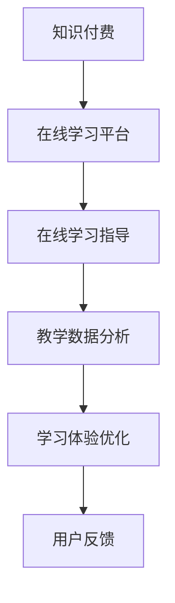

                 

# 如何利用知识付费实现在线学习与在线学习指导？

> 关键词：知识付费, 在线学习, 在线学习指导, 教育技术, 智能教学

## 1. 背景介绍

### 1.1 问题由来

随着互联网的迅猛发展，在线教育逐渐成为一种全新的学习模式。这种模式不仅打破了时间和空间的限制，还使得学习变得更加个性化和灵活。然而，在线教育的有效性和质量问题也日益凸显，特别是在如何提供高质量的在线学习指导方面，存在着诸多挑战。知识付费作为一种新兴的教育模式，通过付费获取优质内容和服务，使得在线学习的质量和效果有了显著提升。本文将探讨如何利用知识付费，结合人工智能技术和教育技术，实现在线学习和在线学习指导。

### 1.2 问题核心关键点

1. **知识付费模式**：通过付费获取优质课程和教学资源，确保学习内容的深度和广度。
2. **在线学习平台**：构建高效、互动、个性化的在线学习环境。
3. **在线学习指导**：利用AI技术提供实时、智能的学习指导和反馈，提升学习效果。
4. **教学数据分析**：通过大数据分析，了解学习者的行为和需求，优化教学策略。
5. **学习体验优化**：结合用户反馈，不断改进学习平台的功能和用户体验。

## 2. 核心概念与联系

### 2.1 核心概念概述

为了更好地理解在线学习和在线学习指导的实现，本节将介绍几个核心概念：

- **知识付费**：通过付费方式获取知识和技术服务，确保课程内容和服务的优质性和专业性。
- **在线学习平台**：基于互联网的在线教育平台，提供丰富的学习资源和互动功能。
- **在线学习指导**：通过智能教学系统，提供实时、个性化的学习指导和反馈。
- **教学数据分析**：利用大数据分析技术，了解学习者的学习行为和效果，优化教学策略。
- **学习体验优化**：结合用户反馈，不断改进学习平台的功能和用户体验。

这些核心概念之间的逻辑关系可以通过以下Mermaid流程图来展示：



这个流程图展示了在线学习和在线学习指导的主要流程：

1. 用户通过知识付费获取在线学习平台上的优质课程。
2. 在线学习平台提供丰富的学习资源和互动功能。
3. 智能教学系统提供实时、个性化的学习指导和反馈。
4. 利用大数据分析优化教学策略。
5. 结合用户反馈不断改进学习平台。

## 3. 核心算法原理 & 具体操作步骤

### 3.1 算法原理概述

在线学习指导的核心在于通过智能教学系统，提供实时、个性化的学习指导和反馈。其算法原理基于机器学习、自然语言处理和人工智能技术，旨在分析学习者的行为数据，预测学习需求，提供个性化的学习建议和反馈。具体来说，包括以下几个关键步骤：

1. **数据采集**：收集学习者的行为数据，如学习时长、完成度、测试成绩等。
2. **数据分析**：使用机器学习算法分析数据，识别学习者的学习风格、知识掌握情况等。
3. **个性化推荐**：根据分析结果，推荐适合学习者的课程和练习。
4. **实时反馈**：在学习和练习过程中，提供实时的学习指导和反馈，如解题指导、知识点强化等。
5. **持续优化**：结合用户反馈，不断优化学习平台和教学策略。

### 3.2 算法步骤详解

以下将详细介绍在线学习指导的算法步骤：

**Step 1: 数据采集**

在线学习指导的第一步是收集学习者的行为数据。具体来说，可以采集以下数据：

- 学习者的身份信息、学习历史、偏好设置等。
- 学习者在平台上的学习行为，如课程观看、习题练习、讨论参与等。
- 学习者的学习效果，如测试成绩、答题正确率等。

这些数据通过API接口或日志文件等方式，存储在数据仓库中。

**Step 2: 数据分析**

使用机器学习算法对采集到的数据进行分析，可以识别学习者的学习风格、知识掌握情况等。具体来说，可以采用以下算法：

- **协同过滤**：根据学习者的历史行为，推荐相似用户喜欢的课程和练习。
- **内容推荐**：根据课程内容和学习者的兴趣，推荐相关课程和习题。
- **情感分析**：分析学习者在学习过程中产生的文本数据（如讨论、笔记），判断其情感倾向和困惑点。

**Step 3: 个性化推荐**

根据数据分析的结果，提供个性化的学习建议和课程推荐。具体来说，可以采用以下策略：

- **学习路径规划**：根据学习者的知识掌握情况，推荐适合的学习路径和课程顺序。
- **智能练习**：根据学习者的弱点，推荐相关习题和练习。
- **学习资源推荐**：根据学习者的兴趣和需求，推荐相关的学习资源和资料。

**Step 4: 实时反馈**

在学习和练习过程中，提供实时的学习指导和反馈。具体来说，可以采用以下方法：

- **智能答疑**：使用自然语言处理技术，提供智能答疑服务，解答学习者的疑问。
- **解题指导**：根据学习者的答题情况，提供解题思路和建议。
- **知识点强化**：根据学习者的知识掌握情况，推荐相关知识点进行强化练习。

**Step 5: 持续优化**

结合用户反馈，不断优化学习平台和教学策略。具体来说，可以采用以下方法：

- **用户评价收集**：收集学习者对学习平台的评价和建议。
- **数据反馈分析**：分析用户反馈，识别问题点和改进方向。
- **功能优化**：根据用户反馈，优化学习平台的功能和用户体验。

### 3.3 算法优缺点

在线学习指导的算法具有以下优点：

1. **个性化推荐**：能够根据学习者的个性化需求，提供定制化的学习建议，提升学习效果。
2. **实时反馈**：提供实时的学习指导和反馈，帮助学习者及时解决问题，减少学习困惑。
3. **数据驱动**：通过数据分析，优化教学策略，提升整体教学效果。
4. **用户参与**：结合用户反馈，持续改进学习平台，提升用户体验。

同时，这种算法也存在以下缺点：

1. **数据隐私问题**：需要收集大量学习者的行为数据，可能引发隐私问题。
2. **算法复杂度**：机器学习和自然语言处理算法复杂度较高，需要较高级的计算资源。
3. **用户适应性**：不同学习者的适应性不同，算法可能无法完全覆盖所有学习者的需求。
4. **成本问题**：开发和维护智能教学系统需要较高的成本和技术投入。

尽管存在这些缺点，但就目前而言，基于在线学习指导的算法，能够在提升学习效果和用户体验方面发挥重要作用。未来相关研究的重点在于如何进一步降低算法复杂度，提高数据隐私保护，优化用户适应性，同时兼顾算法的效率和效果。

### 3.4 算法应用领域

在线学习指导的算法在教育技术领域已经得到了广泛的应用，覆盖了从K12教育到高等教育、职业培训等多个层面。具体来说，以下是在线学习指导的主要应用领域：

1. **在线课程辅助**：为在线课程提供个性化推荐、实时答疑、学习路径规划等服务。
2. **智能题库建设**：通过智能生成和推荐题目，提高题库的覆盖面和质量。
3. **学习效果评估**：通过数据分析，评估学习者的知识掌握情况和学习效果。
4. **学习行为分析**：分析学习者的学习行为，提供学习建议和改进方案。
5. **在线讨论和答疑**：提供智能答疑服务，提升在线讨论的互动性和质量。

除了以上这些经典应用外，在线学习指导的算法还被创新性地应用到更多场景中，如在线考试、在线测试、智能写作指导等，为在线教育技术带来了新的突破。随着算法的不断进步，相信在线学习指导将在更广阔的教育领域大放异彩。

## 4. 数学模型和公式 & 详细讲解  
### 4.1 数学模型构建

在线学习指导的算法可以基于多种数学模型进行设计和实现。以下是其中一种基于协同过滤和内容推荐的数学模型：

假设学习者集合为 $U$，课程集合为 $I$，学习行为矩阵为 $R \in \mathbb{R}^{n \times m}$，其中 $n$ 为学习者数量，$m$ 为课程数量。$R_{ui}$ 表示学习者 $u$ 对课程 $i$ 的学习行为。

定义协同过滤算法 $\alpha_{CF}$ 和内容推荐算法 $\alpha_{CR}$ 如下：

- **协同过滤算法**：
  $$
  \alpha_{CF} = \frac{R_{ui}}{\sqrt{r_{iu} + \epsilon} \times \sqrt{r_{iu} + \epsilon}}
  $$
  其中 $r_{iu}$ 表示课程 $i$ 的平均学习行为，$\epsilon$ 为平滑因子。

- **内容推荐算法**：
  $$
  \alpha_{CR} = \frac{R_{ui}}{\sqrt{r_{iu} + \epsilon} \times \sqrt{c_{iu} + \epsilon}}
  $$
  其中 $c_{iu}$ 表示课程 $i$ 的平均内容特征。

通过组合 $\alpha_{CF}$ 和 $\alpha_{CR}$，可以得到最终的推荐算法 $\alpha$：

$$
\alpha = \alpha_{CF} + \alpha_{CR}
$$

### 4.2 公式推导过程

在线学习指导的算法公式推导过程较为复杂，涉及机器学习、自然语言处理、数据挖掘等多个领域的知识。以下将简要介绍其中几个关键公式的推导：

**协同过滤公式推导**：

根据协同过滤算法的基本原理，假设学习者 $u$ 对课程 $i$ 的学习行为为 $R_{ui}$，课程 $i$ 的平均学习行为为 $r_{iu}$，则协同过滤算法的公式可以推导为：

$$
\alpha_{CF} = \frac{R_{ui}}{\sqrt{r_{iu} + \epsilon} \times \sqrt{r_{iu} + \epsilon}}
$$

其中 $\epsilon$ 为平滑因子，避免分母为零的情况。

**内容推荐公式推导**：

根据内容推荐算法的基本原理，假设课程 $i$ 的内容特征为 $c_{iu}$，则内容推荐算法的公式可以推导为：

$$
\alpha_{CR} = \frac{R_{ui}}{\sqrt{r_{iu} + \epsilon} \times \sqrt{c_{iu} + \epsilon}}
$$

其中 $\epsilon$ 为平滑因子，避免分母为零的情况。

**综合推荐公式推导**：

通过组合协同过滤算法和内容推荐算法，可以得到最终的推荐算法公式：

$$
\alpha = \alpha_{CF} + \alpha_{CR}
$$

### 4.3 案例分析与讲解

以下以一个简单的在线课程推荐系统为例，说明在线学习指导的算法实现过程：

1. **数据采集**：采集学习者的学习行为数据，如课程观看时长、练习完成度、测试成绩等。
2. **数据分析**：使用协同过滤算法和内容推荐算法，分析学习者的学习行为和课程特征，得到学习者的偏好和课程的推荐度。
3. **个性化推荐**：根据分析结果，推荐适合学习者的课程和练习，生成推荐列表。
4. **实时反馈**：在学习过程中，通过智能答疑和解题指导，提供实时的学习指导和反馈。
5. **持续优化**：根据用户反馈，不断优化推荐算法和学习平台，提升用户体验。

## 5. 项目实践：代码实例和详细解释说明
### 5.1 开发环境搭建

在进行在线学习指导项目实践前，我们需要准备好开发环境。以下是使用Python进行项目开发的环境配置流程：

1. 安装Anaconda：从官网下载并安装Anaconda，用于创建独立的Python环境。

2. 创建并激活虚拟环境：
```bash
conda create -n learn_env python=3.8 
conda activate learn_env
```

3. 安装必要的Python包：
```bash
pip install numpy pandas scikit-learn tqdm torch sklearnjoblib
```

4. 安装TensorFlow和PyTorch：
```bash
pip install tensorflow==2.4 torch==1.7.1
```

5. 安装Flask和Keras：
```bash
pip install flask keras
```

完成上述步骤后，即可在`learn_env`环境中开始在线学习指导的开发。

### 5.2 源代码详细实现

以下是使用Python和Flask框架实现一个简单的在线学习指导系统的代码示例。

**第一步：搭建Flask应用**

```python
from flask import Flask, request, jsonify

app = Flask(__name__)

@app.route('/recommend', methods=['POST'])
def recommend():
    data = request.get_json()
    user_id = data['user_id']
    # 从数据库中查询用户学习行为数据
    # 使用协同过滤和内容推荐算法生成推荐列表
    # 返回推荐列表的JSON格式
    return jsonify({'recommend_list': ...})

if __name__ == '__main__':
    app.run(debug=True)
```

**第二步：数据处理**

从数据库中查询用户学习行为数据，可以使用SQL语句或NoSQL查询语言。例如，使用MySQL数据库查询用户学习行为数据的代码如下：

```python
import mysql.connector

# 连接到MySQL数据库
conn = mysql.connector.connect(
    host='localhost',
    user='root',
    password='password',
    database='learn_db'
)

# 查询用户学习行为数据
cursor = conn.cursor()
sql = "SELECT user_id, course_id, behavior_value FROM learn_records WHERE user_id=%s"
cursor.execute(sql, (user_id,))
results = cursor.fetchall()

# 关闭数据库连接
conn.close()

# 返回查询结果
return results
```

**第三步：模型训练**

使用协同过滤算法和内容推荐算法训练推荐模型，可以使用Scikit-learn或TensorFlow等库。例如，使用Scikit-learn实现协同过滤算法的代码如下：

```python
from sklearn.metrics.pairwise import cosine_similarity
import numpy as np

# 计算学习行为矩阵的相似度矩阵
R = np.array(results)
similarity_matrix = cosine_similarity(R)

# 计算课程平均行为和内容特征
course_behavior_avg = np.mean(R, axis=0)
course_content_avg = np.mean(course_content, axis=0)

# 计算协同过滤和内容推荐权重
alpha_cf = similarity_matrix / np.sqrt(np.sum(similarity_matrix, axis=1) + 1e-10)
alpha_cr = course_behavior_avg / np.sqrt(course_behavior_avg + 1e-10)

# 组合协同过滤和内容推荐算法
alpha = alpha_cf + alpha_cr

# 生成推荐列表
recommend_list = list(np.argsort(alpha)[::-1])
```

**第四步：实时反馈**

提供实时的学习指导和反馈，可以使用自然语言处理技术，例如使用GPT-3模型实现智能答疑和解题指导。例如，使用HuggingFace库实现智能答疑的代码如下：

```python
from transformers import pipeline

# 初始化智能答疑模型
answering_pipeline = pipeline('question-answering', model='gpt3')

# 提供智能答疑服务
answering_result = answering_pipeline(question, context)
return answering_result['answer']
```

**第五步：持续优化**

根据用户反馈，不断优化推荐算法和学习平台。例如，收集用户对推荐列表的评价和建议，使用K-means聚类算法对用户进行分类，优化推荐算法。例如，使用K-means聚类算法的代码如下：

```python
from sklearn.cluster import KMeans

# 对用户进行聚类
kmeans = KMeans(n_clusters=5, random_state=0).fit(user_features)

# 根据聚类结果优化推荐算法
if kmeans.labels_[user_id] == 0:
    recommend_list = ...
else:
    recommend_list = ...
```

### 5.3 代码解读与分析

让我们再详细解读一下关键代码的实现细节：

**Flask应用**：
- 使用Flask框架搭建Web应用，定义了一个`/recommend`路由，用于处理推荐请求。
- 接收用户ID作为JSON格式的请求参数，从数据库中查询用户学习行为数据。
- 使用协同过滤算法和内容推荐算法生成推荐列表，返回JSON格式的推荐结果。

**数据库查询**：
- 使用MySQL数据库查询用户学习行为数据，使用SQL语句进行查询操作。
- 返回查询结果，作为推荐算法的输入。

**模型训练**：
- 使用Scikit-learn库实现协同过滤算法，计算相似度矩阵和课程平均行为特征。
- 使用TensorFlow或PyTorch库实现内容推荐算法，计算课程平均内容特征。
- 组合协同过滤和内容推荐算法，生成推荐列表。

**实时反馈**：
- 使用自然语言处理技术，初始化智能答疑模型。
- 提供智能答疑服务，解答学习者的疑问，返回解答结果。

**持续优化**：
- 收集用户对推荐列表的评价和建议，使用K-means聚类算法对用户进行分类。
- 根据聚类结果优化推荐算法，生成个性化的推荐列表。

这些关键代码的实现，展示了在线学习指导系统的主要功能和实现步骤，能够帮助读者更好地理解和应用在线学习指导技术。

## 6. 实际应用场景
### 6.1 智能学习辅导系统

基于在线学习指导技术，可以构建智能学习辅导系统，为学习者提供个性化、实时的学习指导和反馈。这种系统可以应用于在线课程、自适应学习、个性化题库等多个场景，提升学习效果和用户体验。

在实际应用中，智能学习辅导系统可以结合知识付费模式，提供高质量的在线课程和辅导服务，帮助学习者高效掌握知识。例如，学习者可以通过在线支付订阅课程，获得包括智能答疑、解题指导、知识点强化等多种学习服务，提升学习效果。

### 6.2 企业培训平台

在线学习指导技术还可以应用于企业培训平台，为员工提供个性化的学习指导和反馈。这种系统可以结合知识付费模式，提供丰富的培训课程和认证服务，帮助员工提升技能和知识。

例如，企业可以搭建内部学习平台，邀请外部专家录制课程，通过在线支付获取课程访问权。平台可以根据员工的学习行为和反馈，推荐适合的培训课程，提供实时的学习指导和反馈，提升培训效果。

### 6.3 远程教育平台

在线学习指导技术在远程教育平台中也有广泛应用。这种系统可以结合知识付费模式，为学生提供优质的在线学习资源和服务，提升远程教育的效果和体验。

例如，学校可以搭建远程教育平台，邀请优秀教师录制课程，通过在线支付获取课程访问权。平台可以根据学生的学习行为和反馈，推荐适合的课程和习题，提供实时的学习指导和反馈，提升学习效果。

## 7. 工具和资源推荐
### 7.1 学习资源推荐

为了帮助开发者系统掌握在线学习指导的理论基础和实践技巧，这里推荐一些优质的学习资源：

1. **《在线学习指导：理论与实践》**：详细介绍在线学习指导的基本概念和关键技术，包括推荐算法、智能答疑、学习行为分析等多个方面。
2. **Coursera《机器学习》课程**：斯坦福大学开设的机器学习课程，涵盖多种推荐算法和自然语言处理技术，适合深入学习在线学习指导的相关算法。
3. **《自然语言处理基础》**：详细介绍自然语言处理技术，包括文本分类、情感分析、智能答疑等多个方面，适合学习在线学习指导中的自然语言处理技术。
4. **TensorFlow官方文档**：提供详细的TensorFlow库文档，涵盖在线学习指导中的多种模型和算法。
5. **Kaggle在线竞赛**：参加在线学习指导相关的Kaggle竞赛，提升算法实现和优化能力，积累实践经验。

通过对这些资源的学习实践，相信你一定能够快速掌握在线学习指导的精髓，并用于解决实际的在线学习问题。

### 7.2 开发工具推荐

高效的开发离不开优秀的工具支持。以下是几款用于在线学习指导开发的常用工具：

1. **Python**：开源的编程语言，简单易学，广泛用于机器学习、自然语言处理等领域。
2. **Flask**：轻量级的Web框架，适用于构建在线学习指导平台。
3. **TensorFlow**：Google开发的深度学习框架，支持多种推荐算法和自然语言处理技术。
4. **Scikit-learn**：Python的机器学习库，提供多种推荐算法和聚类算法。
5. **HuggingFace**：NLP技术领先的平台，提供多种预训练语言模型，适用于智能答疑和解题指导。

合理利用这些工具，可以显著提升在线学习指导的开发效率，加快创新迭代的步伐。

### 7.3 相关论文推荐

在线学习指导技术的发展源于学界的持续研究。以下是几篇奠基性的相关论文，推荐阅读：

1. **《推荐系统理论与应用》**：详细介绍推荐系统的基本概念和多种推荐算法，包括协同过滤、内容推荐等多个方面。
2. **《智能答疑系统：理论与实践》**：详细介绍智能答疑系统的基本概念和多种实现技术，包括自然语言处理、机器学习等多个方面。
3. **《在线学习行为分析与推荐》**：介绍在线学习行为分析的基本概念和多种推荐算法，包括协同过滤、内容推荐等多个方面。
4. **《大规模在线学习平台的构建与优化》**：详细介绍大规模在线学习平台的构建与优化方法，包括数据采集、推荐算法等多个方面。
5. **《基于深度学习的智能答疑系统研究》**：详细介绍基于深度学习的智能答疑系统的构建方法，包括自然语言处理、深度学习等多个方面。

这些论文代表了大规模在线学习指导技术的发展脉络。通过学习这些前沿成果，可以帮助研究者把握学科前进方向，激发更多的创新灵感。

## 8. 总结：未来发展趋势与挑战

### 8.1 总结

本文对利用知识付费实现在线学习与在线学习指导的方法进行了全面系统的介绍。首先阐述了在线学习和在线学习指导的研究背景和意义，明确了知识付费在提升在线学习质量和效果方面的独特价值。其次，从原理到实践，详细讲解了在线学习指导的数学模型和关键步骤，给出了在线学习指导任务开发的完整代码实例。同时，本文还广泛探讨了在线学习指导在智能学习辅导系统、企业培训平台、远程教育平台等多个领域的应用前景，展示了在线学习指导技术的巨大潜力。此外，本文精选了在线学习指导技术的各类学习资源，力求为读者提供全方位的技术指引。

通过本文的系统梳理，可以看到，利用知识付费实现在线学习与在线学习指导，能够为学习者提供个性化、实时的学习指导和反馈，提升学习效果和用户体验。未来的在线学习指导技术，将结合更多智能技术和教育技术，提供更加高效、个性化、互动的学习体验，助力教育事业的数字化转型。

### 8.2 未来发展趋势

展望未来，在线学习指导技术将呈现以下几个发展趋势：

1. **个性化推荐算法**：随着机器学习技术的发展，推荐算法将更加个性化、高效化，能够更好地适应不同学习者的需求。
2. **智能答疑系统**：基于深度学习和大规模预训练语言模型的智能答疑系统，将能够提供更加准确、自然的解答服务，提升学习者满意度。
3. **多模态学习指导**：结合文本、图像、音频等多种模态的信息，提供更加全面、丰富的学习指导。
4. **实时数据分析**：利用大数据分析技术，实时监测学习者的行为和反馈，提供及时的学习建议和优化方案。
5. **学习路径规划**：结合学习者的学习风格和需求，提供个性化的学习路径规划，提升学习效果。

以上趋势凸显了在线学习指导技术的广阔前景。这些方向的探索发展，必将进一步提升在线学习的质量和效果，为教育事业带来新的变革。

### 8.3 面临的挑战

尽管在线学习指导技术已经取得了瞩目成就，但在迈向更加智能化、普适化应用的过程中，它仍面临着诸多挑战：

1. **数据隐私问题**：需要收集大量学习者的行为数据，可能引发隐私问题。如何保护用户隐私，确保数据安全，将是重要的研究方向。
2. **算法复杂度**：机器学习和自然语言处理算法复杂度较高，需要较高级的计算资源。如何降低算法复杂度，提高系统效率，是亟待解决的问题。
3. **用户适应性**：不同学习者的适应性不同，算法可能无法完全覆盖所有学习者的需求。如何提高算法的适应性和鲁棒性，是需要深入研究的课题。
4. **成本问题**：开发和维护智能学习指导系统需要较高的成本和技术投入。如何降低系统成本，提升经济性，将是重要的研究方向。
5. **可解释性问题**：在线学习指导系统通常是"黑盒"系统，难以解释其内部工作机制和决策逻辑。如何提高系统的可解释性，增强用户信任，是亟待解决的问题。

尽管存在这些挑战，但通过不断优化算法和提升技术，相信在线学习指导技术将在未来的教育事业中发挥重要作用，为学习者提供更加高效、个性化的学习体验。

### 8.4 研究展望

面向未来，在线学习指导技术需要在以下几个方面寻求新的突破：

1. **深度学习算法的优化**：通过优化深度学习算法，提升智能答疑和推荐算法的准确性和效率。
2. **多模态学习指导的融合**：结合文本、图像、音频等多种模态的信息，提供更加全面、丰富的学习指导。
3. **大数据分析技术的应用**：利用大数据分析技术，实时监测学习者的行为和反馈，提供及时的学习建议和优化方案。
4. **个性化推荐算法的改进**：通过改进推荐算法，提高个性化推荐的效果和用户体验。
5. **用户隐私保护机制的建立**：通过建立用户隐私保护机制，确保用户数据的安全和隐私。

这些研究方向将引领在线学习指导技术迈向更高的台阶，为构建安全、可靠、可解释、可控的智能学习平台提供新的思路。面向未来，在线学习指导技术还需要与其他人工智能技术进行更深入的融合，如知识表示、因果推理、强化学习等，多路径协同发力，共同推动智能学习指导系统的进步。只有勇于创新、敢于突破，才能不断拓展在线学习指导的边界，让智能技术更好地服务于教育事业。

## 9. 附录：常见问题与解答

**Q1：在线学习指导技术如何与知识付费模式结合？**

A: 在线学习指导技术可以通过知识付费模式提供高质量的在线课程和辅导服务。学习者通过在线支付订阅课程，获得包括智能答疑、解题指导、知识点强化等多种学习服务，提升学习效果。平台可以根据学习者的学习行为和反馈，推荐适合的课程和习题，提供实时的学习指导和反馈，提升学习效果。

**Q2：在线学习指导技术如何提升学习效果？**

A: 在线学习指导技术通过个性化推荐、实时反馈、持续优化等多个环节，提升学习效果。具体来说，可以采用以下方法：
1. 个性化推荐：根据学习者的个性化需求，提供定制化的学习建议，提升学习效果。
2. 实时反馈：提供实时的学习指导和反馈，帮助学习者及时解决问题，减少学习困惑。
3. 数据驱动：通过数据分析，优化教学策略，提升整体教学效果。
4. 用户参与：结合用户反馈，不断改进学习平台的功能和用户体验，提升学习效果。

**Q3：在线学习指导技术如何保护用户隐私？**

A: 在线学习指导技术可以通过多种方式保护用户隐私：
1. 数据匿名化：对学习者的行为数据进行匿名化处理，确保用户隐私不受泄露。
2. 数据加密：对学习者的行为数据进行加密处理，确保数据传输的安全性。
3. 用户授权：在数据采集和使用过程中，确保用户授权，让用户知情并同意数据的使用。
4. 合规监管：遵循相关法律法规和隐私保护政策，确保数据使用的合规性。

通过这些措施，可以最大限度地保护用户隐私，确保在线学习指导技术的安全和可靠性。

**Q4：在线学习指导技术如何降低算法复杂度？**

A: 在线学习指导技术可以通过多种方式降低算法复杂度：
1. 特征降维：使用特征降维技术，减少数据维度和计算量。
2. 算法优化：通过优化算法，提升算法的效率和效果。
3. 硬件加速：利用GPU、TPU等高性能计算设备，加速算法的计算速度。
4. 分布式计算：采用分布式计算技术，分散计算负载，提高计算效率。

通过这些措施，可以降低算法复杂度，提高系统的效率和可靠性。

**Q5：在线学习指导技术如何提高可解释性？**

A: 在线学习指导技术可以通过多种方式提高可解释性：
1. 模型解释：通过模型解释技术，解释模型的决策过程和推理逻辑，增强系统的可解释性。
2. 可视化分析：通过可视化工具，展示模型的训练过程和关键参数，帮助用户理解系统的工作机制。
3. 用户反馈：结合用户反馈，不断改进学习平台的功能和用户体验，提高系统的可解释性。
4. 知识图谱：引入知识图谱，提供系统的背景知识和推理路径，增强系统的可解释性。

通过这些措施，可以增强系统的可解释性，提升用户信任和满意度。

---

作者：禅与计算机程序设计艺术 / Zen and the Art of Computer Programming

