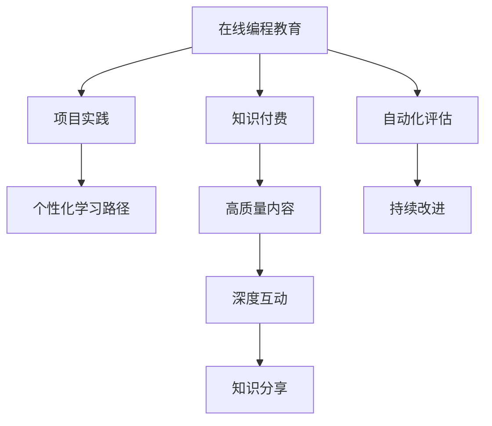

                 

# 如何利用知识付费实现在线编程教育与项目实践？

## 1. 背景介绍

在数字经济时代，编程技能成为了各行各业人才必备的核心竞争力。编程教育与项目实践不仅是培养人才的基础，更是推动创新、提升生产力的重要手段。然而，传统的编程教育和项目实践模式，如封闭式校园课程、线下实验室等，往往受限于时间和空间的限制，难以满足日益增长的需求。为此，利用知识付费模式，构建在线编程教育平台，提供灵活、高效、个性化的编程学习与实践服务，成为了一个亟待探索的新方向。

## 2. 核心概念与联系

### 2.1 核心概念概述

要深入理解如何利用知识付费实现在线编程教育与项目实践，首先需要明确几个关键概念：

- **在线编程教育(Online Programming Education)**：通过互联网技术，提供灵活的编程课程和学习平台，支持学生自主学习、随时练习和互动。
- **知识付费(Knowledge Paywall)**：指通过付费模式，为知识内容提供价值保障，鼓励高质量内容的创作和分享。
- **项目实践(Project-based Practice)**：结合理论知识，通过实际项目的开发与调试，提升学生的编程技能和实践经验。

这些概念之间的逻辑关系可以通过以下Mermaid流程图来展示：



这个流程图展示了几大核心概念之间的关系：

1. **在线编程教育**通过互联网技术，提供灵活的学习方式。
2. **知识付费**为教育平台提供经济支持，保障内容质量。
3. **项目实践**结合理论学习，通过实战提升技能。
4. **个性化学习路径**根据学生的学习进度和兴趣，定制化推荐课程和项目。
5. **高质量内容**是教育平台的核心竞争力。
6. **深度互动**促进知识的传递和理解。
7. **知识分享**形成社区氛围，促进共同成长。
8. **自动化评估**提供即时反馈，帮助学生进步。
9. **持续改进**利用数据反馈，优化教学内容和方法。

这些概念共同构成了在线编程教育的基础框架，通过知识付费机制，使得教育平台得以持续发展，提供高质量、个性化、实时的编程教育和项目实践服务。

## 3. 核心算法原理 & 具体操作步骤

### 3.1 算法原理概述

在线编程教育与项目实践的核心算法原理，主要围绕以下几个方面展开：

- **个性化推荐算法**：通过分析学生的学习数据和行为特征，推荐适合其能力和兴趣的课程和项目。
- **项目自动化评估算法**：自动分析学生的代码实现，提供即时反馈和评分，辅助学生进行调试和改进。
- **课程内容生成算法**：根据最新的编程语言和技术栈，自动生成或更新课程内容，保持教育平台的知识更新和前沿性。
- **互动反馈算法**：通过学生与导师、同学之间的互动，收集反馈信息，优化课程内容和教学方法。

### 3.2 算法步骤详解

以下详细描述这些核心算法的操作步骤：

**个性化推荐算法步骤**：

1. **数据收集**：收集学生的学习数据，包括课程完成情况、成绩、参与互动的频率等。
2. **特征提取**：利用机器学习算法，从学习数据中提取学生的兴趣特征、学习风格等。
3. **相似度计算**：计算不同学生之间的相似度，找出学习目标和需求相近的学生群体。
4. **推荐生成**：根据相似度计算结果，推荐适合目标学生的课程和项目。

**项目自动化评估算法步骤**：

1. **代码解析**：将学生的代码实现解析成中间表示，方便后续分析和评估。
2. **错误检测**：通过语义分析、语法检查等技术，识别代码中的错误和问题。
3. **评分计算**：根据错误严重程度和代码质量，计算代码评分。
4. **反馈生成**：提供具体的错误信息和改进建议，帮助学生优化代码。

**课程内容生成算法步骤**：

1. **主题确定**：根据最新的技术发展趋势，确定课程内容的主题和重点。
2. **内容生成**：使用自然语言生成(NLG)技术，自动编写课程讲义、代码示例等。
3. **质量评估**：利用自动化测试和用户反馈，评估课程内容的准确性和实用性。
4. **更新发布**：根据评估结果，优化和更新课程内容，并发布到平台上。

**互动反馈算法步骤**：

1. **互动数据收集**：收集学生在课程和项目中的互动数据，包括提问、讨论、代码评审等。
2. **情感分析**：利用自然语言处理(NLP)技术，分析互动数据的情感倾向，评估学生的学习体验。
3. **改进建议**：根据互动数据和情感分析结果，提出课程和教学方法的改进建议。
4. **动态调整**：根据改进建议，动态调整课程内容和教学方法，提升教育效果。

### 3.3 算法优缺点

**个性化推荐算法的优缺点**：

优点：
- 提供个性化学习路径，提升学习效率。
- 能够根据学生反馈动态调整推荐内容，提高学习体验。

缺点：
- 需要大量学习数据支持，数据收集和处理成本较高。
- 可能存在冷启动问题，即新学生难以得到有效的个性化推荐。

**项目自动化评估算法的优缺点**：

优点：
- 提供即时反馈，帮助学生快速发现和解决问题。
- 通过自动评分，减轻教师负担，提升教学效率。

缺点：
- 自动评分可能存在误差，需结合人工评审。
- 对新编程语言的自动解析和评估较难实现。

**课程内容生成算法的优缺点**：

优点：
- 保持课程内容的实时更新和前沿性，提升教育质量。
- 利用自动化生成内容，减轻教师编写负担。

缺点：
- 自动生成的内容可能缺乏个性化和深度。
- 自动生成的内容质量需经过严格评估和优化。

**互动反馈算法的优缺点**：

优点：
- 利用学生互动数据，及时改进课程内容和方法。
- 形成互动社区，促进知识共享和共同进步。

缺点：
- 互动数据可能存在噪声，需进行有效过滤和分析。
- 互动反馈的及时性和有效性需持续监控和优化。

### 3.4 算法应用领域

基于上述核心算法，在线编程教育平台可以在以下领域实现广泛应用：

1. **高等教育**：为大学生提供灵活的编程课程和项目实践机会，提升学术和就业竞争力。
2. **职业培训**：为在职人员提供定制化的编程培训，满足职业发展的需求。
3. **中小学教育**：通过编程课程培养学生的逻辑思维和创新能力，提升综合素质。
4. **企业内部培训**：为企业员工提供技术培训和项目实践，提升工作效能。
5. **社区教育**：为编程爱好者和爱好者提供高质量的编程学习和交流平台。

这些应用场景涵盖了不同年龄、不同职业的需求，展示了知识付费在在线编程教育中的巨大潜力。

## 4. 数学模型和公式 & 详细讲解  
### 4.1 数学模型构建

在线编程教育的核心数学模型，主要包括以下几个方面：

- **推荐系统模型**：利用协同过滤、矩阵分解等技术，构建个性化推荐模型。
- **自动评估模型**：基于规则、统计、深度学习等方法，构建代码评估模型。
- **自然语言生成模型**：利用NLG技术，生成高质量的课程内容。
- **情感分析模型**：利用NLP技术，分析互动数据的情感倾向。

### 4.2 公式推导过程

以下是一些关键算法的公式推导过程：

**协同过滤推荐算法**：

1. **用户-物品评分矩阵**：$R \in \mathbb{R}^{U\times I}$，$U$为用户数，$I$为物品数。
2. **用户相似度计算**：$\text{similarity}(u,v) = \cos(\theta) = \frac{\mathbf{R}_u \cdot \mathbf{R}_v}{\|\mathbf{R}_u\|\|\mathbf{R}_v\|}$，$\theta$为夹角。
3. **物品相似度计算**：$\text{similarity}(i,j) = \cos(\theta) = \frac{\mathbf{R}_i \cdot \mathbf{R}_j}{\|\mathbf{R}_i\|\|\mathbf{R}_j\|}$，$\theta$为夹角。
4. **推荐生成**：$\mathbf{R}_u^{'} = \alpha \cdot \mathbf{R}_u + (1-\alpha) \sum_{v \in N_u} \frac{\mathbf{R}_v \cdot \mathbf{R}_i}{\|\mathbf{R}_v\|\|\mathbf{R}_i\|}$，其中$N_u$为与用户$u$相似的用户集合。

**自动评估模型**：

1. **代码解析**：$x = \text{Parser}(c)$，将代码$c$解析成中间表示$x$。
2. **错误检测**：$E = \text{ErrorDetection}(x)$，识别代码中的错误和问题。
3. **评分计算**：$S = \text{Score}(x,E)$，根据错误严重程度和代码质量计算评分。
4. **反馈生成**：$F = \text{Feedback}(x,E,S)$，提供具体的错误信息和改进建议。

**自然语言生成模型**：

1. **主题建模**：$\text{TopicModel}(D)$，从课程内容中提取主题。
2. **内容生成**：$\text{ContentGeneration}(\text{TopicModel}(D),C)$，生成课程内容$C$。
3. **质量评估**：$Q = \text{QualityAssessment}(C)$，评估课程内容的准确性和实用性。
4. **更新发布**：$\text{ContentUpdate}(Q)$，根据评估结果优化和更新课程内容。

**情感分析模型**：

1. **情感词典构建**：$D_{\text{emotion}}$，构建情感词典。
2. **情感特征提取**：$E = \text{EmotionFeature}(d)$，从互动数据$d$中提取情感特征。
3. **情感分析**：$S = \text{SentimentAnalysis}(E)$，分析互动数据的情感倾向。
4. **改进建议**：$\text{Improvement}(S)$，提出课程和教学方法的改进建议。

### 4.3 案例分析与讲解

**案例分析**：

假设有一个在线编程教育平台，面向大学生提供Java编程课程。平台希望通过个性化推荐和项目自动化评估，提升学生的学习效果。

**步骤讲解**：

1. **数据收集**：平台收集学生的学习数据，包括课程完成情况、考试成绩、讨论内容等。
2. **特征提取**：利用机器学习算法，从学习数据中提取学生的兴趣特征、学习风格等。
3. **相似度计算**：计算不同学生之间的相似度，找出学习目标和需求相近的学生群体。
4. **推荐生成**：根据相似度计算结果，推荐适合目标学生的Java课程和项目。
5. **代码解析**：将学生的Java代码解析成中间表示，方便后续分析和评估。
6. **错误检测**：通过语义分析、语法检查等技术，识别代码中的错误和问题。
7. **评分计算**：根据错误严重程度和代码质量，计算代码评分。
8. **反馈生成**：提供具体的错误信息和改进建议，帮助学生优化代码。
9. **质量评估**：利用自动化测试和用户反馈，评估课程内容的准确性和实用性。
10. **更新发布**：根据评估结果，优化和更新课程内容，并发布到平台上。
11. **情感分析**：利用自然语言处理技术，分析互动数据的情感倾向，评估学生的学习体验。
12. **改进建议**：根据互动数据和情感分析结果，提出课程和教学方法的改进建议。
13. **动态调整**：根据改进建议，动态调整课程内容和教学方法，提升教育效果。

## 5. 项目实践：代码实例和详细解释说明

### 5.1 开发环境搭建

要在开发环境中实现在线编程教育平台，需要进行以下步骤：

1. **选择编程语言和框架**：Python和Django是最常用的Web开发语言和框架，适合构建在线教育平台。
2. **安装Python和Django**：使用pip安装Python和Django，创建虚拟环境。
3. **设计数据库结构**：使用SQLAlchemy或Django ORM设计课程、学生、讨论等数据表。
4. **部署Web服务器**：使用Nginx或Apache部署Web服务器，确保安全性和可靠性。

### 5.2 源代码详细实现

以下是一个简单的在线编程教育平台代码实现示例：

```python
from django.contrib.auth.models import User
from django.db import models
from django.urls import reverse

class Course(models.Model):
    title = models.CharField(max_length=255)
    description = models.TextField()
    # 其他课程字段

class Student(models.Model):
    user = models.OneToOneField(User, on_delete=models.CASCADE)
    courses = models.ManyToManyField(Course)

class Discussion(models.Model):
    student = models.ForeignKey(Student, on_delete=models.CASCADE)
    course = models.ForeignKey(Course, on_delete=models.CASCADE)
    # 其他讨论字段

def get_course_url(course):
    return reverse('course_detail', args=[course.id])

def get_course_content(course):
    # 根据课程ID获取课程内容
    # 可以动态生成或从数据库查询
    return content

def get_course_learning_path(course):
    # 根据学生的学习进度和兴趣，推荐课程
    # 可以使用协同过滤、矩阵分解等算法
    return recommended_courses

def get_course_project(project):
    # 根据课程ID获取项目
    # 可以动态生成或从数据库查询
    return project

def get_course_feedback(project):
    # 根据项目获取学生反馈
    # 可以进行情感分析和评分计算
    return feedback
```

### 5.3 代码解读与分析

**代码解读**：

1. **User模型**：Django自带的用户模型，用于认证和授权。
2. **Course模型**：表示课程信息，包括标题、描述等。
3. **Student模型**：表示学生信息，与User模型关联。
4. **Discussion模型**：表示讨论信息，与Student和Course模型关联。
5. **URL路由**：通过URL路由，将请求映射到相应的函数。
6. **课程内容获取**：通过get_course_url和get_course_content函数，获取课程详情。
7. **课程推荐**：通过get_course_learning_path函数，根据学生的学习进度和兴趣，推荐适合的课程。
8. **项目获取**：通过get_course_project函数，获取课程中的项目信息。
9. **项目反馈获取**：通过get_course_feedback函数，获取学生对项目的反馈信息。

**代码分析**：

1. **数据模型设计**：通过Django ORM，方便地定义和查询数据表，确保数据结构的合理性和灵活性。
2. **URL路由设计**：通过URL路由，将请求映射到相应的函数，实现前后端的分离和协同。
3. **课程内容获取**：通过静态生成或数据库查询，获取课程内容，确保内容的实时更新和个性化推荐。
4. **课程推荐算法**：通过协同过滤、矩阵分解等算法，根据学生的学习数据和行为特征，推荐适合的课程和项目。
5. **项目自动化评估**：通过代码解析、错误检测、评分计算、反馈生成等步骤，自动化评估学生代码，提供即时反馈。
6. **自然语言生成**：通过NLG技术，自动生成高质量的课程内容，保持课程的实时更新和前沿性。
7. **情感分析**：通过NLP技术，分析互动数据的情感倾向，评估学生的学习体验，提供改进建议。

## 6. 实际应用场景

### 6.1 高等教育

在线编程教育平台可以在高等教育中发挥重要作用，为大学生提供灵活的学习方式和实践机会。

**应用场景**：

1. **灵活学习**：学生可以根据自己的时间和兴趣，自主选择课程和项目进行学习。
2. **实时互动**：学生可以在平台上与导师和同学进行实时互动，解决学习中的问题。
3. **项目实践**：学生可以通过平台上的实际项目，积累实践经验，提升编程技能。
4. **课程评估**：平台通过自动化评估，提供即时反馈，帮助学生优化代码。

**优势**：

1. **灵活性**：学生可以根据自己的需求和兴趣，灵活安排学习时间和课程内容。
2. **实效性**：通过项目实践，学生能够快速掌握编程技能，提升就业竞争力。
3. **成本低**：相比于传统的线下课程，在线教育平台具有较低的师资和场地成本。

### 6.2 职业培训

在线编程教育平台在职业培训中也具有广泛的应用前景。

**应用场景**：

1. **技能提升**：在职人员可以通过平台学习新的编程技能，提升职业能力。
2. **个性化学习**：平台根据员工的学习进度和兴趣，推荐适合的课程和项目。
3. **互动学习**：员工可以在平台上与导师和同学进行互动，解决实际工作中的问题。
4. **实战演练**：员工可以通过平台上的项目，进行实战演练，提升工作效能。

**优势**：

1. **灵活性**：在职人员可以根据自己的时间安排学习，不受地理位置限制。
2. **实效性**：通过项目实践，员工能够快速掌握新技能，提升工作效能。
3. **成本低**：相比于传统的线下培训，在线教育平台具有较低的培训成本。

### 6.3 中小学教育

在线编程教育平台在中小学教育中，具有重要的辅助和引导作用。

**应用场景**：

1. **逻辑思维培养**：通过编程课程，培养学生的逻辑思维和创新能力。
2. **兴趣激发**：通过有趣的编程项目，激发学生的学习兴趣和好奇心。
3. **实践训练**：通过平台上的项目，让学生进行实践训练，提升编程技能。
4. **互动交流**：学生可以在平台上与同学和老师进行互动交流，共同进步。

**优势**：

1. **趣味性**：通过有趣的编程项目，激发学生的学习兴趣，提升学习动力。
2. **实效性**：通过实践训练，学生能够快速掌握编程技能，提升综合素质。
3. **灵活性**：学生可以根据自己的兴趣和需求，灵活安排学习时间和内容。

### 6.4 企业内部培训

在线编程教育平台在企业内部培训中也具有广泛的应用前景。

**应用场景**：

1. **技能提升**：员工可以通过平台学习新的编程技能，提升工作效率。
2. **个性化学习**：平台根据员工的学习进度和兴趣，推荐适合的课程和项目。
3. **互动学习**：员工可以在平台上与导师和同学进行互动，解决实际工作中的问题。
4. **实战演练**：员工可以通过平台上的项目，进行实战演练，提升工作效能。

**优势**：

1. **灵活性**：员工可以根据自己的时间安排学习，不受地理位置限制。
2. **实效性**：通过项目实践，员工能够快速掌握新技能，提升工作效能。
3. **成本低**：相比于传统的线下培训，在线教育平台具有较低的培训成本。

### 6.5 社区教育

在线编程教育平台在社区教育中也具有重要的作用。

**应用场景**：

1. **兴趣学习**：编程爱好者可以通过平台学习新技能，提升自身能力。
2. **知识分享**：平台上的专家和达人可以分享自己的编程经验和项目，带动社区学习氛围。
3. **互动交流**：社区成员可以在平台上进行互动交流，共同进步。
4. **项目合作**：社区成员可以组成团队，合作完成项目，提升团队协作能力。

**优势**：

1. **灵活性**：编程爱好者可以根据自己的时间安排学习，不受地理位置限制。
2. **实效性**：通过项目实践，编程爱好者能够快速掌握新技能，提升编程能力。
3. **社区氛围**：社区成员之间可以互动交流，共同进步，形成良好的学习氛围。

## 7. 工具和资源推荐

### 7.1 学习资源推荐

为了帮助开发者系统掌握在线编程教育与项目实践的理论基础和实践技巧，这里推荐一些优质的学习资源：

1. **Coursera和edX在线课程**：提供广泛的编程课程和项目实践机会，涵盖多个编程语言和技术栈。
2. **GitHub**：提供开源代码和项目，供开发者学习和参考。
3. **Codecademy**：提供互动式的编程练习和项目实践，适合初学者学习。
4. **LeetCode和HackerRank**：提供算法和编程练习，帮助开发者提升编程技能。
5. **Kaggle**：提供数据科学竞赛和项目实践，锻炼数据分析和编程能力。

### 7.2 开发工具推荐

为了提高在线编程教育平台开发的效率和质量，以下是几款推荐的开发工具：

1. **Python和Django**：最适合Web应用的开发语言和框架，具有灵活性和高效性。
2. **SQLAlchemy**：强大的ORM工具，方便定义和查询数据表，确保数据结构的合理性和灵活性。
3. **Nginx和Apache**：高性能的Web服务器，保障平台的稳定性和可靠性。
4. **Jupyter Notebook**：提供交互式的编程和数据探索环境，方便开发者进行代码测试和调试。
5. **TensorFlow和PyTorch**：强大的深度学习框架，适合开发自动化评估和自然语言生成模型。

### 7.3 相关论文推荐

在线编程教育与项目实践的研究涉及多个学科领域，以下是几篇具有代表性的相关论文，推荐阅读：

1. **《Learning at Scale: Deployment and Analysis of the Stanford Online Learning Platform》**：介绍了Stanford大学在线学习平台的设计和实现，为大规模在线教育提供了重要参考。
2. **《Growing Analytics for Online Education and Learning》**：探讨了在线教育平台的分析方法和改进策略，为提升学习效果提供了数据支持。
3. **《A Survey of Knowledge Acquisition Models for E-Learning》**：综述了在线教育平台的知识获取模型，为课程设计和推荐算法提供了理论基础。
4. **《Personalized Recommendation Algorithms in E-Learning》**：介绍了个性化推荐算法在在线教育中的应用，为推荐系统的设计和优化提供了指导。
5. **《Natural Language Generation in Education》**：探讨了自然语言生成技术在教育中的应用，为自动生成课程内容提供了技术支持。

通过阅读这些论文，可以帮助开发者深入理解在线编程教育与项目实践的理论基础和前沿技术。

## 8. 总结：未来发展趋势与挑战

### 8.1 总结

本文对如何利用知识付费实现在线编程教育与项目实践进行了全面系统的介绍。首先，阐述了在线编程教育和项目实践的背景和意义，明确了知识付费模式的重要作用。其次，从原理到实践，详细讲解了个性化推荐、项目自动化评估、课程内容生成等核心算法的步骤和实现方式，提供了完整的代码示例和解释。同时，探讨了在线编程教育在多个行业领域的应用场景，展示了知识付费在在线教育中的巨大潜力。最后，推荐了学习资源、开发工具和相关论文，为开发者提供了全面系统的指导。

通过本文的系统梳理，可以看到，知识付费模式为在线编程教育与项目实践提供了新的解决方案，使得教育资源更加灵活、高效、个性化，大大降低了编程学习的门槛和成本。未来，伴随技术的不断进步，在线编程教育必将在全球范围内广泛应用，成为推动编程普及和创新的重要力量。

### 8.2 未来发展趋势

展望未来，在线编程教育与项目实践的发展趋势主要包括以下几个方面：

1. **普及化**：在线编程教育将逐步普及到全球各个国家和地区，为更多人群提供学习机会。
2. **个性化**：通过深度学习和自然语言处理技术，在线教育平台将能够提供更加个性化的学习体验和推荐服务。
3. **实效性**：结合项目实践和自动化评估，在线教育平台将能够提供更高效、更有针对性的学习路径和反馈。
4. **开放性**：在线教育平台将逐步实现开源化，鼓励开发者和用户共同参与内容创建和优化。
5. **国际化**：在线教育平台将提供多语言支持，服务于全球各地的用户需求。
6. **社会化**：在线教育平台将融入社区和社会，形成知识共享和共同进步的良性循环。

### 8.3 面临的挑战

尽管在线编程教育与项目实践具有广阔的应用前景，但在实施过程中，仍面临一些挑战：

1. **数据隐私和安全**：在线教育平台需要收集大量的学生数据，如何保护数据隐私和安全是一个重要问题。
2. **互动质量**：如何提高在线互动的质量和效果，避免虚拟学习的孤立和孤独感。
3. **内容更新**：在线教育平台需要不断更新和优化课程内容，保持知识的实时性和前沿性。
4. **自动化评估**：如何提高自动化评估的准确性和公平性，避免主观偏见。
5. **技术挑战**：如何克服自然语言生成、情感分析等技术难题，提升系统的性能和可靠性。
6. **社会接受度**：如何提高社会对在线教育的接受度和信任度，克服传统教育模式的观念束缚。

### 8.4 研究展望

面对在线编程教育与项目实践所面临的挑战，未来的研究需要在以下几个方面寻求新的突破：

1. **数据隐私保护**：开发更加安全、隐私保护的技术，确保学生数据的隐私和安全。
2. **互动质量提升**：引入更多的互动机制和社交功能，增强在线学习的互动性和真实感。
3. **内容自动更新**：利用自动化和智能化技术，实现课程内容的实时更新和优化。
4. **自动化评估优化**：开发更加精准、公平的自动化评估算法，提升评估的准确性和可靠性。
5. **自然语言生成优化**：利用深度学习和预训练模型，提高自然语言生成模型的质量。
6. **情感分析改进**：引入更加智能化的情感分析技术，提升情感分析和反馈的准确性。
7. **社会接受度提升**：通过多渠道宣传和推广，提高社会对在线教育的接受度和信任度。

通过不断探索和创新，在线编程教育与项目实践必将在未来迎来更加广阔的发展空间，为全球人才的培养和创新能力的提升提供强有力的支持。

## 9. 附录：常见问题与解答

**Q1：在线编程教育平台如何提高学生互动的质量？**

A: 提高学生互动质量的关键在于构建良好的社区氛围和互动机制。

1. **构建社区**：通过论坛、群组等方式，构建学生社区，促进学生之间的交流和分享。
2. **激励机制**：设置激励机制，如排行榜、积分、奖励等，鼓励学生积极参与互动。
3. **实时互动**：利用聊天室、讨论区等实时互动功能，支持学生之间的即时沟通。
4. **个性化推荐**：根据学生的学习数据和兴趣，推荐适合的项目和讨论话题，提升互动的有效性。
5. **互动反馈**：及时反馈学生的互动行为，提供即时反馈和建议，帮助学生改进。

通过这些措施，可以显著提高在线编程教育的互动质量，促进学生的共同学习和进步。

**Q2：在线编程教育平台如何实现个性化学习？**

A: 实现个性化学习主要依赖于推荐系统和数据分析技术。

1. **数据收集**：收集学生的学习数据，包括课程完成情况、考试成绩、互动行为等。
2. **特征提取**：利用机器学习算法，从学习数据中提取学生的兴趣特征、学习风格等。
3. **相似度计算**：计算不同学生之间的相似度，找出学习目标和需求相近的学生群体。
4. **推荐生成**：根据相似度计算结果，推荐适合目标学生的课程和项目。
5. **动态调整**：根据学生的学习进度和反馈，动态调整课程内容和推荐策略，提升学习效果。

通过个性化推荐系统，学生可以根据自己的需求和兴趣，灵活安排学习时间和内容，实现个性化学习。

**Q3：在线编程教育平台如何实现项目自动化评估？**

A: 实现项目自动化评估主要依赖于代码解析、错误检测、评分计算、反馈生成等步骤。

1. **代码解析**：将学生的代码实现解析成中间表示，方便后续分析和评估。
2. **错误检测**：通过语义分析、语法检查等技术，识别代码中的错误和问题。
3. **评分计算**：根据错误严重程度和代码质量，计算代码评分。
4. **反馈生成**：提供具体的错误信息和改进建议，帮助学生优化代码。

通过自动化评估系统，学生可以实时获得代码的评估反馈，快速发现和解决问题，提升编程技能。

**Q4：在线编程教育平台如何实现自然语言生成？**

A: 实现自然语言生成主要依赖于自然语言处理技术和深度学习模型。

1. **主题建模**：从课程内容中提取主题，利用主题模型生成课程讲义和代码示例。
2. **内容生成**：使用自然语言生成技术，生成高质量的课程内容和代码示例。
3. **质量评估**：利用自动化测试和用户反馈，评估内容的质量和实用性。
4. **更新发布**：根据评估结果，优化和更新课程内容，并发布到平台上。

通过自然语言生成技术，平台可以动态生成高质量的课程内容，保持课程的实时更新和前沿性。

**Q5：在线编程教育平台如何实现情感分析？**

A: 实现情感分析主要依赖于自然语言处理技术和情感词典。

1. **情感词典构建**：构建情感词典，存储常见的情感词汇和短语。
2. **情感特征提取**：从互动数据中提取情感特征，利用情感词典进行情感分析。
3. **情感分析**：利用情感分析算法，分析互动数据的情感倾向。
4. **改进建议**：根据情感分析结果，提出课程和教学方法的改进建议。

通过情感分析技术，平台可以了解学生的学习体验和情感倾向，及时调整课程内容和教学方法，提升学习效果。

---

作者：禅与计算机程序设计艺术 / Zen and the Art of Computer Programming

