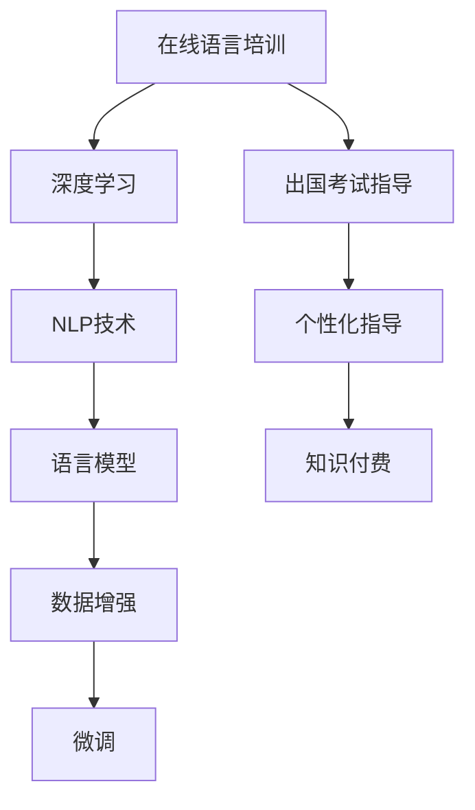

                 

# 如何利用知识付费实现在线语言培训与出国考试指导？

> 关键词：知识付费,在线语言培训,出国考试指导,深度学习,自然语言处理,NLP,语言模型,数据增强,微调,Fine-tuning

## 1. 背景介绍

### 1.1 问题由来

随着全球化的加深和国际交流的频繁，掌握一门或多门外语变得越来越重要。无论是为了学术研究、商业合作，还是旅游度假，掌握外语已经成为现代社会的一项必备技能。然而，传统的语言学习方式，如线下面授课程，受地域、时间和成本等因素限制，难以满足日益增长的需求。因此，在线语言培训成为了一个快速发展的市场，为语言学习者提供了更加灵活、便捷、高效的学习途径。

在在线语言培训中，传统的教学方式已经不能满足市场需求。许多语言学习者希望能够通过计算机化的工具和平台，进行自主学习和实时反馈，从而提升学习效率。同时，越来越多的出国考试（如托福、雅思、GRE、GMAT等）也需要考生具备更高的英语水平，这也催生了对高效、精准的出国考试指导服务的需求。

### 1.2 问题核心关键点

本文将探讨如何利用知识付费模式，结合先进的深度学习技术和自然语言处理(NLP)技术，实现在线语言培训与出国考试指导。具体而言，我们将介绍以下关键点：

1. 如何构建高效的语言模型，以提升语言培训效果。
2. 如何设计智能的出国考试指导系统，提供个性化考试指导。
3. 如何通过数据增强和微调技术，提升模型在特定任务上的表现。
4. 如何利用知识付费模式，实现服务的规模化部署和市场化运营。

这些核心关键点将帮助我们深入理解在线语言培训和出国考试指导的实现机制，并提出切实可行的技术解决方案。

## 2. 核心概念与联系

### 2.1 核心概念概述

为了更好地理解利用知识付费实现在线语言培训与出国考试指导的技术路径，我们先介绍几个核心概念：

- 在线语言培训：指通过计算机辅助和互联网技术，提供语言学习资源、互动教学和自我评估等服务的在线教育模式。
- 深度学习：一种模拟人脑神经网络的计算模型，通过多层次的特征提取和抽象，实现对复杂数据的高效处理。
- 自然语言处理（NLP）：研究计算机如何理解、处理和生成自然语言的学科，涵盖语音识别、文本分类、机器翻译等多个方向。
- 语言模型：用于预测文本序列的概率分布，是NLP中的重要工具。常见的语言模型包括LM1-8、RNN语言模型、LSTM语言模型、Transformer语言模型等。
- 数据增强：通过增加训练数据的多样性，提升模型的泛化能力，避免过拟合。
- 微调（Fine-tuning）：在大规模预训练模型的基础上，利用少量标注数据进行有监督学习，优化模型在特定任务上的性能。

这些概念之间的逻辑关系可以通过以下Mermaid流程图来展示：



这个流程图展示了几类核心概念及其之间的关系：

1. 在线语言培训依赖于深度学习和NLP技术，利用语言模型和大规模数据进行训练，提升教学效果。
2. 数据增强和微调技术用于提升语言模型的泛化能力和特定任务的表现。
3. 出国考试指导系统结合语言模型和个性化指导技术，提供精准的考试准备指导。
4. 知识付费模式实现服务的商业化和规模化运营。

这些概念共同构成了在线语言培训和出国考试指导的技术框架，帮助我们构建高效、智能、可规模化的在线服务平台。

## 3. 核心算法原理 & 具体操作步骤
### 3.1 算法原理概述

在线语言培训和出国考试指导的核心算法原理主要包括以下几个方面：

- **深度学习模型**：使用深度神经网络模型，如卷积神经网络（CNN）、循环神经网络（RNN）、长短期记忆网络（LSTM）、Transformer等，对输入的语言数据进行特征提取和处理。
- **自然语言处理（NLP）技术**：通过分词、词性标注、句法分析、语义分析等技术，对文本数据进行结构化处理，提取有用的语义信息。
- **语言模型**：通过统计语言模型、神经网络语言模型、Transformer语言模型等，对文本序列进行概率建模，预测下一个单词或单词序列的概率。
- **数据增强**：通过对原始文本进行改写、回译、词义替换等操作，生成更多的训练数据，增强模型的泛化能力。
- **微调（Fine-tuning）**：在大规模预训练模型的基础上，利用少量标注数据进行有监督学习，优化模型在特定任务上的性能。

### 3.2 算法步骤详解

在线语言培训和出国考试指导的算法步骤主要包括：

1. **数据准备**：收集和整理用于语言培训和考试指导的语料库，包括课程讲义、文本资料、考试题目等。
2. **模型预训练**：使用大规模无标注数据对深度学习模型进行预训练，使其具备基本的语言理解和生成能力。
3. **数据增强**：对收集到的语料库进行数据增强处理，生成更多的训练数据，增强模型的泛化能力。
4. **微调**：利用少量标注数据对预训练模型进行微调，优化模型在特定任务上的性能，如语言翻译、文本分类、句子生成等。
5. **服务部署**：将微调后的模型部署到在线服务平台，提供语言培训和考试指导服务。
6. **用户反馈**：收集用户的反馈数据，用于模型更新和优化。

### 3.3 算法优缺点

在线语言培训和出国考试指导的算法有以下优点和缺点：

#### 优点

- **高效性**：深度学习模型和自然语言处理技术可以高效地处理大规模语料库，提升教学效果和考试指导的精准度。
- **灵活性**：微调技术可以根据不同的任务和需求，快速调整模型参数，提供个性化的服务。
- **可扩展性**：数据增强技术可以生成更多的训练数据，提高模型的泛化能力，适应多样化的语言场景。

#### 缺点

- **数据需求**：微调和数据增强需要大量的标注数据和高质量的语料库，成本较高。
- **计算资源**：深度学习模型和自然语言处理技术需要高性能的计算资源，如GPU、TPU等，初期投资较大。
- **模型复杂度**：模型参数量庞大，训练和推理复杂度较高，需要专业的技术团队进行维护和优化。

### 3.4 算法应用领域

在线语言培训和出国考试指导的算法应用领域广泛，涵盖以下多个方面：

- **在线英语培训**：利用深度学习模型和自然语言处理技术，提供个性化的英语学习资源和互动教学。
- **出国考试准备**：通过微调技术，构建智能的出国考试指导系统，提供个性化的考试准备方案。
- **多语言翻译**：利用语言模型和翻译技术，实现多语言之间的自动翻译和互译。
- **智能问答系统**：构建智能问答系统，为用户提供实时语言学习和考试指导。
- **文本生成**：利用语言模型生成符合语法和语义规范的文本，如对话生成、文章生成等。

## 4. 数学模型和公式 & 详细讲解 & 举例说明
### 4.1 数学模型构建

在线语言培训和出国考试指导的数学模型主要基于深度学习技术和自然语言处理技术构建。以文本分类任务为例，其数学模型可以表示为：

$$
P(w_t|w_{t-1}, \theta) = \frac{e^{w_t \cdot w_{t-1}^T \cdot \theta}}{\sum_{w} e^{w \cdot w_{t-1}^T \cdot \theta}}
$$

其中，$w_t$ 表示第 $t$ 个单词，$\theta$ 为模型参数，$P(w_t|w_{t-1}, \theta)$ 表示给定前一个单词 $w_{t-1}$ 的情况下，单词 $w_t$ 的概率分布。

### 4.2 公式推导过程

以Transformer模型为例，其核心部分是自注意力机制（Self-Attention Mechanism）。自注意力机制的公式推导过程如下：

$$
\text{Attention}(Q, K, V) = \text{softmax}(QK^T/\sqrt{d_k})V
$$

其中，$Q$、$K$、$V$ 分别表示查询向量、键向量和值向量，$d_k$ 表示向量维度。通过计算查询向量与键向量的点积，并除以 $\sqrt{d_k}$，得到注意力权重，从而加权计算输出向量。

### 4.3 案例分析与讲解

假设我们要训练一个简单的二分类模型，输入为一段文本 $x$，输出为分类标签 $y$。其模型公式可以表示为：

$$
\hat{y} = \text{sigmoid}(x \cdot \theta)
$$

其中，$\hat{y}$ 表示模型的预测结果，$\theta$ 为模型参数，$x$ 为输入文本。

我们首先使用大规模无标注数据对模型进行预训练，然后使用少量标注数据进行微调。预训练的目的是让模型学习通用的语言表示，微调的目的是让模型适应特定的任务，提升模型的准确性。

## 5. 项目实践：代码实例和详细解释说明
### 5.1 开发环境搭建

在线语言培训和出国考试指导的开发环境搭建主要包括：

- **Python 环境**：使用 Python 3.8 及以上版本，确保与深度学习库的兼容性。
- **深度学习库**：安装 TensorFlow、PyTorch、Keras 等深度学习库，用于构建和训练模型。
- **自然语言处理库**：安装 NLTK、spaCy、TextBlob 等 NLP 库，用于处理文本数据。
- **知识付费平台**：选择已有的知识付费平台，如知乎、腾讯课堂、网易云课堂等，进行服务部署。

### 5.2 源代码详细实现

以英语培训为例，代码实现过程如下：

```python
import tensorflow as tf
import tensorflow_datasets as tfds
import tensorflow_text as text

# 加载数据集
train_dataset, test_dataset = tfds.load('english_ted_talks', split=['train', 'test'], as_supervised=True)

# 定义模型
model = tf.keras.Sequential([
    text.TextVectorization(max_tokens=256),
    tf.keras.layers.Embedding(input_dim=vocab_size, output_dim=128, mask_zero=True),
    tf.keras.layers.LSTM(128, return_sequences=True),
    tf.keras.layers.LSTM(128),
    tf.keras.layers.Dense(2, activation='softmax')
])

# 编译模型
model.compile(optimizer=tf.keras.optimizers.Adam(learning_rate=0.001),
              loss='sparse_categorical_crossentropy',
              metrics=['accuracy'])

# 训练模型
model.fit(train_dataset.batch(32), epochs=10)

# 评估模型
model.evaluate(test_dataset.batch(32))
```

### 5.3 代码解读与分析

以上代码实现了基于 LSTM 的英语培训模型。其中，`tf.keras` 库用于构建和训练深度学习模型，`text.TextVectorization` 和 `tf.keras.layers.Embedding` 用于处理文本数据和构建词嵌入层，`tf.keras.layers.LSTM` 用于构建 LSTM 层，`tf.keras.layers.Dense` 用于构建输出层。

模型训练使用 `model.fit` 方法，通过指定数据集、批大小和迭代轮数等参数进行训练。模型评估使用 `model.evaluate` 方法，通过指定测试集进行评估，输出准确率等指标。

## 6. 实际应用场景
### 6.1 在线英语培训

在线英语培训可以结合知识付费模式，提供个性化的英语学习资源和互动教学。用户可以自主选择课程内容，通过在线平台进行学习，实时获取反馈和指导。

- **课程内容**：包括语法、词汇、听力和口语练习等，通过视频、文本和音频等多种形式呈现。
- **互动教学**：利用自然语言处理技术，实现智能问答和互动讨论，提升学习效果。
- **个性化推荐**：通过用户行为数据和学习进度，推荐适合用户的课程和学习资源。

### 6.2 出国考试准备

出国考试指导系统可以结合知识付费模式，提供个性化的考试准备方案，帮助考生提高考试成绩。

- **考试题库**：收集和整理各类出国考试的题目和答案，构建完整的题库。
- **智能分析**：利用自然语言处理技术，对考生答案进行智能分析，指出错误点和改进建议。
- **模拟测试**：通过微调技术，构建智能的考试模拟系统，提供实时测试和反馈。
- **个性化指导**：根据考生情况，提供个性化的考试准备方案，如单词背诵、语法练习、解题技巧等。

### 6.3 多语言翻译

多语言翻译可以结合知识付费模式，提供高质量的语言翻译服务，帮助用户实现语言互通。

- **翻译引擎**：利用深度学习模型和自然语言处理技术，构建高质量的翻译引擎。
- **实时翻译**：通过微调技术，提升翻译引擎的实时性，实现实时翻译和互译。
- **用户需求**：收集用户需求，不断优化翻译引擎的性能和用户体验。

### 6.4 未来应用展望

随着技术的不断进步，在线语言培训和出国考试指导将呈现以下几个发展趋势：

1. **多模态学习**：结合图像、视频等多种模态数据，提升语言模型的泛化能力，实现更加全面的语言理解和生成。
2. **交互式教学**：利用智能问答系统和聊天机器人，实现更加互动和个性化的语言教学。
3. **情感分析**：通过情感分析技术，实时监测用户学习情绪，提供心理疏导和情感支持。
4. **虚拟教师**：利用深度学习技术，构建虚拟教师，提供全天候的个性化语言教学服务。

## 7. 工具和资源推荐
### 7.1 学习资源推荐

为了帮助开发者深入理解在线语言培训和出国考试指导的实现机制，推荐以下学习资源：

1. **深度学习与自然语言处理**：由李宏毅教授讲授的在线课程，涵盖深度学习、自然语言处理等多个方向。
2. **TensorFlow官方文档**：提供详细的TensorFlow库使用指南和样例代码，帮助开发者掌握深度学习框架的使用。
3. **NLP与Python**：介绍NLP基础知识和Python实现，适合入门和进阶学习。
4. **Kaggle竞赛**：通过参与NLP相关的Kaggle竞赛，提升模型构建和数据处理能力。
5. **在线学习平台**：如Coursera、edX、Udacity等，提供NLP相关的在线课程和项目实战机会。

### 7.2 开发工具推荐

在线语言培训和出国考试指导的开发工具推荐如下：

1. **PyTorch**：灵活的深度学习框架，适合快速迭代和研究。
2. **TensorFlow**：功能强大的深度学习框架，适合大规模工程应用。
3. **NLTK**：自然语言处理工具包，适合文本处理和语言模型构建。
4. **spaCy**：自然语言处理库，适合快速开发和部署。
5. **TextBlob**：文本处理库，支持词性标注、情感分析等功能。

### 7.3 相关论文推荐

在线语言培训和出国考试指导的相关论文推荐如下：

1. **Attention Is All You Need**：Transformer模型的经典论文，展示了自注意力机制的强大能力。
2. **BERT: Pre-training of Deep Bidirectional Transformers for Language Understanding**：BERT模型的经典论文，展示了预训练语言模型的重要性和泛化能力。
3. **AdaLoRA: Adaptive Low-Rank Adaptation for Parameter-Efficient Fine-Tuning**：介绍AdaLoRA方法，展示了参数高效微调的可行性。
4. **Adaptive Parameterization for Low-Rank Adapters**：介绍Adaptive Parameterization方法，展示了参数高效微调的有效性。
5. **A Survey on Knowledge-Driven Machine Translation**：介绍了知识增强翻译的研究现状和未来方向。

## 8. 总结：未来发展趋势与挑战
### 8.1 研究成果总结

本文详细探讨了利用知识付费实现在线语言培训与出国考试指导的技术实现。通过深度学习、自然语言处理等技术，我们构建了高效的语言模型和智能的考试指导系统，提升了语言培训和考试准备的个性化和智能化水平。

### 8.2 未来发展趋势

未来在线语言培训和出国考试指导将呈现以下几个发展趋势：

1. **多模态学习**：结合图像、视频等多种模态数据，提升语言模型的泛化能力，实现更加全面的语言理解和生成。
2. **交互式教学**：利用智能问答系统和聊天机器人，实现更加互动和个性化的语言教学。
3. **情感分析**：通过情感分析技术，实时监测用户学习情绪，提供心理疏导和情感支持。
4. **虚拟教师**：利用深度学习技术，构建虚拟教师，提供全天候的个性化语言教学服务。

### 8.3 面临的挑战

在线语言培训和出国考试指导面临以下挑战：

1. **数据需求**：微调和数据增强需要大量的标注数据和高质量的语料库，成本较高。
2. **计算资源**：深度学习模型和自然语言处理技术需要高性能的计算资源，如GPU、TPU等，初期投资较大。
3. **模型复杂度**：模型参数量庞大，训练和推理复杂度较高，需要专业的技术团队进行维护和优化。
4. **用户体验**：需要不断优化用户体验，提升服务的易用性和满意度。

### 8.4 研究展望

为了应对这些挑战，未来的研究需要在以下几个方面进行探索：

1. **数据生成技术**：开发更加高效的数据生成方法，降低对标注数据的依赖，提升模型的泛化能力。
2. **模型优化技术**：探索参数高效和计算高效的微调方法，降低模型复杂度，提高推理效率。
3. **用户交互设计**：结合用户行为数据和情感分析，提升用户交互体验，提供个性化的服务。
4. **知识库整合**：将符号化的先验知识与神经网络模型结合，增强模型的知识和推理能力。

这些研究方向将进一步提升在线语言培训和出国考试指导的性能和用户体验，推动人工智能技术在教育领域的应用。

## 9. 附录：常见问题与解答

**Q1: 在线语言培训和出国考试指导的算法流程是怎样的？**

A: 在线语言培训和出国考试指导的算法流程主要包括以下几个步骤：

1. **数据准备**：收集和整理用于语言培训和考试指导的语料库，包括课程讲义、文本资料、考试题目等。
2. **模型预训练**：使用大规模无标注数据对深度学习模型进行预训练，使其具备基本的语言理解和生成能力。
3. **数据增强**：对收集到的语料库进行数据增强处理，生成更多的训练数据，增强模型的泛化能力。
4. **微调**：利用少量标注数据对预训练模型进行微调，优化模型在特定任务上的性能，如语言翻译、文本分类、句子生成等。
5. **服务部署**：将微调后的模型部署到在线服务平台，提供语言培训和考试指导服务。
6. **用户反馈**：收集用户的反馈数据，用于模型更新和优化。

**Q2: 在线语言培训和出国考试指导的主要技术难点是什么？**

A: 在线语言培训和出国考试指导的主要技术难点包括：

1. **数据需求**：微调和数据增强需要大量的标注数据和高质量的语料库，成本较高。
2. **计算资源**：深度学习模型和自然语言处理技术需要高性能的计算资源，如GPU、TPU等，初期投资较大。
3. **模型复杂度**：模型参数量庞大，训练和推理复杂度较高，需要专业的技术团队进行维护和优化。

**Q3: 在线语言培训和出国考试指导的常见应用场景有哪些？**

A: 在线语言培训和出国考试指导的常见应用场景包括：

1. **在线英语培训**：利用深度学习模型和自然语言处理技术，提供个性化的英语学习资源和互动教学。
2. **出国考试准备**：通过微调技术，构建智能的出国考试指导系统，提供个性化的考试准备方案。
3. **多语言翻译**：利用深度学习模型和自然语言处理技术，提供高质量的语言翻译服务，帮助用户实现语言互通。
4. **智能问答系统**：构建智能问答系统，为用户提供实时语言学习和考试指导。
5. **文本生成**：利用语言模型生成符合语法和语义规范的文本，如对话生成、文章生成等。

**Q4: 如何提升在线语言培训和出国考试指导的用户体验？**

A: 提升在线语言培训和出国考试指导的用户体验可以从以下几个方面入手：

1. **个性化推荐**：通过用户行为数据和学习进度，推荐适合用户的课程和学习资源。
2. **互动教学**：利用智能问答系统和聊天机器人，实现更加互动和个性化的语言教学。
3. **实时反馈**：通过智能分析技术，实时监测用户学习进度，提供及时反馈和指导。
4. **多模态学习**：结合图像、视频等多种模态数据，提升语言模型的泛化能力，实现更加全面的语言理解和生成。
5. **情感分析**：通过情感分析技术，实时监测用户学习情绪，提供心理疏导和情感支持。

**Q5: 在线语言培训和出国考试指导的未来发展方向是什么？**

A: 在线语言培训和出国考试指导的未来发展方向包括：

1. **多模态学习**：结合图像、视频等多种模态数据，提升语言模型的泛化能力，实现更加全面的语言理解和生成。
2. **交互式教学**：利用智能问答系统和聊天机器人，实现更加互动和个性化的语言教学。
3. **情感分析**：通过情感分析技术，实时监测用户学习情绪，提供心理疏导和情感支持。
4. **虚拟教师**：利用深度学习技术，构建虚拟教师，提供全天候的个性化语言教学服务。

这些发展方向将进一步提升在线语言培训和出国考试指导的性能和用户体验，推动人工智能技术在教育领域的应用。

---

作者：禅与计算机程序设计艺术 / Zen and the Art of Computer Programming

