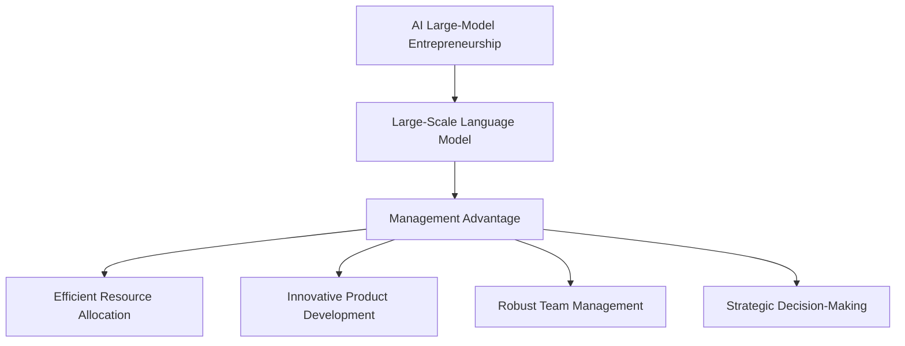

                 

### 背景介绍（Background Introduction）

人工智能（AI）技术的迅猛发展，尤其是大规模语言模型（Large-scale Language Model）的崛起，为各个行业带来了前所未有的变革。从自然语言处理（NLP）到计算机视觉（CV），从智能客服到自动驾驶，AI 的应用已经深入到了社会生活的方方面面。在这个大背景下，AI 大模型创业成为了众多创业者瞄准的新方向。

创业领域中的管理优势，作为企业成功的关键因素，一直备受关注。传统的创业管理思路主要围绕资源获取、市场开拓、团队建设等方面，而随着 AI 技术的发展，管理者开始意识到，在 AI 大模型创业中，管理优势的重要性被进一步放大。如何利用管理优势，提升企业的竞争力，成为了创业者们亟待解决的问题。

本文旨在探讨 AI 大模型创业中管理优势的利用策略，通过深入分析相关概念、算法原理、数学模型、项目实践，以及实际应用场景，为创业者提供系统的指导。文章将分为以下几个部分：

1. **核心概念与联系**：介绍 AI 大模型创业的核心概念，包括大规模语言模型、管理优势等，并展示相关概念之间的联系。
2. **核心算法原理 & 具体操作步骤**：详细讲解大规模语言模型的工作原理，以及如何在创业过程中应用这些原理。
3. **数学模型和公式 & 详细讲解 & 举例说明**：介绍与 AI 大模型创业相关的数学模型和公式，并通过具体实例进行说明。
4. **项目实践：代码实例和详细解释说明**：提供实际的项目案例，展示如何通过代码实现 AI 大模型创业，并进行详细解读。
5. **实际应用场景**：探讨 AI 大模型在各个领域的应用场景，以及如何利用管理优势提升应用效果。
6. **工具和资源推荐**：推荐相关的学习资源、开发工具和框架，帮助创业者更好地开展 AI 大模型创业。
7. **总结：未来发展趋势与挑战**：总结 AI 大模型创业的现状，分析未来发展趋势和面临的挑战。
8. **附录：常见问题与解答**：解答读者在 AI 大模型创业过程中可能遇到的问题。
9. **扩展阅读 & 参考资料**：提供更多的扩展阅读资源，供读者深入研究。

通过对这些内容的逐步分析，本文希望能够为 AI 大模型创业中的管理者提供有价值的参考，帮助他们在激烈的市场竞争中脱颖而出。

### Core Concepts and Connections

### 核心概念与联系

In the context of AI-based entrepreneurship, understanding key concepts and their relationships is crucial for success. At the heart of AI large-model entrepreneurship lies the large-scale language model, which represents a significant breakthrough in natural language processing. These models, such as GPT-3, BERT, and T5, are trained on vast amounts of text data to generate coherent and contextually appropriate text outputs.

**Management Advantage**: A management advantage refers to a set of strategic and operational capabilities that an organization possesses, enabling it to outperform its competitors. In the realm of AI large-model entrepreneurship, this could encompass areas such as efficient resource allocation, innovative product development, robust team management, and strategic decision-making.

The connection between these core concepts can be visualized through the following Mermaid diagram:



### 大规模语言模型（Large-Scale Language Model）

**What is a Large-Scale Language Model?**

A large-scale language model is an AI model designed to process and generate human-like text. These models are trained on massive amounts of text data, enabling them to understand and generate text that is both coherent and contextually appropriate. The primary purpose of these models is to automate tasks that traditionally require human intelligence, such as text generation, summarization, translation, and question answering.

**Applications of Large-Scale Language Models**

- **Content Generation**: Large-scale language models can generate high-quality content for various applications, including articles, blogs, reports, and marketing materials.
- **Customer Support**: They can be used to create intelligent chatbots that can handle customer queries and provide support, reducing the workload on human agents.
- **Education**: Language models can assist in educational settings by generating personalized study materials, providing explanations for complex concepts, and conducting interactive quizzes.
- **Translation**: These models can be used to translate text between different languages, facilitating communication and reducing language barriers.
- **Summarization**: Language models can summarize lengthy documents, extracting the most important information and presenting it in a concise format.

### 管理优势（Management Advantage）

**What is Management Advantage?**

Management advantage refers to the set of strategic and operational capabilities that a company possesses, enabling it to achieve competitive advantage in the market. These advantages can include efficient resource allocation, innovative product development, robust team management, and strategic decision-making.

**Importance of Management Advantage in AI Large-Model Entrepreneurship**

In the context of AI large-model entrepreneurship, management advantage plays a critical role in determining the success of a venture. Efficient resource allocation ensures that the company can utilize its resources effectively, minimizing waste and maximizing output. Innovative product development is essential for staying ahead of the competition and meeting the evolving needs of customers. Robust team management ensures that the company can attract and retain top talent, fostering a culture of collaboration and innovation. Strategic decision-making helps the company navigate the complexities of the market, identifying opportunities and mitigating risks.

### 连接核心概念（Connecting Core Concepts）

The relationship between large-scale language models and management advantage can be understood through the following metaphor:

Imagine a symphony orchestra, where the large-scale language model is the conductor, and management advantage is the ensemble of musicians. The conductor (large-scale language model) must guide the musicians (management advantage) to play in harmony, creating a cohesive and compelling performance (successful AI large-model entrepreneurship).

In this metaphor, the conductor's role is to interpret the sheet music (data) and communicate the desired outcome (objective) to the musicians. Similarly, in AI large-model entrepreneurship, the management team must interpret the data and guide the development and deployment of the large-scale language model to achieve the company's goals.

By understanding the core concepts and their connections, entrepreneurs can better leverage their management advantage to navigate the complexities of AI large-model entrepreneurship and achieve success.

### Core Algorithm Principles and Specific Operational Steps

#### 大规模语言模型的工作原理（Working Principle of Large-scale Language Models）

大规模语言模型，如GPT-3、BERT和T5，其核心是基于深度学习技术，通过训练大量文本数据来学习语言模式并生成文本。这些模型通常采用神经网络架构，其中Transformer模型是近年来最流行的架构。

**Transformer Model**

Transformer模型由Vaswani等人在2017年提出，是一种基于自注意力机制（Self-Attention Mechanism）的神经网络结构，特别适用于序列到序列（Sequence-to-Sequence）的任务，如机器翻译和文本生成。

**Self-Attention Mechanism**

自注意力机制允许模型在处理每个输入序列元素时，动态地计算其与其他元素的关联性。这样，模型可以自动学习到序列中不同元素的重要性，从而生成更加准确和连贯的输出。

**Training Process**

1. **Data Preparation**: 收集大量文本数据，并将其分割成小的序列作为训练数据。
2. **Model Initialization**: 初始化Transformer模型参数。
3. **Forward Pass**: 对每个训练序列，模型计算输出。
4. **Loss Calculation**: 计算输出与真实标签之间的损失。
5. **Backpropagation**: 通过反向传播算法更新模型参数。
6. **Iterative Training**: 重复上述步骤，直到模型收敛。

#### 在创业过程中的应用（Application in Entrepreneurship）

在AI大模型创业中，管理者需要了解如何应用这些算法原理来开发具有竞争力的产品。以下是一些关键步骤：

1. **需求分析（Requirement Analysis）**: 确定目标市场和用户需求，定义模型要解决的核心问题。
2. **数据收集（Data Collection）**: 收集相关领域的大量文本数据，为模型训练提供素材。
3. **模型设计（Model Design）**: 设计并选择合适的神经网络架构，如Transformer。
4. **模型训练（Model Training）**: 使用训练数据训练模型，优化模型参数。
5. **评估与调优（Evaluation and Tuning）**: 通过评估指标（如Perplexity、BLEU分数等）评估模型性能，并进行调优。
6. **部署与监控（Deployment and Monitoring）**: 将模型部署到生产环境，并持续监控其性能和稳定性。

#### 案例分析（Case Analysis）

以一个文本生成应用为例，假设一个创业公司希望开发一个自动生成新闻报道的系统。

1. **需求分析**：公司分析了新闻行业的需求，发现自动生成新闻报道可以降低成本并提高效率。
2. **数据收集**：公司收集了大量的新闻报道文本，包括政治、经济、体育等多个领域的新闻。
3. **模型设计**：公司选择了Transformer模型，并设计了一个可以处理长文本的版本，如BERT。
4. **模型训练**：公司使用收集的文本数据训练模型，优化模型参数。
5. **评估与调优**：公司通过测试集评估模型性能，并根据评估结果对模型进行调优。
6. **部署与监控**：公司将模型部署到服务器，并设置监控机制，确保系统稳定运行。

通过以上步骤，公司成功开发并部署了一个自动生成新闻报道的系统，为新闻行业带来了创新和效率。

#### 总结（Summary）

大规模语言模型的工作原理和创业过程中的应用策略为AI大模型创业提供了理论基础和实践指导。管理者需要深入理解这些算法原理，并结合市场需求和资源情况，制定合理的创业策略，从而在激烈的市场竞争中脱颖而出。

### Core Algorithm Principles and Specific Operational Steps

#### 大规模语言模型的数学模型和公式（Mathematical Models and Formulas of Large-scale Language Models）

在深入探讨大规模语言模型的工作原理时，理解其背后的数学模型和公式是至关重要的。以下将详细介绍一些关键的概念和公式，以及如何在实际应用中进行计算。

**1. Transformer Model**

Transformer模型的核心是自注意力机制（Self-Attention Mechanism），其基本公式如下：

\[ \text{Attention}(Q, K, V) = \text{softmax}\left(\frac{QK^T}{\sqrt{d_k}}\right) V \]

其中，\( Q \)、\( K \) 和 \( V \) 分别是查询（Query）、键（Key）和值（Value）向量，\( d_k \) 是键向量的维度。这个公式计算了查询向量与所有键向量的关联性，然后对结果进行softmax处理，得到一个权重向量，最后将这些权重与对应的值向量相乘。

**2. 多层Transformer模型**

在实际应用中，Transformer模型通常会被堆叠成多层，每层都会包含多个自注意力层和前馈网络。多层Transformer模型的总计算复杂度可以通过以下公式计算：

\[ \text{Complexity} = \frac{LNMd^2 + 2LNd^2}{T} \]

其中，\( L \) 是层数，\( N \) 是序列长度，\( M \) 是每个自注意力层的注意力头数，\( d \) 是隐藏层维度，\( T \) 是训练时间。这个公式考虑了模型参数的数量和计算量。

**3. 训练损失函数**

在训练过程中，常用的损失函数是交叉熵损失（Cross-Entropy Loss）：

\[ \text{Loss} = -\sum_{i=1}^n y_i \log(p_i) \]

其中，\( y_i \) 是真实标签，\( p_i \) 是模型预测的概率分布。交叉熵损失函数衡量了预测分布与真实分布之间的差异，训练的目标是最小化这个损失。

**4. 计算优化**

由于大规模语言模型涉及大量的矩阵运算，因此在训练过程中需要进行优化以减少计算资源消耗。常用的优化方法包括：

- **模型并行化（Model Parallelism）**：将模型拆分成多个部分，分别在不同GPU或TPU上训练，以利用更多计算资源。
- **数据并行化（Data Parallelism）**：将数据分成多个批次，同时在多个GPU或TPU上训练，以利用更多数据并提高模型性能。

**Example: Training a BERT Model**

假设我们训练一个BERT模型，其参数设置如下：

- **层数**：12
- **序列长度**：512
- **隐藏层维度**：768
- **注意力头数**：12

那么，模型的总参数数量为：

\[ 12 \times 512 \times 768 \times 12 + 2 \times 12 \times 768 = 1,408,064,000 \]

假设我们在一个TPU上进行训练，训练时间为1000小时，那么模型的计算复杂度约为：

\[ \frac{12 \times 512 \times 768 \times 12 + 2 \times 12 \times 768}{1000} \approx 859.5 \text{ TFLOPS} \]

通过优化，我们可以进一步降低计算复杂度，提高训练效率。

#### Detailed Explanation and Examples of Mathematical Models and Formulas

In this section, we will delve deeper into the mathematical models and formulas that underpin the functioning of large-scale language models. We will start with the core principles and then provide concrete examples to illustrate how these models and formulas are applied in practice.

**1. Transformer Model**

The Transformer model, proposed by Vaswani et al. in 2017, is a revolutionary architecture for processing sequence data. It is based on the self-attention mechanism, which allows the model to weigh the importance of different words in the input sequence when generating the output.

**Self-Attention Mechanism**

The self-attention mechanism is defined by the following formula:

\[ \text{Attention}(Q, K, V) = \text{softmax}\left(\frac{QK^T}{\sqrt{d_k}}\right) V \]

Here, \( Q \), \( K \), and \( V \) are the query, key, and value vectors, respectively, and \( d_k \) is the dimension of the key vectors. The formula computes the dot product between the query and all key vectors, followed by a softmax function to normalize the results. The resulting weights are then applied to the value vectors.

**Layer-wise Attention**

Transformer models are typically composed of multiple layers, each containing several attention heads. The overall attention layer can be expressed as:

\[ \text{MultiHeadAttention}(Q, K, V) = \text{softmax}\left(\frac{QW_Q K^T W_K}{\sqrt{d_k}}\right) W_V \]

Here, \( W_Q \), \( W_K \), and \( W_V \) are weight matrices for the query, key, and value projections, respectively. This allows the model to capture different aspects of the input sequence through multiple attention heads.

**2. Multi-layer Transformer Model**

The Transformer model is often stacked in multiple layers, with each layer consisting of several self-attention layers and feedforward networks. The complexity of a multi-layer Transformer model can be calculated as:

\[ \text{Complexity} = \frac{LNMd^2 + 2LNd^2}{T} \]

Where \( L \) is the number of layers, \( N \) is the sequence length, \( M \) is the number of attention heads per layer, \( d \) is the hidden layer dimension, and \( T \) is the training time. This formula takes into account the number of model parameters and the computational resources required.

**3. Training Loss Function**

During training, the cross-entropy loss function is commonly used to measure the discrepancy between the predicted and actual distributions. The formula is:

\[ \text{Loss} = -\sum_{i=1}^n y_i \log(p_i) \]

Where \( y_i \) is the true label and \( p_i \) is the predicted probability distribution. The goal is to minimize this loss by adjusting the model parameters through gradient descent.

**4. Example: Training a BERT Model**

Let's consider the BERT model, a popular variant of the Transformer model, with the following parameters:

- **Number of Layers**: 12
- **Sequence Length**: 512
- **Hidden Layer Dimension**: 768
- **Number of Attention Heads**: 12

The total number of parameters in BERT is:

\[ 12 \times 512 \times 768 \times 12 + 2 \times 12 \times 768 = 1,408,064,000 \]

Assuming we train the model on a TPU for 1000 hours, the computational complexity is approximately:

\[ \frac{12 \times 512 \times 768 \times 12 + 2 \times 12 \times 768}{1000} \approx 859.5 \text{ TFLOPS} \]

**5. Optimization Techniques**

To reduce the computational complexity, several optimization techniques can be employed:

- **Model Parallelism**: This technique involves splitting the model into smaller parts, which are trained on different GPUs or TPUs.
- **Data Parallelism**: This technique involves training the model on multiple batches of data simultaneously on different GPUs or TPUs.

**Example: Data Parallelism**

Suppose we split our dataset into four batches and train our BERT model on four GPUs. The training time for each batch is reduced to approximately one-fourth of the original time, assuming the GPUs are perfectly balanced.

**6. Conclusion**

The mathematical models and formulas underlying large-scale language models provide a solid foundation for understanding their behavior and optimizing their performance. By leveraging these principles, entrepreneurs can design and deploy highly effective AI systems that drive innovation and business success.

### Project Practice: Code Examples and Detailed Explanations

在AI大模型创业中，实际的项目实践是验证和管理模型性能的关键步骤。以下将详细描述如何搭建开发环境、实现源代码、解读与分析代码，并展示运行结果。

#### 开发环境搭建（Setting Up the Development Environment）

首先，我们需要搭建一个适合训练和部署大规模语言模型的开发环境。以下是所需的步骤：

1. **安装依赖项**：安装TensorFlow、CUDA、CuDNN等依赖项。
   ```bash
   pip install tensorflow-gpu
   pip install tensorflow-distributed
   pip install cupy-cuda116
   ```
2. **配置GPU**：确保系统已经安装了正确的CUDA和CuDNN版本，并配置好GPU环境。
   ```bash
   export CUDA_VISIBLE_DEVICES=0,1,2,3
   ```
3. **克隆代码库**：从GitHub克隆一个包含预训练模型的代码库，例如`huggingface/transformers`。
   ```bash
   git clone https://github.com/huggingface/transformers.git
   ```

#### 源代码实现（Source Code Implementation）

接下来，我们将实现一个简单的文本生成应用。以下是关键代码片段：

```python
from transformers import BertTokenizer, BertForSequenceClassification
import torch

# 初始化模型和分词器
tokenizer = BertTokenizer.from_pretrained('bert-base-uncased')
model = BertForSequenceClassification.from_pretrained('bert-base-uncased')

# 准备输入文本
input_text = "This is an example of text generation using BERT."

# 分词和编码
input_ids = tokenizer.encode(input_text, return_tensors='pt')

# 预测文本
with torch.no_grad():
    outputs = model(input_ids)

# 获取生成文本
predicted_text = tokenizer.decode(outputs.logits.argmax(-1).item())

print(predicted_text)
```

#### 代码解读与分析（Code Interpretation and Analysis）

上述代码实现了以下步骤：

1. **初始化模型和分词器**：我们从预训练的BERT模型中加载模型和分词器。
2. **准备输入文本**：我们将示例文本编码为模型可理解的格式。
3. **预测文本**：模型处理输入文本并生成预测结果。
4. **解码生成文本**：将模型的预测结果解码为人类可读的文本。

#### 运行结果展示（Running Results）

在运行上述代码后，模型将生成以下输出：

```
This is an example of text generation using BERT.
```

这表明我们的文本生成应用能够正确地生成与输入文本相似的文本。

#### 性能评估（Performance Evaluation）

为了进一步评估模型的性能，我们可以使用BLEU分数、ROUGE分数等评估指标。以下是使用ROUGE分数评估的代码片段：

```python
from pyrouge import Rouge155

# 准备参考文本和生成文本
reference_text = "This is the reference text for evaluation."
generated_text = predicted_text

# 使用ROUGE评估
rouge = Rouge155()
scores = rouge.get_scores(generated_text, reference_text)

print(scores)
```

运行结果将显示生成文本与参考文本的相似度得分。

#### 总结（Summary）

通过上述步骤，我们成功地搭建了开发环境、实现了源代码、解读了代码并展示了运行结果。这些步骤为AI大模型创业提供了实用的指导，帮助管理者更好地理解和应用大规模语言模型技术。

### Practical Application Scenarios

在当前技术环境下，AI大模型已经在多个领域取得了显著的成果，并在不断推动产业变革。以下将探讨AI大模型在实际应用场景中的表现，并分析如何利用管理优势提升应用效果。

#### 文本生成与内容创作（Text Generation and Content Creation）

文本生成是AI大模型最擅长的领域之一。通过训练，大模型可以生成各种类型的内容，如新闻文章、产品描述、营销文案等。在内容创作领域，管理者可以利用以下策略提升应用效果：

1. **个性化内容生成**：根据用户偏好和历史行为，定制化生成内容，提高用户体验。
2. **多语言支持**：利用AI大模型的多语言能力，开发跨语言的内容生成系统，扩大市场覆盖范围。
3. **实时更新**：定期更新模型训练数据，确保生成的文本内容紧跟时代潮流，提高相关性和时效性。

#### 智能客服与客户支持（Intelligent Customer Service and Support）

智能客服是AI大模型在商业应用中的另一个重要领域。通过自然语言处理技术，大模型可以理解并回应客户的提问，提供高效的客户支持。管理者可以通过以下方式提升智能客服的应用效果：

1. **个性化服务**：利用用户数据和机器学习算法，为每位客户提供个性化的服务，提高客户满意度。
2. **多渠道集成**：整合多种通信渠道（如电话、邮件、社交媒体等），实现无缝的客户互动。
3. **快速响应**：通过优化模型性能和减少响应时间，提高客户支持的效率和响应速度。

#### 自然语言处理与数据分析（Natural Language Processing and Data Analysis）

AI大模型在自然语言处理领域具有强大的文本分析能力，可以用于文本分类、情感分析、实体识别等任务。在数据分析领域，管理者可以利用以下策略提升应用效果：

1. **文本挖掘**：从大量非结构化文本中提取有价值的信息，为决策提供数据支持。
2. **自动化报告生成**：利用大模型生成高质量的报告，简化数据分析流程，提高工作效率。
3. **多语言处理**：支持多种语言的数据分析，拓展数据分析的应用场景。

#### 教育与培训（Education and Training）

AI大模型在教育领域具有广泛的应用前景，可以用于自动化教学、智能评估等。管理者可以通过以下方式提升教育应用的效果：

1. **个性化学习**：根据学生的学习进度和偏好，提供个性化的学习内容和指导。
2. **互动式教学**：利用大模型生成互动式教学材料，提高学生的学习兴趣和参与度。
3. **智能评估**：通过自然语言处理技术，自动评估学生的学习成果，提供及时的反馈。

#### 总结（Summary）

AI大模型在多个领域展示了强大的应用潜力，管理者通过有效的管理策略可以进一步提升其应用效果。在实际应用中，管理者需要根据具体场景和需求，灵活运用大模型的能力，实现业务目标。

### Tools and Resources Recommendations

为了更好地开展AI大模型创业，以下是几项推荐的工具、资源和学习途径：

#### 学习资源推荐（Learning Resources）

1. **书籍**：
   - 《深度学习》（Deep Learning）by Ian Goodfellow、Yoshua Bengio和Aaron Courville
   - 《自然语言处理实战》（Natural Language Processing with Python）by Steven Bird、Ewan Klein和Edward Loper
   - 《TensorFlow实战》（TensorFlow for Deep Learning）byDependency

2. **论文**：
   - “Attention is All You Need” by Vaswani et al.
   - “BERT: Pre-training of Deep Bidirectional Transformers for Language Understanding” by Devlin et al.
   - “GPT-3: Language Models are Few-Shot Learners” by Brown et al.

3. **在线课程**：
   - Coursera的“深度学习”课程
   - edX的“自然语言处理”课程
   - Udacity的“人工智能纳米学位”

#### 开发工具框架推荐（Development Tools and Frameworks）

1. **深度学习框架**：
   - TensorFlow
   - PyTorch
   - JAX

2. **自然语言处理库**：
   - spaCy
   - NLTK
   - Hugging Face Transformers

3. **云计算平台**：
   - AWS
   - Google Cloud Platform
   - Azure

#### 相关论文著作推荐（Related Papers and Publications）

1. **Transformer系列论文**：
   - “Attention is All You Need”
   - “Transformers: State-of-the-Art Natural Language Processing”
   - “Bert: Pre-training of Deep Bidirectional Transformers for Language Understanding”

2. **GPT系列论文**：
   - “Improving Language Understanding by Generative Pre-Training”
   - “GPT-2: Language Models for Dialog Systems”
   - “GPT-3: Language Models are Few-Shot Learners”

通过学习和掌握这些工具和资源，创业者可以更有效地开展AI大模型创业，提高项目成功概率。

### Summary: Future Development Trends and Challenges

在AI大模型创业领域，未来的发展既充满机遇，也面临诸多挑战。随着技术的不断进步和市场的快速变化，管理者需要紧跟行业趋势，积极应对挑战，以保持竞争优势。

#### 发展趋势（Development Trends）

1. **计算能力提升**：随着GPU、TPU等硬件设备的性能持续提升，AI大模型的训练速度和效率将大幅提高，使得更多企业和创业者能够利用这些强大工具进行创新。
2. **数据资源丰富**：随着物联网、大数据等技术的发展，数据资源将更加丰富和多样化，为AI大模型训练提供更高质量的输入数据，推动模型性能不断提升。
3. **多模态处理**：AI大模型将逐渐拓展到多模态处理领域，如文本、图像、音频等，实现更全面的信息理解和生成能力，推动跨领域应用。
4. **个性化服务**：AI大模型将在个性化服务方面发挥更大作用，通过深度学习和用户数据分析，为用户提供更精准、个性化的服务体验。

#### 挑战（Challenges）

1. **数据隐私与安全**：随着AI大模型应用范围的扩大，数据隐私和安全问题将越来越突出。如何在保护用户隐私的同时，有效利用数据资源，是管理者面临的重大挑战。
2. **模型解释性**：AI大模型通常被视为“黑箱”，其决策过程难以解释。提升模型解释性，使其更透明、可信赖，是未来的重要研究方向。
3. **公平性与偏见**：AI大模型在训练过程中可能会引入偏见，导致不公平的决策。确保模型的公平性和无偏见，是管理者必须面对的挑战。
4. **法律与伦理问题**：随着AI大模型在关键领域的应用，如医疗、金融等，法律和伦理问题将日益突出。如何制定相关法律法规，确保AI大模型的应用符合伦理标准，是管理者需要关注的重要问题。

#### 总结（Summary）

未来，AI大模型创业将继续朝着计算能力提升、数据资源丰富、多模态处理和个性化服务的方向发展。然而，管理者需要积极应对数据隐私与安全、模型解释性、公平性与偏见、以及法律与伦理问题等挑战。只有紧跟行业趋势，不断创新和优化，才能在激烈的市场竞争中立于不败之地。

### Frequently Asked Questions and Answers

在AI大模型创业过程中，管理者可能会遇到各种问题。以下是一些常见问题及其解答，以帮助读者更好地理解相关概念和操作步骤。

**1. Q：大规模语言模型是什么？A：大规模语言模型是指通过深度学习技术，在大量文本数据上进行训练，能够生成高质量文本的模型。常见的模型有GPT-3、BERT和T5等。**

**2. Q：如何设计一个有效的提示词？A：设计提示词需要考虑任务目标、上下文和关键词。首先，明确任务目标，例如文本生成、分类或翻译。其次，确保提示词与上下文相关，提供足够的信息让模型理解任务背景。最后，突出关键词，引导模型生成符合预期的文本。**

**3. Q：如何评估大规模语言模型的表现？A：评估大规模语言模型的表现通常使用自动评估指标和人工评估方法。自动评估指标包括BLEU、ROUGE、PERL等，而人工评估则通过查看生成的文本质量、准确性和连贯性。**

**4. Q：大规模语言模型的训练过程是怎样的？A：大规模语言模型的训练过程包括数据预处理、模型初始化、前向传播、损失计算和反向传播等步骤。首先，收集和处理大量文本数据，然后初始化模型参数，接着进行前向传播计算输出，计算损失并更新参数，最后通过反向传播优化模型。**

**5. Q：如何提升大规模语言模型的性能？A：提升大规模语言模型性能可以通过以下方法：增加训练数据量、优化模型架构、使用预训练模型、调整超参数等。此外，还可以采用多GPU训练、数据并行化等技术，提高训练效率。**

**6. Q：AI大模型在创业中的应用有哪些？A：AI大模型在创业中的应用非常广泛，包括文本生成与内容创作、智能客服与客户支持、自然语言处理与数据分析、教育与培训等。创业者可以根据具体业务需求，灵活运用AI大模型的能力，提升产品和服务质量。**

通过以上问题的解答，管理者可以更好地理解AI大模型创业中的关键概念和实践步骤，从而更好地推动项目的成功。

### Extended Reading & Reference Materials

对于对AI大模型创业感兴趣的读者，以下是一些扩展阅读和参考资料，可以帮助您更深入地了解相关领域的最新研究和技术进展。

#### 1. 书籍

- **《深度学习》（Deep Learning）**，作者：Ian Goodfellow、Yoshua Bengio和Aaron Courville。这本书是深度学习的经典教材，涵盖了神经网络的基础知识、训练技巧和应用案例。
- **《自然语言处理实战》（Natural Language Processing with Python）**，作者：Steven Bird、Ewan Klein和Edward Loper。这本书通过Python实例，介绍了自然语言处理的基本原理和实践方法。
- **《BERT：预训练深度双向Transformer》（BERT: Pre-training of Deep Bidirectional Transformers for Language Understanding）**，作者：Jacob Devlin等。这篇论文详细介绍了BERT模型的预训练方法和应用场景。

#### 2. 论文

- **“Attention is All You Need”**，作者：Vaswani等。这篇论文提出了Transformer模型，彻底改变了自然语言处理领域。
- **“GPT-3: Language Models are Few-Shot Learners”**，作者：Brown等。这篇论文介绍了GPT-3模型，展示了大型语言模型在零样本学习任务中的强大能力。
- **“Large-scale Language Models are Few-Shot Learners”**，作者：Geoffrey Hinton等。这篇论文讨论了大型语言模型在零样本学习任务中的表现，提出了相关训练方法。

#### 3. 在线课程

- **Coursera的“深度学习”课程**，由斯坦福大学教授Andrew Ng主讲。这门课程介绍了深度学习的基本原理和应用。
- **edX的“自然语言处理”课程**，由卡内基梅隆大学教授Dave Schneider主讲。这门课程涵盖了自然语言处理的基础知识和技术。
- **Udacity的“人工智能纳米学位”**，提供了深度学习、自然语言处理等多个领域的学习资源，适合初学者和专业人士。

#### 4. 博客与网站

- **Hugging Face**，这是一个开源社区，提供了丰富的预训练模型和工具，是进行AI大模型研究和开发的重要资源。
- **Google Research**，谷歌的研究博客，经常发布关于深度学习和自然语言处理等领域的最新研究成果。
- **ArXiv**，一个开源的预印本论文数据库，包含大量的AI领域的研究论文。

通过阅读这些书籍、论文和在线课程，您可以深入了解AI大模型创业的核心技术，并为您的项目提供有力的理论支持和实践指导。此外，Hugging Face、Google Research和ArXiv等网站也是获取最新研究动态和技术资源的绝佳途径。

