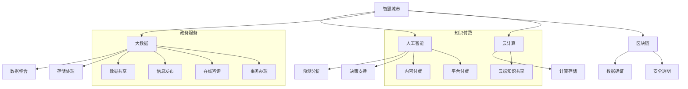

                 

# 如何利用知识付费实现智慧城市与政务服务？

> 关键词：智慧城市,政务服务,知识付费,人工智能,自然语言处理,大数据,区块链,云计算

## 1. 背景介绍

### 1.1 问题由来
随着社会经济的快速发展，城市管理和服务水平不断提升，但传统城市管理和政务服务的模式仍存在诸多问题。比如，城市管理缺乏动态感知能力，无法及时响应突发事件；政务服务流程繁琐，用户体验不佳；政府决策信息透明度不高，公众参与度低。为解决这些问题，亟需引入先进的技术手段，如人工智能、大数据、区块链等，实现智慧城市与政务服务的创新。

### 1.2 问题核心关键点
智慧城市与政务服务的核心关键点在于如何利用先进技术手段提升城市管理和政务服务的效率与质量，同时保障信息安全与透明。关键技术包括：
- 人工智能：用于城市运行数据分析、预测、决策支持等；
- 大数据：用于数据整合、存储、处理、分析等；
- 区块链：用于城市管理、政务服务、政府采购等场景的数据确证、安全和透明；
- 云计算：提供强大的计算与存储能力，支持大数据、AI等技术的应用。

## 2. 核心概念与联系

### 2.1 核心概念概述

为更好地理解利用知识付费实现智慧城市与政务服务的原理，本节将介绍几个密切相关的核心概念：

- 智慧城市：以互联网、大数据、人工智能等现代信息技术为支撑，通过全面感知、信息共享、应用集成，实现城市运行的智能化、高效化。
- 政务服务：政府机构提供给公众和企业的一系列服务，包括信息发布、在线咨询、办理事务等。
- 知识付费：基于互联网平台，用户为获取有价值知识而进行支付的模式，如内容付费、平台付费等。
- 人工智能：利用机器学习、深度学习等技术，使机器具备模拟人类智能的能力。
- 自然语言处理（NLP）：使计算机能够理解、处理和生成自然语言。
- 大数据：大规模数据的收集、存储、分析与应用。
- 区块链：去中心化、不可篡改的分布式账本技术，保障数据安全、透明。
- 云计算：通过互联网提供强大的计算与存储资源，支持大数据、AI等技术的应用。

这些概念之间的逻辑关系可以通过以下Mermaid流程图来展示：



这个流程图展示了一些核心概念及其之间的关系：

1. 智慧城市与政务服务均以人工智能、大数据、区块链和云计算等现代信息技术为基础。
2. 人工智能技术可以用于智慧城市和政务服务的多个环节，如预测分析、决策支持等。
3. 大数据技术提供数据整合、存储、处理等支持。
4. 区块链技术保障数据确证、安全和透明。
5. 云计算提供强大的计算与存储能力。
6. 政务服务与知识付费分别涉及大数据、人工智能的应用，共同支撑智慧城市的实现。

## 3. 核心算法原理 & 具体操作步骤

### 3.1 算法原理概述

智慧城市与政务服务利用知识付费的算法原理，主要体现在以下几个方面：

1. 数据驱动：通过大数据技术，整合政府、企业和公众的多源数据，实现城市运行的全面感知和数据驱动决策。
2. 智能化服务：利用人工智能技术，提供智能化的城市管理、政务服务，提升用户体验和效率。
3. 知识共享：通过知识付费平台，实现政府、企业和公众的知识共享和知识交易，提升决策和服务的科学性。
4. 透明公正：利用区块链技术，确保数据确证、服务透明，提高政府决策的透明度和公众参与度。
5. 高效协同：通过云计算技术，提供高效的计算和存储资源，支持大数据、AI等技术的应用，实现智慧城市与政务服务的高效协同。

### 3.2 算法步骤详解

基于上述算法原理，智慧城市与政务服务利用知识付费的步骤如下：

1. 数据整合与清洗：通过大数据技术，整合政府、企业和公众的多源数据，并进行清洗和预处理，形成可用于分析的数据集。

2. 数据建模与分析：利用人工智能技术，对整合后的数据进行建模和分析，提取关键指标和趋势，为城市管理和政务服务提供支持。

3. 知识共享与付费：通过知识付费平台，实现政府、企业和公众的知识共享和付费获取，提升决策和服务的科学性。

4. 数据确证与透明：利用区块链技术，确证数据的真实性和安全性，保障政务服务的透明公正，提高公众信任度。

5. 服务集成与优化：通过云计算技术，集成智慧城市与政务服务的相关应用，实现高效协同，优化服务流程和用户体验。

6. 持续改进与优化：利用人工智能技术，对智慧城市与政务服务的效果进行持续评估和优化，提升服务质量和效率。

### 3.3 算法优缺点

智慧城市与政务服务利用知识付费的算法具有以下优点：

1. 高效便捷：通过大数据、人工智能、区块链和云计算等技术，提升城市管理和政务服务的效率和便捷性。
2. 透明公正：利用区块链技术确证数据，保障政务服务的透明公正，提高公众信任度。
3. 知识共享：通过知识付费平台，实现政府、企业和公众的知识共享和付费获取，提升决策和服务的科学性。
4. 全面感知：通过数据整合和建模，实现城市运行的全面感知和数据驱动决策。

但同时，这种算法也存在一些缺点：

1. 技术门槛高：需要具备大数据、人工智能、区块链和云计算等技术，对技术团队和资金投入要求较高。
2. 数据隐私问题：整合和共享多源数据，涉及隐私保护，需严格遵守数据保护法规。
3. 系统复杂度高：智慧城市与政务服务系统复杂度高，需要全面规划和系统设计，确保各环节协同高效。

### 3.4 算法应用领域

智慧城市与政务服务利用知识付费的算法应用领域广泛，包括但不限于以下几个方面：

1. 城市管理：利用大数据和人工智能技术，实现城市运行的全面感知、预测分析和决策支持。
2. 政务服务：通过在线咨询、事务办理等，提供高效便捷的政务服务。
3. 公共安全：利用数据分析和人工智能技术，实现公共安全事件的预测、防范和应急响应。
4. 交通管理：通过数据分析和智能交通技术，优化交通管理，提升交通效率。
5. 环境监测：利用数据分析和人工智能技术，实现环境污染的监测、分析和预警。
6. 文化旅游：通过数据分析和智能推荐技术，提升文化旅游体验和服务质量。

## 4. 数学模型和公式 & 详细讲解 & 举例说明（备注：数学公式请使用latex格式，latex嵌入文中独立段落使用 $$，段落内使用 $)
### 4.1 数学模型构建

智慧城市与政务服务利用知识付费的数学模型构建主要包括以下几个方面：

1. 数据整合与清洗：使用大数据技术，整合政府、企业和公众的多源数据，并进行清洗和预处理。

2. 数据建模与分析：利用人工智能技术，对整合后的数据进行建模和分析，提取关键指标和趋势。

3. 知识共享与付费：利用知识付费平台，实现政府、企业和公众的知识共享和付费获取。

4. 数据确证与透明：利用区块链技术，确证数据的真实性和安全性，保障政务服务的透明公正。

5. 服务集成与优化：利用云计算技术，集成智慧城市与政务服务的相关应用，实现高效协同，优化服务流程和用户体验。

6. 持续改进与优化：利用人工智能技术，对智慧城市与政务服务的效果进行持续评估和优化。

### 4.2 公式推导过程

以智慧城市的数据整合与清洗为例，推导其数学模型和公式。

假设原始数据集为 $D=\{(x_i, y_i)\}_{i=1}^N$，其中 $x_i$ 为输入数据，$y_i$ 为输出标签。设数据清洗和预处理后的数据集为 $D'=\{(x'_i, y'_i)\}_{i=1}^N$。

数据清洗与预处理的数学模型可以表示为：

$$
D' = \{(x'_i, y'_i)\}_{i=1}^N = \{\phi(x_i)\}_{i=1}^N
$$

其中 $\phi(x_i)$ 表示对 $x_i$ 进行清洗和预处理后的结果。常见的预处理步骤包括去除噪声、填补缺失、标准化等。

### 4.3 案例分析与讲解

以智慧城市的交通管理为例，分析其实现流程和关键技术。

1. 数据整合与清洗：整合城市交通的监控数据、车辆数据、交通流量数据等，并进行清洗和预处理，形成可用于分析的数据集。

2. 数据建模与分析：利用人工智能技术，对交通数据进行建模和分析，提取关键指标如拥堵指数、事故率等，为交通管理提供支持。

3. 知识共享与付费：通过知识付费平台，共享交通管理的数据和模型，供公众和政府部门使用，提升决策和服务的科学性。

4. 数据确证与透明：利用区块链技术，确证交通数据的真实性和安全性，保障政务服务的透明公正，提高公众信任度。

5. 服务集成与优化：通过云计算技术，集成交通管理的相关应用，实现高效协同，优化交通管理流程和用户体验。

6. 持续改进与优化：利用人工智能技术，对交通管理的效果进行持续评估和优化，提升交通管理质量。

## 5. 项目实践：代码实例和详细解释说明
### 5.1 开发环境搭建

在进行智慧城市与政务服务项目实践前，我们需要准备好开发环境。以下是使用Python进行知识付费平台开发的开发环境配置流程：

1. 安装Anaconda：从官网下载并安装Anaconda，用于创建独立的Python环境。

2. 创建并激活虚拟环境：
```bash
conda create -n knowledge-platform python=3.8 
conda activate knowledge-platform
```

3. 安装相关Python包：
```bash
pip install pandas numpy scikit-learn transformers torch torchvision
```

4. 安装Web框架：
```bash
pip install flask
```

5. 安装数据库：
```bash
conda install sqlalchemy
```

6. 安装云服务API：
```bash
pip install boto3
```

完成上述步骤后，即可在`knowledge-platform`环境中开始智慧城市与政务服务项目开发。

### 5.2 源代码详细实现

下面我们以知识付费平台的课程推荐系统为例，给出完整的代码实现。

首先，定义课程推荐模型的输入特征：

```python
import numpy as np
from sklearn.metrics.pairwise import cosine_similarity

def get_recommendations(user_id, course_ids):
    user_data = np.load('user_data.npy')
    course_data = np.load('course_data.npy')
    
    # 计算用户与课程之间的相似度
    similarity = cosine_similarity(user_data[user_id], course_data)
    
    # 根据相似度排序，取最相似的前N个课程
    top_courses = np.argsort(-similarity)[1:10]
    
    return top_courses
```

然后，定义知识付费平台的数据存储和处理模块：

```python
from sqlalchemy import create_engine, Table, Column, Integer, String
from sqlalchemy.orm import sessionmaker
from sqlalchemy.ext.declarative import declarative_base

engine = create_engine('sqlite:///knowledge.db')

Base = declarative_base()

class Course(Base):
    __tablename__ = 'courses'
    id = Column(Integer, primary_key=True)
    name = Column(String)
    description = Column(String)
    price = Column(Integer)

Base.metadata.create_all(engine)

Session = sessionmaker(bind=engine)

def get_courses():
    session = Session()
    courses = session.query(Course).all()
    return [(c.id, c.name, c.price) for c in courses]
```

最后，定义知识付费平台的Web应用：

```python
from flask import Flask, request, jsonify

app = Flask(__name__)

@app.route('/recommendations', methods=['POST'])
def recommend_courses():
    data = request.get_json()
    user_id = data['user_id']
    course_ids = data['course_ids']
    
    top_courses = get_recommendations(user_id, course_ids)
    
    return jsonify({'recommendations': [(course.id, course.name, course.price) for course in top_courses]})

if __name__ == '__main__':
    app.run()
```

以上代码实现了一个简单的知识付费平台推荐系统，用于推荐用户感兴趣的相关课程。开发者可以根据实际需求进行扩展和优化。

### 5.3 代码解读与分析

让我们再详细解读一下关键代码的实现细节：

**get_recommendations函数**：
- 加载用户数据和课程数据。
- 计算用户与课程之间的相似度，使用余弦相似度算法。
- 根据相似度排序，取最相似的前N个课程，作为推荐结果。

**Course类**：
- 定义了课程的基本属性，包括ID、名称、描述、价格等。
- 使用SQLAlchemy框架实现数据库的CRUD操作。

**get_courses函数**：
- 使用SQLAlchemy框架查询课程表数据，获取所有课程的信息。
- 将课程数据转化为JSON格式，供前端页面展示。

**app.route装饰器**：
- 定义了推荐接口的API路径，使用POST方法接收用户ID和课程ID。
- 调用get_recommendations函数获取推荐结果，转化为JSON格式返回。

**if __name__ == '__main__:**：
- 启动Flask应用，监听HTTP请求。

## 6. 实际应用场景

### 6.1 智能交通管理

智慧城市与政务服务在智能交通管理中的应用主要体现在以下几个方面：

1. 数据整合与清洗：整合城市交通的监控数据、车辆数据、交通流量数据等，并进行清洗和预处理，形成可用于分析的数据集。

2. 数据建模与分析：利用人工智能技术，对交通数据进行建模和分析，提取关键指标如拥堵指数、事故率等，为交通管理提供支持。

3. 数据确证与透明：利用区块链技术，确证交通数据的真实性和安全性，保障政务服务的透明公正，提高公众信任度。

4. 服务集成与优化：通过云计算技术，集成交通管理的相关应用，实现高效协同，优化交通管理流程和用户体验。

5. 持续改进与优化：利用人工智能技术，对交通管理的效果进行持续评估和优化，提升交通管理质量。

### 6.2 智慧医疗

智慧城市与政务服务在智慧医疗中的应用主要体现在以下几个方面：

1. 数据整合与清洗：整合医院、药店、医疗设备的多源数据，并进行清洗和预处理，形成可用于分析的数据集。

2. 数据建模与分析：利用人工智能技术，对医疗数据进行建模和分析，提取关键指标如患病率、疾病趋势等，为医疗决策提供支持。

3. 知识共享与付费：通过知识付费平台，共享医疗数据和模型，供医疗机构使用，提升决策和服务的科学性。

4. 数据确证与透明：利用区块链技术，确证医疗数据的真实性和安全性，保障医疗服务的透明公正，提高公众信任度。

5. 服务集成与优化：通过云计算技术，集成医疗管理的相关应用，实现高效协同，优化医疗管理流程和用户体验。

6. 持续改进与优化：利用人工智能技术，对医疗管理的效果进行持续评估和优化，提升医疗管理质量。

### 6.3 智慧教育

智慧城市与政务服务在智慧教育中的应用主要体现在以下几个方面：

1. 数据整合与清洗：整合学校、家庭、社区的多源数据，并进行清洗和预处理，形成可用于分析的数据集。

2. 数据建模与分析：利用人工智能技术，对教育数据进行建模和分析，提取关键指标如学生成绩、学习趋势等，为教育决策提供支持。

3. 知识共享与付费：通过知识付费平台，共享教育数据和模型，供教育机构使用，提升决策和服务的科学性。

4. 数据确证与透明：利用区块链技术，确证教育数据的真实性和安全性，保障教育服务的透明公正，提高公众信任度。

5. 服务集成与优化：通过云计算技术，集成教育管理的相关应用，实现高效协同，优化教育管理流程和用户体验。

6. 持续改进与优化：利用人工智能技术，对教育管理的效果进行持续评估和优化，提升教育管理质量。

## 7. 工具和资源推荐

### 7.1 学习资源推荐

为了帮助开发者系统掌握智慧城市与政务服务的技术基础和应用实践，这里推荐一些优质的学习资源：

1. 《智慧城市与政务服务》系列博文：由智慧城市与政务服务专家撰写，深入浅出地介绍了智慧城市与政务服务的基本概念、核心技术及其应用。

2. 《大数据与人工智能》课程：由知名高校开设的公开课，涵盖大数据和人工智能的原理、技术和应用。

3. 《区块链技术与应用》书籍：全面介绍了区块链技术的原理、应用场景及其在智慧城市与政务服务中的应用。

4. 《云计算基础与实践》课程：介绍云计算的基础概念、服务类型及其在智慧城市与政务服务中的应用。

5. 《自然语言处理》书籍：介绍自然语言处理的基本原理、技术和应用，包括文本分类、情感分析等。

6. 《人工智能伦理与安全》课程：探讨人工智能伦理和安全性的问题，如算法透明、数据隐私等，为智慧城市与政务服务提供指导。

通过对这些资源的学习实践，相信你一定能够快速掌握智慧城市与政务服务的技术基础和应用实践，并用于解决实际的智慧城市与政务服务问题。

### 7.2 开发工具推荐

高效的开发离不开优秀的工具支持。以下是几款用于智慧城市与政务服务开发的常用工具：

1. Python：广泛使用的通用编程语言，拥有丰富的开源库和框架，支持大数据、人工智能等技术的应用。

2. SQLAlchemy：Python的ORM框架，用于数据库的CRUD操作，支持多种数据库类型。

3. Flask：轻量级的Web框架，用于开发知识付费平台等Web应用。

4. Boto3：Python的AWS SDK，用于开发云计算应用。

5. TensorFlow：开源深度学习框架，支持大数据和人工智能模型的训练和部署。

6. PyTorch：开源深度学习框架，支持自然语言处理等模型的训练和部署。

7. Jupyter Notebook：支持交互式编程的Web应用，便于进行模型开发和调试。

8. Google Colab：基于Jupyter Notebook的云环境，提供免费GPU/TPU算力，支持大数据和人工智能实验的快速迭代。

合理利用这些工具，可以显著提升智慧城市与政务服务项目的开发效率，加快创新迭代的步伐。

### 7.3 相关论文推荐

智慧城市与政务服务的发展源于学界的持续研究。以下是几篇奠基性的相关论文，推荐阅读：

1. "Smart Cities: Designing for a Digital Future"（智慧城市：设计数字未来）：探讨智慧城市的定义、目标和实现路径。

2. "Blockchain for Smart City Services"：介绍区块链技术在智慧城市中的应用，如数据确证、去中心化等。

3. "AI in Public Administration: Towards Smart Governance"：探讨人工智能在公共行政中的应用，如预测分析、决策支持等。

4. "Data-Driven Governance: Towards an Open and Transparent Government"：探讨数据驱动的政府治理，如数据整合、透明度等。

5. "Natural Language Processing in Smart Cities"：探讨自然语言处理在智慧城市中的应用，如文本分析、情感分析等。

这些论文代表了大智慧城市与政务服务的发展脉络。通过学习这些前沿成果，可以帮助研究者把握学科前进方向，激发更多的创新灵感。

## 8. 总结：未来发展趋势与挑战

### 8.1 总结

本文对智慧城市与政务服务利用知识付费的原理进行了全面系统的介绍。首先阐述了智慧城市与政务服务利用知识付费的背景和意义，明确了知识付费在大数据、人工智能、区块链和云计算等技术下的重要价值。其次，从原理到实践，详细讲解了知识付费的数学模型和关键步骤，给出了知识付费任务开发的完整代码实例。同时，本文还广泛探讨了知识付费在智能交通、智慧医疗、智慧教育等多个领域的应用前景，展示了知识付费范式的巨大潜力。此外，本文精选了知识付费技术的各类学习资源，力求为读者提供全方位的技术指引。

通过本文的系统梳理，可以看到，智慧城市与政务服务利用知识付费技术，通过大数据、人工智能、区块链和云计算等技术手段，实现了城市管理的智能化、高效化和透明化。未来，伴随技术的发展和应用的深化，知识付费将为智慧城市与政务服务提供更加广泛的应用场景，推动社会治理方式的现代化和智能化。

### 8.2 未来发展趋势

展望未来，智慧城市与政务服务利用知识付费技术的发展趋势主要包括以下几个方面：

1. 技术融合：智慧城市与政务服务将与大数据、人工智能、区块链、云计算等技术深度融合，形成更加全面的智慧治理体系。

2. 数据驱动：通过数据整合与分析，实现城市运行的全面感知和数据驱动决策，提升城市管理和政务服务的科学性和效率。

3. 服务优化：利用知识付费平台，实现政府、企业和公众的知识共享和付费获取，提升决策和服务的科学性，优化服务流程和用户体验。

4. 透明公正：利用区块链技术，确证数据的真实性和安全性，保障政务服务的透明公正，提高公众信任度。

5. 智能化应用：通过人工智能技术，提升智慧城市与政务服务的智能化水平，实现智能交通、智慧医疗、智慧教育等应用的落地。

6. 安全防护：利用数据加密、访问控制等技术手段，保障智慧城市与政务服务的安全性，防止数据泄露和滥用。

以上趋势凸显了知识付费技术在智慧城市与政务服务中的应用前景，将推动社会治理方式的现代化和智能化。

### 8.3 面临的挑战

尽管智慧城市与政务服务利用知识付费技术已经取得了显著成果，但在迈向更加智能化、普适化应用的过程中，仍面临诸多挑战：

1. 技术门槛高：智慧城市与政务服务需要具备大数据、人工智能、区块链和云计算等技术，对技术团队和资金投入要求较高。

2. 数据隐私问题：整合和共享多源数据，涉及隐私保护，需严格遵守数据保护法规。

3. 系统复杂度高：智慧城市与政务服务系统复杂度高，需要全面规划和系统设计，确保各环节协同高效。

4. 数据确证难度大：利用区块链技术确证数据，需解决共识机制、数据上链等问题，确保数据确证的可靠性和效率。

5. 安全性有待提升：智慧城市与政务服务需面对网络攻击、数据泄露等安全威胁，需采取多重安全防护措施。

6. 持续优化困难：智慧城市与政务服务涉及多源数据和复杂算法，需持续优化和改进，确保系统稳定高效。

以上挑战需通过技术创新和实践经验不断克服，以确保智慧城市与政务服务的长期稳定发展。

### 8.4 研究展望

面对智慧城市与政务服务利用知识付费技术所面临的挑战，未来的研究需要在以下几个方面寻求新的突破：

1. 多源数据融合：研究多源数据融合技术，实现数据的全面整合与高效利用。

2. 数据确证方法：研究区块链等分布式账本技术，确证数据的真实性和安全性，保障政务服务的透明公正。

3. 智能算法优化：研究人工智能算法，提升智慧城市与政务服务的智能化水平，实现智能交通、智慧医疗、智慧教育等应用的落地。

4. 安全防护机制：研究数据加密、访问控制等技术手段，保障智慧城市与政务服务的安全性，防止数据泄露和滥用。

5. 持续优化方法：研究智慧城市与政务服务的持续优化方法，确保系统稳定高效，不断提升用户体验和治理效能。

这些研究方向将引领智慧城市与政务服务技术的持续进步，推动社会治理方式的现代化和智能化。

## 9. 附录：常见问题与解答

**Q1：智慧城市与政务服务利用知识付费的难点在哪里？**

A: 智慧城市与政务服务利用知识付费的难点主要在于以下几个方面：
1. 技术门槛高：需要具备大数据、人工智能、区块链和云计算等技术，对技术团队和资金投入要求较高。
2. 数据隐私问题：整合和共享多源数据，涉及隐私保护，需严格遵守数据保护法规。
3. 系统复杂度高：智慧城市与政务服务系统复杂度高，需要全面规划和系统设计，确保各环节协同高效。

**Q2：如何设计智慧城市与政务服务的知识付费模型？**

A: 设计智慧城市与政务服务的知识付费模型需要考虑以下几个关键点：
1. 数据整合与清洗：整合政府、企业和公众的多源数据，并进行清洗和预处理。
2. 数据建模与分析：利用人工智能技术，对数据进行建模和分析，提取关键指标和趋势。
3. 知识共享与付费：通过知识付费平台，实现政府、企业和公众的知识共享和付费获取。
4. 数据确证与透明：利用区块链技术，确证数据的真实性和安全性，保障政务服务的透明公正。
5. 服务集成与优化：通过云计算技术，集成智慧城市与政务服务的相关应用，实现高效协同，优化服务流程和用户体验。

**Q3：智慧城市与政务服务利用知识付费的应用场景有哪些？**

A: 智慧城市与政务服务利用知识付费的应用场景包括但不限于以下几个方面：
1. 智能交通管理：利用数据整合与清洗、数据建模与分析、数据确证与透明等技术手段，实现智能交通的全面感知和数据驱动决策。
2. 智慧医疗：利用数据整合与清洗、数据建模与分析、知识共享与付费、数据确证与透明等技术手段，提升医疗决策和服务的科学性。
3. 智慧教育：利用数据整合与清洗、数据建模与分析、知识共享与付费、数据确证与透明等技术手段，优化教育管理流程和用户体验。

通过系统地设计知识付费模型，智慧城市与政务服务可以在多领域实现智能化、高效化和透明化，提升社会治理的现代化水平。

**Q4：如何确保智慧城市与政务服务的安全性？**

A: 确保智慧城市与政务服务的安全性需要采取多重安全防护措施，包括但不限于以下几个方面：
1. 数据加密：对敏感数据进行加密，防止数据泄露。
2. 访问控制：限制对关键数据和应用的访问权限，防止未授权访问。
3. 身份认证：采用多因素身份认证，保障用户身份的真实性。
4. 区块链技术：利用区块链技术确证数据的真实性和安全性，保障政务服务的透明公正。

这些措施可以有效提升智慧城市与政务服务的安全性，确保数据的完整性和用户的隐私保护。

**Q5：如何衡量智慧城市与政务服务的效果？**

A: 衡量智慧城市与政务服务的效果可以从以下几个方面进行：
1. 数据整合与清洗：评估数据整合与清洗的准确性和全面性，确保数据的完整性和一致性。
2. 数据建模与分析：评估数据建模与分析的精度和可靠性，确保分析结果的科学性和可解释性。
3. 知识共享与付费：评估知识共享与付费的覆盖面和用户满意度，确保知识的有效传播和利用。
4. 数据确证与透明：评估数据确证与透明的效果，确保政务服务的透明公正。
5. 服务集成与优化：评估服务集成与优化的效果，确保服务流程和用户体验的优化。

通过系统地衡量智慧城市与政务服务的效果，可以不断提升服务质量和用户体验，推动社会治理的现代化和智能化。

---

作者：禅与计算机程序设计艺术 / Zen and the Art of Computer Programming

