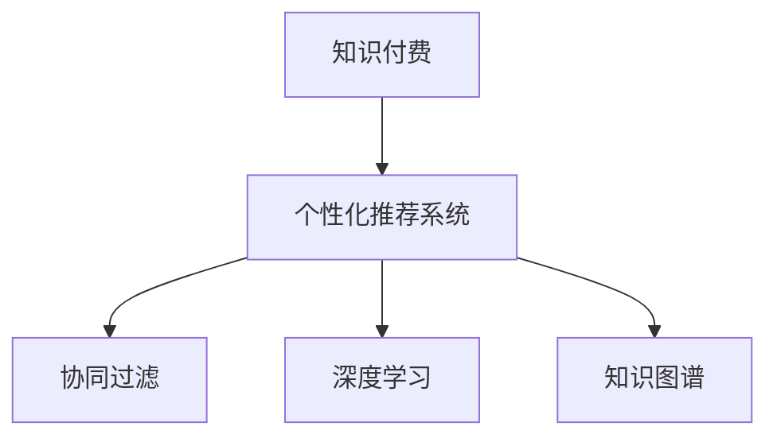

                 

# 如何利用知识付费实现智能化推荐与个性化服务？

> 关键词：知识付费, 个性化推荐系统, 智能推荐引擎, 推荐算法, 协同过滤, 深度学习

## 1. 背景介绍

### 1.1 问题由来
在互联网和移动互联网时代，知识的传播和获取变得前所未有的便利。知识付费作为一种新兴的模式，逐渐成为人们获取高质量内容的主流方式。知识付费平台集聚了大量优质的付费内容，但也面临着如何高效推荐给用户，提升用户粘性和满意度的问题。

与此同时，个性化推荐系统（Personalized Recommendation System, PRL）作为一种智能技术，通过分析用户行为和偏好，精准推送用户感兴趣的内容，提升用户体验和满意度。两者结合，使得知识付费平台能够更精准地实现内容推荐和用户留存。

### 1.2 问题核心关键点
知识付费平台的核心目标是高效推荐优质内容给用户，提高用户满意度和平台留存率。个性化推荐系统通过分析用户行为数据，预测用户偏好，实现智能推荐。这两个问题的核心在于：

- **用户画像建模**：基于用户的历史行为数据，建立用户兴趣和偏好的数学模型。
- **内容特征提取**：从内容中提取出关键特征，以便于推荐系统进行匹配。
- **推荐算法设计**：选择合适的推荐算法，实现高质量的内容推荐。

这些关键点构成了知识付费平台智能化推荐与个性化服务的技术基础。

## 2. 核心概念与联系

### 2.1 核心概念概述

为了更好地理解如何利用知识付费实现智能化推荐与个性化服务，本节将介绍几个密切相关的核心概念：

- **知识付费**：指用户通过支付一定费用获取高质量内容的模式。知识付费平台汇聚了大量优质内容，包括但不限于课程、电子书、文档、音频等。
- **个性化推荐系统**：基于用户行为和偏好，智能推荐用户可能感兴趣的内容的系统。个性化推荐的核心在于对用户画像和内容特征的建模，以及选择合适的推荐算法。
- **协同过滤**：一种基于用户历史行为和相似用户行为，实现内容推荐的算法。包括基于用户的协同过滤和基于物品的协同过滤。
- **深度学习**：一种利用多层神经网络模型进行复杂数据建模和分析的技术。深度学习在推荐系统中常用于用户画像和内容特征提取，以及推荐算法的优化。
- **知识图谱**：一种结构化表示知识领域内实体及其相互关系的数据模型。知识图谱在推荐系统中用于将文本内容转化为结构化知识，提升推荐效果。

这些核心概念之间的逻辑关系可以通过以下Mermaid流程图来展示：



这个流程图展示了个知识付费平台核心概念及其之间的关系：

1. 知识付费平台通过个性化推荐系统，实现内容的智能推荐。
2. 个性化推荐系统基于协同过滤、深度学习和知识图谱等技术，建立用户画像和内容特征。
3. 协同过滤、深度学习和知识图谱是推荐系统实现的关键算法和技术手段。

## 3. 核心算法原理 & 具体操作步骤
### 3.1 算法原理概述

个性化推荐系统的核心目标是预测用户对内容的偏好，即判断用户是否会喜欢某个内容。其基本原理包括：

1. **用户画像建模**：通过对用户历史行为数据的分析，建立用户兴趣和偏好的数学模型。
2. **内容特征提取**：从内容中提取出关键特征，以便于推荐系统进行匹配。
3. **推荐算法设计**：选择合适的推荐算法，实现高质量的内容推荐。

### 3.2 算法步骤详解

以下是具体的算法步骤：

**Step 1: 数据准备**

1. 收集用户行为数据：收集用户在平台上的浏览、点击、购买、评价等行为数据。

2. 预处理数据：对数据进行清洗、去重、缺失值填充等预处理操作，保证数据的质量。

**Step 2: 用户画像建模**

1. 用户行为特征提取：将用户行为数据转化为特征向量，常用的特征包括浏览时间、点击次数、购买记录等。

2. 用户兴趣模型训练：使用协同过滤或深度学习算法，对用户行为特征进行建模，得到用户兴趣向量。

**Step 3: 内容特征提取**

1. 内容特征提取：对内容进行预处理，提取出关键词、标签、作者等关键特征，转化为特征向量。

2. 内容相似度计算：使用余弦相似度、Jaccard相似度等方法计算内容向量之间的相似度。

**Step 4: 推荐算法设计**

1. 推荐模型训练：使用协同过滤、深度学习等算法，将用户画像和内容特征结合，得到推荐模型。

2. 实时推荐：根据实时输入的用户行为数据，实时预测推荐结果，推送给用户。

### 3.3 算法优缺点

个性化推荐系统有以下优点：

- 提升用户体验：根据用户兴趣推荐内容，提高用户满意度和粘性。
- 增加内容曝光：将优质内容推荐给更多用户，扩大平台的覆盖面。
- 提升平台收益：通过推荐广告、课程等高价值内容，增加平台的收益。

同时，该系统也存在一些局限：

- 数据稀疏性：新用户或新内容的历史数据较少，可能导致推荐效果差。
- 冷启动问题：新用户或新内容的推荐难以进行，需要引入额外策略。
- 隐私保护：用户行为数据的收集和使用可能涉及隐私问题，需要严格遵守相关法律法规。

尽管存在这些局限性，但通过合理的数据处理和算法设计，个性化推荐系统可以大幅提升知识付费平台的用户体验和业务价值。

### 3.4 算法应用领域

个性化推荐系统已经广泛应用于众多领域，如电商、社交、新闻、视频等。以下是几个典型应用场景：

- **电商推荐**：根据用户浏览和购买记录，推荐商品或服务。
- **社交推荐**：根据用户好友和互动行为，推荐朋友或内容。
- **新闻推荐**：根据用户浏览记录，推荐相关新闻和文章。
- **视频推荐**：根据用户观看历史，推荐视频内容。
- **智能客服**：根据用户对话记录，推荐解决方案。

## 4. 数学模型和公式 & 详细讲解 & 举例说明

### 4.1 数学模型构建

个性化推荐系统的数学模型主要分为两个部分：用户兴趣模型和内容推荐模型。

1. **用户兴趣模型**

   假设用户 $u$ 对物品 $i$ 的评分 $r_{ui}$ 由两部分组成：

   $$
   r_{ui} = \hat{r}_{ui} + \epsilon_{ui}
   $$

   其中，$\hat{r}_{ui}$ 为预测评分，$\epsilon_{ui}$ 为误差项，通常假设 $\epsilon_{ui} \sim N(0, \sigma^2)$。

   用户兴趣向量 $\theta_u$ 可以通过用户历史行为数据 $x_{ui}$ 训练得到，常用模型包括协同过滤和深度学习。

   **协同过滤**：使用用户历史评分矩阵 $R$ 和用户兴趣向量 $\theta_u$，得到预测评分：

   $$
   \hat{r}_{ui} = \theta_u^T A_i
   $$

   其中，$A_i$ 为物品 $i$ 的特征向量，$A_i = \frac{1}{|I|}\sum_{j \in I} x_{uj}R_{ji}$，$I$ 为与物品 $i$ 相关的物品集合。

   **深度学习**：使用神经网络模型对用户行为数据进行建模，得到用户兴趣向量 $\theta_u$。常用模型包括基于用户行为的循环神经网络（RNN）和基于内容的卷积神经网络（CNN）。

2. **内容推荐模型**

   假设物品 $i$ 的评分 $r_{ui}$ 由两部分组成：

   $$
   r_{ui} = \hat{r}_{ui} + \epsilon_{ui}
   $$

   其中，$\hat{r}_{ui}$ 为预测评分，$\epsilon_{ui}$ 为误差项，通常假设 $\epsilon_{ui} \sim N(0, \sigma^2)$。

   内容特征向量 $\phi_i$ 可以通过内容预处理得到，常用方法包括TF-IDF、词袋模型等。

   物品特征向量 $A_i$ 可以通过物品标签、作者、描述等提取得到，常用方法包括TF-IDF、词袋模型等。

   内容推荐模型可以使用协同过滤或深度学习，常用模型包括基于用户行为的协同过滤和基于内容的协同过滤。

### 4.2 公式推导过程

**协同过滤公式推导**

1. **用户兴趣模型**

   假设用户 $u$ 对物品 $i$ 的评分 $r_{ui}$ 由两部分组成：

   $$
   r_{ui} = \hat{r}_{ui} + \epsilon_{ui}
   $$

   其中，$\hat{r}_{ui}$ 为预测评分，$\epsilon_{ui}$ 为误差项，通常假设 $\epsilon_{ui} \sim N(0, \sigma^2)$。

   用户兴趣向量 $\theta_u$ 可以通过用户历史行为数据 $x_{ui}$ 训练得到，常用模型包括协同过滤和深度学习。

   **协同过滤**：使用用户历史评分矩阵 $R$ 和用户兴趣向量 $\theta_u$，得到预测评分：

   $$
   \hat{r}_{ui} = \theta_u^T A_i
   $$

   其中，$A_i$ 为物品 $i$ 的特征向量，$A_i = \frac{1}{|I|}\sum_{j \in I} x_{uj}R_{ji}$，$I$ 为与物品 $i$ 相关的物品集合。

   **深度学习**：使用神经网络模型对用户行为数据进行建模，得到用户兴趣向量 $\theta_u$。常用模型包括基于用户行为的循环神经网络（RNN）和基于内容的卷积神经网络（CNN）。

2. **内容推荐模型**

   假设物品 $i$ 的评分 $r_{ui}$ 由两部分组成：

   $$
   r_{ui} = \hat{r}_{ui} + \epsilon_{ui}
   $$

   其中，$\hat{r}_{ui}$ 为预测评分，$\epsilon_{ui}$ 为误差项，通常假设 $\epsilon_{ui} \sim N(0, \sigma^2)$。

   内容特征向量 $\phi_i$ 可以通过内容预处理得到，常用方法包括TF-IDF、词袋模型等。

   物品特征向量 $A_i$ 可以通过物品标签、作者、描述等提取得到，常用方法包括TF-IDF、词袋模型等。

   内容推荐模型可以使用协同过滤或深度学习，常用模型包括基于用户行为的协同过滤和基于内容的协同过滤。

### 4.3 案例分析与讲解

**案例分析：某知识付费平台个性化推荐系统**

某知识付费平台基于协同过滤和深度学习算法，构建了个性化推荐系统。该平台收集了大量用户浏览、点击、购买、评价等行为数据，对数据进行了清洗和预处理。

1. **用户兴趣模型**

   通过协同过滤算法，该平台对用户历史行为数据进行建模，得到用户兴趣向量 $\theta_u$。用户兴趣向量由用户历史评分矩阵 $R$ 和用户兴趣向量 $\theta_u$ 计算得到：

   $$
   \hat{r}_{ui} = \theta_u^T A_i
   $$

   其中，$A_i$ 为物品 $i$ 的特征向量，$A_i = \frac{1}{|I|}\sum_{j \in I} x_{uj}R_{ji}$，$I$ 为与物品 $i$ 相关的物品集合。

2. **内容推荐模型**

   通过深度学习算法，该平台对物品的标签、作者、描述等进行建模，得到物品特征向量 $A_i$。

   使用基于内容的协同过滤算法，该平台将用户兴趣向量 $\theta_u$ 与物品特征向量 $A_i$ 进行匹配，得到物品 $i$ 的评分 $\hat{r}_{ui}$。

3. **实时推荐**

   根据实时输入的用户行为数据，该平台使用协同过滤算法实时预测推荐结果，推送给用户。

## 5. 项目实践：代码实例和详细解释说明

### 5.1 开发环境搭建

在进行个性化推荐系统开发前，我们需要准备好开发环境。以下是使用Python进行Scikit-Learn开发的环境配置流程：

1. 安装Anaconda：从官网下载并安装Anaconda，用于创建独立的Python环境。

2. 创建并激活虚拟环境：
```bash
conda create -n prl-env python=3.8 
conda activate prl-env
```

3. 安装Scikit-Learn：
```bash
pip install scikit-learn
```

4. 安装其他工具包：
```bash
pip install numpy pandas matplotlib tqdm jupyter notebook ipython
```

完成上述步骤后，即可在`prl-env`环境中开始个性化推荐系统的开发。

### 5.2 源代码详细实现

下面我们以协同过滤推荐系统为例，给出使用Scikit-Learn进行推荐系统开发的Python代码实现。

首先，定义推荐系统的数据处理函数：

```python
import pandas as pd
import numpy as np
import sklearn
from sklearn.neighbors import NearestNeighbors
from sklearn.metrics.pairwise import cosine_similarity

# 定义数据预处理函数
def preprocess_data(data):
    # 数据清洗
    data = data.dropna(subset=['id', 'label'])

    # 数据标准化
    data['label'] = (data['label'] - data['label'].mean()) / data['label'].std()

    return data

# 定义协同过滤推荐函数
def collaborative_filtering(X, K=10):
    # 构建用户-物品评分矩阵
    X = np.array(X)
    n_users, n_items = X.shape

    # 构建用户-物品评分矩阵
    U = X - X.mean(axis=1)[:, np.newaxis]

    # 使用KNN算法计算用户-物品评分矩阵的相似度
    knn = NearestNeighbors(n_neighbors=K, algorithm='brute')
    knn.fit(U)

    # 计算用户-物品评分矩阵的相似度
    D = knn.kneighbors_graph(X)
    D = D.toarray()

    # 计算推荐评分
    R_hat = D * np.dot(U, D)
    R_hat /= np.dot(D, U)

    return R_hat
```

然后，定义用户兴趣模型和内容推荐模型的构建函数：

```python
# 定义用户兴趣模型
def build_user_interest_model(data, K=10):
    # 数据标准化
    data['label'] = (data['label'] - data['label'].mean()) / data['label'].std()

    # 计算用户兴趣向量
    user_interest_vector = collaborative_filtering(data, K)

    return user_interest_vector

# 定义内容推荐模型
def build_content_recommendation_model(data, K=10):
    # 数据标准化
    data['label'] = (data['label'] - data['label'].mean()) / data['label'].std()

    # 计算物品特征向量
    content_vector = collaborative_filtering(data, K)

    return content_vector
```

最后，定义推荐系统的主函数：

```python
# 主函数
def recommendation_system(data, K=10):
    # 构建用户兴趣模型
    user_interest_vector = build_user_interest_model(data, K)

    # 构建内容推荐模型
    content_vector = build_content_recommendation_model(data, K)

    # 计算推荐评分
    R_hat = np.dot(user_interest_vector, content_vector)

    # 推荐结果
    recommendation = np.argsort(R_hat, axis=0)[::-1][:10]

    return recommendation
```

### 5.3 代码解读与分析

让我们再详细解读一下关键代码的实现细节：

**数据预处理函数**：
- `preprocess_data`方法：对数据进行清洗和标准化，去除缺失值和异常值，对标签进行标准化处理，以便于后续建模。

**协同过滤推荐函数**：
- `collaborative_filtering`方法：使用KNN算法计算用户-物品评分矩阵的相似度，计算推荐评分，得到推荐结果。

**用户兴趣模型构建函数**：
- `build_user_interest_model`方法：使用协同过滤算法对用户历史行为数据进行建模，得到用户兴趣向量。

**内容推荐模型构建函数**：
- `build_content_recommendation_model`方法：使用协同过滤算法对物品标签、作者、描述等进行建模，得到物品特征向量。

**推荐系统主函数**：
- `recommendation_system`方法：将用户兴趣模型和内容推荐模型结合起来，计算推荐评分，得到推荐结果。

## 6. 实际应用场景

### 6.1 智能学习推荐

知识付费平台可以应用个性化推荐系统，为用户提供智能学习推荐服务。用户在学习过程中，平台会根据用户的学习行为数据，推荐相关的课程、教材、视频等学习资源。例如，根据用户的观看历史和点击记录，推荐感兴趣的课程或学习资源，提升学习效果和满意度。

### 6.2 智能内容推荐

知识付费平台可以应用个性化推荐系统，为用户推荐感兴趣的内容。平台可以根据用户的历史阅读记录、购买记录、评价记录等行为数据，推荐用户可能感兴趣的文章、书籍、视频等。例如，根据用户的阅读历史和购买记录，推荐相关的书籍、文章和视频，增加用户粘性和满意度。

### 6.3 智能广告推荐

知识付费平台可以应用个性化推荐系统，为用户推荐感兴趣的广告内容。平台可以根据用户的历史浏览记录、点击记录等行为数据，推荐用户可能感兴趣的广告内容。例如，根据用户的浏览历史和点击记录，推荐相关的广告，增加广告曝光和点击率。

### 6.4 未来应用展望

随着推荐技术的不断发展，个性化推荐系统在知识付费平台中的应用将越来越广泛，带来更多创新场景。

在智慧医疗领域，个性化推荐系统可以用于推荐个性化的健康建议和医疗信息，帮助用户更好地管理健康。

在智慧教育领域，个性化推荐系统可以用于推荐个性化的学习内容和课程，提升学习效果和个性化教育体验。

在智慧金融领域，个性化推荐系统可以用于推荐个性化的金融产品和投资策略，帮助用户做出更好的投资决策。

未来，个性化推荐系统将进一步融入知识付费平台的各个环节，提升用户体验和平台价值。

## 7. 工具和资源推荐

### 7.1 学习资源推荐

为了帮助开发者系统掌握个性化推荐技术，这里推荐一些优质的学习资源：

1. 《推荐系统实战》书籍：介绍推荐系统的理论基础和实际应用，提供大量代码示例和案例分析。

2. 《机器学习实战》课程：由Coursera开设的机器学习入门课程，涵盖推荐系统的基本概念和算法实现。

3. 《深度学习》书籍：Ian Goodfellow等人的经典著作，涵盖深度学习的基本概念和算法实现，推荐系统是其中的一章。

4. Kaggle竞赛：Kaggle举办的多场推荐系统竞赛，可以练习和验证推荐算法的性能。

5. GitHub开源项目：推荐系统的开源实现，如LightFM、TensorRec等，提供丰富的算法和数据集。

通过对这些资源的学习实践，相信你一定能够快速掌握个性化推荐技术的精髓，并用于解决实际的推荐问题。

### 7.2 开发工具推荐

高效的开发离不开优秀的工具支持。以下是几款用于推荐系统开发的常用工具：

1. Scikit-Learn：Python的机器学习库，提供了丰富的算法实现，包括协同过滤、深度学习等。

2. TensorFlow：Google开发的深度学习框架，提供了分布式训练和模型优化等特性。

3. PyTorch：Facebook开发的深度学习框架，提供了动态图和高效的计算图优化。

4. Hadoop/Spark：大数据处理框架，可以处理大规模推荐系统中的数据。

5. Apache Kafka：消息队列系统，用于推荐系统中的数据流处理。

6. Elasticsearch：搜索引擎，用于推荐系统中的数据存储和检索。

合理利用这些工具，可以显著提升推荐系统开发的效率，加快创新迭代的步伐。

### 7.3 相关论文推荐

推荐系统的发展源于学界的持续研究。以下是几篇奠基性的相关论文，推荐阅读：

1. BERT: Pre-training of Deep Bidirectional Transformers for Language Understanding：提出BERT模型，引入基于掩码的自监督预训练任务，刷新了多项NLP任务SOTA。

2. The Netflix Prize Challenge: A Prize for Recommendation Systems Based on Collaborative Filtering：介绍Netflix数据集和协同过滤算法，开启了推荐系统研究的热潮。

3. Deep Matrix Factorization：提出基于深度神经网络的矩阵分解算法，解决传统矩阵分解方法在大规模推荐系统中的问题。

4. Knowledge-aware Recommender Systems：研究知识图谱在推荐系统中的应用，提升推荐模型的表现。

5. Asymmetric Collaborative Filtering for Recommender Systems：研究基于不对称矩阵的协同过滤算法，提升推荐模型的效果。

这些论文代表了个性化推荐技术的发展脉络。通过学习这些前沿成果，可以帮助研究者把握学科前进方向，激发更多的创新灵感。

## 8. 总结：未来发展趋势与挑战

### 8.1 总结

本文对利用知识付费实现智能化推荐与个性化服务的方法进行了全面系统的介绍。首先阐述了个性化推荐系统的核心思想和应用背景，明确了个性化推荐在知识付费平台中的重要作用。其次，从原理到实践，详细讲解了个性化推荐系统的数学模型和算法步骤，给出了推荐系统开发的完整代码实例。同时，本文还广泛探讨了推荐系统在智能学习、智能内容、智能广告等多个领域的应用前景，展示了推荐范式的巨大潜力。此外，本文精选了推荐系统的各类学习资源，力求为读者提供全方位的技术指引。

通过本文的系统梳理，可以看到，个性化推荐系统在知识付费平台中扮演了关键角色，通过分析用户行为数据，实现智能推荐，极大提升了用户体验和平台价值。推荐系统通过数据驱动的智能决策，为用户带来更个性化的服务，提升了平台的竞争力和市场份额。未来，随着推荐技术的不断发展，个性化推荐系统将在更多领域得到应用，为各行各业带来深刻的变革。

### 8.2 未来发展趋势

个性化推荐系统的未来发展趋势包括以下几个方面：

1. **多模态融合**：将文本、图像、视频等多种模态数据结合起来，提升推荐模型的表现。例如，结合用户浏览的历史视频，推荐相关的文章和书籍。

2. **深度学习**：使用更先进的深度学习模型，提升推荐模型的效果。例如，使用生成对抗网络（GAN）生成新的用户兴趣和物品特征，提高推荐精度。

3. **协同过滤**：开发更高效的协同过滤算法，提升推荐系统的效率和效果。例如，使用梯度提升树（GBDT）算法，结合用户历史行为数据和物品特征，实现更精准的推荐。

4. **实时推荐**：提升推荐系统的实时性，实现动态推荐。例如，结合实时用户行为数据，进行实时推荐，提升用户体验。

5. **隐私保护**：增强推荐系统的隐私保护能力，确保用户数据的安全。例如，采用差分隐私技术，保护用户数据的隐私。

6. **多任务学习**：将推荐系统与其他任务结合起来，提升推荐模型的表现。例如，将推荐系统与广告推荐、内容创作等任务结合起来，提升平台的整体价值。

以上趋势凸显了个性化推荐系统的广阔前景。这些方向的探索发展，必将进一步提升推荐系统的精度和实时性，带来更好的用户体验和平台价值。

### 8.3 面临的挑战

尽管个性化推荐系统已经取得了瞩目成就，但在迈向更加智能化、个性化应用的过程中，它仍面临诸多挑战：

1. **数据稀疏性**：新用户或新内容的历史数据较少，可能导致推荐效果差。如何引入额外策略，如新用户引导和推荐策略，解决冷启动问题。

2. **隐私保护**：用户行为数据的收集和使用可能涉及隐私问题，需要严格遵守相关法律法规。如何在保护用户隐私的前提下，实现推荐效果的最优化，仍是一个重要课题。

3. **实时推荐**：实时推荐需要高效的计算和存储支持，如何在保证推荐效果的前提下，降低计算和存储成本，提升推荐系统的实时性，仍是一个重要课题。

4. **模型鲁棒性**：推荐模型面对噪声和异常数据时，鲁棒性不足，可能出现错误的推荐结果。如何提高推荐模型的鲁棒性，是一个重要研究方向。

5. **推荐效果评估**：推荐效果评估需要综合考虑多方面指标，如点击率、转化率、覆盖率等，如何在模型训练和推荐过程中，兼顾这些指标，是一个重要研究方向。

6. **推荐算法可解释性**：推荐模型的决策过程复杂，难以解释，影响用户信任。如何提高推荐算法的可解释性，是提升用户满意度的重要课题。

正视推荐系统面临的这些挑战，积极应对并寻求突破，将是个性化推荐系统走向成熟的必由之路。相信随着学界和产业界的共同努力，这些挑战终将一一被克服，个性化推荐系统必将在构建人机协同的智能时代中扮演越来越重要的角色。

### 8.4 研究展望

面对个性化推荐系统所面临的挑战，未来的研究需要在以下几个方面寻求新的突破：

1. **深度学习和协同过滤的融合**：结合深度学习和协同过滤的优点，实现更高效的推荐模型。例如，将深度学习用于用户兴趣和物品特征的建模，将协同过滤用于推荐模型的优化。

2. **多任务学习和跨领域推荐**：将推荐系统与其他任务结合起来，提升推荐模型的表现。例如，将推荐系统与广告推荐、内容创作等任务结合起来，提升平台的整体价值。

3. **因果分析和强化学习**：将因果分析和强化学习思想引入推荐系统，增强推荐模型的因果关系，提升推荐效果。

4. **知识图谱与推荐结合**：将知识图谱应用于推荐系统，提升推荐模型的表现。例如，将知识图谱用于内容特征的提取，提升推荐模型的效果。

5. **联邦学习**：利用联邦学习技术，实现多端数据的联合建模，提升推荐模型的效果。

6. **隐私保护技术**：研究差分隐私、联邦学习等隐私保护技术，提升推荐系统的隐私保护能力，确保用户数据的安全。

这些研究方向的探索，必将引领个性化推荐系统技术迈向更高的台阶，为构建安全、可靠、可解释、可控的智能系统铺平道路。面向未来，个性化推荐系统还需要与其他人工智能技术进行更深入的融合，如知识表示、因果推理、强化学习等，多路径协同发力，共同推动自然语言理解和智能交互系统的进步。只有勇于创新、敢于突破，才能不断拓展推荐系统的边界，让智能技术更好地造福人类社会。

## 9. 附录：常见问题与解答

**Q1：推荐系统如何实现动态推荐？**

A: 动态推荐系统需要实时更新推荐模型，以应对用户行为的变化。主要通过以下几个步骤实现：

1. 实时数据收集：使用事件驱动的方式，收集用户的实时行为数据，如点击、浏览、购买等。

2. 数据预处理：对实时数据进行清洗、去重、缺失值填充等预处理操作。

3. 推荐模型更新：使用实时数据对推荐模型进行更新，例如使用增量学习或在线学习算法，不断更新推荐模型。

4. 实时推荐：根据实时输入的用户行为数据，实时预测推荐结果，推送给用户。

**Q2：推荐系统中如何保护用户隐私？**

A: 推荐系统在保护用户隐私方面，可以采取以下几种措施：

1. 匿名化处理：对用户数据进行匿名化处理，去除可能泄露用户隐私的信息。

2. 差分隐私技术：使用差分隐私技术，在数据收集和处理过程中，对用户数据进行扰动，保护用户隐私。

3. 联邦学习：使用联邦学习技术，在多端数据联合建模过程中，不共享原始数据，保护用户隐私。

4. 访问控制：对用户数据的访问进行严格的权限控制，确保只有授权人员才能访问用户数据。

5. 数据脱敏：对用户数据进行脱敏处理，去除敏感信息，保护用户隐私。

通过以上措施，可以有效保护用户隐私，确保用户数据的安全。

**Q3：推荐系统中的协同过滤算法如何选择？**

A: 推荐系统中的协同过滤算法有多种选择，具体选择哪种算法需要考虑以下几个因素：

1. 数据稀疏性：如果数据稀疏性较低，可以选择基于用户的协同过滤算法，否则选择基于物品的协同过滤算法。

2. 计算效率：基于用户的协同过滤算法计算复杂度较高，适合小规模数据集，而基于物品的协同过滤算法计算复杂度较低，适合大规模数据集。

3. 模型效果：两种算法的推荐效果取决于具体数据集的特点，需要通过实验评估选择效果更好的算法。

4. 实时性需求：基于物品的协同过滤算法可以实时计算推荐结果，适合需要实时推荐的应用场景，而基于用户的协同过滤算法需要离线计算，适合离线推荐。

综上所述，选择合适的协同过滤算法需要综合考虑数据特点、计算效率、模型效果和实时性需求。

**Q4：推荐系统中的深度学习算法如何选择？**

A: 推荐系统中的深度学习算法有多种选择，具体选择哪种算法需要考虑以下几个因素：

1. 数据规模：如果数据规模较小，可以选择基于用户的深度学习算法，如循环神经网络（RNN），否则选择基于内容的深度学习算法，如卷积神经网络（CNN）。

2. 模型复杂度：基于内容的深度学习算法模型复杂度较高，适合大规模数据集，而基于用户的深度学习算法模型复杂度较低，适合小规模数据集。

3. 模型效果：深度学习算法的推荐效果取决于具体数据集的特点，需要通过实验评估选择效果更好的算法。

4. 实时性需求：基于内容的深度学习算法可以实时计算推荐结果，适合需要实时推荐的应用场景，而基于用户的深度学习算法需要离线计算，适合离线推荐。

综上所述，选择合适的深度学习算法需要综合考虑数据特点、模型复杂度、模型效果和实时性需求。

**Q5：推荐系统中的推荐模型如何评估？**

A: 推荐系统中的推荐模型评估需要考虑以下几个指标：

1. 精确度（Precision）：推荐结果中相关物品的比例。

2. 召回率（Recall）：推荐结果中相关物品的比例。

3. F1值：精确度和召回率的调和平均数。

4. 覆盖率（Coverage）：推荐结果中不同物品的比例。

5. 多样性（Diversity）：推荐结果中物品的多样性。

6. 新颖性（Novelty）：推荐结果中未被用户接触过的物品比例。

7. 实用性（Utility）：推荐结果的实际应用效果。

评估推荐模型时，需要根据具体应用场景和业务需求，综合考虑以上指标，选择最合适的评估指标。

---

作者：禅与计算机程序设计艺术 / Zen and the Art of Computer Programming

