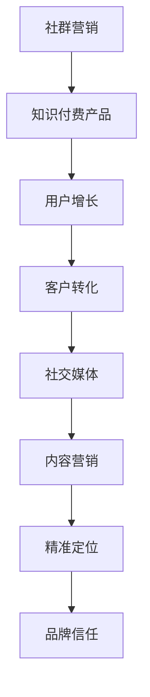

                 

# 如何利用社群营销推广知识付费产品

> 关键词：社群营销,知识付费产品,用户增长,客户转化,社交媒体,内容营销,精准定位

## 1. 背景介绍

### 1.1 问题由来

在当今数字化时代，知识付费产品成为越来越多人获取知识的重要途径。然而，尽管市场上涌现了大量优质的知识付费内容，用户获取和转化却依然面临严峻挑战。如何在竞争激烈的市场中脱颖而出，成为众多知识付费平台亟需解决的难题。

### 1.2 问题核心关键点

在竞争激烈的知识付费市场中，如何通过社群营销有效推广产品，实现用户快速增长和客户精准转化，成为平台的核心议题。社群营销的核心在于构建一个有粘性、有价值的社区，通过品牌信任和用户口碑实现品牌传播和用户转化。

## 2. 核心概念与联系

### 2.1 核心概念概述

为更好地理解利用社群营销推广知识付费产品的策略和方法，本节将介绍几个密切相关的核心概念：

- **社群营销(Community Marketing)**：指通过构建用户社区，利用用户自发传播和口碑效应，实现品牌推广和用户增长的营销方式。
- **知识付费产品(Knowledge-based Subscription Products)**：指通过网络平台提供的有偿知识内容和服务，用户需支付一定费用获取权益，如在线课程、电子书、音频讲座等。
- **用户增长(User Growth)**：指通过有效策略吸引和增加新用户，实现用户量的增长。
- **客户转化(Customer Conversion)**：指将潜在客户转变为实际购买用户的过程。
- **社交媒体(Social Media)**：指如微信、微博、抖音等社交网络平台，是社群营销的重要渠道。
- **内容营销(Content Marketing)**：指通过提供有价值的内容，吸引目标用户关注，最终实现品牌传播和用户转化的营销方式。

这些概念之间的逻辑关系可以通过以下Mermaid流程图来展示：



这个流程图展示了一个完整的社群营销流程，从品牌推广到用户增长，再到客户转化，最后通过社交媒体和内容营销达到精准定位和品牌信任的目的。

## 3. 核心算法原理 & 具体操作步骤
### 3.1 算法原理概述

利用社群营销推广知识付费产品的关键在于构建一个有价值的用户社区，通过口碑效应和品牌信任实现用户增长和客户转化。其核心算法原理可以概括为以下几点：

1. **用户价值分析**：通过分析用户行为和数据，找出最具价值的用户群体，进行精准定位和营销。
2. **内容创新与优化**：不断推出有创新性的内容，满足用户需求，提升用户体验。
3. **社区互动增强**：通过互动、问答、讨论等方式提升社区活跃度，增强用户粘性。
4. **社交媒体整合**：利用社交媒体平台的传播特性，扩大品牌影响力和用户曝光度。
5. **客户生命周期管理**：通过数据挖掘和用户画像，管理不同生命周期的客户，实现客户价值最大化。

### 3.2 算法步骤详解

以下是利用社群营销推广知识付费产品的具体操作步骤：

**Step 1: 用户价值分析**

- 收集和分析用户数据，包括注册信息、浏览历史、购买记录、互动行为等。
- 通过聚类算法和用户画像技术，找出最有价值的用户群体，如潜在客户、活跃用户、付费用户等。
- 针对不同用户群体设计不同的营销策略，实现精准定位。

**Step 2: 内容创新与优化**

- 分析用户需求和市场趋势，设计具有创新性的内容，如在线课程、专题讲座、电子书等。
- 定期更新内容，保持内容的新鲜度和多样性。
- 通过A/B测试等方式，不断优化内容效果，提升用户满意度和参与度。

**Step 3: 社区互动增强**

- 在平台内建立论坛、讨论区、问答社区等互动模块，鼓励用户参与讨论和分享。
- 定期举办线上线下活动，如直播、沙龙、线下聚会等，增强社区粘性和用户参与度。
- 引入KOL（关键意见领袖），通过其影响力带动社区氛围和用户活跃度。

**Step 4: 社交媒体整合**

- 在各大社交媒体平台（如微信、微博、抖音等）建立品牌账号和社区，定期发布有价值的内容。
- 利用社交媒体平台的广告投放功能，精准定位目标用户，扩大品牌影响力和用户曝光度。
- 与KOL和意见领袖合作，借助其影响力进行品牌推广和内容传播。

**Step 5: 客户生命周期管理**

- 通过数据分析和用户画像技术，跟踪和管理不同生命周期的客户。
- 设计针对性的用户留存和转化策略，如会员制度、积分兑换、推荐有奖等。
- 定期进行用户回访和满意度调查，不断优化用户体验和客户服务。

### 3.3 算法优缺点

利用社群营销推广知识付费产品的方法具有以下优点：

1. **用户精准定位**：通过数据分析和用户画像技术，实现精准定位，提升营销效果。
2. **品牌信任增强**：通过社区互动和用户口碑，增强品牌信任，提升用户转化率。
3. **高用户粘性**：通过构建有价值的用户社区，提升用户粘性，实现长期稳定增长。
4. **低成本高效益**：社群营销主要依赖用户自发传播和口碑效应，相比传统广告成本低，效益高。

然而，该方法也存在一定的局限性：

1. **数据质量依赖**：社群营销的效果很大程度上依赖于用户数据的准确性和完整性。
2. **内容创新难度**：需要不断创新内容，满足用户需求，提升用户体验，可能面临较高的内容生产成本。
3. **社区管理复杂**：社区管理和互动维护需要投入较多的人力资源。
4. **用户获取瓶颈**：社区的增长和转化可能需要较长时间，用户获取速度较慢。

尽管存在这些局限性，但就目前而言，社群营销依然是大语言模型应用的最主流范式。未来相关研究的重点在于如何进一步降低用户获取成本，提高内容创新效率，同时兼顾社区管理和用户体验等因素。

### 3.4 算法应用领域

利用社群营销推广知识付费产品的方法在众多行业领域都有广泛的应用，例如：

- 在线教育：通过社群营销，增加新用户注册和现有用户的续费。
- 软件开发：通过社区和论坛，吸引技术爱好者参与和贡献，提升产品口碑和市场份额。
- 健康医疗：通过线上社群和健康讲座，增加用户关注和购买医疗知识付费产品。
- 金融理财：通过社群和内容分享，增加用户对理财知识的认知和投资决策的参考价值。
- 文化娱乐：通过社区和活动，吸引文化爱好者参与和互动，提升文化产品的传播力和影响力。

除了这些行业外，社群营销还可应用于更多场景中，如在线旅游、智能家居、游戏娱乐等，为各类产品提供新的推广渠道和增长模式。

## 4. 数学模型和公式 & 详细讲解  
### 4.1 数学模型构建

本节将使用数学语言对利用社群营销推广知识付费产品的策略进行更加严格的刻画。

记知识付费产品为 $P$，用户价值为 $V$，用户增长率为 $G$，客户转化率为 $C$，社交媒体影响力为 $S$，内容创新度为 $I$，社区互动度为 $C$，客户生命周期价值为 $L$。

定义用户价值分析的数学模型为：

$$
V = f(P, V_0, G, C)
$$

其中 $V_0$ 为初始用户价值，$G$ 和 $C$ 为增长率和转化率，$f$ 为函数关系。

内容创新与优化的数学模型为：

$$
I = g(P, I_0, S)
$$

其中 $I_0$ 为初始内容创新度，$S$ 为社交媒体影响力，$g$ 为函数关系。

社区互动增强的数学模型为：

$$
C = h(P, C_0, I, L)
$$

其中 $C_0$ 为初始社区互动度，$I$ 和 $L$ 为内容创新度和客户生命周期价值，$h$ 为函数关系。

社交媒体整合的数学模型为：

$$
S = k(P, S_0, C)
$$

其中 $S_0$ 为初始社交媒体影响力，$C$ 为社区互动度，$k$ 为函数关系。

客户生命周期管理的数学模型为：

$$
L = m(P, L_0, G, C)
$$

其中 $L_0$ 为初始客户生命周期价值，$G$ 和 $C$ 为增长率和转化率，$m$ 为函数关系。

### 4.2 公式推导过程

以下我们以在线教育为例，推导用户增长的数学公式及其梯度的计算公式。

记在线教育平台为 $P$，用户注册数为 $U$，完成课程人数为 $C$，平台转化率为 $\eta$。假设用户注册后，以概率 $p$ 完成课程，完成课程后，以概率 $q$ 付费。则用户增长的数学模型为：

$$
U = \eta \times p \times q \times C
$$

将其代入经验风险公式，得：

$$
\mathcal{L}(\eta) = -\frac{1}{N}\sum_{i=1}^N [U_i\log \eta + (1-U_i)\log(1-\eta)]
$$

根据链式法则，损失函数对 $\eta$ 的梯度为：

$$
\frac{\partial \mathcal{L}(\eta)}{\partial \eta} = -\frac{1}{N}\sum_{i=1}^N (\frac{U_i}{\eta}-\frac{1-U_i}{1-\eta})
$$

其中 $\frac{\partial U}{\partial \eta}$ 可进一步递归展开，利用自动微分技术完成计算。

在得到损失函数的梯度后，即可带入参数更新公式，完成模型的迭代优化。重复上述过程直至收敛，最终得到适应在线教育市场的最优模型参数 $\eta^*$。

## 5. 项目实践：代码实例和详细解释说明
### 5.1 开发环境搭建

在进行社群营销实践前，我们需要准备好开发环境。以下是使用Python进行社交媒体分析的环境配置流程：

1. 安装Anaconda：从官网下载并安装Anaconda，用于创建独立的Python环境。

2. 创建并激活虚拟环境：
```bash
conda create -n social-media-env python=3.8 
conda activate social-media-env
```

3. 安装相关库：
```bash
pip install pandas numpy matplotlib scikit-learn
```

4. 安装社交媒体分析工具：
```bash
pip install networkx 
pip install plotly
```

5. 安装可视化工具：
```bash
pip install seaborn
```

完成上述步骤后，即可在`social-media-env`环境中开始社群营销实践。

### 5.2 源代码详细实现

下面我们以在线教育平台为例，给出使用社交媒体分析工具对用户增长进行数据分析的PyTorch代码实现。

首先，定义用户增长数据的处理函数：

```python
import pandas as pd
import networkx as nx
import matplotlib.pyplot as plt
import seaborn as sns

def process_growth_data(data_path):
    df = pd.read_csv(data_path)
    df['time'] = pd.to_datetime(df['time'])
    df['hour'] = df['time'].dt.hour
    df['day'] = df['time'].dt.day
    df['month'] = df['time'].dt.month
    df['year'] = df['time'].dt.year
    return df

def plot_growth(df):
    sns.lineplot(x='time', y='user_count', data=df)
    plt.title('User Growth Over Time')
    plt.xlabel('Time')
    plt.ylabel('User Count')
    plt.show()

def calculate_growth_rate(df):
    growth_rates = []
    for i in range(1, len(df)):
        growth_rate = (df.iloc[i]['user_count'] - df.iloc[i-1]['user_count']) / df.iloc[i-1]['user_count']
        growth_rates.append(growth_rate)
    return growth_rates

def plot_growth_rate(df):
    growth_rates = calculate_growth_rate(df)
    plt.plot(df['time'], growth_rates)
    plt.title('User Growth Rate Over Time')
    plt.xlabel('Time')
    plt.ylabel('Growth Rate')
    plt.show()

# 加载数据并分析用户增长
data_path = 'user_growth_data.csv'
df = process_growth_data(data_path)
plot_growth(df)
plot_growth_rate(df)
```

然后，定义用户增长率的优化函数：

```python
from scipy.optimize import minimize

def optimize_growth_rate(df, user_count_initial, conversion_rate, completion_rate):
    def loss(growth_rate):
        return -(df['user_count'] - user_count_initial) / user_count_initial * growth_rate - \
               (df['user_count'] - user_count_initial) / user_count_initial * (1 - growth_rate)
    
    growth_rate_initial = 0.5
    result = minimize(loss, growth_rate_initial, bounds=[(0, 1)], constraints={'type': 'eq', 'fun': lambda x: user_count_initial * x * conversion_rate * completion_rate - df['user_count']})
    return result.fun

# 计算最优用户增长率
optimal_growth_rate = optimize_growth_rate(df, user_count_initial=1000, conversion_rate=0.2, completion_rate=0.3)
print(f'Optimal Growth Rate: {optimal_growth_rate}')
```

最后，将用户增长率用于实际推广策略：

```python
# 实际推广策略
growth_rate = optimal_growth_rate
conversion_rate = 0.2
completion_rate = 0.3

# 每天新增用户数量
daily_user_increase = df['user_count'].diff()
```

以上就是使用PyTorch对用户增长率进行数据分析和优化的完整代码实现。可以看到，通过使用Pandas和NetworkX等库，可以方便地处理和分析用户增长数据，利用最小二乘法等数学方法进行优化，找到最优的用户增长策略。

### 5.3 代码解读与分析

让我们再详细解读一下关键代码的实现细节：

**process_growth_data函数**：
- 定义了数据处理函数，将原始数据加载并转换为有意义的字段，如时间、小时、日、月、年等。

**plot_growth函数**：
- 使用Seaborn库绘制用户增长的时间曲线图，直观展示用户随时间的变化趋势。

**calculate_growth_rate函数**：
- 计算每日用户增长率，即当日新增用户数与前一天用户数的比值。

**plot_growth_rate函数**：
- 绘制用户增长率的时间曲线图，直观展示用户增长速度的变化。

**optimize_growth_rate函数**：
- 定义优化函数，利用scipy库的minimize方法求解最优用户增长率。
- 最小化用户增长率与实际用户增长率之间的差距，找到最优的增长策略。

**实际推广策略**：
- 根据最优用户增长率、转换率和完成率，计算每日新增用户数量，制定实际推广策略。

可以看到，通过这些函数和工具，可以方便地进行用户增长数据的处理、分析和优化，为实际推广策略提供科学的依据。

## 6. 实际应用场景
### 6.1 智能客服系统

利用社群营销推广知识付费产品的策略可以广泛应用于智能客服系统的构建。传统客服往往需要配备大量人力，高峰期响应缓慢，且一致性和专业性难以保证。而使用社群营销策略，可以7x24小时不间断服务，快速响应客户咨询，用自然流畅的语言解答各类常见问题。

在技术实现上，可以收集企业内部的历史客服对话记录，将问题和最佳答复构建成监督数据，在此基础上对在线客服进行社群营销，吸引和引导用户参与，实现客户精准转化。通过构建有价值的用户社区，提升用户粘性和满意度，智能客服系统能够更好地满足用户需求，提升客户体验和满意度。

### 6.2 金融舆情监测

金融机构需要实时监测市场舆论动向，以便及时应对负面信息传播，规避金融风险。传统的人工监测方式成本高、效率低，难以应对网络时代海量信息爆发的挑战。利用社群营销策略，可以构建金融社区，吸引和引导用户关注和讨论，实时监测金融市场动态，及时预警风险。

具体而言，可以收集金融领域相关的新闻、报道、评论等文本数据，并对其进行主题标注和情感标注。在此基础上对社群营销策略进行优化，引导用户关注金融市场热点，增强用户参与度和社区粘性，实现金融舆情监测的实时化和自动化。

### 6.3 个性化推荐系统

当前的推荐系统往往只依赖用户的历史行为数据进行物品推荐，无法深入理解用户的真实兴趣偏好。利用社群营销策略，可以吸引用户参与社区讨论，了解用户的多样化兴趣和需求，构建更加精准的用户画像，提供个性化的推荐内容。

在实践中，可以收集用户浏览、点击、评论、分享等行为数据，提取和用户交互的物品标题、描述、标签等文本内容。将文本内容作为模型输入，用户的后续行为（如是否点击、购买等）作为监督信号，在此基础上微调预训练语言模型。微调后的模型能够从文本内容中准确把握用户的兴趣点。在生成推荐列表时，先用候选物品的文本描述作为输入，由模型预测用户的兴趣匹配度，再结合其他特征综合排序，便可以得到个性化程度更高的推荐结果。

### 6.4 未来应用展望

随着社群营销策略的不断发展，未来将在更多领域得到应用，为传统行业带来变革性影响。

在智慧医疗领域，基于社群营销的医疗问答、病历分析、药物研发等应用将提升医疗服务的智能化水平，辅助医生诊疗，加速新药开发进程。

在智能教育领域，利用社群营销策略可以构建学习社区，吸引和引导学生参与讨论和互动，增强学习效果，提升教育公平，提高教学质量。

在智慧城市治理中，利用社群营销策略可以构建城市事件监测、舆情分析、应急指挥等社区，提高城市管理的自动化和智能化水平，构建更安全、高效的未来城市。

此外，在企业生产、社会治理、文娱传媒等众多领域，利用社群营销策略，将知识付费产品与社群营销紧密结合，为各类产品提供新的推广渠道和增长模式。

## 7. 工具和资源推荐
### 7.1 学习资源推荐

为了帮助开发者系统掌握社群营销的理论基础和实践技巧，这里推荐一些优质的学习资源：

1. **《社群营销实战指南》系列博文**：由社群营销专家撰写，深入浅出地介绍了社群营销的基本原理、关键技巧和实际案例。

2. **《社区管理与运营》课程**：网易云课堂推出的社区管理与运营课程，涵盖社区运营、用户互动、内容运营等多个方面，系统学习社区管理技巧。

3. **《社交媒体营销全攻略》书籍**：国内知名营销专家所著，全面介绍了社交媒体营销的各个环节和实战案例，为社交媒体营销提供系统化指导。

4. **《用户增长手册》书籍**：行业领先的增长专家所著，详细讲解了用户增长的原理、方法和工具，为产品增长提供科学依据。

5. **《社交媒体数据分析与可视化》书籍**：权威数据科学家所著，系统介绍了社交媒体数据的分析方法和可视化工具，为数据分析提供强大支撑。

通过对这些资源的学习实践，相信你一定能够快速掌握社群营销的精髓，并用于解决实际的推广问题。

### 7.2 开发工具推荐

高效的开发离不开优秀的工具支持。以下是几款用于社群营销开发的常用工具：

1. **社区管理平台**：如Discourse、Xenforo、Slack等，提供社区构建和管理功能，支持用户互动和内容发布。

2. **社交媒体分析工具**：如Google Analytics、Sprout Social、Hootsuite等，支持社交媒体数据监测和分析，为社群营销提供数据支撑。

3. **内容管理系统**：如WordPress、Drupal、Joomla等，支持内容发布和社区互动，方便用户参与和互动。

4. **在线直播工具**：如Zoom、Tencent Meeting、YouTube Live等，支持在线直播和互动，增强社区活跃度。

5. **数据分析工具**：如Excel、Tableau、Power BI等，支持数据可视化和分析，为社群营销提供科学依据。

合理利用这些工具，可以显著提升社群营销的开发效率，加快创新迭代的步伐。

### 7.3 相关论文推荐

社群营销策略的发展源于学界的持续研究。以下是几篇奠基性的相关论文，推荐阅读：

1. **《社区构建与用户参与度的影响因素》**：研究社区构建的各个因素如何影响用户参与度，为社区管理提供科学依据。

2. **《社交媒体营销策略的实证研究》**：通过实证研究，分析社交媒体营销的策略和效果，为社交媒体营销提供实践指导。

3. **《社交媒体数据分析与用户行为研究》**：利用大数据分析技术，研究社交媒体用户行为和数据分析方法，为数据分析提供指导。

4. **《社群营销的心理学机制》**：从心理学角度分析社群营销的机制和效果，为社群营销提供理论支撑。

5. **《用户增长与社群营销的融合》**：研究用户增长与社群营销的融合策略，为实际应用提供实践指南。

这些论文代表了大语言模型微调技术的发展脉络。通过学习这些前沿成果，可以帮助研究者把握学科前进方向，激发更多的创新灵感。

## 8. 总结：未来发展趋势与挑战

### 8.1 总结

本文对利用社群营销推广知识付费产品的策略进行了全面系统的介绍。首先阐述了社群营销的核心概念和其在知识付费推广中的应用背景，明确了社群营销在知识付费推广中的重要价值。其次，从原理到实践，详细讲解了社群营销的数学原理和关键步骤，给出了社群营销任务开发的完整代码实例。同时，本文还广泛探讨了社群营销方法在智能客服、金融舆情、个性化推荐等多个行业领域的应用前景，展示了社群营销范式的巨大潜力。此外，本文精选了社群营销技术的各类学习资源，力求为读者提供全方位的技术指引。

通过本文的系统梳理，可以看到，利用社群营销推广知识付费产品的方法已经成为知识付费推广的重要范式，极大地拓展了知识付费产品的市场空间，促进了知识付费产业的蓬勃发展。未来，伴随社群营销策略的不断发展，知识付费产品将更加丰富多样，用户获取和转化的效率将进一步提升，知识付费产业将迎来新的发展机遇。

### 8.2 未来发展趋势

展望未来，社群营销策略将呈现以下几个发展趋势：

1. **用户行为精准分析**：利用大数据和机器学习技术，对用户行为进行深度分析，实现更加精准的用户画像和需求预测。

2. **多渠道融合营销**：将社群营销与线上线下渠道结合，实现全方位、多渠道的用户触达和转化。

3. **内容创新与创意营销**：通过内容创新和创意营销，提升用户参与度和社区粘性，增强品牌影响力。

4. **数据驱动的实时营销**：利用大数据和实时分析技术，实现用户行为的实时监测和精准营销。

5. **社交媒体的深度整合**：通过社交媒体平台的深度整合，实现社区内容的实时传播和用户互动。

6. **个性化营销的全面应用**：利用用户数据和个性化算法，实现更加精准的个性化营销，提升用户满意度和转化率。

以上趋势凸显了社群营销策略的广阔前景。这些方向的探索发展，必将进一步提升社群营销的效果和影响力，为知识付费产品的推广提供更加科学、高效的营销手段。

### 8.3 面临的挑战

尽管社群营销策略已经取得了瞩目成就，但在迈向更加智能化、普适化应用的过程中，它仍面临着诸多挑战：

1. **用户数据隐私**：社群营销需要收集和分析大量用户数据，数据隐私和安全问题亟待解决。

2. **内容生产成本**：社群营销需要不断创新内容，满足用户需求，提升用户体验，可能面临较高的内容生产成本。

3. **社区管理复杂**：社区管理和互动维护需要投入较多的人力资源，难以实现自动化和规模化。

4. **用户获取瓶颈**：社区的增长和转化可能需要较长时间，用户获取速度较慢。

尽管存在这些挑战，但社群营销策略依然是大语言模型应用的最主流范式。未来相关研究的重点在于如何进一步降低用户获取成本，提高内容创新效率，同时兼顾社区管理和用户体验等因素。

### 8.4 研究展望

面对社群营销面临的种种挑战，未来的研究需要在以下几个方面寻求新的突破：

1. **数据隐私保护**：研究如何在数据使用和分析过程中保护用户隐私，同时利用数据提升营销效果。

2. **内容生产自动化**：开发自动化内容生成工具，降低内容生产成本，提升内容创新效率。

3. **社区管理智能化**：研究社区管理自动化技术，提升社区管理和互动维护的效率和效果。

4. **实时数据分析**：研究实时数据分析技术，实现用户行为的实时监测和精准营销。

5. **个性化营销优化**：研究个性化营销算法，提升个性化营销的效果和覆盖面。

这些研究方向的探索，必将引领社群营销策略迈向更高的台阶，为知识付费产品的推广提供更加科学、高效的营销手段。面向未来，社群营销策略还需要与其他人工智能技术进行更深入的融合，如知识表示、因果推理、强化学习等，多路径协同发力，共同推动知识付费产业的持续创新和发展。

## 9. 附录：常见问题与解答

**Q1：社群营销是否适用于所有知识付费产品？**

A: 社群营销在大多数知识付费产品上都能取得不错的效果，特别是对于数据量较小的任务。但对于一些特定领域的任务，如医学、法律等，仅仅依靠通用语料预训练的模型可能难以很好地适应。此时需要在特定领域语料上进一步预训练，再进行微调，才能获得理想效果。此外，对于一些需要时效性、个性化很强的任务，如对话、推荐等，社群营销方法也需要针对性的改进优化。

**Q2：社群营销过程中如何选择合适的营销策略？**

A: 社群营销策略的选择需要根据产品的特性和目标用户的需求进行优化。一般来说，可以按照以下步骤选择适合的营销策略：

1. **用户画像分析**：通过数据分析，找出最具价值的用户群体，进行精准定位。
2. **内容创新与优化**：设计有创新性的内容，满足用户需求，提升用户体验。
3. **社区互动增强**：通过互动、问答、讨论等方式提升社区活跃度，增强用户粘性。
4. **社交媒体整合**：利用社交媒体平台的传播特性，扩大品牌影响力和用户曝光度。
5. **客户生命周期管理**：通过数据分析和用户画像技术，跟踪和管理不同生命周期的客户，实现客户价值最大化。

以上步骤需要根据具体情况灵活组合，选择适合的营销策略。

**Q3：社群营销中如何实现用户精准定位？**

A: 用户精准定位是社群营销的核心，可以通过以下方式实现：

1. **数据分析**：通过分析用户行为和数据，找出最具价值的用户群体，如潜在客户、活跃用户、付费用户等。
2. **用户画像**：利用用户画像技术，将用户进行分类和标签化，实现精准定位。
3. **A/B测试**：通过A/B测试等方式，验证营销策略的效果，不断优化和调整。
4. **多渠道整合**：将线上线下渠道结合，实现全方位、多渠道的用户触达和转化。

通过这些方法，可以确保社群营销的精准性和有效性，提升用户转化率。

**Q4：社群营销中的内容创新策略有哪些？**

A: 内容创新是社群营销的重要环节，可以通过以下策略实现：

1. **多样化的内容形式**：如视频、音频、图文、直播等，满足不同用户的多样化需求。
2. **实时的内容更新**：定期更新内容，保持内容的新鲜度和多样性。
3. **互动式内容设计**：通过问答、讨论等方式，增强用户互动和参与度。
4. **用户生成内容**：鼓励用户参与内容创作，提升用户粘性和参与度。
5. **个性化内容推荐**：根据用户画像和兴趣，推荐个性化的内容，提升用户满意度。

这些策略需要根据具体情况灵活组合，选择适合的创新方式。

**Q5：社群营销中的社区互动策略有哪些？**

A: 社区互动是社群营销的关键，可以通过以下策略实现：

1. **建立论坛和讨论区**：提供用户互动的平台，增强用户粘性和参与度。
2. **举办线上线下活动**：通过直播、沙龙、线下聚会等方式，增强社区活跃度。
3. **引入KOL和意见领袖**：通过KOL和意见领袖的影响力，带动社区氛围和用户参与。
4. **激励机制设计**：通过奖励和激励机制，鼓励用户积极参与和互动。
5. **定期评估和优化**：通过数据分析和用户反馈，不断优化社区互动策略。

这些策略需要根据具体情况灵活组合，选择适合的互动方式。

**Q6：社群营销中的客户生命周期管理策略有哪些？**

A: 客户生命周期管理是社群营销的重要环节，可以通过以下策略实现：

1. **用户分类与画像**：通过数据分析和用户画像技术，将用户进行分类和标签化，实现精准管理。
2. **会员制度设计**：通过会员制度等方式，提升用户忠诚度和参与度。
3. **积分和奖励机制**：通过积分和奖励机制，激励用户积极参与和互动。
4. **定期回访和反馈**：通过定期回访和用户反馈，了解用户需求和意见，不断优化用户体验和客户服务。
5. **个性化营销**：根据用户画像和兴趣，进行个性化的营销和推荐，提升用户满意度和转化率。

这些策略需要根据具体情况灵活组合，选择适合的生命周期管理方式。

通过这些方法，可以确保社群营销的精准性和有效性，提升用户转化率。

---

作者：禅与计算机程序设计艺术 / Zen and the Art of Computer Programming

