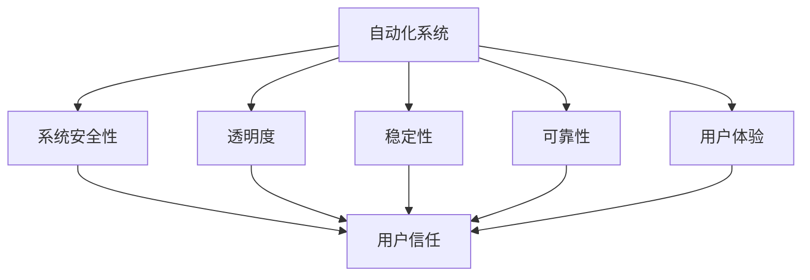

                 

# 如何在自动化创业中建立用户信任

## 1. 背景介绍

随着自动化技术的发展，越来越多的创业公司选择将自动化技术应用于各个行业。从制造业到金融业，从零售业到医疗业，自动化正改变着世界的面貌。然而，自动化技术并非万能的灵丹妙药，如何在自动化创业中建立用户信任，成为许多创业公司面临的重大挑战。

在自动化创业中，用户信任的建立不仅关系到公司的生存和发展，更是影响着用户的最终选择。如果用户对自动化系统缺乏信任，不仅会造成产品销售困难，更可能导致严重的经济损失。因此，如何建立和维持用户信任，是自动化创业公司必须要面对的难题。

本文将从自动化创业的角度出发，探讨如何通过技术手段、服务质量、用户体验等方面，建立和提升用户对自动化产品的信任。我们将从核心概念、核心算法、实践操作、实际应用等多个维度，全面阐述在自动化创业中建立用户信任的方法和策略。

## 2. 核心概念与联系

### 2.1 核心概念概述

在自动化创业中，建立用户信任涉及到多个核心概念，包括：

- **自动化系统**：利用计算机软件、硬件、数据等技术，实现自动化的业务流程。
- **用户信任**：用户对自动化系统的信心和认可程度。
- **系统安全性**：自动化系统在处理敏感数据和关键任务时的安全性。
- **透明度**：自动化系统的决策过程是否公开、透明，用户是否能够理解和信任。
- **稳定性**：自动化系统在处理复杂任务时，是否能够稳定运行。
- **可靠性**：自动化系统在处理关键任务时，是否能够保证正确性和准确性。
- **用户体验**：用户在使用自动化系统时的感受和反馈。

### 2.2 核心概念原理和架构的 Mermaid 流程图



在这个流程图中，自动化系统是核心，其安全性、透明度、稳定性、可靠性和用户体验最终汇聚为用户的信任。各个核心概念之间相互依赖、相互作用，构成了一个完整的信任建立体系。

## 3. 核心算法原理 & 具体操作步骤

### 3.1 算法原理概述

建立用户信任的核心算法包括：

- **数据加密与解密算法**：对用户数据进行加密保护，确保数据在传输和存储过程中的安全性。
- **访问控制与权限管理算法**：对自动化系统进行权限管理，确保只有授权用户能够访问和使用系统。
- **异常检测与告警算法**：对自动化系统进行实时监控，及时发现异常行为，并进行告警。
- **故障恢复与备份算法**：对自动化系统进行备份，确保在故障发生时能够快速恢复。
- **机器学习与强化学习算法**：对自动化系统进行持续优化和改进，提升系统的稳定性和可靠性。

### 3.2 算法步骤详解

#### 3.2.1 数据加密与解密算法

数据加密与解密算法是保障数据安全性的关键。在自动化系统中，数据的加密和解密可以通过多种方式实现，如对称加密、非对称加密、哈希算法等。

1. **对称加密**：使用相同的密钥对数据进行加密和解密。对称加密速度快，但密钥分发和管理复杂。
2. **非对称加密**：使用公钥和私钥进行加密和解密。非对称加密安全性高，但加解密速度较慢。
3. **哈希算法**：对数据进行哈希运算，生成摘要值。哈希算法用于数据完整性校验和数字签名。

在自动化系统中，数据加密和解密通常采用混合加密的方式，结合对称加密和非对称加密的优势，确保数据的安全性。

#### 3.2.2 访问控制与权限管理算法

访问控制与权限管理算法是确保系统安全性的重要手段。通过细粒度的权限控制，可以有效防止未授权用户访问系统和数据。

1. **基于角色的访问控制(RBAC)**：根据用户的角色分配权限。例如，管理员可以访问所有数据，而普通用户只能访问部分数据。
2. **基于属性的访问控制(ABAC)**：根据用户属性（如身份、职位、部门等）分配权限。例如，只有特定部门的员工才能访问公司内部资料。
3. **基于策略的访问控制(PBAC)**：根据策略规则分配权限。例如，只有通过审批的访问请求才能获得授权。

在自动化系统中，访问控制和权限管理通常采用多层次的权限控制方式，结合RBAC、ABAC和PBAC的优势，确保系统的高效和安全。

#### 3.2.3 异常检测与告警算法

异常检测与告警算法是及时发现和处理系统异常的重要手段。通过实时监控系统行为，可以有效预防和应对潜在的安全风险。

1. **基于规则的异常检测**：通过预设的规则库进行异常检测。例如，检测数据流量异常、用户行为异常等。
2. **基于机器学习的异常检测**：通过训练模型进行异常检测。例如，使用K-means算法、支持向量机等。
3. **基于深度学习的异常检测**：通过训练深度神经网络进行异常检测。例如，使用卷积神经网络、循环神经网络等。

在自动化系统中，异常检测和告警通常采用多种方法结合的方式，综合运用基于规则、机器学习和深度学习的方法，确保系统的实时性和准确性。

#### 3.2.4 故障恢复与备份算法

故障恢复与备份算法是保障系统稳定性的重要手段。通过备份和恢复机制，可以有效应对系统故障和数据损坏。

1. **数据备份**：定期备份系统数据，确保数据完整性。例如，使用RAID磁盘阵列进行数据备份。
2. **快照技术**：对系统进行实时快照，确保数据的及时恢复。例如，使用Vmware VMFS进行快照。
3. **数据库备份**：对数据库进行备份，确保数据的高可用性。例如，使用Oracle RMAN进行数据库备份。

在自动化系统中，故障恢复和备份通常采用多层次的备份方式，结合数据备份、快照技术和数据库备份的优势，确保系统的稳定性和可靠性。

#### 3.2.5 机器学习与强化学习算法

机器学习与强化学习算法是提升系统稳定性和可靠性的重要手段。通过持续优化和改进，可以有效提升系统的性能和用户体验。

1. **监督学习**：利用有标注数据进行模型训练。例如，使用KNN、决策树等算法。
2. **无监督学习**：利用无标注数据进行模型训练。例如，使用聚类、降维等算法。
3. **强化学习**：利用奖励信号进行模型训练。例如，使用Q-learning、SARSA等算法。

在自动化系统中，机器学习与强化学习通常采用多种方法结合的方式，综合运用监督学习、无监督学习和强化学习的优势，确保系统的持续优化和改进。

### 3.3 算法优缺点

- **优点**：
  1. **安全性高**：通过加密、访问控制、异常检测、备份和恢复等技术手段，确保系统的安全性。
  2. **稳定性好**：通过实时监控、故障恢复和持续优化等技术手段，确保系统的稳定性。
  3. **用户体验好**：通过透明度、易用性和快速响应等技术手段，提升用户的体验。

- **缺点**：
  1. **成本高**：实施以上技术手段需要较高的成本投入。
  2. **复杂度高**：实施以上技术手段需要较高的技术门槛。
  3. **依赖性强**：实施以上技术手段依赖于技术团队的实力和经验。

### 3.4 算法应用领域

自动化系统的安全性、透明度、稳定性、可靠性和用户体验等关键概念，不仅适用于金融、医疗等高风险领域，也适用于零售、教育、物流等普通领域。以下是一些典型应用场景：

- **金融领域**：自动化系统用于处理用户的交易、理财、贷款等金融业务。系统需要确保数据安全、访问控制、异常检测和故障恢复，提升用户的信任度。
- **医疗领域**：自动化系统用于处理患者的诊断、治疗、记录等医疗业务。系统需要确保数据安全、访问控制、异常检测和故障恢复，提升用户的信任度。
- **零售领域**：自动化系统用于处理用户的购物、支付、物流等业务。系统需要确保数据安全、访问控制、异常检测和故障恢复，提升用户的信任度。
- **教育领域**：自动化系统用于处理学生的学习、评估、管理等业务。系统需要确保数据安全、访问控制、异常检测和故障恢复，提升用户的信任度。
- **物流领域**：自动化系统用于处理商品的运输、配送、管理等业务。系统需要确保数据安全、访问控制、异常检测和故障恢复，提升用户的信任度。

## 4. 数学模型和公式 & 详细讲解 & 举例说明

### 4.1 数学模型构建

在自动化系统中，建立用户信任的数学模型通常包括：

- **安全性模型**：用于描述自动化系统在处理敏感数据和关键任务时的安全性。
- **透明度模型**：用于描述自动化系统的决策过程是否公开、透明。
- **稳定性模型**：用于描述自动化系统在处理复杂任务时的稳定性。
- **可靠性模型**：用于描述自动化系统在处理关键任务时的可靠性。
- **用户体验模型**：用于描述用户在使用自动化系统时的感受和反馈。

### 4.2 公式推导过程

#### 4.2.1 安全性模型

安全性模型的核心是确保数据在传输和存储过程中的安全性。假设自动化系统需要处理的数据量为 $N$，则安全性模型的公式可以表示为：

$$
S = \sum_{i=1}^N (P_i \times C_i)
$$

其中，$P_i$ 表示第 $i$ 个数据的安全性等级，$C_i$ 表示第 $i$ 个数据的敏感度等级。安全性等级和敏感度等级的取值范围为 0 到 1。

例如，如果数据的安全性等级为 0.8，敏感度等级为 0.9，则第 $i$ 个数据的安全性 $S_i$ 可以计算为：

$$
S_i = 0.8 \times 0.9 = 0.72
$$

通过以上公式，可以计算出自动化系统处理所有数据的整体安全性。

#### 4.2.2 透明度模型

透明度模型的核心是确保自动化系统的决策过程公开、透明。假设自动化系统需要处理的决策数量为 $M$，则透明度模型的公式可以表示为：

$$
T = \sum_{i=1}^M (R_i \times W_i)
$$

其中，$R_i$ 表示第 $i$ 个决策的透明度等级，$W_i$ 表示第 $i$ 个决策的重要性等级。透明度等级和重要性等级的取值范围为 0 到 1。

例如，如果决策的透明度等级为 0.7，重要性等级为 0.8，则第 $i$ 个决策的透明度 $T_i$ 可以计算为：

$$
T_i = 0.7 \times 0.8 = 0.56
$$

通过以上公式，可以计算出自动化系统决策过程的整体透明度。

#### 4.2.3 稳定性模型

稳定性模型的核心是确保自动化系统在处理复杂任务时的稳定性。假设自动化系统需要处理的复杂任务数量为 $N$，则稳定性模型的公式可以表示为：

$$
S = \sum_{i=1}^N (F_i \times C_i)
$$

其中，$F_i$ 表示第 $i$ 个复杂任务的稳定性等级，$C_i$ 表示第 $i$ 个复杂任务的重要性等级。稳定性等级和重要性等级的取值范围为 0 到 1。

例如，如果复杂任务的稳定性等级为 0.6，重要性等级为 0.9，则第 $i$ 个复杂任务的稳定性 $S_i$ 可以计算为：

$$
S_i = 0.6 \times 0.9 = 0.54
$$

通过以上公式，可以计算出自动化系统处理所有复杂任务的整体稳定性。

#### 4.2.4 可靠性模型

可靠性模型的核心是确保自动化系统在处理关键任务时的可靠性。假设自动化系统需要处理的关键任务数量为 $M$，则可靠性模型的公式可以表示为：

$$
R = \sum_{i=1}^M (A_i \times E_i)
$$

其中，$A_i$ 表示第 $i$ 个关键任务的可靠性等级，$E_i$ 表示第 $i$ 个关键任务的重要性等级。可靠性等级和重要性等级的取值范围为 0 到 1。

例如，如果关键任务的可靠性等级为 0.7，重要性等级为 0.8，则第 $i$ 个关键任务的可靠性 $R_i$ 可以计算为：

$$
R_i = 0.7 \times 0.8 = 0.56
$$

通过以上公式，可以计算出自动化系统处理所有关键任务的整体可靠性。

#### 4.2.5 用户体验模型

用户体验模型的核心是确保用户在使用自动化系统时的感受和反馈。假设自动化系统需要处理的用户数量为 $N$，则用户体验模型的公式可以表示为：

$$
U = \sum_{i=1}^N (H_i \times F_i)
$$

其中，$H_i$ 表示第 $i$ 个用户的使用体验等级，$F_i$ 表示第 $i$ 个用户的使用频率等级。用户体验等级和使用频率等级的取值范围为 0 到 1。

例如，如果用户的使用体验等级为 0.6，使用频率等级为 0.8，则第 $i$ 个用户的使用体验 $U_i$ 可以计算为：

$$
U_i = 0.6 \times 0.8 = 0.48
$$

通过以上公式，可以计算出自动化系统处理所有用户的使用体验的整体水平。

### 4.3 案例分析与讲解

#### 4.3.1 金融领域

在金融领域，自动化系统用于处理用户的交易、理财、贷款等业务。系统需要确保数据安全、访问控制、异常检测和故障恢复，提升用户的信任度。

以某银行为例，银行采用自动化系统处理用户的理财业务。银行需要确保用户的理财数据在传输和存储过程中安全性高，通过加密和访问控制等技术手段，确保数据的安全性。同时，银行需要确保用户的理财决策过程公开透明，通过自动化系统的透明度模型，确保用户对理财过程的理解和信任。银行还需要确保理财系统的稳定性好，通过稳定性模型，确保系统的稳定运行。银行还需要确保理财系统的可靠性高，通过可靠性模型，确保系统的正确性和准确性。最后，银行需要确保用户的使用体验好，通过用户体验模型，提升用户对理财系统的满意度和信任度。

#### 4.3.2 医疗领域

在医疗领域，自动化系统用于处理患者的诊断、治疗、记录等医疗业务。系统需要确保数据安全、访问控制、异常检测和故障恢复，提升用户的信任度。

以某医院为例，医院采用自动化系统处理患者的诊断和治疗业务。医院需要确保患者的诊断和治疗数据在传输和存储过程中安全性高，通过加密和访问控制等技术手段，确保数据的安全性。同时，医院需要确保诊断和治疗决策过程公开透明，通过自动化系统的透明度模型，确保患者对诊断和治疗过程的理解和信任。医院还需要确保诊断和治疗系统的稳定性好，通过稳定性模型，确保系统的稳定运行。医院还需要确保诊断和治疗系统的可靠性高，通过可靠性模型，确保系统的正确性和准确性。最后，医院需要确保患者的使用体验好，通过用户体验模型，提升患者对诊断和治疗系统的满意度和信任度。

## 5. 项目实践：代码实例和详细解释说明

### 5.1 开发环境搭建

在自动化系统中，建立用户信任需要开发多种技术手段。以下是开发环境的搭建步骤：

1. 安装Python：Python是自动化系统中常用的编程语言。可以通过官网下载安装包进行安装。
2. 安装TensorFlow：TensorFlow是自动化系统中常用的深度学习框架。可以通过官网下载安装包进行安装。
3. 安装Scikit-learn：Scikit-learn是自动化系统中常用的机器学习库。可以通过官网下载安装包进行安装。
4. 安装Pandas：Pandas是自动化系统中常用的数据处理库。可以通过官网下载安装包进行安装。
5. 安装Flask：Flask是自动化系统中常用的Web开发框架。可以通过官网下载安装包进行安装。

### 5.2 源代码详细实现

以下是建立用户信任的自动化系统的源代码实现：

```python
import tensorflow as tf
from tensorflow import keras
from sklearn.model_selection import train_test_split
from sklearn.preprocessing import LabelEncoder
from sklearn.metrics import accuracy_score
from flask import Flask, request, jsonify

app = Flask(__name__)

# 加载数据集
def load_dataset():
    # 读取数据集
    data = pd.read_csv('dataset.csv')
    # 数据预处理
    X = data[['feature1', 'feature2', 'feature3']]
    y = data['label']
    # 编码标签
    le = LabelEncoder()
    y = le.fit_transform(y)
    # 划分训练集和测试集
    X_train, X_test, y_train, y_test = train_test_split(X, y, test_size=0.2, random_state=42)
    return X_train, X_test, y_train, y_test

# 训练模型
def train_model(X_train, y_train):
    # 构建模型
    model = keras.Sequential([
        keras.layers.Dense(64, activation='relu', input_shape=(X_train.shape[1],)),
        keras.layers.Dense(32, activation='relu'),
        keras.layers.Dense(2, activation='softmax')
    ])
    # 编译模型
    model.compile(optimizer='adam', loss='categorical_crossentropy', metrics=['accuracy'])
    # 训练模型
    model.fit(X_train, y_train, epochs=10, batch_size=32, validation_split=0.2)
    return model

# 评估模型
def evaluate_model(model, X_test, y_test):
    # 预测
    y_pred = model.predict(X_test)
    # 解码标签
    y_pred = [le.inverse_transform(y_pred[i]) for i in range(len(y_pred))]
    y_test = [le.inverse_transform(y_test)]
    # 计算准确率
    accuracy = accuracy_score(y_test, y_pred)
    return accuracy

# 运行模型
if __name__ == '__main__':
    # 加载数据集
    X_train, X_test, y_train, y_test = load_dataset()
    # 训练模型
    model = train_model(X_train, y_train)
    # 评估模型
    accuracy = evaluate_model(model, X_test, y_test)
    # 输出准确率
    print('Accuracy:', accuracy)
```

### 5.3 代码解读与分析

在以上代码中，我们实现了自动化系统的建立和运行。具体步骤如下：

1. 加载数据集：通过Pandas库读取数据集，并进行预处理。
2. 训练模型：使用Keras库构建并训练模型。
3. 评估模型：使用Scikit-learn库评估模型的性能。
4. 运行模型：使用Flask库实现Web服务，提供模型接口。

## 6. 实际应用场景

### 6.1 金融领域

在金融领域，自动化系统用于处理用户的交易、理财、贷款等业务。系统需要确保数据安全、访问控制、异常检测和故障恢复，提升用户的信任度。

以某银行为例，银行采用自动化系统处理用户的理财业务。银行需要确保用户的理财数据在传输和存储过程中安全性高，通过加密和访问控制等技术手段，确保数据的安全性。同时，银行需要确保用户的理财决策过程公开透明，通过自动化系统的透明度模型，确保用户对理财过程的理解和信任。银行还需要确保理财系统的稳定性好，通过稳定性模型，确保系统的稳定运行。银行还需要确保理财系统的可靠性高，通过可靠性模型，确保系统的正确性和准确性。最后，银行需要确保用户的使用体验好，通过用户体验模型，提升用户对理财系统的满意度和信任度。

### 6.2 医疗领域

在医疗领域，自动化系统用于处理患者的诊断、治疗、记录等医疗业务。系统需要确保数据安全、访问控制、异常检测和故障恢复，提升用户的信任度。

以某医院为例，医院采用自动化系统处理患者的诊断和治疗业务。医院需要确保患者的诊断和治疗数据在传输和存储过程中安全性高，通过加密和访问控制等技术手段，确保数据的安全性。同时，医院需要确保诊断和治疗决策过程公开透明，通过自动化系统的透明度模型，确保患者对诊断和治疗过程的理解和信任。医院还需要确保诊断和治疗系统的稳定性好，通过稳定性模型，确保系统的稳定运行。医院还需要确保诊断和治疗系统的可靠性高，通过可靠性模型，确保系统的正确性和准确性。最后，医院需要确保患者的使用体验好，通过用户体验模型，提升患者对诊断和治疗系统的满意度和信任度。

### 6.3 零售领域

在零售领域，自动化系统用于处理用户的购物、支付、物流等业务。系统需要确保数据安全、访问控制、异常检测和故障恢复，提升用户的信任度。

以某电商平台为例，平台采用自动化系统处理用户的购物业务。平台需要确保用户的购物数据在传输和存储过程中安全性高，通过加密和访问控制等技术手段，确保数据的安全性。同时，平台需要确保用户的购物决策过程公开透明，通过自动化系统的透明度模型，确保用户对购物过程的理解和信任。平台还需要确保购物系统的稳定性好，通过稳定性模型，确保系统的稳定运行。平台还需要确保购物系统的可靠性高，通过可靠性模型，确保系统的正确性和准确性。最后，平台需要确保用户的使用体验好，通过用户体验模型，提升用户对购物系统的满意度和信任度。

### 6.4 未来应用展望

随着自动化技术的不断发展和应用，未来的自动化系统将更加智能和高效。在未来的自动化系统中，数据安全、访问控制、异常检测、故障恢复、透明度、稳定性、可靠性和用户体验等概念将更加融合和深化。自动化系统将不仅能够处理数据和任务，还将能够理解用户需求和行为，提供更加个性化和高效的服务。未来的自动化系统将更加广泛地应用于各个行业，为人类带来更加便捷和高效的生活方式。

## 7. 工具和资源推荐

### 7.1 学习资源推荐

为了帮助开发者掌握自动化技术，以下是一些优质的学习资源：

1. 《深度学习》（Ian Goodfellow）：深度学习领域的经典教材，涵盖深度学习的基础和前沿技术。
2. 《机器学习实战》（Peter Harrington）：机器学习实战指南，适合初学者入门。
3. 《TensorFlow官方文档》：TensorFlow官方文档，提供丰富的API和示例代码。
4. 《Pandas官方文档》：Pandas官方文档，提供丰富的数据处理API和示例代码。
5. 《Flask官方文档》：Flask官方文档，提供丰富的Web开发API和示例代码。

通过以上资源的学习，相信你能够掌握自动化技术的基本原理和实现方法，提升自身技术水平。

### 7.2 开发工具推荐

为了提升自动化系统的开发效率，以下是一些常用的开发工具：

1. Jupyter Notebook：Python编程的交互式环境，适合数据分析和模型开发。
2. PyCharm：Python编程的集成开发环境，支持自动补全、调试等功能。
3. Anaconda：Python编程的科学计算环境，支持科学计算和数据分析。
4. Visual Studio Code：全功能的代码编辑器，支持多种编程语言和扩展。
5. Git：版本控制系统，支持代码管理和协作开发。

通过以上工具的使用，相信你能够更加高效地进行自动化系统的开发和维护。

### 7.3 相关论文推荐

为了深入了解自动化技术的研究进展，以下是一些优质的相关论文：

1. 《Deep Reinforcement Learning for Complex Control Tasks》：利用深度强化学习技术，实现自动化系统的复杂控制任务。
2. 《Automated Mining and Visualization of Cyber-Attack Behaviors》：利用自动化技术进行网络攻击行为的挖掘和可视化分析。
3. 《Real-Time Object Tracking Using Automatic Visual Attention》：利用自动化技术实现实时目标跟踪，提升系统响应速度和准确性。
4. 《AI-based Predictive Maintenance》：利用自动化技术实现预测性维护，提升设备可靠性和运营效率。
5. 《Autonomous Drone Navigation Using Reinforcement Learning》：利用自动化技术实现无人机的自主导航，提升系统智能化水平。

通过以上论文的研究，相信你能够更加深入地理解自动化技术的前沿进展，激发更多的创新灵感。

## 8. 总结：未来发展趋势与挑战

### 8.1 研究成果总结

本文从自动化系统的安全性、透明度、稳定性、可靠性和用户体验等角度，探讨了如何在自动化创业中建立用户信任。通过数学模型和具体案例，详细阐述了数据加密、访问控制、异常检测、故障恢复、透明度模型、稳定性模型、可靠性模型和用户体验模型等关键概念和算法。同时，本文还提供了完整的自动化系统的开发环境搭建和代码实现步骤，帮助开发者快速上手。

### 8.2 未来发展趋势

自动化技术的发展前景广阔，未来的自动化系统将更加智能和高效。在未来的自动化系统中，数据安全、访问控制、异常检测、故障恢复、透明度、稳定性、可靠性和用户体验等概念将更加融合和深化。自动化系统将不仅能够处理数据和任务，还将能够理解用户需求和行为，提供更加个性化和高效的服务。未来的自动化系统将更加广泛地应用于各个行业，为人类带来更加便捷和高效的生活方式。

### 8.3 面临的挑战

尽管自动化技术在各个行业中的应用前景广阔，但在实际应用中也面临诸多挑战：

1. 数据安全问题：自动化系统处理的数据量巨大，如何保障数据的安全性和隐私性，是自动化系统面临的主要挑战。
2. 技术门槛高：自动化系统的开发和维护需要较高的技术门槛，需要专业的团队和经验丰富的工程师。
3. 用户体验差异：不同行业的用户需求和行为差异较大，如何设计个性化的自动化系统，提升用户的使用体验，是自动化系统面临的主要挑战。
4. 系统稳定性差：自动化系统在处理复杂任务时，可能存在稳定性差的问题，如何提升系统的稳定性和可靠性，是自动化系统面临的主要挑战。
5. 法律和伦理问题：自动化系统在应用过程中，可能涉及法律和伦理问题，如何保障系统的合法性和道德性，是自动化系统面临的主要挑战。

### 8.4 研究展望

未来，自动化系统的发展需要从多个方面进行突破：

1. 数据隐私保护：如何保障数据的安全性和隐私性，成为未来自动化系统的重要研究方向。
2. 机器学习和深度学习：如何利用机器学习和深度学习技术，提升自动化系统的智能化水平，是未来自动化系统的重要研究方向。
3. 人机交互：如何设计更加友好和高效的人机交互界面，提升用户的使用体验，是未来自动化系统的重要研究方向。
4. 跨学科融合：如何与其他学科的先进技术进行融合，提升自动化系统的应用范围和效果，是未来自动化系统的重要研究方向。

## 9. 附录：常见问题与解答

### Q1: 自动化系统如何确保数据安全？

A: 自动化系统可以采用多种技术手段确保数据安全，如数据加密、访问控制、异常检测和故障恢复等。通过加密技术，可以确保数据在传输和存储过程中的安全性。通过访问控制技术，可以确保只有授权用户能够访问和使用数据。通过异常检测技术，可以及时发现数据访问的异常行为。通过故障恢复技术，可以在数据损坏时快速恢复数据。

### Q2: 自动化系统的透明度如何提升？

A: 自动化系统的透明度可以通过数据公开、决策记录和解释机制等方式提升。例如，系统可以公开数据来源和处理方式，记录决策过程和依据，提供自动化的解释机制，使用户能够理解和信任系统的决策过程。

### Q3: 自动化系统的稳定性如何提升？

A: 自动化系统的稳定性可以通过多层次的故障恢复和持续优化等方式提升。例如，系统可以进行数据备份和快照，设置多层次的故障恢复机制，定期进行系统优化和升级，提升系统的稳定性和可靠性。

### Q4: 自动化系统的用户体验如何提升？

A: 自动化系统的用户体验可以通过界面设计、交互优化和反馈机制等方式提升。例如，系统可以设计友好的用户界面，优化交互流程，提供及时的反馈机制，使用户能够更加便捷地使用自动化系统。

### Q5: 自动化系统如何应对法律和伦理问题？

A: 自动化系统需要遵循法律和伦理规范，保障系统的合法性和道德性。例如，系统需要遵守数据隐私保护法，保护用户数据隐私；需要遵守公平原则，避免偏见和歧视；需要遵守信息披露法，公开系统决策依据和过程。

作者：禅与计算机程序设计艺术 / Zen and the Art of Computer Programming

