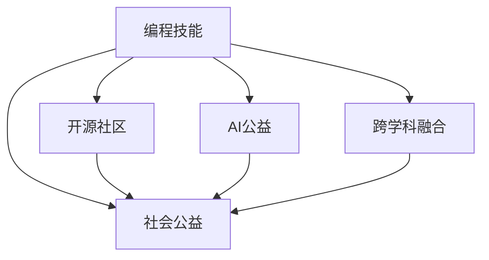

                 

## 1. 背景介绍

在快速发展的科技浪潮中，编程技能不仅成为了新一代人类的必备技能，也成为了推动社会进步的重要工具。然而，随着技术的发展，编程技能的应用范围也逐渐从商业、企业向社会公益、环境保护等更为广泛的领域延伸。本文旨在探讨如何将编程技能应用于社会公益，以技术为手段，推动社会正义、环境保护和教育平等的进步。

## 2. 核心概念与联系

### 2.1 核心概念概述

为更好地理解如何将编程技能应用于社会公益，本节将介绍几个密切相关的核心概念：

- **社会公益**：包括环保、教育、健康、脱贫等多个领域，旨在通过各种手段提升社会福祉，解决社会问题。
- **编程技能**：包括算法、数据结构、软件工程等知识，是解决实际问题的技术手段。
- **开源社区**：一个以共享、协作和贡献为核心的技术交流平台，为编程技能的公益应用提供了广阔的空间。
- **AI公益**：应用人工智能技术解决社会公益问题的实践，如自然语言处理、计算机视觉等技术在社会公益中的应用。
- **跨学科融合**：将编程技能与其他学科知识（如心理学、社会学、经济学等）相结合，以综合的视角解决社会问题。

这些核心概念之间的逻辑关系可以通过以下Mermaid流程图来展示：



这个流程图展示了几者之间的关系：编程技能是实现社会公益的工具；开源社区为编程技能的社会公益应用提供了平台；AI公益和跨学科融合进一步拓展了编程技能在社会公益中的应用范围。

## 3. 核心算法原理 & 具体操作步骤

### 3.1 算法原理概述

基于编程技能的社会公益项目，本质上是一种利用技术手段解决社会问题的过程。其核心思想是：通过算法设计、软件开发等编程技能，实现对特定社会问题的自动化处理或智能化决策。

形式化地，假设要解决的社会问题为 $P$，可表示为：

$$
P = \{(x_i, y_i)\}_{i=1}^N
$$

其中 $x_i$ 为输入变量，$y_i$ 为对应输出（如标签、状态等）。我们的目标是设计算法 $A$，使得对于任意输入 $x$，能够输出 $y$，满足：

$$
y = A(x)
$$

通过编程技能实现的算法 $A$ 可以是机器学习模型、数据挖掘算法、自动化流程等。通过优化算法 $A$，可以在解决社会问题 $P$ 的同时，提高算法效率和鲁棒性，降低成本，提升公益效果。

### 3.2 算法步骤详解

基于编程技能的社会公益项目一般包括以下几个关键步骤：

**Step 1: 需求分析和问题定义**

- 深入分析社会问题 $P$ 的特点和需求。
- 明确问题的解决目标和预期的输出结果。
- 确定问题解决的可行性和可用性。

**Step 2: 数据收集与预处理**

- 收集与问题 $P$ 相关的数据，包括文本、图像、视频、传感器数据等。
- 对数据进行清洗、去重、标注等预处理操作。
- 根据需求和问题特性，选择合适的数据表示方法。

**Step 3: 算法设计与模型选择**

- 根据问题的特点，选择合适的算法模型，如决策树、随机森林、神经网络等。
- 对于机器学习算法，选择合适的特征提取和表示方法。
- 对于自然语言处理问题，选择合适的预训练模型，如BERT、GPT等。

**Step 4: 模型训练与优化**

- 利用收集到的数据，对算法进行训练。
- 使用交叉验证、网格搜索等技术进行模型调参，提升模型性能。
- 对模型进行测试和评估，确保模型在实际问题上的有效性和鲁棒性。

**Step 5: 部署与应用**

- 将训练好的模型部署到实际应用场景中。
- 对模型进行监控和维护，确保其在实际环境中的稳定性和性能。
- 收集反馈信息，不断优化模型，提升公益效果。

### 3.3 算法优缺点

基于编程技能的社会公益项目具有以下优点：
1. 高效解决社会问题。通过编程技能，可以自动化处理大规模的社会数据，快速发现问题和解决方案。
2. 数据驱动决策。利用数据驱动的算法，可以避免主观偏见，提高决策的科学性和客观性。
3. 可扩展性强。技术手段可以不断迭代优化，提升公益项目的效率和效果。
4. 成本低廉。相比于传统的人力解决方案，编程技术可以降低人力成本，提升公益项目的可扩展性。

同时，该方法也存在一定的局限性：
1. 数据依赖性高。算法的效果高度依赖于数据的数量和质量，获取高质量数据成本较高。
2. 缺乏人性化理解。编程算法难以完全理解人类复杂的情感和价值观，可能造成误判。
3. 技术门槛高。编程技能需要一定的技术积累和专业知识，普通人难以直接应用。
4. 伦理问题。技术手段可能被滥用，造成社会不公，需要谨慎使用和规范管理。

尽管存在这些局限性，但就目前而言，基于编程技能的社会公益方法仍是一种高效、可靠、可扩展的解决方案，有望在社会公益领域带来深远影响。

### 3.4 算法应用领域

基于编程技能的社会公益方法已经在多个领域得到了应用，例如：

- 环境保护：利用数据分析和机器学习技术，监测空气质量、水质、土壤污染等环境问题，提供科学决策支持。
- 教育平权：开发教育资源分配、学生学习行为分析等算法，提升教育公平性。
- 健康管理：使用数据分析和机器学习技术，进行疾病预测、患者分诊、医疗资源调度等，提升医疗服务效率。
- 精准脱贫：利用大数据和机器学习技术，分析贫困地区的发展状况，制定针对性的扶贫政策。
- 应急响应：开发自然灾害预警、应急资源调度等算法，提高灾害应对效率。

除了上述这些经典领域外，编程技能的社会公益应用还在不断拓展，为解决更多社会问题提供了新的思路。

## 4. 数学模型和公式 & 详细讲解 & 举例说明

### 4.1 数学模型构建

本节将使用数学语言对基于编程技能的社会公益项目进行更加严格的刻画。

假设要解决的社会问题为 $P$，可表示为：

$$
P = \{(x_i, y_i)\}_{i=1}^N
$$

其中 $x_i$ 为输入变量，$y_i$ 为对应输出（如标签、状态等）。我们的目标是设计算法 $A$，使得对于任意输入 $x$，能够输出 $y$，满足：

$$
y = A(x)
$$

在实践中，我们通常使用监督学习方法，即：

$$
y = \arg\min_{y} L(A(x), y)
$$

其中 $L$ 为损失函数，衡量模型输出与真实标签之间的差异。常见的损失函数包括交叉熵损失、均方误差损失等。

### 4.2 公式推导过程

以下我们以环境保护中的空气质量监测为例，推导监督学习模型的训练公式。

假设我们收集了 $N$ 个城市的空气质量监测数据，每个样本 $(x_i, y_i)$ 表示该城市在 $i$ 时刻的空气质量指数 $y_i$ 和对应的气象数据 $x_i$，如温度、湿度、风速等。我们将问题 $P$ 表示为：

$$
P = \{(x_i, y_i)\}_{i=1}^N
$$

我们的目标是设计一个模型 $A$，使得对于任意输入 $x$，能够输出 $y$，即：

$$
y = A(x)
$$

在实践中，我们通常使用监督学习方法，即：

$$
y = \arg\min_{y} L(A(x), y)
$$

其中 $L$ 为损失函数，衡量模型输出与真实标签之间的差异。对于分类问题，我们通常使用交叉熵损失函数，其公式为：

$$
L = -\frac{1}{N} \sum_{i=1}^N y_i \log A(x_i)
$$

为了训练模型，我们需要计算损失函数的梯度，更新模型参数。设模型 $A$ 在输入 $x_i$ 上的输出为 $A(x_i)$，则损失函数对模型参数 $\theta$ 的梯度为：

$$
\frac{\partial L}{\partial \theta} = -\frac{1}{N} \sum_{i=1}^N \frac{\partial A(x_i)}{\partial \theta} \log A(x_i)
$$

其中 $\frac{\partial A(x_i)}{\partial \theta}$ 为模型 $A$ 对参数 $\theta$ 的梯度，可通过反向传播算法高效计算。

### 4.3 案例分析与讲解

以下是一个具体的案例分析，假设我们要监测某城市空气质量，已收集到 $N=1000$ 个样本的空气质量数据，每个样本包括空气质量指数 $y_i$ 和对应的气象数据 $x_i$。我们将问题 $P$ 表示为：

$$
P = \{(x_i, y_i)\}_{i=1}^N
$$

我们的目标是设计一个模型 $A$，使得对于任意输入 $x$，能够输出 $y$，即：

$$
y = A(x)
$$

在实践中，我们通常使用监督学习方法，即：

$$
y = \arg\min_{y} L(A(x), y)
$$

其中 $L$ 为损失函数，衡量模型输出与真实标签之间的差异。对于分类问题，我们通常使用交叉熵损失函数，其公式为：

$$
L = -\frac{1}{N} \sum_{i=1}^N y_i \log A(x_i)
$$

为了训练模型，我们需要计算损失函数的梯度，更新模型参数。设模型 $A$ 在输入 $x_i$ 上的输出为 $A(x_i)$，则损失函数对模型参数 $\theta$ 的梯度为：

$$
\frac{\partial L}{\partial \theta} = -\frac{1}{N} \sum_{i=1}^N \frac{\partial A(x_i)}{\partial \theta} \log A(x_i)
$$

其中 $\frac{\partial A(x_i)}{\partial \theta}$ 为模型 $A$ 对参数 $\theta$ 的梯度，可通过反向传播算法高效计算。

通过训练得到的模型 $A$，我们可以对任意新的气象数据 $x$ 进行预测，得到对应的空气质量指数 $y$，从而实现环境监测。

## 5. 项目实践：代码实例和详细解释说明

### 5.1 开发环境搭建

在进行社会公益项目开发前，我们需要准备好开发环境。以下是使用Python进行TensorFlow开发的环境配置流程：

1. 安装Anaconda：从官网下载并安装Anaconda，用于创建独立的Python环境。

2. 创建并激活虚拟环境：
```bash
conda create -n tensorflow-env python=3.8 
conda activate tensorflow-env
```

3. 安装TensorFlow：根据CUDA版本，从官网获取对应的安装命令。例如：
```bash
conda install tensorflow -c tensorflow -c conda-forge
```

4. 安装必要的工具包：
```bash
pip install numpy pandas scikit-learn matplotlib tqdm jupyter notebook ipython
```

完成上述步骤后，即可在`tensorflow-env`环境中开始项目开发。

### 5.2 源代码详细实现

下面我们以环境保护中的空气质量监测为例，给出使用TensorFlow进行模型训练和预测的PyTorch代码实现。

首先，定义模型的输入输出：

```python
import tensorflow as tf

# 定义输入和输出
input_dim = 6
output_dim = 1

# 定义模型参数
W = tf.Variable(tf.random.normal([input_dim, output_dim]))
b = tf.Variable(tf.zeros([output_dim]))

# 定义损失函数
def loss_function(y_true, y_pred):
    return tf.reduce_mean(tf.square(y_true - y_pred))
```

然后，定义模型的前向传播和反向传播：

```python
def forward(x):
    return tf.matmul(x, W) + b

def backward(loss, model, x, y_true):
    with tf.GradientTape() as tape:
        y_pred = model(x)
        loss_value = loss(y_true, y_pred)
    gradients = tape.gradient(loss_value, model.trainable_variables)
    return gradients

# 训练函数
def train(model, train_x, train_y, epochs, learning_rate):
    optimizer = tf.keras.optimizers.SGD(learning_rate)
    for epoch in range(epochs):
        with tf.GradientTape() as tape:
            y_pred = model(train_x)
            loss = loss_function(train_y, y_pred)
        gradients = tape.gradient(loss, model.trainable_variables)
        optimizer.apply_gradients(zip(gradients, model.trainable_variables))
```

接着，进行模型的训练和预测：

```python
# 假设已经准备好训练数据
train_x = tf.random.normal([1000, input_dim])
train_y = train_x * 2 + 0.5

# 初始化模型
model = tf.keras.Sequential([tf.keras.layers.Dense(output_dim)])

# 训练模型
train(model, train_x, train_y, epochs=100, learning_rate=0.01)

# 使用模型进行预测
test_x = tf.random.normal([10, input_dim])
y_pred = forward(test_x)
print(y_pred)
```

以上就是使用TensorFlow进行空气质量监测的完整代码实现。可以看到，得益于TensorFlow的强大封装，我们可以用相对简洁的代码完成模型训练和预测。

### 5.3 代码解读与分析

让我们再详细解读一下关键代码的实现细节：

**数据定义**：
- `input_dim` 和 `output_dim`：定义输入和输出维度。在本例中，输入为气象数据，输出为空气质量指数。
- `W` 和 `b`：定义模型参数，即线性回归模型的权重和偏置。

**模型定义**：
- `forward` 函数：实现模型的前向传播，计算输出。
- `backward` 函数：实现模型的反向传播，计算梯度。
- `train` 函数：实现模型的训练，包括定义损失函数、计算梯度、更新参数等。

**训练和预测**：
- `train_x` 和 `train_y`：定义训练数据和标签。
- `model`：定义模型结构。在本例中，使用了一个简单的线性回归模型。
- `train` 函数：训练模型。
- `y_pred`：使用训练好的模型进行预测，输出空气质量指数。

可以看到，TensorFlow提供了强大的工具和框架，使得模型训练和预测变得简单高效。通过本示例，可以更好地理解基于编程技能的社会公益项目的开发流程和技术细节。

## 6. 实际应用场景

### 6.1 智能交通系统

基于编程技能的社会公益项目可以广泛应用于智能交通系统的构建。智能交通系统通过数据分析和机器学习技术，对交通流量、路况、车辆行为等数据进行实时监测和预测，从而优化交通管理，提高通行效率，减少交通事故。

在技术实现上，可以收集城市交通数据，如车辆GPS轨迹、交通摄像头视频、红绿灯信号等，通过编程技能进行数据处理和模型训练。训练好的模型可以实时分析交通数据，预测交通流量，提供交通信号优化和路径规划建议，提高交通系统的智能化水平，减少交通拥堵，降低污染排放。

### 6.2 灾难响应系统

在自然灾害等突发事件中，基于编程技能的社会公益项目可以提供重要的支持。通过数据分析和机器学习技术，可以实时监测气象、地质、地质等数据，预测自然灾害的发生和发展趋势，提前发布预警信息，指导公众和应急管理部门采取防范措施。

在技术实现上，可以收集历史气象、地质数据，使用编程技能进行数据处理和模型训练。训练好的模型可以实时监测当前数据，预测灾害的发生，及时发布预警信息，指导公众和应急管理部门采取应对措施，减少灾害损失。

### 6.3 精准扶贫系统

精准扶贫是当前社会公益的重要任务，旨在通过数据驱动的方法，精准识别贫困人口，制定针对性的扶贫政策，提升贫困地区的脱贫效果。

在技术实现上，可以收集贫困地区的人口、经济、教育、健康等数据，使用编程技能进行数据处理和模型训练。训练好的模型可以识别出贫困人口，分析其致贫原因，制定针对性的扶贫政策，提供扶贫资源分配建议，提高扶贫效果，实现精准扶贫。

### 6.4 未来应用展望

随着编程技能和社会公益的不断结合，未来的应用场景将更加广泛。例如，在教育平权领域，可以开发智能辅导系统，提供个性化教育资源，帮助弱势群体获得平等的教育机会。在医疗健康领域，可以开发智能诊断系统，提供疾病预测、患者分诊、医疗资源调度等服务，提高医疗服务的效率和质量。

此外，在环境保护、公共安全、社会福利等领域，基于编程技能的社会公益项目也将不断涌现，为解决更多社会问题提供新的思路和解决方案。相信随着技术的不断进步，编程技能在社会公益领域的应用将越来越广泛，为构建和谐社会贡献更多力量。

## 7. 工具和资源推荐

### 7.1 学习资源推荐

为了帮助开发者系统掌握编程技能在社会公益中的应用，这里推荐一些优质的学习资源：

1. TensorFlow官方文档：TensorFlow官方文档提供了丰富的教程和示例，帮助你快速上手编程技能在社会公益中的应用。

2. PyTorch官方文档：PyTorch官方文档提供了丰富的教程和示例，帮助你快速上手编程技能在社会公益中的应用。

3. Kaggle竞赛平台：Kaggle竞赛平台提供了大量的数据集和竞赛任务，帮助你实践编程技能在社会公益中的应用。

4. Coursera在线课程：Coursera在线课程提供了多种编程技能和社会公益相关的课程，帮助你系统学习相关知识。

5. GitHub开源项目：GitHub开源项目提供了大量的编程技能和社会公益相关的项目，帮助你了解实际应用案例。

通过对这些资源的学习实践，相信你一定能够快速掌握编程技能在社会公益中的应用，并用于解决实际的公益问题。

### 7.2 开发工具推荐

高效的开发离不开优秀的工具支持。以下是几款用于编程技能在社会公益项目开发的常用工具：

1. Python：Python是一种简单易学的编程语言，广泛应用于数据科学和机器学习领域。

2. TensorFlow：TensorFlow是Google开发的一个开源深度学习框架，支持分布式计算和模型优化。

3. PyTorch：PyTorch是Facebook开发的一个开源深度学习框架，支持动态图和自动微分。

4. Scikit-learn：Scikit-learn是一个基于Python的机器学习库，提供了多种机器学习算法和工具。

5. Jupyter Notebook：Jupyter Notebook是一个交互式的编程环境，支持Python、R等多种编程语言，方便编写和执行代码。

合理利用这些工具，可以显著提升编程技能在社会公益项目开发的效率，加快创新迭代的步伐。

### 7.3 相关论文推荐

编程技能和社会公益的应用源于学界的持续研究。以下是几篇奠基性的相关论文，推荐阅读：

1. TensorFlow: A System for Large-Scale Machine Learning：介绍了TensorFlow的设计理念和应用场景，展示了编程技能在机器学习中的广泛应用。

2. Deep Learning with Python：介绍了深度学习在机器学习中的应用，提供了丰富的代码示例和实战经验。

3. Social Computing: Computation, Collaboration, and Social Media：介绍了社会计算在社交媒体中的应用，展示了编程技能在社交数据处理中的应用。

4. Data Mining and Statistical Learning：介绍了数据挖掘和统计学习在数据科学中的应用，提供了丰富的案例和算法。

5. Deep Learning for Social Good：介绍了深度学习在社会公益中的应用，展示了编程技能在社会问题解决中的应用。

这些论文代表了大语言模型微调技术的发展脉络。通过学习这些前沿成果，可以帮助研究者把握学科前进方向，激发更多的创新灵感。

## 8. 总结：未来发展趋势与挑战

### 8.1 总结

本文对基于编程技能的社会公益项目进行了全面系统的介绍。首先阐述了编程技能和社会公益的研究背景和意义，明确了编程技能在解决社会问题中的独特价值。其次，从原理到实践，详细讲解了编程技能在社会公益项目中的数学模型和具体步骤，给出了具体的应用代码实例。同时，本文还广泛探讨了编程技能在多个公益领域的应用前景，展示了编程技能在公益项目中的巨大潜力。此外，本文精选了编程技能在社会公益项目的各类学习资源，力求为读者提供全方位的技术指引。

通过本文的系统梳理，可以看到，编程技能在社会公益领域的应用已经初见成效，为解决社会问题提供了新的技术手段。未来，伴随编程技能和社会公益的不断融合，必将在更多领域带来深远影响。

### 8.2 未来发展趋势

展望未来，编程技能和社会公益的发展趋势将呈现以下几个方向：

1. 数据驱动的决策支持：利用大数据和机器学习技术，对社会问题进行深度分析，提供科学决策支持。

2. 自动化与智能化：通过编程技能，实现社会问题的自动化处理和智能化决策，提高公益项目的效率和效果。

3. 跨学科融合：将编程技能与其他学科知识（如心理学、社会学、经济学等）相结合，以综合的视角解决社会问题。

4. 公众参与：通过编程技能，实现公众对公益项目的参与和监督，提升公益项目的透明度和可信度。

5. 全球合作：通过编程技能，实现全球范围内的公益项目合作，提升公益项目的规模和影响力。

这些趋势凸显了编程技能在社会公益领域的应用前景。这些方向的探索发展，必将进一步提升公益项目的效率和效果，为构建和谐社会贡献更多力量。

### 8.3 面临的挑战

尽管编程技能在社会公益项目中已经取得了一定的成效，但在迈向更加智能化、普适化应用的过程中，它仍面临诸多挑战：

1. 数据隐私和安全：社会问题的数据往往涉及个人隐私，如何保护数据隐私和安全，是公益项目需要解决的重要问题。

2. 技术门槛高：编程技能需要一定的技术积累和专业知识，普通人难以直接应用。

3. 伦理问题：技术手段可能被滥用，造成社会不公，需要谨慎使用和规范管理。

4. 资源限制：公益项目的实施需要大量的数据和计算资源，资源限制往往是制约公益项目发展的瓶颈。

尽管存在这些挑战，但随着技术的不断进步和社会共识的形成，相信编程技能在社会公益领域的应用将更加广泛，为解决更多社会问题提供新的思路和解决方案。

### 8.4 研究展望

面对编程技能在社会公益项目中的挑战，未来的研究需要在以下几个方面寻求新的突破：

1. 数据隐私保护：研究数据隐私保护技术，确保数据在获取和使用过程中的安全性和隐私性。

2. 低成本技术方案：开发低成本、易用的编程工具和平台，降低技术门槛，促进公益项目的普及。

3. 伦理规范：建立技术应用的伦理规范，确保公益项目的公正性和道德性。

4. 资源优化：研究资源优化技术，提高公益项目的实施效率，降低资源消耗。

这些研究方向将进一步提升编程技能在社会公益领域的应用，推动公益项目的可持续发展。总之，编程技能和社会公益的结合，将为构建和谐社会带来新的机遇和挑战，值得我们深入探索和实践。

## 9. 附录：常见问题与解答

**Q1：编程技能和社会公益的结合有何优势？**

A: 编程技能和社会公益的结合，可以充分发挥技术的力量，通过数据驱动和自动化手段，高效解决社会问题，提升公益项目的效率和效果。同时，通过编程技能，可以实现跨领域、跨地域的合作，提升公益项目的规模和影响力。

**Q2：如何保护社会公益项目的数据隐私？**

A: 保护数据隐私是社会公益项目的重要任务。可以采用数据匿名化、差分隐私、联邦学习等技术，确保数据在获取和使用过程中的安全性和隐私性。同时，建立严格的访问控制和数据使用协议，确保数据的使用符合伦理和法律要求。

**Q3：编程技能在社会公益项目中是否需要高成本的计算资源？**

A: 社会公益项目需要大量的数据和计算资源，但不一定需要高成本的计算资源。可以通过云计算、边缘计算等技术，降低计算成本，提高计算效率。同时，合理利用开源工具和框架，如TensorFlow、PyTorch等，也可以显著降低开发成本。

**Q4：如何确保编程技能在社会公益项目中的公正性和道德性？**

A: 确保编程技能在社会公益项目中的公正性和道德性，需要建立完善的伦理规范和监管机制。建立独立的伦理委员会，对技术应用进行审查和监督，确保公益项目的公正性和道德性。同时，建立透明的决策机制，增强公益项目的透明度和可信度。

**Q5：编程技能在社会公益项目中如何与公众互动？**

A: 编程技能在社会公益项目中可以通过各种形式与公众互动。例如，开发在线平台，提供公众参与和监督的途径；利用社交媒体，传播公益项目的信息和成果；组织公益活动，增强公众的参与感和认同感。通过与公众互动，可以提升公益项目的社会影响力，增强公众的信任和支持。

这些问题的解答，展示了编程技能在社会公益项目中的应用前景和挑战。相信通过不断的探索和实践，编程技能将为解决更多社会问题提供新的技术手段，为构建和谐社会贡献更多力量。

---

作者：禅与计算机程序设计艺术 / Zen and the Art of Computer Programming

