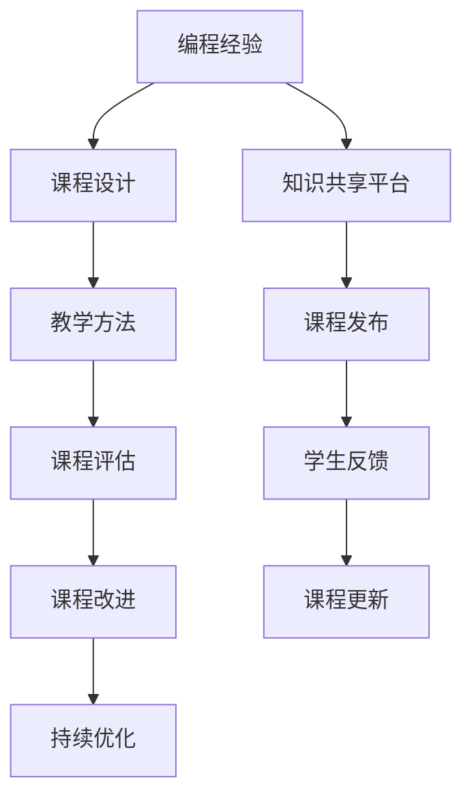

                 

# 如何将编程经验转化为高价值课程

> 关键词：编程经验,课程开发,软件开发,教学方法,编程实践

## 1. 背景介绍

随着软件工程技术的不断发展，越来越多的开发人员积累了丰富的编程经验。这些经验不仅对于解决特定问题至关重要，更能够帮助初学者快速掌握编程技巧，提高开发效率。然而，如何系统地将这些编程经验转化为高价值的教学内容，是众多开发者面临的一大挑战。

本文章将全面探讨将编程经验转化为高价值课程的策略和技巧，从课程设计、教学方法、课程评估等多个方面，深入分析如何更好地传播知识、提升教学效果。

## 2. 核心概念与联系

### 2.1 核心概念概述

为了更好地理解如何将编程经验转化为高价值课程，我们需要了解以下关键概念：

- 编程经验(Programming Experience): 指开发者在实际软件开发过程中积累的知识、技巧、教训等。这些经验通常是经验丰富开发者智慧的结晶，是快速提高开发者技能的重要资源。
- 课程设计(Course Design): 指将知识结构化、系统化的过程。课程设计需要考虑课程目标、内容安排、教学方法等多个方面。
- 教学方法(Teaching Method): 指实现课程目标的方法，如讲授、实践、讨论等。不同的教学方法能够满足不同学习需求，提升教学效果。
- 课程评估(Course Evaluation): 指衡量课程设计、教学方法、学习效果等是否达到预期目标的过程。课程评估能够帮助识别问题并改进教学过程。

### 2.2 核心概念原理和架构的 Mermaid 流程图



该流程图展示了编程经验转化为高价值课程的基本流程：

1. **编程经验** 是课程设计的基础。
2. **课程设计** 将经验结构化，决定课程目标和内容。
3. **教学方法** 根据课程设计选择合适的教学方式。
4. **课程评估** 衡量教学效果，指导课程改进。
5. **课程改进** 根据评估结果调整课程内容和方法。
6. **持续优化** 确保课程保持高效和实用。
7. **知识共享平台** 提供课程分享和发布渠道。
8. **课程发布** 将课程提供给更多学习者。
9. **学生反馈** 收集学习者反馈，用于课程更新。
10. **课程更新** 根据反馈优化课程内容。

这个流程架构帮助我们理解如何将编程经验转化为课程，并且不断改进以提供更高的教育价值。

## 3. 核心算法原理 & 具体操作步骤

### 3.1 算法原理概述

将编程经验转化为高价值课程的核心算法原理可以概括为：

1. **知识提取**：从编程经验中提取核心知识和技能。
2. **结构化设计**：将提取的知识结构化，设计合理的课程结构。
3. **多样化教学**：采用多种教学方法，帮助不同学习者吸收知识。
4. **持续反馈优化**：通过学习者反馈不断调整和优化课程内容。

### 3.2 算法步骤详解

以下是详细的算法步骤：

#### 3.2.1 知识提取

1. **回顾和总结**：开发者需要系统回顾自己在软件开发过程中遇到的问题、解决的方法和技巧。记录下重要的编程技巧、设计模式、工具使用、常见错误等。
2. **分类整理**：将这些经验按照主题分类，如代码优化、错误处理、性能调优、项目管理等。
3. **编写文档**：将整理好的经验编写成文档或代码片段，便于后续参考和复用。

#### 3.2.2 结构化设计

1. **确定目标**：明确课程的目标和受众，例如是面向初级开发者还是中级开发者。
2. **设计课程框架**：基于编程经验，设计课程的总体结构，包括章节、知识点、案例分析等。
3. **细化内容**：将每个章节细化成具体的知识点，并选择合适的教材和参考资料。

#### 3.2.3 多样化教学

1. **理论讲授**：通过系统讲解编程概念、原理和最佳实践，帮助学习者建立扎实的理论基础。
2. **实战练习**：通过编写代码、调试错误等方式，让学习者亲身体验编程过程，提升实际操作能力。
3. **案例分析**：通过实际项目案例，展示代码的编写和优化过程，帮助学习者理解复杂问题解决。
4. **互动讨论**：组织学习者进行讨论和交流，解答疑惑，分享经验，提升学习互动性。

#### 3.2.4 持续反馈优化

1. **收集反馈**：通过问卷调查、课后评论、在线互动等方式收集学习者的反馈。
2. **分析反馈**：分析反馈内容，找出课程中的问题和不足之处。
3. **改进调整**：根据反馈对课程内容、教学方法进行改进，优化课程设计。
4. **迭代更新**：不断迭代更新课程，保持内容的前沿性和实用性。

### 3.3 算法优缺点

#### 3.3.1 优点

1. **提升教学质量**：通过结构化和多样化的教学方法，确保课程内容的全面性和深入性。
2. **提高学习效率**：学习者能够通过具体案例和实践，快速掌握编程技巧和工具。
3. **满足多样化需求**：不同的教学方法能够适应不同学习者的学习风格和需求。
4. **持续改进优化**：通过持续反馈和优化，课程内容不断提升，保持高效。

#### 3.3.2 缺点

1. **时间和精力投入大**：知识提取、课程设计、教学方法选择等都需要大量时间和精力。
2. **课程更新复杂**：需要根据反馈持续调整和更新课程内容，更新过程可能较为复杂。
3. **个性化需求不足**：课程设计可能会忽略部分学习者的个性化需求，需要进一步优化。
4. **教学效果难以衡量**：评估教学效果需要多维度的指标和工具，难以单一量化。

### 3.4 算法应用领域

将编程经验转化为高价值课程的方法，不仅适用于软件开发领域，还适用于其他技术培训、在线教育等多个场景。

1. **软件开发培训**：为软件开发初学者、中级开发者提供编程技巧和经验分享。
2. **技术讲习班**：为技术爱好者、专业开发者提供深入的技术探讨和案例分析。
3. **在线课程**：通过知识共享平台发布课程，提供广泛的学习资源。
4. **企业内部培训**：帮助企业员工提升技术水平，推动企业技术创新。

## 4. 数学模型和公式 & 详细讲解 & 举例说明

### 4.1 数学模型构建

我们将课程设计看作一个优化问题，目标函数为课程效果最大化，约束条件包括学习者的反馈、课程内容和教学方法等。

设 $C$ 为课程效果，$X$ 为课程内容，$Y$ 为教学方法，$Z$ 为学习者反馈。

目标函数为：

$$
\max C = \sum_{i=1}^{n} \text{课程内容质量} \times \text{教学方法效果} - \sum_{i=1}^{m} \text{学习者反馈} 
$$

其中 $n$ 为课程内容项数，$m$ 为学习者反馈项数。

### 4.2 公式推导过程

根据上述目标函数，可以推导出优化课程设计的基本步骤：

1. **定义课程内容质量**：通过编程经验提取的知识点的重要性和实用性来定义课程内容的质量。
2. **定义教学方法效果**：通过教学互动、反馈等指标来定义教学方法的效果。
3. **定义学习者反馈**：通过调查问卷、评论等收集学习者对课程的反馈。
4. **优化目标函数**：根据上述定义调整目标函数，最大化课程效果。

### 4.3 案例分析与讲解

假设我们有一门面向初级开发者的Python编程课程。通过知识提取，我们选择了以下知识点：

1. Python基础语法和数据结构。
2. 面向对象编程和设计模式。
3. Web框架和API开发。

通过结构化设计，我们将课程设计为以下几个章节：

1. 基础语法和数据结构
2. 面向对象编程
3. Web框架和API开发
4. 项目实践

在多样化教学中，我们采用以下教学方法：

1. 理论讲授：每个章节先系统讲解相关知识点。
2. 实战练习：每个知识点后安排实际编程练习。
3. 案例分析：每个章节分析实际项目案例，展示知识点应用。
4. 互动讨论：课后组织学习者进行交流和讨论。

最后，通过收集学习者的反馈，不断改进课程内容和方法，确保课程效果最大化。

## 5. 项目实践：代码实例和详细解释说明

### 5.1 开发环境搭建

为了进行课程开发，需要搭建一个支持多种编程语言和教学方法的开发环境。

1. **选择开发环境**：建议使用Python语言和Jupyter Notebook环境，支持多种代码演示和互动讨论。
2. **安装相关库**：安装必要的Python库和教学工具，如Numpy、Pandas、Jupyter等。
3. **配置环境**：配置开发环境，包括代码编辑器、IDE、服务器等。

### 5.2 源代码详细实现

以下是一个简单的Python编程课程示例，包括基础语法和数据结构讲解、实战练习和案例分析：

```python
# 基础语法和数据结构讲解
def greetings():
    print("Hello, welcome to Python programming course!")
    
# 实战练习
def basic_operations():
    a = 10
    b = 20
    print(a + b)
    print(a * b)
    print(a ** b)
    
# 案例分析
def print_list():
    fruits = ["apple", "banana", "orange"]
    for fruit in fruits:
        print(fruit)
```

在Jupyter Notebook中，可以对上述代码进行互动演示：

```python
# 基础语法和数据结构讲解
greetings()

# 实战练习
basic_operations()

# 案例分析
print_list()
```

### 5.3 代码解读与分析

在Jupyter Notebook中，通过Markdown和代码块，可以清晰地展示代码和演示结果。

1. **Markdown格式**：用于编写课程内容，如标题、段落、代码块等。
2. **代码块**：展示和解释具体的Python代码。
3. **输出结果**：展示代码执行结果，便于学习者理解和调试。

### 5.4 运行结果展示

通过Jupyter Notebook，可以直观展示代码的运行结果和演示过程，便于学习者理解和实践。

```
Hello, welcome to Python programming course!
30
200
10000000000000000000000000000000000
apple
banana
orange
```

## 6. 实际应用场景

### 6.1 企业内部培训

企业内部培训中，可以使用编程经验转化为高价值课程，提升员工技术水平，推动企业技术创新。

#### 6.1.1 需求分析

根据企业需求，确定培训目标和内容，如新技术引入、工具使用、项目管理等。

#### 6.1.2 课程设计

设计具体的课程框架和内容，确保课程能够满足员工的需求。

#### 6.1.3 教学实施

通过企业内部平台或线下培训，开展课程教学。

#### 6.1.4 效果评估

通过考核、项目评审等方式，评估培训效果，进行持续改进。

### 6.2 在线教育

在线教育平台可以提供广泛的编程课程资源，帮助学习者系统学习编程知识。

#### 6.2.1 课程开发

开发者可以将编程经验转化为高质量课程，发布到在线平台。

#### 6.2.2 课程推广

通过广告、社交媒体等方式，推广课程，吸引更多学习者。

#### 6.2.3 用户反馈

收集学习者的反馈，不断改进和优化课程内容。

#### 6.2.4 持续更新

定期更新课程内容，保持课程的前沿性和实用性。

### 6.3 技术讲习班

技术讲习班可以提供深入的技术探讨和案例分析，促进技术交流和合作。

#### 6.3.1 技术选择

选择有技术深度和广度的课程内容，如大数据、人工智能、云计算等。

#### 6.3.2 讲师邀请

邀请行业专家和资深开发者担任讲师，进行技术分享。

#### 6.3.3 互动讨论

组织学习者进行互动讨论，解决疑难问题，分享经验。

#### 6.3.4 实践项目

通过实际项目案例，展示技术的实际应用，提升学习者的实战能力。

## 7. 工具和资源推荐

### 7.1 学习资源推荐

为了帮助开发者系统掌握编程经验转化为高价值课程的理论基础和实践技巧，推荐以下学习资源：

1. **《深入理解计算机系统》**：经典操作系统和计算机体系结构教材，帮助开发者理解编程基础。
2. **《Python编程：从入门到实践》**：详细介绍Python编程语言的实战案例，适合初学者和进阶学习者。
3. **Coursera和edX**：提供广泛的编程和计算机科学课程，涵盖不同层次和技术栈。
4. **Stack Overflow和GitHub**：丰富的编程资源和社区交流平台，帮助开发者解决问题和分享经验。
5. **HackerRank和LeetCode**：提供编程挑战和实战练习，提升编程技能和实战能力。

通过这些资源的学习，开发者可以深入理解编程经验的核心概念和实际应用，掌握课程设计、教学方法等技巧。

### 7.2 开发工具推荐

为确保编程经验转化为高价值课程的开发顺利进行，推荐以下开发工具：

1. **PyCharm**：专业的Python IDE，支持代码编写、调试和版本控制等功能。
2. **Jupyter Notebook**：强大的交互式编程环境，支持Markdown和代码块混合使用。
3. **Git**：版本控制工具，便于代码管理和协作。
4. **GitHub**：代码托管平台，方便团队协作和共享。
5. **Zoom和Webex**：在线会议工具，支持远程教学和互动讨论。

这些工具能够提供开发所需的各类功能，支持高效的教学和互动。

### 7.3 相关论文推荐

编程经验转化为高价值课程的研究和实践需要广泛参考相关论文，推荐以下经典文献：

1. **《构建有效的在线课程：教学模式和策略的探索》**：探讨在线课程设计和教学模式，提供具体案例和实践经验。
2. **《编程教育：从基础到高级》**：详细介绍编程教育方法和教学实践，涵盖基础编程、项目管理和高级技术等。
3. **《知识共享与在线课程：最佳实践与未来趋势》**：分析知识共享平台和在线课程的设计与优化策略。
4. **《软件开发教育：实践与挑战》**：探讨软件开发教育的挑战和解决方案，提供丰富的案例和实践经验。
5. **《大规模在线课程的成功要素》**：分析MOOC成功的关键要素，提供可操作的实践建议。

通过学习这些前沿成果，开发者可以更好地理解编程经验转化为高价值课程的理论基础和实践方法。

## 8. 总结：未来发展趋势与挑战

### 8.1 总结

本文全面探讨了如何将编程经验转化为高价值课程的策略和技巧。从知识提取、课程设计、教学方法、课程评估等多个方面，深入分析了如何将编程经验系统化、结构化和多样化地转化为课程内容。通过丰富的案例分析和实际应用场景，展现了编程经验转化为高价值课程的实际效果和应用前景。

## 8.2 未来发展趋势

展望未来，编程经验转化为高价值课程将呈现以下几个发展趋势：

1. **个性化学习**：随着人工智能和机器学习技术的发展，未来的课程将能够根据学习者的个性化需求，提供定制化的教学内容。
2. **实时反馈**：通过大数据分析和机器学习，实现对学习者学习行为的实时监测和反馈，提升学习效果。
3. **跨学科融合**：未来的课程将不再局限于单一技术领域，而是跨学科融合，涵盖更多的知识和技能。
4. **全球化推广**：通过互联网和移动平台，编程课程将更加普及和广泛应用，支持全球学习者的学习。
5. **虚拟现实和增强现实**：利用虚拟现实和增强现实技术，提供更加沉浸式和互动的学习体验。

### 8.3 面临的挑战

尽管编程经验转化为高价值课程取得了一定进展，但在实践中仍面临诸多挑战：

1. **内容同质化**：许多课程内容高度同质化，缺乏创新和差异化。
2. **教学效果评估**：如何科学评估课程教学效果，仍需进一步研究和探索。
3. **学习者多样性**：不同学习者的背景、需求和学习方式不同，课程设计需要兼顾多样性。
4. **技术更新快**：编程技术更新迅速，课程内容需要不断更新以保持前沿性。
5. **师资力量不足**：高水平的讲师和专家相对较少，难以满足大规模教学需求。

### 8.4 研究展望

未来的研究需要在以下几个方面寻求新的突破：

1. **智能课程设计**：利用人工智能技术，自动化生成和优化课程内容，提升课程设计效率和质量。
2. **混合学习模式**：结合在线学习、线下培训和实践项目，提供多样化的学习模式，满足不同学习需求。
3. **游戏化教学**：利用游戏化设计，增强学习者的互动性和参与度，提升学习效果。
4. **社会化学习**：通过学习社区和合作平台，促进学习者之间的交流和协作，提升学习效率。
5. **知识图谱与推荐系统**：构建知识图谱和推荐系统，提供个性化和智能化的学习推荐。

## 9. 附录：常见问题与解答

### Q1：如何将编程经验转化为课程内容？

A: 将编程经验转化为课程内容需要系统回顾和总结编程过程，提取核心知识和技能，并结构化设计课程。具体步骤如下：

1. **回顾和总结**：回顾自己在软件开发过程中遇到的问题、解决的方法和技巧，记录下重要的编程技巧、设计模式、工具使用、常见错误等。
2. **分类整理**：将这些经验按照主题分类，如代码优化、错误处理、性能调优、项目管理等。
3. **编写文档**：将整理好的经验编写成文档或代码片段，便于后续参考和复用。

### Q2：如何选择合适的教学方法？

A: 选择合适的教学方法需要考虑学习者的背景和课程目标。以下是常用的教学方法：

1. **理论讲授**：系统讲解编程概念、原理和最佳实践，帮助学习者建立扎实的理论基础。
2. **实战练习**：编写代码、调试错误等方式，让学习者亲身体验编程过程，提升实际操作能力。
3. **案例分析**：分析实际项目案例，展示代码的编写和优化过程，帮助学习者理解复杂问题解决。
4. **互动讨论**：组织学习者进行讨论和交流，解答疑惑，分享经验，提升学习互动性。

### Q3：如何评估课程效果？

A: 评估课程效果需要多维度的指标和工具，以下是常用的评估方法：

1. **考核成绩**：通过考试、作业等方式，评估学习者的知识掌握情况。
2. **项目评审**：通过实际项目案例，评估学习者的实战能力和问题解决能力。
3. **学习反馈**：通过问卷调查、课后评论等方式，收集学习者的反馈，评估课程设计和教学方法的效果。
4. **学习进度**：通过学习平台的数据分析，评估学习者的学习进度和参与度。

通过持续反馈和优化，可以不断提升课程效果，满足学习者的需求。

---

作者：禅与计算机程序设计艺术 / Zen and the Art of Computer Programming

