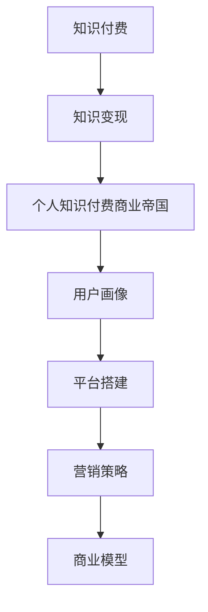

                 

# 如何打造个人知识付费商业帝国

> 关键词：知识付费, 商业模型, 用户画像, 平台搭建, 营销策略

## 1. 背景介绍

### 1.1 问题由来

知识付费，作为21世纪新型的内容变现模式，正迅速成为互联网行业的新风口。以罗辑思维、得到、喜马拉雅等平台为代表的线上知识付费平台，凭借优质内容、高效运作和强大变现能力，树立了知识付费领域的标杆。

知识付费的核心在于将碎片化的知识整合为系统性的学习内容，为忙碌的现代人提供便捷的知识获取渠道。平台通过聚集高价值内容生产者，产出高质量课程、书籍、音频等，提供给有学习需求的用户。

与此同时，个人知识付费商业帝国的打造，也需要通过精细化的运营策略和商业模型，实现知识变现的最大化。

## 2. 核心概念与联系

### 2.1 核心概念概述

1. **知识付费**：用户支付一定费用获取高质量知识和信息的一种商业模式。
2. **知识变现**：将个人专业知识、经验或技能转化为货币收入的过程。
3. **知识付费商业帝国**：通过平台或个人，构建以知识为核心竞争力，以商业化为终极目标的知识付费体系。
4. **用户画像**：基于用户行为数据和特征信息，构建的详细用户画像，用于精准营销和产品定制。
5. **平台搭建**：构建线上知识付费平台的流程和技术栈选择。
6. **营销策略**：通过各种渠道和手段，吸引用户并促进课程销售的策略。
7. **商业模型**：包括课程定价、课程包设计、用户分级、收益分配等，确定知识付费平台的核心盈利方式。

### 2.2 核心概念原理和架构的 Mermaid 流程图



## 3. 核心算法原理 & 具体操作步骤

### 3.1 算法原理概述

个人知识付费商业帝国的打造，涉及对平台、用户、内容等多维度数据的分析和管理。通过构建数据驱动的运营策略，最大化平台收益和用户价值。

### 3.2 算法步骤详解

1. **用户画像构建**：
   - **数据采集**：收集用户注册信息、学习行为、支付行为等数据。
   - **数据清洗**：去除无效数据，确保数据质量。
   - **画像生成**：通过数据挖掘和机器学习技术，生成详尽的用户画像。

2. **平台搭建**：
   - **技术栈选择**：选择合适的技术栈，如React、Flask等，确保平台的高效运行。
   - **系统架构设计**：设计系统架构，确保前后端分离、API接口清晰、数据库设计合理。
   - **功能模块开发**：开发课程发布、订单管理、支付接口、学员管理等功能模块。

3. **营销策略**：
   - **渠道选择**：选择社交媒体、搜索引擎、邮件营销等多种渠道。
   - **内容设计**：设计有吸引力的课程标题、简介、封面等，提高用户点击率。
   - **活动策划**：组织免费试听、大咖直播、限时折扣等活动，提高课程销量。

4. **商业模型**：
   - **课程定价**：根据课程内容、市场调研结果等，设定合理的课程价格。
   - **课程包设计**：设计单课、大课、会员制等多种形式，满足不同用户的需求。
   - **用户分级**：对用户进行分级，如免费用户、付费用户、会员用户等，实现精细化运营。
   - **收益分配**：确定平台与内容创作者之间的收益分配比例，保证各方利益。

### 3.3 算法优缺点

**优点**：
- **高效变现**：通过数据分析和精准营销，高效实现知识变现。
- **个性化推荐**：根据用户画像，推荐适合用户的课程，提高用户满意度。
- **多渠道覆盖**：多种渠道覆盖用户，拓宽用户基数。
- **灵活运营**：灵活调整运营策略，适应市场变化。

**缺点**：
- **数据隐私**：用户数据隐私保护难度大。
- **运营成本高**：前期平台建设、内容制作和推广费用较高。
- **内容同质化**：同质化内容竞争激烈，需不断创新内容。
- **技术挑战**：平台技术架构复杂，需要持续维护。

### 3.4 算法应用领域

个人知识付费商业帝国可以在多个领域内应用：
- **在线教育**：如编程、外语、管理、心理学等各类课程。
- **职业培训**：如技能提升、职业认证、行业考试等。
- **健康管理**：如营养学、运动康复、心理健康等课程。
- **兴趣培养**：如音乐、绘画、摄影等爱好类课程。
- **个人发展**：如时间管理、财务管理、心理学等个人提升课程。

## 4. 数学模型和公式 & 详细讲解 & 举例说明

### 4.1 数学模型构建

个人知识付费商业帝国涉及多种数学模型，如用户增长模型、推荐系统模型等。以下以推荐系统模型为例，构建推荐模型的数学模型。

假设推荐系统中有 $m$ 个课程，每个课程由 $n$ 个特征描述，每个用户 $u$ 对课程的评分 $r_{u,i}$ 为未知变量。设用户 $u$ 与课程 $i$ 的相似度为 $\theta_{u,i}$，评分函数为 $f_{u,i}(\theta_{u,i})$，则推荐模型可以表示为：

$$
r_{u,i} = f_{u,i}(\theta_{u,i})
$$

### 4.2 公式推导过程

设推荐系统中有 $k$ 个用户，则推荐系统矩阵 $R$ 为：

$$
R_{u,i} = f_{u,i}(\theta_{u,i})
$$

设特征矩阵 $X$ 为：

$$
X_{u,i} = \theta_{u,i}
$$

则推荐模型可以表示为：

$$
R = f(X)
$$

其中 $f$ 为推荐函数，可以根据实际情况选择线性回归、矩阵分解等模型。

### 4.3 案例分析与讲解

假设推荐系统中的课程特征包括课程评分、课程时长、课程评论数量等，可以通过矩阵分解方法，将推荐系统矩阵 $R$ 分解为用户特征矩阵 $U$ 和课程特征矩阵 $V$ 的乘积，即：

$$
R = UV^T
$$

其中 $U$ 为 $k \times d$ 的矩阵，$V$ 为 $m \times d$ 的矩阵，$d$ 为特征维度。

通过矩阵分解方法，可以优化推荐函数 $f$，提高推荐精度。例如，可以使用奇异值分解(SVD)方法，将 $R$ 分解为 $U$ 和 $V$ 的乘积，并计算 $\hat{R} = U \hat{V}^T$，其中 $\hat{V}$ 为 $V$ 的近似矩阵。

最终，可以计算用户 $u$ 对课程 $i$ 的推荐评分 $\hat{r}_{u,i} = \hat{R}_{u,i}$，即为推荐的课程评分。

## 5. 项目实践：代码实例和详细解释说明

### 5.1 开发环境搭建

开发环境搭建包括前端、后端和数据库等多个环节。以下以Python环境为例，进行开发环境搭建。

1. **Python 环境**：
   - 安装 Python 3.x 版本。
   - 安装虚拟环境工具 `virtualenv`，创建虚拟环境 `myenv`。
   - 安装相关依赖包，如 Flask、Gunicorn、SQLAlchemy 等。

2. **前端开发环境**：
   - 安装 React 开发环境，如 `create-react-app`。
   - 编写 React 组件，如课程列表、课程详情等。

3. **后端开发环境**：
   - 安装 Flask 开发环境。
   - 编写 Flask 应用，包括课程管理、订单管理、用户管理等。

4. **数据库**：
   - 安装 SQLAlchemy 数据库工具。
   - 设计课程信息、订单信息、用户信息等数据表。
   - 使用 SQLAlchemy ORM 进行数据库操作。

### 5.2 源代码详细实现

以下是一个简单的课程推荐系统实现代码，包括推荐算法和用户画像模块。

```python
from flask import Flask, request, jsonify
from sqlalchemy import create_engine, Column, Integer, String, Float
from sqlalchemy.orm import sessionmaker
from sqlalchemy.ext.declarative import declarative_base
import numpy as np
import pandas as pd
from sklearn.decomposition import TruncatedSVD

# 数据库连接
engine = create_engine('sqlite:///sqlite.db', echo=True)
Base = declarative_base()

# 课程信息表
class Course(Base):
    __tablename__ = 'courses'
    id = Column(Integer, primary_key=True)
    name = Column(String(128))
    description = Column(String(256))
    price = Column(Float)
    length = Column(Integer)

# 用户信息表
class User(Base):
    __tablename__ = 'users'
    id = Column(Integer, primary_key=True)
    name = Column(String(128))
    email = Column(String(128))

# 课程推荐算法
class RecommendationEngine:
    def __init__(self, num_factors=50):
        self.num_factors = num_factors
        self.model = TruncatedSVD(n_components=num_factors, random_state=0)

    def fit(self, X):
        X = pd.DataFrame(X)
        self.model.fit(X)

    def predict(self, X):
        X = pd.DataFrame(X)
        X = self.model.transform(X)
        return X

    def transform(self, X):
        X = pd.DataFrame(X)
        X = self.model.transform(X)
        return X

# 用户画像模块
class UserProfile:
    def __init__(self, user_id):
        self.user_id = user_id
        self.courses = []

    def add_course(self, course_id):
        self.courses.append(course_id)

    def get_course_score(self, course_id):
        scores = []
        for course in self.courses:
            scores.append(course['predictions'][course_id])
        return sum(scores) / len(self.courses)

    def get_recommendations(self, top_n=5):
        scores = {}
        for course in courses:
            scores[course['id']] = self.get_course_score(course['id'])
        sorted_scores = sorted(scores.items(), key=lambda x: x[1], reverse=True)
        recommendations = [course['id'] for course, _ in sorted_scores[:top_n]]
        return recommendations

# 创建 Flask 应用
app = Flask(__name__)

# 创建数据库表
Base.metadata.create_all(engine)

# 定义 Flask 路由
@app.route('/recommendations', methods=['POST'])
def recommend():
    user_id = request.json['user_id']
    top_n = request.json.get('top_n', 5)
    user = UserProfile(user_id)
    recommendations = user.get_recommendations(top_n)
    return jsonify(recommendations)

if __name__ == '__main__':
    app.run(debug=True)
```

### 5.3 代码解读与分析

1. **Flask 应用**：
   - 通过 Flask 框架实现后端服务。
   - 定义 `/recommendations` 路由，接收用户 ID 和推荐数量等参数。

2. **SQLAlchemy ORM**：
   - 使用 SQLAlchemy ORM 进行数据库操作。
   - 设计 `Course` 和 `User` 表，并进行数据迁移。

3. **课程推荐算法**：
   - 使用 TruncatedSVD 进行矩阵分解，得到课程推荐矩阵。
   - 实现 `fit` 和 `predict` 方法，进行模型训练和预测。

4. **用户画像模块**：
   - 定义 `UserProfile` 类，保存用户 ID 和课程评分等数据。
   - 实现 `add_course`、`get_course_score` 和 `get_recommendations` 方法，用于课程推荐。

5. **推荐系统调用**：
   - 在 Flask 应用中，通过调用用户画像模块进行课程推荐。

## 6. 实际应用场景

### 6.1 在线教育平台

个人知识付费商业帝国在在线教育领域具有广泛的应用。通过知识付费平台，在线教育机构可以输出高质量的课程内容，如编程、外语、管理等各类课程。平台通过精准推荐和营销策略，吸引用户付费订阅，实现收益最大化。

### 6.2 职业培训平台

职业培训平台通过聚集职业培训专家，输出职业认证、行业考试等培训课程，帮助用户提升职业竞争力。通过知识付费模式，平台可以有效缓解企业培训成本压力，提供高质量的在线培训资源。

### 6.3 健康管理平台

健康管理平台通过输出营养学、运动康复、心理健康等课程，帮助用户建立科学健康的生活习惯。通过知识付费模式，平台可以吸引大量健康管理爱好者，实现健康管理知识的商业化。

### 6.4 兴趣培养平台

兴趣培养平台通过输出音乐、绘画、摄影等爱好类课程，满足用户多样化的兴趣需求。通过知识付费模式，平台可以吸引更多用户参与课程学习，实现兴趣爱好变现。

## 7. 工具和资源推荐

### 7.1 学习资源推荐

1. **《深度学习与知识图谱》**：深度学习专家李航教授所著，涵盖深度学习在知识图谱中的应用。
2. **《机器学习实战》**：Wesley Chun 所著，涵盖机器学习算法的实战案例。
3. **Coursera、Udacity 在线课程**：全球知名大学的在线课程平台，涵盖多种计算机科学和数据科学课程。
4. **Kaggle 数据竞赛**：数据科学领域的重要平台，提供大量的数据集和竞赛机会。
5. **GitHub 代码库**：全球最大的开源代码库，可以获取多种计算机科学和数据科学项目的代码和文档。

### 7.2 开发工具推荐

1. **Python 开发工具**：
   - PyCharm：强大的 Python IDE，支持多种框架和库。
   - Jupyter Notebook：交互式编程工具，适合快速迭代实验和演示。
   - Flask、Django：流行的 Python Web 框架，支持 Web 开发和数据库管理。

2. **数据处理工具**：
   - Pandas：强大的数据处理库，支持数据清洗、转换和分析。
   - NumPy：高效的多维数组处理库，适合科学计算和数据分析。
   - SQLAlchemy：数据库 ORM 工具，支持多种数据库操作。

3. **可视化工具**：
   - Matplotlib：强大的数据可视化库，支持多种图表绘制。
   - Seaborn：基于 Matplotlib 的数据可视化库，支持高级统计图表绘制。
   - Plotly：交互式可视化工具，支持多种图表和动画效果。

### 7.3 相关论文推荐

1. **《知识图谱构建与应用》**：图谱领域专家王晋东教授所著，涵盖知识图谱的构建和应用方法。
2. **《机器学习在推荐系统中的应用》**：推荐系统专家张辉教授所著，涵盖推荐算法的理论和实践。
3. **《深度学习在自然语言处理中的应用》**：NLP 领域专家周志华教授所著，涵盖深度学习在 NLP 中的应用。
4. **《知识图谱在社交网络分析中的应用》**：社交网络分析专家王志伟教授所著，涵盖知识图谱在社交网络分析中的应用。

## 8. 总结：未来发展趋势与挑战

### 8.1 总结

本文对个人知识付费商业帝国的打造进行了全面系统的介绍。通过构建数据驱动的运营策略和商业模型，最大化平台收益和用户价值。通过精准推荐和营销策略，吸引用户付费订阅，实现收益最大化。通过构建详尽的用户画像，实现个性化推荐和运营。

### 8.2 未来发展趋势

1. **用户画像精细化**：随着数据收集和分析技术的提升，用户画像将越来越精细，能够实现更精准的用户行为预测和个性化推荐。
2. **推荐系统智能化**：推荐系统将引入更多先进算法，如深度学习、强化学习等，实现更高效、更智能的推荐效果。
3. **多渠道融合**：知识付费平台将更多地融合多渠道资源，如视频、音频、直播等，提升用户体验和内容丰富度。
4. **内容多样化**：内容形式将更加多样化，如在线课程、视频直播、音频讲书等，满足用户多样化需求。
5. **知识社区化**：知识付费平台将更多地引入社区功能，促进用户互动和内容共享，形成知识生态圈。

### 8.3 面临的挑战

1. **内容同质化**：内容同质化现象严重，难以满足用户多样化需求。需要不断创新内容形式和内容来源，提升平台竞争力。
2. **用户体验提升**：用户体验需求不断提高，需要不断优化平台功能和用户界面。
3. **市场竞争加剧**：知识付费平台竞争激烈，需要不断提升平台运营效率和服务质量。
4. **数据隐私保护**：用户数据隐私保护问题突出，需要严格遵守相关法律法规，保障用户数据安全。
5. **内容审核难度**：知识付费平台需要严格审核课程内容，避免有害信息的传播。

### 8.4 研究展望

未来，个人知识付费商业帝国需要在以下方面进一步突破：
1. **知识图谱应用**：引入知识图谱技术，提升课程推荐效果。
2. **推荐系统优化**：引入更多先进的推荐算法，提高推荐精度和用户满意度。
3. **用户画像优化**：通过更多数据收集和分析，实现更精细的用户画像。
4. **内容创新**：不断创新课程内容和形式，提升平台竞争力。
5. **技术升级**：引入更多先进技术，如深度学习、自然语言处理等，提升平台智能化水平。

总之，通过不断优化运营策略和商业模型，提升平台的用户体验和竞争力，个人知识付费商业帝国将拥有更广阔的发展空间和未来前景。

## 9. 附录：常见问题与解答

**Q1：如何选择合适的课程内容？**

A: 根据用户画像和课程需求，选择合适的课程内容。可以通过用户行为数据和反馈，了解用户需求，进行内容优化。同时，可以通过市场调研和专家意见，进行内容选择。

**Q2：如何设计有效的营销策略？**

A: 通过多渠道覆盖，如社交媒体、搜索引擎、邮件营销等，吸引用户关注和订阅。通过内容设计，设计有吸引力的课程标题、简介、封面等，提高用户点击率。通过活动策划，如免费试听、大咖直播、限时折扣等，提高课程销量。

**Q3：如何进行用户画像构建？**

A: 通过数据采集，收集用户注册信息、学习行为、支付行为等数据。通过数据清洗，去除无效数据，确保数据质量。通过数据挖掘和机器学习技术，生成详尽的用户画像。

**Q4：如何设计合理的课程定价策略？**

A: 根据课程内容、市场调研结果等，设定合理的课程价格。可以通过用户调研和市场分析，了解用户对课程价格的接受程度。同时，可以设计灵活的定价策略，如课程包设计、优惠券等，提升课程销量。

**Q5：如何进行数据隐私保护？**

A: 严格遵守相关法律法规，保障用户数据安全。可以采用数据脱敏、加密等技术手段，保护用户隐私。同时，可以设计隐私政策，明确数据收集和使用范围，增强用户信任。

**Q6：如何进行内容审核？**

A: 制定严格的内容审核标准，确保课程内容符合法律法规和平台规范。可以引入专家评审、用户反馈等机制，提升内容审核效果。同时，可以设计内容监控系统，实时监测和处理有害内容。

总之，个人知识付费商业帝国需要不断优化运营策略和商业模型，提升平台的用户体验和竞争力，实现知识变现的最大化。通过不断创新和优化，相信平台将拥有更广阔的发展前景和未来趋势。

