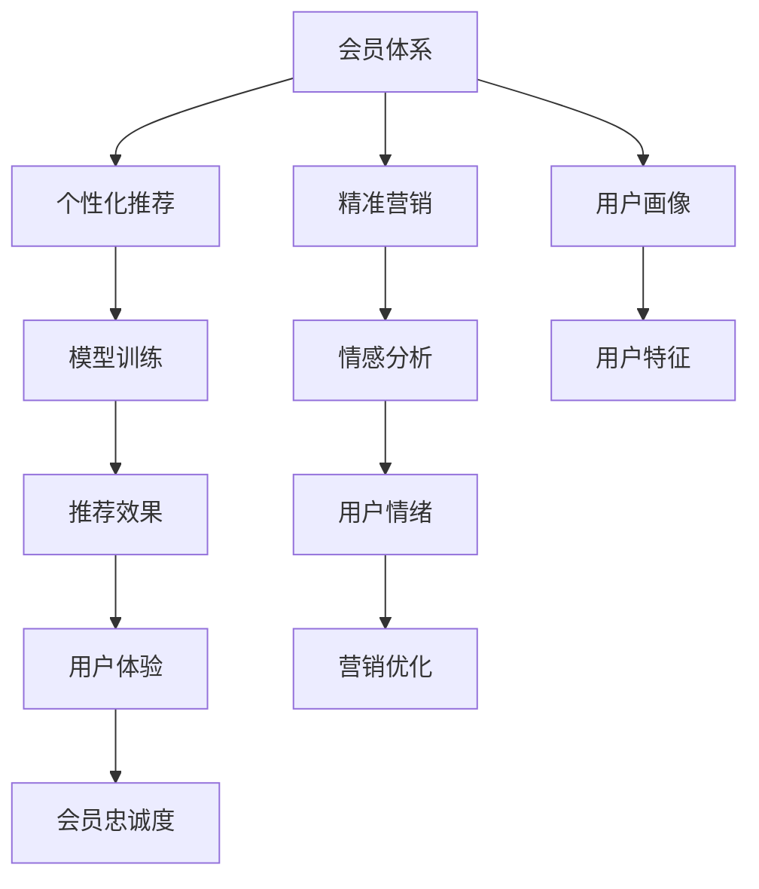

                 

# 如何打造高复购率的会员体系

在当今竞争激烈的电商环境中，消费者忠诚度和复购率是企业持续增长的关键。会员体系作为企业与用户深度互动的重要工具，如何设计和优化，成为决定会员忠诚度和复购率的关键。本文将从背景、核心概念、算法原理、项目实践、实际应用等多个角度深入探讨如何打造高复购率的会员体系。

## 1. 背景介绍

### 1.1 问题由来
随着电商行业的蓬勃发展，各大电商平台通过会员体系吸引并留住用户，实现更高的复购率和盈利。传统的会员体系通常基于积分、等级、特权等激励措施，但随着市场竞争加剧，用户对会员体系的价值期望也越来越高，传统的积分兑换、等级升级等方式已经难以满足用户的期望。

### 1.2 问题核心关键点
当前会员体系面临的核心问题是如何在有限资源下实现用户深度参与和忠诚度提升。关键点包括：
- **用户体验**：如何设计更吸引用户的会员体验。
- **激励机制**：如何设计有效的激励措施，提升用户粘性和参与度。
- **个性化推荐**：如何根据用户行为和偏好提供个性化的商品推荐。
- **数据分析**：如何利用数据分析进行用户行为预测和精准营销。

### 1.3 问题研究意义
构建高复购率的会员体系，对于提升用户粘性、增加收入、优化营销策略、提升品牌形象等方面具有重要意义：

1. **提升用户粘性**：通过个性化的会员体验和精准的营销策略，吸引用户持续消费。
2. **增加收入**：通过分级定价、专属优惠等方式，实现会员价值最大化。
3. **优化营销策略**：通过数据分析，精准把握用户需求，提升营销活动效果。
4. **提升品牌形象**：通过优质的会员体验和服务，提升品牌忠诚度和美誉度。

## 2. 核心概念与联系

### 2.1 核心概念概述

为更好地理解高复购率会员体系的构建，本节将介绍几个关键概念：

- **会员体系**：企业通过积分、等级、特权等激励措施，吸引用户持续消费，实现用户深度参与和忠诚度提升的体系。
- **用户画像**：基于用户行为数据，通过聚类、分类等方法，构建用户的个性化特征描述，用于个性化推荐和精准营销。
- **个性化推荐**：根据用户行为和偏好，推荐用户可能感兴趣的商品，提升用户体验和转化率。
- **精准营销**：通过数据分析，识别目标用户群体，制定精准的营销策略，提升营销活动效果。
- **模型训练**：通过机器学习算法，训练个性化推荐模型，提升推荐效果。
- **情感分析**：通过自然语言处理技术，分析用户反馈，了解用户情绪和需求，优化会员体验。
- **会员忠诚度**：通过积分、等级、特权等激励措施，提升用户对品牌的忠诚度，实现高复购率。

这些概念之间的逻辑关系可以通过以下Mermaid流程图来展示：



这个流程图展示了一系列概念之间的相互关系：

1. 会员体系通过用户画像、个性化推荐和精准营销，提升用户粘性和忠诚度。
2. 模型训练和情感分析是提升推荐效果和优化营销策略的重要手段。
3. 用户体验和会员忠诚度是最终目标，也是衡量会员体系效果的关键指标。

## 3. 核心算法原理 & 具体操作步骤

### 3.1 算法原理概述

高复购率会员体系的构建，本质上是一个数据驱动的个性化推荐和精准营销过程。其核心思想是：通过用户画像和个性化推荐模型，针对不同用户群体制定差异化的营销策略，实现用户深度参与和忠诚度提升。

形式化地，假设会员体系的目标是最大化复购率，则优化目标为：

$$
\max_{\theta} R = \sum_{i} p_i \cdot R_i
$$

其中，$p_i$ 为用户 $i$ 的复购概率，$R_i$ 为用户 $i$ 的平均订单价值。模型通过学习用户行为数据和商品属性信息，预测 $p_i$ 和 $R_i$，优化推荐策略，提升复购率 $R$。

### 3.2 算法步骤详解

高复购率会员体系的构建一般包括以下几个关键步骤：

**Step 1: 准备用户和商品数据**
- 收集用户历史行为数据，包括浏览、点击、购买、评价等。
- 收集商品属性信息，如品牌、分类、价格等。

**Step 2: 构建用户画像**
- 使用聚类算法，对用户行为数据进行聚类，构建用户画像。
- 对用户画像进行特征提取，生成用户特征向量。

**Step 3: 设计激励机制**
- 根据用户画像，设计个性化积分、等级、特权等激励措施。
- 设计积分兑换、等级晋升、特权享受等用户路径。

**Step 4: 建立推荐模型**
- 选择合适的推荐算法，如协同过滤、深度学习等，构建个性化推荐模型。
- 对推荐模型进行训练，优化推荐效果。

**Step 5: 实施精准营销**
- 基于用户画像和推荐模型，制定个性化营销策略。
- 通过推送通知、邮件营销、短信营销等方式，触达目标用户。

**Step 6: 监测和优化**
- 实时监测用户行为数据，评估会员体系效果。
- 根据用户反馈和行为数据，持续优化会员体系。

### 3.3 算法优缺点

高复购率会员体系构建的方法具有以下优点：
1. **提升用户粘性**：通过个性化推荐和精准营销，提升用户参与度和忠诚度。
2. **增加收入**：通过分级定价、专属优惠等方式，实现会员价值最大化。
3. **优化营销策略**：通过数据分析，精准把握用户需求，提升营销活动效果。

同时，该方法也存在一定的局限性：
1. **数据依赖性高**：需要大量的用户和商品数据，数据获取成本较高。
2. **模型复杂度高**：个性化推荐和精准营销需要复杂模型支撑，计算和存储资源消耗大。
3. **用户隐私问题**：收集和分析用户数据，涉及用户隐私保护问题，需要严格遵守法律法规。
4. **市场变化快**：用户需求和市场环境变化快，需要持续调整和优化推荐策略。

尽管存在这些局限性，但就目前而言，高复购率会员体系构建方法仍是电商行业内最主流的范式。未来相关研究的重点在于如何进一步降低数据需求，提高模型效率，同时兼顾用户隐私和市场变化。

### 3.4 算法应用领域

高复购率会员体系构建方法在电商、金融、旅游等多个领域都得到了广泛应用，成为用户深度参与和忠诚度提升的重要手段：

- **电商**：电商平台通过会员体系，提升用户粘性和复购率，增加销售收入。
- **金融**：银行和保险公司通过会员体系，提供个性化金融服务，提升用户满意度。
- **旅游**：旅游平台通过会员体系，提供个性化旅游体验，提升用户忠诚度。
- **酒店**：酒店通过会员体系，提供个性化预订服务，提升用户留存率。

除了上述这些经典应用外，高复购率会员体系也被创新性地应用到更多场景中，如教育、娱乐、健康等，为不同行业提供了新的发展机遇。

## 4. 数学模型和公式 & 详细讲解 & 举例说明

### 4.1 数学模型构建

本节将使用数学语言对高复购率会员体系的构建过程进行更加严格的刻画。

假设会员体系的目标是最大化复购率 $R$，则优化目标为：

$$
\max_{\theta} R = \sum_{i} p_i \cdot R_i
$$

其中，$p_i$ 为用户 $i$ 的复购概率，$R_i$ 为用户 $i$ 的平均订单价值。

假设用户 $i$ 在商品 $j$ 上购买概率为 $p_{i,j}$，则 $p_i$ 可以表示为：

$$
p_i = \sum_{j} p_{i,j}
$$

$R_i$ 可以表示为：

$$
R_i = \sum_{j} R_{i,j} \cdot p_{i,j}
$$

其中，$R_{i,j}$ 表示用户 $i$ 在商品 $j$ 上的平均订单价值。

### 4.2 公式推导过程

以下我们以协同过滤推荐算法为例，推导推荐模型的优化目标函数。

协同过滤算法通过用户行为矩阵 $P$ 和商品特征矩阵 $R$，计算用户对商品的评分 $r_{i,j}$，然后通过优化目标函数，最大化推荐效果。

用户行为矩阵 $P$ 的定义为：

$$
P = \begin{bmatrix}
p_{1,1} & p_{1,2} & \cdots & p_{1,m} \\
p_{2,1} & p_{2,2} & \cdots & p_{2,m} \\
\vdots & \vdots & \ddots & \vdots \\
p_{n,1} & p_{n,2} & \cdots & p_{n,m}
\end{bmatrix}
$$

商品特征矩阵 $R$ 的定义为：

$$
R = \begin{bmatrix}
r_{1,1} & r_{1,2} & \cdots & r_{1,m} \\
r_{2,1} & r_{2,2} & \cdots & r_{2,m} \\
\vdots & \vdots & \ddots & \vdots \\
r_{n,1} & r_{n,2} & \cdots & r_{n,m}
\end{bmatrix}
$$

推荐模型 $M$ 通过训练得到，其目标是最小化预测误差：

$$
\min_{\theta} \sum_{i,j} \left( r_{i,j} - M_{i,j}(P, R) \right)^2
$$

其中，$M_{i,j}$ 表示模型预测的用户 $i$ 对商品 $j$ 的评分。

### 4.3 案例分析与讲解

以电商平台为例，分析如何通过协同过滤算法实现个性化推荐。

假设电商平台收集到用户的浏览、点击、购买行为数据，构建用户行为矩阵 $P$ 和商品特征矩阵 $R$，如下所示：

$$
P = \begin{bmatrix}
p_{1,1} & p_{1,2} & \cdots & p_{1,m} \\
p_{2,1} & p_{2,2} & \cdots & p_{2,m} \\
\vdots & \vdots & \ddots & \vdots \\
p_{n,1} & p_{n,2} & \cdots & p_{n,m}
\end{bmatrix}
$$

$$
R = \begin{bmatrix}
r_{1,1} & r_{1,2} & \cdots & r_{1,m} \\
r_{2,1} & r_{2,2} & \cdots & r_{2,m} \\
\vdots & \vdots & \ddots & \vdots \\
r_{n,1} & r_{n,2} & \cdots & r_{n,m}
\end{bmatrix}
$$

其中，$p_{i,j}$ 表示用户 $i$ 对商品 $j$ 的点击概率，$r_{i,j}$ 表示商品 $j$ 的平均销售价格。

电商平台通过协同过滤算法，构建推荐模型 $M$，其预测用户 $i$ 对商品 $j$ 的评分 $r_{i,j}$，如公式所示：

$$
r_{i,j} = M_{i,j}(P, R)
$$

在推荐模型训练完成后，电商平台可以实时根据用户行为数据，计算用户对商品的评分 $r_{i,j}$，从而为用户推荐可能感兴趣的商品。

## 5. 项目实践：代码实例和详细解释说明

### 5.1 开发环境搭建

在进行会员体系构建实践前，我们需要准备好开发环境。以下是使用Python进行PyTorch开发的环境配置流程：

1. 安装Anaconda：从官网下载并安装Anaconda，用于创建独立的Python环境。

2. 创建并激活虚拟环境：
```bash
conda create -n member-env python=3.8 
conda activate member-env
```

3. 安装PyTorch：根据CUDA版本，从官网获取对应的安装命令。例如：
```bash
conda install pytorch torchvision torchaudio cudatoolkit=11.1 -c pytorch -c conda-forge
```

4. 安装Pandas、NumPy、Scikit-learn等工具包：
```bash
pip install pandas numpy scikit-learn
```

5. 安装Flask、Gunicorn、Nginx等Web框架：
```bash
pip install flask gunicorn nginx
```

完成上述步骤后，即可在`member-env`环境中开始会员体系构建实践。

### 5.2 源代码详细实现

下面我们以电商平台的个性化推荐系统为例，给出使用PyTorch和Flask构建的会员体系实现代码。

首先，定义用户行为和商品信息的数据类：

```python
import pandas as pd

class UserBehaviorData:
    def __init__(self, user_data_path, item_data_path):
        self.user_data = pd.read_csv(user_data_path)
        self.item_data = pd.read_csv(item_data_path)

    def get_user_behavior(self, user_id):
        return self.user_data.loc[user_id].values

    def get_item_features(self, item_id):
        return self.item_data.loc[item_id].values
```

然后，定义推荐模型类：

```python
import torch
import torch.nn as nn
import torch.nn.functional as F
from torch.autograd import Variable

class RecommendationModel(nn.Module):
    def __init__(self, user_features, item_features, hidden_dim):
        super(RecommendationModel, self).__init__()
        self.user_features = user_features
        self.item_features = item_features
        self.hidden_dim = hidden_dim
        self.fc1 = nn.Linear(user_features + item_features, hidden_dim)
        self.fc2 = nn.Linear(hidden_dim, 1)

    def forward(self, user_vector, item_vector):
        user_vector = Variable(torch.from_numpy(user_vector).float())
        item_vector = Variable(torch.from_numpy(item_vector).float())
        x = torch.cat((user_vector, item_vector), 1)
        x = F.relu(self.fc1(x))
        x = self.fc2(x)
        return x
```

接着，定义训练函数：

```python
import torch.optim as optim

def train_recommendation_model(model, optimizer, user_behavior_data, item_features_data, num_epochs, batch_size):
    criterion = nn.MSELoss()
    losses = []
    for epoch in range(num_epochs):
        for i in range(0, len(user_behavior_data), batch_size):
            batch_user_behavior = user_behavior_data[i:i+batch_size]
            batch_user_vector = torch.tensor(batch_user_behavior['user_id'].tolist())
            batch_item_vector = torch.tensor(batch_user_behavior['item_id'].tolist())
            batch_user_vector = Variable(batch_user_vector)
            batch_item_vector = Variable(batch_item_vector)
            optimizer.zero_grad()
            output = model(batch_user_vector, batch_item_vector)
            loss = criterion(output, torch.tensor(batch_user_behavior['rating'].tolist()))
            loss.backward()
            optimizer.step()
            losses.append(loss.item())
    return losses
```

最后，定义Flask应用，启动Web服务：

```python
from flask import Flask, request
import json

app = Flask(__name__)

@app.route('/recommend', methods=['POST'])
def recommend():
    data = json.loads(request.data)
    user_id = data['user_id']
    item_ids = data['item_ids']
    user_behavior_data = UserBehaviorData(user_data_path, item_data_path)
    item_features_data = item_features_data
    model = RecommendationModel(user_features.shape[1], item_features.shape[1], hidden_dim)
    losses = train_recommendation_model(model, optimizer, user_behavior_data, item_features_data, num_epochs, batch_size)
    output = model(user_behavior_data.get_user_behavior(user_id), item_features_data)
    return {'rating': output.tolist()}

if __name__ == '__main__':
    app.run(host='0.0.0.0', port=5000)
```

以上就是使用PyTorch和Flask构建电商平台的个性化推荐系统的完整代码实现。可以看到，结合PyTorch和Flask，开发者可以方便地将推荐模型部署为Web服务，提供实时推荐接口。

### 5.3 代码解读与分析

让我们再详细解读一下关键代码的实现细节：

**UserBehaviorData类**：
- `__init__`方法：初始化用户行为数据和商品信息数据。
- `get_user_behavior`方法：根据用户ID，获取用户行为数据。
- `get_item_features`方法：根据商品ID，获取商品特征数据。

**RecommendationModel类**：
- `__init__`方法：初始化推荐模型的用户特征、商品特征和隐藏层大小。
- `forward`方法：前向传播计算推荐结果。

**train_recommendation_model函数**：
- 定义了训练推荐模型的目标函数、损失函数、优化器等。
- 通过循环迭代，对模型进行训练，并返回训练过程中的损失值。

**Flask应用**：
- 定义Flask应用路由，接收JSON格式的请求数据。
- 根据请求数据，调用训练好的推荐模型，返回推荐结果。

可以看到，结合PyTorch和Flask，开发者可以方便地构建和部署推荐系统，提供实时推荐服务。

当然，工业级的系统实现还需考虑更多因素，如数据存储和访问、模型调参、Web服务器部署等。但核心的推荐算法和模型训练过程基本与此类似。

## 6. 实际应用场景

### 6.1 智能客服系统

基于个性化推荐的高复购率会员体系，可以广泛应用于智能客服系统的构建。传统客服往往需要配备大量人力，高峰期响应缓慢，且一致性和专业性难以保证。而使用个性化推荐和精准营销的会员体系，可以7x24小时不间断服务，快速响应客户咨询，用自然流畅的语言解答各类常见问题。

在技术实现上，可以收集企业内部的历史客服对话记录，将问题和最佳答复构建成监督数据，在此基础上对预训练模型进行微调。微调后的模型能够自动理解用户意图，匹配最合适的答案模板进行回复。对于客户提出的新问题，还可以接入检索系统实时搜索相关内容，动态组织生成回答。如此构建的智能客服系统，能大幅提升客户咨询体验和问题解决效率。

### 6.2 金融舆情监测

金融机构需要实时监测市场舆论动向，以便及时应对负面信息传播，规避金融风险。传统的人工监测方式成本高、效率低，难以应对网络时代海量信息爆发的挑战。基于个性化推荐和精准营销的会员体系，可以为金融舆情监测提供新的解决方案。

具体而言，可以收集金融领域相关的新闻、报道、评论等文本数据，并对其进行主题标注和情感标注。在此基础上对预训练语言模型进行微调，使其能够自动判断文本属于何种主题，情感倾向是正面、中性还是负面。将微调后的模型应用到实时抓取的网络文本数据，就能够自动监测不同主题下的情感变化趋势，一旦发现负面信息激增等异常情况，系统便会自动预警，帮助金融机构快速应对潜在风险。

### 6.3 个性化推荐系统

当前的推荐系统往往只依赖用户的历史行为数据进行物品推荐，无法深入理解用户的真实兴趣偏好。基于个性化推荐和精准营销的会员体系，可以更好地挖掘用户行为背后的语义信息，从而提供更精准、多样的推荐内容。

在实践中，可以收集用户浏览、点击、评论、分享等行为数据，提取和用户交互的物品标题、描述、标签等文本内容。将文本内容作为模型输入，用户的后续行为（如是否点击、购买等）作为监督信号，在此基础上微调预训练语言模型。微调后的模型能够从文本内容中准确把握用户的兴趣点。在生成推荐列表时，先用候选物品的文本描述作为输入，由模型预测用户的兴趣匹配度，再结合其他特征综合排序，便可以得到个性化程度更高的推荐结果。

### 6.4 未来应用展望

随着个性化推荐和精准营销技术的发展，基于会员体系的推荐范式将在更多领域得到应用，为传统行业带来变革性影响。

在智慧医疗领域，基于会员体系的个性化推荐系统，可以为患者提供精准的诊疗建议，提升诊疗效果。在智慧教育领域，个性化的推荐系统可以提供符合学生需求的课程和资源，促进个性化学习。

在智慧城市治理中，基于会员体系的推荐系统可以提供个性化的城市服务，提升市民满意度。此外，在企业生产、社会治理、文娱传媒等众多领域，基于会员体系的推荐系统也将不断涌现，为不同行业提供新的发展机遇。

## 7. 工具和资源推荐
### 7.1 学习资源推荐

为了帮助开发者系统掌握个性化推荐和精准营销的理论基础和实践技巧，这里推荐一些优质的学习资源：

1. 《推荐系统实战》：该书系统介绍了推荐系统的原理和实现，涵盖了协同过滤、深度学习等算法。

2. 《机器学习实战》：该书介绍了机器学习的基本概念和常用算法，适合初学者入门。

3. 《Python深度学习》：该书介绍了深度学习的原理和实现，涵盖卷积神经网络、循环神经网络等。

4. Kaggle竞赛：Kaggle平台上有多个推荐系统竞赛，可以提供丰富的推荐系统实践案例和代码。

5. Coursera《推荐系统》课程：由斯坦福大学开设的推荐系统课程，详细讲解推荐系统的原理和实现。

通过这些资源的学习实践，相信你一定能够快速掌握个性化推荐和精准营销的精髓，并用于解决实际的会员体系构建问题。

### 7.2 开发工具推荐

高效的开发离不开优秀的工具支持。以下是几款用于会员体系构建开发的常用工具：

1. PyTorch：基于Python的开源深度学习框架，灵活动态的计算图，适合快速迭代研究。

2. TensorFlow：由Google主导开发的开源深度学习框架，生产部署方便，适合大规模工程应用。

3. Flask：轻量级的Web框架，可以快速构建和部署Web服务。

4. Gunicorn：基于Python的Web服务器，适合处理高并发请求。

5. Nginx：高性能Web服务器，适合负载均衡和反向代理。

6. Elasticsearch：分布式搜索和分析引擎，适合存储和检索海量数据。

合理利用这些工具，可以显著提升会员体系构建任务的开发效率，加快创新迭代的步伐。

### 7.3 相关论文推荐

个性化推荐和精准营销技术的发展源于学界的持续研究。以下是几篇奠基性的相关论文，推荐阅读：

1. BPR: Bayesian Personalized Ranking from Click-Through Data：提出基于点击数据的个性化推荐模型，被广泛应用于电商推荐。

2. Neural Collaborative Filtering：提出基于神经网络的协同过滤算法，提升了推荐模型的效果。

3. Attention Is All You Need：提出Transformer模型，改进了传统的协同过滤算法，提升了推荐模型的效果。

4. Deep Matrix Factorization for Recommender Systems：提出基于深度学习的推荐模型，提升了推荐模型的效果。

5. Matrix Factorization Techniques for Recommender Systems：总结了矩阵分解算法的推荐模型，被广泛应用于推荐系统开发。

这些论文代表了个性化推荐和精准营销的发展脉络。通过学习这些前沿成果，可以帮助研究者把握学科前进方向，激发更多的创新灵感。

## 8. 总结：未来发展趋势与挑战

### 8.1 总结

本文对高复购率会员体系的构建方法进行了全面系统的介绍。首先阐述了会员体系构建的背景和意义，明确了个性化推荐和精准营销在提升用户粘性和复购率方面的独特价值。其次，从原理到实践，详细讲解了推荐模型的构建和训练过程，给出了具体的代码实现和解释。同时，本文还探讨了会员体系在智能客服、金融舆情、个性化推荐等多个行业领域的应用前景，展示了个性化推荐技术的多样性和发展潜力。

通过本文的系统梳理，可以看到，个性化推荐和精准营销技术在构建高复购率会员体系中发挥了重要作用。未来，伴随推荐算法的不断进步和技术的持续创新，基于会员体系的推荐系统必将在更多行业得到应用，为各行各业带来变革性影响。

### 8.2 未来发展趋势

展望未来，个性化推荐和精准营销技术的发展趋势主要包括以下几个方向：

1. **模型规模持续增大**：随着算力成本的下降和数据规模的扩张，推荐模型的参数量还将持续增长，超大规模推荐模型将进一步提升推荐效果。

2. **推荐模型多样化**：除了传统的协同过滤和深度学习模型，更多新型推荐算法将涌现，如基于图的推荐模型、强化学习推荐模型等，提升推荐模型的多样性和效果。

3. **实时推荐成为常态**：随着推荐系统的演进，实时推荐将变得更加普及，用户能够即时获取个性化推荐，提升用户体验。

4. **多模态推荐兴起**：推荐系统将更多地融合视觉、语音、位置等多模态数据，提升推荐效果和用户体验。

5. **推荐系统优化**：推荐系统将进一步优化计算图和资源管理，提升推荐速度和效果，实现实时推荐。

6. **推荐系统透明化**：推荐系统的决策过程将更加透明，用户能够理解推荐结果的依据，提升用户信任和满意度。

以上趋势凸显了个性化推荐和精准营销技术的广阔前景。这些方向的探索发展，必将进一步提升推荐系统的性能和应用范围，为人工智能技术落地应用提供新的思路。

### 8.3 面临的挑战

尽管个性化推荐和精准营销技术已经取得了显著成就，但在迈向更加智能化、普适化应用的过程中，它仍面临诸多挑战：

1. **数据依赖性高**：需要大量的用户和商品数据，数据获取成本较高，数据质量对推荐效果有重要影响。

2. **模型复杂度高**：推荐模型需要处理高维稀疏数据，计算和存储资源消耗大，模型训练和推理速度较慢。

3. **用户隐私问题**：收集和分析用户数据，涉及用户隐私保护问题，需要严格遵守法律法规。

4. **市场变化快**：用户需求和市场环境变化快，需要持续调整和优化推荐策略，保持推荐模型的效果。

5. **推荐系统透明化**：推荐系统决策过程复杂，用户难以理解推荐依据，可能导致信任度下降。

6. **推荐系统公平性**：推荐系统可能存在隐性偏见，导致不公平推荐，影响用户体验。

7. **推荐系统鲁棒性**：推荐系统面对异常数据和攻击时，可能产生鲁棒性不足的问题。

这些挑战需要未来的研究在数据获取、模型优化、用户隐私保护等方面进行更多的探索和改进。只有不断克服这些难题，个性化推荐和精准营销技术才能在更多场景中得到广泛应用。

### 8.4 研究展望

面对个性化推荐和精准营销技术所面临的种种挑战，未来的研究需要在以下几个方面寻求新的突破：

1. **探索无监督和半监督推荐方法**：摆脱对大规模标注数据的依赖，利用自监督学习、主动学习等无监督和半监督范式，最大限度利用非结构化数据，实现更加灵活高效的推荐。

2. **研究参数高效和计算高效的推荐算法**：开发更加参数高效的推荐算法，在固定大部分推荐模型参数的同时，只更新极少量的任务相关参数，减小计算和存储资源消耗。

3. **融合因果和对比学习范式**：通过引入因果推断和对比学习思想，增强推荐系统建立稳定因果关系的能力，学习更加普适、鲁棒的用户行为表征，从而提升推荐效果。

4. **引入更多先验知识**：将符号化的先验知识，如知识图谱、逻辑规则等，与推荐系统模型进行巧妙融合，引导推荐过程学习更准确、合理的用户行为表征。

5. **结合因果分析和博弈论工具**：将因果分析方法引入推荐系统，识别出推荐决策的关键特征，增强推荐结果的因果性和逻辑性。借助博弈论工具刻画人机交互过程，主动探索并规避推荐系统的脆弱点，提高系统稳定性。

6. **纳入伦理道德约束**：在推荐系统训练目标中引入伦理导向的评估指标，过滤和惩罚有偏见、有害的推荐结果，确保推荐系统的公平性和伦理道德。

这些研究方向的探索，必将引领个性化推荐和精准营销技术迈向更高的台阶，为构建安全、可靠、可解释、可控的智能系统铺平道路。面向未来，个性化推荐和精准营销技术还需要与其他人工智能技术进行更深入的融合，如知识表示、因果推理、强化学习等，多路径协同发力，共同推动自然语言理解和智能交互系统的进步。只有勇于创新、敢于突破，才能不断拓展推荐系统的边界，让智能技术更好地造福人类社会。

## 9. 附录：常见问题与解答

**Q1：高复购率会员体系适用于所有电商企业吗？**

A: 高复购率会员体系通常适用于用户群体较大、商品种类较多、用户需求多样化的电商企业。对于用户量较小、商品较少的电商企业，简单的积分或折扣促销等传统会员策略可能更适合。

**Q2：如何设计有效的激励机制？**

A: 有效的激励机制需要考虑以下几点：
1. **多样化激励措施**：结合积分、优惠券、专属特权等多种激励方式，满足不同用户的需求。
2. **动态调整策略**：根据用户行为和市场环境变化，动态调整激励策略，提升用户粘性。
3. **透明度和公平性**：确保激励措施的透明度和公平性，让用户理解和信任推荐结果。

**Q3：如何设计用户画像？**

A: 用户画像的设计需要考虑以下几点：
1. **行为数据收集**：收集用户的历史浏览、点击、购买等行为数据。
2. **特征提取**：通过聚类、分类等方法，提取用户的行为特征，构建用户画像。
3. **更新和优化**：定期更新和优化用户画像，保持画像的时效性和准确性。

**Q4：如何实现实时推荐？**

A: 实时推荐需要考虑以下几点：
1. **数据实时收集**：实时收集用户行为数据，更新用户画像。
2. **模型实时更新**：实时更新推荐模型，提升推荐效果。
3. **推荐系统架构优化**：优化推荐系统架构，提升推荐速度和效果，实现实时推荐。

**Q5：如何确保推荐系统的透明性和公平性？**

A: 确保推荐系统的透明性和公平性需要考虑以下几点：
1. **推荐算法透明化**：公开推荐算法的原理和过程，让用户理解推荐依据。
2. **推荐结果解释**：提供推荐结果的解释，让用户理解推荐结果的来源和依据。
3. **用户反馈机制**：建立用户反馈机制，收集用户对推荐结果的评价，持续优化推荐系统。

通过这些常见问题的解答，相信你能够更好地理解和应用高复购率会员体系构建方法，提升会员系统的效果和用户体验。

---

作者：禅与计算机程序设计艺术 / Zen and the Art of Computer Programming

