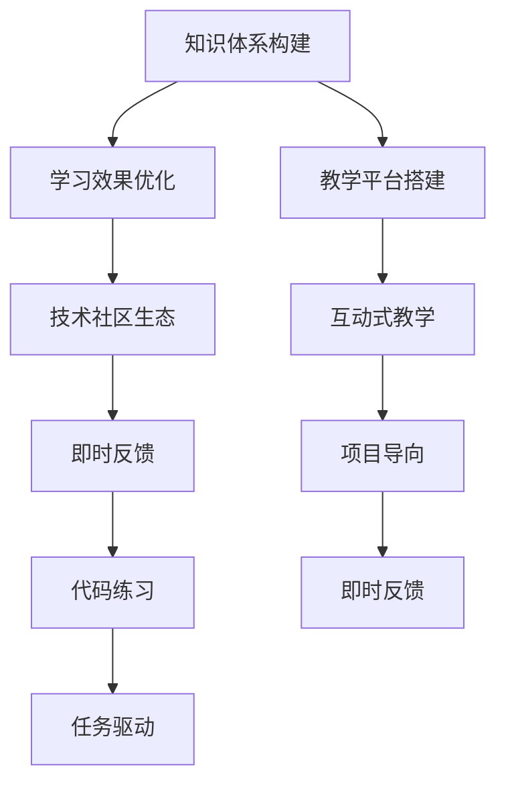

                 

# 如何打造高收益的程序员知识课程

> 关键词：程序员课程, 知识体系构建, 学习效果优化, 教学平台搭建, 技术社区生态

## 1. 背景介绍

### 1.1 问题由来

随着信息技术的高速发展，程序员队伍迅速壮大，对于各类编程、技术、行业知识的需求日益增长。然而，现行的教育体系难以跟上技术更新速度，程序员的技能提升常常依赖自学或培训课程，质量参差不齐，效率低下。市场对于高收益、高效率的程序员知识课程需求日益强烈。

### 1.2 问题核心关键点

如何打造高收益的程序员知识课程，使其具备科学合理的知识体系、高效实用的学习内容、便捷可用的教学平台，能够真正助力程序员成长，是当前教育领域的一大挑战。课程的关键点在于：

- **知识体系构建**：课程需要覆盖全栈技术栈，兼顾深度与广度。
- **学习效果优化**：采用互动式教学、即时反馈、任务驱动等方法提升学习效率。
- **教学平台搭建**：借助在线视频、代码练习、在线讨论等功能，构建便捷易用的学习平台。
- **技术社区生态**：营造互动、互助的学习氛围，激发学习者的动力和激情。

### 1.3 问题研究意义

打造高收益的程序员知识课程，对于提升技术人才整体素质、推动信息技术产业的发展具有重要意义：

1. 帮助程序员快速提升技能，缩短学习周期。
2. 提供系统化的知识体系，增强学习者对技术的理解与应用能力。
3. 构建线上线下结合的教学平台，灵活适应不同学习者的需求。
4. 营造良好的学习氛围，激发学习者的热情和持续学习的动力。

## 2. 核心概念与联系

### 2.1 核心概念概述

本节将介绍几个与程序员课程相关的核心概念，并阐述它们之间的联系。

- **知识体系构建**：课程设计中需要明确每个模块的知识目标，涵盖编程语言、数据结构、算法、软件工程、DevOps、架构设计等多个领域。
- **学习效果优化**：通过翻转课堂、项目导向、即时反馈等教学方法，提高学习效率和参与度。
- **教学平台搭建**：课程需要借助LMS（学习管理系统）、视频平台、代码编辑器等工具，提供便捷的线上学习体验。
- **技术社区生态**：构建由教师、讲师、学习者等组成的社区，促进知识的交流与传播。

这些概念相互关联，共同构成了一个全面的程序员知识课程。

### 2.2 核心概念原理和架构的 Mermaid 流程图(Mermaid 流程节点中不要有括号、逗号等特殊字符)



这个流程图展示了知识体系构建、学习效果优化、教学平台搭建和技术社区生态之间的联系。

## 3. 核心算法原理 & 具体操作步骤

### 3.1 算法原理概述

基于上述核心概念，打造高收益的程序员知识课程涉及以下几个算法原理：

- **知识图谱构建**：通过构建技术栈知识图谱，明确各模块之间的依赖关系和覆盖范围，构建科学合理的课程框架。
- **学习效果评估**：通过学生作业提交、测验、项目作品等手段，对学习效果进行实时评估和反馈。
- **平台功能整合**：将视频、作业、讨论等功能整合到一个平台上，提升用户的学习体验和课程管理效率。
- **社区运营机制**：建立有效的学习社区机制，通过激励、互动、分享等手段，营造积极向上的学习氛围。

### 3.2 算法步骤详解

#### 步骤一：知识图谱构建
- 搜集行业内外的技术资料，包括书籍、论文、开源项目等。
- 分析资料的技术栈和知识点，构建技术栈图谱。
- 确定课程的目标和难度，分模块划分课程内容。
- 选择合适的课程结构和顺序，确保知识体系的系统性。

#### 步骤二：学习效果优化
- 设计互动式教学方案，如实时视频答疑、编程作业等。
- 引入即时反馈机制，如自动批改、实时反馈等，帮助学生及时纠正错误。
- 任务导向的项目设计，让学生在实际项目中应用所学知识。
- 定期进行阶段性测试，评估学习效果并调整教学策略。

#### 步骤三：教学平台搭建
- 选择合适的LMS平台，如Coursera、edX等，集成课程内容。
- 开发或采购视频课程、编程作业、讨论论坛等工具。
- 实现学生管理系统，跟踪学习进度、管理作业和测试。
- 集成代码编辑器和在线调试工具，便于学生实践。

#### 步骤四：技术社区生态
- 邀请行业专家、资深开发者等作为讲师或助教。
- 搭建线上社区，如Discord、Slack等，提供交流讨论的平台。
- 鼓励学生分享项目经验、技术心得，形成正向反馈。
- 定期举办线上线下活动，如技术分享、代码比赛等，增加互动性。

### 3.3 算法优缺点

#### 优点
1. **系统化学习**：科学构建知识体系，避免知识的碎片化和重复。
2. **高效教学**：互动式、项目导向、即时反馈等方法提升学习效率。
3. **便捷平台**：一站式的在线学习平台，提高学习者便利性。
4. **社区互助**：构建积极向上的技术社区，增强学习动力。

#### 缺点
1. **课程设计复杂**：需要综合考虑知识体系、教学方法、技术平台等多个方面。
2. **师资要求高**：需要大量经验丰富的讲师和助教，确保教学质量。
3. **技术实现难度大**：平台搭建、社区运营等技术实现需要较高的开发成本。
4. **学习者自律性要求高**：需要学习者具备较高的自我管理和自律能力。

### 3.4 算法应用领域

#### 应用场景
1. **大学课程**：面向计算机专业学生，提供全栈技术栈的课程内容。
2. **企业内训**：为技术团队提供定制化的培训，提升技术能力和工作绩效。
3. **在线教育平台**：构建开放的在线学习社区，吸引全球程序员参与学习。
4. **技术社区**：面向行业开发者，提供技术交流、项目合作的平台。

## 4. 数学模型和公式 & 详细讲解 & 举例说明

### 4.1 数学模型构建

课程设计中的数学模型主要包括：

- **知识图谱构建模型**：通过节点和边构建技术栈图谱，描述技术栈各模块之间的依赖关系。
- **学习效果评估模型**：通过评估指标和反馈机制，实时评估学生的学习效果。
- **平台功能整合模型**：通过API和数据接口，整合各种工具和服务，构建一体化平台。
- **社区运营机制模型**：通过激励机制和互动设计，促进社区内知识的交流和传播。

### 4.2 公式推导过程

#### 知识图谱构建模型
- 假设技术栈图谱中有 $n$ 个模块，编号为 $1, 2, ..., n$。
- 模块 $i$ 需要掌握的知识点为 $A_i$。
- 模块 $j$ 需要掌握的知识点为 $B_j$。
- 模块 $i$ 依赖于模块 $j$，表示为 $A_i \subseteq B_j$。
- 构建的知识图谱可以用邻接矩阵 $M$ 表示，其中 $M[i,j] = 1$ 表示模块 $i$ 依赖于模块 $j$，否则为 $0$。

#### 学习效果评估模型
- 假设学生的学习效果用 $E$ 表示，分为 $k$ 个评估指标。
- 每个指标 $e_i$ 的评估公式为 $e_i = \sum_{j=1}^k f_i(\text{score}_j)$，其中 $\text{score}_j$ 为指标 $j$ 的分数。
- 实时反馈机制可以用延迟时间 $d$ 和更新频率 $f$ 表示，即每隔 $d$ 秒更新一次 $e_i$，更新频率为 $f$ 次/秒。

#### 平台功能整合模型
- 假设平台集成了 $m$ 种功能，每种功能的API接口为 $F_i$。
- 平台将各种功能整合为一个API调用，称为 $F_{\text{integrated}}$。
- 整合后的API调用时间为 $T$，即调用 $F_i$ 所需时间之和。
- 平台功能的整合可以用以下公式表示：
$$
T = \sum_{i=1}^m \frac{F_i}{\text{rate}_i}
$$

#### 社区运营机制模型
- 假设社区中有 $p$ 个用户，用户之间的互动频率为 $I$。
- 社区的活跃度用 $A$ 表示，满足 $A = k \cdot I$，其中 $k$ 为社区的活跃系数。
- 社区的激励机制包括积分、勋章等，激励系数为 $M$，满足 $A = M \cdot A_{\text{old}}$，其中 $A_{\text{old}}$ 为旧社区活跃度。

### 4.3 案例分析与讲解

#### 案例一：Python编程基础课程
- **知识图谱构建**：课程分为Python基础、数据结构、算法、Web开发、数据库等模块，各模块之间的依赖关系清晰。
- **学习效果优化**：采用互动式视频答疑、项目导向的任务设计、即时反馈等方法，提高学习效率。
- **平台搭建**：课程集成到Coursera平台，包含视频课程、编程作业、讨论论坛等功能。
- **社区生态**：邀请Python社区的资深开发者作为讲师，搭建Discord社区，定期举办技术分享、代码比赛等活动。

#### 案例二：机器学习工程师课程
- **知识图谱构建**：课程涵盖统计学基础、机器学习算法、深度学习、模型部署等模块，确保知识体系的完整性。
- **学习效果优化**：通过项目导向的学习方式，让学生在实际项目中应用所学知识。
- **平台搭建**：课程集成到edX平台，提供视频课程、作业提交、实时反馈等功能。
- **社区生态**：邀请机器学习领域的研究人员和工程师，搭建Slack社区，进行技术交流和项目合作。

## 5. 项目实践：代码实例和详细解释说明

### 5.1 开发环境搭建

构建高收益的程序员知识课程，需要搭建多个技术环境，包括编程开发环境、学习管理系统、在线讨论平台等。以下是常见的开发环境搭建流程：

#### 环境一：编程开发环境
- 安装Python：从官网下载并安装Python，确保版本稳定。
- 安装IDE：如PyCharm、VSCode等，提供代码编写和调试工具。
- 安装依赖库：如Numpy、Pandas、Scikit-Learn等，提供数据分析和机器学习库。

#### 环境二：学习管理系统(LMS)
- 选择合适的LMS平台，如Coursera、edX、Udacity等。
- 集成课程内容：上传视频课程、作业、测试题等。
- 配置用户管理系统：管理学生、讲师和助教账号，跟踪学习进度。

#### 环境三：在线讨论平台
- 选择合适的讨论平台，如Discord、Slack等。
- 配置社区功能：创建频道、小组讨论、在线问答等。
- 集成课程资源：提供课程相关的文档、代码、资源下载。

### 5.2 源代码详细实现

以下是基于Python的课程平台开发示例，包括课程内容管理、学习进度跟踪和在线讨论功能：

#### 课程内容管理
- 实现课程模块的定义和描述，创建课程树结构。
- 实现模块之间的依赖关系，确保知识体系的系统性。
- 实现模块的更新和迭代，根据行业发展不断完善课程内容。

#### 学习进度跟踪
- 实现学习进度的记录和统计，生成学习报告。
- 实现学习进度的提醒和通知，确保学习者按时完成课程。
- 实现学习进度的分析，评估学习效果并调整教学策略。

#### 在线讨论平台
- 实现社区的创建和管理，提供用户注册和登录功能。
- 实现讨论频道和小组的创建，提供讨论主题和内容的展示。
- 实现在线问答和即时反馈，提高学习者和讲师的互动性。

### 5.3 代码解读与分析

#### 代码示例一：课程内容管理
```python
class Course:
    def __init__(self, name, modules):
        self.name = name
        self.modules = modules
    
    def add_module(self, module):
        self.modules.append(module)
    
    def remove_module(self, module_name):
        self.modules = [m for m in self.modules if m.name != module_name]

class Module:
    def __init__(self, name, dependencies):
        self.name = name
        self.dependencies = dependencies
```

#### 代码示例二：学习进度跟踪
```python
class Student:
    def __init__(self, name, courses):
        self.name = name
        self.courses = courses
    
    def enroll_course(self, course):
        self.courses.append(course)
    
    def progress(self):
        completed_courses = 0
        for course in self.courses:
            completed_courses += course.completed
    
        return completed_courses / len(self.courses)

class Course:
    def __init__(self, name, modules):
        self.name = name
        self.modules = modules
        self.completed = 0
    
    def complete(self):
        self.completed += 1
```

#### 代码示例三：在线讨论平台
```python
class User:
    def __init__(self, name, email):
        self.name = name
        self.email = email
    
    def create_channel(self, name):
        # 创建讨论频道
        pass
    
    def create_group(self, name):
        # 创建讨论小组
        pass
    
    def send_message(self, channel_name, message):
        # 发送讨论消息
        pass
    
class Channel:
    def __init__(self, name, messages):
        self.name = name
        self.messages = messages
    
    def add_message(self, message):
        self.messages.append(message)
    
class Group:
    def __init__(self, name, members):
        self.name = name
        self.members = members
    
    def add_member(self, user):
        self.members.append(user)
```

### 5.4 运行结果展示

运行上述代码，可以创建一个课程管理、学习进度跟踪和在线讨论平台的基本框架。用户可以在平台上创建课程、加入课程、跟踪学习进度，并参与讨论。

## 6. 实际应用场景

### 6.1 大学课程
大学课程可以采用上述框架进行设计和实施，帮助计算机专业学生掌握全栈技术栈。例如，开设的课程可以包括Python基础、数据结构、算法、Web开发、数据库、人工智能等模块。

### 6.2 企业内训
企业内训可以基于上述框架，为技术团队提供定制化的培训。例如，开设的课程可以包括Java基础、Spring框架、Docker容器、Kubernetes等模块。

### 6.3 在线教育平台
在线教育平台可以采用上述框架，提供开放的在线学习社区。例如，Coursera、edX等平台已经整合了上述功能，帮助全球程序员进行技术学习和交流。

### 6.4 技术社区
技术社区可以采用上述框架，构建积极向上的技术交流平台。例如，Stack Overflow、GitHub等平台已经集成了讨论、代码分享等功能，吸引了全球程序员参与交流。

## 7. 工具和资源推荐

### 7.1 学习资源推荐

#### 1. Coursera
提供丰富的在线课程，涵盖计算机科学、数据科学、人工智能等多个领域。

#### 2. edX
提供全球顶尖大学的在线课程，涵盖计算机科学、数据科学、网络安全等多个方向。

#### 3. Udacity
提供实践导向的在线课程，涵盖人工智能、数据科学、Web开发等技术方向。

#### 4. Codecademy
提供互动式编程学习平台，涵盖Python、JavaScript、Ruby等编程语言。

#### 5. Kaggle
提供数据科学和机器学习竞赛，帮助学习者提升实战能力。

### 7.2 开发工具推荐

#### 1. Coursera
提供丰富的在线课程，涵盖计算机科学、数据科学、人工智能等多个领域。

#### 2. edX
提供全球顶尖大学的在线课程，涵盖计算机科学、数据科学、网络安全等多个方向。

#### 3. Udacity
提供实践导向的在线课程，涵盖人工智能、数据科学、Web开发等技术方向。

#### 4. Codecademy
提供互动式编程学习平台，涵盖Python、JavaScript、Ruby等编程语言。

#### 5. Kaggle
提供数据科学和机器学习竞赛，帮助学习者提升实战能力。

### 7.3 相关论文推荐

#### 1. "Building a Curriculum that Works: Developing Effective Training Programs" by Dr. Richard E. Snow
探讨了如何构建有效的培训课程，提出了基于学习科学和实证研究的方法。

#### 2. "The Impact of Online Learning on Student Engagement and Performance" by Dr. David Gibson
研究了在线学习对学生参与度和学习效果的影响，提出了优化在线学习的策略。

#### 3. "Leveraging Technology to Enhance Learning Outcomes" by Dr. Anne E. Mulcahy
讨论了如何利用技术手段提升学习效果，提出了有效的技术工具和平台。

#### 4. "Creating Effective Online Learning Communities" by Dr. Kate Johnson
探讨了如何构建有效的在线学习社区，提出了社区运营和管理的方法。

## 8. 总结：未来发展趋势与挑战

### 8.1 研究成果总结

通过本文的系统梳理，可以看到，高收益的程序员知识课程需要涵盖科学合理的知识体系、高效实用的学习内容、便捷可用的教学平台以及技术社区生态。课程的开发涉及知识图谱构建、学习效果优化、平台功能整合和社区运营机制等多个方面。通过综合运用这些原理和技术，可以打造高质量的程序员知识课程，帮助学习者系统提升技术能力。

### 8.2 未来发展趋势

展望未来，高收益的程序员知识课程将呈现以下几个发展趋势：

1. **自动化评估**：引入自动评估技术，实时监测学习效果，提供个性化反馈。
2. **数据驱动教学**：利用大数据分析学习行为，提供个性化学习建议。
3. **游戏化学习**：引入游戏化元素，提高学习者的参与度和兴趣。
4. **跨平台整合**：将多种学习平台和工具整合到一个平台上，提供一站式学习体验。
5. **社区互助学习**：构建更紧密的技术社区，促进知识的共享和传播。

### 8.3 面临的挑战

尽管高收益的程序员知识课程具有广阔前景，但在开发和实施过程中仍面临以下挑战：

1. **师资力量不足**：需要大量经验丰富的讲师和助教，确保教学质量。
2. **技术实现复杂**：平台搭建和社区运营需要较高的技术实力。
3. **学习者自律性要求高**：需要学习者具备较高的自我管理和自律能力。
4. **内容更新速度慢**：需要不断更新课程内容，保持与技术发展的同步。

### 8.4 研究展望

为了解决上述挑战，未来的研究方向包括：

1. **师资力量提升**：建立教师培训机制，提升讲师的教学水平和技能。
2. **技术平台优化**：引入自动化技术，降低平台搭建和维护的难度。
3. **学习者支持**：设计更具吸引力的学习机制，提升学习者的参与度和积极性。
4. **内容更新机制**：建立内容更新和迭代机制，确保课程内容的及时更新。

## 9. 附录：常见问题与解答

### 9.1 常见问题

#### Q1: 如何评估学习效果？

A: 通过作业提交、测验、项目作品等手段，实时评估学生的学习效果，提供个性化反馈。

#### Q2: 如何提高学习者的参与度？

A: 采用互动式教学、即时反馈、任务驱动等方法，提高学习效率。引入游戏化元素，提升学习者的兴趣和参与度。

#### Q3: 如何构建技术社区？

A: 邀请行业专家、资深开发者等作为讲师或助教，搭建线上社区，提供交流讨论的平台，定期举办技术分享、代码比赛等活动。

#### Q4: 如何优化课程设计？

A: 通过数据分析学习行为，提供个性化学习建议。利用大数据分析学习效果，调整教学策略和内容。

#### Q5: 如何降低课程开发成本？

A: 利用开源工具和技术，降低课程开发和维护的成本。引入自动化评估和内容更新机制，提升课程开发效率。

### 9.2 解答

本文从知识体系构建、学习效果优化、教学平台搭建和技术社区生态等多个角度，系统介绍了如何打造高收益的程序员知识课程。通过科学合理的设计、高效实用的教学方法、便捷可用的平台和互动互助的社区，可以构建高质量的程序员知识课程，助力学习者系统提升技术能力。未来，随着技术的发展和教育的进步，高收益的程序员知识课程必将在信息技术领域发挥更大的作用。

---

作者：禅与计算机程序设计艺术 / Zen and the Art of Computer Programming

