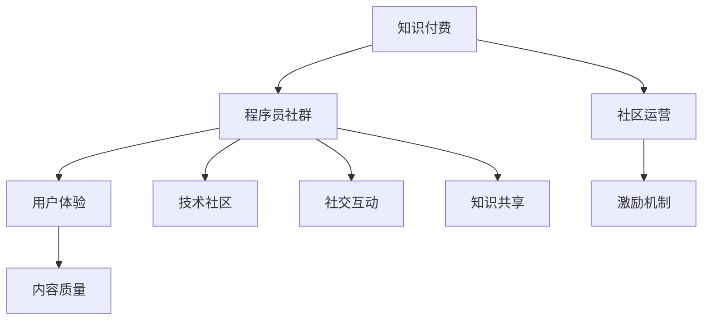

                 

# 如何打造高活跃的程序员知识付费社群

> 关键词：知识付费, 程序员社群, 社区运营, 用户体验, 激励机制, 内容质量, 技术社区, 社交互动, 知识共享

## 1. 背景介绍

在数字化时代，知识付费成为一种新的消费趋势，特别是在程序员社区中，技术知识的快速更新和迭代使得持续学习成为必要。知识付费社群的出现，为程序员提供了一个高效获取知识、交流经验、共同成长的平台。然而，要打造一个高活跃的程序员知识付费社群并不容易，需要从多个维度进行精细化运营。本文将从背景介绍、核心概念与联系、核心算法原理与具体操作步骤、数学模型与公式推导、项目实践、实际应用场景、工具和资源推荐、总结、未来发展趋势与挑战及附录等方面，详细阐述如何打造高活跃的程序员知识付费社群。

## 2. 核心概念与联系

### 2.1 核心概念概述

要打造高活跃的程序员知识付费社群，首先需要明确几个核心概念：

- **知识付费**：即通过付费方式获取知识、技能、信息等，是一种基于知识服务的产品形态。在程序员社群中，知识付费可以表现为课程、讲座、技术交流等形式。

- **程序员社群**：是指由程序员组成的网络社区，以技术交流、项目合作、资源共享等为主要活动内容，形成了一种半虚拟化的社交网络。

- **社区运营**：指通过一系列策略和活动，提升社群的活跃度和粘性，包括内容管理、用户互动、品牌建设等。

- **用户体验**：即用户在使用社群时的主观感受和满意度，通过优化界面设计、功能体验、内容质量等方面提升用户体验，增强用户粘性。

- **激励机制**：通过奖励、积分、荣誉等手段，激励用户积极参与社群活动，提升社群活跃度。

- **内容质量**：社群中提供的高质量、有价值的内容是吸引用户、提升用户满意度的关键，包括原创文章、技术分享、课程视频等。

- **技术社区**：基于特定技术领域或兴趣爱好的社群，如编程语言、开发框架、数据科学等。

- **社交互动**：社群中用户之间的交流互动，通过讨论区、私信、社交网络等形式进行。

- **知识共享**：用户将自己的知识、经验、见解分享给社群，形成知识积累和共享的良性循环。

这些概念之间的逻辑关系可以通过以下Mermaid流程图来展示：



## 3. 核心算法原理 & 具体操作步骤

### 3.1 算法原理概述

打造高活跃的程序员知识付费社群，核心在于优化社区运营策略，提升用户体验，激励用户积极参与，同时确保内容质量。这一过程涉及多个算法和技术的综合应用。

- **社区推荐算法**：通过算法推荐机制，将高质量的内容推荐给用户，提升用户发现新知识的效率和兴趣。
- **用户行为分析**：通过数据分析技术，理解用户行为和偏好，优化内容和活动安排，增强用户体验。
- **互动激励算法**：设计合适的激励机制，奖励用户贡献，促进社交互动和知识共享。
- **内容质量评估**：建立内容质量评估体系，确保社群中提供的信息是准确、有价值的。

### 3.2 算法步骤详解

#### 3.2.1 社区推荐算法

**Step 1: 数据收集**
- 收集用户在社群中的互动数据，包括阅读、点赞、评论、分享等行为。
- 收集社群中内容的数据，包括发布时间、标签、作者、评价等。

**Step 2: 特征工程**
- 提取用户行为特征，如访问频率、活跃时间、兴趣偏好等。
- 提取内容特征，如关键词、技术难度、互动热度等。

**Step 3: 模型训练**
- 使用协同过滤、内容推荐等算法，训练社区推荐模型。
- 使用用户行为数据和内容数据训练推荐模型，找到用户与内容的匹配关系。

**Step 4: 推荐实现**
- 将训练好的推荐模型应用到用户行为数据上，生成个性化推荐列表。
- 实时更新推荐列表，保证用户能够获取最新、最相关的知识内容。

#### 3.2.2 用户行为分析

**Step 1: 数据收集**
- 收集用户在社群中的行为数据，如登录时间、浏览内容、参与讨论等。
- 收集用户的基本信息，如注册时间、会员等级、职业背景等。

**Step 2: 特征工程**
- 提取用户行为特征，如活跃度、兴趣领域、贡献度等。
- 提取用户背景特征，如职业、教育背景、工作年限等。

**Step 3: 模型训练**
- 使用机器学习算法，如聚类、分类等，训练用户行为分析模型。
- 使用用户行为数据和背景数据训练模型，找到用户行为与背景的关联性。

**Step 4: 分析实现**
- 将训练好的分析模型应用到用户数据上，生成用户画像。
- 根据用户画像，个性化推送内容、活动，提升用户体验。

#### 3.2.3 互动激励算法

**Step 1: 设计激励机制**
- 根据社群的特点，设计合适的激励机制，如积分系统、荣誉榜、排行榜等。
- 确定激励的方式和条件，如发布高质量内容、积极参与讨论、完成学习任务等。

**Step 2: 实现激励系统**
- 开发激励系统的后端逻辑，实现积分计算、荣誉授予、排名更新等。
- 开发前端界面，展示激励成果，激励用户积极参与。

**Step 3: 激励反馈**
- 定期分析激励系统的效果，调整激励机制，确保其公平、合理、有吸引力。
- 收集用户反馈，优化激励系统的设计和功能。

#### 3.2.4 内容质量评估

**Step 1: 定义评估标准**
- 根据社群的特点，定义内容质量评估的标准，如原创性、实用性、准确性等。
- 建立内容审核机制，确保内容符合标准。

**Step 2: 评估工具开发**
- 开发内容评估工具，对用户上传的内容进行自动化评估。
- 引入人工评审，对自动化评估结果进行复核和调整。

**Step 3: 反馈机制建立**
- 建立内容质量反馈机制，让用户可以对内容进行评价。
- 根据用户评价，优化内容审核标准和评估工具。

### 3.3 算法优缺点

#### 3.3.1 社区推荐算法的优缺点

**优点**：
- 提高用户发现新知识的效率，增加社群活跃度。
- 通过个性化推荐，满足用户多样化的需求。

**缺点**：
- 算法复杂度较高，需要大量的数据和计算资源。
- 用户隐私保护问题，需要合理使用和存储用户数据。

#### 3.3.2 用户行为分析的优缺点

**优点**：
- 了解用户行为和偏好，提升用户体验。
- 通过用户画像，个性化推送内容，增加用户粘性。

**缺点**：
- 用户数据可能存在隐私问题，需要合理使用和保护。
- 数据质量对模型效果有较大影响，需要定期清洗和更新。

#### 3.3.3 互动激励算法的优缺点

**优点**：
- 激励用户积极参与社群活动，增加社群互动和知识共享。
- 通过积分、荣誉等手段，提升用户归属感和满足感。

**缺点**：
- 激励机制设计不当，可能引发用户间的竞争和不公平。
- 激励效果的持久性问题，需要定期调整和优化。

#### 3.3.4 内容质量评估的优缺点

**优点**：
- 确保社群中提供的信息是准确、有价值的，提升用户信任度。
- 通过用户评价，不断优化内容审核标准和工具。

**缺点**：
- 内容审核可能存在主观性和局限性，需要人工复核。
- 自动化评估工具需要不断优化和更新，以适应变化的内容质量标准。

### 3.4 算法应用领域

**社区推荐算法**：广泛应用于在线教育平台、社交媒体、电子商务等领域的个性化推荐服务。

**用户行为分析**：在市场营销、客户关系管理、人力资源等领域，帮助企业了解用户行为和需求，提升用户满意度。

**互动激励算法**：在游戏、社交网络、在线论坛等社区中，通过积分、排行榜等方式激励用户积极参与。

**内容质量评估**：在内容分发平台、新闻媒体、学术论文等领域，确保内容质量，提升用户信任度。

## 4. 数学模型和公式 & 详细讲解 & 举例说明

### 4.1 数学模型构建

假设社群中有 $N$ 个用户，每个用户有 $M$ 篇感兴趣的文章，每篇文章有 $K$ 个标签。记 $X$ 为用户的兴趣特征向量，$C$ 为文章的标签特征向量，$Y$ 为用户的活跃度特征向量，$A$ 为文章的互动热度特征向量。

**用户行为分析模型**：
$$
X = f_{user}(Y)
$$
其中 $f_{user}$ 为用户的兴趣特征提取函数。

**文章推荐模型**：
$$
R_{ij} = \text{cosine}(X_i, C_j)
$$
其中 $R_{ij}$ 为用户 $i$ 对文章 $j$ 的推荐度，$\text{cosine}$ 为余弦相似度函数。

**内容质量评估模型**：
$$
Q_i = \frac{1}{M} \sum_{j=1}^M R_{ij}
$$
其中 $Q_i$ 为用户 $i$ 的平均推荐度，用于评估用户 $i$ 的内容质量。

### 4.2 公式推导过程

#### 4.2.1 用户行为分析模型

根据用户的活跃度特征 $Y$，提取用户的兴趣特征 $X$：
$$
X_i = f_{user}(Y_i)
$$
其中 $f_{user}$ 为特征映射函数，如线性变换、逻辑回归等。

#### 4.2.2 文章推荐模型

用户 $i$ 对文章 $j$ 的推荐度 $R_{ij}$ 为 $X_i$ 和 $C_j$ 的余弦相似度：
$$
R_{ij} = \frac{X_i \cdot C_j}{||X_i|| \cdot ||C_j||}
$$
其中 $||.||$ 为向量范数。

#### 4.2.3 内容质量评估模型

用户 $i$ 的平均推荐度 $Q_i$ 为其对所有文章的推荐度之和：
$$
Q_i = \frac{1}{M} \sum_{j=1}^M R_{ij}
$$

### 4.3 案例分析与讲解

**案例**：某编程技术社群希望通过推荐系统提升用户活跃度。

**分析**：
1. **数据收集**：收集用户在社群中的行为数据，如阅读文章数、点赞数、评论数等。
2. **特征工程**：提取用户行为特征，如活跃度、兴趣领域、贡献度等。
3. **模型训练**：使用协同过滤算法训练推荐模型，找到用户与文章的匹配关系。
4. **推荐实现**：将训练好的推荐模型应用到用户行为数据上，生成个性化推荐列表。
5. **效果评估**：通过 A/B 测试等方法，评估推荐系统的效果，优化推荐算法和参数。

## 5. 项目实践：代码实例和详细解释说明

### 5.1 开发环境搭建

为了实现以上算法和模型，我们需要搭建一个包含以下组件的开发环境：

1. **数据收集工具**：用于从社群中收集用户行为数据和内容数据。
2. **特征工程工具**：用于提取用户和内容特征，并进行数据清洗和预处理。
3. **模型训练工具**：用于训练社区推荐模型、用户行为分析模型、互动激励算法等。
4. **应用开发工具**：用于实现个性化推荐、用户画像、激励系统等。

以下是一个典型的开发环境搭建步骤：

1. **数据收集工具**：使用 Flume、Kafka 等工具，实时收集用户在社群中的行为数据和内容数据。
2. **特征工程工具**：使用 Pandas、NumPy 等 Python 库，对数据进行清洗、预处理和特征提取。
3. **模型训练工具**：使用 TensorFlow、PyTorch 等深度学习框架，训练推荐模型、行为分析模型等。
4. **应用开发工具**：使用 Django、Flask 等 Web 框架，实现个性化推荐、用户画像、激励系统等功能。

### 5.2 源代码详细实现

以下是一个简单的 Python 代码实现，用于用户行为分析模型的训练和评估：

```python
import pandas as pd
import numpy as np
from sklearn.ensemble import RandomForestRegressor

# 读取数据
df = pd.read_csv('user_behavior_data.csv')

# 数据预处理
X = df[['active_time', 'interest_field', 'contribution']]
Y = df['label']  # 0表示活跃用户，1表示不活跃用户

# 特征工程
X = pd.get_dummies(X, prefix='feature_')
X = X.drop(['id'], axis=1)  # 移除用户 ID 列

# 模型训练
model = RandomForestRegressor()
model.fit(X, Y)

# 模型评估
X_test = pd.read_csv('test_user_data.csv')
X_test = X_test.drop(['id'], axis=1)
y_pred = model.predict(X_test)
```

### 5.3 代码解读与分析

**代码分析**：
1. **数据读取**：使用 Pandas 的 `read_csv` 方法读取用户行为数据和标签数据。
2. **数据预处理**：使用 NumPy 和 Pandas 进行数据清洗、转换和特征提取。
3. **模型训练**：使用 Scikit-learn 的 `RandomForestRegressor` 模型，训练用户行为分析模型。
4. **模型评估**：使用模型对测试数据进行预测，并输出预测结果。

**代码优化**：
1. **特征工程**：根据需求选择合适的特征，并进行降维和归一化处理。
2. **模型选择**：根据数据特点和业务需求，选择适合的模型进行训练。
3. **模型调参**：通过网格搜索、交叉验证等方法，优化模型参数，提升模型效果。
4. **模型集成**：通过集成多个模型，提升模型的鲁棒性和泛化能力。

### 5.4 运行结果展示

```python
# 预测结果展示
print(y_pred)
```

## 6. 实际应用场景

### 6.1 智能招聘

在智能招聘平台中，通过知识付费社群，企业可以快速找到合适的候选人。通过社区推荐算法，将候选人的简历和职位需求进行匹配，推荐给企业；同时，通过用户行为分析，了解候选人的技术能力和发展潜力，提供更精准的招聘建议。

### 6.2 技术培训

在线教育平台通过知识付费社群，提供高质量的技术培训课程。通过社区推荐算法，将适合用户的学习路径推荐给用户；通过用户行为分析，了解用户的学习进度和效果，提供个性化的学习建议。

### 6.3 开源项目维护

开源项目维护团队通过知识付费社群，汇聚众多开发者，共同推进项目进展。通过社区推荐算法，将问题需求推荐给开发者；通过用户行为分析，了解开发者的技术水平和贡献度，优化项目资源配置。

### 6.4 未来应用展望

未来的知识付费社群将更加智能化、个性化。通过引入 AI 和大数据技术，社群能够提供更加精准的推荐、更深入的用户分析、更灵活的激励机制。同时，知识付费的形式也将更加多样化，包括视频课程、直播讲座、技术沙龙等。

## 7. 工具和资源推荐

### 7.1 学习资源推荐

1. **《知识付费与社群运营》课程**：由知名互联网公司提供，详细讲解知识付费和社群运营的策略和案例。
2. **《Python数据分析与机器学习》书籍**：介绍数据收集、特征工程、模型训练等技术，适合初学者和进阶开发者。
3. **《深度学习实战》书籍**：包含深度学习框架的使用方法和实践案例，适合开发者学习实践。

### 7.2 开发工具推荐

1. **Jupyter Notebook**：基于 Web 的交互式编程环境，适合数据分析、机器学习等任务的实现。
2. **TensorFlow**：Google 提供的深度学习框架，支持分布式计算和 GPU 加速。
3. **PyTorch**：Facebook 提供的深度学习框架，易于使用，适合研究和快速迭代。

### 7.3 相关论文推荐

1. **《社区推荐系统：方法、算法与实践》**：详细介绍了社区推荐系统的设计、实现和优化。
2. **《用户行为分析与个性化推荐》**：介绍用户行为分析技术，并提供案例分析。
3. **《激励机制设计与实现》**：探讨激励机制的设计原则和实施方法。

## 8. 总结：未来发展趋势与挑战

### 8.1 研究成果总结

本文通过系统介绍社区推荐算法、用户行为分析、互动激励算法和内容质量评估等技术，阐述了如何打造高活跃的程序员知识付费社群。通过实践案例和代码实现，展示了具体的实施步骤和方法。

### 8.2 未来发展趋势

未来知识付费社群将更加智能化、个性化。AI 和大数据技术的引入，将使得社群能够提供更加精准的推荐、更深入的用户分析、更灵活的激励机制。同时，知识付费的形式也将更加多样化，包括视频课程、直播讲座、技术沙龙等。

### 8.3 面临的挑战

尽管知识付费社群带来了许多机遇，但也面临以下挑战：
1. **用户数据隐私**：如何在保证用户隐私的前提下，收集和利用用户数据。
2. **内容质量控制**：如何确保社群中提供的内容是高质量、有价值的。
3. **用户激励机制**：如何设计合适的激励机制，激发用户积极参与。

### 8.4 研究展望

未来的研究将集中在以下方面：
1. **数据隐私保护**：研究如何保护用户隐私，确保数据安全。
2. **内容质量提升**：研究更先进的内容审核和推荐算法，提升内容质量。
3. **激励机制优化**：研究更加公平、合理的激励机制，促进用户参与。

## 9. 附录：常见问题与解答

### 9.1 问题 1：如何选择合适的推荐算法？

**解答**：选择合适的推荐算法需要考虑数据特点、应用场景和资源限制。常用的推荐算法包括协同过滤、内容推荐、混合推荐等。可以通过 A/B 测试等方法，评估不同算法的效果，选择最合适的算法。

### 9.2 问题 2：如何提高社区推荐算法的准确率？

**解答**：提高推荐算法的准确率需要优化特征工程、调整算法参数、引入反馈机制等。同时，需要注意数据质量和实时性，确保推荐结果的及时性和准确性。

### 9.3 问题 3：用户行为分析模型有哪些常见的特征？

**解答**：常见的用户行为特征包括活跃度、兴趣领域、贡献度等。特征的选择需要结合业务需求和数据特点，进行合理设计。

### 9.4 问题 4：如何优化用户行为分析模型的效果？

**解答**：优化用户行为分析模型需要定期清洗和更新数据，选择合适的特征和算法，进行模型调参和集成等。同时，需要根据业务需求进行灵活调整，确保模型的有效性和实用性。

---

作者：禅与计算机程序设计艺术 / Zen and the Art of Computer Programming

