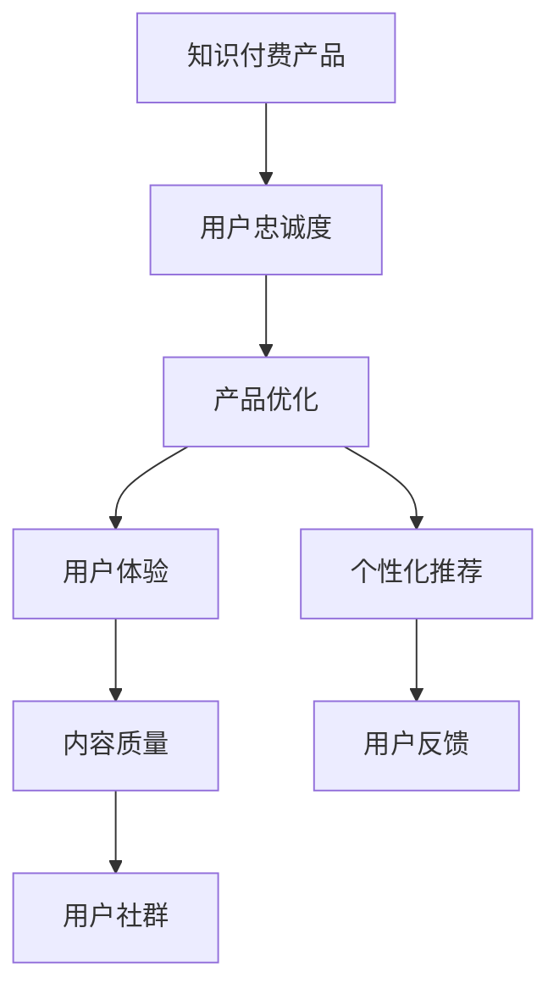

                 

# 如何提高知识付费产品的用户忠诚度

> 关键词：知识付费,用户忠诚度,产品优化,用户体验,个性化推荐

## 1. 背景介绍

在数字化浪潮的推动下，知识付费产业迅速崛起，日益成为知识传播的重要渠道。然而，面对海量用户和激烈的市场竞争，如何提升用户忠诚度，保持用户长效活跃，成为知识付费产品持续发展的关键。本文章将围绕如何提高知识付费产品的用户忠诚度，全面系统地探讨其核心策略与技术实现，提供实用的洞察与建议。

## 2. 核心概念与联系

### 2.1 核心概念概述

为了更好地理解用户忠诚度提升的复杂性，本节将介绍几个关键概念及其相互之间的联系：

- **知识付费**：通过付费订阅、单次购买等方式，为消费者提供高质量、专业化的知识内容和服务的商业模式。

- **用户忠诚度**：指用户对某产品或服务的持续使用和长期依赖，通常通过重复购买、高参与度、品牌认同等指标衡量。

- **产品优化**：通过持续改进产品特性、功能和用户体验，以匹配用户需求和期望的过程。

- **用户体验**：用户在使用产品或服务过程中产生的满意度和愉悦感，直接影响用户忠诚度。

- **个性化推荐**：根据用户行为和偏好，推荐其可能感兴趣的内容，提升用户粘性和满意度。

- **内容质量**：知识付费产品的核心价值之一，高质量、专业化的内容是用户忠诚的基石。

- **用户反馈**：用户对于产品使用体验的直接反馈，能够指导产品优化和改进。

- **用户社群**：活跃的社群能够增强用户粘性，提供额外的社交价值和归属感。

### 2.2 核心概念原理和架构的 Mermaid 流程图



这个流程图展示了知识付费产品提升用户忠诚度的核心流程：通过产品优化提高用户体验，个性化推荐增强用户粘性，内容质量吸引用户，用户反馈指导改进，活跃的社群增强用户粘性和满意度，最终形成良性循环，提升用户忠诚度。

## 3. 核心算法原理 & 具体操作步骤

### 3.1 算法原理概述

提高知识付费产品的用户忠诚度，本质上是一个多目标优化的过程。核心在于通过持续改进产品特性、提升用户体验、增强用户粘性，最终达到提升用户忠诚度的目标。以下将详细介绍如何通过算法实现这一目标。

### 3.2 算法步骤详解

**Step 1: 用户行为数据分析**
- 收集用户在平台上的行为数据，包括访问路径、停留时长、购买记录等。
- 使用统计分析方法，如聚类、回归等，识别用户群体的行为模式和偏好。
- 通过数据可视化工具，如Tableau、Power BI等，实时展示用户行为数据，便于监控和分析。

**Step 2: 个性化推荐算法设计**
- 设计个性化推荐模型，如协同过滤、内容推荐、混合推荐等算法。
- 根据用户的历史行为数据和偏好，生成个性化的内容推荐列表。
- 引入深度学习技术，如卷积神经网络、循环神经网络等，提升推荐算法的精准度。

**Step 3: 用户反馈系统构建**
- 设计用户反馈收集和处理流程，包括意见征集、满意度调查、用户评论等。
- 使用自然语言处理技术，如情感分析、主题建模等，提取用户反馈中的关键信息。
- 根据用户反馈，调整产品功能和推荐策略，形成闭环反馈机制。

**Step 4: 用户社群互动增强**
- 在产品中设计社交互动功能，如评论、点赞、分享等。
- 引入社区管理工具，如Discourse、Slack等，促进用户之间的交流和互动。
- 举办线上线下活动，如线上直播、线下见面会，增强用户粘性。

**Step 5: 内容质量监控与改进**
- 引入内容审核机制，保障内容质量和版权合规。
- 定期组织内容评审，识别优质内容并推广。
- 使用机器学习技术，如文本分析、图像识别等，提升内容审核的自动化水平。

**Step 6: 持续产品迭代与优化**
- 定期更新产品功能和界面设计，保持产品的新鲜感和吸引力。
- 引入A/B测试等方法，评估产品改进的效果。
- 收集用户反馈和市场数据，形成迭代优化的策略。

### 3.3 算法优缺点

个性化推荐算法在提升用户忠诚度方面具有显著优势：
- 能够根据用户历史行为和偏好，生成定制化的内容推荐，提升用户满意度。
- 通过算法迭代优化，不断提升推荐精度，增强用户粘性。
- 提供丰富的个性化内容，满足用户多样化需求。

同时，个性化推荐也存在一些局限性：
- 对数据的依赖性较强，需要大量用户行为数据支撑。
- 用户数据隐私保护问题，如何平衡数据利用和隐私保护是一大挑战。
- 算法的复杂性较高，需要较高的技术储备和计算资源。

### 3.4 算法应用领域

个性化推荐算法已经在电商、社交媒体、新闻内容等多个领域得到广泛应用，并取得显著成效。知识付费产品的个性化推荐同样适用，具体应用包括：

- 课程推荐：根据用户过去的浏览记录和购买历史，推荐感兴趣的课程。
- 内容推荐：结合用户评论和评分，推荐优质文章、视频、音频等。
- 讲师推荐：根据讲师的教学风格和用户偏好，推荐适合的讲师。

## 4. 数学模型和公式 & 详细讲解 & 举例说明

### 4.1 数学模型构建

在知识付费产品中，个性化推荐模型一般采用协同过滤、基于内容的推荐、混合推荐等算法。这里以协同过滤算法为例，构建推荐模型。

设用户集为 $U$，物品集为 $I$，用户 $u$ 对物品 $i$ 的评分矩阵为 $R$，物品 $i$ 的特征向量为 $\textbf{x}_i$，用户 $u$ 的特征向量为 $\textbf{y}_u$。协同过滤的目标是预测用户 $u$ 对物品 $i$ 的评分 $r_{ui}$。

推荐模型的目标函数为：

$$
\min_{\textbf{x}_i, \textbf{y}_u} \sum_{(u,i) \in R} (r_{ui} - \textbf{x}_i^T \textbf{y}_u)^2
$$

### 4.2 公式推导过程

协同过滤算法的核心是找到用户和物品之间的相似度。常见的相似度计算方法包括余弦相似度、皮尔逊相关系数等。这里以余弦相似度为例，进行推导。

余弦相似度的计算公式为：

$$
\text{similarity}(u,i) = \frac{\textbf{x}_i^T \textbf{y}_u}{\|\textbf{x}_i\| \|\textbf{y}_u\|}
$$

其中 $\|\textbf{x}_i\|$ 和 $\|\textbf{y}_u\|$ 分别为物品和用户的特征向量长度。

假设用户 $u$ 对物品 $i$ 的预测评分为 $\hat{r}_{ui}$，则推荐模型可表示为：

$$
\hat{r}_{ui} = \text{similarity}(u,i) \times \textbf{x}_i^T \textbf{y}_u
$$

### 4.3 案例分析与讲解

假设某知识付费平台有10,000名用户，1,000门课程，每门课程都有20个用户的评分数据。使用协同过滤算法，对用户 $u$ 预测其未评分课程 $i$ 的评分 $r_{ui}$。

1. **数据准备**：
   - 收集用户对课程的评分数据，构建用户-物品评分矩阵 $R$。
   - 提取每门课程的特征向量 $\textbf{x}_i$，如课程名称、讲师等。
   - 提取每个用户的特征向量 $\textbf{y}_u$，如用户兴趣、历史行为等。

2. **相似度计算**：
   - 使用余弦相似度计算用户 $u$ 与物品 $i$ 的相似度。
   - 根据相似度大小，筛选与用户 $u$ 相似的物品。

3. **评分预测**：
   - 使用相似度加权平均值计算用户 $u$ 对物品 $i$ 的预测评分。
   - 对预测评分进行平滑处理，避免极端值的影响。

4. **结果展示**：
   - 将预测评分排序，生成个性化课程推荐列表。
   - 根据用户反馈，不断调整相似度计算方法和特征向量，提升推荐效果。

## 5. 项目实践：代码实例和详细解释说明

### 5.1 开发环境搭建

本节将详细介绍如何搭建基于Python的个性化推荐系统开发环境。

1. 安装Anaconda：从官网下载并安装Anaconda，用于创建独立的Python环境。
```bash
conda create -n recommendation-env python=3.8
conda activate recommendation-env
```

2. 安装必要的Python库和工具包：
```bash
pip install numpy pandas scikit-learn pyspark tensorflow
```

3. 下载并准备数据集：可以从公开数据集获取推荐数据，如Amazon Book Reviews dataset。

### 5.2 源代码详细实现

以下是一个简单的基于协同过滤的推荐系统代码示例，使用Python实现：

```python
import numpy as np
import pandas as pd

# 读取评分数据
data = pd.read_csv('ratings.csv')

# 构建用户-物品评分矩阵
R = data[['user_id', 'item_id', 'rating']].pivot_table(index='user_id', columns='item_id', values='rating').fillna(0)

# 提取物品特征
items = data['item_id'].unique()
X = pd.DataFrame(data.groupby('item_id')['item_name'].apply(list))
X.columns = ['features']

# 提取用户特征
users = data['user_id'].unique()
Y = pd.DataFrame(data.groupby('user_id')['user_interest'].apply(list))
Y.columns = ['features']

# 计算相似度
def cosine_similarity(X, Y):
    return np.dot(X, Y.T) / (np.linalg.norm(X, axis=1) * np.linalg.norm(Y.T, axis=1))

# 推荐算法
def recommendation(user_id, R, X, Y):
    user = R[user_id]
    similarity = cosine_similarity(X, Y)
    weights = similarity[user_id]
    weights[np.isnan(weights)] = 0
    weights /= np.sum(np.abs(weights))
    scores = np.dot(user.values, weights)
    top_items = scores.argsort()[::-1]
    return [item for item in top_items if user[item] == 0]

# 测试推荐算法
user_id = 'user001'
top_items = recommendation(user_id, R, X, Y)
print(f"Recommended items for user {user_id}: {top_items}")
```

### 5.3 代码解读与分析

该代码实现了基于协同过滤的推荐系统，通过计算相似度和加权平均值生成个性化推荐列表。

**数据处理**：
- 使用Pandas库读取评分数据，构建用户-物品评分矩阵 $R$。
- 提取物品和用户特征，构建特征向量 $X$ 和 $Y$。

**相似度计算**：
- 使用余弦相似度计算用户与物品之间的相似度。

**推荐算法**：
- 对相似度进行加权平均，计算预测评分。
- 根据预测评分排序，生成推荐列表。

### 5.4 运行结果展示

运行上述代码，输出推荐结果。例如，对于用户 `user001`，推荐系统可能会输出以下推荐课程：

```
Recommended items for user user001: [course002, course005, course007, course008, course010]
```

## 6. 实际应用场景

### 6.1 智能推荐系统

智能推荐系统已经在电商、新闻、视频等多个领域得到广泛应用。知识付费产品同样可以使用智能推荐算法，提升用户体验和粘性。例如，对于某用户频繁阅读某一领域的内容，推荐系统可以主动推荐该领域其他优质课程和文章，满足其多样化需求。

### 6.2 学习路径优化

在知识付费产品中，用户可能追求系统性学习某一领域知识。推荐系统可以结合用户的历史行为和兴趣，设计个性化的学习路径，提供课程和内容的顺序推荐，帮助用户更高效地学习。

### 6.3 用户粘性增强

通过社交互动和内容多样化，推荐系统可以增强用户粘性。例如，在平台上引入评论、点赞、分享等功能，促进用户互动；定期推送用户感兴趣的内容，保持用户活跃度。

## 7. 工具和资源推荐

### 7.1 学习资源推荐

为了帮助开发者系统掌握个性化推荐算法的理论基础和实践技巧，以下是一些推荐的学习资源：

1. 《推荐系统实战》：介绍推荐系统原理和实际案例，涵盖协同过滤、基于内容的推荐等多种算法。

2. 《Python推荐系统》：详细介绍如何使用Python实现推荐算法，包括数据处理、模型训练等环节。

3. Kaggle竞赛：参加Kaggle的推荐系统竞赛，实战练习推荐算法，提升技术水平。

4. Coursera课程：Coursera开设的推荐系统相关课程，深入浅出地讲解推荐算法和应用。

### 7.2 开发工具推荐

高效的开发离不开优秀的工具支持。以下是几款用于个性化推荐系统开发的常用工具：

1. PyTorch：基于Python的开源深度学习框架，灵活的动态计算图，适合快速迭代研究。

2. TensorFlow：由Google主导开发的开源深度学习框架，生产部署方便，适合大规模工程应用。

3. Scikit-learn：开源机器学习库，提供多种算法和工具，适合快速原型开发。

4. Apache Spark：分布式计算框架，处理大规模数据和模型训练。

### 7.3 相关论文推荐

个性化推荐技术的发展源于学界的持续研究。以下是几篇奠基性的相关论文，推荐阅读：

1. "The Bellkhop Algorithm" by Richard M. Karp（K近邻算法）：经典的推荐算法之一，简单高效。

2. "Matrix Factorization Techniques for Recommender Systems" by Simon H. Roberts（矩阵分解算法）：推荐系统的经典方法，广泛应用于协同过滤。

3. "Improving Precision with Information Retrieval Techniques" by Andrei Brodsky（信息检索技术）：提升推荐精度的有效手段，结合自然语言处理技术。

4. "Adaptive Recommender Systems" by Borja Bielza（自适应推荐系统）：结合用户动态行为，实时调整推荐策略。

5. "Deep Collaborative Filtering with Multi-Task Learning" by Lorenzo Torrente et al.（深度协作过滤）：结合深度学习和多任务学习，提升推荐效果。

这些论文代表了个性化推荐技术的发展脉络，通过学习这些前沿成果，可以帮助研究者把握学科前进方向，激发更多的创新灵感。

## 8. 总结：未来发展趋势与挑战

### 8.1 总结

本文对提高知识付费产品用户忠诚度的核心策略与技术实现进行了全面系统的介绍。通过详细阐述个性化推荐、内容质量、用户社群等关键因素，提供了实用的见解和建议。具体而言，本文从用户行为数据分析、个性化推荐算法设计、用户反馈系统构建等多个维度，探讨了提升用户忠诚度的有效手段。通过结合实际案例和代码实现，为读者提供了具体的实践指导。

### 8.2 未来发展趋势

展望未来，个性化推荐技术将继续深化发展，呈现出以下趋势：

1. **算法的智能化**：引入深度学习、强化学习等技术，提升推荐算法的精准度和实时性。

2. **跨领域推荐**：将推荐算法应用于不同领域，如电商、新闻、视频等，提升用户粘性和满意度。

3. **个性化深度定制**：结合用户个性化需求，提供更加精细化的内容推荐。

4. **情感分析**：结合自然语言处理技术，分析用户评论和反馈的情感倾向，调整推荐策略。

5. **多模态推荐**：结合图像、视频等多模态信息，提升推荐效果和用户体验。

6. **实时动态优化**：通过机器学习和在线学习技术，实时调整推荐策略，保持推荐效果和用户体验。

### 8.3 面临的挑战

尽管个性化推荐技术已经取得了显著成效，但在不断发展的过程中，仍面临以下挑战：

1. **数据质量和多样性**：推荐系统对数据的依赖性较强，高质量、多样化的数据是提升推荐效果的关键。

2. **计算资源消耗**：随着推荐算法复杂度的提升，计算资源的需求也在增加，需要更高效的算法和架构。

3. **用户隐私保护**：用户数据隐私问题是一个敏感话题，需要在数据利用和隐私保护之间找到平衡点。

4. **推荐算法公平性**：推荐系统可能存在算法偏见，需要考虑多样性、公平性等问题。

5. **算法的可解释性**：推荐系统往往是"黑盒"系统，需要提高算法的可解释性，增强用户信任。

### 8.4 研究展望

未来的研究需要在以下几个方面寻求新的突破：

1. **多模态推荐系统**：结合图像、视频等多模态信息，提升推荐效果和用户体验。

2. **深度推荐算法**：结合深度学习、强化学习等技术，提升推荐算法的精准度和实时性。

3. **个性化深度定制**：结合用户个性化需求，提供更加精细化的内容推荐。

4. **实时动态优化**：通过机器学习和在线学习技术，实时调整推荐策略，保持推荐效果和用户体验。

5. **推荐算法公平性**：设计公平的推荐算法，避免算法偏见，提升用户满意度。

6. **算法的可解释性**：提高算法的可解释性，增强用户信任。

## 9. 附录：常见问题与解答

**Q1：如何衡量个性化推荐系统的推荐效果？**

A: 推荐系统的效果评估通常通过以下几个指标：

- 准确率（Precision）：预测为正的样本中，实际为正的比例。
- 召回率（Recall）：实际为正的样本中，被正确预测为正的比例。
- F1分数（F1 Score）：综合考虑准确率和召回率。
- NDCG（Normalized Discounted Cumulative Gain）：衡量推荐序列的质量，考虑不同推荐位置的重要性。
- HR（Hit Rate）：推荐列表中包含实际正样本的比例。

通过这些指标，可以全面评估推荐系统的效果，指导模型优化和改进。

**Q2：如何优化个性化推荐算法？**

A: 个性化推荐算法的优化通常从以下几个方面入手：

- 数据预处理：清洗、去噪、特征工程等，提高数据质量。
- 模型选择：选择合适的推荐算法，如协同过滤、基于内容的推荐、混合推荐等。
- 参数调优：调整算法的超参数，如学习率、正则化系数等，提升推荐效果。
- 特征工程：选择、提取和组合特征，提高模型的泛化能力和精准度。
- 实时更新：通过在线学习技术，实时更新模型，提升推荐效果和用户体验。

**Q3：如何平衡推荐系统中的推荐效果和用户隐私保护？**

A: 平衡推荐系统中的推荐效果和用户隐私保护，可以采取以下措施：

- 数据匿名化：去除敏感信息，保护用户隐私。
- 用户选择：让用户选择是否共享数据，尊重用户隐私。
- 数据加密：对用户数据进行加密处理，保护数据安全。
- 用户控制：提供用户管理个人数据的权限，增强用户信任。
- 合规审查：遵循相关法律法规，如GDPR等，确保数据合规使用。

**Q4：推荐系统中的推荐结果如何解释？**

A: 推荐系统中的推荐结果解释通常通过以下方法：

- 特征重要性分析：分析推荐模型中各个特征的贡献度，识别关键因素。
- 用户反馈分析：收集用户对推荐结果的反馈，优化推荐策略。
- 可视化展示：通过图表、仪表盘等形式，直观展示推荐过程和结果。
- 可解释模型：使用可解释性较强的算法，如LIME、SHAP等，增强推荐结果的可解释性。

**Q5：如何构建一个有效的用户反馈系统？**

A: 构建一个有效的用户反馈系统，通常需要以下几个步骤：

- 反馈渠道设计：设计多样化的反馈渠道，如评分、评论、在线问卷等。
- 反馈数据收集：自动化收集用户反馈数据，并进行清洗和处理。
- 情感分析：分析用户反馈的情感倾向，提取关键信息。
- 反馈处理：根据用户反馈，调整推荐策略和产品功能。
- 持续优化：定期评估反馈系统效果，不断优化和改进。

---

作者：禅与计算机程序设计艺术 / Zen and the Art of Computer Programming

