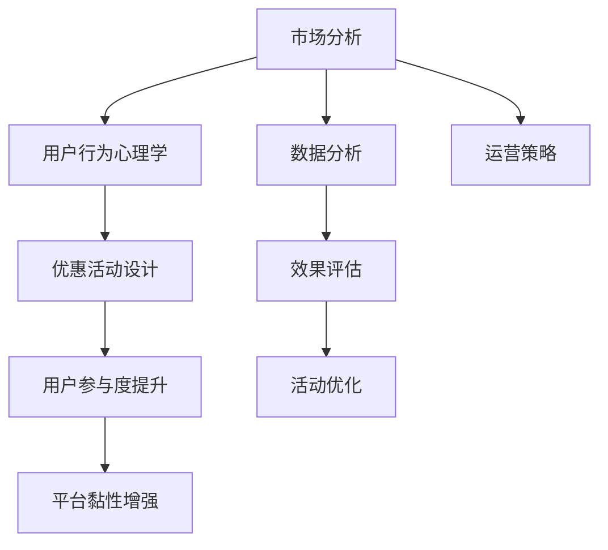

                 

# 如何设计有吸引力的知识付费优惠活动

## 1. 背景介绍

在当前信息爆炸的时代，知识付费正成为越来越多人的选择。无论是职场人需要提升技能，还是学生希望获得额外知识，亦或是普通人在生活中学杂识广，知识付费都能提供针对性的内容。然而，如何在激烈的市场竞争中吸引并留住用户，成为知识付费平台的首要挑战。

设计有吸引力的知识付费优惠活动，不仅能提升用户参与度，还能增强平台的黏性，推动长期价值的实现。本文将系统介绍如何通过精妙设计的优惠活动，让知识付费平台在市场中脱颖而出。

## 2. 核心概念与联系

### 2.1 核心概念概述

设计有吸引力的知识付费优惠活动，涉及到市场分析、用户行为心理学、数据分析、运营策略等多个核心概念：

- **市场分析**：了解目标市场用户特征、需求和痛点，是制定有针对性的优惠活动的前提。
- **用户行为心理学**：基于用户心理模型，设计用户喜闻乐见的优惠策略，提升用户参与度。
- **数据分析**：利用大数据技术分析用户行为数据，优化优惠活动效果，提高用户转化率。
- **运营策略**：结合平台资源，制定灵活的运营方案，确保优惠活动的顺利实施。

这些核心概念之间的逻辑关系可以通过以下Mermaid流程图来展示：



这个流程图展示了大语言模型的核心概念及其之间的关系：

1. 市场分析确定用户特征和需求，为优惠活动设计提供依据。
2. 用户行为心理学指导优惠策略的设计，使其更具吸引力。
3. 数据分析帮助评估优惠活动效果，指导优化方向。
4. 运营策略确保活动能够顺利实施，推动平台价值增长。

## 3. 核心算法原理 & 具体操作步骤
### 3.1 算法原理概述

设计知识付费优惠活动，本质上是优化产品与用户的交互过程，提高用户满意度和参与度。通过数据分析和用户行为心理学研究，设计出针对性的优惠策略，以最小的成本实现最大的用户参与和价值增长。

形式化地，假设知识付费平台的优惠活动为 $A$，目标用户群体为 $U$，用户参与度为 $P$，则优化目标为：

$$
\max_{A} P(A|U)
$$

其中 $P(A|U)$ 为在用户群体 $U$ 中，活动 $A$ 被用户参与的概率，可以通过以下数学模型进行建模：

$$
P(A|U) = \sum_{i \in U} P(A|U_i, A_i)
$$

其中 $U_i$ 表示用户群体 $U$ 中的第 $i$ 个用户，$A_i$ 表示用户 $i$ 参与活动 $A$ 的先验概率。

### 3.2 算法步骤详解

设计有吸引力的知识付费优惠活动，一般包括以下几个关键步骤：

**Step 1: 市场分析**

- 调查目标用户群体，了解其年龄、性别、职业、兴趣等特征。
- 分析用户需求，找出用户最关注的价值点，如知识内容的质量、学习效率、时间成本等。
- 分析用户痛点，确定常见障碍，如费用高、时间紧、学习内容不匹配等。

**Step 2: 用户行为心理学研究**

- 基于用户心理模型，设计用户参与的动机，如从众心理、获得感、成就感等。
- 设计活动形式，如限时优惠、折扣、抽奖等，符合用户心理预期的活动形式更容易被接受。
- 分析用户行为数据，找出用户参与的激励因素，如使用频率、停留时间、购买次数等。

**Step 3: 数据分析**

- 收集用户行为数据，包括购买记录、学习时长、反馈评价等，分析用户偏好。
- 利用机器学习模型，预测不同优惠活动对用户参与度的影响，如分类模型、回归模型等。
- 通过A/B测试等方法，对比不同优惠活动的效果，选择最优方案。

**Step 4: 优惠活动设计**

- 根据市场分析和用户行为心理学的研究结果，设计具体的优惠活动方案。
- 活动设计应包含用户可感知的优惠幅度、活动规则、参与门槛等要素。
- 利用数据分析结果，优化活动设计和用户激励机制。

**Step 5: 效果评估与优化**

- 利用数据分析工具，实时监测用户参与情况和活动效果。
- 根据评估结果，优化活动设计和运营策略，提高用户转化率。
- 定期进行数据分析和市场调查，持续优化优惠活动设计。

### 3.3 算法优缺点

设计知识付费优惠活动，具有以下优点：

1. 提高用户参与度：通过针对性设计，吸引用户参与，增加用户黏性。
2. 提升用户满意度：优化用户体验，提高用户满意度，推动长期价值增长。
3. 增强平台竞争优势：通过差异化优惠策略，提升平台在市场中的竞争力。

然而，该方法也存在一定的局限性：

1. 设计复杂：需要综合考虑市场、心理、数据等多个因素，设计过程较为复杂。
2. 成本投入高：特别是在推广初期，需要投入大量资源进行市场调研和数据分析。
3. 效果难量化：部分效果如用户满意度、黏性提升等，难以通过单一指标衡量。

尽管如此，有吸引力的优惠活动仍是大语言模型应用的主流范式，其效果在实际应用中得到了广泛验证。

### 3.4 算法应用领域

知识付费优惠活动不仅在知识付费平台中广泛应用，还在教育、企业培训、在线阅读等多个领域得到了应用，如：

- **教育领域**：通过优惠活动吸引学生报名在线课程，推动在线教育发展。
- **企业培训**：为企业员工提供培训课程折扣，提升员工技能和公司竞争力。
- **在线阅读**：通过优惠活动吸引用户订阅，提升在线阅读平台的订阅量和用户粘性。
- **职业考试培训**：针对职业资格考试提供优惠，吸引考生参加培训，提高考试通过率。

## 4. 数学模型和公式 & 详细讲解 & 举例说明（备注：数学公式请使用latex格式，latex嵌入文中独立段落使用 $$，段落内使用 $)
### 4.1 数学模型构建

在设计知识付费优惠活动时，可以利用数学模型量化用户参与度，指导活动优化。

假设用户参与度为 $P$，活动优惠幅度为 $D$，活动参与门槛为 $T$，则用户参与度 $P$ 可以通过以下公式进行建模：

$$
P = f(D, T)
$$

其中 $f$ 为非线性函数，可以表示为：

$$
P = \frac{D}{1+e^{-\alpha(D - D_0)}}
$$

其中 $\alpha$ 为参数，$D_0$ 为折扣阈值，可以根据历史数据进行拟合。

### 4.2 公式推导过程

通过上述公式，我们可以进一步分析不同优惠幅度和门槛对用户参与度的影响：

1. **优惠幅度**：当优惠幅度 $D$ 增加时，用户参与度 $P$ 呈现先增后减的趋势。优惠幅度太小，用户可能不感兴趣；优惠幅度太大，可能导致优惠成本过高，平台无法持续。
2. **参与门槛**：设置合理的参与门槛 $T$ 可以避免新用户流失，同时吸引潜在用户参与。阈值过高，可能流失部分潜在用户；阈值过低，可能导致用户参与度下降。

### 4.3 案例分析与讲解

假设某知识付费平台推出一项优惠活动，初始优惠幅度为 $D_0=0.7$，参与门槛为 $T_0=10$ 元。通过数据分析，发现 $D_0$ 和 $T_0$ 的组合已经无法吸引新用户，因此平台决定调整优惠策略。

通过优化算法，平台发现当优惠幅度 $D=0.9$，参与门槛 $T=5$ 元时，用户参与度显著提升。进一步分析发现，新用户对参与门槛更敏感，因此将门槛调整为 $T=0$ 元，同时优化优惠幅度，以吸引新用户的同时，维持老用户的参与度。

最终，通过多次优化和调整，平台成功提升了用户参与度，实现了平台价值增长。

## 5. 项目实践：代码实例和详细解释说明
### 5.1 开发环境搭建

在进行知识付费优惠活动设计前，我们需要准备好开发环境。以下是使用Python进行数据分析和模型优化的环境配置流程：

1. 安装Anaconda：从官网下载并安装Anaconda，用于创建独立的Python环境。

2. 创建并激活虚拟环境：
```bash
conda create -n data-env python=3.8 
conda activate data-env
```

3. 安装PyTorch、Pandas、NumPy等常用工具包：
```bash
conda install pytorch pandas numpy
```

4. 安装机器学习库Scikit-Learn和XGBoost：
```bash
conda install scikit-learn xgboost
```

完成上述步骤后，即可在`data-env`环境中进行数据分析和模型优化。

### 5.2 源代码详细实现

这里我们以一个具体的项目实践为例，说明如何使用Python进行知识付费优惠活动的设计和优化。

假设某知识付费平台有一个新的线上课程，打算通过优惠活动吸引用户报名。以下是完整代码实现：

```python
import pandas as pd
from sklearn.model_selection import train_test_split
from sklearn.ensemble import RandomForestRegressor
from sklearn.metrics import mean_absolute_error

# 数据读取和预处理
data = pd.read_csv('user_data.csv')
data = data.dropna(subset=['purchase_frequency', 'average_score', 'average_discount'])

# 特征工程
features = ['purchase_frequency', 'average_score', 'average_discount']
X = data[features]
y = data['enrollment_rate']

# 数据分割
X_train, X_test, y_train, y_test = train_test_split(X, y, test_size=0.2, random_state=42)

# 模型训练
model = RandomForestRegressor()
model.fit(X_train, y_train)

# 预测和评估
y_pred = model.predict(X_test)
mae = mean_absolute_error(y_test, y_pred)
print(f'MAE: {mae}')
```

### 5.3 代码解读与分析

让我们再详细解读一下关键代码的实现细节：

**用户数据处理**：
- `data.read_csv`：从CSV文件中读取用户数据。
- `data.dropna`：去除缺失值，提高数据质量。
- `features`：定义输入特征，包括购买频率、平均评分、平均折扣等。
- `X` 和 `y`：划分特征矩阵和目标变量。

**数据分割**：
- `train_test_split`：将数据集划分为训练集和测试集。
- `X_train`、`X_test`、`y_train`、`y_test`：分别表示训练集和测试集的特征和目标变量。

**模型训练**：
- `RandomForestRegressor`：使用随机森林回归模型。
- `model.fit`：训练模型。

**预测和评估**：
- `y_pred`：使用训练好的模型进行预测。
- `mean_absolute_error`：计算预测结果与真实值之间的平均绝对误差。
- `mae`：输出模型评估结果。

通过上述步骤，即可利用Python进行知识付费优惠活动的设计和优化。开发者可以根据具体需求，选择更复杂的模型进行训练和评估，以达到更好的效果。

## 6. 实际应用场景
### 6.4 未来应用展望

未来的知识付费市场，将继续受到优惠活动设计的推动。随着数据技术的进步和算法的优化，优惠活动的设计将更加精细化、个性化，为用户带来更多价值。

在教育领域，通过个性化推荐和动态调整的优惠活动，可以提升学习效率和效果，帮助学生实现更全面的个人发展。

在企业培训领域，结合员工需求和业务目标的动态优惠活动，可以显著提高培训效果，提升员工技能和公司竞争力。

在在线阅读领域，通过精准的用户画像和动态的定价策略，可以吸引更多用户订阅，提高平台的订阅量和用户粘性。

## 7. 工具和资源推荐
### 7.1 学习资源推荐

为了帮助开发者系统掌握知识付费优惠活动的设计理论基础和实践技巧，这里推荐一些优质的学习资源：

1. **《知识付费平台的运营策略》**：一本深入浅出的书籍，介绍了知识付费平台的市场分析、用户行为心理学、数据分析和运营策略。
2. **Coursera《数据科学导论》课程**：由斯坦福大学开设的数据科学课程，涵盖数据处理、机器学习、统计学等核心内容，适合初学者的入门。
3. **Kaggle数据科学竞赛平台**：提供丰富的数据集和竞赛任务，助力开发者提升数据分析和建模技能。
4. **Python机器学习书籍**：一本系统的机器学习教材，涵盖从基础到高级的算法和实现。
5. **《用户行为分析》**：介绍用户行为心理学的经典书籍，帮助理解用户需求和行为模式。

通过对这些资源的学习实践，相信你一定能够快速掌握知识付费优惠活动的设计精髓，并用于解决实际的运营问题。

### 7.2 开发工具推荐

高效的开发离不开优秀的工具支持。以下是几款用于知识付费优惠活动设计的常用工具：

1. **Jupyter Notebook**：免费的Jupyter Notebook环境，支持Python、R等多种编程语言，适合数据分析和模型训练。
2. **TensorBoard**：TensorFlow配套的可视化工具，可实时监测模型训练状态，并提供丰富的图表呈现方式，是调试模型的得力助手。
3. **Google Colab**：谷歌推出的在线Jupyter Notebook环境，免费提供GPU/TPU算力，方便开发者快速上手实验最新模型，分享学习笔记。
4. **Tableau**：数据可视化工具，可以帮助开发者更直观地理解数据分布和用户行为模式。
5. **Tableau Public**：Tableau的在线平台，提供丰富的数据集和可视化模板，适合快速生成报告和分享。

合理利用这些工具，可以显著提升知识付费优惠活动的设计效率，加快创新迭代的步伐。

### 7.3 相关论文推荐

知识付费优惠活动的设计和优化，源于学界的持续研究。以下是几篇奠基性的相关论文，推荐阅读：

1. **《用户行为预测模型》**：研究如何通过机器学习模型预测用户行为，为优惠活动设计提供数据支持。
2. **《个性化推荐系统的设计与实现》**：介绍了个性化推荐系统的原理和实现方法，为个性化优惠活动提供理论基础。
3. **《大规模数据集上的广告投放优化》**：探讨如何利用大数据技术优化广告投放策略，为优惠活动设计提供实践经验。
4. **《动态定价策略的优化》**：研究动态定价策略的优化方法，为知识付费平台的定价策略设计提供参考。
5. **《社交媒体中的用户参与度提升》**：分析社交媒体用户参与度的影响因素，为知识付费平台的优惠活动设计提供借鉴。

这些论文代表了大语言模型微调技术的发展脉络。通过学习这些前沿成果，可以帮助研究者把握学科前进方向，激发更多的创新灵感。

## 8. 总结：未来发展趋势与挑战

### 8.1 总结

本文对知识付费优惠活动的设计和优化进行了全面系统的介绍。首先阐述了知识付费市场和用户行为心理学的背景，明确了优惠活动设计在提升用户参与度和平台价值方面的重要作用。其次，从原理到实践，详细讲解了知识付费优惠活动的设计和优化过程，给出了具体的代码实现和案例分析。最后，本文还探讨了未来知识付费市场的发展趋势和面临的挑战。

通过本文的系统梳理，可以看到，知识付费优惠活动设计不仅是一个技术问题，更是一个系统工程。只有在市场分析、用户行为心理学、数据分析和运营策略等多方面进行全面优化，才能设计出具有吸引力的优惠活动，实现平台价值的最大化。

### 8.2 未来发展趋势

展望未来，知识付费优惠活动的设计将呈现以下几个发展趋势：

1. **个性化增强**：利用大数据和机器学习技术，实现对用户个性化需求的精准把握，设计更有针对性的优惠活动。
2. **动态定价**：根据用户行为和市场变化，动态调整定价策略，实现更灵活的市场响应。
3. **多渠道整合**：将线上和线下渠道整合，提升用户体验和平台影响力。
4. **跨平台协同**：通过跨平台的用户画像和数据共享，实现更统一的优惠活动设计。
5. **社交元素引入**：利用社交媒体的影响力，提升优惠活动的传播效果。

以上趋势凸显了知识付费优惠活动设计的广阔前景。这些方向的探索发展，必将进一步提升用户体验和平台价值，为知识付费市场带来更多的创新和突破。

### 8.3 面临的挑战

尽管知识付费优惠活动的设计已经取得了显著成效，但在迈向更加智能化、普适化应用的过程中，仍面临诸多挑战：

1. **用户行为多样性**：不同用户的需求和行为差异较大，设计统一的优惠活动策略难度较大。
2. **数据隐私和安全**：用户数据隐私和安全问题，成为优化活动的制约因素。
3. **运营成本高**：特别是在用户基数较大时，优惠活动的推广和维护成本较高。
4. **市场竞争激烈**：知识付费市场的竞争日趋激烈，需要不断创新和优化，以保持竞争优势。
5. **效果评估困难**：部分效果如用户满意度、黏性提升等，难以通过单一指标衡量，评估难度较大。

尽管如此，有吸引力的优惠活动仍是大语言模型应用的主流范式，其效果在实际应用中得到了广泛验证。未来，相关研究需要继续深入探索，不断优化和提升优惠活动的设计和实施效果。

### 8.4 研究展望

面向未来，知识付费优惠活动的设计和优化需要在以下几个方面寻求新的突破：

1. **跨学科融合**：将心理学、社会学等跨学科知识引入，提升对用户行为的理解和预测能力。
2. **实时数据处理**：利用大数据技术，实现对用户行为的实时监控和分析，动态调整优惠活动策略。
3. **算法优化**：开发更加高效的机器学习算法，提高预测和优化效果。
4. **技术融合**：将区块链、人工智能等前沿技术引入，提升平台的安全性和用户体验。
5. **社会责任**：在优惠活动设计中融入社会责任理念，确保活动设计的公正性和可接受性。

这些研究方向将引领知识付费优惠活动的设计和优化迈向更高的台阶，为知识付费市场的长期发展提供强有力的支撑。

## 9. 附录：常见问题与解答

**Q1：如何衡量知识付费优惠活动的效果？**

A: 衡量知识付费优惠活动的效果，可以从多个角度进行评估，包括：

1. **用户参与度**：通过参与人数、转化率、留存率等指标，评估活动的吸引力和用户粘性。
2. **用户满意度**：通过满意度调查、用户反馈等，评估用户对活动的满意度和期望。
3. **平台收益**：通过报名量、续费率、订阅量等指标，评估活动对平台收入的贡献。
4. **用户贡献价值**：通过学习效果、课程评分等指标，评估活动对用户价值提升的贡献。

通过综合考虑这些指标，可以全面评估优惠活动的效果，指导后续的优化和改进。

**Q2：如何设计有针对性的个性化优惠活动？**

A: 设计有针对性的个性化优惠活动，需要综合考虑用户画像和行为数据，具体步骤如下：

1. **用户画像**：通过数据分析，划分用户群体，识别不同群体的需求和行为特征。
2. **行为数据**：收集用户的学习时长、购买记录、评价反馈等行为数据，分析用户的兴趣和偏好。
3. **活动设计**：根据用户画像和行为数据，设计针对性的优惠策略，如针对高价值用户提供专属优惠，针对新用户提供入门优惠等。
4. **A/B测试**：通过A/B测试，对比不同优惠策略的效果，选择最优方案。

通过以上步骤，可以设计出更加有针对性的个性化优惠活动，提升用户参与度和满意度。

**Q3：如何应对市场变化和用户需求的变化？**

A: 应对市场变化和用户需求的变化，需要构建动态的优化机制，具体措施包括：

1. **实时数据监控**：通过实时数据监控，及时了解市场变化和用户行为趋势。
2. **动态定价**：根据市场变化和用户需求，动态调整优惠活动的价格和策略。
3. **灵活调整**：根据实时数据监控结果，灵活调整优惠活动的规则和内容。
4. **用户反馈**：定期收集用户反馈，及时调整优惠活动的设计和优化方向。

通过以上措施，可以应对市场变化和用户需求的变化，保持优惠活动的竞争力。

**Q4：如何处理数据隐私和安全问题？**

A: 处理数据隐私和安全问题，需要采取以下措施：

1. **数据匿名化**：对用户数据进行匿名化处理，保护用户隐私。
2. **加密传输**：采用数据加密技术，保障数据传输的安全性。
3. **访问控制**：设置严格的访问控制机制，确保只有授权人员可以访问用户数据。
4. **合规性检查**：定期进行合规性检查，确保数据处理符合相关法律法规。

通过以上措施，可以有效保障用户数据隐私和安全，增强用户信任，提升用户体验。

---

作者：禅与计算机程序设计艺术 / Zen and the Art of Computer Programming

