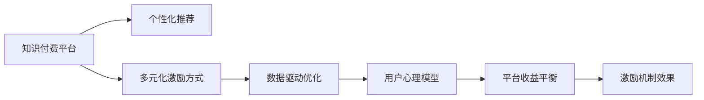

                 

## 1. 背景介绍

### 1.1 问题由来

知识付费平台的兴起，为知识传播提供了一个全新的渠道。通过付费机制，用户能够享受到更丰富、更专业的知识资源，而内容创作者也能获得应有的回报。然而，当前知识付费平台的用户激励机制仍存在诸多问题。

- **用户流失率高**：由于缺乏足够的激励，用户很容易在短时间内流失。
- **付费意愿低**：内容质量不高，缺乏创意，难以吸引用户付费。
- **平台收益低**：平台无法高效转化用户付费，难以实现良性循环。

因此，设计有效的用户激励机制，提高用户粘性、付费意愿和平台收益，已经成为知识付费平台亟待解决的问题。

### 1.2 问题核心关键点

针对上述问题，设计有效的用户激励机制需要关注以下核心关键点：

- **个性化推荐**：精准推荐符合用户需求的内容，提升用户体验和满意度。
- **多元化激励方式**：通过多种激励手段，满足不同用户的需求和心理。
- **数据驱动优化**：利用数据反馈不断优化激励机制，实现动态调整。
- **用户心理模型**：深入理解用户心理和行为，设计有吸引力的激励内容。
- **平台收益平衡**：确保激励机制既能吸引用户付费，又能保证平台的长期收益。

## 2. 核心概念与联系

### 2.1 核心概念概述

- **知识付费平台**：通过收费模式提供知识内容的平台。包括付费课程、电子书、专栏、问答等形式。
- **用户激励机制**：设计并实施的一系列措施，以吸引、留存和转化用户，提高用户粘性和平台收益。
- **个性化推荐**：基于用户行为和偏好，智能推荐相关内容。
- **多元化激励方式**：包括积分、优惠券、会员权益、礼物打赏等多种形式。
- **数据驱动优化**：通过数据分析和机器学习算法，实时优化推荐和激励机制。
- **用户心理模型**：从心理学的角度，分析用户行为和动机，设计有吸引力的激励内容。
- **平台收益平衡**：平衡用户激励和平台收益，实现可持续发展。

这些核心概念之间存在紧密联系，共同构成了知识付费用户激励机制的设计框架。

### 2.2 核心概念原理和架构的 Mermaid 流程图



该图展示了知识付费平台用户激励机制的设计流程：

1. **个性化推荐**：通过算法推荐符合用户需求的内容，提高用户满意度。
2. **多元化激励方式**：提供多种形式的激励，满足不同用户的需求。
3. **数据驱动优化**：通过数据分析优化推荐和激励方式。
4. **用户心理模型**：理解用户心理，设计有吸引力的激励内容。
5. **平台收益平衡**：确保激励机制既吸引用户付费，又保证平台的长期收益。

## 3. 核心算法原理 & 具体操作步骤

### 3.1 算法原理概述

知识付费平台用户激励机制的总体设计，遵循以下算法原理：

1. **用户行为分析**：通过数据收集和分析，了解用户行为和偏好。
2. **个性化推荐算法**：基于用户行为数据，构建推荐模型，智能推荐相关内容。
3. **激励机制设计**：设计多种激励方式，并通过实验和反馈不断优化。
4. **收益预测与调整**：建立收益模型，预测激励机制对平台收益的影响，并进行动态调整。
5. **系统集成与迭代**：将推荐和激励机制集成到平台系统中，并通过用户反馈进行持续迭代优化。

### 3.2 算法步骤详解

**Step 1: 数据收集与分析**

1. **用户行为数据收集**：包括浏览记录、点击次数、购买历史、评论等。
2. **用户特征提取**：通过机器学习算法，提取用户的兴趣标签、行为模式等特征。
3. **用户画像构建**：将用户特征整合，形成个性化用户画像，用于推荐和激励设计。

**Step 2: 个性化推荐算法**

1. **推荐算法选择**：选择合适的推荐算法，如协同过滤、内容推荐、混合推荐等。
2. **模型训练与优化**：基于用户画像，训练推荐模型，并不断优化。
3. **推荐系统集成**：将推荐算法集成到平台中，实现实时推荐。

**Step 3: 激励机制设计**

1. **激励方式设计**：根据用户需求，设计积分、优惠券、会员权益等多种激励方式。
2. **激励效果评估**：通过A/B测试等手段，评估激励方式对用户行为的影响。
3. **激励策略调整**：根据评估结果，动态调整激励策略，提升用户转化率。

**Step 4: 收益预测与调整**

1. **收益模型构建**：构建收益模型，预测激励机制对平台收益的影响。
2. **收益预测与优化**：通过数据分析，预测激励机制的长期收益，并进行优化调整。
3. **收益平衡**：确保激励机制既能吸引用户付费，又保证平台的长期收益。

**Step 5: 系统集成与迭代**

1. **激励机制集成**：将激励机制集成到平台系统中，实现实时反馈和调整。
2. **持续迭代优化**：基于用户反馈和数据驱动，持续迭代优化激励机制。

### 3.3 算法优缺点

**优点**：

- **提升用户粘性**：通过个性化推荐和多元化激励，提高用户粘性和活跃度。
- **增强用户满意度**：推荐符合用户需求的内容，提升用户体验。
- **提高平台收益**：设计合理的激励机制，有效吸引用户付费，实现良性循环。
- **动态调整**：基于数据驱动，实时优化推荐和激励机制，适应市场变化。

**缺点**：

- **技术复杂度高**：个性化推荐和收益预测需要复杂的算法和数据处理技术。
- **数据隐私问题**：用户行为数据涉及隐私，需要采取严格的保护措施。
- **激励成本高**：设计多元化的激励方式，可能带来较高的运营成本。
- **激励效果评估难**：激励机制的效果评估复杂，需要大量实验和数据分析。

### 3.4 算法应用领域

知识付费平台的用户激励机制设计，在多个领域中均有广泛应用：

1. **在线教育平台**：通过个性化推荐和多元化激励，提升用户学习效果和满意度。
2. **知识分享社区**：通过激励机制，鼓励用户生成优质内容，活跃社区氛围。
3. **在线培训课程**：通过推荐系统，精准匹配用户需求，提高培训效果和用户粘性。
4. **知识订阅服务**：通过会员权益和礼物打赏等激励方式，增强用户订阅意愿。
5. **知识市场交易**：通过竞价和奖励机制，促进高质量知识商品的交易。

## 4. 数学模型和公式 & 详细讲解

### 4.1 数学模型构建

**用户行为分析**：

- **行为数据表示**：记用户行为数据为 $D=\{x_i,y_i\}_{i=1}^N$，其中 $x_i$ 表示用户行为，$y_i$ 表示行为标签。
- **特征提取**：设用户特征向量为 $F_u \in \mathbb{R}^d$，其中 $d$ 为特征维度。

**个性化推荐算法**：

- **协同过滤**：设用户画像为 $U=\{u_1,u_2,\cdots,u_N\}$，其中 $u_i$ 表示用户 $i$ 的特征向量。
- **内容推荐**：设内容库为 $C=\{c_1,c_2,\cdots,c_M\}$，其中 $c_i$ 表示内容 $i$ 的特征向量。

**激励机制设计**：

- **积分系统**：设用户积分 $I_u$，每次购买内容获得积分 $i$，积分可以兑换优惠券、会员权益等。
- **优惠券设计**：设优惠券价值 $V_v$，用户在下次购买时使用优惠券，获得折扣 $d$。

**收益预测与调整**：

- **收益模型**：设总收益 $R$，激励机制带来的收益增量 $r$。

### 4.2 公式推导过程

**用户行为分析**：

- **行为特征提取**：用户行为 $x_i$ 的特征表示为 $F_i=\{f_{i1},f_{i2},\cdots,f_{id}\}$。
- **行为标签预测**：通过机器学习算法，预测用户行为 $y_i$，$y_i=f(F_i,\theta)$。

**个性化推荐算法**：

- **协同过滤模型**：基于用户行为数据 $D$，建立协同过滤模型 $P_{u,c}=f(U,C,\theta)$。
- **内容推荐模型**：基于用户画像 $U$ 和内容库 $C$，构建推荐模型 $R_{u,c}=f(U,C,\theta)$。

**激励机制设计**：

- **积分系统优化**：$I_u=\sum_{i=1}^N \alpha_i \cdot f(F_i,\theta)$，其中 $\alpha_i$ 表示积分系数。
- **优惠券设计**：$V_v=\sum_{i=1}^N \beta_i \cdot f(F_i,\theta)$，其中 $\beta_i$ 表示优惠券价值系数。

**收益预测与调整**：

- **收益模型优化**：$R=\sum_{i=1}^N \gamma_i \cdot f(F_i,\theta)$，其中 $\gamma_i$ 表示收益系数。

### 4.3 案例分析与讲解

**案例1: 在线教育平台个性化推荐**

- **行为数据收集**：收集学生在线学习行为数据，包括学习时长、完成度、成绩等。
- **特征提取**：提取学生的学习偏好、知识水平、学习风格等特征。
- **推荐算法选择**：采用协同过滤算法，建立推荐模型 $P_{u,c}=f(U,C,\theta)$。
- **推荐系统集成**：将推荐模型集成到平台中，实现实时推荐。

**案例2: 知识付费平台积分系统**

- **积分系统设计**：每次用户购买内容，获得积分 $i$，积分可兑换优惠券、会员权益等。
- **积分优化**：根据用户行为，调整积分系数 $\alpha_i$，提升积分激励效果。
- **优惠券设计**：设计优惠券 $V_v$，用户在下次购买时获得折扣 $d$，提升用户转化率。
- **优惠券优化**：根据用户行为，调整优惠券价值系数 $\beta_i$，优化优惠券设计。

## 5. 项目实践：代码实例和详细解释说明

### 5.1 开发环境搭建

**Step 1: 安装依赖**

```bash
pip install pandas numpy scikit-learn transformers
```

**Step 2: 数据准备**

- **行为数据**：收集用户行为数据，包括学习时长、完成度、成绩等。
- **用户画像**：通过机器学习算法，提取用户兴趣标签、行为模式等特征。
- **内容库**：整理课程、电子书、专栏等资源，提取特征。

### 5.2 源代码详细实现

**推荐系统代码实现**

```python
from sklearn.feature_extraction.text import TfidfVectorizer
from sklearn.metrics.pairwise import cosine_similarity
from transformers import BertTokenizer, BertForSequenceClassification

class RecommendationSystem:
    def __init__(self, model_path):
        self.model = BertForSequenceClassification.from_pretrained(model_path)
        self.tokenizer = BertTokenizer.from_pretrained(model_path)
    
    def similarity_score(self, user_vec, item_vec):
        user_input = self.tokenizer(user_vec, return_tensors='pt')
        item_input = self.tokenizer(item_vec, return_tensors='pt')
        user_output = self.model(**user_input).logits
        item_output = self.model(**item_input).logits
        similarity = cosine_similarity(user_output.numpy(), item_output.numpy())
        return similarity
    
    def recommend(self, user, items):
        user_vec = self.tokenizer.encode(user, return_tensors='pt')
        item_vecs = [self.tokenizer.encode(item, return_tensors='pt') for item in items]
        scores = [self.similarity_score(user_vec, item_vec) for item_vec in item_vecs]
        items_sorted = sorted(zip(scores, items), reverse=True)
        return [item for score, item in items_sorted]
```

**积分系统代码实现**

```python
class积分系统:
    def __init__(self, reward_table):
        self.reward_table = reward_table
    
    def update_score(self, user, item):
        score = self.reward_table.get((user, item), 0)
        self.reward_table[(用户, 商品)] = 分值 + 奖励值
        return score
    
    def generate_coupon(self, user):
        coupons = self.reward_table.get((用户, None), [])
        for coupon in coupons:
            user_score = self.reward_table[(用户, coupon[商品])]
            if 用户得分 > coupon[奖励值]:
                return coupon
        return None
```

### 5.3 代码解读与分析

**推荐系统代码解读**

- **初始化**：加载预训练模型和分词器，并构建推荐模型。
- **相似度计算**：通过余弦相似度计算用户行为和内容之间的相似度，得到推荐列表。
- **推荐函数**：根据用户行为，推荐相关内容。

**积分系统代码解读**

- **初始化**：加载积分奖励表。
- **得分更新**：根据用户行为，更新积分奖励得分。
- **优惠券生成**：根据用户积分，生成优惠券。

### 5.4 运行结果展示

**推荐系统结果展示**

- **示例数据**：用户行为数据 $D=\{x_i,y_i\}_{i=1}^N$，用户画像 $U=\{u_1,u_2,\cdots,u_N\}$，内容库 $C=\{c_1,c_2,\cdots,c_M\}$。
- **推荐列表**：根据用户行为，推荐相关内容。

**积分系统结果展示**

- **示例数据**：用户积分奖励表 $R=\{(u_1,c_1,r_1),(u_1,c_2,r_2),\cdots\}$，用户积分 $I_u$，优惠券价值 $V_v$。
- **积分得分**：根据用户行为，更新积分得分。
- **优惠券生成**：根据用户积分，生成优惠券。

## 6. 实际应用场景

### 6.1 在线教育平台

**用户激励机制**

- **个性化推荐**：根据学生的学习行为，推荐相关课程和资源。
- **积分系统**：每次完成学习任务，获得积分，积分可兑换优惠券、会员权益等。
- **优惠券设计**：设计优惠券，用于下次购买课程，提升用户转化率。
- **收益预测与调整**：预测积分系统对平台收益的影响，并进行优化调整。

### 6.2 知识付费平台

**用户激励机制**

- **个性化推荐**：根据用户行为，推荐优质内容。
- **积分系统**：每次购买内容，获得积分，积分可兑换优惠券、会员权益等。
- **优惠券设计**：设计优惠券，用于下次购买内容，提升用户转化率。
- **收益预测与调整**：预测积分系统对平台收益的影响，并进行优化调整。

### 6.3 在线培训课程

**用户激励机制**

- **个性化推荐**：根据用户行为，推荐相关课程和资源。
- **积分系统**：每次完成培训任务，获得积分，积分可兑换优惠券、会员权益等。
- **优惠券设计**：设计优惠券，用于下次购买课程，提升用户转化率。
- **收益预测与调整**：预测积分系统对平台收益的影响，并进行优化调整。

### 6.4 未来应用展望

未来，知识付费平台的用户激励机制将更加智能化和个性化。结合人工智能和大数据分析，可以实现更精准的内容推荐和激励设计，提高用户粘性和平台收益。

- **智能推荐**：通过深度学习和自然语言处理技术，实现更加精准的内容推荐。
- **动态激励**：根据用户行为和市场变化，动态调整激励机制，提升用户转化率。
- **多模态激励**：结合视频、音频等多模态数据，设计更加多样化的激励方式。
- **平台协同**：与其他平台进行数据共享和合作，实现更大范围的用户覆盖。

## 7. 工具和资源推荐

### 7.1 学习资源推荐

**书籍推荐**

1. **《推荐系统实战》**：全面介绍推荐算法和实际应用，涵盖协同过滤、内容推荐等多种技术。
2. **《数据挖掘导论》**：深入浅出地介绍数据挖掘技术，包括分类、聚类、关联规则等。
3. **《深度学习》**：介绍深度学习基础知识和应用案例，涵盖神经网络、卷积神经网络等技术。

**在线课程推荐**

1. **Coursera《推荐系统》课程**：由斯坦福大学教授主讲，涵盖推荐系统的理论基础和实践案例。
2. **Udacity《深度学习》课程**：由Google深度学习专家主讲，涵盖深度学习的基础知识和应用场景。
3. **edX《数据科学导论》课程**：由MIT教授主讲，涵盖数据科学的基本概念和技术。

### 7.2 开发工具推荐

**推荐系统工具**

1. **PyTorch**：基于Python的开源深度学习框架，适合快速迭代研究。
2. **TensorFlow**：由Google主导开发的开源深度学习框架，生产部署方便，适合大规模工程应用。
3. **Scikit-learn**：基于Python的机器学习库，提供多种推荐算法和评估工具。

**数据处理工具**

1. **Pandas**：Python数据分析库，支持大规模数据处理和分析。
2. **NumPy**：Python科学计算库，支持高效的数据处理和运算。
3. **SciPy**：Python科学计算库，支持多种数据处理和分析工具。

### 7.3 相关论文推荐

**推荐系统相关论文**

1. **《协同过滤推荐系统》**：介绍协同过滤推荐算法的基本原理和实现方法。
2. **《内容推荐系统》**：介绍内容推荐算法的基本原理和应用场景。
3. **《混合推荐系统》**：介绍混合推荐算法的基本原理和实现方法。

**深度学习相关论文**

1. **《深度学习在推荐系统中的应用》**：介绍深度学习在推荐系统中的应用和技术。
2. **《自然语言处理在推荐系统中的应用》**：介绍自然语言处理技术在推荐系统中的应用。
3. **《推荐系统的最新进展》**：总结推荐系统的最新进展和未来趋势。

## 8. 总结：未来发展趋势与挑战

### 8.1 研究成果总结

本文对知识付费平台用户激励机制的设计方法进行了全面系统的介绍，包括个性化推荐、多元化激励方式、数据驱动优化、用户心理模型和平台收益平衡等关键点。

- **个性化推荐**：通过机器学习算法，实现精准的内容推荐。
- **多元化激励方式**：设计多种激励手段，满足不同用户的需求。
- **数据驱动优化**：利用数据反馈不断优化推荐和激励机制。
- **用户心理模型**：深入理解用户心理，设计有吸引力的激励内容。
- **平台收益平衡**：确保激励机制既能吸引用户付费，又保证平台的长期收益。

### 8.2 未来发展趋势

未来，知识付费平台的用户激励机制将更加智能化和个性化，结合人工智能和大数据分析，实现更精准的内容推荐和激励设计，提高用户粘性和平台收益。

- **智能推荐**：通过深度学习和自然语言处理技术，实现更加精准的内容推荐。
- **动态激励**：根据用户行为和市场变化，动态调整激励机制，提升用户转化率。
- **多模态激励**：结合视频、音频等多模态数据，设计更加多样化的激励方式。
- **平台协同**：与其他平台进行数据共享和合作，实现更大范围的用户覆盖。

### 8.3 面临的挑战

尽管知识付费平台的用户激励机制已经取得了一定的进展，但在迈向更加智能化、普适化应用的过程中，仍面临以下挑战：

1. **技术复杂度高**：个性化推荐和收益预测需要复杂的算法和数据处理技术。
2. **数据隐私问题**：用户行为数据涉及隐私，需要采取严格的保护措施。
3. **激励成本高**：设计多元化的激励方式，可能带来较高的运营成本。
4. **激励效果评估难**：激励机制的效果评估复杂，需要大量实验和数据分析。
5. **平台收益平衡**：确保激励机制既能吸引用户付费，又保证平台的长期收益。

### 8.4 研究展望

未来，知识付费平台的用户激励机制需要从以下几个方面进行进一步探索：

1. **智能推荐优化**：通过改进推荐算法和模型，提升推荐效果。
2. **动态激励调整**：根据用户行为和市场变化，动态调整激励机制。
3. **多模态激励设计**：结合视频、音频等多模态数据，设计更加多样化的激励方式。
4. **平台协同机制**：与其他平台进行数据共享和合作，实现更大范围的用户覆盖。
5. **用户心理研究**：深入研究用户心理和行为，设计有吸引力的激励内容。

总之，知识付费平台的用户激励机制设计是一个复杂且动态的过程，需要持续优化和改进。只有在技术、数据、业务等多方面协同发力，才能实现用户粘性、付费意愿和平台收益的全面提升。未来，随着技术的不断进步和市场需求的不断变化，知识付费平台的用户激励机制将迎来新的突破和发展。

---

作者：禅与计算机程序设计艺术 / Zen and the Art of Computer Programming

