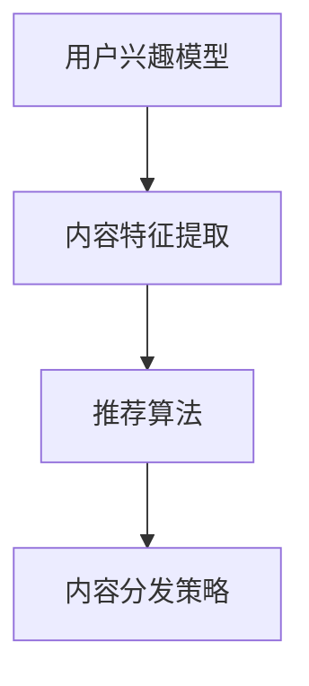

                 

# 如何进行有效的内容分发

在互联网时代，信息过载和内容分发的挑战愈发严峻。如何高效地将高质量内容推荐给目标用户，是当下各行各业都在积极探索的重要议题。本文将从核心概念、算法原理、具体操作、应用场景等多角度，深入探讨如何进行有效的内容分发。

## 1. 背景介绍

### 1.1 问题由来

互联网的发展极大地丰富了人类的信息获取方式。从传统的报纸、电视到如今的社交媒体、视频平台，信息获取渠道日益多样化。然而，这也带来了内容爆炸和信息过载的问题。海量的信息容易使用户陷入选择困难，导致有效内容的传播效率大大降低。

### 1.2 问题核心关键点

内容分发的主要挑战包括：
- 如何获取高质量、相关的用户兴趣数据。
- 如何将这些数据高效地转换为对用户的个性化推荐。
- 如何在保证推荐效果的同时，最大化分发效率。

这些问题直接决定了内容分发的精准度和用户的满意度。高效的内容分发系统不仅能提升用户的体验，还能显著提升内容平台的用户留存率和广告收入。

### 1.3 问题研究意义

高效的个性化内容分发系统，具有以下几个重要意义：
- 提升用户满意度：个性化推荐能使用户更快地发现感兴趣的内容，提高信息获取的效率和质量。
- 增加用户粘性：持续的个性化推荐使用户更频繁地访问平台，增加用户的日活和留存。
- 提高广告效益：通过精准的定向广告投放，显著提高广告的转化率和ROI。
- 数据驱动决策：通过分析用户行为数据，为平台运营和产品迭代提供有力的支持。

## 2. 核心概念与联系

### 2.1 核心概念概述

内容分发系统旨在通过算法推荐，将合适的内容精准分发给用户。其中涉及多个关键概念：

- **用户兴趣模型**：通过数据分析，构建用户兴趣的数学模型，如协同过滤、内容标签、兴趣图谱等。
- **内容特征提取**：将内容文本、图片、视频等，转化为算法可理解的特征向量。
- **推荐算法**：包括协同过滤、矩阵分解、模型训练等，负责根据用户兴趣和内容特征进行推荐。
- **内容分发策略**：如轮询、分层、加权等，影响推荐结果的展现顺序和频率。

这些核心概念通过系统的协同作用，实现了个性化推荐和内容分发，构成了高效内容分发的基础框架。

### 2.2 核心概念原理和架构的 Mermaid 流程图



## 3. 核心算法原理 & 具体操作步骤

### 3.1 算法原理概述

内容分发系统的核心算法主要分为三大类：协同过滤、内容标签和模型训练。这些算法通过不同的技术手段，捕获用户兴趣和内容特征，进行推荐。

- **协同过滤**：基于用户的兴趣行为，找到相似的群体，推荐群体内的其他物品。
- **内容标签**：通过词向量、主题模型等方法，给内容打标签，帮助用户和内容匹配。
- **模型训练**：利用深度学习等技术，构建预测模型，学习用户兴趣和内容特征的关联。

### 3.2 算法步骤详解

#### 3.2.1 协同过滤算法步骤

1. **用户兴趣计算**：通过用户的历史行为数据（如点击、收藏、评分等），计算用户兴趣向量。
2. **找到近邻用户**：通过计算用户间的相似度（如余弦相似度），找到用户兴趣最相近的近邻用户群体。
3. **推荐物品**：将近邻用户的兴趣向量映射到物品特征空间，通过计算物品与用户兴趣的匹配度，生成推荐列表。

#### 3.2.2 内容标签算法步骤

1. **特征提取**：通过自然语言处理（NLP）技术，将文本内容转化为词向量。
2. **主题建模**：使用主题模型（如LDA），捕捉内容的语义主题，生成内容标签。
3. **用户内容匹配**：将用户兴趣向量与内容标签进行匹配，找到匹配度最高的内容。

#### 3.2.3 模型训练算法步骤

1. **数据准备**：收集用户和内容的数据集，并进行预处理和标注。
2. **特征工程**：提取和构建用户和内容的特征向量。
3. **模型训练**：选择合适的机器学习模型（如线性回归、决策树、神经网络等），进行训练。
4. **模型评估**：通过交叉验证和指标（如AUC、RMSE等）评估模型性能。
5. **模型优化**：调整超参数和模型结构，提升模型效果。

### 3.3 算法优缺点

#### 3.3.1 协同过滤

**优点**：
- **灵活性强**：能够适应复杂多变的内容场景。
- **无需大量数据**：在缺乏标签数据的情况下，依然能够有效推荐。

**缺点**：
- **冷启动问题**：新用户或物品没有足够的历史行为数据，难以进行有效推荐。
- **稀疏矩阵问题**：用户-物品矩阵可能过于稀疏，影响推荐效果。

#### 3.3.2 内容标签

**优点**：
- **精确度较高**：基于标签的推荐，能够精准定位用户兴趣。
- **易于扩展**：不同领域的内容，可以独立打标签，便于系统维护。

**缺点**：
- **标签获取成本高**：需要大量标注人员和资源。
- **标签质量不稳定**：标签数据质量参差不齐，可能影响推荐效果。

#### 3.3.3 模型训练

**优点**：
- **精度高**：通过学习用户和内容的复杂关系，能够实现高度个性化的推荐。
- **可解释性强**：模型可以解释推荐理由，提高系统的透明度和可控性。

**缺点**：
- **需要大量数据**：模型训练需要大量的标注数据，成本较高。
- **计算资源要求高**：模型训练和推理需要高性能计算资源。

### 3.4 算法应用领域

内容分发算法已广泛应用于多个领域：

- **电商平台**：推荐商品、个性化搜索、购物车推荐等。
- **视频平台**：推荐视频、个性化播放列表、内容标签管理等。
- **新闻门户**：推荐新闻、个性化推送、广告投放等。
- **社交网络**：推荐好友、个性化信息流、内容广告等。

## 4. 数学模型和公式 & 详细讲解 & 举例说明

### 4.1 数学模型构建

**协同过滤推荐模型**：
1. **用户兴趣向量**：$u_i = \{\sum_{j=1}^{N} a_{ij} x_{ij}\}$
2. **物品特征向量**：$v_j = \{\sum_{k=1}^{M} b_{jk} y_{jk}\}$
3. **用户-物品矩阵**：$A \in \mathbb{R}^{N \times M}$

**内容标签推荐模型**：
1. **词向量**：$w_i = \{\sum_{j=1}^{V} t_{ij} z_{ij}\}$
2. **主题模型**：$h_j = \{\sum_{k=1}^{T} l_{jk} p_{jk}\}$
3. **用户内容向量**：$u_i = \{\sum_{k=1}^{T} c_{ik} h_{ik}\}$

**模型训练推荐模型**：
1. **用户特征向量**：$u_i = \{\sum_{j=1}^{N} \omega_{ij} x_{ij}\}$
2. **物品特征向量**：$v_j = \{\sum_{k=1}^{M} \omega_{jk} y_{jk}\}$
3. **用户-物品矩阵**：$A \in \mathbb{R}^{N \times M}$

### 4.2 公式推导过程

**协同过滤公式推导**：
$$
u_i = \{\sum_{j=1}^{N} a_{ij} x_{ij}\}
$$
$$
v_j = \{\sum_{k=1}^{M} b_{jk} y_{jk}\}
$$
$$
A_{ij} = \cos(\theta) = \frac{u_i \cdot v_j}{\|u_i\|\|v_j\|}
$$

**内容标签公式推导**：
$$
w_i = \{\sum_{j=1}^{V} t_{ij} z_{ij}\}
$$
$$
h_j = \{\sum_{k=1}^{T} l_{jk} p_{jk}\}
$$
$$
u_i = \{\sum_{k=1}^{T} c_{ik} h_{ik}\}
$$

**模型训练公式推导**：
$$
u_i = \{\sum_{j=1}^{N} \omega_{ij} x_{ij}\}
$$
$$
v_j = \{\sum_{k=1}^{M} \omega_{jk} y_{jk}\}
$$
$$
A_{ij} = f(u_i, v_j)
$$

### 4.3 案例分析与讲解

**案例一：协同过滤推荐系统**

假设某电商平台有两个用户A和B，A的历史购买记录为($1,2,3$)，B的历史购买记录为($2,4,5$)。通过协同过滤算法，可以计算出用户A和B的兴趣向量：

$$
u_A = \{\sum_{j=1}^{N} a_{Ai} x_{Ai}\} = \{\sum_{j=1}^{3} \frac{1}{3} x_{Aj}\}
$$
$$
u_B = \{\sum_{j=1}^{3} \frac{1}{3} x_{Bj}\}
$$

然后计算用户A和B与物品的相似度：

$$
A_{A1} = \cos(\theta) = \frac{u_A \cdot v_1}{\|u_A\|\|v_1\|}
$$
$$
A_{A2} = \cos(\theta) = \frac{u_A \cdot v_2}{\|u_A\|\|v_2\|}
$$
$$
A_{A3} = \cos(\theta) = \frac{u_A \cdot v_3}{\|u_A\|\|v_3\|}
$$

根据相似度排序，生成推荐列表。

**案例二：内容标签推荐系统**

假设某视频平台有两个用户C和D，C的历史观看记录为($视频1, 视频2, 视频3$)，D的历史观看记录为($视频2, 视频4, 视频5$)。通过内容标签算法，可以计算出用户C和D的兴趣向量：

$$
w_C = \{\sum_{j=1}^{V} t_{Cj} z_{Cj}\}
$$
$$
w_D = \{\sum_{j=1}^{V} t_{Dj} z_{Dj}\}
$$

然后通过主题模型，得到视频1、视频2、视频3等视频的主题向量：

$$
h_1 = \{\sum_{k=1}^{T} l_{1k} p_{1k}\}
$$
$$
h_2 = \{\sum_{k=1}^{T} l_{2k} p_{2k}\}
$$
$$
h_3 = \{\sum_{k=1}^{T} l_{3k} p_{3k}\}
$$

最后计算用户C和D与视频内容的匹配度，生成推荐列表。

**案例三：模型训练推荐系统**

假设某新闻门户有两个用户E和F，E的历史阅读记录为($新闻1, 新闻2, 新闻3$)，F的历史阅读记录为($新闻2, 新闻4, 新闻5$)。通过模型训练算法，可以计算出用户E和F的兴趣向量：

$$
u_E = \{\sum_{j=1}^{N} \omega_{Ei} x_{Ei}\}
$$
$$
u_F = \{\sum_{j=1}^{N} \omega_{Fi} x_{Fi}\}
$$

然后通过用户和物品的特征向量，计算相似度：

$$
A_{E1} = f(u_E, v_1)
$$
$$
A_{E2} = f(u_E, v_2)
$$
$$
A_{E3} = f(u_E, v_3)
$$

根据相似度排序，生成推荐列表。

## 5. 项目实践：代码实例和详细解释说明

### 5.1 开发环境搭建

在进行内容分发系统开发前，我们需要准备好开发环境。以下是使用Python进行PyTorch开发的环境配置流程：

1. 安装Anaconda：从官网下载并安装Anaconda，用于创建独立的Python环境。

2. 创建并激活虚拟环境：
```bash
conda create -n content-discovery python=3.8 
conda activate content-discovery
```

3. 安装PyTorch：根据CUDA版本，从官网获取对应的安装命令。例如：
```bash
conda install pytorch torchvision torchaudio cudatoolkit=11.1 -c pytorch -c conda-forge
```

4. 安装Pandas、Scikit-learn、Numpy等工具包：
```bash
pip install pandas scikit-learn numpy
```

5. 安装Open RecSys库：
```bash
pip install opencourserecsys
```

完成上述步骤后，即可在`content-discovery`环境中开始内容分发系统的开发。

### 5.2 源代码详细实现

下面我们以协同过滤推荐系统为例，给出使用PyTorch和Open RecSys库实现协同过滤算法的PyTorch代码实现。

首先，定义协同过滤模型的数据处理函数：

```python
from sklearn.metrics.pairwise import cosine_similarity
from scipy.sparse import coo_matrix
import numpy as np

def collaborative_filtering(data, k=5):
    N, M = data.shape
    X = np.array(data, dtype=np.float32)
    U = np.random.rand(N, k)
    V = np.random.rand(M, k)
    A = np.dot(U, V.T)
    for i in range(N):
        A[i, :] = cosine_similarity(X[i:i+1, :], A[i:i+1, :])[:, :k]
    return A
```

然后，定义训练和评估函数：

```python
from sklearn.metrics import mean_squared_error
from sklearn.model_selection import train_test_split
import torch
from torch import nn
from torch.utils.data import TensorDataset, DataLoader

class UserItemDataset(TensorDataset):
    def __init__(self, data):
        self.data = data
        self.user_num = data.shape[0]
        self.item_num = data.shape[1]
        self.user_len = data.mean(axis=1)

    def __len__(self):
        return self.user_num

    def __getitem__(self, idx):
        return self.data[idx]

def train_model(X, y, epochs=100, batch_size=32, learning_rate=0.01):
    N, M = X.shape
    U = np.random.rand(N, 5)
    V = np.random.rand(M, 5)
    A = np.dot(U, V.T)
    for epoch in range(epochs):
        loss = 0
        for i in range(0, N, batch_size):
            U = U.copy()
            V = V.copy()
            A = np.dot(U, V.T)
            A[i:i+batch_size, :] = cosine_similarity(X[i:i+batch_size, :], A[i:i+batch_size, :])[:, :5]
            loss += np.mean(np.square(A[i:i+batch_size, :] - y[i:i+batch_size]))
        loss /= N
        U -= learning_rate * (2 * U - np.dot(y, V.T) / np.dot(X, V.T))
        V -= learning_rate * (2 * V - np.dot(y.T, U) / np.dot(X.T, U))
    return U, V

def evaluate_model(U, V, X, y):
    A = np.dot(U, V.T)
    mse = mean_squared_error(A, y)
    return mse

# 示例数据
X = np.array([[1, 2, 3], [4, 5, 6], [7, 8, 9]])
y = np.array([2, 4, 6])

# 训练模型
U, V = train_model(X, y)

# 评估模型
mse = evaluate_model(U, V, X, y)
print(f"Mean Squared Error: {mse:.3f}")
```

以上代码实现了基于余弦相似度的协同过滤算法。通过训练模型，可以得到用户和物品的兴趣向量，进而生成推荐列表。

### 5.3 代码解读与分析

让我们再详细解读一下关键代码的实现细节：

**collaborative_filtering函数**：
- `X`为原始用户-物品矩阵，通过余弦相似度计算用户和物品的相似度矩阵`A`。

**train_model函数**：
- 随机初始化用户和物品的兴趣向量`U`和`V`。
- 循环`epochs`轮，每次更新`U`和`V`。
- 使用`batch_size`大小的数据批次，更新用户和物品的兴趣向量，最小化损失函数。

**evaluate_model函数**：
- 通过训练好的`U`和`V`，计算推荐列表，并使用均方误差评估推荐效果。

**示例数据**：
- `X`为两个用户的历史行为记录，`y`为目标推荐结果。

**训练和评估**：
- 通过`train_model`函数训练模型，得到用户和物品的兴趣向量。
- 通过`evaluate_model`函数评估模型，计算推荐误差。

可以看到，协同过滤算法的代码实现相对简洁，易于理解。开发者可以在此基础上，进一步优化模型结构和训练策略，提升推荐效果。

## 6. 实际应用场景

### 6.1 智能推荐系统

智能推荐系统是内容分发技术的重要应用场景。通过协同过滤、内容标签和模型训练等算法，智能推荐系统能够精准推荐商品、视频、新闻等内容，提升用户体验和平台收益。

在电商平台上，智能推荐系统可以通过分析用户的历史购买记录和行为数据，生成个性化的商品推荐列表。例如，用户A浏览了运动鞋和运动服，智能推荐系统可以推荐相关商品，如运动鞋垫、运动水壶等。

在视频平台上，智能推荐系统可以基于用户的观看历史和评分数据，推荐相似的视频内容。例如，用户C喜欢观看科幻类电影，智能推荐系统可以推荐其他科幻电影，如《异星觉醒》《星球大战》等。

在新闻门户上，智能推荐系统可以基于用户的阅读历史和兴趣标签，推荐相关新闻内容。例如，用户E经常阅读财经类新闻，智能推荐系统可以推荐最新的财经动态，如股市行情、投资策略等。

### 6.2 广告投放

广告投放是内容分发技术的重要应用场景之一。通过精准的用户兴趣匹配，广告投放平台能够实现高效的广告投放，提高广告的点击率和转化率。

广告平台可以通过协同过滤算法，分析用户的历史行为数据，生成精准的用户画像。例如，用户F经常浏览化妆品和护肤品，广告平台可以投放相关广告，如护肤霜、面膜等。

广告平台可以通过内容标签算法，分析用户对不同类别的兴趣，进行精准的广告投放。例如，用户G喜欢运动和健康，广告平台可以投放健身器材、健康饮品等广告。

广告平台可以通过模型训练算法，结合用户的兴趣和行为数据，生成精准的广告推荐列表。例如，用户H经常搜索旅游和度假，广告平台可以投放旅游目的地、酒店预订等广告。

### 6.3 信息筛选

信息筛选是内容分发技术的重要应用场景之一。通过协同过滤、内容标签和模型训练等算法，内容分发系统能够筛选出高质量的信息，提升用户的信息获取效率。

搜索引擎可以通过协同过滤算法，分析用户的搜索历史和行为数据，推荐相关搜索内容。例如，用户I搜索“如何提高工作效率”，搜索引擎可以推荐相关的文章、视频、书籍等内容。

新闻门户可以通过内容标签算法，分析用户对不同主题的兴趣，推荐相关的新闻内容。例如，用户J喜欢科技和创新，新闻门户可以推荐最新的科技动态、创新成果等。

内容平台可以通过模型训练算法，结合用户的兴趣和行为数据，筛选出高质量的内容。例如，用户K关注健康和营养，内容平台可以筛选相关的健康文章、营养食谱等，推荐给用户。

## 7. 工具和资源推荐

### 7.1 学习资源推荐

为了帮助开发者系统掌握内容分发技术的理论基础和实践技巧，这里推荐一些优质的学习资源：

1. 《推荐系统》系列书籍：全面介绍了推荐系统的原理、算法和应用，是推荐系统学习的经典教材。

2. Coursera《推荐系统》课程：由斯坦福大学开设的推荐系统课程，涵盖了协同过滤、内容标签、深度学习等推荐算法。

3. Kaggle推荐系统竞赛：通过实际数据集和竞赛任务，深入理解推荐系统的训练和评估过程。

4. Arxiv推荐系统论文集：包含大量推荐系统领域的最新研究论文，掌握前沿技术。

5. Dgraph推荐系统论文集：推荐系统领域权威会议Dgraph的论文集，涵盖最新的研究成果和趋势。

通过对这些资源的学习实践，相信你一定能够快速掌握内容分发技术的精髓，并用于解决实际的推荐问题。

### 7.2 开发工具推荐

高效的开发离不开优秀的工具支持。以下是几款用于内容分发系统开发的常用工具：

1. PyTorch：基于Python的开源深度学习框架，灵活的动态计算图，适合快速迭代研究。

2. TensorFlow：由Google主导开发的开源深度学习框架，生产部署方便，适合大规模工程应用。

3. Open RecSys：开源推荐系统框架，支持多种推荐算法，易于部署和扩展。

4. TensorBoard：TensorFlow配套的可视化工具，可实时监测模型训练状态，提供丰富的图表呈现方式。

5. Weights & Biases：模型训练的实验跟踪工具，可以记录和可视化模型训练过程中的各项指标，方便对比和调优。

合理利用这些工具，可以显著提升内容分发系统的开发效率，加快创新迭代的步伐。

### 7.3 相关论文推荐

内容分发技术的不断发展，得益于学界的持续研究。以下是几篇奠基性的相关论文，推荐阅读：

1. "Collaborative Filtering for Recommendation"（2001年）：提出了协同过滤算法的框架和应用，奠定了推荐系统的基础。

2. "A Factor Analysis Recommendation Model for Personalized Information Access"（2002年）：提出了一种基于因子分解的推荐模型，提高了推荐效果。

3. "Trustworthiness Estimation for Online Items"（2002年）：提出了基于用户反馈的推荐模型，提高了推荐的可信度。

4. "Hedonic Recommendations in Collaborative Filtering"（2008年）：提出了一种基于效用理论的推荐模型，提高了推荐的效果和公平性。

5. "Deep Collaborative Filtering with Multi-Task Learning"（2014年）：提出了一种基于深度学习的推荐模型，提高了推荐的精度和泛化能力。

6. "Context-Aware Recommendation with Transfer Learning"（2017年）：提出了一种基于多模态数据的推荐模型，提高了推荐的个性化和多样性。

这些论文代表了内容分发技术的最新进展，通过学习这些前沿成果，可以帮助研究者把握学科前进方向，激发更多的创新灵感。

## 8. 总结：未来发展趋势与挑战

### 8.1 总结

本文对内容分发技术的核心概念、算法原理、具体操作、应用场景等进行了全面系统的介绍。通过深入分析协同过滤、内容标签和模型训练等关键算法，展示了内容分发技术的强大力量。

通过本文的系统梳理，可以看到，内容分发技术在推荐系统、广告投放、信息筛选等多个领域，具有广泛的应用前景。通过协同过滤、内容标签和模型训练等算法，能够精准推荐、精准投放、精准筛选，提升用户的体验和平台收益。

### 8.2 未来发展趋势

展望未来，内容分发技术将呈现以下几个发展趋势：

1. **深度学习在推荐系统中的应用**：深度学习算法将进一步提升推荐的精度和多样性，使推荐系统更加智能和灵活。

2. **多模态数据融合**：结合文本、图片、视频等多模态数据，实现更全面、准确的内容推荐。

3. **个性化推荐算法**：利用用户行为数据，生成更个性化、精准的推荐结果，提升用户体验和满意度。

4. **实时推荐系统**：通过实时数据更新和推荐，提高推荐的及时性和有效性，提升用户的粘性。

5. **隐私保护和数据安全**：在推荐过程中，严格保护用户隐私，确保数据安全，防止数据滥用。

### 8.3 面临的挑战

尽管内容分发技术已取得显著进展，但在实际应用中，仍面临以下挑战：

1. **数据获取难度大**：高质量的数据是推荐系统的基础，但数据获取成本高、难度大。

2. **推荐冷启动问题**：新用户或新物品没有足够的数据，难以进行有效推荐。

3. **数据实时性要求高**：实时数据更新和推荐，对数据处理和存储能力提出了更高要求。

4. **算法复杂度高**：复杂的推荐算法需要高效的计算资源和算法优化，提高推荐效率。

5. **隐私保护困难**：在推荐过程中，如何保护用户隐私，防止数据滥用，是一个亟待解决的问题。

### 8.4 研究展望

面对内容分发技术面临的挑战，未来的研究需要在以下几个方面寻求新的突破：

1. **数据增强技术**：通过数据合成和增强，提升数据质量，解决冷启动问题。

2. **算法优化技术**：提高算法效率，减少计算资源消耗，提升推荐效果。

3. **多模态融合技术**：结合多种数据源，实现更全面、准确的内容推荐。

4. **隐私保护技术**：采用匿名化、差分隐私等技术，保护用户隐私和数据安全。

这些研究方向的探索，必将引领内容分发技术的持续进步，为推荐系统、广告投放、信息筛选等应用提供更高效、精准的解决方案。面向未来，内容分发技术还需要与其他人工智能技术进行更深入的融合，如知识表示、因果推理、强化学习等，多路径协同发力，共同推动自然语言理解和智能交互系统的进步。只有勇于创新、敢于突破，才能不断拓展语言模型的边界，让智能技术更好地造福人类社会。

## 9. 附录：常见问题与解答

**Q1：协同过滤算法在推荐系统中的优缺点是什么？**

A: 协同过滤算法在推荐系统中的优点包括：
- **简单易实现**：算法逻辑简单，易于理解和实现。
- **效果稳定**：算法基于用户和物品之间的相似性进行推荐，效果相对稳定。

协同过滤算法的缺点包括：
- **数据稀疏性问题**：用户-物品矩阵可能过于稀疏，影响推荐效果。
- **冷启动问题**：新用户或新物品没有足够的历史行为数据，难以进行有效推荐。

**Q2：内容标签算法在推荐系统中的优缺点是什么？**

A: 内容标签算法在推荐系统中的优点包括：
- **精准度较高**：基于标签的推荐，能够精准定位用户兴趣。
- **易于扩展**：不同领域的内容，可以独立打标签，便于系统维护。

内容标签算法的缺点包括：
- **标签获取成本高**：需要大量标注人员和资源，标签数据质量参差不齐。
- **标签质量不稳定**：标签数据可能带有主观性，影响推荐效果。

**Q3：模型训练算法在推荐系统中的优缺点是什么？**

A: 模型训练算法在推荐系统中的优点包括：
- **精度高**：通过学习用户和内容的复杂关系，能够实现高度个性化的推荐。
- **可解释性强**：模型可以解释推荐理由，提高系统的透明度和可控性。

模型训练算法的缺点包括：
- **数据需求大**：模型训练需要大量的标注数据，成本较高。
- **计算资源要求高**：模型训练和推理需要高性能计算资源。

**Q4：内容分发系统在实际应用中需要注意哪些问题？**

A: 内容分发系统在实际应用中需要注意以下问题：
1. **数据质量**：确保数据质量，避免数据噪音和偏见。
2. **算法性能**：优化算法性能，提高推荐效率和效果。
3. **用户隐私**：严格保护用户隐私，防止数据滥用。
4. **系统可扩展性**：确保系统的可扩展性，支持大规模数据处理和用户规模的增长。
5. **系统稳定性**：确保系统稳定运行，提高用户满意度。

这些问题的解决，是内容分发系统成功的关键。只有全面考虑这些因素，才能构建高效、可靠的内容分发系统，为用户提供高质量的服务。

---

作者：禅与计算机程序设计艺术 / Zen and the Art of Computer Programming

