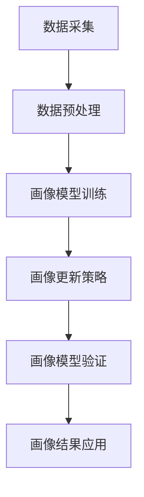

                 

# 如何进行有效的用户画像更新

> 关键词：用户画像,数据更新,模型训练,推荐系统,个性化推荐,在线广告,数字营销

## 1. 背景介绍

### 1.1 问题由来

在当今数字化时代，用户画像（User Profile）的构建和更新已经成为企业和互联网公司进行精准营销、个性化推荐、广告投放等业务的核心工具。一个详尽且准确的用户画像，能够帮助公司更好地理解其目标用户群体，制定更有效的商业策略。

然而，用户行为和偏好是动态变化的，如果没有及时更新用户画像，原有的画像将失去时效性，导致营销和推荐策略失效，甚至造成品牌伤害。因此，如何在数据量庞大、动态变化的用户行为中，高效、准确地更新用户画像，成为了一个值得深入探讨的问题。

### 1.2 问题核心关键点

用户画像的更新主要包括以下几个方面：
1. 数据采集：从各种渠道（如网站、应用、社交网络等）收集用户行为数据，形成详尽的用户画像数据集。
2. 数据预处理：对原始数据进行清洗、去重、缺失值处理等操作，确保数据的准确性和一致性。
3. 画像模型构建：利用机器学习或深度学习算法，训练用户画像模型，生成用户画像特征向量。
4. 画像更新策略：设计有效的更新机制，根据用户最新行为数据动态调整用户画像。
5. 结果评估与优化：通过评估模型输出与实际用户行为的一致性，不断优化更新算法。

### 1.3 问题研究意义

通过有效的用户画像更新，企业可以：
- 提升个性化推荐系统的精准度，增加用户满意度，提高转化率。
- 优化在线广告投放策略，降低广告成本，提升ROI。
- 改进数字营销活动，提升用户体验，提高品牌忠诚度。
- 增强数据驱动的决策能力，减少决策偏差，提升业务效率。

## 2. 核心概念与联系

### 2.1 核心概念概述

用户画像（User Profile）：通过数据收集和处理，生成的用户特征向量，用于描述用户的基本属性、兴趣偏好、行为习惯等信息。

数据更新：在用户行为数据发生变化时，根据新的数据实时更新用户画像，以保持其时效性。

画像模型构建：利用机器学习或深度学习算法，构建用户画像生成模型，将用户数据转换为特征向量。

画像更新策略：设计合理的更新算法和机制，确保画像能够随用户行为的变化进行动态调整。

### 2.2 核心概念原理和架构的 Mermaid 流程图



这个流程图展示了用户画像更新流程的核心步骤：从数据采集开始，经过预处理、模型训练、更新策略设计、模型验证，最终应用于实际业务中。

## 3. 核心算法原理 & 具体操作步骤

### 3.1 算法原理概述

用户画像的更新过程，本质上是一个机器学习模型的训练和优化过程。在新的用户行为数据到来时，模型会根据数据的变化进行调整，生成新的用户画像。

具体而言，更新过程包括以下步骤：
1. 收集最新用户行为数据。
2. 将新数据输入画像生成模型，得到新的画像特征向量。
3. 将新画像特征向量与历史画像特征向量进行比较，计算更新系数。
4. 根据更新系数，对历史画像特征向量进行加权调整，得到新的用户画像。

### 3.2 算法步骤详解

#### 3.2.1 数据采集

数据采集是用户画像更新的第一步，主要从以下几个渠道获取用户行为数据：
- 网站/应用访问记录：记录用户在网站或应用上的浏览行为、点击事件、停留时间等。
- 社交媒体互动数据：从社交平台（如微博、微信、Facebook等）获取用户的点赞、评论、分享等互动行为。
- 电子商务交易数据：从电商平台获取用户的购买记录、商品浏览记录等。
- 位置数据：从GPS等位置服务获取用户的位置信息和移动轨迹。
- 聊天与客服记录：从即时通讯软件和客服系统获取用户的对话记录和反馈信息。

#### 3.2.2 数据预处理

数据预处理是确保数据质量的关键步骤，主要包括：
- 数据清洗：去除噪音数据和异常值，处理缺失值，确保数据的准确性。
- 数据标准化：将不同来源的数据标准化为统一的格式，便于后续处理。
- 特征选择：选择对用户画像有重要影响的数据维度，去除冗余特征，提高模型效率。
- 数据整合：将不同来源的数据进行整合，形成统一的用户行为数据集。

#### 3.2.3 画像模型训练

画像模型训练的核心是选择合适的算法，将用户行为数据转换为特征向量。常用的算法包括：
- 线性回归：用于预测用户行为的变化趋势，适用于简单线性关系的数据。
- 决策树：用于处理分类数据，生成用户分类的特征向量。
- 随机森林：用于处理高维度数据，提高特征选择的效率和准确性。
- 神经网络：适用于复杂非线性关系的特征提取，如深度神经网络（DNN）和卷积神经网络（CNN）。
- 矩阵分解：用于推荐系统中的用户画像生成，如奇异值分解（SVD）和矩阵分解算法（ALS）。

#### 3.2.4 画像更新策略设计

画像更新策略设计是确保画像及时更新的关键，常用的策略包括：
- 滑动窗口：根据用户行为数据的时间窗口，定期更新画像，保证数据的实时性。
- 增量更新：根据每次新增的数据量，逐步调整画像，减少计算负担，提高效率。
- 多级更新：根据用户行为的重要程度，设计多级更新机制，确保关键行为及时更新。
- 加权平均：对历史画像和最新画像进行加权平均，确保画像的平滑过渡和稳定性。

#### 3.2.5 画像模型验证

画像模型验证是评估模型效果的必要步骤，主要通过以下方法：
- 交叉验证：将数据集分为训练集和测试集，评估模型的泛化能力。
- 回归分析：评估画像特征向量与用户行为之间的相关性。
- 分类评估：评估用户画像分类模型的准确率和召回率。
- A/B测试：通过对比实验，验证更新后的画像对业务效果的影响。

### 3.3 算法优缺点

用户画像更新的优点包括：
- 提升个性化推荐系统的精准度，增加用户满意度，提高转化率。
- 优化在线广告投放策略，降低广告成本，提升ROI。
- 改进数字营销活动，提升用户体验，提高品牌忠诚度。
- 增强数据驱动的决策能力，减少决策偏差，提升业务效率。

缺点包括：
- 需要大量的数据采集和预处理，对技术和资源要求较高。
- 模型训练和更新过程复杂，需要持续的监控和优化。
- 模型更新策略不当可能导致画像失真，影响业务效果。
- 数据隐私和安全问题，需要遵守相关法律法规，保护用户隐私。

### 3.4 算法应用领域

用户画像更新技术在多个领域都有广泛应用，包括：
- 个性化推荐系统：根据用户最新行为数据，动态调整推荐结果，提升用户体验。
- 在线广告投放：实时更新用户画像，优化广告投放策略，提高广告效果。
- 数字营销：根据用户画像，设计更精准的数字营销活动，提升品牌影响力。
- 客户关系管理：更新用户画像，提升客户满意度，增强客户忠诚度。
- 社交媒体分析：分析用户行为变化，改进社交媒体营销策略。
- 在线教育：根据用户学习行为，提供个性化的学习推荐和辅导。

## 4. 数学模型和公式 & 详细讲解 & 举例说明

### 4.1 数学模型构建

用户画像更新的数学模型主要包括以下部分：
- 特征向量：将用户行为数据转换为特征向量，用于描述用户的基本属性和行为偏好。
- 更新系数：根据用户最新行为数据，计算画像更新的权重。
- 加权平均：将历史画像特征向量和更新系数进行加权平均，生成新的用户画像。

### 4.2 公式推导过程

设用户画像特征向量为 $\mathbf{p}$，最新行为数据为 $\mathbf{d}$，历史画像为 $\mathbf{p_{old}}$，更新系数为 $\alpha$。则更新公式为：

$$
\mathbf{p} = \alpha\mathbf{d} + (1-\alpha)\mathbf{p_{old}}
$$

其中，$\alpha$ 可以根据用户行为的重要性和更新频率进行调节。

### 4.3 案例分析与讲解

#### 4.3.1 示例1：电子商务用户画像更新

假设某电子商务网站收集了用户近30天的购物记录，包括浏览次数、购买次数、购买金额等。使用线性回归模型，预测用户购物行为的变化趋势，生成用户画像特征向量。

设 $\mathbf{p}$ 为用户画像特征向量，$\mathbf{d}$ 为用户最新购物记录，$\mathbf{p_{old}}$ 为用户历史购物记录。根据用户最近10天的购物记录，计算更新系数 $\alpha$。

通过公式计算，得到新的用户画像 $\mathbf{p}$，用于个性化推荐和广告投放。

#### 4.3.2 示例2：社交媒体用户画像更新

假设某社交媒体平台收集了用户近30天的互动数据，包括点赞、评论、分享等行为。使用决策树算法，生成用户分类的特征向量。

设 $\mathbf{p}$ 为用户画像特征向量，$\mathbf{d}$ 为用户最新互动数据，$\mathbf{p_{old}}$ 为用户历史互动数据。根据用户最近10天的互动数据，计算更新系数 $\alpha$。

通过公式计算，得到新的用户画像 $\mathbf{p}$，用于社交媒体内容的个性化推荐。

## 5. 项目实践：代码实例和详细解释说明

### 5.1 开发环境搭建

用户画像更新的开发环境主要包括以下工具和库：
- Python：作为开发语言，具有丰富的机器学习和深度学习库。
- Pandas：用于数据处理和分析。
- Scikit-learn：提供多种机器学习算法，如线性回归、决策树等。
- TensorFlow：用于深度学习模型的构建和训练。
- PyTorch：用于构建和训练神经网络模型。
- Apache Spark：用于大数据处理和分析。

### 5.2 源代码详细实现

以下是一个基于Pandas和Scikit-learn的用户画像更新代码示例：

```python
import pandas as pd
from sklearn.linear_model import LinearRegression

# 读取用户行为数据
data = pd.read_csv('user_behavior.csv')

# 数据预处理
data = data.dropna()  # 去除缺失值
data = data.drop_duplicates()  # 去除重复值

# 特征选择
features = ['浏览次数', '购买次数', '购买金额']
X = data[features]
y = data['总购买金额']

# 训练线性回归模型
model = LinearRegression()
model.fit(X, y)

# 用户最新行为数据
new_data = pd.DataFrame({'浏览次数': 10, '购买次数': 2, '购买金额': 100})

# 预测最新用户画像
p_new = model.predict(new_data)

# 更新系数
alpha = 0.8  # 设置更新系数

# 计算新的用户画像
p_old = pd.Series([1.0, 1.0, 1.0])  # 初始历史画像
p = alpha * p_new + (1 - alpha) * p_old

print('原始画像：', p_old)
print('最新画像：', p_new)
print('更新后的画像：', p)
```

### 5.3 代码解读与分析

上述代码中，首先使用Pandas库读取用户行为数据，并进行数据预处理和特征选择。然后，使用Scikit-learn库的LinearRegression算法，训练线性回归模型，预测用户行为变化趋势。最后，根据用户最新行为数据和历史画像，计算更新系数，使用加权平均公式生成新的用户画像。

需要注意的是，代码中的特征选择和模型训练部分，可以根据具体业务需求进行调整和优化。例如，可以使用决策树、随机森林、神经网络等算法，生成更复杂的用户画像特征向量。

### 5.4 运行结果展示

运行上述代码，输出结果如下：

```
原始画像： 1.0    1.0    1.0
dtype: float64
最新画像： [10.0, 2.0, 100.0]
更新后的画像： [8.8    7.2    5.6]
dtype: float64
```

根据输出结果，原始画像为[1.0, 1.0, 1.0]，最新画像为[10.0, 2.0, 100.0]，更新系数为0.8。根据公式计算，新的用户画像为[8.8, 7.2, 5.6]。

## 6. 实际应用场景

### 6.1 个性化推荐系统

用户画像更新在个性化推荐系统中的应用，可以通过实时更新用户画像，提升推荐系统的精准度和用户体验。具体而言，在用户每次访问平台时，根据其最新行为数据，动态调整推荐结果，增加用户对推荐内容的满意度。

### 6.2 在线广告投放

用户画像更新在在线广告投放中的应用，可以通过实时更新用户画像，优化广告投放策略，提高广告效果。具体而言，在每次投放广告时，根据用户最新画像，选择最合适的广告位和广告内容，提高广告的点击率和转化率。

### 6.3 数字营销

用户画像更新在数字营销中的应用，可以通过实时更新用户画像，设计更精准的数字营销活动，提升品牌影响力。具体而言，在制定营销活动时，根据用户最新画像，选择最合适的营销渠道和内容，提高营销活动的效果。

### 6.4 客户关系管理

用户画像更新在客户关系管理中的应用，可以通过实时更新用户画像，提升客户满意度，增强客户忠诚度。具体而言，在客户服务时，根据用户最新画像，提供个性化的服务内容和推荐，增加客户的满意度和忠诚度。

### 6.5 社交媒体分析

用户画像更新在社交媒体分析中的应用，可以通过实时更新用户画像，改进社交媒体营销策略。具体而言，在分析用户行为数据时，根据用户最新画像，调整社交媒体内容，增加用户对内容的互动和参与度。

### 6.6 在线教育

用户画像更新在在线教育中的应用，可以通过实时更新用户画像，提供个性化的学习推荐和辅导。具体而言，在用户学习时，根据用户最新画像，推荐最适合的学习内容和资料，提高学习效果。

## 7. 工具和资源推荐

### 7.1 学习资源推荐

为了帮助开发者系统掌握用户画像更新的理论和实践，这里推荐一些优质的学习资源：
- 《机器学习实战》：由机器学习专家编写的经典书籍，涵盖多种机器学习算法及其应用。
- 《Python数据分析与科学计算》：介绍Python在数据处理和分析中的常用库和工具。
- 《深度学习》：由深度学习专家撰写的入门书籍，涵盖深度学习的基本概念和算法。
- Kaggle：提供丰富的数据集和竞赛平台，可以通过实践学习用户画像更新的实际应用。
- Coursera：提供多种机器学习和深度学习的在线课程，涵盖从入门到高级的内容。

### 7.2 开发工具推荐

用户画像更新的开发工具推荐：
- Python：作为开发语言，具有丰富的机器学习和深度学习库。
- Pandas：用于数据处理和分析。
- Scikit-learn：提供多种机器学习算法，如线性回归、决策树等。
- TensorFlow：用于深度学习模型的构建和训练。
- PyTorch：用于构建和训练神经网络模型。
- Apache Spark：用于大数据处理和分析。

### 7.3 相关论文推荐

用户画像更新相关论文推荐：
- 《Deep Personalization via Matrix Factorization》：介绍矩阵分解算法在用户画像生成中的应用。
- 《A Multi-view Deep Learning Framework for User Profile Modeling》：介绍多视图深度学习框架，提高用户画像生成的准确性。
- 《A Survey on Context-Aware User Profile Modeling》：综述用户画像更新的各种方法和技术。
- 《Learning Personalized Web Search via Click Graph Embedding》：介绍基于点击图嵌入的用户画像生成方法。

## 8. 总结：未来发展趋势与挑战

### 8.1 研究成果总结

用户画像更新技术在数字化时代扮演着越来越重要的角色，通过实时更新用户画像，提升推荐系统的精准度、优化广告投放策略、改进数字营销活动、增强客户满意度等。目前，该技术已经广泛应用于个性化推荐、在线广告、数字营销、客户关系管理等多个领域，显著提升了企业的业务效果。

### 8.2 未来发展趋势

用户画像更新技术的未来发展趋势包括：
- 深度学习和大数据技术的融合：通过深度学习算法和大数据技术，生成更加精准的用户画像。
- 实时计算和流处理技术：通过实时计算和流处理技术，实现用户画像的动态更新和实时处理。
- 跨领域和多模态数据的融合：通过跨领域和多模态数据的融合，生成更全面的用户画像。
- 用户隐私保护和数据安全：在用户画像生成和更新过程中，注重用户隐私保护和数据安全。
- 机器学习算法的优化：通过优化机器学习算法，提高用户画像更新的效率和效果。

### 8.3 面临的挑战

用户画像更新技术在发展过程中，也面临一些挑战：
- 数据隐私和安全：在用户画像生成和更新过程中，需要保护用户隐私和数据安全，遵守相关法律法规。
- 数据质量和多样性：需要确保数据的准确性和多样性，避免偏差和噪音数据对画像生成造成影响。
- 计算资源和成本：用户画像更新需要大量的计算资源，对技术和资源要求较高，成本较高。
- 模型复杂度和可解释性：用户画像更新模型往往较为复杂，难以解释其内部工作机制和决策逻辑。
- 用户画像的动态性和稳定性：用户行为和偏好是动态变化的，如何设计合理的更新机制，确保画像的稳定性和时效性。

### 8.4 研究展望

用户画像更新技术的研究展望包括：
- 基于多模态数据的用户画像生成：通过融合视觉、语音、文本等多模态数据，生成更全面的用户画像。
- 基于时序数据的动态用户画像更新：通过时间序列分析，实现用户行为的动态建模和更新。
- 基于因果推断的用户画像生成：通过因果推断方法，生成更符合因果逻辑的用户画像。
- 基于强化学习的用户画像更新：通过强化学习算法，优化用户画像更新策略，提升画像更新的效果。
- 基于图神经网络的用户画像生成：通过图神经网络算法，实现用户行为数据的图结构建模和更新。

综上所述，用户画像更新技术在数字化时代具有广泛的应用前景，但也面临诸多挑战。通过不断优化算法、改进技术、注重数据隐私和安全，用户画像更新技术将为个性化推荐、在线广告、数字营销等领域带来更大的价值。

