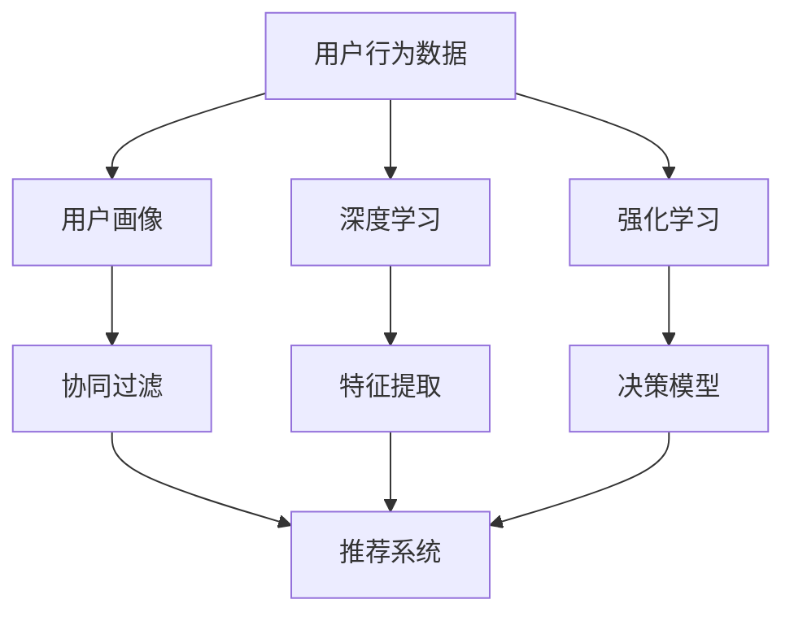

                 

# 如何进行有效的用户行为分析

> 关键词：用户行为分析, 数据挖掘, 机器学习, 统计分析, 数据可视化

## 1. 背景介绍

### 1.1 问题由来

在数字化时代，数据已成为企业的核心资产。随着大数据技术的兴起，如何利用数据洞察用户行为，提升业务决策的精准性，成为企业最关心的问题。用户行为分析(User Behavior Analysis, UBA)正是利用数据挖掘、机器学习和统计分析等技术，深入挖掘用户行为模式，预测用户未来行为，从而提升产品和服务体验的过程。

用户行为分析在零售、电商、金融、互联网等多个领域有着广泛的应用。例如，在零售业，商家通过分析用户购买历史、浏览记录、点击行为等数据，预测用户偏好，实现个性化推荐和库存优化。在金融领域，银行利用用户行为数据，评估信贷风险，进行客户细分。在互联网领域，通过用户行为分析，优化网站页面布局，提升用户体验和转化率。

### 1.2 问题核心关键点

用户行为分析的核心目标是通过数据挖掘和机器学习，发现并量化用户行为特征，预测用户行为，从而实现业务目标。具体来说，需要解决以下几个关键问题：

1. **数据采集与处理**：收集用户行为数据，包括但不限于点击、购买、浏览、搜索等行为数据，并对其进行清洗、去重、归一化等处理，确保数据质量。
2. **特征工程**：从原始数据中提取有用的特征，如用户兴趣、购买频率、忠诚度等，构建高维特征空间。
3. **模型选择与训练**：选择合适的机器学习模型，如分类、回归、聚类、推荐等，并利用历史数据对模型进行训练和调优。
4. **结果评估与优化**：评估模型性能，通过交叉验证、A/B测试等手段，不断优化模型和特征选择，提升预测准确性。

### 1.3 问题研究意义

用户行为分析不仅有助于企业更好地理解用户需求，提升产品和服务质量，还能为营销、运营、决策提供科学依据，实现精细化管理。以下是用户行为分析的主要意义：

1. **提升用户体验**：通过分析用户行为数据，发现用户痛点和需求，优化产品设计，提升用户满意度。
2. **增加业务收入**：个性化推荐和精准营销能够提高转化率，增加企业收益。
3. **降低运营成本**：优化资源配置，减少不必要的浪费，提升运营效率。
4. **风险控制**：通过预测用户风险行为，如欺诈、流失等，及时采取措施，降低损失。

## 2. 核心概念与联系

### 2.1 核心概念概述

为更好地理解用户行为分析方法，本节将介绍几个密切相关的核心概念：

- **用户行为数据**：用户在产品或服务中的操作数据，如点击、购买、搜索、浏览等，是用户行为分析的基础。
- **用户画像**：基于用户行为数据，构建用户特征向量，描述用户画像。
- **协同过滤**：通过分析用户与物品的交互数据，发现用户兴趣和偏好，实现个性化推荐。
- **深度学习**：利用深度神经网络模型，如卷积神经网络、循环神经网络等，构建高阶特征表示，提升模型预测能力。
- **强化学习**：通过用户行为数据，训练智能决策模型，优化行为策略。

这些核心概念之间的逻辑关系可以通过以下Mermaid流程图来展示：



这个流程图展示了用户行为分析的各个环节和它们之间的关系：

1. 用户行为数据是用户画像的基础。
2. 用户画像通过协同过滤和深度学习技术，得到用户兴趣和偏好。
3. 协同过滤和深度学习的结果用于推荐系统，实现个性化推荐。
4. 深度学习还可以用于特征提取，提升模型预测能力。
5. 强化学习则通过用户行为数据，训练智能决策模型，优化行为策略。

这些概念共同构成了用户行为分析的基本框架，为理解用户行为提供了坚实的基础。

## 3. 核心算法原理 & 具体操作步骤
### 3.1 算法原理概述

用户行为分析的算法原理主要基于数据挖掘、机器学习和统计分析技术，通过构建数学模型，从大量用户行为数据中发现规律和趋势，从而实现预测和优化。

用户行为分析的核心流程包括数据预处理、特征工程、模型选择与训练、结果评估与优化等步骤。以下将以协同过滤算法为例，介绍用户行为分析的核心算法原理。

### 3.2 算法步骤详解

协同过滤是一种基于用户行为数据的推荐算法，通过分析用户对物品的评分数据，发现相似用户或物品，从而实现个性化推荐。协同过滤算法分为基于用户的协同过滤和基于物品的协同过滤两种方法。

**基于用户的协同过滤**：通过计算用户之间的相似度，找到与目标用户行为最接近的其他用户，并基于这些用户对物品的评分，预测目标用户对物品的评分。

**基于物品的协同过滤**：通过计算物品之间的相似度，找到与目标物品最接近的其他物品，并基于这些物品的用户评分，预测目标用户对物品的评分。

协同过滤算法的具体步骤包括：

1. 数据预处理：对用户行为数据进行清洗、去重、归一化等处理，构建用户-物品评分矩阵。
2. 相似度计算：计算用户与物品之间的相似度，通常采用余弦相似度、皮尔逊相关系数等。
3. 推荐计算：基于相似度计算结果，推荐与目标用户/物品最相似的其他用户/物品，并根据这些用户/物品的评分，预测目标用户/物品的评分。

### 3.3 算法优缺点

协同过滤算法具有以下优点：

1. **高效性**：算法简单，易于实现，适合大规模数据集。
2. **鲁棒性**：能够处理缺失数据，对稀疏矩阵的处理能力强。
3. **灵活性**：适用于多种推荐场景，如个性化推荐、排行榜推荐等。

同时，协同过滤算法也存在一些缺点：

1. **数据稀疏性**：用户行为数据通常较为稀疏，会导致推荐结果不准确。
2. **冷启动问题**：新用户或新物品没有历史数据，无法进行推荐。
3. **样本偏差**：用户行为数据可能存在样本偏差，影响推荐结果的公平性。

### 3.4 算法应用领域

协同过滤算法在用户行为分析中有着广泛的应用，涵盖多个推荐场景，如：

- 个性化推荐：如电商网站、视频平台等，根据用户历史行为，推荐用户可能感兴趣的商品或内容。
- 排行榜推荐：如音乐、新闻、社交媒体等，根据用户兴趣和行为，推荐热门内容。
- 用户细分：根据用户行为数据，对用户进行聚类，实现用户画像和细分。

除了协同过滤，用户行为分析中还有许多其他算法，如基于内容的推荐、基于关联规则的推荐等，可以结合使用，提升推荐效果。

## 4. 数学模型和公式 & 详细讲解 & 举例说明

### 4.1 数学模型构建

协同过滤算法的数学模型可以抽象为如下形式：

$$
\hat{r}_{ui} = \frac{\sum_{j=1}^n r_{uj} \cdot \text{sim}(u_i, v_j)}{\sqrt{\sum_{j=1}^n (1-r_{uj}^2) \cdot \text{sim}(u_i, v_j)^2}}
$$

其中，$r_{ui}$ 表示目标用户 $u_i$ 对物品 $i$ 的预测评分，$n$ 表示物品总数，$\text{sim}(u_i, v_j)$ 表示用户 $u_i$ 和物品 $v_j$ 之间的相似度，$\hat{r}_{ui}$ 表示预测评分，$r_{uj}$ 表示物品 $j$ 的实际评分。

### 4.2 公式推导过程

协同过滤算法中，相似度的计算是非常关键的一步。常用的相似度计算方法有余弦相似度和皮尔逊相关系数。这里以余弦相似度为例，进行推导：

假设用户 $u_i$ 和物品 $v_j$ 的行为向量分别为 $u_i = (r_{ui_1}, r_{ui_2}, \cdots, r_{ui_m})$ 和 $v_j = (r_{vj_1}, r_{vj_2}, \cdots, r_{vj_n})$，则余弦相似度定义为：

$$
\text{sim}(u_i, v_j) = \frac{\sum_{k=1}^m r_{ui_k} \cdot r_{vj_k}}{\sqrt{\sum_{k=1}^m r_{ui_k}^2} \cdot \sqrt{\sum_{k=1}^n r_{vj_k}^2}}
$$

将余弦相似度代入预测评分公式中，得：

$$
\hat{r}_{ui} = \frac{\sum_{j=1}^n r_{uj} \cdot \frac{\sum_{k=1}^m r_{ui_k} \cdot r_{vj_k}}{\sqrt{\sum_{k=1}^m r_{ui_k}^2} \cdot \sqrt{\sum_{k=1}^n r_{vj_k}^2}}}{\sqrt{\sum_{j=1}^n (1-r_{uj}^2) \cdot \frac{\sum_{k=1}^m r_{ui_k}^2 \cdot \frac{\sum_{k=1}^m r_{ui_k}^2}{\sum_{k=1}^m r_{ui_k}^2} \cdot \frac{\sum_{k=1}^n r_{vj_k}^2 \cdot \frac{\sum_{k=1}^n r_{vj_k}^2}{\sum_{k=1}^n r_{vj_k}^2}}}}
$$

### 4.3 案例分析与讲解

以电商网站的个性化推荐为例，协同过滤算法可以这样实现：

1. 数据预处理：收集用户浏览、点击、购买等行为数据，构建用户-物品评分矩阵。
2. 相似度计算：计算用户与物品之间的余弦相似度。
3. 推荐计算：根据相似度计算结果，推荐与目标用户最相似的其他用户，并基于这些用户的评分，预测目标用户对物品的评分。

以下是一个简单的Python实现，用于计算用户和物品之间的相似度：

```python
import numpy as np

# 构建用户-物品评分矩阵
user_ratings = np.array([[5, 2, 0, 3], 
                        [4, 1, 5, 0], 
                        [3, 4, 2, 0], 
                        [0, 5, 0, 4]])

# 计算余弦相似度
def cosine_similarity(X, Y):
    return np.dot(X, Y) / (np.linalg.norm(X) * np.linalg.norm(Y))

# 计算相似度矩阵
similarity_matrix = cosine_similarity(user_ratings, user_ratings.T)

print(similarity_matrix)
```

## 5. 项目实践：代码实例和详细解释说明
### 5.1 开发环境搭建

在进行用户行为分析的实践时，我们需要准备好开发环境。以下是使用Python进行Spark开发的开发环境配置流程：

1. 安装Apache Spark：从官网下载并安装Apache Spark，确保与Python版本兼容。
2. 安装PySpark：从官网下载并安装PySpark，确保与Spark版本兼容。
3. 安装所需库：安装Pandas、Scikit-Learn、Matplotlib、NLTK等数据处理和机器学习库。
4. 配置环境变量：设置Spark和PySpark的路径，确保环境变量正确。

完成上述步骤后，即可在Spark环境中开始用户行为分析实践。

### 5.2 源代码详细实现

下面我们以电商网站的个性化推荐为例，给出使用PySpark进行协同过滤算法的实现代码。

首先，定义数据预处理函数：

```python
from pyspark.sql import SparkSession
from pyspark.ml.feature import Normalizer
from pyspark.ml.recommendation import ALS

# 初始化SparkSession
spark = SparkSession.builder.appName('user_based_collab_filtering').getOrCreate()

# 定义数据预处理函数
def preprocess_data(spark, data):
    # 加载数据
    df = spark.read.format('csv').option('header', 'true').option('inferSchema', 'true').load(data)

    # 构建评分矩阵
    user_items = df.filter(df['rating'] > 0)
    user_items = user_items.rdd.map(lambda row: (row['user_id'], row['item_id'], row['rating'])).toDF(['user_id', 'item_id', 'rating'])

    # 标准化评分矩阵
    user_items = Normalizer(inputCol='rating', outputCol='normalized_rating').fit(user_items.transform(user_items)).predict(user_items)
    user_items = user_items.toDF(['user_id', 'item_id', 'normalized_rating'])

    # 构建相似度矩阵
    user_items = user_items.select('user_id', 'item_id', 'normalized_rating')
    user_items = user_items.join(user_items, ['user_id', 'item_id'], 'left_outer').toDF(['user_id', 'item_id', 'similarity'])
    user_items = user_items.select('user_id', 'item_id', 'similarity').cache()

    # 删除原始评分矩阵
    user_items = user_items.drop('rating').toDF(['user_id', 'item_id', 'similarity'])

    return user_items

# 加载数据集
data_path = 'data/user_based_collab_filtering_data.csv'
user_items = preprocess_data(spark, data_path)
```

然后，定义协同过滤模型：

```python
# 定义协同过滤模型
model = ALS(user_based=False, factors=10, iterations=10, regParam=0.1)

# 训练模型
model.fit(user_items)

# 获取推荐结果
recommendations = model.recommendForAllUsers(user_items)
```

最后，输出推荐结果：

```python
# 获取推荐结果
recommendations = model.recommendForAllUsers(user_items)

# 输出推荐结果
recommendations.show()
```

以上就是使用PySpark进行协同过滤算法的完整代码实现。可以看到，得益于Spark的分布式计算能力，协同过滤算法的实现变得简洁高效。

### 5.3 代码解读与分析

让我们再详细解读一下关键代码的实现细节：

**preprocess_data函数**：
- 加载数据集，并构建用户-物品评分矩阵。
- 对评分矩阵进行标准化处理，确保评分数据的分布一致。
- 计算用户与物品之间的相似度，构建相似度矩阵。
- 删除原始评分矩阵，仅保留用户、物品和相似度信息。

**ALS模型**：
- 定义ALS模型，指定模型参数，如因子数、迭代次数、正则化参数等。
- 训练模型，并获取推荐结果。

**输出推荐结果**：
- 使用show方法输出推荐结果，展示每个用户的推荐物品列表。

可以看出，Spark提供了一套便捷的API，可以方便地进行数据预处理、模型训练和结果输出，显著简化了协同过滤算法的实现流程。

当然，在实际应用中，还需要考虑更多因素，如特征工程、模型评估、超参数调优等。但核心的协同过滤范式基本与此类似。

## 6. 实际应用场景
### 6.1 智能推荐系统

用户行为分析的核心应用之一是智能推荐系统，通过分析用户历史行为数据，预测用户未来行为，实现个性化推荐。智能推荐系统在电商、视频、音乐等多个领域广泛应用，极大地提升了用户体验和平台收益。

例如，电商网站可以根据用户浏览、点击、购买等行为，推荐用户可能感兴趣的商品。视频平台可以根据用户观看历史、点赞、评论等行为，推荐用户可能喜欢的视频。音乐平台可以根据用户听歌历史、播放列表等行为，推荐用户可能喜欢的歌曲。

### 6.2 营销分析

用户行为分析还可以用于营销分析，帮助企业制定精准的营销策略。通过分析用户行为数据，可以发现用户兴趣和需求，实现定向投放，提升广告效果。

例如，电信运营商可以分析用户通话记录、短信互动等行为数据，发现用户兴趣点，实现精准营销。银行可以通过分析用户消费记录、转账记录等行为数据，发现用户需求，实现精准推送。

### 6.3 客户细分

用户行为分析还可以用于客户细分，帮助企业识别高价值客户，提升客户体验和忠诚度。通过分析用户行为数据，可以发现不同客户群体的特征和需求，实现差异化服务。

例如，金融机构可以分析客户交易记录、理财行为等数据，发现高价值客户，提供个性化理财建议。电信运营商可以分析用户通话记录、消费记录等数据，发现高价值客户，提供差异化服务。

### 6.4 未来应用展望

随着大数据技术的进一步发展，用户行为分析的应用领域将进一步扩大。未来，用户行为分析有望在以下几个领域得到更广泛的应用：

1. **医疗健康**：通过分析患者医疗记录、用药行为等数据，实现个性化医疗方案推荐，提升诊疗效果。
2. **智慧城市**：通过分析居民出行、能源使用等数据，实现智能交通、能源管理，提升城市管理水平。
3. **教育培训**：通过分析学生学习行为、成绩数据等，实现个性化教学方案推荐，提升学习效果。

总之，用户行为分析的应用前景广阔，将为用户和企业带来巨大的价值。未来，随着数据获取和处理能力的提升，用户行为分析技术将进一步深化，推动更多领域智能化升级。

## 7. 工具和资源推荐
### 7.1 学习资源推荐

为了帮助开发者系统掌握用户行为分析的理论基础和实践技巧，这里推荐一些优质的学习资源：

1. 《Python for Data Analysis》：Stefan Jahn所著，全面介绍了Python在数据处理和分析中的应用，适合入门学习。
2. 《Data Science from Scratch》：Joel Grus所著，从零开始，介绍了数据科学的基本概念和实践方法。
3. 《Hands-On Machine Learning with Scikit-Learn, Keras, and TensorFlow》：Aurélien Géron所著，介绍了机器学习和深度学习的常用工具和方法。
4. Kaggle：数据科学竞赛平台，提供了大量开源数据集和经典竞赛，适合实践学习。
5. Coursera：在线学习平台，提供了众多数据科学和机器学习的课程，适合深入学习。

通过对这些资源的学习实践，相信你一定能够快速掌握用户行为分析的精髓，并用于解决实际的业务问题。

### 7.2 开发工具推荐

高效的开发离不开优秀的工具支持。以下是几款用于用户行为分析开发的常用工具：

1. Apache Spark：分布式计算框架，支持大规模数据处理和机器学习。
2. PySpark：Spark的Python API，提供了便捷的数据处理和机器学习工具。
3. Pandas：Python的数据处理库，支持数据清洗、数据探索等操作。
4. Scikit-Learn：Python的机器学习库，提供了丰富的算法和模型。
5. Matplotlib：Python的可视化库，支持数据可视化。

合理利用这些工具，可以显著提升用户行为分析的开发效率，加快创新迭代的步伐。

### 7.3 相关论文推荐

用户行为分析的研究源于学界的持续研究。以下是几篇奠基性的相关论文，推荐阅读：

1. A Framework for Comparative Evaluation of Collaborative Filtering Algorithms：David M. Pennock等，系统比较了各种协同过滤算法，提供了标准化的评估指标。
2. Collaborative Filtering for Implicit Feedback Datasets：Jian Kang等，提出了一种基于矩阵分解的协同过滤算法，用于处理稀疏数据集。
3. Learning Deep Architectures for Collaborative Filtering：Pietro T. Patsogiannis等，提出了一种深度神经网络模型，用于协同过滤算法。
4. ALS: The Alternating Least Squares Algorithm for Computational Statistics：D. Goldberg等，介绍了基于交替最小二乘的协同过滤算法，提供了详细的实现步骤。
5. Preference-Based Recommendation Systems: Beyond Matrix Factorization：Klösel et al.，提出了基于用户偏好的推荐算法，用于协同过滤。

这些论文代表了大数据和机器学习在用户行为分析中的应用方向，为进一步学习和实践提供了重要参考。

## 8. 总结：未来发展趋势与挑战
### 8.1 研究成果总结

用户行为分析作为数据挖掘和机器学习的重要应用领域，已经取得了显著的进展。主要的研究成果包括：

1. 协同过滤算法：通过分析用户和物品的评分数据，发现相似用户或物品，实现个性化推荐。
2. 深度学习算法：利用深度神经网络模型，提取高阶特征表示，提升模型预测能力。
3. 强化学习算法：通过用户行为数据，训练智能决策模型，优化行为策略。

这些算法和方法在多个应用场景中得到了广泛应用，提升了用户行为分析的准确性和效率。

### 8.2 未来发展趋势

展望未来，用户行为分析将呈现以下几个发展趋势：

1. **多模态数据融合**：结合用户行为数据和其他模态数据（如图像、语音等），提升分析效果。
2. **实时数据处理**：通过流处理技术，实现实时数据挖掘和分析，提升数据新鲜度。
3. **隐私保护**：采用隐私保护技术，如差分隐私、联邦学习等，保护用户隐私和数据安全。
4. **模型解释性**：开发可解释的机器学习模型，提高模型的透明度和可信度。
5. **自动化调参**：利用自动化调参技术，优化模型参数，提升模型性能。

这些趋势将推动用户行为分析技术不断进步，提升应用场景的智能化水平。

### 8.3 面临的挑战

尽管用户行为分析已经取得了一定的进展，但在实现精准预测和优化方面，仍面临诸多挑战：

1. **数据质量**：用户行为数据通常较为复杂和多样化，数据清洗和预处理难度较大。
2. **模型泛化性**：用户行为数据存在样本偏差，模型泛化性差，容易过拟合。
3. **冷启动问题**：新用户或新物品没有历史数据，无法进行推荐。
4. **隐私保护**：用户行为数据涉及个人隐私，数据保护和隐私控制难度大。
5. **计算资源**：大规模数据处理和深度学习模型训练需要高性能计算资源，成本高昂。

解决这些挑战，需要多方面的协同努力，包括算法改进、技术创新和政策支持。

### 8.4 研究展望

未来的研究需要在以下几个方面寻求新的突破：

1. **高质量数据获取**：利用大数据技术，提高数据采集和处理效率，确保数据质量。
2. **高效算法设计**：开发更加高效、鲁棒的算法，提升模型的泛化性和可解释性。
3. **隐私保护技术**：结合隐私保护技术，保护用户数据安全，提升用户信任度。
4. **自动化调参**：开发自动化调参工具，优化模型参数，提升模型性能。
5. **跨领域应用**：将用户行为分析技术应用于更多领域，推动智能社会的发展。

这些研究方向的探索，必将引领用户行为分析技术迈向更高的台阶，为构建智能社会提供坚实的数据基础和技术支持。

## 9. 附录：常见问题与解答

**Q1：用户行为分析与数据挖掘的区别是什么？**

A: 用户行为分析是一种特殊的数据挖掘方法，主要关注用户行为数据，通过分析用户行为模式，发现用户需求和偏好，实现个性化推荐和精准营销。而数据挖掘则更为广泛，涉及从大量数据中发现知识、发现模式和规律的方法，不仅包括用户行为数据，还包括文本、图像、语音等多种类型的数据。

**Q2：如何处理用户行为数据的稀疏性？**

A: 用户行为数据通常较为稀疏，可以通过以下方法处理：
1. 数据补全：利用协同过滤、矩阵分解等方法，填补缺失数据。
2. 特征工程：提取用户行为中的关键特征，如用户兴趣、时间、地点等，提升特征空间的稀疏度。
3. 模型优化：采用深度学习等方法，构建稀疏性友好的模型，提高模型预测能力。

**Q3：如何缓解用户行为分析中的冷启动问题？**

A: 冷启动问题可以通过以下方法缓解：
1. 利用相似用户/物品推荐：通过推荐系统中的用户或物品相似度，对新用户/物品进行推荐。
2. 利用协同过滤模型：通过协同过滤模型，对新用户/物品进行推荐。
3. 利用主动学习：通过主动学习算法，利用少量标注数据对新用户/物品进行快速训练。

**Q4：用户行为分析中的数据隐私问题如何处理？**

A: 数据隐私问题可以通过以下方法处理：
1. 匿名化处理：对用户行为数据进行匿名化处理，保护用户隐私。
2. 差分隐私：利用差分隐私技术，在数据分析过程中保护用户隐私。
3. 联邦学习：利用联邦学习技术，在保护用户隐私的前提下，进行分布式数据分析。

**Q5：用户行为分析中的推荐算法有哪些？**

A: 用户行为分析中的推荐算法包括：
1. 协同过滤算法：基于用户-物品评分数据，推荐相似用户或物品。
2. 基于内容的推荐算法：基于物品属性或用户兴趣，推荐相似物品。
3. 基于关联规则的推荐算法：通过挖掘关联规则，推荐相关物品。
4. 混合推荐算法：结合多种推荐算法，提升推荐效果。

以上推荐算法在实际应用中各有优缺点，需要根据具体场景选择合适的算法。

---

作者：禅与计算机程序设计艺术 / Zen and the Art of Computer Programming

