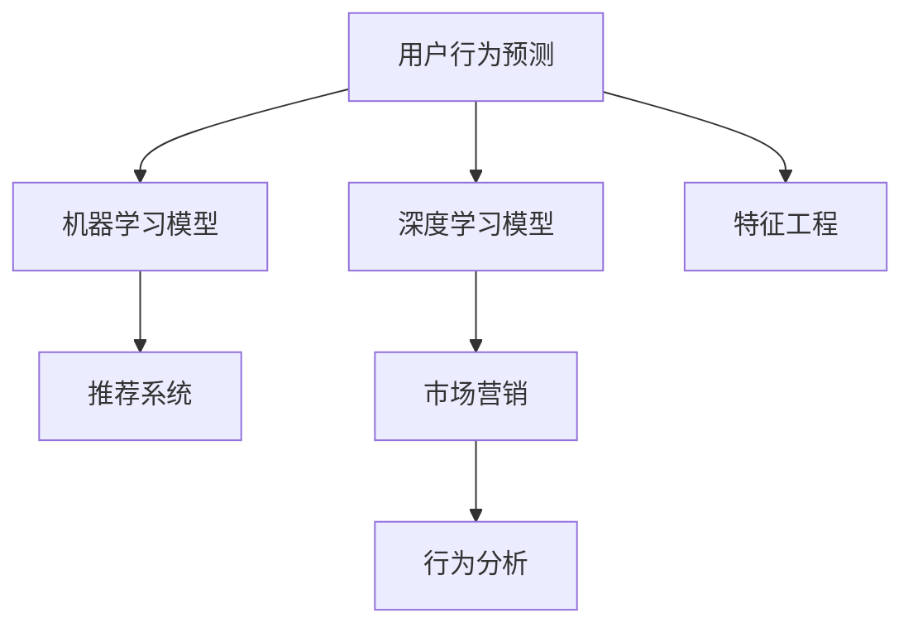

                 

# 如何进行有效的用户行为预测

> 关键词：用户行为预测, 机器学习, 深度学习, 特征工程, 推荐系统, 市场营销, 行为分析

## 1. 背景介绍

### 1.1 问题由来

在现代社会中，数据已经成为企业最宝贵的资产之一。如何利用数据洞察用户行为，预测用户需求，制定有针对性的营销策略，已成为企业数字化转型的关键。特别是在电商、金融、广告、社交等众多领域，预测用户行为能极大提升企业的竞争力和市场占有率。因此，用户行为预测在各行各业中得到了广泛的应用和重视。

### 1.2 问题核心关键点

用户行为预测的核心目标是通过历史数据，学习用户行为模式，预测其在未来时间点的行为倾向，从而指导企业决策。预测的准确度直接影响企业的市场响应速度和资源配置效率。

目前主流的方法主要包括基于统计模型的预测、机器学习模型预测、深度学习模型预测等。每种方法都有其特点和适用场景，选择合适的方法对于预测的准确性和有效性至关重要。

### 1.3 问题研究意义

用户行为预测对于企业而言，具有深远的战略意义：

1. **提升用户体验**：通过精准的用户行为预测，企业能够提供个性化的推荐和服务，增强用户粘性。
2. **优化营销策略**：了解用户行为，预测购买倾向，可以帮助企业制定更加精准的市场营销策略，避免资源浪费。
3. **实现数据驱动决策**：利用用户行为数据进行分析和预测，可以支撑企业高层决策，减少决策风险。
4. **增强风险管理**：在金融领域，准确预测用户行为有助于管理风险，防范欺诈行为。
5. **加速业务创新**：预测技术可以应用于产品迭代和业务优化，推动企业持续创新。

## 2. 核心概念与联系

### 2.1 核心概念概述

为更好地理解用户行为预测方法，本节将介绍几个密切相关的核心概念：

- **用户行为预测**：通过历史数据学习用户行为模式，预测其在未来时间点的行为倾向。
- **机器学习模型**：基于统计或机器学习算法，通过历史数据训练模型，并用于预测用户行为。
- **深度学习模型**：利用神经网络等深度学习算法，从大量数据中学习复杂模式，进行高精度预测。
- **特征工程**：选择和构造有效的输入特征，提升模型预测能力。
- **推荐系统**：根据用户历史行为，推荐可能感兴趣的物品或内容，优化用户体验。
- **市场营销**：利用用户行为预测结果，制定个性化的营销策略，提升市场效果。
- **行为分析**：对用户行为数据进行全面分析，洞察用户需求，优化业务流程。

这些核心概念之间的逻辑关系可以通过以下Mermaid流程图来展示：



这个流程图展示了几大核心概念及其之间的关系：

1. 用户行为预测是核心任务，依赖机器学习和深度学习模型实现。
2. 特征工程用于选择和构造有效的输入特征，提升模型性能。
3. 推荐系统利用预测结果为用户推荐个性化内容。
4. 市场营销基于预测结果，制定精准的营销策略。
5. 行为分析用于全面分析用户行为，优化业务流程。

## 3. 核心算法原理 & 具体操作步骤
### 3.1 算法原理概述

用户行为预测的本质是通过历史数据学习用户行为模式，并应用到未来数据中的过程。其基本步骤包括数据预处理、特征工程、模型训练和预测评估。

在预测过程中，数据预处理主要涉及缺失值处理、数据标准化、特征编码等操作。特征工程则是选择和构造有效的输入特征，提升模型预测能力。模型训练则包括选择合适的算法、设置模型参数、训练模型等步骤。预测评估则是通过验证数据集评估模型预测的准确性和泛化能力。

### 3.2 算法步骤详解

#### 3.2.1 数据预处理

数据预处理是用户行为预测的第一步，目的是清洗、标准化数据，为后续分析提供可靠的基础。具体步骤包括：

- **缺失值处理**：识别并填补缺失值，避免模型在训练时出现问题。
- **数据标准化**：将数据缩放到一定范围内，提升模型的收敛速度和泛化能力。
- **特征编码**：对非数值型特征进行编码，方便模型处理。

#### 3.2.2 特征工程

特征工程是提升模型预测精度的关键步骤，通过选择和构造有效的输入特征，提高模型的表达能力。常见的方法包括：

- **特征选择**：根据特征对预测任务的重要性，选择最有用的特征。
- **特征构建**：通过组合、交叉、变换等方法，构造新的特征，增强模型的表达能力。
- **特征降维**：采用主成分分析、线性判别分析等方法，减少特征维度，降低计算复杂度。

#### 3.2.3 模型训练

模型训练是用户行为预测的核心环节，通过历史数据训练模型，使模型能够预测未来数据。常用的算法包括线性回归、决策树、随机森林、支持向量机等传统机器学习算法，以及深度学习算法如神经网络、卷积神经网络、循环神经网络等。

#### 3.2.4 预测评估

预测评估是检验模型预测效果的最后一步，通过验证数据集评估模型的准确性和泛化能力。常见的评估指标包括均方误差(MSE)、平均绝对误差(MAE)、决定系数(R-squared)等。

### 3.3 算法优缺点

用户行为预测方法具有以下优点：

- **高精度**：通过大量数据训练，机器学习和深度学习模型能够捕捉复杂的用户行为模式，预测结果精度较高。
- **泛化能力强**：通过选择合适的特征和模型，能够适应不同用户和场景，具有较好的泛化能力。
- **应用广泛**：在电商、金融、广告等多个领域，用户行为预测具有重要应用价值，能够显著提升企业竞争力。

同时，该方法也存在一定的局限性：

- **数据需求高**：需要大量的历史数据才能训练出高性能的模型，数据收集和处理成本较高。
- **模型复杂**：复杂模型训练和调参难度较大，需要丰富的经验和专业知识。
- **可解释性差**：深度学习模型往往被视为"黑盒"，难以解释模型内部的决策过程。

尽管存在这些局限性，但就目前而言，基于机器学习和深度学习的用户行为预测方法是较为成熟和有效的。

### 3.4 算法应用领域

用户行为预测在多个领域得到了广泛应用，具体如下：

- **电商领域**：预测用户购买行为，推荐商品，提升用户转化率。
- **金融领域**：预测用户信用风险，防范欺诈行为，优化贷款审批流程。
- **广告领域**：预测用户广告点击率，优化广告投放策略，提升广告效果。
- **社交领域**：预测用户互动行为，提升社区粘性，优化内容推荐。
- **营销领域**：预测用户消费趋势，制定精准的营销策略，提高市场响应速度。
- **行为分析**：通过行为预测结果，分析用户需求，优化业务流程。

## 4. 数学模型和公式 & 详细讲解 & 举例说明

### 4.1 数学模型构建

用户行为预测的数学模型构建主要包括两部分：特征选择和模型选择。

- **特征选择**：选择对预测任务有重要影响的特征，通常包括用户基本信息、历史行为、时间特征等。
- **模型选择**：选择合适的预测模型，常用的模型包括线性回归、决策树、随机森林、神经网络等。

### 4.2 公式推导过程

以线性回归模型为例，其基本公式为：

$$
y = \beta_0 + \beta_1 x_1 + \beta_2 x_2 + ... + \beta_n x_n + \epsilon
$$

其中，$y$ 为预测值，$x_i$ 为输入特征，$\beta_i$ 为特征系数，$\epsilon$ 为误差项。通过最小化损失函数（如均方误差），可以求解得到最优的特征系数。

在实际应用中，为了提升模型预测能力，常常需要加入正则化项（如L2正则），防止过拟合：

$$
\min \frac{1}{2N} \sum_{i=1}^N (y_i - \hat{y}_i)^2 + \lambda \sum_{j=1}^p \beta_j^2
$$

其中，$\lambda$ 为正则化系数，$p$ 为特征个数。

### 4.3 案例分析与讲解

以电商领域为例，用户行为预测的目标是预测用户是否会购买某商品。假设已有历史数据集 $D = \{(x_i, y_i)\}_{i=1}^N$，其中 $x_i = (x_{i1}, x_{i2}, ..., x_{in})$ 为输入特征，$y_i$ 为标签（0表示未购买，1表示购买）。

设选择的特征包括用户年龄、性别、浏览时间、点击次数等，使用线性回归模型进行预测。预测公式如下：

$$
y = \beta_0 + \beta_1 x_{i1} + \beta_2 x_{i2} + ... + \beta_n x_{in}
$$

其中，$\beta_0$ 为截距，$\beta_i$ 为特征系数。

假设模型训练后得到系数 $\beta_i$，使用测试集 $D_{test} = \{x_{ti}\}_{i=1}^M$ 进行预测，得到预测结果 $\hat{y} = \beta_0 + \beta_1 x_{t1} + \beta_2 x_{t2} + ... + \beta_n x_{tn}$。

使用均方误差作为评估指标，计算预测误差：

$$
\text{MSE} = \frac{1}{M} \sum_{i=1}^M (y_i - \hat{y}_i)^2
$$

## 5. 项目实践：代码实例和详细解释说明

### 5.1 开发环境搭建

在进行用户行为预测实践前，我们需要准备好开发环境。以下是使用Python进行Scikit-learn和TensorFlow开发的环境配置流程：

1. 安装Anaconda：从官网下载并安装Anaconda，用于创建独立的Python环境。

2. 创建并激活虚拟环境：
```bash
conda create -n sklearn-env python=3.8 
conda activate sklearn-env
```

3. 安装Scikit-learn：
```bash
pip install scikit-learn
```

4. 安装TensorFlow：
```bash
pip install tensorflow
```

5. 安装各类工具包：
```bash
pip install numpy pandas scikit-learn matplotlib tqdm jupyter notebook ipython
```

完成上述步骤后，即可在`sklearn-env`环境中开始预测实践。

### 5.2 源代码详细实现

这里我们以电商领域用户购买行为预测为例，使用Scikit-learn进行预测的Python代码实现。

首先，定义数据处理函数：

```python
import pandas as pd
from sklearn.model_selection import train_test_split

def load_data(path):
    data = pd.read_csv(path)
    # 数据预处理，如缺失值处理、数据标准化、特征编码等
    # ...
    return data

# 数据加载
data = load_data('data.csv')

# 特征选择
features = ['age', 'gender', 'click_count', 'browsing_time']
X = data[features]
y = data['purchase']

# 数据划分
X_train, X_test, y_train, y_test = train_test_split(X, y, test_size=0.2, random_state=42)
```

然后，定义模型训练函数：

```python
from sklearn.linear_model import LinearRegression

def train_model(X_train, y_train):
    model = LinearRegression()
    model.fit(X_train, y_train)
    return model

# 模型训练
model = train_model(X_train, y_train)
```

接着，定义模型预测函数：

```python
def predict(model, X_test):
    y_pred = model.predict(X_test)
    return y_pred
```

最后，使用测试集评估模型性能：

```python
from sklearn.metrics import mean_squared_error

# 模型预测
y_pred = predict(model, X_test)

# 模型评估
mse = mean_squared_error(y_test, y_pred)
print(f"Mean Squared Error: {mse}")
```

以上就是使用Scikit-learn对电商领域用户购买行为进行预测的完整代码实现。可以看到，Scikit-learn提供了丰富的机器学习算法，使用简单易懂的API，可以快速构建预测模型。

### 5.3 代码解读与分析

让我们再详细解读一下关键代码的实现细节：

**load_data函数**：
- 定义了数据加载和预处理函数，主要处理缺失值、数据标准化、特征编码等预处理操作。

**train_model函数**：
- 使用线性回归模型进行模型训练，利用训练集数据拟合模型参数。

**predict函数**：
- 使用训练好的模型对测试集进行预测，得到预测结果。

**预测结果评估**：
- 使用均方误差作为评估指标，评估模型的预测效果。

**完整预测流程**：
- 定义数据加载和预处理函数，选择输入特征。
- 使用train_test_split函数对数据进行划分，保留20%作为测试集。
- 训练线性回归模型，并进行预测。
- 使用均方误差评估模型性能。

可以看到，Scikit-learn的使用非常简单，而且功能丰富，能够满足大多数预测任务的需求。

当然，工业级的系统实现还需考虑更多因素，如模型的保存和部署、超参数的自动搜索、更灵活的特征工程等。但核心的预测范式基本与此类似。

## 6. 实际应用场景

### 6.1 电商推荐系统

电商推荐系统是用户行为预测的重要应用场景，通过预测用户购买行为，推荐商品，提升用户购买转化率。电商推荐系统通常由以下几个部分构成：

- **用户画像**：根据用户历史行为、浏览记录等数据，构建用户画像。
- **商品画像**：根据商品属性、销量等数据，构建商品画像。
- **行为预测**：使用用户行为预测模型，预测用户是否会购买某商品。
- **推荐策略**：根据预测结果，制定推荐策略，为用户推荐相关商品。

电商推荐系统通过预测用户行为，显著提升了用户购买率和满意度，成为电商企业竞争的核心手段。

### 6.2 金融风险管理

金融风险管理领域，用户行为预测也有广泛应用。银行和金融机构可以通过预测用户信用风险、贷款违约概率等，制定相应的风险管理策略。

具体而言，可以收集用户的信用卡使用记录、还款历史、社交网络信息等，使用机器学习模型预测用户信用风险。模型训练后，银行可以实时监控用户行为，及时预警风险，减少贷款违约风险。

### 6.3 广告投放优化

在广告投放领域，用户行为预测同样发挥了重要作用。广告主可以根据预测结果，优化广告投放策略，提升广告点击率和转化率。

广告投放系统通常由以下几个部分构成：

- **广告素材**：广告创意、文案等素材。
- **用户画像**：根据用户历史行为、兴趣等数据，构建用户画像。
- **行为预测**：使用用户行为预测模型，预测用户是否会点击某广告。
- **广告投放**：根据预测结果，投放合适的广告素材给用户。

通过预测用户行为，广告主可以优化广告投放策略，提升广告效果，实现更高的ROI。

## 7. 工具和资源推荐

### 7.1 学习资源推荐

为了帮助开发者系统掌握用户行为预测的理论基础和实践技巧，这里推荐一些优质的学习资源：

1. **《机器学习实战》**：由Peter Harrington所著，是一本通俗易懂的机器学习入门书籍，适合初学者入门。
2. **《深度学习》**：由Ian Goodfellow、Yoshua Bengio和Aaron Courville合著，是一本深度学习领域的经典教材，适合进阶学习。
3. **Coursera《机器学习》课程**：由Andrew Ng主讲的机器学习课程，系统介绍机器学习的基本概念和算法。
4. **Udacity《深度学习》纳米学位**：通过项目实践，学习深度学习技术，适合进阶学习。
5. **Kaggle数据科学竞赛**：参与实际项目竞赛，积累实战经验，提升预测能力。

通过对这些资源的学习实践，相信你一定能够快速掌握用户行为预测的精髓，并用于解决实际的预测问题。

### 7.2 开发工具推荐

高效的开发离不开优秀的工具支持。以下是几款用于用户行为预测开发的常用工具：

1. **Jupyter Notebook**：用于数据处理、模型训练和结果展示的交互式开发环境。
2. **Python**：Python是一种易学易用的编程语言，有丰富的机器学习和深度学习库，适合用户行为预测开发。
3. **Scikit-learn**：Python机器学习库，提供了丰富的机器学习算法，易于使用。
4. **TensorFlow**：由Google开发的深度学习框架，支持分布式计算，适合大规模预测任务。
5. **PyTorch**：由Facebook开发的深度学习框架，灵活性高，适合复杂预测模型的训练。
6. **Jupyter Lab**：Jupyter Notebook的增强版，支持多用户协作开发。

合理利用这些工具，可以显著提升用户行为预测任务的开发效率，加快创新迭代的步伐。

### 7.3 相关论文推荐

用户行为预测的研究源于学界的持续研究。以下是几篇奠基性的相关论文，推荐阅读：

1. **《基于随机森林的用户行为预测研究》**：提出了基于随机森林的用户行为预测模型，应用于电商推荐系统。
2. **《深度神经网络在金融风险管理中的应用》**：探讨了深度神经网络在金融风险预测中的应用，提出了多模态融合的预测方法。
3. **《基于协同过滤的广告推荐系统》**：研究了基于协同过滤的广告推荐方法，应用于广告投放优化。
4. **《用户行为预测中的特征选择与特征工程》**：讨论了用户行为预测中的特征选择与特征工程方法，提出了多种特征构建策略。

这些论文代表了大用户行为预测技术的发展脉络。通过学习这些前沿成果，可以帮助研究者把握学科前进方向，激发更多的创新灵感。

## 8. 总结：未来发展趋势与挑战

### 8.1 总结

本文对用户行为预测方法进行了全面系统的介绍。首先阐述了用户行为预测的研究背景和意义，明确了预测在企业决策中的应用价值。其次，从原理到实践，详细讲解了用户行为预测的数学原理和关键步骤，给出了预测任务开发的完整代码实例。同时，本文还广泛探讨了预测方法在电商、金融、广告等多个行业领域的应用前景，展示了预测范式的巨大潜力。此外，本文精选了预测技术的各类学习资源，力求为读者提供全方位的技术指引。

通过本文的系统梳理，可以看到，用户行为预测对于企业而言，具有深远的战略意义。预测技术可以帮助企业提高市场响应速度，优化资源配置，提升决策的科学性和效率。未来，伴随预测模型的不断演进和应用场景的不断扩展，用户行为预测必将在更多领域发挥重要作用。

### 8.2 未来发展趋势

展望未来，用户行为预测技术将呈现以下几个发展趋势：

1. **模型复杂化**：随着计算资源的提升和算法技术的进步，未来用户行为预测模型将更加复杂和精确，能够更好地捕捉用户行为的微妙变化。
2. **多模态融合**：用户行为数据不仅包括数值型数据，还包括图像、文本、视频等多模态数据。未来的预测模型将融合多模态信息，提升预测能力。
3. **实时化**：在电商、金融等需要快速响应的领域，实时预测技术将发挥重要作用，为用户提供即时的个性化推荐和服务。
4. **跨领域应用**：用户行为预测技术将跨领域应用，如健康、教育、交通等领域，帮助这些行业提升决策效率和业务质量。
5. **个性化推荐**：个性化推荐是用户行为预测的重要应用，未来将有更多的推荐算法和策略，提升用户体验和满意度。
6. **用户隐私保护**：随着用户隐私意识的增强，用户行为预测技术需要加强隐私保护，采用匿名化和差分隐私等技术，确保用户数据安全。

以上趋势凸显了用户行为预测技术的广阔前景。这些方向的探索发展，必将进一步提升预测模型的性能和应用范围，为社会带来更深远的变革。

### 8.3 面临的挑战

尽管用户行为预测技术已经取得了瞩目成就，但在迈向更加智能化、普适化应用的过程中，它仍面临着诸多挑战：

1. **数据质量问题**：预测模型的性能很大程度上依赖于数据质量，数据缺失、异常和噪声等问题将直接影响预测结果。如何保证数据质量，是未来的重要挑战。
2. **模型鲁棒性**：预测模型面对域外数据时，泛化性能往往大打折扣。如何在不牺牲预测精度的前提下，提高模型的鲁棒性和泛化能力，将是未来的重要研究方向。
3. **计算资源需求**：复杂的预测模型训练和推理需要大量计算资源，如何优化计算效率，降低资源成本，是未来的重要研究方向。
4. **可解释性**：深度学习模型往往被视为"黑盒"，难以解释模型内部的决策过程。如何提高模型的可解释性，将是未来的重要研究方向。
5. **隐私保护**：用户行为预测需要大量个人数据，如何保护用户隐私，防止数据滥用，是未来的重要研究方向。

尽管存在这些挑战，但随着学界和产业界的共同努力，用户行为预测技术必将在更多领域得到应用，为社会带来更深远的变革。

### 8.4 研究展望

面对用户行为预测所面临的种种挑战，未来的研究需要在以下几个方面寻求新的突破：

1. **无监督学习和半监督学习**：摆脱对大规模标注数据的依赖，利用无监督学习和半监督学习，从更少的数据中学习用户行为模式。
2. **多模态融合**：融合图像、文本、语音等多模态数据，提升预测模型的泛化能力和鲁棒性。
3. **实时化预测**：开发实时化预测模型，支持实时预测用户行为，提升用户体验。
4. **跨领域应用**：探索用户行为预测在健康、教育、交通等领域的应用，推动多行业数字化转型。
5. **隐私保护**：开发隐私保护技术，如差分隐私、联邦学习等，保护用户数据隐私。
6. **可解释性增强**：利用可解释性技术，如LIME、SHAP等，提高模型决策的透明性和可解释性。

这些研究方向的探索，必将引领用户行为预测技术迈向更高的台阶，为构建智能化的用户服务体系铺平道路。面向未来，用户行为预测技术还需要与其他人工智能技术进行更深入的融合，如知识表示、因果推理、强化学习等，多路径协同发力，共同推动自然语言理解和智能交互系统的进步。只有勇于创新、敢于突破，才能不断拓展预测技术的边界，让智能技术更好地服务于人类社会。

## 9. 附录：常见问题与解答

**Q1：用户行为预测需要多少数据才能达到良好的效果？**

A: 数据量对于用户行为预测的效果影响很大。一般来说，数据量越大，预测模型的性能越好。但是，数据量也并非越大越好，数据质量更为重要。在数据量充足的情况下，数据的准确性和多样性将直接影响预测模型的效果。

**Q2：用户行为预测中，如何选择合适的特征？**

A: 特征选择是预测模型的重要步骤。通常，特征的选择需要考虑以下几个方面：

- **相关性**：选择与预测目标高度相关的特征。
- **维度**：选择特征维度的平衡，防止模型过拟合或欠拟合。
- **数据质量**：选择高质量的数据，避免缺失值和异常值的影响。
- **计算效率**：选择计算效率高的特征，避免模型训练时间过长。

**Q3：用户行为预测中，如何应对数据不平衡问题？**

A: 数据不平衡是用户行为预测中常见的问题，预测模型往往对多数类别有较好的预测效果，但对少数类别预测效果较差。解决数据不平衡问题的方法包括：

- **重采样**：通过欠采样或过采样，平衡不同类别的数据量。
- **数据增强**：通过生成新数据，增加少数类别的样本数量。
- **算法调整**：选择对少数类别更敏感的算法，提升少数类别的预测效果。

**Q4：用户行为预测中，如何评估模型效果？**

A: 模型效果的评估是预测模型开发的重要环节。常用的评估指标包括：

- **均方误差(MSE)**：衡量预测值与真实值之间的差距。
- **平均绝对误差(MAE)**：衡量预测值与真实值之间的平均差距。
- **决定系数(R-squared)**：衡量模型预测值的解释能力。

**Q5：用户行为预测中，如何选择预测模型？**

A: 选择预测模型需要考虑以下几个因素：

- **任务类型**：根据任务类型选择适合的模型，如回归任务选择线性回归模型，分类任务选择逻辑回归模型等。
- **数据量**：数据量较小时，选择简单模型，数据量大时选择复杂模型。
- **计算资源**：计算资源有限时，选择计算效率高的模型，如线性回归模型。
- **可解释性**：需要模型可解释性时，选择可解释性强的模型，如线性回归模型。

**Q6：用户行为预测中，如何保护用户隐私？**

A: 用户隐私保护是预测模型的重要考虑因素。常用的隐私保护方法包括：

- **数据匿名化**：通过数据匿名化技术，保护用户身份信息。
- **差分隐私**：通过添加噪声，保护用户隐私。
- **联邦学习**：在分布式环境中，保护用户数据隐私。

以上是用户行为预测的常见问题与解答，通过这些问题的解答，可以更好地理解和应用预测技术，提升预测模型的性能和应用效果。

---

作者：禅与计算机程序设计艺术 / Zen and the Art of Computer Programming

