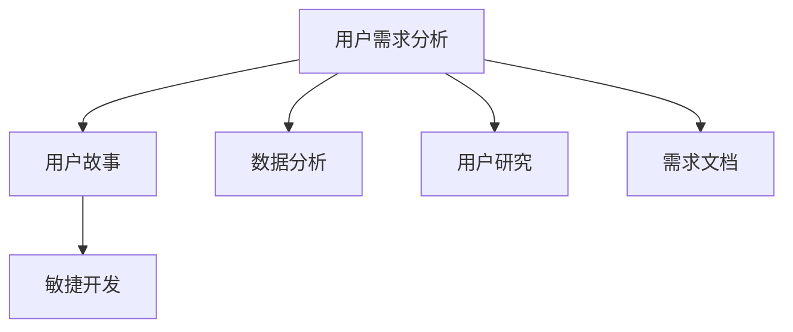

                 

# 如何进行有效的用户需求分析

在当今快速发展的科技世界中，高效的用户需求分析是产品开发成功的关键所在。然而，尽管市场上存在大量的用户需求分析工具和方法，但如何确保这些分析真正有效，却是业界的一大难题。本文将深入探讨如何进行有效的用户需求分析，提供全面的方法论和实践指南。

## 1. 背景介绍

### 1.1 问题由来
随着科技的不断进步，产品开发周期变得愈发紧张。在此背景下，如何准确、高效地获取和理解用户需求，成为摆在企业面前的一大挑战。用户需求分析失败不仅会导致产品功能缺失或冗余，还可能导致资源浪费和用户满意度下降。因此，高效的用户需求分析对企业具有至关重要的意义。

### 1.2 问题核心关键点
用户需求分析的核心关键点包括：
- 如何通过有效的方法获取用户需求。
- 如何准确理解用户需求的真实含义。
- 如何将用户需求转化为可实现的产品功能。
- 如何在需求变化时进行灵活应对。

### 1.3 问题研究意义
有效用户需求分析可以帮助企业提升产品成功率，避免资源浪费，增强用户满意度，并在竞争激烈的市场中脱颖而出。

## 2. 核心概念与联系

### 2.1 核心概念概述

为更好地理解如何进行有效的用户需求分析，本节将介绍几个密切相关的核心概念：

- **用户需求分析**：通过与用户沟通和数据分析，了解用户真实需求的过程。
- **用户故事**：以用户视角描述系统功能和流程的故事，帮助团队更好地理解用户需求。
- **敏捷开发**：一种迭代、灵活的开发方法，通过快速迭代验证和调整需求，提高产品开发效率。
- **数据分析**：通过统计和数据挖掘技术，发现用户行为和偏好的规律，为需求分析提供数据支撑。
- **用户研究**：通过问卷调查、用户访谈、观察实验等方法，深入了解用户行为和心理，提取真实需求。
- **需求文档**：记录和定义产品需求，包括功能需求、非功能需求、优先级等信息。

这些核心概念之间的逻辑关系可以通过以下Mermaid流程图来展示：



这个流程图展示了用户需求分析的主要流程和关键步骤：

1. 通过用户故事理解用户需求。
2. 结合敏捷开发方法，快速迭代验证和调整需求。
3. 借助数据分析工具，深入挖掘用户行为规律。
4. 通过用户研究方法，获取用户真实需求。
5. 最终将需求文档化，为后续开发提供依据。

这些概念共同构成了用户需求分析的核心框架，使其能够在复杂多变的市场环境中持续优化和迭代。

## 3. 核心算法原理 & 具体操作步骤
### 3.1 算法原理概述

用户需求分析的本质是通过数据分析和用户研究，发现和验证用户真实需求。其核心算法原理包括数据挖掘、统计分析、自然语言处理等技术，以帮助团队更好地理解用户行为和心理，并将需求转化为可实现的产品功能。

### 3.2 算法步骤详解

用户需求分析的详细步骤包括以下几个关键步骤：

**Step 1: 数据收集**
- 通过问卷调查、用户访谈、观察实验等方式收集用户数据。
- 确保数据质量，去除噪音和异常数据。

**Step 2: 数据分析**
- 使用统计分析和数据挖掘技术，提取用户行为和偏好的规律。
- 应用聚类、分类、关联规则等算法，发现数据中的模式和趋势。

**Step 3: 用户研究**
- 设计用户研究方法，包括问卷调查、深度访谈、焦点小组等。
- 深入了解用户行为和心理，提取用户真实需求。

**Step 4: 需求定义**
- 根据用户研究结果，定义需求文档，包括功能需求、非功能需求、优先级等。
- 使用用户故事、用例图、原型等工具，帮助团队理解和实现需求。

**Step 5: 需求验证**
- 使用原型和最小可行产品(MVP)，在真实用户环境中验证需求。
- 收集用户反馈，不断调整和优化需求文档。

### 3.3 算法优缺点

用户需求分析的优势在于：
- 确保产品功能满足用户真实需求，提升用户满意度。
- 通过数据分析和用户研究，发现隐性需求，避免功能缺失。
- 结合敏捷开发方法，快速迭代验证和调整需求，提高开发效率。

其缺点主要包括：
- 数据收集和分析成本较高，需要大量资源投入。
- 用户研究过程中可能存在偏差，影响结果的准确性。
- 需求定义和验证过程复杂，需要团队密切配合。

尽管存在这些缺点，但就目前而言，用户需求分析仍是企业产品开发不可或缺的关键环节。未来相关研究的重点在于如何降低需求分析的成本，提高数据的准确性和处理效率。

### 3.4 算法应用领域

用户需求分析广泛应用于各行各业的产品开发过程中，例如：

- **互联网应用**：社交媒体、电商网站、在线教育平台等。
- **医疗健康**：电子病历系统、健康管理应用等。
- **智能家居**：智能音箱、智能家电、智慧城市等。
- **金融科技**：银行APP、保险产品、理财工具等。
- **汽车行业**：自动驾驶系统、车载信息娱乐系统等。

以上领域均需要大量的用户需求分析工作，以确保产品功能的符合用户预期和市场需求。

## 4. 数学模型和公式 & 详细讲解  
### 4.1 数学模型构建

用户需求分析的数学模型通常包括用户行为模型、用户心理模型等，用以描述用户需求和行为规律。

- **用户行为模型**：通过统计分析和数据挖掘技术，建立用户行为模式。常用的数学模型包括K-Means聚类、决策树、关联规则等。
- **用户心理模型**：通过自然语言处理技术，分析用户反馈和评论，提取用户情感和需求。常用的数学模型包括情感分析、主题模型等。

### 4.2 公式推导过程

以情感分析为例，其核心公式为：

$$
\text{情感得分} = \sum_{i=1}^n (w_i \times \text{情感强度}_i)
$$

其中，$w_i$ 表示第 $i$ 个情感词的权重，$\text{情感强度}_i$ 表示第 $i$ 个情感词的情感极性（如正向、负向、中性）。通过统计每个情感词的情感得分，可以得到文本的情感倾向。

### 4.3 案例分析与讲解

以电商网站的用户需求分析为例，可以通过以下步骤进行：

1. **数据收集**：通过问卷调查、用户访谈等方式收集用户数据，如购买记录、评价、反馈等。
2. **数据分析**：使用K-Means聚类算法，将用户分为不同群体，并分析其购买行为和偏好。
3. **用户研究**：通过焦点小组讨论，了解不同群体的需求和期望。
4. **需求定义**：根据用户研究结果，定义需求文档，包括推荐算法、个性化功能、用户界面等。
5. **需求验证**：使用原型和MVP，在真实用户环境中验证需求，收集反馈，不断优化产品功能。

## 5. 项目实践：代码实例和详细解释说明
### 5.1 开发环境搭建

在进行用户需求分析项目实践前，我们需要准备好开发环境。以下是使用Python进行数据分析和用户研究的环境配置流程：

1. 安装Anaconda：从官网下载并安装Anaconda，用于创建独立的Python环境。

2. 创建并激活虚拟环境：
```bash
conda create -n user需求的虚拟环境 python=3.8 
conda activate user需求的虚拟环境
```

3. 安装相关依赖：
```bash
conda install pandas numpy matplotlib seaborn scikit-learn scikit-image nltk transformers tensorflow
```

4. 安装用户研究工具：
```bash
pip install surveyform surveypython
```

完成上述步骤后，即可在`user需求的虚拟环境`中开始用户需求分析的实践。

### 5.2 源代码详细实现

以下是使用Python进行用户行为分析的代码实现示例：

```python
import pandas as pd
from sklearn.cluster import KMeans
from sklearn.feature_extraction.text import TfidfVectorizer

# 读取数据集
data = pd.read_csv('user_feedback.csv')

# 提取文本数据
texts = data['feedback'].tolist()

# 构建TF-IDF特征向量
vectorizer = TfidfVectorizer(stop_words='english')
X = vectorizer.fit_transform(texts)

# 使用K-Means聚类算法，将用户分为不同群体
kmeans = KMeans(n_clusters=5)
kmeans.fit(X.toarray())

# 输出聚类结果
print(kmeans.labels_)
```

在这个示例中，我们首先使用Pandas读取用户反馈数据集，然后提取文本数据，使用TF-IDF特征提取方法构建特征向量，最后使用K-Means算法将用户分为不同群体。

### 5.3 代码解读与分析

让我们再详细解读一下关键代码的实现细节：

**读取数据集**：
- 使用Pandas的`read_csv`方法读取CSV格式的用户反馈数据集。

**提取文本数据**：
- 将数据集中的'feedback'列转换为列表，用于后续的文本处理。

**构建TF-IDF特征向量**：
- 使用`TfidfVectorizer`将文本转换为TF-IDF特征向量。

**使用K-Means聚类算法**：
- 通过`KMeans`算法对特征向量进行聚类，将用户分为不同群体。

**输出聚类结果**：
- 打印出每个用户的聚类标签，用于后续的用户研究。

可以看到，使用Python和相关库进行用户行为分析，可以大大简化数据分析的流程，提高效率。

## 6. 实际应用场景
### 6.1 智能家居系统

智能家居系统通过用户行为数据分析，可以实现个性化智能控制。例如，通过对用户的生活习惯、行为偏好进行分析，智能家居系统可以自动调整灯光亮度、温度等，提升用户的居住体验。

在技术实现上，可以收集用户的操作记录、传感器数据等，使用聚类算法分析用户行为模式，根据不同模式进行个性化控制。同时，结合用户访谈和问卷调查，进一步优化智能控制策略，确保用户满意度。

### 6.2 电商推荐系统

电商推荐系统通过用户行为数据分析，实现个性化推荐。例如，通过分析用户的购买历史、浏览记录、评价反馈等，电商平台可以为用户推荐最适合的商品，提升用户购买体验和满意度。

在技术实现上，可以收集用户的行为数据，使用关联规则算法发现用户行为模式，结合自然语言处理技术分析用户评论和反馈，构建用户画像，进行个性化推荐。同时，通过A/B测试等方式，验证推荐效果，不断优化推荐算法。

### 6.3 金融理财服务

金融理财服务通过用户行为数据分析，实现个性化理财建议。例如，通过分析用户的财务状况、投资偏好、风险承受能力等，金融机构可以为用户提供个性化的理财方案，提升用户的理财体验和满意度。

在技术实现上，可以收集用户的财务数据、投资记录、行为偏好等，使用聚类算法分析用户群体的理财需求，结合用户访谈和问卷调查，进一步优化理财方案，确保用户满意。

### 6.4 未来应用展望

随着用户需求分析技术的不断进步，未来将出现更多创新应用，为用户带来更多便捷和价值。

在智慧医疗领域，通过用户行为和心理数据分析，构建个性化的健康管理方案，提升用户健康水平和生活质量。

在智能交通领域，通过分析用户的出行习惯和行为模式，优化交通规划和服务，提升用户的出行体验。

在社交媒体领域，通过分析用户的互动行为和情感倾向，提供更加个性化的内容推荐，提升用户的社交体验。

这些应用场景展示了用户需求分析的巨大潜力，预示着未来用户需求分析技术的广泛应用和深刻影响。

## 7. 工具和资源推荐
### 7.1 学习资源推荐

为了帮助开发者系统掌握用户需求分析的理论基础和实践技巧，这里推荐一些优质的学习资源：

1. 《用户需求分析：从用户到产品》系列书籍：系统介绍了用户需求分析的理论和方法，提供实战案例和工具推荐。
2. 《敏捷开发实践指南》：介绍了敏捷开发的基本原理和方法，帮助团队在需求分析和产品开发中高效协同。
3. 《数据分析入门与实践》：详细讲解了数据分析的常用技术和工具，包括数据收集、数据清洗、数据可视化等。
4. 《用户研究方法与实践》：介绍了用户研究的常用方法和工具，包括问卷调查、用户访谈、焦点小组等。
5. 《需求分析与项目管理》：介绍了需求分析的基本方法和工具，帮助产品经理更好地理解用户需求。

通过对这些资源的学习实践，相信你一定能够快速掌握用户需求分析的精髓，并用于解决实际的用户需求问题。

### 7.2 开发工具推荐

高效的开发离不开优秀的工具支持。以下是几款用于用户需求分析开发的常用工具：

1. Excel/Google Sheets：常用数据分析工具，支持多种统计分析和数据可视化功能。
2. Python和相关库（Pandas、NumPy、SciPy、Scikit-learn等）：强大的数据分析和机器学习工具，适合复杂数据分析和建模。
3. R语言：数据分析和统计建模的强大工具，拥有丰富的数据分析包（如ggplot2、dplyr等）。
4. Surveyform/SurveyPython：常用的在线和Python用户调研工具，方便收集和分析用户数据。
5. Qualtrics/Google Forms：高级用户调研平台，支持复杂调研设计和数据采集。
6. NVivo/Qvado：定性数据分析工具，支持文本挖掘和主题分析。

合理利用这些工具，可以显著提升用户需求分析的开发效率，加快创新迭代的步伐。

### 7.3 相关论文推荐

用户需求分析技术的发展源于学界的持续研究。以下是几篇奠基性的相关论文，推荐阅读：

1. How to Conduct a User Research: The Ultimate Guide：介绍了如何进行用户研究的经典方法论，详细讲解了问卷调查、用户访谈等技术。
2. A Survey of Agile Methods in Requirements Engineering：综述了敏捷开发方法在需求分析中的应用，介绍了敏捷开发的基本原理和实践经验。
3. Sentiment Analysis：Evaluation of an Approach：介绍了情感分析的基本原理和常用方法，详细讲解了情感分析的数学模型和技术实现。
4. User Behavior Clustering for Personalized Recommendations in Online Collaborative Platforms：研究了用户行为聚类方法在个性化推荐中的应用，详细讲解了用户行为建模的数学模型和技术实现。
5. Customer Lifetime Value (CLV) for Predictive Analytics：介绍了客户生命周期价值（CLV）的基本概念和方法，详细讲解了CLV在需求分析中的应用。

这些论文代表了大规模用户需求分析技术的发展脉络。通过学习这些前沿成果，可以帮助研究者把握学科前进方向，激发更多的创新灵感。

## 8. 总结：未来发展趋势与挑战

### 8.1 总结

本文对用户需求分析进行了全面系统的介绍。首先阐述了用户需求分析的背景和重要性，明确了用户需求分析在产品开发中的关键作用。其次，从原理到实践，详细讲解了用户需求分析的数学模型和关键步骤，给出了用户需求分析的完整代码实例。同时，本文还广泛探讨了用户需求分析在多个行业领域的应用前景，展示了用户需求分析技术的巨大潜力。

通过本文的系统梳理，可以看到，用户需求分析在复杂多变的市场环境中具有广泛的应用价值。这些分析方法不仅能够帮助企业准确理解用户需求，还能在用户反馈的基础上不断优化产品功能，提升用户满意度，从而增强企业在竞争中的优势。

### 8.2 未来发展趋势

展望未来，用户需求分析技术将呈现以下几个发展趋势：

1. **数据集成与融合**：未来用户需求分析将更加注重多源数据的集成与融合，结合多种数据来源（如传感器数据、社交媒体数据、交易数据等），提升分析的全面性和准确性。
2. **智能化与自动化**：结合人工智能技术（如机器学习、深度学习），提升需求分析的智能化水平，自动发现用户需求和行为模式。
3. **实时性与动态性**：随着用户行为和市场的不断变化，用户需求分析需要具备实时性和动态性，能够快速响应和调整需求。
4. **用户参与与共创**：通过用户参与和共创模式，提升用户需求的透明度和准确性，使产品开发更加符合用户期望。
5. **多模态分析**：结合多种数据模态（如文本、图像、声音、视频等），进行综合分析，提升用户需求分析的全面性和深度。

这些趋势展示了用户需求分析技术的广阔前景，预示着未来用户需求分析技术将更加智能、全面和高效。

### 8.3 面临的挑战

尽管用户需求分析技术已经取得了一定的进展，但在迈向更加智能化、普适化应用的过程中，仍面临诸多挑战：

1. **数据隐私与安全性**：用户数据隐私和安全性问题亟待解决，如何在获取用户数据的同时保护用户隐私，成为需求分析的重要挑战。
2. **数据质量和处理效率**：大量数据的存在和多样性，对数据质量和处理效率提出了更高的要求，如何在保证数据准确性的前提下，提升处理效率，是一个重要的研究方向。
3. **跨部门协作**：需求分析涉及多个部门和团队，如何在跨部门协作中高效沟通和协同，是一个重要的管理挑战。
4. **用户需求的多样性和复杂性**：用户需求的多样性和复杂性，使得需求分析变得更加困难，如何在多样化的需求中提炼出共性需求，是一个重要的技术挑战。
5. **模型的可解释性与透明性**：用户需求分析模型的可解释性和透明性问题，如何在保护用户隐私的前提下，提供可解释的需求分析结果，是一个重要的伦理挑战。

正视用户需求分析面临的这些挑战，积极应对并寻求突破，将是大规模用户需求分析技术走向成熟的必由之路。相信随着学界和产业界的共同努力，这些挑战终将一一被克服，用户需求分析技术必将在构建人机协同的智能时代中扮演越来越重要的角色。

### 8.4 未来突破

面对用户需求分析所面临的种种挑战，未来的研究需要在以下几个方面寻求新的突破：

1. **数据隐私保护**：引入区块链、同态加密等技术，保护用户数据隐私，确保数据处理的安全性。
2. **高效数据处理**：结合分布式计算和流计算技术，提升数据处理的效率和实时性。
3. **跨部门协同**：引入协同工作平台和工具，促进跨部门协作，提升需求分析的效率和准确性。
4. **多源数据融合**：引入多种数据融合技术，提升数据的多源性和全面性。
5. **需求模型的可解释性**：引入可解释性技术，提升需求模型的透明性和可信度。
6. **用户需求理解与生成**：结合知识图谱、自然语言处理等技术，提升用户需求的理解能力和生成能力。

这些研究方向的探索，必将引领用户需求分析技术迈向更高的台阶，为构建安全、可靠、可解释、可控的智能系统铺平道路。面向未来，用户需求分析技术还需要与其他人工智能技术进行更深入的融合，如知识表示、因果推理、强化学习等，多路径协同发力，共同推动自然语言理解和智能交互系统的进步。只有勇于创新、敢于突破，才能不断拓展用户需求分析的边界，让智能技术更好地造福人类社会。

## 9. 附录：常见问题与解答

**Q1：用户需求分析的常见方法有哪些？**

A: 用户需求分析的常见方法包括问卷调查、用户访谈、焦点小组、用户行为分析、情感分析等。

**Q2：用户行为分析中常用的数学模型有哪些？**

A: 用户行为分析中常用的数学模型包括K-Means聚类、决策树、关联规则、用户画像、情感分析等。

**Q3：用户需求分析中需要注意哪些关键问题？**

A: 用户需求分析中需要注意的关键问题包括数据的隐私与安全、数据的全面性与准确性、用户需求的动态性与多样性、跨部门协作的效率与沟通、需求模型的可解释性与透明性等。

**Q4：如何提升用户需求分析的效率与准确性？**

A: 提升用户需求分析的效率与准确性，可以从以下几个方面入手：
1. 结合多种数据来源，提升数据的多源性与全面性。
2. 引入智能化与自动化技术，提升需求分析的智能化水平。
3. 引入协同工作平台和工具，提升跨部门协作的效率与沟通。
4. 引入可解释性技术，提升需求模型的透明性与可信度。

**Q5：用户需求分析的实施步骤有哪些？**

A: 用户需求分析的实施步骤包括数据收集、数据分析、用户研究、需求定义、需求验证等。

通过这些问题的解答，可以看到用户需求分析在实践中需要综合考虑多个因素，确保其准确性和高效性。

---

作者：禅与计算机程序设计艺术 / Zen and the Art of Computer Programming

