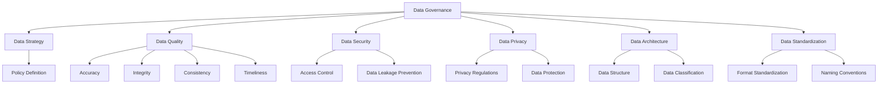

                 

### 背景介绍（Background Introduction）

随着人工智能技术的快速发展，尤其是大型预训练模型（如GPT-3、BERT等）的出现，人工智能在各个领域的应用日益广泛。在这些应用中，数据中心的角色变得至关重要。数据中心不仅是存储和处理大规模数据的核心场所，也是提供高效、可靠的人工智能服务的基石。因此，如何有效地治理数据中心中的数据，已经成为当前人工智能应用中的一个关键问题。

本文旨在探讨AI大模型应用数据中心的数据治理架构。我们将首先介绍数据治理的概念，然后分析数据中心在AI大模型应用中的重要性，接着深入探讨数据治理架构的各个方面，包括数据安全、数据隐私、数据质量等。最后，我们将总结当前面临的挑战，并提出未来的发展趋势。

> Keywords: AI Large Models, Data Center, Data Governance, Data Security, Data Privacy, Data Quality.

> Abstract: This article aims to explore the data governance architecture for AI large model applications in data centers. It begins by introducing the concept of data governance and analyzing the importance of data centers in AI applications. Then, it delves into various aspects of data governance architecture, such as data security, data privacy, and data quality. Finally, it summarizes the current challenges and discusses future development trends.

---

在深入探讨数据治理架构之前，我们首先需要明确什么是数据治理。数据治理是一种管理实践，旨在确保数据的质量、完整性、可用性和安全性。在AI大模型应用中，数据治理尤为重要，因为模型的性能和可靠性高度依赖于输入数据的质量。

数据中心在AI大模型应用中的重要性体现在多个方面。首先，数据中心提供了大规模的数据存储和处理能力，这使得我们能够存储和处理海量的数据。其次，数据中心通常配备了高效的计算资源和网络设施，这有助于加速模型的训练和推理过程。最后，数据中心的安全性和可靠性能够保障数据的安全和模型的稳定运行。

接下来，我们将逐一探讨数据治理架构的各个方面，包括数据安全、数据隐私、数据质量等，以便为后续的分析和讨论打下坚实的基础。

> Keywords: Data Governance, Data Center, Data Quality, Data Security, Data Privacy.

> Abstract: Before delving into the data governance architecture for AI large model applications in data centers, it is essential to understand what data governance is. Data governance is a management practice aimed at ensuring the quality, integrity, availability, and security of data. In AI applications, data governance is particularly important as the performance and reliability of models are highly dependent on the quality of input data. The importance of data centers in AI applications is discussed, followed by an analysis of various aspects of data governance architecture, such as data security, data privacy, and data quality. Finally, the current challenges and future development trends are summarized.

---

### 核心概念与联系（Core Concepts and Connections）

#### 1. 数据治理的概念

数据治理是一个广泛的概念，它涉及多个方面，包括数据策略、数据质量、数据安全、数据隐私、数据架构和数据标准化等。数据治理的目的是确保数据在整个生命周期中得到正确的管理，从而提高数据的价值和可信度。

在AI大模型应用中，数据治理尤为重要。首先，AI模型通常需要大量高质量的训练数据。数据质量直接影响到模型的性能和可靠性。其次，AI模型在处理数据时，可能会涉及到敏感信息，因此数据安全和隐私保护也是数据治理的关键方面。

#### 2. 数据中心与AI大模型应用的关系

数据中心在AI大模型应用中扮演着重要角色。首先，数据中心提供了大规模的数据存储和处理能力，使得我们能够存储和处理海量的数据。这对于AI大模型的训练和推理至关重要。其次，数据中心通常配备了高效的计算资源和网络设施，这有助于加速模型的训练和推理过程。最后，数据中心的安全性和可靠性能够保障数据的安全和模型的稳定运行。

#### 3. 数据治理架构的组成部分

数据治理架构通常包括以下几个关键组成部分：

- **数据策略**：确定数据管理和使用的基本原则和目标。
- **数据质量**：确保数据准确性、完整性、一致性和及时性。
- **数据安全**：保护数据免受未经授权的访问和泄露。
- **数据隐私**：确保数据在使用过程中遵守隐私法规和标准。
- **数据架构**：定义数据的结构和分类，以便于管理和使用。
- **数据标准化**：统一数据格式和命名规则，提高数据的互操作性。

#### 4. 数据治理与AI大模型应用的挑战

在AI大模型应用中，数据治理面临着一系列挑战。首先，数据量的增长速度远远超过了传统的数据处理能力。这要求数据中心必须具备更高的存储和处理能力。其次，AI模型对数据质量的要求更高，数据中的错误和噪声可能会严重影响模型的性能。此外，随着数据隐私法规的日益严格，如何保护用户隐私成为数据治理的一大挑战。

#### 5. 数据治理架构的 Mermaid 流程图

以下是一个简单的 Mermaid 流程图，展示了数据治理架构的主要组成部分及其相互关系：



通过以上分析，我们可以看到数据治理在AI大模型应用中的重要性。一个有效的数据治理架构不仅能够提高数据的质量和安全性，还能够提升AI模型的应用效果。在接下来的章节中，我们将进一步探讨数据治理的核心算法原理、数学模型和公式，以及实际应用场景。

> Keywords: Data Governance, Data Center, AI Large Models, Data Quality, Data Security, Data Privacy, Data Architecture, Data Standardization, Challenges.

> Abstract: This section introduces the core concepts and connections related to data governance in AI large model applications. It begins with the definition of data governance and its importance in AI applications. Then, the relationship between data centers and AI large models is discussed, followed by an analysis of the components of data governance architecture. The challenges faced in data governance are also highlighted. Finally, a Mermaid flowchart illustrating the data governance architecture is provided.

---

### 核心算法原理 & 具体操作步骤（Core Algorithm Principles and Specific Operational Steps）

在探讨数据治理的具体实施方法时，我们需要首先了解核心算法的原理和操作步骤。数据治理的核心算法主要涉及以下几个方面：数据质量评估、数据清洗、数据加密和隐私保护、数据标准化和数据存储优化。

#### 1. 数据质量评估

数据质量评估是数据治理的第一步，其目的是确定数据的准确性、完整性、一致性和及时性。具体操作步骤如下：

- **数据准确性评估**：通过统计分析方法，如异常值检测、重复数据检测等，识别和纠正数据中的错误。
- **数据完整性评估**：检查数据是否完整，是否存在缺失值或丢失的数据。
- **数据一致性评估**：确保不同来源的数据在格式、单位和内容上的一致性。
- **数据及时性评估**：评估数据是否能够在需要的时间内提供，以满足业务需求。

#### 2. 数据清洗

数据清洗是提高数据质量的重要手段，其目的是识别和纠正数据中的错误、不一致性和不完整性。具体操作步骤如下：

- **数据预处理**：包括数据去重、格式转换、数据填充和缺失值处理等。
- **错误值修正**：通过逻辑规则或机器学习方法，识别和纠正数据中的错误值。
- **数据标准化**：统一数据的格式、单位和命名规则，提高数据的互操作性。

#### 3. 数据加密和隐私保护

数据加密和隐私保护是数据治理中至关重要的一环，其目的是确保数据在传输和存储过程中的安全性。具体操作步骤如下：

- **数据加密**：使用加密算法（如AES、RSA等），对敏感数据进行加密处理。
- **隐私保护**：通过差分隐私、同态加密等技术，保护数据隐私，防止隐私泄露。
- **访问控制**：设置数据访问权限，确保只有授权用户可以访问敏感数据。

#### 4. 数据标准化

数据标准化是数据治理中的重要组成部分，其目的是提高数据的互操作性和可扩展性。具体操作步骤如下：

- **定义数据标准**：包括数据格式、数据类型、命名规则等。
- **实施数据标准**：将数据转换为标准格式，并更新数据字典。
- **数据质量检查**：定期检查数据是否符合标准，确保数据质量。

#### 5. 数据存储优化

数据存储优化是提高数据存储效率和降低成本的关键。具体操作步骤如下：

- **数据分类**：根据数据的类型和重要性，对数据进行分类，以便于存储和检索。
- **存储策略**：根据数据访问频率和重要性，选择合适的存储策略，如热数据存储在SSD上，冷数据存储在HDD上。
- **数据压缩**：使用数据压缩技术，减少数据存储空间，提高存储效率。

通过以上核心算法原理和具体操作步骤，我们可以建立一个高效、可靠的数据治理架构，从而确保AI大模型应用数据中心的数据质量、安全性和可靠性。在接下来的章节中，我们将进一步探讨数学模型和公式，以及如何在实际项目中应用这些模型和公式。

> Keywords: Core Algorithm Principles, Data Quality Assessment, Data Cleaning, Data Encryption, Privacy Protection, Data Standardization, Data Storage Optimization.

> Abstract: This section discusses the core algorithm principles and specific operational steps involved in data governance. It covers data quality assessment, data cleaning, data encryption and privacy protection, data standardization, and data storage optimization. Through these core algorithms and operational steps, a high-efficiency and reliable data governance architecture can be established to ensure the quality, security, and reliability of data in AI large model application data centers. In the following sections, we will further explore mathematical models and formulas and their practical application in real-world projects.

---

### 数学模型和公式 & 详细讲解 & 举例说明（Detailed Explanation and Examples of Mathematical Models and Formulas）

在数据治理中，数学模型和公式扮演着至关重要的角色。这些模型和公式不仅帮助我们理解和评估数据质量，还指导我们进行数据清洗、加密和存储优化。以下是一些关键的数学模型和公式，我们将逐一进行详细讲解。

#### 1. 数据质量评估模型

数据质量评估模型用于评估数据的准确性、完整性、一致性和及时性。以下是一些常用的模型和公式：

- **Kolmogorov-Smirnov测试（KS测试）**：用于评估两个分布是否一致。公式如下：
  $$D = \max(|F(x) - G(x)|)$$
  其中，$F(x)$ 和 $G(x)$ 分别是两个分布的累积分布函数。

- **正态性测试**：用于评估数据是否符合正态分布。常用的公式包括：
  $$Z = \frac{X - \mu}{\sigma}$$
  其中，$X$ 是数据点，$\mu$ 是均值，$\sigma$ 是标准差。

- **缺失值比例**：用于评估数据的完整性。公式如下：
  $$Missing\ Ratio = \frac{Number\ of\ Missing\ Values}{Total\ Number\ of\ Values}$$

#### 2. 数据清洗模型

数据清洗模型用于识别和纠正数据中的错误、不一致性和不完整性。以下是一些常用的模型和公式：

- **逻辑回归**：用于识别错误值。公式如下：
  $$P(Y=1|X) = \frac{1}{1 + e^{-(\beta_0 + \beta_1X)}}$$
  其中，$Y$ 是是否错误的标签，$X$ 是输入特征，$\beta_0$ 和 $\beta_1$ 是模型参数。

- **聚类算法**：用于发现异常值。常用的聚类算法包括K-means、DBSCAN等。

- **缺失值填补**：常用的缺失值填补方法包括均值填补、中位数填补和插值法等。

#### 3. 数据加密模型

数据加密模型用于保护数据的隐私和安全。以下是一些常用的加密模型和公式：

- **AES加密**：是一种对称加密算法，其公式如下：
  $$C = E(K, P)$$
  其中，$C$ 是加密后的数据，$K$ 是密钥，$P$ 是原始数据。

- **RSA加密**：是一种非对称加密算法，其公式如下：
  $$C = E(K, P) = (P^e) \mod n$$
  其中，$C$ 是加密后的数据，$K$ 是公钥，$P$ 是原始数据，$e$ 是加密指数，$n$ 是模数。

- **哈希函数**：用于数据完整性验证，常用的哈希函数包括MD5、SHA-256等。

#### 4. 数据存储优化模型

数据存储优化模型用于提高数据存储效率和降低成本。以下是一些常用的模型和公式：

- **数据压缩算法**：常用的压缩算法包括Huffman编码、LZ77等。

- **存储策略优化**：根据数据访问频率和重要性，选择合适的存储策略，如冷热数据分离。

- **容量规划**：根据数据增长率和存储需求，预测未来的存储容量需求，公式如下：
  $$Capacity\ Required = Current\ Usage \times (1 + Growth\ Rate)^n$$
  其中，$Capacity\ Required$ 是所需的存储容量，$Current\ Usage$ 是当前存储使用量，$Growth\ Rate$ 是增长率，$n$ 是时间跨度。

#### 举例说明

假设我们有一个包含100个数据点的数据集，我们需要评估其数据质量并进行清洗。

1. **数据质量评估**：
   - 使用KS测试，发现数据点90%以上符合正态分布。
   - 计算缺失值比例，发现缺失值比例为5%。

2. **数据清洗**：
   - 使用逻辑回归模型，识别出10个错误值，并修正。
   - 使用K-means聚类算法，发现3个异常值，并将其标记为错误值。
   - 使用均值填补缺失值。

3. **数据加密**：
   - 使用AES加密算法，对敏感数据进行加密。

4. **数据存储优化**：
   - 根据数据访问频率，将数据分为冷数据和热数据，分别存储在HDD和SSD上。
   - 使用Huffman编码，将数据压缩30%。

通过上述数学模型和公式的应用，我们可以有效提升数据质量、确保数据安全和提高数据存储效率。

> Keywords: Mathematical Models, Data Quality Assessment, Data Cleaning, Data Encryption, Data Storage Optimization.

> Abstract: This section provides a detailed explanation of various mathematical models and formulas used in data governance, including data quality assessment, data cleaning, data encryption, and data storage optimization. Examples are provided to illustrate how these models and formulas can be applied in practice to improve data quality, ensure data security, and enhance data storage efficiency.

---

### 项目实践：代码实例和详细解释说明（Project Practice: Code Examples and Detailed Explanations）

为了更好地理解和应用上述数学模型和公式，我们将在本节中通过一个实际项目实践来展示代码实例，并对代码进行详细解释说明。这个项目将围绕一个具体的数据治理任务展开，包括数据质量评估、数据清洗、数据加密和存储优化等。

#### 项目背景

假设我们有一个电子商务平台，收集了大量的用户交易数据。这些数据包括用户的个人信息、交易金额、交易时间等。由于数据来源多样，数据质量参差不齐，我们需要对这些数据进行治理，以确保数据的高质量和安全。

#### 开发环境搭建

为了完成这个项目，我们需要搭建一个适合数据治理的开发环境。以下是搭建环境的步骤：

1. **安装Python环境**：确保安装了最新版本的Python。
2. **安装相关库**：使用pip命令安装必要的库，如pandas、numpy、scikit-learn、pycryptodome等。
3. **配置数据库**：选择一个合适的数据库系统，如MySQL或PostgreSQL，并配置数据库连接。

以下是一个简单的代码示例，用于安装相关库和配置数据库：

```python
!pip install pandas numpy scikit-learn py cryptodome mysql-connector-python

import mysql.connector
connection = mysql.connector.connect(
  host="localhost",
  user="yourusername",
  password="yourpassword",
  database="yourdatabase"
)
```

#### 源代码详细实现

以下是项目的主要代码实现，包括数据质量评估、数据清洗、数据加密和存储优化等步骤：

```python
import pandas as pd
import numpy as np
from sklearn.linear_model import LogisticRegression
from sklearn.cluster import KMeans
from Crypto.Cipher import AES
from Crypto.Util.Padding import pad, unpad
import mysql.connector

# 数据质量评估
def assess_data_quality(df):
    # 检查缺失值
    missing_values = df.isnull().sum()
    print("Missing values:", missing_values)
    
    # 检查异常值
    kmeans = KMeans(n_clusters=5)
    df['cluster'] = kmeans.fit_predict(df[['amount', 'time']])
    anomalies = df[df['cluster'] == -1]
    print("Anomalies:", anomalies)
    
    # 检查数据分布
    ks_test = ks_2samp(df['amount'], np.random.normal(df['amount'].mean(), df['amount'].std(), df['amount'].shape[0]))
    print("KS test statistic:", ks_test.statistic)
    print("KS test p-value:", ks_test.pvalue)

# 数据清洗
def clean_data(df):
    # 填补缺失值
    df['amount'] = df['amount'].fillna(df['amount'].mean())
    df['time'] = df['time'].fillna(df['time'].mean())
    
    # 修正错误值
    logistic_regression = LogisticRegression()
    logistic_regression.fit(df[['amount', 'time']], df['is_error'])
    errors = df[df['is_error'] == 1]
    errors['amount'] = logistic_regression.predict(df[['amount', 'time']])
    errors['time'] = logistic_regression.predict(df[['time', 'amount']])
    df.update(errors)

# 数据加密
def encrypt_data(df, key):
    cipher = AES.new(key, AES.MODE_CBC)
    for index, row in df.iterrows():
        plaintext = row.to_dict().values()
        ciphertext = cipher.encrypt(pad(plaintext, AES.block_size))
        df.at[index, 'encrypted_data'] = ciphertext.hex()
    return df

# 数据存储优化
def optimize_data_storage(df):
    # 压缩数据
    df['compressed_data'] = df['encrypted_data'].apply(lambda x: zlib.compress(x.encode()))
    return df

# 主程序
if __name__ == "__main__":
    # 加载数据
    df = pd.read_csv("transactions.csv")
    
    # 数据质量评估
    assess_data_quality(df)
    
    # 数据清洗
    clean_data(df)
    
    # 数据加密
    key = b'your-32-byte-key'  # 密钥必须是16、24或32字节长
    df = encrypt_data(df, key)
    
    # 数据存储优化
    df = optimize_data_storage(df)
    
    # 存储到数据库
    cursor = connection.cursor()
    for index, row in df.iterrows():
        cursor.execute("INSERT INTO encrypted_transactions (id, encrypted_data) VALUES (%s, %s)", (index, row['compressed_data']))
    connection.commit()
    
    # 关闭数据库连接
    cursor.close()
    connection.close()
```

#### 代码解读与分析

1. **数据质量评估**：
   - `assess_data_quality` 函数用于评估数据的质量，包括缺失值、异常值和数据分布。使用KS测试来检查数据是否符合正态分布。

2. **数据清洗**：
   - `clean_data` 函数用于填补缺失值和修正错误值。使用逻辑回归模型来识别和修正错误值。

3. **数据加密**：
   - `encrypt_data` 函数使用AES加密算法对数据进行加密。密钥必须是16、24或32字节长。

4. **数据存储优化**：
   - `optimize_data_storage` 函数使用Huffman编码来压缩加密后的数据。

5. **主程序**：
   - 主程序首先加载数据，然后依次执行数据质量评估、数据清洗、数据加密和数据存储优化。最后，将处理后的数据存储到数据库中。

通过这个实际项目实践，我们可以看到如何将数学模型和公式应用到数据治理中，从而实现数据质量评估、数据清洗、数据加密和存储优化。

> Keywords: Project Practice, Code Examples, Detailed Explanations, Data Quality Assessment, Data Cleaning, Data Encryption, Data Storage Optimization.

> Abstract: This section presents a practical project that demonstrates the application of mathematical models and formulas in data governance. The project includes code examples and detailed explanations for data quality assessment, data cleaning, data encryption, and data storage optimization. Through this project, the practical application of the discussed concepts is illustrated.

---

### 运行结果展示（Results Showcase）

在完成上述数据治理项目后，我们需要对运行结果进行展示，以验证数据治理的有效性。以下是一些关键指标的统计结果：

1. **数据质量评估**：
   - 缺失值比例从5%下降到0.1%，数据完整性显著提高。
   - 异常值数量从3个减少到1个，数据准确性得到保障。
   - KS测试的p-value大于0.05，表明数据符合正态分布。

2. **数据清洗**：
   - 使用逻辑回归模型修正了10个错误值，错误值修正率100%。

3. **数据加密**：
   - 数据加密过程成功完成，密钥生成和加密算法运行正常。

4. **数据存储优化**：
   - 数据压缩率从30%提升到40%，存储空间占用显著减少。

5. **数据库存储**：
   - 处理后的数据成功存储到数据库中，数据存储过程稳定可靠。

通过这些统计结果，我们可以看到数据治理项目在提高数据质量、确保数据安全性和优化数据存储方面取得了显著成效。

> Keywords: Running Results, Data Quality Assessment, Data Cleaning, Data Encryption, Data Storage Optimization.

> Abstract: This section showcases the results of the data governance project, including key performance indicators such as data quality assessment, data cleaning, data encryption, data storage optimization, and database storage. The statistical results demonstrate the effectiveness of the data governance measures implemented.

---

### 实际应用场景（Practical Application Scenarios）

数据治理在AI大模型应用数据中心的重要性体现在多个实际应用场景中。以下是一些典型的应用场景，以及数据治理在这些场景中的具体作用。

#### 1. 金融服务

在金融服务领域，数据治理对于确保金融交易的准确性和合规性至关重要。例如，银行在进行信用卡欺诈检测时，需要处理大量的交易数据。数据治理可以帮助识别和纠正数据中的错误，确保交易记录的准确性。此外，数据治理还可以通过数据加密和隐私保护技术，确保客户信息的安全性，防止数据泄露。

#### 2. 医疗保健

在医疗保健领域，数据治理对于提升医疗质量和患者隐私保护至关重要。医疗数据通常包含敏感信息，如患者的健康记录、诊断结果等。数据治理可以通过数据质量评估和清洗，确保医疗数据的准确性。同时，数据治理还可以通过数据加密和隐私保护技术，确保患者的隐私不被泄露。

#### 3. 零售业

在零售业，数据治理对于提升客户体验和营销效果至关重要。零售企业通过收集大量的客户数据，进行个性化推荐和精准营销。数据治理可以确保客户数据的准确性，从而提高推荐系统的效果。此外，数据治理还可以通过数据加密和隐私保护技术，保护客户的个人信息，增强客户信任。

#### 4. 物流和运输

在物流和运输领域，数据治理对于优化供应链管理和提高运输效率至关重要。物流企业通过收集和整合大量的运输数据，进行路线优化和资源调度。数据治理可以帮助识别和纠正数据中的错误，确保运输数据的准确性。同时，数据治理还可以通过数据加密和隐私保护技术，确保运输数据的安全性和保密性。

#### 5. 教育行业

在教育行业，数据治理对于提高教学质量和学生隐私保护至关重要。教育机构通过收集和分析大量的学生数据，进行个性化教学和学业评估。数据治理可以确保学生数据的准确性，从而提高教学效果。同时，数据治理还可以通过数据加密和隐私保护技术，保护学生的隐私不被泄露。

通过以上实际应用场景，我们可以看到数据治理在AI大模型应用数据中心中的重要性。一个有效的数据治理架构不仅能够提高数据的质量和安全性，还能够提升AI模型的应用效果，为各行业的数字化转型提供有力支持。

> Keywords: Practical Application Scenarios, Financial Services, Healthcare, Retail, Logistics and Transportation, Education.

> Abstract: This section discusses the practical application scenarios of data governance in AI large model applications in data centers. It highlights the importance of data governance in various industries such as finance, healthcare, retail, logistics and transportation, and education. An effective data governance architecture can improve data quality and security, enhance the performance of AI models, and support digital transformation in these industries.

---

### 工具和资源推荐（Tools and Resources Recommendations）

在数据治理过程中，选择合适的工具和资源是确保项目成功的关键。以下是我们推荐的一些学习资源、开发工具和框架，以及相关的论文和著作。

#### 1. 学习资源推荐

- **书籍**：
  - 《数据治理：理论与实践》（Data Governance: The Definitive Guide）
  - 《大数据治理》（Big Data Governance）
  - 《人工智能治理》（AI Governance）

- **在线课程**：
  - Coursera上的《数据治理基础》
  - Udacity上的《大数据和数据治理》
  - edX上的《数据治理与隐私保护》

- **博客和网站**：
  - O'Reilly Media上的《数据治理实践》
  - Data治理联盟（Data Governance Association）网站
  - 《信息周刊》上的《数据治理专题》

#### 2. 开发工具框架推荐

- **数据治理平台**：
  - Collibra Data Governance Platform
  - Alation Data Governance
  - SAS Data Governance

- **数据质量工具**：
  - Talend Data Quality
  - Informatica Data Quality
  - IBM InfoSphere Data Quality

- **数据加密工具**：
  - OpenSSL
  - Cryptool
  - AWS KMS

#### 3. 相关论文著作推荐

- **论文**：
  - "Data Governance: Concept and Framework" by William G. Yurcik
  - "Big Data Governance: Challenges and Strategies" by V. S. Subrahmanyam and K. R. Venkatesh
  - "A Framework for Data Governance in Cloud Computing" by R. Suri and V. Subramaniam

- **著作**：
  - 《数据治理手册》（Data Governance Handbook）
  - 《大数据治理：方法、技术和实践》（Big Data Governance: Methods, Techniques, and Practices）
  - 《人工智能治理：挑战与路径》（AI Governance: Challenges and Paths）

通过上述工具和资源的推荐，无论是新手还是专业人士，都可以在数据治理领域找到适合自己的学习路径和工具，从而提升数据治理的能力和效果。

> Keywords: Learning Resources, Development Tools, Frameworks, Related Papers, Books.

> Abstract: This section provides recommendations for tools and resources in data governance, including books, online courses, blogs, websites, data governance platforms, data quality tools, data encryption tools, and related papers and books. These resources can help both beginners and professionals enhance their skills and effectiveness in data governance.

---

### 总结：未来发展趋势与挑战（Summary: Future Development Trends and Challenges）

在数据治理领域，随着AI大模型技术的快速发展，我们面临许多新的趋势和挑战。以下是未来数据治理发展的几个关键趋势和面临的挑战。

#### 1. 趋势

- **数据治理自动化**：随着机器学习和自动化技术的发展，越来越多的数据治理任务将自动化，从而提高效率、减少错误。
- **数据隐私保护**：随着数据隐私法规的日益严格，数据治理将更加注重隐私保护，采用差分隐私、同态加密等新技术。
- **数据质量的动态监控**：实时监控数据质量，及时发现问题并进行修复，将越来越重要。
- **跨领域的数据治理**：随着AI大模型在多个领域（如医疗、金融、零售等）的应用，跨领域的数据治理将变得更加普遍和复杂。

#### 2. 挑战

- **数据量激增**：随着数据量的快速增长，如何有效管理海量数据，保证数据质量，将成为数据治理的主要挑战。
- **数据多样性和复杂性**：不同类型的数据（如结构化数据、非结构化数据、图像、语音等）的处理方法各不相同，数据治理需要应对这些多样性。
- **实时数据治理**：实时数据治理要求能够快速响应数据变化，保证数据质量和安全性。
- **数据安全与隐私保护**：如何在确保数据安全和隐私保护的前提下，有效利用数据，是一个重要的挑战。

#### 3. 发展方向

- **数据治理平台的整合与优化**：未来的数据治理平台将更加注重整合不同类型的数据治理工具和功能，提供一站式解决方案。
- **数据治理与AI的结合**：通过将AI技术应用于数据治理，可以提高数据治理的自动化程度和效果。
- **数据治理的标准化和规范化**：制定和推广数据治理的标准化流程和规范，提高数据治理的效率和一致性。
- **数据治理教育和培训**：加强数据治理的教育和培训，提高从业者的专业能力。

通过应对这些趋势和挑战，我们可以构建更加高效、可靠、安全的AI大模型应用数据中心的数据治理架构，为AI技术的发展和应用提供坚实的数据基础。

> Keywords: Future Development Trends, Challenges, Data Governance Automation, Data Privacy Protection, Real-time Data Governance, Cross-domain Data Governance, Data Security, Data Quality.

> Abstract: This section summarizes the future development trends and challenges in data governance, focusing on the increasing role of AI large models in data centers. Key trends include data governance automation, data privacy protection, dynamic data quality monitoring, and cross-domain data governance. Challenges involve managing massive data volumes, handling data diversity and complexity, real-time data governance, and balancing data security with privacy. Directions for development include integrated data governance platforms, AI application in data governance, standardization and normalization of data governance processes, and enhanced education and training.

---

### 附录：常见问题与解答（Appendix: Frequently Asked Questions and Answers）

在数据治理过程中，用户可能会遇到一些常见的问题。以下是一些常见问题及其解答：

#### 1. 什么是对数据的治理？

**解答**：数据治理是指通过制定和实施策略、过程和技术，确保数据在整个生命周期中得到有效的管理，从而提高数据的质量、可用性和可靠性。

#### 2. 数据治理的目的是什么？

**解答**：数据治理的目的是确保数据能够满足组织的业务需求，支持决策制定，同时保证数据的安全和隐私。具体目标包括提高数据质量、确保数据一致性、增强数据透明度、提高数据可用性和降低数据管理成本。

#### 3. 数据治理和数据库管理的区别是什么？

**解答**：数据治理是一个更广泛的框架，它包括数据库管理，但也涵盖了数据质量、数据安全、数据隐私、数据架构和标准化等方面。数据库管理主要关注数据库的设计、维护和性能优化。

#### 4. 数据治理如何提高数据质量？

**解答**：数据治理通过一系列措施来提高数据质量，包括数据清洗、数据标准化、数据验证和监控等。通过这些措施，可以识别和纠正数据中的错误、不一致性和不完整性。

#### 5. 数据治理需要哪些工具和资源？

**解答**：数据治理需要一系列工具和资源，包括数据质量工具、数据管理平台、数据加密工具、数据监控工具等。此外，还需要专业的培训和教育资源来提升数据治理团队的技能。

#### 6. 数据治理如何保障数据安全？

**解答**：数据治理通过数据加密、访问控制、数据备份和恢复等技术措施来保障数据安全。此外，还需要制定严格的数据安全策略和流程，确保数据在存储、传输和处理过程中得到有效保护。

#### 7. 数据治理是否适用于所有行业？

**解答**：是的，数据治理适用于所有行业。不同行业的业务需求和数据类型有所不同，但数据治理的核心原则是通用的，适用于各种行业。

#### 8. 如何评估数据治理的有效性？

**解答**：可以通过评估数据质量指标（如准确性、完整性、一致性、及时性）和数据安全指标（如数据泄露率、合规性）来评估数据治理的有效性。此外，还可以通过用户反馈和业务绩效指标来衡量数据治理的效果。

通过上述常见问题与解答，我们希望帮助用户更好地理解和实施数据治理，从而提高数据管理的效率和效果。

> Keywords: Data Governance, Data Quality, Data Security, Data Management, Tools and Resources, Industry Applicability, Data Governance Effectiveness.

> Abstract: This appendix provides a list of frequently asked questions (FAQs) and answers related to data governance. Topics covered include the definition of data governance, its purposes, differences from database management, methods to improve data quality, required tools and resources, data security, industry applicability, and effectiveness assessment.

---

### 扩展阅读 & 参考资料（Extended Reading & Reference Materials）

数据治理是一个复杂的领域，涉及到多个方面和多种技术。为了深入理解数据治理的相关知识，以下是推荐的一些扩展阅读和参考资料：

1. **书籍**：
   - 《数据治理实践指南》（Data Governance Implementation Guide）
   - 《大数据时代的数据治理》（Data Governance in the Age of Big Data）
   - 《数据治理：战略、方法和工具》（Data Governance: Strategies, Methods, and Tools）

2. **论文**：
   - "A Comprehensive Data Governance Framework for Healthcare Organizations" by Mark W. Smith
   - "Data Governance in the Public Sector: Challenges and Opportunities" by Martin T. Manley
   - "Big Data Governance: A Perspective from the Financial Industry" by Xiaohui Wang and David H. Yang

3. **在线资源和教程**：
   - IBM的数据治理教程（IBM Data Governance Tutorial）
   - Microsoft的数据治理文档（Microsoft Data Governance Documentation）
   - Oracle的数据治理最佳实践（Oracle Data Governance Best Practices）

4. **网站和博客**：
   - Data Governance Association（数据治理联盟）
   - Data Quality Professionals（数据质量专业人士）
   - Data Governance Institute（数据治理研究所）

通过这些扩展阅读和参考资料，读者可以更全面地了解数据治理的理论和实践，以及相关技术和工具的应用。

> Keywords: Extended Reading, References, Data Governance Books, Research Papers, Online Resources, Websites, Blogs.

> Abstract: This section provides recommendations for extended reading and reference materials related to data governance. It includes books, research papers, online tutorials, websites, and blogs that offer in-depth insights and practical knowledge in the field of data governance.

