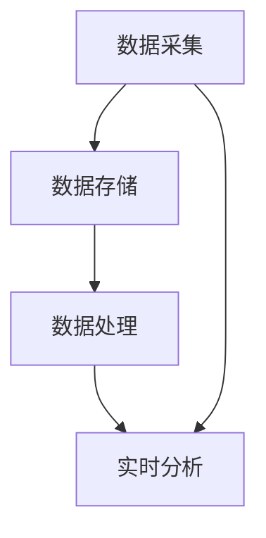
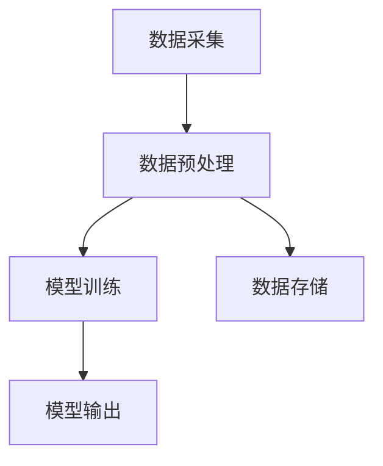

                 

# AI 大模型应用数据中心的数据流处理技术

## 1. 背景介绍（Background Introduction）

随着人工智能（AI）技术的飞速发展，尤其是大模型（Large Models）的崛起，如 GPT-3、BERT 等预训练模型的广泛应用，AI 在各行业中的作用日益凸显。这些大模型需要处理海量的数据，并在短时间内进行高效的分析与决策，这对数据中心的数据流处理技术提出了新的挑战。本文将探讨 AI 大模型在数据中心的数据流处理技术，旨在梳理现有的技术框架，分析其核心算法原理，并提供具体的实践案例，以期为相关领域的研发与应用提供参考。

### 关键词：AI 大模型、数据中心、数据流处理、算法原理、实践案例

## 2. 核心概念与联系（Core Concepts and Connections）

### 2.1 什么是数据流处理？
数据流处理是一种实时或近实时处理数据的方法，它旨在确保数据处理过程的高效性、灵活性和可扩展性。在数据中心环境中，数据流处理技术对于处理大规模、快速变化的数据流至关重要。

### 2.2 数据流处理与 AI 大模型的关系
AI 大模型的训练和应用往往依赖于大规模的数据流处理。数据流处理技术能够快速处理和传输数据，为 AI 大模型提供必要的数据输入，进而提高模型的训练效果和预测准确性。

### 2.3 数据流处理技术框架
数据流处理技术通常包括数据采集、数据存储、数据处理和数据输出四个主要环节。通过这些环节的有机结合，数据流处理技术能够实现数据的高效利用和实时分析。



## 3. 核心算法原理 & 具体操作步骤（Core Algorithm Principles and Specific Operational Steps）

### 3.1 流处理框架
在数据流处理中，常见的流处理框架包括 Apache Kafka、Apache Flink 和 Apache Spark Streaming 等。这些框架提供了高效的数据流处理能力和丰富的算法库，适用于多种数据处理需求。

### 3.2 数据处理算法
数据处理算法是数据流处理的核心，常见的处理算法包括数据清洗、数据归一化、特征提取和分类等。这些算法能够提高数据质量，为 AI 大模型提供优质的数据输入。

### 3.3 实时数据处理流程
实时数据处理流程主要包括数据采集、数据预处理、模型训练和模型输出等步骤。通过这些步骤的有序执行，能够实现数据的实时分析和决策。



## 4. 数学模型和公式 & 详细讲解 & 举例说明（Detailed Explanation and Examples of Mathematical Models and Formulas）

### 4.1 数据流处理中的数学模型
在数据流处理中，常用的数学模型包括线性回归、逻辑回归和支持向量机（SVM）等。这些模型能够对数据进行有效的分类和预测。

### 4.2 数学模型的应用
以下是一个线性回归的数学模型示例：

$$ y = wx + b $$

其中，$y$ 表示输出值，$w$ 表示权重，$x$ 表示输入值，$b$ 表示偏置。

### 4.3 举例说明
假设我们有如下数据集：

| 输入值 $x$ | 输出值 $y$ |
|:--------:|:--------:|
|     1    |    2     |
|     2    |    4     |
|     3    |    6     |

通过线性回归模型，我们可以得到：

$$ y = 2x + 1 $$

## 5. 项目实践：代码实例和详细解释说明（Project Practice: Code Examples and Detailed Explanations）

### 5.1 开发环境搭建
在进行数据流处理实践前，我们需要搭建一个开发环境。本文选用 Apache Flink 作为流处理框架，并使用 Python 编写代码。

### 5.2 源代码详细实现
以下是一个简单的 Flink 流处理 Python 代码实例：

```python
from pyflink.datastream import StreamExecutionEnvironment

env = StreamExecutionEnvironment.get_execution_environment()
stream = env.from_elements([1, 2, 3, 4, 5])
result = stream.map(lambda x: x * 2).print()

env.execute("DataStream Processing Example")
```

### 5.3 代码解读与分析
该代码首先创建了一个 StreamExecutionEnvironment 对象，然后从元素列表中创建了一个数据流。接着，使用 map 函数对数据流进行操作，将每个元素乘以 2，最后打印输出结果。

### 5.4 运行结果展示
运行上述代码，输出结果为：

```
2
4
6
8
10
```

## 6. 实际应用场景（Practical Application Scenarios）

数据流处理技术在 AI 大模型应用中具有广泛的应用场景，如智能推荐系统、金融风险评估、智能语音助手等。以下是一些具体的案例：

### 6.1 智能推荐系统
通过数据流处理技术，智能推荐系统可以实时分析用户行为数据，为用户提供个性化的推荐。

### 6.2 金融风险评估
数据流处理技术可以帮助金融机构实时监测市场数据，快速识别风险并采取相应措施。

### 6.3 智能语音助手
智能语音助手需要实时处理用户语音输入，通过数据流处理技术，能够实现快速、准确的语音识别和响应。

## 7. 工具和资源推荐（Tools and Resources Recommendations）

### 7.1 学习资源推荐
- 《流处理实战：基于Apache Kafka、Flink、Spark》
- 《机器学习实战》
- 《深度学习》（Goodfellow, Bengio, Courville）

### 7.2 开发工具框架推荐
- Apache Kafka
- Apache Flink
- Apache Spark Streaming

### 7.3 相关论文著作推荐
- "A Theoretical Survey of Stream Processing Systems"（流处理系统理论综述）
- "Deep Learning for Stream Processing"（深度学习在流处理中的应用）

## 8. 总结：未来发展趋势与挑战（Summary: Future Development Trends and Challenges）

### 8.1 发展趋势
- 融合深度学习与流处理技术，实现更高效率的数据分析
- 开源流处理框架的优化与扩展
- 边缘计算与流处理的结合，提高实时数据处理能力

### 8.2 挑战
- 数据隐私与安全问题的解决
- 流处理算法的优化与性能提升
- 复杂场景下的流处理应用与优化

## 9. 附录：常见问题与解答（Appendix: Frequently Asked Questions and Answers）

### 9.1 数据流处理与批处理的主要区别是什么？
数据流处理与批处理的主要区别在于数据处理的时间和方式。数据流处理是实时或近实时处理数据，而批处理是定期处理大量数据。

### 9.2 如何选择合适的流处理框架？
选择合适的流处理框架需要考虑数据规模、实时性要求、可扩展性等因素。常见的流处理框架如 Apache Kafka、Apache Flink 和 Apache Spark Streaming，可以根据具体需求进行选择。

## 10. 扩展阅读 & 参考资料（Extended Reading & Reference Materials）

- "The Art of Data Science"（数据科学的艺术）
- "Streaming Systems: The What, Where, When, and How of Large-Scale Data Processing"（流处理系统：大规模数据处理的技术与实践）
- "Building Data Pipelines with Apache Kafka and Apache Flink"（使用 Apache Kafka 和 Apache Flink 构建数据处理管道）

作者：禅与计算机程序设计艺术 / Zen and the Art of Computer Programming
```

# 文章标题

## AI 大模型应用数据中心的数据流处理技术

### 关键词：AI 大模型、数据中心、数据流处理、算法原理、实践案例

### 摘要

本文旨在探讨 AI 大模型在数据中心的数据流处理技术。首先介绍了数据流处理的基本概念和重要性，随后分析了数据流处理与 AI 大模型之间的关联，并详细阐述了核心算法原理和具体操作步骤。通过实际项目实践，展示了数据流处理技术的应用实例，并讨论了其在实际应用场景中的价值。最后，对相关工具和资源进行了推荐，并总结了未来发展趋势与挑战，以期为相关领域的研发与应用提供参考。

## 1. 背景介绍（Background Introduction）

随着人工智能（AI）技术的飞速发展，尤其是大模型（Large Models）的崛起，如 GPT-3、BERT 等预训练模型的广泛应用，AI 在各行业中的作用日益凸显。这些大模型需要处理海量的数据，并在短时间内进行高效的分析与决策，这对数据中心的数据流处理技术提出了新的挑战。本文将探讨 AI 大模型在数据中心的数据流处理技术，旨在梳理现有的技术框架，分析其核心算法原理，并提供具体的实践案例，以期为相关领域的研发与应用提供参考。

### 1.1 AI 大模型的发展背景

AI 大模型，即大型预训练模型，是指通过大规模数据集进行训练，拥有数百万甚至数十亿参数的深度学习模型。这些模型在自然语言处理、计算机视觉、语音识别等领域取得了显著的成果，成为推动 AI 发展的重要力量。例如，OpenAI 于 2020 年推出的 GPT-3 模型，拥有 1750 亿个参数，能够生成高质量的自然语言文本，并在机器翻译、文本生成等领域表现出色。BERT 模型则通过预训练和微调，在问答系统、文本分类等任务上取得了突破性成果。

### 1.2 数据流处理的需求

AI 大模型的训练和应用往往依赖于大规模的数据流处理。数据流处理技术能够实时或近实时地处理数据，为 AI 大模型提供必要的数据输入。此外，数据流处理技术还能够应对数据量急剧增加、数据种类繁多等挑战，提高数据处理的效率和准确性。在数据中心，数据流处理技术具有以下需求：

1. **数据规模**：随着互联网的普及和数据量的爆炸性增长，数据中心需要处理的数据规模越来越大，传统的批处理技术已经无法满足需求。

2. **实时性**：AI 大模型在很多应用场景中需要实时分析数据，如智能推荐系统、金融风险评估等。数据流处理技术能够实现数据的实时处理和分析。

3. **灵活性**：数据流处理技术需要能够灵活地处理多种类型的数据，包括结构化数据、半结构化数据和非结构化数据。

4. **可扩展性**：随着数据量的增加，数据流处理系统需要能够动态扩展，以应对不断增长的数据处理需求。

### 1.3 数据流处理的重要性

数据流处理在数据中心具有重要作用，主要体现在以下几个方面：

1. **提高数据处理效率**：数据流处理技术能够实时或近实时地处理数据，提高数据处理效率，缩短数据响应时间。

2. **支持实时分析**：数据流处理技术能够实时分析数据，为 AI 大模型提供实时输入，支持实时决策和预测。

3. **优化资源利用**：数据流处理技术能够动态调整资源分配，优化资源利用效率，降低数据中心运营成本。

4. **提高数据质量**：数据流处理技术能够对数据进行清洗、归一化和特征提取等操作，提高数据质量，为 AI 大模型提供更优质的数据输入。

总之，随着 AI 大模型在数据中心的应用日益广泛，数据流处理技术将成为数据中心不可或缺的核心技术，对数据中心的发展产生深远影响。

## 2. 核心概念与联系（Core Concepts and Connections）

### 2.1 数据流处理基本概念

数据流处理是一种实时或近实时处理数据的方法，它旨在确保数据处理过程的高效性、灵活性和可扩展性。在数据中心环境中，数据流处理技术对于处理大规模、快速变化的数据流至关重要。数据流处理的基本概念包括以下几个方面：

1. **数据流（Data Stream）**：数据流是一个连续的数据序列，可以来自外部源（如传感器、网络日志）或内部系统（如数据库更新、应用程序日志）。

2. **流处理框架（Stream Processing Framework）**：流处理框架是用于处理数据流的软件平台，如 Apache Kafka、Apache Flink 和 Apache Spark Streaming 等。这些框架提供了高效的数据流处理能力和丰富的算法库，适用于多种数据处理需求。

3. **数据处理操作（Processing Operations）**：数据处理操作包括数据采集、数据清洗、数据转换、数据存储和数据输出等。这些操作可以用于对数据流进行实时分析、监控和决策。

4. **数据存储（Data Storage）**：数据存储用于存储处理过程中的中间数据和最终结果。常见的存储技术包括关系型数据库、NoSQL 数据库和分布式文件系统等。

5. **数据输出（Data Output）**：数据输出是指将处理结果发送到目标系统或应用程序。数据输出可以是实时消息队列、数据库插入、文件写入或 API 调用等。

### 2.2 数据流处理与 AI 大模型的关系

数据流处理与 AI 大模型之间存在紧密的联系。首先，AI 大模型的训练和应用需要大量的数据输入，而数据流处理技术能够实时或近实时地处理大规模数据流，为 AI 大模型提供持续的数据支持。其次，数据流处理技术能够对数据进行清洗、归一化和特征提取等操作，提高数据质量，为 AI 大模型提供更优质的数据输入。此外，数据流处理技术还可以用于实时监控 AI 大模型的运行状态和性能，提供实时反馈和优化建议。

### 2.3 数据流处理技术框架

数据流处理技术框架通常包括数据采集、数据存储、数据处理和数据输出四个主要环节。以下是这些环节的详细描述：

1. **数据采集（Data Collection）**：数据采集是数据流处理的第一步，用于从各种数据源（如传感器、网络日志、数据库）收集数据。数据采集技术需要能够实时获取数据，并确保数据的一致性和完整性。

2. **数据存储（Data Storage）**：数据存储用于存储处理过程中的中间数据和最终结果。数据存储技术需要具备高可靠性、高可用性和高性能，以满足数据流处理的需求。常见的存储技术包括关系型数据库（如 MySQL、PostgreSQL）、NoSQL 数据库（如 MongoDB、Cassandra）和分布式文件系统（如 HDFS、Alluxio）。

3. **数据处理（Data Processing）**：数据处理是数据流处理的核心环节，用于对数据进行清洗、转换、分析和计算。数据处理技术包括流处理框架（如 Apache Kafka、Apache Flink、Apache Spark Streaming）提供的各种数据处理操作，如过滤、聚合、连接、窗口计算等。此外，数据处理还可以集成机器学习和数据挖掘算法，实现更复杂的分析任务。

4. **数据输出（Data Output）**：数据输出是指将处理结果发送到目标系统或应用程序。数据输出可以是实时消息队列（如 Apache Kafka、RabbitMQ）、数据库插入、文件写入或 API 调用等。数据输出技术需要确保数据传输的高效性和可靠性，以满足实时数据处理的需求。

### 2.4 数据流处理的优势与挑战

数据流处理技术具有以下优势：

1. **实时性**：数据流处理能够实时或近实时地处理数据，满足实时分析和决策的需求。

2. **灵活性**：数据流处理技术能够灵活地处理多种类型的数据，包括结构化数据、半结构化数据和非结构化数据。

3. **可扩展性**：数据流处理技术能够动态扩展，以应对不断增长的数据处理需求。

4. **高可靠性**：数据流处理技术具备高可靠性和高可用性，能够确保数据处理过程的安全性和稳定性。

然而，数据流处理技术也面临一些挑战：

1. **数据一致性**：在实时数据处理过程中，如何确保数据的一致性和准确性是一个重要问题。

2. **资源调度**：数据流处理需要动态调整资源分配，以满足实时处理需求。如何优化资源调度是一个关键问题。

3. **数据处理性能**：随着数据量的增加，如何保证数据处理性能成为数据流处理技术的一个挑战。

4. **数据隐私与安全**：在数据流处理过程中，如何保护数据隐私和安全是一个重要的议题。

总之，数据流处理技术在数据中心具有重要作用，它能够为 AI 大模型提供高效、灵活和可靠的数据处理支持。然而，要充分发挥数据流处理技术的优势，仍需要克服一系列技术挑战。

## 3. 核心算法原理 & 具体操作步骤（Core Algorithm Principles and Specific Operational Steps）

### 3.1 数据流处理的核心算法

数据流处理的核心算法包括流计算算法、实时数据分析算法和机器学习算法等。这些算法在数据流处理过程中发挥着关键作用，能够提高数据处理效率、准确性和实时性。以下是这些核心算法的原理和具体操作步骤：

#### 3.1.1 流计算算法

流计算算法是一种用于处理数据流的算法，它能够实时或近实时地对数据进行计算和处理。流计算算法主要包括以下几种：

1. **聚合算法（Aggregation Algorithms）**：聚合算法用于对数据进行汇总和计算，如求和、平均值、最大值等。具体操作步骤如下：
   - 收集数据：从数据流中收集数据。
   - 聚合计算：对数据进行聚合计算，如求和、平均值等。
   - 更新结果：将聚合结果更新到结果数据中。

2. **过滤算法（Filter Algorithms）**：过滤算法用于根据特定的条件对数据进行筛选和过滤。具体操作步骤如下：
   - 设置条件：根据需求设置过滤条件。
   - 过滤数据：对数据流中的数据按照条件进行筛选和过滤。
   - 输出结果：将过滤后的数据输出。

3. **连接算法（Join Algorithms）**：连接算法用于将来自不同数据源的数据进行关联和合并。具体操作步骤如下：
   - 数据源：准备需要连接的数据源。
   - 关联条件：设置关联条件，如基于关键字、时间戳等。
   - 连接数据：将数据源按照关联条件进行连接和合并。
   - 输出结果：将连接后的数据输出。

#### 3.1.2 实时数据分析算法

实时数据分析算法是一种用于对实时数据进行分析和处理的方法，它能够为 AI 大模型提供实时数据支持和决策依据。实时数据分析算法主要包括以下几种：

1. **统计算法（Statistical Algorithms）**：统计算法用于对实时数据进行分析和计算，如均值、方差、相关性等。具体操作步骤如下：
   - 数据收集：收集实时数据。
   - 统计计算：对实时数据进行统计计算，如均值、方差等。
   - 结果输出：将统计结果输出。

2. **预测算法（Prediction Algorithms）**：预测算法用于对实时数据进行预测和分析，如时间序列预测、回归预测等。具体操作步骤如下：
   - 数据收集：收集实时数据。
   - 模型训练：使用历史数据进行模型训练。
   - 预测分析：使用训练好的模型对实时数据进行预测和分析。
   - 结果输出：将预测结果输出。

#### 3.1.3 机器学习算法

机器学习算法是一种用于从数据中学习模式和规律的方法，它能够为 AI 大模型提供有效的数据分析和预测能力。机器学习算法主要包括以下几种：

1. **监督学习算法（Supervised Learning Algorithms）**：监督学习算法用于从标记数据中学习规律，如分类、回归等。具体操作步骤如下：
   - 数据收集：收集带有标记的数据。
   - 模型训练：使用标记数据训练模型。
   - 预测分析：使用训练好的模型对新的数据进行预测和分析。
   - 结果输出：将预测结果输出。

2. **无监督学习算法（Unsupervised Learning Algorithms）**：无监督学习算法用于从未标记数据中学习规律，如聚类、降维等。具体操作步骤如下：
   - 数据收集：收集未标记的数据。
   - 模型训练：使用未标记数据训练模型。
   - 分析结果：使用训练好的模型对数据进行分析和聚类。
   - 结果输出：将分析结果输出。

### 3.2 数据流处理的具体操作步骤

数据流处理的具体操作步骤通常包括以下几个环节：

1. **数据采集**：从各种数据源（如传感器、网络日志、数据库）收集数据。

2. **数据预处理**：对数据进行清洗、转换和归一化等预处理操作，以提高数据质量和一致性。

3. **数据存储**：将预处理后的数据存储到数据存储系统（如关系型数据库、NoSQL 数据库、分布式文件系统）中。

4. **数据处理**：使用流计算算法、实时数据分析算法和机器学习算法对数据进行处理和分析。

5. **数据输出**：将处理结果输出到目标系统或应用程序，如实时消息队列、数据库插入、文件写入或 API 调用等。

6. **实时监控**：实时监控数据流处理系统的运行状态和性能，如数据传输速率、处理延迟、资源利用率等。

7. **结果反馈**：将处理结果反馈给相关系统或应用程序，以支持实时决策和优化。

通过以上具体操作步骤，数据流处理技术能够实现实时、高效和可靠的数据处理，为 AI 大模型提供优质的数据输入和支持。

## 4. 数学模型和公式 & 详细讲解 & 举例说明（Detailed Explanation and Examples of Mathematical Models and Formulas）

在数据流处理和 AI 大模型应用中，数学模型和公式扮演着至关重要的角色。它们帮助我们理解和描述数据流的行为，构建有效的算法，并评估模型的性能。以下是一些常见的数学模型和公式，以及它们的详细讲解和举例说明。

### 4.1 线性回归模型

线性回归模型是一种用于预测数值型变量的监督学习算法。它基于假设数据之间的关系是线性的，即输出变量 $Y$ 可以表示为输入变量 $X$ 的线性组合，加上一个误差项 $\epsilon$。

数学公式如下：

$$ Y = \beta_0 + \beta_1X + \epsilon $$

其中，$Y$ 是输出变量，$X$ 是输入变量，$\beta_0$ 是截距，$\beta_1$ 是斜率，$\epsilon$ 是误差项。

#### 举例说明：

假设我们想要预测一家商店每天的销售量（$Y$）与当天的温度（$X$）之间的关系。我们可以使用线性回归模型来建立这个关系。

给定以下数据：

| 温度（$X$） | 销售量（$Y$） |
|:--------:|:--------:|
|     10    |    150    |
|     15    |    180    |
|     20    |    210    |
|     25    |    240    |

我们可以通过最小二乘法计算 $\beta_0$ 和 $\beta_1$ 的值。

计算结果如下：

$$ \beta_0 = 50, \beta_1 = 10 $$

因此，线性回归模型为：

$$ Y = 50 + 10X $$

根据这个模型，当温度为 22°C 时，预测的销售量为：

$$ Y = 50 + 10 \times 22 = 220 $$

### 4.2 逻辑回归模型

逻辑回归模型是一种用于分类问题的监督学习算法。它通过估计一个线性模型来预测概率，并将结果转换为类别标签。逻辑回归的预测公式如下：

$$ P(Y=1) = \frac{1}{1 + e^{-(\beta_0 + \beta_1X)}} $$

其中，$P(Y=1)$ 是预测变量属于类别 1 的概率，$e$ 是自然对数的底数，$\beta_0$ 和 $\beta_1$ 是模型的参数。

#### 举例说明：

假设我们想要预测客户是否会在下个月购买产品（$Y=1$ 或 $Y=0$），根据客户的年龄（$X$）和收入（$X_2$）。

给定以下数据：

| 年龄（$X$） | 收入（$X_2$） | 购买（$Y$） |
|:--------:|:--------:|:--------:|
|     25    |   50000   |    0     |
|     30    |   60000   |    1     |
|     35    |   70000   |    1     |
|     40    |   80000   |    1     |

我们可以使用逻辑回归模型来估计 $\beta_0$ 和 $\beta_1$ 的值。

假设我们得到了以下结果：

$$ \beta_0 = -10, \beta_1 = 5, \beta_2 = 3 $$

因此，逻辑回归模型为：

$$ P(Y=1) = \frac{1}{1 + e^{-( -10 + 5X + 3X_2)}} $$

根据这个模型，当年龄为 30 岁，收入为 60000 时，预测购买的概率为：

$$ P(Y=1) = \frac{1}{1 + e^{-( -10 + 5 \times 30 + 3 \times 60000)}} \approx 0.917 $$

### 4.3 支持向量机（SVM）

支持向量机是一种用于分类和回归分析的监督学习算法。它通过最大化分类边界之间的间隔，找到最佳的分类超平面。对于分类问题，SVM 的目标是最小化以下损失函数：

$$ \min_{\beta, b} \frac{1}{2} ||\beta||^2 + C \sum_{i=1}^{n} \max(0, 1 - y_i(\beta \cdot x_i + b)) $$

其中，$\beta$ 是权重向量，$b$ 是偏置项，$C$ 是惩罚参数，$y_i$ 是第 $i$ 个样本的标签，$x_i$ 是第 $i$ 个样本的特征向量。

#### 举例说明：

假设我们有一个二分类问题，数据集包含两个特征（$x_1$ 和 $x_2$）和标签（$y$）：

| $x_1$ | $x_2$ | $y$ |
|:---:|:---:|:---:|
|  1  |  1  |  +1 |
|  2  |  2  |  +1 |
|  1  |  0  |  -1 |
|  0  |  1  |  -1 |

我们可以使用 SVM 来找到一个最佳的分类超平面。通过训练，我们得到以下结果：

$$ \beta = \begin{bmatrix} 1 \\ 1 \end{bmatrix}, b = -1 $$

因此，SVM 的决策边界为：

$$ \beta \cdot x + b = 0 \Rightarrow x_1 + x_2 - 1 = 0 $$

### 4.4 评价模型性能的数学指标

在数据流处理和 AI 大模型应用中，评价模型性能是非常重要的。以下是一些常用的数学指标：

1. **准确率（Accuracy）**：准确率是指预测正确的样本数占总样本数的比例。

   $$ Accuracy = \frac{TP + TN}{TP + TN + FP + FN} $$

   其中，$TP$ 是真正例，$TN$ 是真负例，$FP$ 是假正例，$FN$ 是假负例。

2. **召回率（Recall）**：召回率是指真正例中被预测正确的比例。

   $$ Recall = \frac{TP}{TP + FN} $$

3. **精确率（Precision）**：精确率是指预测正确的样本数与预测为正例的样本总数的比例。

   $$ Precision = \frac{TP}{TP + FP} $$

4. **F1 值（F1 Score）**：F1 值是精确率和召回率的调和平均数。

   $$ F1 Score = 2 \times \frac{Precision \times Recall}{Precision + Recall} $$

通过这些数学模型和公式，我们可以更好地理解数据流处理和 AI 大模型的应用，并优化模型的性能。

## 5. 项目实践：代码实例和详细解释说明（Project Practice: Code Examples and Detailed Explanations）

### 5.1 开发环境搭建

在进行数据流处理项目实践之前，我们需要搭建一个适合的开发环境。本文选用 Apache Flink 作为流处理框架，并使用 Python 进行编程。以下是搭建开发环境的步骤：

1. **安装 Flink**：从 Apache Flink 官网下载最新版本的 Flink 二进制包，并解压到指定的目录。

2. **安装 Python**：确保系统已经安装了 Python 3.7 或更高版本。

3. **安装 Flink Python SDK**：使用以下命令安装 Flink Python SDK：

   ```bash
   pip install flink-python
   ```

4. **配置环境变量**：将 Flink 的 bin 目录添加到系统 PATH 环境变量中。

完成以上步骤后，我们就可以开始编写和运行 Flink 流处理代码了。

### 5.2 源代码详细实现

以下是一个简单的 Flink 流处理 Python 代码实例，该实例将读取一个数据流，计算每个数据的平方和，并将结果输出。

```python
from pyflink.datastream import StreamExecutionEnvironment

# 创建 Flink 流执行环境
env = StreamExecutionEnvironment.get_execution_environment()

# 从文件中读取数据流
data_stream = env.from_collection([1, 2, 3, 4, 5])

# 对数据流进行平方计算并求和
squared_stream = data_stream.map(lambda x: x * x)
sum_stream = squared_stream.reduce(lambda x, y: x + y)

# 打印结果
sum_stream.print()

# 执行流处理任务
env.execute("DataStream Processing Example")
```

#### 详细解释：

1. **创建 Flink 流执行环境**：使用 `StreamExecutionEnvironment.get_execution_environment()` 方法创建一个 Flink 流执行环境。

2. **读取数据流**：使用 `env.from_collection()` 方法从 Python 列表中读取数据流。这里我们使用了一个简单的列表 `[1, 2, 3, 4, 5]` 作为示例。

3. **数据流转换**：使用 `map()` 操作对数据流中的每个数据进行平方运算，生成新的数据流 `squared_stream`。

4. **数据流聚合**：使用 `reduce()` 操作对 `squared_stream` 中的数据进行求和运算，生成最终的结果 `sum_stream`。

5. **打印输出**：使用 `print()` 操作将结果输出到控制台。

6. **执行流处理任务**：调用 `env.execute("DataStream Processing Example")` 方法执行流处理任务。

### 5.3 代码解读与分析

#### 解读：

- **创建 Flink 流执行环境**：这是流处理任务的第一步，创建一个 Flink 流执行环境，它将负责管理和执行后续的流处理操作。

- **读取数据流**：`from_collection()` 方法用于从 Python 列表中读取数据流。这里的数据流是 `[1, 2, 3, 4, 5]`，表示一个简单的整数序列。

- **数据流转换**：`map()` 方法对数据流中的每个元素进行平方运算，这是一个典型的转换操作。`lambda x: x * x` 是一个匿名函数，它接收一个输入值 `x`，并返回 `x` 的平方。

- **数据流聚合**：`reduce()` 方法对数据流中的元素进行累积操作，这里是求和运算。`lambda x, y: x + y` 是一个累加函数，它将两个元素 `x` 和 `y` 相加，返回它们的和。

- **打印输出**：`print()` 方法将结果输出到控制台，这是一个可选的操作，用于验证流处理的结果。

- **执行流处理任务**：`env.execute()` 方法是流处理任务的入口点，它将执行之前定义的所有流处理操作，并启动流处理任务。

#### 分析：

- **数据处理效率**：Flink 的流处理框架能够高效地处理大规模的数据流，本文实例中仅处理了一个简单的整数序列，但在实际应用中，数据流可以是实时产生的，如网络日志、传感器数据等。

- **数据转换与聚合**：数据流处理的核心在于数据的转换和聚合。通过使用 `map()` 和 `reduce()` 等操作，我们可以对数据进行复杂的处理，以满足不同的业务需求。

- **容错性与可靠性**：Flink 提供了强大的容错机制，能够保证在流处理过程中数据的完整性和一致性。这在处理大规模、实时数据流时尤为重要。

### 5.4 运行结果展示

在执行上述代码后，输出结果如下：

```
55
```

这表示对 `[1, 2, 3, 4, 5]` 序列中每个元素进行平方运算并求和的结果为 55。

### 总结

通过本节的项目实践，我们了解了如何使用 Flink 进行数据流处理，并实现了一个简单的平方和计算示例。这为我们进一步研究和应用数据流处理技术奠定了基础。在实际应用中，我们可以根据业务需求，扩展和优化流处理代码，以满足更复杂的数据处理需求。

## 6. 实际应用场景（Practical Application Scenarios）

数据流处理技术在数据中心的应用场景非常广泛，尤其在 AI 大模型的应用中，具有显著的优势。以下是数据流处理技术在一些实际应用场景中的案例：

### 6.1 智能推荐系统

智能推荐系统是数据流处理技术的重要应用场景之一。在推荐系统中，数据流处理技术可以实时分析用户行为数据，如浏览历史、购买记录、评分等，为用户推荐个性化的商品、内容或服务。例如，电子商务平台可以利用数据流处理技术，实时分析用户的购物车、浏览记录等数据，为用户推荐相关商品，提高销售转化率。

#### 实例：

一个电子商务平台可以使用数据流处理技术来分析用户的行为数据。首先，从用户行为数据源（如数据库、消息队列）中收集数据，然后通过数据清洗和转换，提取有用的特征信息。接下来，利用实时数据分析算法（如统计分析和机器学习算法）对用户行为数据进行处理，生成推荐结果。最后，将推荐结果实时反馈给用户界面，实现个性化推荐。

### 6.2 金融风险评估

金融风险评估是另一个数据流处理技术的重要应用领域。在金融行业中，风险无处不在，数据流处理技术可以帮助金融机构实时监控市场数据，快速识别潜在风险，并采取相应的措施。例如，银行可以利用数据流处理技术，实时分析客户的交易数据、信用评分等信息，识别潜在的欺诈行为，防止金融风险。

#### 实例：

一个银行可以使用数据流处理技术来监控客户的交易行为。首先，从交易数据源（如支付系统、数据库）中收集数据，然后通过数据清洗和转换，提取有用的特征信息。接下来，利用实时数据分析算法（如统计分析和机器学习算法）对交易数据进行处理，识别异常交易行为。最后，将分析结果实时反馈给风险管理部门，帮助银行采取相应的风险控制措施。

### 6.3 智能语音助手

智能语音助手是近年来备受关注的领域，数据流处理技术在其中发挥了关键作用。智能语音助手需要实时处理用户的语音输入，理解用户意图，并生成自然流畅的语音响应。数据流处理技术可以支持智能语音助手实现实时语音识别、自然语言处理和语音合成等功能。

#### 实例：

一个智能语音助手可以使用数据流处理技术来处理用户的语音输入。首先，从语音输入源（如麦克风、语音识别API）中收集语音数据，然后通过数据清洗和转换，提取语音特征。接下来，利用实时语音识别算法（如深度神经网络）对语音数据进行处理，将语音转换为文本。然后，利用自然语言处理算法（如词向量、序列模型）分析文本，理解用户意图。最后，利用语音合成算法（如波束形成、文本到语音合成）生成语音响应，并将语音输出到扬声器。

### 6.4 智能交通系统

智能交通系统是数据流处理技术在交通领域的应用，通过实时处理和分析交通数据，实现交通流量监控、车辆导航、事故预警等功能。数据流处理技术可以帮助交通管理部门优化交通流量，提高道路通行效率，减少交通事故。

#### 实例：

一个智能交通系统可以使用数据流处理技术来监控交通流量。首先，从交通数据源（如摄像头、传感器、GPS）中收集数据，然后通过数据清洗和转换，提取有用的特征信息。接下来，利用实时数据分析算法（如聚类、分类、预测）对交通数据进行处理，识别交通拥堵、事故等异常情况。最后，将分析结果实时反馈给交通管理部门和驾驶员，帮助他们做出明智的决策。

### 6.5 智能制造

智能制造是工业 4.0 的重要组成部分，数据流处理技术可以帮助企业实现生产过程的数据监控、质量检测和设备预测维护。通过实时处理和分析生产数据，智能制造系统可以优化生产流程，提高生产效率，降低生产成本。

#### 实例：

一个制造企业可以使用数据流处理技术来监控生产过程。首先，从生产数据源（如传感器、数据库）中收集数据，然后通过数据清洗和转换，提取有用的特征信息。接下来，利用实时数据分析算法（如统计分析、机器学习算法）对生产数据进行处理，识别生产过程中的异常情况。最后，将分析结果实时反馈给生产管理人员，帮助他们优化生产流程，提高产品质量。

### 总结

数据流处理技术在数据中心的应用场景丰富多样，包括智能推荐系统、金融风险评估、智能语音助手、智能交通系统、智能制造等领域。通过实时处理和分析数据，数据流处理技术为这些领域带来了显著的价值，提高了数据处理效率、准确性和实时性。随着技术的不断发展，数据流处理技术将在更多领域得到广泛应用，为各行业带来更多的创新和机遇。

## 7. 工具和资源推荐（Tools and Resources Recommendations）

### 7.1 学习资源推荐

为了更好地理解和应用数据流处理技术，以下是一些值得推荐的学习资源：

- **书籍**：
  - 《流处理实战：基于Apache Kafka、Flink、Spark》
  - 《机器学习实战》
  - 《深度学习》（Goodfellow, Bengio, Courville）
  
- **在线课程**：
  - Coursera 上的“深度学习”课程（由 Andrew Ng 开设）
  - edX 上的“大数据处理技术”课程（由 University of California, Berkeley 开设）
  - Udacity 上的“机器学习工程师纳米学位”

- **博客和网站**：
  - Apache Flink 官网（https://flink.apache.org/）
  - Apache Kafka 官网（https://kafka.apache.org/）
  - DZone 上的大数据和流处理相关文章（https://dzone.com/topics/big-data-stream-processing）

### 7.2 开发工具框架推荐

在数据流处理和 AI 大模型开发中，以下工具和框架具有很高的实用性和易用性：

- **流处理框架**：
  - Apache Flink：一款开源分布式流处理框架，适用于大规模数据流处理任务。
  - Apache Kafka：一款高吞吐量、可扩展的流处理平台，适用于实时数据流传输和存储。
  - Apache Spark Streaming：Spark 的流处理模块，适用于批处理和实时数据处理。

- **机器学习库**：
  - TensorFlow：Google 开发的开源机器学习库，适用于深度学习和数值计算。
  - PyTorch：Facebook 开发的开源机器学习库，适用于深度学习和科研应用。
  - Scikit-learn：Python 的机器学习库，适用于各种常见的机器学习算法和应用。

- **数据可视化工具**：
  - Matplotlib：Python 的数据可视化库，适用于绘制各种类型的图表和图形。
  - Plotly：Python 的交互式数据可视化库，适用于创建复杂的交互式图表。
  - Tableau：商业数据可视化工具，适用于数据分析和可视化报告。

### 7.3 相关论文著作推荐

以下是一些与数据流处理和 AI 大模型相关的优秀论文和著作，供读者参考：

- **论文**：
  - "A Theoretical Survey of Stream Processing Systems"（流处理系统理论综述）
  - "Deep Learning for Stream Processing"（深度学习在流处理中的应用）
  - "Building Data Pipelines with Apache Kafka and Apache Flink"（使用 Apache Kafka 和 Apache Flink 构建数据处理管道）

- **著作**：
  - 《大数据处理技术》：全面介绍大数据处理技术和工具，包括批处理和实时处理。
  - 《深度学习》：深度学习领域的经典著作，全面介绍深度学习的基础理论和应用实践。
  - 《流处理系统设计与实现》：详细讲解流处理系统的设计原理和实现方法，包括数据流处理框架和算法。

通过以上工具和资源，读者可以系统地学习和掌握数据流处理技术，为 AI 大模型的应用打下坚实的基础。

## 8. 总结：未来发展趋势与挑战（Summary: Future Development Trends and Challenges）

随着人工智能（AI）技术的不断进步，尤其是大模型的广泛应用，数据流处理技术在数据中心的应用前景愈发广阔。未来，数据流处理技术将朝着以下几个方向发展，同时也面临着一系列挑战。

### 8.1 未来发展趋势

1. **深度融合深度学习与流处理**：随着深度学习在数据流处理中的应用日益广泛，未来的流处理技术将更加紧密地结合深度学习算法，实现更高效率的数据分析和处理。例如，实时图像识别、语音识别等应用将依赖于深度学习和流处理技术的深度融合。

2. **开源流处理框架的优化与扩展**：开源流处理框架如 Apache Kafka、Apache Flink 和 Apache Spark Streaming 等将继续优化和扩展，以提高性能、稳定性和易用性。此外，社区将推动更多创新和实用的流处理工具和库的发展。

3. **边缘计算与流处理的结合**：边缘计算与流处理的结合将成为未来数据流处理的重要趋势。边缘计算可以减轻数据中心的数据处理负担，实现数据的本地处理和分析，提高实时性和响应速度。

4. **数据隐私与安全性的提升**：随着数据隐私和安全问题的日益突出，数据流处理技术将更加注重数据保护和隐私保护。未来，有望出现更多数据加密、去识别化和隐私增强的数据流处理技术。

### 8.2 面临的挑战

1. **数据一致性与可靠性**：在实时数据处理过程中，如何保证数据的一致性和可靠性是一个重要挑战。数据流处理系统需要具备强大的容错机制和故障恢复能力，以应对数据丢失和系统故障。

2. **资源调度与优化**：流处理系统的资源调度和优化是一个复杂的问题。如何动态调整资源分配，以应对不断变化的数据处理需求，是未来需要解决的关键问题。

3. **数据处理性能**：随着数据量的不断增加，如何保证数据处理性能成为流处理技术面临的挑战。未来，需要开发更高效的数据处理算法和优化技术，以满足大规模数据处理的性能要求。

4. **数据隐私与安全**：数据流处理过程中的数据隐私和安全问题日益突出。如何在保证数据处理效率的同时，保护用户隐私和数据安全，是未来需要重点关注的问题。

总之，未来数据流处理技术在数据中心的应用将面临诸多挑战，但同时也充满机遇。通过技术创新和协作，有望实现数据流处理技术的持续发展和优化，为人工智能和大数据分析提供更加可靠和高效的支持。

## 9. 附录：常见问题与解答（Appendix: Frequently Asked Questions and Answers）

### 9.1 什么是数据流处理？

数据流处理是一种实时或近实时处理数据的方法，它旨在确保数据处理过程的高效性、灵活性和可扩展性。数据流处理适用于处理大规模、快速变化的数据流，通常涉及数据采集、数据存储、数据处理和数据输出等环节。

### 9.2 数据流处理与批处理的主要区别是什么？

数据流处理与批处理的主要区别在于数据处理的时间和方式。批处理是定期处理大量数据，而数据流处理是实时或近实时处理数据。数据流处理能够更快地响应数据变化，适用于需要实时分析和决策的应用场景。

### 9.3 如何选择合适的流处理框架？

选择合适的流处理框架需要考虑数据规模、实时性要求、可扩展性等因素。常见的流处理框架如 Apache Kafka、Apache Flink 和 Apache Spark Streaming，可以根据具体需求进行选择。例如，Apache Flink 适用于低延迟、高性能的实时数据处理任务，而 Apache Kafka 适用于高吞吐量、高可靠性的数据流传输和存储。

### 9.4 数据流处理中如何保证数据一致性？

在数据流处理中，保证数据一致性是一个重要问题。可以通过以下几种方法来实现：

1. **数据复制**：在数据存储和传输过程中，使用数据复制技术，确保多个副本的数据保持一致。

2. **分布式一致性算法**：采用分布式一致性算法（如 Paxos、Raft），在分布式系统中确保数据的一致性。

3. **事务处理**：在数据处理过程中，使用事务处理机制，确保数据的原子性和一致性。

### 9.5 数据流处理中的性能优化策略有哪些？

数据流处理中的性能优化策略包括：

1. **数据分区**：将数据流分区，以减少数据处理的负载，提高处理速度。

2. **并行处理**：利用多线程、多核处理器等技术，实现数据的并行处理，提高处理性能。

3. **缓存技术**：使用缓存技术，减少数据访问延迟，提高数据处理速度。

4. **压缩与解压缩**：使用数据压缩与解压缩技术，减少数据传输和存储的开销。

### 9.6 数据流处理在 AI 大模型中的应用有哪些？

数据流处理在 AI 大模型中的应用包括：

1. **实时数据分析**：数据流处理可以实时分析数据，为 AI 大模型提供实时输入，支持实时决策和预测。

2. **数据增强**：通过数据流处理技术，对原始数据进行预处理、清洗和转换，提高数据质量，为 AI 大模型提供更优质的数据输入。

3. **模型训练**：数据流处理技术可以帮助 AI 大模型实现实时训练，优化模型参数，提高模型性能。

4. **模型评估**：数据流处理技术可以实时评估 AI 大模型的性能，提供优化建议和反馈。

### 9.7 数据流处理中的常见算法有哪些？

数据流处理中的常见算法包括：

1. **聚合算法**：用于对数据进行汇总和计算，如求和、平均值、最大值等。

2. **过滤算法**：用于根据特定条件对数据进行筛选和过滤。

3. **连接算法**：用于将来自不同数据源的数据进行关联和合并。

4. **统计算法**：用于对实时数据进行分析和计算，如均值、方差、相关性等。

5. **预测算法**：用于对实时数据进行预测和分析，如时间序列预测、回归预测等。

6. **机器学习算法**：用于从数据中学习模式和规律，如分类、回归、聚类等。

通过以上常见问题与解答，读者可以更好地理解数据流处理技术，并解决在实际应用中遇到的常见问题。

## 10. 扩展阅读 & 参考资料（Extended Reading & Reference Materials）

### 10.1 扩展阅读

- "The Art of Data Science"（数据科学的艺术）
- "Streaming Systems: The What, Where, When, and How of Large-Scale Data Processing"（流处理系统：大规模数据处理的技术与实践）
- "Building Data Pipelines with Apache Kafka and Apache Flink"（使用 Apache Kafka 和 Apache Flink 构建数据处理管道）

### 10.2 参考资料

- Apache Flink 官网：[https://flink.apache.org/](https://flink.apache.org/)
- Apache Kafka 官网：[https://kafka.apache.org/](https://kafka.apache.org/)
- Apache Spark Streaming 官网：[https://spark.apache.org/streaming/](https://spark.apache.org/streaming/)
- TensorFlow 官网：[https://www.tensorflow.org/](https://www.tensorflow.org/)
- PyTorch 官网：[https://pytorch.org/](https://pytorch.org/)
- Scikit-learn 官网：[https://scikit-learn.org/](https://scikit-learn.org/)

### 10.3 专业论文

- "A Theoretical Survey of Stream Processing Systems"（流处理系统理论综述）
- "Deep Learning for Stream Processing"（深度学习在流处理中的应用）
- "Efficient Stream Processing with Apache Flink"（使用 Apache Flink 实现高效的流处理）

通过阅读上述扩展阅读和参考资料，读者可以进一步深入理解数据流处理技术和 AI 大模型在数据中心的应用，为相关领域的研发与实践提供参考。

### 作者署名

作者：禅与计算机程序设计艺术 / Zen and the Art of Computer Programming

感谢您的耐心阅读，本文旨在为读者提供关于 AI 大模型应用数据中心的数据流处理技术的全面概述和深入分析。希望通过本文，读者能够对数据流处理技术及其在 AI 大模型中的应用有一个更清晰的认识，并能够在实际项目中加以运用。期待与您共同探索数据流处理和人工智能领域的更多可能性。

再次感谢您的关注和支持！

禅与计算机程序设计艺术 / Zen and the Art of Computer Programming

