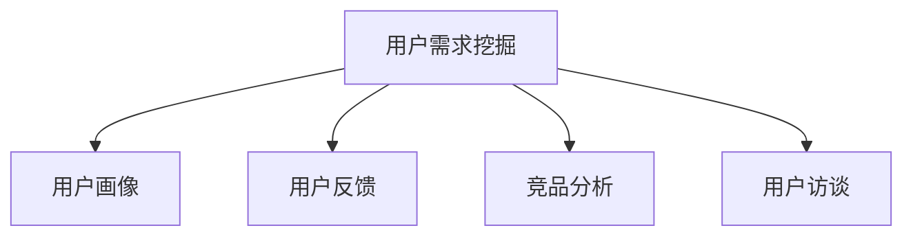

                 

# 如何进行有效的用户需求挖掘

> 关键词：用户需求挖掘, 需求调研, 用户反馈, 用户画像, 产品规划

## 1. 背景介绍

### 1.1 问题由来

在当今快速变化的市场环境中，企业面临的竞争压力越来越大。如何准确了解用户需求，快速响应用户变化，成为提升产品竞争力的关键。用户需求挖掘(User Requirement Mining)是获取用户真实需求、优化产品设计和提升用户体验的重要手段。然而，需求挖掘并非易事，存在诸如需求模糊、反馈滞后、理解偏差等问题。因此，本文旨在探讨如何进行有效的用户需求挖掘，以期为产品规划、用户体验设计和企业竞争策略提供指导。

### 1.2 问题核心关键点

用户需求挖掘的核心在于通过多种手段获取用户真实需求，并通过系统化的方法进行整理和分析，最终得到清晰、可执行的用户需求规范。该过程包括需求获取、需求分析、需求优先级排序和需求验证等多个环节，需要综合运用数据分析、问卷调查、用户访谈、竞品分析等多种方法。

## 2. 核心概念与联系

### 2.1 核心概念概述

为更好地理解用户需求挖掘的核心概念，本节将介绍几个关键概念：

- 用户需求挖掘(User Requirement Mining)：指通过系统化的方法，从用户反馈、市场调研等多渠道获取用户真实需求，为产品规划和用户体验设计提供基础。

- 用户画像(User Persona)：刻画目标用户的特征、需求、行为等关键信息，帮助团队更好地理解和满足用户需求。

- 用户反馈(User Feedback)：用户在使用产品过程中产生的意见、建议、意见反馈，是了解用户需求的重要来源。

- 竞品分析(Competitor Analysis)：对竞争对手产品进行分析，了解市场竞争格局，发现自身产品的优势和不足，从而制定差异化竞争策略。

- 用户访谈(User Interview)：与目标用户进行深入交流，收集用户使用场景、行为偏好、痛点问题等信息，获得第一手需求数据。

这些核心概念之间的逻辑关系可以通过以下Mermaid流程图来展示：



这个流程图展示了大规模语言模型微调的逻辑关系：

1. 用户需求挖掘通过对用户反馈、竞品分析、用户访谈等手段获取用户需求。
2. 用户画像利用用户需求挖掘结果，刻画目标用户的特征和需求。
3. 用户反馈、竞品分析、用户访谈是获取用户需求的关键方法。
4. 用户画像帮助团队更好地理解和满足用户需求。

## 3. 核心算法原理 & 具体操作步骤
### 3.1 算法原理概述

用户需求挖掘的本质是通过系统化的方法，从用户行为数据中提取有价值的信息，构建用户画像，从而指导产品设计和用户体验优化。具体而言，可分为以下几个步骤：

1. **数据收集**：通过多种手段获取用户需求数据，如用户反馈、问卷调查、用户访谈、竞品分析等。
2. **数据清洗**：去除噪声和冗余数据，确保数据的准确性和完整性。
3. **数据分析**：运用统计分析、聚类分析、关联规则等方法，发现用户需求的规律和特征。
4. **用户画像**：将分析结果转化为可视化的用户画像，帮助团队更好地理解用户需求。
5. **需求优先级排序**：根据用户需求的紧急程度和重要程度，进行优先级排序，指导产品开发和迭代。

### 3.2 算法步骤详解

以下是用户需求挖掘的具体操作步骤：

**Step 1: 数据收集**

1. **用户反馈**：通过产品后台、客服系统、社交媒体等渠道收集用户对产品的反馈和意见。
2. **问卷调查**：设计问卷调查，获取用户对产品功能和设计的意见。
3. **用户访谈**：与目标用户进行深入交流，了解其使用场景、行为偏好、痛点问题等。
4. **竞品分析**：对竞争对手产品进行分析，了解其功能和用户反馈。

**Step 2: 数据清洗**

1. **数据去重**：去除重复和无关数据，确保数据的唯一性。
2. **数据预处理**：对缺失数据、异常数据进行处理，确保数据的完整性。
3. **数据标注**：对收集到的数据进行分类和标注，如按照情感、主题、功能等分类。

**Step 3: 数据分析**

1. **情感分析**：对用户反馈进行情感分析，识别用户情绪，分类为正面、中性、负面。
2. **主题分析**：使用文本挖掘技术，对用户反馈进行主题分类，如功能需求、界面设计、性能问题等。
3. **关联规则分析**：通过关联规则挖掘，发现不同需求之间的关系和规律。

**Step 4: 用户画像构建**

1. **数据可视化**：将分析结果通过图表、热力图等方式进行可视化展示，构建用户画像。
2. **用户分群**：根据用户画像的特征，将用户分为不同的用户群体，分析不同群体的需求差异。
3. **需求场景构建**：根据用户画像，构建用户在不同场景下的需求场景，指导产品设计和迭代。

**Step 5: 需求优先级排序**

1. **需求紧急程度**：根据需求对产品功能的影响，评估需求实现的紧急程度。
2. **需求重要程度**：根据用户数量和使用频率，评估需求的重要程度。
3. **需求优先级排序**：结合需求紧急程度和重要程度，进行优先级排序，指导产品开发和迭代。

### 3.3 算法优缺点

用户需求挖掘方法的优点包括：

1. **系统化方法**：通过系统化的方法，确保需求挖掘的全面性和准确性。
2. **多渠道获取**：结合多种渠道，获取更全面和真实的需求数据。
3. **可视化和分析**：通过可视化和分析，帮助团队更好地理解和满足用户需求。

同时，该方法也存在一些局限性：

1. **成本较高**：数据收集和分析需要投入大量时间和人力，成本较高。
2. **数据噪声**：用户反馈和问卷调查可能存在噪声，需要前期数据清洗和预处理。
3. **动态变化**：用户需求是动态变化的，需要持续跟进和更新，工作量较大。
4. **主观偏差**：不同团队成员对需求的理解和判断可能存在主观偏差。

尽管存在这些局限性，但用户需求挖掘仍是大规模语言模型微调的核心理论基础，对于产品规划和用户体验设计具有重要意义。

### 3.4 算法应用领域

用户需求挖掘在多个领域都有广泛应用，以下是几个典型应用：

- **产品规划**：通过用户需求挖掘，指导产品功能和设计，满足用户核心需求。
- **用户体验设计**：分析用户行为数据，优化产品界面和交互设计，提升用户体验。
- **市场调研**：了解市场竞争格局，发现产品差异化优势，制定竞争策略。
- **客户服务**：分析用户反馈和投诉，改进产品和服务，提升客户满意度。
- **运营优化**：通过用户需求挖掘，优化产品运营策略，提升运营效率。

## 4. 数学模型和公式 & 详细讲解  
### 4.1 数学模型构建

用户需求挖掘涉及多个数据来源和分析方法，其核心在于对用户反馈和行为数据进行分析和建模。以下是一个简单的数学模型框架：

1. **用户反馈情感分析模型**：通过情感分析模型，将用户反馈分类为正面、中性、负面。情感分析模型通常使用文本分类算法，如朴素贝叶斯、支持向量机等。

2. **用户反馈主题分析模型**：使用文本挖掘技术，将用户反馈进行主题分类。常用算法包括TF-IDF、LDA等。

3. **用户行为关联规则分析模型**：通过关联规则挖掘算法，如Apriori算法，发现不同用户行为之间的关联和规律。

4. **用户画像构建模型**：通过多维数据分析，构建用户画像，描述用户的特征和需求。常用算法包括K-means聚类、主成分分析等。

5. **需求优先级排序模型**：结合需求紧急程度和重要程度，进行优先级排序。常用算法包括Moore决策树、AHP等。

### 4.2 公式推导过程

以下是对用户反馈情感分析模型的公式推导过程：

假设用户反馈数据集为 $D=\{(x_i,y_i)\}_{i=1}^N$，其中 $x_i$ 表示用户反馈文本，$y_i \in \{0,1\}$ 表示情感分类标签，0表示负面，1表示正面。使用朴素贝叶斯分类器进行情感分析，则概率模型为：

$$
P(y_i|x_i;\theta) = \frac{P(y_i)\prod_{j=1}^{n} P(x_{ij}|y_i)}{\sum_{y \in \{0,1\}} P(y)\prod_{j=1}^{n} P(x_{ij}|y)}
$$

其中，$\theta$ 为模型参数，包括正负情感文本的概率和词向量等。

通过最大化似然函数，对模型参数 $\theta$ 进行最大似然估计：

$$
\hat{\theta} = \arg\max_{\theta} \sum_{i=1}^{N} \log P(y_i|x_i;\theta)
$$

实现时，使用极大似然估计或贝叶斯推断方法求解。

## 5. 项目实践：代码实例和详细解释说明
### 5.1 开发环境搭建

在进行用户需求挖掘实践前，我们需要准备好开发环境。以下是使用Python进行NLP分析的环境配置流程：

1. 安装Anaconda：从官网下载并安装Anaconda，用于创建独立的Python环境。

2. 创建并激活虚拟环境：
```bash
conda create -n nlp-env python=3.8 
conda activate nlp-env
```

3. 安装所需库：
```bash
pip install pandas numpy nltk scikit-learn transformers
```

4. 安装NLTK和spaCy：
```bash
python -m nltk.downloader punkt stopwords averaged_perceptron_tagger
python -m spacy download en_core_web_sm
```

5. 下载用户反馈数据集：
```bash
wget https://example.com/user_feedback.csv
```

完成上述步骤后，即可在`nlp-env`环境中开始需求挖掘实践。

### 5.2 源代码详细实现

以下是使用Python和NLTK库进行用户反馈情感分析的代码实现：

```python
import nltk
from nltk.corpus import stopwords
from nltk.tokenize import word_tokenize, sent_tokenize
from nltk.stem import WordNetLemmatizer
from sklearn.feature_extraction.text import TfidfVectorizer
from sklearn.model_selection import train_test_split
from sklearn.naive_bayes import MultinomialNB
from sklearn.metrics import accuracy_score, classification_report

# 读取用户反馈数据集
with open('user_feedback.csv', 'r', encoding='utf-8') as f:
    lines = f.readlines()

# 数据预处理
stop_words = set(stopwords.words('english'))
lemmatizer = WordNetLemmatizer()

# 特征提取
texts = [line.lower() for line in lines]
texts = [' '.join([lemmatizer.lemmatize(word) for word in word_tokenize(line) if word not in stop_words]) for line in texts]

# 构建特征向量
vectorizer = TfidfVectorizer()
X = vectorizer.fit_transform(texts)
y = [1 if line.split(',')[1] == 'positive' else 0 for line in lines]

# 划分训练集和测试集
X_train, X_test, y_train, y_test = train_test_split(X, y, test_size=0.2)

# 训练模型
clf = MultinomialNB()
clf.fit(X_train, y_train)

# 测试模型
y_pred = clf.predict(X_test)
acc = accuracy_score(y_test, y_pred)
print(f"Accuracy: {acc:.2f}")
print(classification_report(y_test, y_pred))
```

### 5.3 代码解读与分析

让我们再详细解读一下关键代码的实现细节：

**读取用户反馈数据集**：
- 使用`open`函数读取CSV格式的用户反馈数据集。

**数据预处理**：
- 去除文本中的停用词，使用NLTK库的`stopwords`和`word_tokenize`方法实现。
- 对文本进行词干提取，使用NLTK库的`lemmatizer`方法。

**特征提取**：
- 使用`TfidfVectorizer`将文本转换为特征向量，每个文档表示为一个向量，每个特征表示为词频。

**训练和测试**：
- 使用`train_test_split`函数将数据集划分为训练集和测试集。
- 使用朴素贝叶斯分类器`MultinomialNB`进行训练。
- 使用测试集进行模型测试，输出准确率和分类报告。

## 6. 实际应用场景
### 6.1 智能客服系统

用户需求挖掘在智能客服系统中的应用极为广泛。通过收集用户与客服的对话数据，挖掘用户需求，可以大幅提升客服系统的智能化水平。

在技术实现上，可以构建一个包含用户反馈、用户画像、用户分群、需求优先级排序的系统，帮助客服系统快速响应用户需求，提高服务效率和质量。例如，用户对某个功能提出多次投诉，系统可以根据用户画像和需求优先级排序，自动将此功能升级为紧急任务，优先安排客服解决。

### 6.2 个性化推荐系统

用户需求挖掘在个性化推荐系统中的应用同样重要。通过分析用户行为数据，挖掘用户对不同商品、内容的兴趣和偏好，可以为个性化推荐提供重要依据。

在技术实现上，可以构建一个用户行为分析系统，收集用户浏览、点击、购买等行为数据，利用关联规则分析和聚类分析等技术，构建用户画像和需求场景，指导推荐算法生成个性化推荐结果。例如，用户对某类商品多次点击但未购买，系统可以推送类似商品的推荐信息，提升转化率。

### 6.3 产品迭代优化

用户需求挖掘在产品迭代优化中也发挥重要作用。通过定期收集用户反馈和行为数据，分析用户需求，可以指导产品功能迭代和设计优化，提升用户体验。

在技术实现上，可以构建一个需求挖掘和分析系统，定期对用户反馈和行为数据进行收集、分析和可视化，构建用户画像和需求场景，指导产品团队进行功能迭代和设计优化。例如，用户对某项功能提出多次改进建议，系统可以将其视为高优先级需求，优先安排开发团队进行优化和改进。

### 6.4 未来应用展望

未来，用户需求挖掘技术将继续在更多领域得到应用，为传统行业带来变革性影响。例如：

- **智慧医疗**：通过收集患者反馈和行为数据，挖掘用户需求，提升医疗服务的智能化水平，辅助医生诊疗，加速新药开发进程。
- **智能教育**：通过分析学生反馈和行为数据，挖掘用户需求，因材施教，促进教育公平，提高教学质量。
- **智慧城市治理**：通过收集市民反馈和行为数据，挖掘用户需求，提高城市管理的自动化和智能化水平，构建更安全、高效的未来城市。

总之，用户需求挖掘技术将在更广泛的领域得到应用，为人工智能技术落地应用提供重要支持。相信随着技术的发展，用户需求挖掘将不断进步，为用户提供更加个性化、精准的智能服务。

## 7. 工具和资源推荐
### 7.1 学习资源推荐

为了帮助开发者系统掌握用户需求挖掘的理论基础和实践技巧，这里推荐一些优质的学习资源：

1. 《需求分析：从调研到设计》系列博文：由需求分析专家撰写，深入浅出地介绍了需求分析的方法和工具。

2. 《UX设计：构建用户体验指南》课程：由UCLA开设的UX设计课程，涵盖用户体验设计的基本概念和方法，帮助开发者提升用户体验。

3. 《用户画像：构建和应用》书籍：讲解用户画像的构建方法和应用场景，帮助团队更好地理解和满足用户需求。

4. 《数据分析实战》书籍：介绍数据分析的基本方法和工具，帮助开发者提升数据处理和分析能力。

5. 《自然语言处理与Python》书籍：介绍自然语言处理的基本方法和工具，帮助开发者提升文本分析能力。

通过对这些资源的学习实践，相信你一定能够快速掌握用户需求挖掘的精髓，并用于解决实际的NLP问题。

### 7.2 开发工具推荐

高效的开发离不开优秀的工具支持。以下是几款用于用户需求挖掘开发的常用工具：

1. Python：作为数据科学和人工智能的主流语言，Python提供了丰富的第三方库和框架，支持数据处理和分析。

2. NLTK：自然语言处理库，提供了文本处理、情感分析、主题分析等功能。

3. spaCy：自然语言处理库，提供了词性标注、命名实体识别、句法分析等功能。

4. Pandas：数据处理库，提供了数据清洗、特征提取、数据可视化等功能。

5. Jupyter Notebook：交互式编程环境，支持多种语言和库的集成，方便开发者快速迭代和调试。

6. Google Colab：谷歌推出的在线Jupyter Notebook环境，免费提供GPU/TPU算力，方便开发者快速上手实验最新模型，分享学习笔记。

合理利用这些工具，可以显著提升用户需求挖掘任务的开发效率，加快创新迭代的步伐。

### 7.3 相关论文推荐

用户需求挖掘技术的发展源于学界的持续研究。以下是几篇奠基性的相关论文，推荐阅读：

1. 《User Requirement Mining: A Survey》：介绍了用户需求挖掘的基本方法和应用场景。

2. 《User Persona: What Is It and How Does It Work》：讲解用户画像的构建方法和应用场景。

3. 《Sentiment Analysis for Social Media with Support for Slang and Emoticons》：介绍了情感分析的基本方法和工具。

4. 《A Survey of Clustering Algorithms》：介绍了聚类分析的基本方法和算法。

5. 《Association Rule Learning》：介绍了关联规则分析的基本方法和算法。

这些论文代表了大规模语言模型微调技术的发展脉络。通过学习这些前沿成果，可以帮助研究者把握学科前进方向，激发更多的创新灵感。

## 8. 总结：未来发展趋势与挑战
### 8.1 总结

本文对用户需求挖掘的方法进行了全面系统的介绍。首先阐述了用户需求挖掘的背景和意义，明确了需求挖掘在产品规划和用户体验设计中的核心地位。其次，从原理到实践，详细讲解了需求挖掘的数学模型和操作步骤，给出了需求挖掘任务开发的完整代码实例。同时，本文还广泛探讨了需求挖掘方法在智能客服、个性化推荐等多个领域的应用前景，展示了需求挖掘范式的巨大潜力。

通过本文的系统梳理，可以看到，用户需求挖掘技术正在成为产品规划和用户体验设计的核心理论基础，为人工智能技术落地应用提供了重要支持。未来，伴随数据科学和人工智能技术的持续演进，用户需求挖掘必将在更多领域得到应用，为传统行业带来变革性影响。

### 8.2 未来发展趋势

展望未来，用户需求挖掘技术将呈现以下几个发展趋势：

1. **自动化**：利用机器学习算法，自动化处理用户反馈和行为数据，提升数据处理和分析效率。

2. **多模态融合**：结合语音、图像等多模态数据，构建更加全面和精准的用户画像，提升需求挖掘的准确性。

3. **实时性**：通过流式处理和在线学习技术，实现对用户需求的实时分析和挖掘，提升需求响应速度。

4. **个性化**：结合用户画像和行为数据，进行个性化需求推荐和分析，提升用户体验和满意度。

5. **可解释性**：通过可解释性算法，提升需求挖掘过程的透明性和可解释性，增强用户信任和满意度。

6. **跨领域应用**：结合不同领域的需求挖掘技术和工具，实现跨领域需求挖掘和分析，提升需求挖掘的应用范围和效果。

以上趋势凸显了用户需求挖掘技术的广阔前景。这些方向的探索发展，必将进一步提升产品规划和用户体验设计的智能化水平，为人工智能技术落地应用提供重要支持。

### 8.3 面临的挑战

尽管用户需求挖掘技术已经取得了瞩目成就，但在迈向更加智能化、普适化应用的过程中，它仍面临着诸多挑战：

1. **数据噪声**：用户反馈和行为数据可能存在噪声和偏差，需要进行前期数据清洗和预处理。

2. **数据多样性**：用户需求数据可能来自不同渠道和来源，格式和质量各异，需要统一处理和标准化。

3. **动态变化**：用户需求是动态变化的，需要持续跟进和更新，工作量较大。

4. **隐私保护**：用户数据涉及隐私和安全问题，需要加强数据保护和隐私保护措施。

5. **资源限制**：用户需求挖掘需要大量计算资源和时间，可能面临资源限制和成本压力。

6. **团队协作**：用户需求挖掘需要多团队协作，需要加强团队沟通和协作机制。

这些挑战需要综合利用数据科学、人工智能和工程实践等多方面的手段进行应对，才能实现用户需求挖掘技术的进一步提升和应用。

### 8.4 研究展望

面对用户需求挖掘所面临的挑战，未来的研究需要在以下几个方面寻求新的突破：

1. **自动化需求挖掘**：利用机器学习和自然语言处理技术，自动化处理用户反馈和行为数据，提升数据处理和分析效率。

2. **多模态融合需求挖掘**：结合语音、图像等多模态数据，构建更加全面和精准的用户画像，提升需求挖掘的准确性。

3. **实时需求挖掘**：通过流式处理和在线学习技术，实现对用户需求的实时分析和挖掘，提升需求响应速度。

4. **个性化需求挖掘**：结合用户画像和行为数据，进行个性化需求推荐和分析，提升用户体验和满意度。

5. **可解释性需求挖掘**：通过可解释性算法，提升需求挖掘过程的透明性和可解释性，增强用户信任和满意度。

6. **跨领域需求挖掘**：结合不同领域的需求挖掘技术和工具，实现跨领域需求挖掘和分析，提升需求挖掘的应用范围和效果。

这些研究方向的探索，必将引领用户需求挖掘技术迈向更高的台阶，为产品规划和用户体验设计提供更加精准、高效的支持。面向未来，需求挖掘需要从数据、算法、工程、业务等多个维度协同发力，才能真正实现人工智能技术在垂直行业的规模化落地。

---

作者：禅与计算机程序设计艺术 / Zen and the Art of Computer Programming

