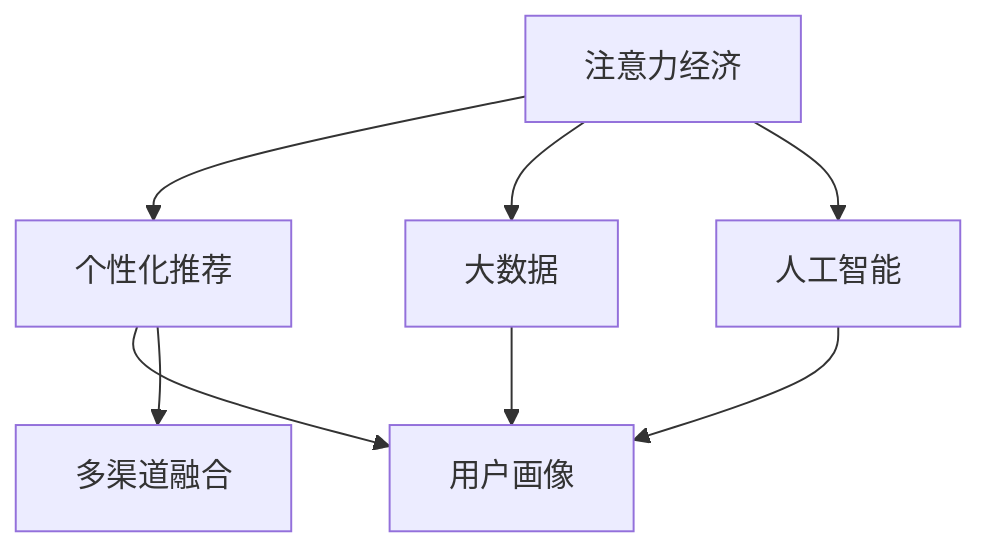

                 

# 娱乐产业在注意力经济中的转型

> 关键词：注意力经济, 娱乐产业, 数据驱动, 人工智能, 个性化推荐, 用户体验, 内容创造

## 1. 背景介绍

### 1.1 问题由来

随着互联网技术的飞速发展，全球已经进入了一个以注意力为核心的新经济时代。无论是电商、社交媒体、还是新闻门户，注意力已经成为一种稀缺资源。而对于娱乐产业来说，用户注意力就是其最宝贵的资产。因此，如何更有效地吸引和保持用户的注意力，就成为了娱乐产业竞争的关键所在。

传统的娱乐产业主要依赖于线下渠道和实体媒介来吸引用户，如电视、电影、音乐、书籍等。但随着数字技术的普及，用户获取娱乐内容的方式发生了巨大变化。例如，流媒体平台、短视频应用、在线游戏等新媒介的出现，使得内容生产和消费的方式都发生了根本性转变。在这样的背景下，传统娱乐产业不得不面临一场转型升级的挑战。

### 1.2 问题核心关键点

在注意力经济时代，娱乐产业的转型主要体现在以下几个方面：

- **数据驱动决策**：利用大数据和人工智能技术，精准预测用户需求，优化内容生产和推广策略。
- **个性化推荐**：根据用户的历史行为和兴趣偏好，提供量身定制的内容，提升用户体验。
- **内容创造协同**：利用算法和技术，使内容创造者与用户之间形成更紧密的互动和协同，共同提升内容质量。
- **多渠道融合**：通过线上线下融合的方式，多渠道分发内容，扩大覆盖范围。
- **用户体验优化**：不断优化用户界面和交互方式，提升用户的参与度和满意度。

本文将系统探讨这些关键点，并给出具体的技术实现方案和应用案例。

## 2. 核心概念与联系

### 2.1 核心概念概述

为更好地理解娱乐产业在注意力经济中的转型，本节将介绍几个密切相关的核心概念：

- **注意力经济**：以吸引和保持用户注意力为核心目标的经济模式。在注意力经济中，用户的时间、注意力资源是稀缺的，必须通过精细化的策略和高效的内容设计来吸引和保留。
- **个性化推荐**：根据用户的历史行为和兴趣偏好，推荐个性化的内容，提升用户体验。推荐系统是实现个性化推荐的核心技术。
- **大数据**：通过收集和分析海量数据，获取用户行为和兴趣的规律，指导内容生产和推广策略的优化。
- **人工智能**：利用机器学习和深度学习技术，实现智能内容推荐和用户行为预测，提高娱乐产业的运营效率和用户体验。
- **用户画像**：根据用户的互动行为和数据，构建用户兴趣和行为特征的标签，用于指导个性化推荐和内容创造。
- **多渠道融合**：将内容生产、分发和消费的各个环节整合在一起，形成闭环，提升整体的用户体验和参与度。

这些概念之间的逻辑关系可以通过以下Mermaid流程图来展示：



这个流程图展示了大语言模型的核心概念及其之间的关系：

1. 注意力经济是驱动娱乐产业转型的核心动力。
2. 个性化推荐是实现注意力经济的关键手段。
3. 大数据和人工智能技术为个性化推荐提供技术支撑。
4. 用户画像和推荐系统是个性化推荐的核心组件。
5. 多渠道融合是提升用户体验的重要策略。

这些概念共同构成了娱乐产业在注意力经济中的转型框架，使得娱乐产业能够更好地适应数字化时代的发展趋势。

## 3. 核心算法原理 & 具体操作步骤
### 3.1 算法原理概述

娱乐产业在注意力经济中的转型，主要依赖于数据驱动和个性化推荐两个核心技术。下面将详细探讨这两项技术的算法原理。

**个性化推荐算法**：通过用户的历史行为数据，如观看记录、搜索历史、点赞、评论等，构建用户画像，并根据画像特征预测用户可能感兴趣的内容。常用的个性化推荐算法包括协同过滤、基于内容的推荐、矩阵分解等。

**数据驱动决策算法**：通过对用户行为数据的分析，发现用户兴趣和需求的变化趋势，指导内容生产和推广策略的调整。常用的数据驱动决策算法包括聚类分析、关联规则挖掘、异常检测等。

### 3.2 算法步骤详解

**个性化推荐算法步骤**：

1. **数据收集**：收集用户行为数据，如观看记录、搜索历史、点赞、评论等。
2. **数据预处理**：对数据进行清洗和归一化处理，去除噪声和异常值。
3. **特征提取**：从数据中提取用户和内容的特征，如用户的兴趣标签、内容的分类、时长、评分等。
4. **模型训练**：选择合适的推荐算法模型，如协同过滤、基于内容的推荐、矩阵分解等，对数据进行模型训练。
5. **推荐生成**：将用户特征和内容特征输入到训练好的模型中，生成推荐结果。
6. **结果评估**：对推荐结果进行评估，使用指标如准确率、召回率、F1值等衡量推荐效果。

**数据驱动决策算法步骤**：

1. **数据收集**：收集用户行为数据，如观看记录、搜索历史、点赞、评论等。
2. **数据预处理**：对数据进行清洗和归一化处理，去除噪声和异常值。
3. **特征提取**：从数据中提取用户和内容的特征，如用户的兴趣标签、内容的分类、时长、评分等。
4. **模型训练**：选择合适的数据驱动决策算法模型，如聚类分析、关联规则挖掘、异常检测等，对数据进行模型训练。
5. **策略优化**：根据模型训练结果，优化内容生产和推广策略，如调整推荐算法参数、优化内容分发渠道等。
6. **效果评估**：对优化后的策略进行效果评估，使用指标如用户参与度、内容消费量、广告转化率等衡量效果。

### 3.3 算法优缺点

**个性化推荐算法的优缺点**：

- **优点**：
  - 能够根据用户的历史行为和兴趣偏好，提供量身定制的内容，提升用户体验。
  - 能够在数据量有限的情况下，快速构建用户画像，生成推荐结果。
  - 算法模型较为成熟，应用广泛。

- **缺点**：
  - 推荐结果可能会受到用户数据质量的影响，数据噪声和缺失可能影响推荐效果。
  - 推荐系统容易陷入"过滤泡沫"（Filter Bubble）效应，即只推荐用户已经感兴趣的内容，导致信息茧房。
  - 推荐算法的可解释性较差，难以理解推荐结果的生成过程。

**数据驱动决策算法的优缺点**：

- **优点**：
  - 能够基于大规模用户数据，发现用户兴趣和需求的变化趋势，指导内容生产和推广策略的调整。
  - 算法模型的多样性，可以根据具体场景选择最合适的模型。
  - 能够预测未来的趋势，提前调整策略，减少不确定性。

- **缺点**：
  - 需要大量的数据和计算资源，模型训练成本较高。
  - 预测结果可能受到数据分布变化的影响，需要对模型进行持续更新。
  - 模型的可解释性较差，难以理解模型的内部逻辑和决策过程。

### 3.4 算法应用领域

**个性化推荐算法应用领域**：

- 视频推荐：根据用户的历史观看记录和行为特征，推荐相关视频内容。
- 音乐推荐：根据用户的听歌历史和行为特征，推荐相似的音乐和歌曲。
- 商品推荐：根据用户的购买历史和浏览行为，推荐相关的商品和商品组合。
- 新闻推荐：根据用户的历史阅读记录和行为特征，推荐相关的新闻和文章。
- 游戏推荐：根据用户的游戏行为和偏好，推荐相关的游戏和游戏内容。

**数据驱动决策算法应用领域**：

- 内容生产和优化：根据用户行为数据，调整内容创作策略，提升内容质量。
- 用户行为预测：预测用户未来的行为和兴趣，指导内容推广和营销策略。
- 广告投放优化：根据用户行为数据，优化广告投放策略，提高广告转化率。
- 流量分析：分析用户流量来源和行为变化，指导流量分发和运营策略的调整。
- 市场趋势预测：基于市场数据和用户行为数据，预测市场趋势，指导产品规划和决策。

## 4. 数学模型和公式 & 详细讲解  
### 4.1 数学模型构建

**个性化推荐模型的数学模型构建**：

设用户为 $u$，物品为 $i$，推荐系统为用户和物品构建相似度矩阵 $X$，设 $X_{ui}$ 表示用户 $u$ 对物品 $i$ 的评分。

推荐模型可以使用矩阵分解方法，如奇异值分解（SVD），将矩阵 $X$ 分解为 $X \approx UVW^T$，其中 $U$ 和 $W$ 为用户和物品的特征矩阵，$V$ 为相似度矩阵。推荐算法可以使用 $X$ 和 $UVW^T$ 的相似度，计算每个物品 $i$ 对用户 $u$ 的评分预测 $\hat{X}_{ui}$。

**数据驱动决策模型的数学模型构建**：

设用户为 $u$，行为特征为 $f_u$，内容为 $i$，行为特征向量为 $f_i$。

数据驱动决策模型可以使用聚类分析方法，如K-means聚类，将用户和内容分为多个簇，计算用户 $u$ 和内容 $i$ 之间的距离，从而判断用户对内容 $i$ 的兴趣。

### 4.2 公式推导过程

**个性化推荐模型的公式推导**：

$$
\begin{aligned}
\hat{X}_{ui} &= UVW^T_i \\
\hat{X}_{ui} &= U_u \cdot V_i \cdot W^T
\end{aligned}
$$

其中 $U_u$ 为用户特征向量，$V_i$ 为物品特征向量，$W^T$ 为相似度矩阵的转置。

**数据驱动决策模型的公式推导**：

$$
\begin{aligned}
\text{distance}(u, i) &= \text{distance}(f_u, f_i) \\
&= \sum_{j=1}^k |f_{uj} - f_{ij}|
\end{aligned}
$$

其中 $f_{uj}$ 为用户 $u$ 的第 $j$ 个特征值，$j$ 表示特征维度。

### 4.3 案例分析与讲解

**案例分析**：

- **视频推荐系统**：
  - 数据来源：用户观看记录、搜索历史、评分等。
  - 推荐算法：协同过滤、基于内容的推荐、矩阵分解等。
  - 效果评估：准确率、召回率、用户满意度等。

- **音乐推荐系统**：
  - 数据来源：用户听歌历史、评分、评论等。
  - 推荐算法：协同过滤、基于内容的推荐、神经网络推荐等。
  - 效果评估：准确率、召回率、音乐下载量等。

- **商品推荐系统**：
  - 数据来源：用户浏览历史、购买记录、评分等。
  - 推荐算法：协同过滤、基于内容的推荐、深度学习推荐等。
  - 效果评估：转化率、购物车放弃率、复购率等。

- **新闻推荐系统**：
  - 数据来源：用户阅读历史、点击记录、评论等。
  - 推荐算法：协同过滤、基于内容的推荐、神经网络推荐等。
  - 效果评估：点击率、停留时间、页面跳出率等。

## 5. 项目实践：代码实例和详细解释说明
### 5.1 开发环境搭建

在进行推荐系统开发前，我们需要准备好开发环境。以下是使用Python进行推荐系统开发的流程：

1. 安装Anaconda：从官网下载并安装Anaconda，用于创建独立的Python环境。

2. 创建并激活虚拟环境：
```bash
conda create -n recomm_system python=3.8 
conda activate recomm_system
```

3. 安装相关库：
```bash
pip install numpy pandas scikit-learn torch transformers
```

4. 安装第三方库：
```bash
pip install scikit-learn-meter sktime
```

完成上述步骤后，即可在`recomm_system`环境中开始推荐系统开发。

### 5.2 源代码详细实现

我们以协同过滤推荐算法为例，给出一个基于PyTorch的推荐系统代码实现。

```python
import torch
import torch.nn as nn
import torch.nn.functional as F
import numpy as np
import pandas as pd
from sklearn.metrics import mean_squared_error, mean_absolute_error
from sklearn.model_selection import train_test_split
from sklearn.metrics import mean_squared_error, mean_absolute_error

# 数据加载
data = pd.read_csv('user_item_data.csv')
user_id, item_id, rating = data['user_id'], data['item_id'], data['rating']

# 将数据转化为PyTorch张量
user_id = torch.tensor(user_id.values).long()
item_id = torch.tensor(item_id.values).long()
rating = torch.tensor(rating.values).float()

# 将数据分为训练集和测试集
train_ratio = 0.8
train_user_id, test_user_id, train_item_id, test_item_id, train_rating, test_rating = train_test_split(user_id, item_id, rating, test_size=1-train_ratio)

# 将训练集和测试集转化为PyTorch DataLoader
train_data = torch.utils.data.TensorDataset(train_user_id, train_item_id, train_rating)
test_data = torch.utils.data.TensorDataset(test_user_id, test_item_id, test_rating)

train_loader = torch.utils.data.DataLoader(train_data, batch_size=100, shuffle=True)
test_loader = torch.utils.data.DataLoader(test_data, batch_size=100, shuffle=False)

# 定义协同过滤模型
class CollaborativeFiltering(nn.Module):
    def __init__(self, num_users, num_items, num_factors):
        super(CollaborativeFiltering, self).__init__()
        self.num_users = num_users
        self.num_items = num_items
        self.num_factors = num_factors
        self.user_factors = nn.Embedding(num_users, num_factors)
        self.item_factors = nn.Embedding(num_items, num_factors)
        self.prediction_layer = nn.Linear(num_factors * 2, 1)

    def forward(self, user, item):
        user_factors = self.user_factors(user)
        item_factors = self.item_factors(item)
        concat = torch.cat([user_factors, item_factors], dim=1)
        prediction = self.prediction_layer(concat)
        return prediction

# 定义优化器和学习率
model = CollaborativeFiltering(num_users, num_items, num_factors)
optimizer = torch.optim.Adam(model.parameters(), lr=0.001)
loss_fn = nn.MSELoss()

# 训练模型
for epoch in range(100):
    for user, item, rating in train_loader:
        optimizer.zero_grad()
        prediction = model(user, item)
        loss = loss_fn(prediction, rating)
        loss.backward()
        optimizer.step()
    print(f'Epoch {epoch+1}, train loss: {loss.item()}')

# 在测试集上评估模型
with torch.no_grad():
    correct_predictions = []
    for user, item, rating in test_loader:
        prediction = model(user, item)
        correct_predictions.append(prediction.item())
    mse = mean_squared_error(test_rating, correct_predictions)
    mae = mean_absolute_error(test_rating, correct_predictions)
    print(f'Test MSE: {mse:.4f}, Test MAE: {mae:.4f}')
```

以上就是基于协同过滤算法的推荐系统代码实现。可以看到，基于PyTorch的深度学习框架，协同过滤算法的实现非常简单和直观。

### 5.3 代码解读与分析

让我们再详细解读一下关键代码的实现细节：

**数据加载**：
- 使用Pandas库加载CSV数据，将用户ID、物品ID和评分转化为PyTorch张量。
- 使用train_test_split函数将数据分为训练集和测试集，并转化为PyTorch DataLoader。

**模型定义**：
- 定义一个协同过滤模型，包含用户和物品的嵌入层和预测层。
- 使用Embedding层将用户和物品的ID映射到低维向量空间，然后进行拼接，并通过一个线性层进行预测。

**优化器定义**：
- 定义Adam优化器，学习率为0.001，用于训练模型。

**模型训练和评估**：
- 使用PyTorch的DataLoader和for循环，在训练集上进行前向传播和反向传播，更新模型参数。
- 在测试集上计算平均绝对误差和均方误差，评估模型性能。

可以看出，基于深度学习框架的推荐系统开发，大大简化了模型实现的复杂性，提高了开发效率。

## 6. 实际应用场景
### 6.1 智能推荐系统

智能推荐系统是实现个性化推荐的核心技术，广泛应用于各大平台如Netflix、Amazon、Spotify等。

**Netflix推荐系统**：
- 数据来源：用户观看历史、评分、收藏夹等。
- 推荐算法：协同过滤、基于内容的推荐、深度学习推荐等。
- 效果评估：观看量、留存率、点击率等。

**Amazon推荐系统**：
- 数据来源：用户浏览历史、购买记录、评分等。
- 推荐算法：协同过滤、基于内容的推荐、深度学习推荐等。
- 效果评估：点击率、购买转化率、退货率等。

**Spotify推荐系统**：
- 数据来源：用户听歌历史、评分、收藏夹等。
- 推荐算法：协同过滤、基于内容的推荐、深度学习推荐等。
- 效果评估：播放量、留存率、分享量等。

这些平台通过推荐系统，极大地提升了用户粘性，增加了用户消费量，实现了商业价值的最大化。

### 6.2 内容创造协同

内容创造协同是通过数据驱动决策，实现用户与内容创作者之间的互动和协作，提升内容质量和用户满意度。

**内容创作平台**：
- 数据来源：用户行为数据、用户评论、内容质量评价等。
- 数据驱动决策算法：聚类分析、关联规则挖掘、异常检测等。
- 内容优化策略：根据用户行为数据，调整内容创作策略，提升内容质量。

**UGC平台**：
- 数据来源：用户评论、评分、互动行为等。
- 数据驱动决策算法：情感分析、主题建模等。
- 内容优化策略：根据用户反馈，优化内容创作和推荐策略，提升用户体验。

这些平台通过内容创造协同，实现了用户和内容创作者的双赢，提升了内容的丰富性和多样性。

### 6.3 多渠道融合

多渠道融合是将内容生产和分发的各个环节整合在一起，形成闭环，提升整体的用户体验和参与度。

**线上线下融合**：
- 数据来源：线上行为数据、线下活动记录、互动行为等。
- 多渠道融合策略：将线上推荐和线下活动结合，提升整体的用户体验。

**跨平台融合**：
- 数据来源：不同平台的用户行为数据。
- 多渠道融合策略：将不同平台的数据进行整合，形成统一的推荐策略，提升整体的用户体验。

这些平台通过多渠道融合，实现了跨平台的用户互动，提升了整体的用户体验和参与度。

## 7. 工具和资源推荐
### 7.1 学习资源推荐

为了帮助开发者系统掌握推荐系统的理论基础和实践技巧，这里推荐一些优质的学习资源：

1. **《Recommender Systems: Text Mining, Link Analysis, and Recommendations》**：斯坦福大学推荐的系统性学习资源，详细介绍了推荐系统的原理和算法。

2. **《Introduction to Recommender Systems》**：Coursera上的推荐系统课程，由斯坦福大学和台湾大学的教授主讲，系统介绍了推荐系统的基础和进阶内容。

3. **Kaggle竞赛**：Kaggle上有多项推荐系统相关的竞赛，通过实际数据和任务，快速提升推荐系统开发能力。

4. **Deep Learning for Recommendation Systems**：Kaggle官方博客系列，详细介绍了基于深度学习的推荐系统开发实践。

5. **Scikit-learn推荐系统工具包**：Scikit-learn提供了多个推荐系统算法，包括协同过滤、基于内容的推荐等，方便开发者快速上手实践。

通过对这些资源的学习实践，相信你一定能够快速掌握推荐系统的精髓，并用于解决实际的推荐问题。

### 7.2 开发工具推荐

高效的开发离不开优秀的工具支持。以下是几款用于推荐系统开发的常用工具：

1. **Python**：基于Python的深度学习框架，如PyTorch、TensorFlow，提供了强大的计算能力和灵活的编程接口。
2. **Scikit-learn**：提供了多种推荐系统算法，包括协同过滤、基于内容的推荐等，方便开发者快速实现推荐系统。
3. **TensorBoard**：TensorFlow配套的可视化工具，可以实时监测模型训练状态，提供丰富的图表呈现方式，方便调试和优化模型。
4. **Scikit-learn-Meter**：提供了多种推荐系统评估指标，方便开发者进行模型效果评估和对比。
5. **Jupyter Notebook**：交互式开发环境，方便开发者进行数据处理和模型开发。

合理利用这些工具，可以显著提升推荐系统的开发效率，加快创新迭代的步伐。

### 7.3 相关论文推荐

推荐系统领域的研究非常活跃，以下是几篇具有代表性的相关论文，推荐阅读：

1. **《Netflix Prize Challenge》**：Netflix推荐的全球竞赛，展示了推荐系统在实际应用中的巨大潜力和挑战。

2. **《Collaborative Filtering with Neighborhood-Weighted Cooccurrence Model》**：提出了邻域加权共现模型，用于协同过滤推荐系统，提升了推荐效果。

3. **《Practical Recommender Systems》**：介绍了推荐系统的主要算法和实践技巧，详细介绍了协同过滤、基于内容的推荐等方法。

4. **《Fine-Grained Recommendation by Context-Tagged Models》**：提出了上下文标记模型，用于细粒度推荐系统，提升了推荐效果和用户满意度。

5. **《Deep Learning for Recommendation Systems》**：介绍了深度学习在推荐系统中的应用，展示了基于深度学习的推荐系统的优越性。

这些论文代表了大语言模型微调技术的发展脉络。通过学习这些前沿成果，可以帮助研究者把握学科前进方向，激发更多的创新灵感。

## 8. 总结：未来发展趋势与挑战
### 8.1 总结

本文对基于数据驱动的娱乐产业在注意力经济中的转型进行了全面系统的介绍。首先阐述了娱乐产业面临的注意力经济转型背景，明确了数据驱动决策和个性化推荐技术的核心地位。其次，从原理到实践，详细讲解了推荐系统的算法原理和具体操作步骤，给出了推荐系统开发的全过程。同时，本文还广泛探讨了推荐系统在智能推荐、内容创造协同、多渠道融合等多个行业领域的应用前景，展示了推荐系统技术的发展潜力和广阔应用场景。

通过本文的系统梳理，可以看到，基于数据驱动的娱乐产业在注意力经济中的转型已经取得了显著的进展，极大地提升了用户体验和商业价值。未来，伴随技术的不断发展，推荐系统必将在更多领域得到应用，为各行各业带来变革性影响。

### 8.2 未来发展趋势

展望未来，推荐系统的研究将呈现以下几个发展趋势：

1. **推荐系统智能化**：基于深度学习和神经网络技术的推荐系统，将逐步取代传统的协同过滤、基于内容的推荐等方法，实现更高效、更精准的推荐。
2. **个性化推荐多样化**：推荐系统将不断扩展推荐内容的多样性，不仅推荐相似内容，还将推荐互补内容，提升用户体验。
3. **跨领域推荐融合**：推荐系统将跨领域融合，如视频、音乐、图书、商品等，实现更全面的推荐。
4. **实时推荐系统**：基于实时数据分析和实时计算的推荐系统，将能够更快速地响应用户需求，提升用户满意度。
5. **多模态推荐系统**：结合视觉、听觉、文字等多种模态信息，实现更全面、更深入的推荐。
6. **推荐系统伦理和安全**：随着推荐系统在决策过程中的重要性不断提升，推荐系统的伦理和安全问题也逐渐被关注，推荐系统将被设计成可解释、可审计的系统。

以上趋势凸显了推荐系统技术的广阔前景。这些方向的探索发展，必将进一步提升推荐系统的性能和用户体验，为数字化时代的娱乐产业带来新的机遇。

### 8.3 面临的挑战

尽管推荐系统技术已经取得了显著的进展，但在迈向更加智能化、普适化应用的过程中，仍然面临诸多挑战：

1. **数据隐私和安全**：用户数据隐私和安全问题，是推荐系统面临的最大挑战之一。如何在保护用户隐私的同时，获取足够的数据，实现精准推荐，是一个亟待解决的难题。
2. **算法公平性和可解释性**：推荐系统可能存在算法偏见，导致某些用户或内容被不公平地对待。如何保证推荐系统的公平性和可解释性，是未来推荐系统的重要研究方向。
3. **用户满意度提升**：推荐系统的用户满意度受到多种因素的影响，如推荐内容的多样性、推荐系统的反应速度等。如何提升用户满意度，是推荐系统不断追求的目标。
4. **算力和成本**：推荐系统需要大量的算力和数据，成本较高。如何在降低成本的同时，提升推荐系统的性能，是一个需要不断探索的问题。
5. **跨平台一致性**：不同平台之间的推荐系统需要进行数据和算法的一致性设计，以实现更全面的用户覆盖和推荐。
6. **新业务场景的适应性**：推荐系统需要适应新的业务场景和新的数据形态，如短视频、直播、虚拟现实等，这需要不断优化推荐算法和技术。

这些挑战需要从技术、法律、伦理等多个层面进行综合考虑和解决，才能真正实现推荐系统的普适化应用。

### 8.4 研究展望

面对推荐系统面临的挑战，未来的研究需要在以下几个方面寻求新的突破：

1. **基于深度学习的推荐算法**：通过深度学习技术，实现更精准、更个性化的推荐。
2. **多模态推荐技术**：结合视觉、听觉、文字等多种模态信息，实现更全面、更深入的推荐。
3. **推荐系统公平性研究**：通过算法优化和模型设计，实现推荐系统的公平性和可解释性。
4. **推荐系统隐私保护**：采用差分隐私、联邦学习等技术，保护用户数据隐私。
5. **实时推荐系统**：基于实时数据分析和实时计算的推荐系统，能够更快速地响应用户需求。
6. **跨平台推荐系统**：通过统一数据格式和算法，实现跨平台的推荐系统集成。

这些研究方向将引领推荐系统技术的发展，推动推荐系统在更多领域得到应用。

## 9. 附录：常见问题与解答

**Q1：推荐系统的开发流程包括哪些步骤？**

A: 推荐系统的开发流程包括数据收集、数据预处理、特征提取、模型训练、模型评估、模型部署等多个步骤。具体流程如下：
1. 数据收集：收集用户行为数据和物品属性数据。
2. 数据预处理：清洗和归一化数据，去除噪声和异常值。
3. 特征提取：从数据中提取用户和物品的特征，如用户的兴趣标签、内容的分类、时长、评分等。
4. 模型训练：选择合适的推荐算法模型，如协同过滤、基于内容的推荐、深度学习推荐等，对数据进行模型训练。
5. 模型评估：对模型进行评估，使用指标如准确率、召回率、F1值等衡量推荐效果。
6. 模型部署：将训练好的模型部署到生产环境，进行实际推荐。

**Q2：推荐系统如何保护用户隐私？**

A: 推荐系统保护用户隐私的主要方法包括：
1. 差分隐私：通过对数据进行扰动，保护用户隐私。
2. 联邦学习：通过在本地设备上进行模型训练，避免数据集中存储。
3. 匿名化：对用户数据进行匿名化处理，去除个人身份信息。
4. 数据加密：对用户数据进行加密处理，防止数据泄露。

**Q3：推荐系统在实际应用中面临哪些挑战？**

A: 推荐系统在实际应用中面临的挑战包括：
1. 数据隐私和安全问题：用户数据隐私和安全问题，是推荐系统面临的最大挑战之一。
2. 算法公平性和可解释性：推荐系统可能存在算法偏见，导致某些用户或内容被不公平地对待。
3. 用户满意度提升：推荐系统的用户满意度受到多种因素的影响，如推荐内容的多样性、推荐系统的反应速度等。
4. 算力和成本：推荐系统需要大量的算力和数据，成本较高。
5. 跨平台一致性：不同平台之间的推荐系统需要进行数据和算法的一致性设计。
6. 新业务场景的适应性：推荐系统需要适应新的业务场景和新的数据形态。

**Q4：推荐系统的未来发展方向是什么？**

A: 推荐系统的未来发展方向包括：
1. 推荐系统智能化：基于深度学习和神经网络技术的推荐系统，将逐步取代传统的协同过滤、基于内容的推荐等方法，实现更高效、更精准的推荐。
2. 个性化推荐多样化：推荐系统将不断扩展推荐内容的多样性，不仅推荐相似内容，还将推荐互补内容，提升用户体验。
3. 跨领域推荐融合：推荐系统将跨领域融合，如视频、音乐、图书、商品等，实现更全面的推荐。
4. 实时推荐系统：基于实时数据分析和实时计算的推荐系统，将能够更快速地响应用户需求，提升用户满意度。
5. 多模态推荐系统：结合视觉、听觉、文字等多种模态信息，实现更全面、更深入的推荐。
6. 推荐系统伦理和安全：推荐系统将被设计成可解释、可审计的系统。

**Q5：如何提升推荐系统的用户满意度？**

A: 提升推荐系统的用户满意度主要通过以下几个方面：
1. 推荐内容多样化：不仅推荐相似内容，还将推荐互补内容，提升用户体验。
2. 实时响应：基于实时数据分析和实时计算的推荐系统，能够更快速地响应用户需求，提升用户满意度。
3. 个性化推荐：通过深度学习技术，实现更精准、更个性化的推荐。
4. 用户反馈机制：引入用户反馈机制，根据用户反馈调整推荐策略，提升用户体验。

---

作者：禅与计算机程序设计艺术 / Zen and the Art of Computer Programming

