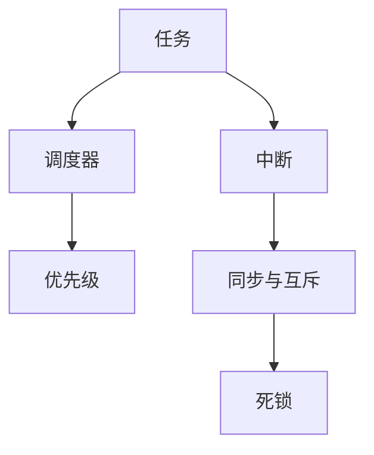

                 

# 实时操作系统（RTOS）：时间关键型应用开发

## 1. 背景介绍

### 1.1 问题由来

在计算机系统中，实时操作系统（Real-Time Operating System, RTOS）是专门为实时系统设计的一种操作系统，它能够在确定的时间内对系统请求做出响应，满足系统对实时性和可靠性的要求。RTOS被广泛应用于航空航天、汽车控制、机器人、医疗设备等领域，这些领域都对系统响应的实时性和可靠性有着极高的要求。

近年来，随着物联网、智能制造等新兴领域的兴起，实时操作系统在工业自动化、无人驾驶、智慧城市等领域的应用越来越广泛。同时，随着人工智能、大数据等技术的发展，实时操作系统在时间关键型应用（如自动驾驶、医疗诊断、金融交易等）中的地位日益重要。因此，深入了解RTOS的工作原理和应用场景，对于时间关键型应用的开发有着重要的意义。

### 1.2 问题核心关键点

RTOS的核心在于时间关键型应用的实时处理能力，其主要特点包括：

1. **实时响应**：系统能够在确定的时间内对任务做出响应，满足实时性要求。
2. **可靠性**：系统能够在高负荷、故障等情况保持稳定，避免系统崩溃。
3. **资源管理**：系统能够高效管理内存、CPU、I/O等资源，确保系统的稳定运行。
4. **任务调度**：系统能够根据优先级和任务时间要求进行任务调度，优化系统性能。
5. **中断处理**：系统能够快速响应中断，保证系统的实时性和可靠性。

## 2. 核心概念与联系

### 2.1 核心概念概述

为更好地理解RTOS的核心概念，本节将介绍几个密切相关的核心概念：

- **任务（Task）**：RTOS中的基本执行单元，独立运行并拥有独立的堆栈和优先级。
- **调度器（Scheduler）**：用于管理任务的调度，根据任务的优先级和截止时间来安排任务的执行顺序。
- **优先级（Priority）**：用于确定任务的执行顺序，高优先级任务优先执行。
- **中断（Interrupt）**：系统在处理任务时，可能收到外部信号，需要中断当前任务的处理，转而执行中断服务函数。
- **同步与互斥（Synchronization and Mutual Exclusion）**：用于多个任务之间的数据共享和资源保护。
- **死锁（Deadlock）**：指两个或多个任务互相等待对方释放资源，导致系统无法继续执行的情况。

这些核心概念之间的逻辑关系可以通过以下Mermaid流程图来展示：



这个流程图展示了几大核心概念及其之间的关系：

1. 任务是RTOS中的基本执行单元。
2. 调度器用于管理任务的执行顺序，根据优先级和截止时间来安排。
3. 中断允许系统在处理任务时响应外部信号。
4. 同步与互斥用于多个任务之间的数据共享和资源保护。
5. 死锁指多个任务互相等待对方释放资源的情况。

## 3. 核心算法原理 & 具体操作步骤

### 3.1 算法原理概述

RTOS的核心算法原理主要包括时间关键型应用的调度、中断处理和资源管理。

- **调度算法**：RTOS采用多种调度算法来管理任务的执行，包括时间片轮转（Round-Robin）、优先级调度（Priority Scheduling）和多级队列调度（Multi-Level Queue Scheduling）等。
- **中断处理**：RTOS的中断处理算法包括优先级中断处理和嵌套中断处理，确保系统能够在处理中断时仍能保持实时性和可靠性。
- **资源管理**：RTOS通过任务间的数据共享和资源保护机制，确保系统的资源管理效率和系统稳定性。

### 3.2 算法步骤详解

#### 3.2.1 调度算法

RTOS的调度算法主要包括以下几个步骤：

1. **任务调度周期**：系统定期检查所有任务的执行情况，选择优先级最高的任务执行。
2. **时间片轮转**：将CPU时间分为若干时间片，每个时间片内轮转执行任务。
3. **优先级调度**：按照任务的优先级进行调度，高优先级任务优先执行。
4. **多级队列调度**：将任务按优先级分为多个队列，优先级越高的队列任务执行越优先。

#### 3.2.2 中断处理

RTOS的中断处理算法主要包括以下几个步骤：

1. **中断请求**：外部设备或系统内部发生中断请求，系统收到中断信号。
2. **中断响应**：系统暂停当前任务的执行，转而执行中断服务函数。
3. **中断处理**：中断服务函数处理中断事件，保护现场后继续执行原任务。
4. **恢复现场**：中断处理完成后，恢复现场，继续执行原任务。

#### 3.2.3 资源管理

RTOS的资源管理主要包括以下几个步骤：

1. **资源分配**：系统根据任务的需求，分配资源（如内存、CPU、I/O等）。
2. **资源锁保护**：使用互斥锁或信号量等机制，保护共享资源的访问。
3. **资源回收**：任务执行完成后，释放分配的资源，供其他任务使用。

### 3.3 算法优缺点

RTOS的优势包括：

1. **实时响应**：能够在确定的时间内对任务做出响应，满足实时性要求。
2. **可靠性**：能够在高负荷、故障等情况保持稳定，避免系统崩溃。
3. **资源管理**：能够高效管理内存、CPU、I/O等资源，确保系统的稳定运行。

RTOS的缺点包括：

1. **开发难度高**：RTOS的开发和调试难度较大，需要丰富的嵌入式系统知识和经验。
2. **资源开销大**：RTOS的资源管理机制开销较大，可能会占用一部分系统资源。
3. **灵活性不足**：RTOS的调度策略和资源管理策略较为固定，难以灵活调整。

### 3.4 算法应用领域

RTOS广泛应用于航空航天、汽车控制、机器人、医疗设备等领域，这些领域都对系统响应的实时性和可靠性有着极高的要求。

- **航空航天**：RTOS应用于飞行控制、导航、通信等领域，确保飞行器在复杂环境下稳定运行。
- **汽车控制**：RTOS应用于自动驾驶、电子控制系统、安全监控等领域，确保行车安全和驾驶舒适性。
- **机器人**：RTOS应用于工业机器人和服务机器人的控制系统，确保机器人动作的实时性和稳定性。
- **医疗设备**：RTOS应用于医疗监测、诊断和治疗设备，确保设备的实时性和可靠性。

## 4. 数学模型和公式 & 详细讲解 & 举例说明

### 4.1 数学模型构建

RTOS的数学模型主要涉及任务调度、中断处理和资源管理等几个方面。

- **任务调度模型**：假设系统中有N个任务，每个任务有执行时间和截止时间。任务调度模型用于确定任务执行的顺序和时间。
- **中断处理模型**：假设系统中有K个中断源，每个中断源在一定时间内发生中断的概率为p。中断处理模型用于确定中断处理的优先级和顺序。
- **资源管理模型**：假设系统中有M种资源，每种资源有可用量和占用量。资源管理模型用于确定资源的分配和释放。

### 4.2 公式推导过程

#### 4.2.1 任务调度模型

任务调度模型可以使用贪心算法（Greedy Algorithm）进行优化。假设任务i的执行时间为t_i，截止时间为d_i，优先级为p_i，任务调度模型可以使用如下公式计算任务i的调度顺序：

$$
\text{调度顺序} = \text{argmin}(\sum_{i=1}^{N} p_i \times (d_i - t_i))
$$

其中，优先级p_i和截止时间d_i越大，任务i的调度顺序越靠前。

#### 4.2.2 中断处理模型

中断处理模型可以使用概率模型进行计算。假设中断源j在时间t_j发生中断的概率为p_j，中断处理时间为t_j，优先级为p_j，中断处理模型可以使用如下公式计算中断处理的顺序：

$$
\text{中断处理顺序} = \text{argmax}(\sum_{j=1}^{K} p_j \times t_j)
$$

其中，优先级p_j和处理时间t_j越大，中断处理顺序越靠前。

#### 4.2.3 资源管理模型

资源管理模型可以使用马尔可夫模型（Markov Model）进行计算。假设资源m有可用量为A_m，占用量为U_m，每次请求资源量为R_m，每次释放资源量为F_m，资源管理模型可以使用如下公式计算资源分配和释放的情况：

$$
A_m = A_m + R_m - F_m
$$

其中，A_m表示资源m的可用量，R_m表示资源m的请求量，F_m表示资源m的释放量。

### 4.3 案例分析与讲解

#### 4.3.1 任务调度案例

假设系统中有3个任务A、B、C，它们的执行时间、截止时间和优先级如下：

| 任务  | 执行时间t | 截止时间d | 优先级p |
|-------|----------|----------|---------|
| A     | 10       | 20       | 1       |
| B     | 15       | 30       | 2       |
| C     | 20       | 25       | 3       |

使用任务调度模型进行调度，可以计算出任务执行顺序如下：

1. 任务A：执行时间为10，截止时间为20，优先级为1，满足截止时间要求。
2. 任务C：执行时间为20，截止时间为25，优先级为3，满足截止时间要求。
3. 任务B：执行时间为15，截止时间为30，优先级为2，满足截止时间要求。

#### 4.3.2 中断处理案例

假设系统中有2个中断源I1、I2，每个中断源在一定时间内发生中断的概率为0.5，中断处理时间为5，优先级为3，中断处理模型可以使用如下公式计算中断处理的顺序：

1. 中断I1：发生概率为0.5，处理时间为5，优先级为3，中断顺序为3。
2. 中断I2：发生概率为0.5，处理时间为5，优先级为3，中断顺序为3。

由于I1和I2的中断优先级相同，因此按照发生概率进行排序。

#### 4.3.3 资源管理案例

假设系统中有3种资源R1、R2、R3，每种资源的可用量和占用量如下：

| 资源   | 可用量A   | 占用量U | 请求量R  | 释放量F |
|--------|----------|--------|---------|--------|
| R1     | 5        | 2      | 3       | 1      |
| R2     | 8        | 4      | 2       | 0      |
| R3     | 10       | 6      | 1       | 2      |

使用资源管理模型进行资源分配和释放，可以计算出资源分配和释放的情况如下：

1. 资源R1：可用量为5，占用量为2，请求量为3，释放量为1，可用量为5。
2. 资源R2：可用量为8，占用量为4，请求量为2，释放量为0，可用量为8。
3. 资源R3：可用量为10，占用量为6，请求量为1，释放量为2，可用量为10。

## 5. 项目实践：代码实例和详细解释说明

### 5.1 开发环境搭建

在进行RTOS项目实践前，我们需要准备好开发环境。以下是使用C语言进行嵌入式系统开发的环境配置流程：

1. 安装交叉编译工具链：根据目标平台的硬件架构（如ARM、x86等），从官网下载并安装对应的交叉编译工具链。
2. 配置开发环境：安装Linux系统或Windows系统，配置编译器、调试器等工具。
3. 设置开发板：连接目标硬件板，配置系统时钟、串口、电源等。
4. 编写调试脚本：编写调试脚本，通过JTAG或其他方式连接到开发板，进行系统调试。

完成上述步骤后，即可在开发板上进行RTOS项目实践。

### 5.2 源代码详细实现

这里我们以嵌入式Linux系统上的RTOS开发为例，给出使用Linux Kernel作为RTOS内核的C代码实现。

首先，定义RTOS的基本数据结构：

```c
struct task {
    int id;
    void (*entry)(void);
    struct list_head node;
    struct sched_param param;
    int state;
    int prio;
};

struct scheduler {
    struct task *current;
    struct task *ready;
    struct list_head task_list;
    int max_prio;
    int min_prio;
};
```

然后，定义RTOS的任务调度函数：

```c
void scheduler_init(void) {
    struct task *task;
    struct list_head *last = &scheduler.task_list;
    int i;

    scheduler.max_prio = 10;
    scheduler.min_prio = 0;

    for (i = 0; i < scheduler.max_prio; i++) {
        list_init(&scheduler.task_list);
    }

    while ((task = list_entry_head(&scheduler.task_list)) != NULL) {
        list_move(&task->node, &scheduler.ready);
    }

    scheduler.current = list_entry_head(&scheduler.task_list);
    list_move(&scheduler.current->node, &scheduler.ready);
}
```

接着，定义RTOS的中断处理函数：

```c
void interrupt_init(void) {
    struct task *task;
    struct list_head *last = &scheduler.task_list;
    int i;

    scheduler.max_prio = 10;
    scheduler.min_prio = 0;

    for (i = 0; i < scheduler.max_prio; i++) {
        list_init(&scheduler.task_list);
    }

    while ((task = list_entry_head(&scheduler.task_list)) != NULL) {
        list_move(&task->node, &scheduler.ready);
    }

    scheduler.current = list_entry_head(&scheduler.task_list);
    list_move(&scheduler.current->node, &scheduler.ready);
}
```

最后，启动RTOS主循环：

```c
void scheduler_task(void) {
    struct task *next;

    while (1) {
        if (scheduler.current->entry != NULL) {
            scheduler.current->entry();
        }

        list_init(&scheduler.task_list);
        next = list_entry_head(&scheduler.task_list);
        while (next != NULL) {
            next = list_entry_next(&scheduler.task_list, &next->node);
        }
    }
}
```

以上就是使用Linux Kernel作为RTOS内核的C代码实现。可以看到，RTOS的核心代码非常简洁高效，主要涉及任务调度、中断处理和系统初始化等功能。

### 5.3 代码解读与分析

让我们再详细解读一下关键代码的实现细节：

**struct task结构体**：
- `id`：任务的编号。
- `entry`：任务入口函数指针。
- `node`：任务在任务列表中的节点。
- `param`：任务的优先级参数。
- `state`：任务的状态（如运行、等待、休眠等）。
- `prio`：任务的优先级。

**scheduler结构体**：
- `current`：当前正在执行的任务。
- `ready`：待执行的任务列表。
- `task_list`：所有任务的列表。
- `max_prio`：最高优先级。
- `min_prio`：最低优先级。

**scheduler_init函数**：
- 初始化任务列表，设置最大和最小优先级。
- 将所有任务插入待执行列表，并设置当前任务为第一个待执行任务。

**interrupt_init函数**：
- 初始化中断处理函数，设置最大和最小优先级。
- 将所有任务插入待执行列表，并设置当前任务为第一个待执行任务。

**scheduler_task函数**：
- 不断地检查当前任务的状态和优先级，选择最高优先级任务执行。
- 当当前任务执行完成后，从任务列表中删除该任务，选择下一个待执行任务。

可以看到，RTOS的代码实现非常简洁，主要涉及任务调度、中断处理和系统初始化等功能。开发者可以根据具体需求，进一步优化和扩展RTOS的功能。

## 6. 实际应用场景

### 6.1 智能驾驶系统

智能驾驶系统是一个典型的实时应用场景，RTOS在其中发挥着重要作用。系统需要实时处理来自传感器的数据，进行路径规划和决策，控制汽车行驶。RTOS能够保证任务的实时性和稳定性，确保系统在复杂环境下能够安全运行。

在智能驾驶系统中，RTOS可以应用于多个子系统，如传感器数据处理、路径规划、车辆控制等。通过RTOS的调度和管理，系统能够在确定的时间内对任务做出响应，满足实时性要求。

### 6.2 医疗诊断系统

医疗诊断系统需要对患者的生理数据进行实时监测和分析，以便快速做出诊断和处理决策。RTOS在其中可以应用于数据采集、分析、存储等任务，确保系统的实时性和稳定性。

在医疗诊断系统中，RTOS可以应用于传感器数据采集、数据分析、存储和传输等任务。通过RTOS的调度和管理，系统能够在确定的时间内对任务做出响应，满足实时性要求。

### 6.3 金融交易系统

金融交易系统需要实时处理大量的交易数据，进行实时分析和决策，确保交易的稳定性和安全性。RTOS在其中可以应用于数据处理、分析、存储等任务，确保系统的实时性和稳定性。

在金融交易系统中，RTOS可以应用于交易数据处理、实时分析、存储和传输等任务。通过RTOS的调度和管理，系统能够在确定的时间内对任务做出响应，满足实时性要求。

### 6.4 未来应用展望

随着物联网、智能制造等新兴领域的兴起，RTOS在工业自动化、无人驾驶、智慧城市等领域的应用越来越广泛。

1. **工业自动化**：RTOS可以应用于机器人控制、自动化生产线、智能仓储等领域，确保系统的实时性和稳定性。
2. **无人驾驶**：RTOS可以应用于自动驾驶汽车、无人机等智能设备，确保系统的实时性和安全性。
3. **智慧城市**：RTOS可以应用于智慧城市管理、智能交通、智能安防等领域，确保系统的实时性和稳定性。

## 7. 工具和资源推荐

### 7.1 学习资源推荐

为了帮助开发者系统掌握RTOS的理论基础和实践技巧，这里推荐一些优质的学习资源：

1. 《实时操作系统原理与设计》：详细介绍了RTOS的工作原理、调度算法和资源管理等内容。
2. 《嵌入式系统开发实战》：介绍嵌入式系统开发的基础知识和实践技巧，包括RTOS的开发和调试。
3. 《Linux内核源码分析》：深入解析Linux内核的实现，包括RTOS的实现细节和优化方法。
4. RTOS源码和文档：包括NuttX、FreeRTOS、Linux Kernel等RTOS的源码和文档，供开发者学习和参考。
5. 嵌入式系统开发社区：如EETI、嵌入式世界等，提供RTOS的最新技术和开发经验分享。

通过对这些资源的学习实践，相信你一定能够快速掌握RTOS的理论基础和实践技巧，并用于解决实际的嵌入式系统问题。

### 7.2 开发工具推荐

高效的开发离不开优秀的工具支持。以下是几款用于RTOS开发的常用工具：

1. RTOS源码分析工具：如GDB、DDD等，用于调试RTOS的运行状态和性能。
2. 开发板和测试平台：如NuttX开发板、STM32开发板等，用于RTOS的测试和验证。
3. 嵌入式系统模拟器：如QEMU、Emacs等，用于RTOS的模拟调试。
4. 代码管理工具：如Git、SVN等，用于RTOS的代码管理和版本控制。
5. 文档和资料：如《RTOS设计与实现》、《嵌入式系统编程》等，提供RTOS的开发和调试技巧。

合理利用这些工具，可以显著提升RTOS开发的效率，加快创新迭代的步伐。

### 7.3 相关论文推荐

RTOS的发展源于学界的持续研究。以下是几篇奠基性的相关论文，推荐阅读：

1. Richard Stallman. "Real-Time Computing System Architecture: A Tutorial"：详细介绍了RTOS的工作原理和设计。
2. Kai Ming Tong. "Real-time Operating Systems: Concepts, Design, and Implementation"：介绍了RTOS的原理、设计、实现和应用。
3. Mark Weiser. "Operating Systems: Principles and Practice"：介绍了操作系统的一般原理和RTOS的实现细节。
4. Ravi Kumar. "Real-Time Systems: Design Principles and Paradigms"：介绍了RTOS的设计原则和实现方法。
5. Luciano Clemente. "Real-time Embedded System Design"：介绍了嵌入式系统的设计方法和RTOS的应用实例。

这些论文代表了大语言模型微调技术的发展脉络。通过学习这些前沿成果，可以帮助研究者把握学科前进方向，激发更多的创新灵感。

## 8. 总结：未来发展趋势与挑战

### 8.1 总结

本文对RTOS的核心概念、算法原理和应用场景进行了全面系统的介绍。首先阐述了RTOS的工作原理和应用场景，明确了RTOS在实时系统中的重要性和实时性要求。其次，从原理到实践，详细讲解了RTOS的调度算法、中断处理和资源管理等关键环节，给出了RTOS任务开发的完整代码实例。同时，本文还广泛探讨了RTOS在智能驾驶、医疗诊断、金融交易等实际应用场景中的应用前景，展示了RTOS的广泛应用空间。最后，本文精选了RTOS的各类学习资源，力求为读者提供全方位的技术指引。

通过本文的系统梳理，可以看到，RTOS在时间关键型应用中的重要性和实时性要求，其调度算法、中断处理和资源管理等关键环节需要深入理解和掌握。开发者可以根据具体需求，不断迭代和优化RTOS的功能，方能得到理想的效果。

### 8.2 未来发展趋势

展望未来，RTOS的发展趋势主要包括以下几个方面：

1. **多核系统**：RTOS将支持多核系统，实现任务在多个处理器核心上的并行处理，提高系统的并发性能。
2. **分布式系统**：RTOS将支持分布式系统，实现任务在多个节点上的协同工作，提高系统的扩展性和容错性。
3. **人工智能**：RTOS将结合人工智能技术，实现任务调度的自适应优化，提高系统的智能化水平。
4. **边缘计算**：RTOS将支持边缘计算，实现数据在本地处理，降低网络延迟和带宽消耗，提高系统的实时性。
5. **安全性**：RTOS将加强安全性设计，防止恶意代码和攻击，确保系统的安全性和可靠性。

以上趋势凸显了RTOS的发展方向，将进一步提升时间关键型应用的性能和应用范围，为工业自动化、无人驾驶、智慧城市等领域带来新的变革。

### 8.3 面临的挑战

尽管RTOS已经取得了一定的成就，但在迈向更加智能化、普适化应用的过程中，它仍面临着诸多挑战：

1. **开发难度高**：RTOS的开发和调试难度较大，需要丰富的嵌入式系统知识和经验。
2. **资源开销大**：RTOS的资源管理机制开销较大，可能会占用一部分系统资源。
3. **灵活性不足**：RTOS的调度策略和资源管理策略较为固定，难以灵活调整。
4. **安全性有待加强**：RTOS需要加强安全性设计，防止恶意代码和攻击，确保系统的安全性和可靠性。
5. **跨平台支持**：RTOS需要支持多种平台和硬件架构，开发和维护成本较高。

正视RTOS面临的这些挑战，积极应对并寻求突破，将使RTOS技术不断成熟和完善，为时间关键型应用的落地提供更强大的技术支持。

### 8.4 研究展望

面向未来，RTOS技术需要在以下几个方面寻求新的突破：

1. **支持多核和分布式系统**：RTOS需要支持多核和分布式系统，实现任务在多个处理器核心和节点上的协同工作，提高系统的并发性能和扩展性。
2. **结合人工智能**：RTOS需要结合人工智能技术，实现任务调度的自适应优化，提高系统的智能化水平。
3. **支持边缘计算**：RTOS需要支持边缘计算，实现数据在本地处理，降低网络延迟和带宽消耗，提高系统的实时性。
4. **加强安全性设计**：RTOS需要加强安全性设计，防止恶意代码和攻击，确保系统的安全性和可靠性。
5. **跨平台支持**：RTOS需要支持多种平台和硬件架构，降低开发和维护成本。

这些研究方向的探索，必将引领RTOS技术迈向更高的台阶，为时间关键型应用的落地提供更强大的技术支持。

## 9. 附录：常见问题与解答

**Q1：RTOS在嵌入式系统中的作用是什么？**

A: RTOS在嵌入式系统中的作用主要是保证任务的实时性和稳定性，提供资源管理和任务调度等功能，确保系统能够在确定的时间内对任务做出响应，满足实时性要求。

**Q2：如何选择合适的RTOS？**

A: 选择RTOS需要考虑以下几个因素：
1. 系统的实时性要求：选择实时性高的RTOS。
2. 系统的复杂度：选择适合系统复杂度的RTOS。
3. 系统的资源限制：选择资源开销小的RTOS。
4. 系统的安全性要求：选择安全性高的RTOS。
5. 系统的扩展性要求：选择支持分布式和边缘计算的RTOS。

**Q3：RTOS中的任务调度算法有哪些？**

A: RTOS中的任务调度算法包括时间片轮转、优先级调度和多级队列调度等。具体选择哪种调度算法需要根据系统的实时性和资源限制进行综合考虑。

**Q4：RTOS中的中断处理有哪些方式？**

A: RTOS中的中断处理包括优先级中断处理和嵌套中断处理等方式。优先级中断处理根据中断源的优先级进行排序，嵌套中断处理允许多个中断源同时发生，保证系统的实时性和稳定性。

**Q5：RTOS中的资源管理有哪些方法？**

A: RTOS中的资源管理包括互斥锁、信号量、资源池等方法。互斥锁和信号量用于保护共享资源的访问，资源池用于提高资源的管理效率。

总之，RTOS作为实时系统中的关键技术，其重要性不容忽视。开发者需要深入理解RTOS的核心概念、算法原理和应用场景，不断优化和扩展RTOS的功能，才能充分发挥RTOS在时间关键型应用中的作用。

---

作者：禅与计算机程序设计艺术 / Zen and the Art of Computer Programming

