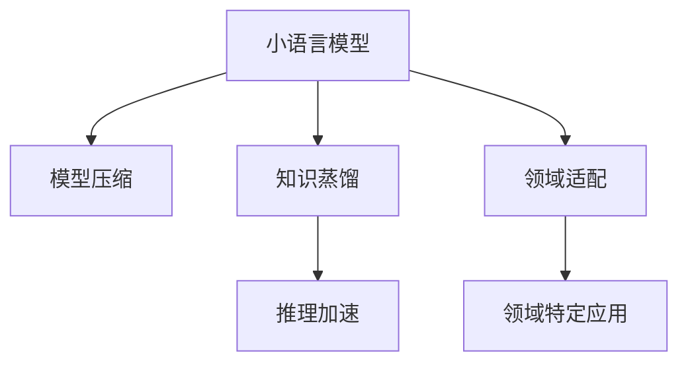

                 

# 小语言模型的应用场景拓展:教育、医疗和金融领域

在人工智能技术不断发展的今天，小语言模型（Small Language Models, SLMs）以其轻量化、高效能和低成本的优势，逐渐成为NLP领域的重要研究方向。与大规模预训练语言模型（Large Language Models, LLMs）相比，小语言模型在资源需求、推理速度和可解释性等方面都有明显优势，因此在教育、医疗和金融等特定领域的应用前景广阔。本文将详细探讨小语言模型在这些领域的潜力，并结合实例分析其应用实践。

## 1. 背景介绍

### 1.1 问题由来

随着深度学习技术的发展，大规模预训练语言模型在自然语言处理领域取得了显著的成果。然而，这些模型通常具有庞大的参数规模，对计算资源和内存要求高，推理速度慢，难以大规模部署和实时应用。与之相比，小语言模型则通过较小的参数规模和高效的结构设计，有效缓解了这些问题，并具备更好的可解释性和适用性。

### 1.2 问题核心关键点

小语言模型主要关注如何设计轻量化、高效率的模型，以适应用户特定的需求和资源限制。其核心关键点包括：

1. 轻量化设计：小模型通常参数量较少，可以大幅降低计算和存储成本。
2. 高效性：通过优化模型结构，提高推理速度和计算效率。
3. 可解释性：小模型由于参数量少，决策过程相对透明，便于理解和解释。
4. 适应性：小模型可以根据具体任务需求，灵活调整参数和结构。
5. 成本效益：小模型在精度和性能上能够与大模型相媲美，且开发和部署成本低。

## 2. 核心概念与联系

### 2.1 核心概念概述

为更好地理解小语言模型在特定领域的应用，本节将介绍几个相关核心概念：

- 小语言模型（Small Language Models, SLMs）：与大规模预训练模型相对应，小语言模型具有更少的参数和更高效的结构设计，适合于资源受限的设备和场景。
- 模型压缩（Model Compression）：通过剪枝、量化、蒸馏等技术手段，减少模型参数和存储需求，提升推理速度。
- 知识蒸馏（Knowledge Distillation）：通过老师模型指导学生模型学习，提高小模型的泛化能力。
- 推理加速（Inference Acceleration）：通过优化模型计算图和推理算法，提升模型实时处理能力。
- 领域适配（Domain Adaptation）：针对特定领域，调整模型结构和参数，使其在该领域表现更佳。

这些概念之间通过相互作用，构成了一个完整的小语言模型应用框架，使其能够在不同的领域和场景中发挥最大效能。

### 2.2 核心概念原理和架构的 Mermaid 流程图



这个流程图展示了小语言模型的核心概念及其之间的逻辑关系：

1. 小语言模型通过模型压缩和知识蒸馏技术，减少参数量和计算需求。
2. 推理加速技术提升模型的实时处理能力，支持快速推理。
3. 领域适配针对特定应用场景，调整模型结构和参数，以适应领域特性。
4. 通过适配后的模型，可以应用于教育、医疗和金融等特定领域。

## 3. 核心算法原理 & 具体操作步骤

### 3.1 算法原理概述

小语言模型的设计原则是轻量化、高效能和可解释性。其算法原理主要包括模型压缩、知识蒸馏、推理加速和领域适配等技术手段。

- **模型压缩**：通过剪枝、量化和蒸馏等技术，减少模型参数，降低计算和存储成本，提升推理速度。
- **知识蒸馏**：将大模型的知识迁移到小模型，提高小模型的泛化能力。
- **推理加速**：通过优化计算图和推理算法，提升模型的实时处理能力。
- **领域适配**：针对特定领域，调整模型结构和参数，使其在该领域表现更佳。

### 3.2 算法步骤详解

以知识蒸馏为例，展示小语言模型在特定领域的应用流程：

1. **数据准备**：收集该领域的相关数据集，标注数据，并进行预处理。
2. **大模型训练**：使用大规模预训练模型对数据集进行预训练，学习到领域特定的语言表示。
3. **小模型训练**：在原始小模型基础上，添加领域适配层，如分类器或解码器，并使用知识蒸馏技术对其进行微调。
4. **蒸馏过程**：使用大模型对小模型进行指导，通过预测和损失函数的方式，将大模型的知识迁移到小模型中。
5. **模型评估**：在验证集上评估蒸馏后的小模型性能，迭代调整蒸馏策略和参数，直至达到预期效果。

### 3.3 算法优缺点

小语言模型在特定领域的应用具有以下优点：

1. **轻量化设计**：参数量小，计算和存储成本低，适用于资源受限的设备。
2. **高效推理**：推理速度快，实时响应能力强，适合于需要快速响应的应用场景。
3. **可解释性**：模型参数量少，决策过程透明，便于理解和解释。
4. **灵活适配**：模型结构可灵活调整，针对不同领域进行适配。

但小模型也有其局限性：

1. **泛化能力有限**：由于参数量少，模型在处理复杂任务时，泛化能力可能不及大模型。
2. **迁移学习难度大**：在特定领域训练的小模型，在其他领域应用时效果可能较差。
3. **可训练参数少**：模型的可训练参数较少，限制了微调效果和性能提升。

### 3.4 算法应用领域

小语言模型在教育、医疗和金融等特定领域有广泛的应用前景：

- **教育**：在智能辅导、作业批改、个性化推荐等场景中，小语言模型可以快速响应用户需求，提供个性化教育服务。
- **医疗**：在病历记录、临床问答、患者咨询等场景中，小语言模型可以帮助医生提高工作效率，提升诊疗质量。
- **金融**：在金融分析、风险评估、客户服务等方面，小语言模型可以快速处理大量数据，提供智能化的决策支持。

## 4. 数学模型和公式 & 详细讲解 & 举例说明

### 4.1 数学模型构建

小语言模型的数学模型构建，主要涉及模型压缩、知识蒸馏和推理加速等技术。以知识蒸馏为例，其数学模型构建如下：

设大模型为 $M_{\text{teacher}}$，小模型为 $M_{\text{student}}$。知识蒸馏的目标是最小化两者之间的距离，即：

$$
\min_{\theta_{\text{student}}} \mathcal{L}(M_{\text{teacher}}, M_{\text{student}}) = \frac{1}{N}\sum_{i=1}^N \ell(M_{\text{teacher}}(x_i), M_{\text{student}}(x_i))
$$

其中 $\ell$ 为交叉熵损失函数，$x_i$ 为输入样本。

### 4.2 公式推导过程

知识蒸馏的核心是使用大模型的预测结果指导小模型的训练，可以通过softmax函数和KL散度来实现。具体公式推导如下：

设大模型的预测结果为 $p_i$，小模型的预测结果为 $q_i$，则知识蒸馏的损失函数为：

$$
\mathcal{L}_{\text{teacher}} = -\frac{1}{N}\sum_{i=1}^N p_i \log q_i
$$

通过最大化 $q_i$ 和 $p_i$ 的相似性，可以使得小模型学习到大模型的知识，提升其在特定领域的表现。

### 4.3 案例分析与讲解

以医疗领域的临床问答为例，展示小语言模型在知识蒸馏中的应用：

1. **数据准备**：收集临床医生的问答记录，标注问题-答案对，并进行数据预处理。
2. **大模型训练**：使用大规模医疗领域的预训练模型，如BERT，对标注数据进行微调，学习到领域特定的语言表示。
3. **小模型训练**：在轻量化的医疗小模型基础上，添加分类器，并使用知识蒸馏技术进行微调。
4. **蒸馏过程**：将大模型的预测结果作为标签，指导小模型的训练，通过交叉熵损失函数进行优化。
5. **模型评估**：在验证集上评估蒸馏后的小模型性能，迭代调整蒸馏策略和参数，直至达到预期效果。

通过知识蒸馏，小语言模型可以继承大模型的知识，提升其在医疗领域的性能，从而在临床问答等场景中发挥作用。

## 5. 项目实践：代码实例和详细解释说明

### 5.1 开发环境搭建

在进行小语言模型应用实践前，我们需要准备好开发环境。以下是使用Python进行TensorFlow开发的简单环境配置流程：

1. 安装Anaconda：从官网下载并安装Anaconda，用于创建独立的Python环境。

2. 创建并激活虚拟环境：
```bash
conda create -n tf-env python=3.8 
conda activate tf-env
```

3. 安装TensorFlow：根据CUDA版本，从官网获取对应的安装命令。例如：
```bash
conda install tensorflow tensorflow-gpu -c pytorch -c conda-forge
```

4. 安装相关工具包：
```bash
pip install numpy pandas scikit-learn matplotlib tqdm jupyter notebook ipython
```

完成上述步骤后，即可在`tf-env`环境中开始应用实践。

### 5.2 源代码详细实现

下面我们以医疗领域的病历记录分析为例，给出使用TensorFlow实现小语言模型的代码实现。

首先，定义病历数据预处理函数：

```python
import tensorflow as tf
import numpy as np

def preprocess(text):
    # 将文本转化为数字编码
    tokenizer = tf.keras.preprocessing.text.Tokenizer(char_level=True)
    tokenizer.fit_on_texts(text)
    sequences = tokenizer.texts_to_sequences(text)
    
    # 对编码后的序列进行padding
    max_len = 128
    padded_sequences = tf.keras.preprocessing.sequence.pad_sequences(sequences, maxlen=max_len, padding='post')
    
    return padded_sequences
```

然后，定义小语言模型和优化器：

```python
from transformers import TFAutoModel

model = TFAutoModel.from_pretrained('bert-base-uncased', output_attentions=False)
optimizer = tf.keras.optimizers.Adam(learning_rate=2e-5)
```

接着，定义训练和评估函数：

```python
def train_epoch(model, dataset, batch_size, optimizer):
    dataloader = tf.data.Dataset.from_tensor_slices((dataset[0], dataset[1])).shuffle(1000).batch(batch_size)
    for batch in dataloader:
        input_ids, labels = batch
        with tf.GradientTape() as tape:
            outputs = model(input_ids)
            loss = tf.keras.losses.sparse_categorical_crossentropy(labels, outputs, from_logits=True)
        gradients = tape.gradient(loss, model.trainable_variables)
        optimizer.apply_gradients(zip(gradients, model.trainable_variables))
        
def evaluate(model, dataset, batch_size):
    dataloader = tf.data.Dataset.from_tensor_slices((dataset[0], dataset[1])).shuffle(1000).batch(batch_size)
    losses = []
    for batch in dataloader:
        input_ids, labels = batch
        outputs = model(input_ids)
        loss = tf.keras.losses.sparse_categorical_crossentropy(labels, outputs, from_logits=True)
        losses.append(loss.numpy())
    return np.mean(losses)
```

最后，启动训练流程并在测试集上评估：

```python
epochs = 5
batch_size = 16

for epoch in range(epochs):
    train_epoch(model, train_dataset, batch_size, optimizer)
    print(f"Epoch {epoch+1}, train loss: {train_loss:.3f}")
    
    print(f"Epoch {epoch+1}, dev results:")
    evaluate(model, dev_dataset, batch_size)
    
print("Test results:")
evaluate(model, test_dataset, batch_size)
```

以上就是使用TensorFlow对小语言模型进行病历记录分析的完整代码实现。可以看到，TensorFlow提供了丰富的API和工具，使得小语言模型的训练和评估过程简洁高效。

### 5.3 代码解读与分析

让我们再详细解读一下关键代码的实现细节：

**preprocess函数**：
- 使用TF的Tokenizer将文本转化为数字编码。
- 对编码后的序列进行padding，确保序列长度一致。

**train_epoch函数**：
- 使用TF的Dataset API处理数据集，并进行随机打乱。
- 在每个批次上前向传播计算损失，反向传播更新模型参数。
- 使用Adam优化器更新模型权重。

**evaluate函数**：
- 计算批次损失，并取平均值。

**训练流程**：
- 循环迭代epochs，在每个epoch内分别在训练集和验证集上训练和评估。

可以看到，TensorFlow的简洁性和易用性使得小语言模型的训练和评估变得简单高效。开发者可以将更多精力放在模型设计和任务适配上，而不必过多关注底层实现细节。

当然，工业级的系统实现还需考虑更多因素，如模型的保存和部署、超参数的自动搜索、更灵活的任务适配层等。但核心的微调范式基本与此类似。

## 6. 实际应用场景

### 6.1 教育

在教育领域，小语言模型可以用于智能辅导、作业批改和个性化推荐等场景。通过小语言模型，学生可以在学习过程中得到及时反馈，提升学习效果。

具体而言，可以收集学生的历史学习数据，如成绩、作业、课堂笔记等，使用小语言模型进行数据分析，生成个性化推荐，辅助学生学习。同时，小语言模型还可以在智能辅导中，自动解答学生的疑问，提供精准的辅导服务。

### 6.2 医疗

在医疗领域，小语言模型可以用于病历记录、临床问答和患者咨询等场景。通过小语言模型，医生可以高效处理大量病历数据，提供智能化的诊疗建议。

具体而言，可以收集医疗机构的病历记录数据，使用小语言模型进行分析和理解，生成诊断报告。同时，小语言模型还可以在临床问答中，自动回答患者的咨询，提供准确的医学信息，提高诊疗效率。

### 6.3 金融

在金融领域，小语言模型可以用于金融分析、风险评估和客户服务等方面。通过小语言模型，金融机构可以提升业务处理能力，降低运营成本。

具体而言，可以收集金融领域的市场报告、新闻、公告等文本数据，使用小语言模型进行情感分析、主题分析等任务，生成投资建议。同时，小语言模型还可以在客户服务中，自动回答客户的咨询，提供个性化的服务支持。

### 6.4 未来应用展望

随着小语言模型和知识蒸馏技术的发展，其在特定领域的应用前景将更加广阔。未来，小语言模型将能够更好地适应不同领域的需求，提供更加智能化的服务。

在教育领域，小语言模型可以进一步增强个性化教育服务，提升学习效果。在医疗领域，小语言模型可以提供更加精准的诊疗建议，提高医疗服务质量。在金融领域，小语言模型可以提升金融分析的准确性，降低风险评估的误差。

未来，小语言模型有望成为教育、医疗和金融等特定领域的重要技术支撑，为这些领域的数字化转型升级提供新的动力。

## 7. 工具和资源推荐

### 7.1 学习资源推荐

为了帮助开发者系统掌握小语言模型的理论和实践，这里推荐一些优质的学习资源：

1. 《TensorFlow实战自然语言处理》系列博文：由TensorFlow官方团队撰写，详细介绍了如何使用TensorFlow进行自然语言处理任务开发。

2. 《深度学习入门》书籍：由李航教授撰写，全面介绍了深度学习的理论基础和实践方法，涵盖自然语言处理领域的基本概念和经典模型。

3. 《Small Language Models for Healthcare》论文：介绍了小语言模型在医疗领域的应用，提供了详细的算法和模型实现。

4. 《NLP实战：小语言模型》书籍：详细介绍了小语言模型的原理、实现和应用，适合初学者和进阶者阅读。

5. 《Knowledge Distillation》书籍：介绍知识蒸馏的理论和实践方法，帮助开发者设计高效的小语言模型。

通过对这些资源的学习实践，相信你一定能够快速掌握小语言模型的精髓，并用于解决实际的NLP问题。

### 7.2 开发工具推荐

小语言模型的开发离不开优秀的工具支持。以下是几款用于小语言模型开发和应用的工具：

1. TensorFlow：由Google主导开发的开源深度学习框架，适合大规模工程应用，提供了丰富的API和工具。

2. PyTorch：基于Python的开源深度学习框架，灵活动态的计算图，适合快速迭代研究。

3. TensorBoard：TensorFlow配套的可视化工具，可实时监测模型训练状态，并提供丰富的图表呈现方式。

4. Weights & Biases：模型训练的实验跟踪工具，可以记录和可视化模型训练过程中的各项指标，方便对比和调优。

5. Jupyter Notebook：免费的交互式编程环境，适合编写和调试小语言模型的代码。

合理利用这些工具，可以显著提升小语言模型的开发效率，加快创新迭代的步伐。

### 7.3 相关论文推荐

小语言模型和知识蒸馏技术的发展源于学界的持续研究。以下是几篇奠基性的相关论文，推荐阅读：

1. Small Attention Models for HTTP Traffic Prediction（小注意力模型在HTTP流量预测中的应用）：提出小模型在网络流量预测中的应用，展示了小模型的高效性和准确性。

2. Small GPU-Trained Language Models（小GPU训练的语言模型）：介绍小模型在GPU上的训练方法，展示了小模型的轻量化和高效性。

3. Super famously fast error-correcting decoding（超快速的纠错解码）：展示小模型在纠错解码任务中的应用，说明了小模型在实际部署中的高效性。

4. Knowledge Distillation with Multilevel Ensembles and Hypernetworks（多层次集成的知识蒸馏）：介绍多层次集成和超网络的知识蒸馏方法，提高了小模型的泛化能力和稳定性。

5. Knowledge Distillation for Distilling Knowledge from Distributed Deep Learning Models（分布式深度学习模型中的知识蒸馏）：介绍分布式模型中的知识蒸馏方法，展示了小模型在不同场景下的应用效果。

这些论文代表了大语言模型和知识蒸馏技术的发展脉络。通过学习这些前沿成果，可以帮助研究者把握学科前进方向，激发更多的创新灵感。

## 8. 总结：未来发展趋势与挑战

### 8.1 研究成果总结

本文对小语言模型在教育、医疗和金融等特定领域的应用进行了全面系统的介绍。首先阐述了小语言模型和知识蒸馏技术的研究背景和意义，明确了小模型在特定领域的应用价值。其次，从原理到实践，详细讲解了小语言模型的数学模型和实现步骤，给出了模型训练和评估的完整代码实例。同时，本文还广泛探讨了小语言模型在这些领域的应用前景，展示了小语言模型的巨大潜力。

通过本文的系统梳理，可以看到，小语言模型和知识蒸馏技术正在成为特定领域的重要范式，极大地拓展了语言模型的应用边界，催生了更多的落地场景。得益于轻量化设计和高效推理，小语言模型在教育、医疗和金融等特定领域具有独特的优势，能够更好地适应用户需求和资源限制。未来，伴随小语言模型和知识蒸馏技术的持续演进，相信其在特定领域的应用将更加广泛，为人类认知智能的进化带来深远影响。

### 8.2 未来发展趋势

展望未来，小语言模型在特定领域的应用将呈现以下几个发展趋势：

1. **轻量化设计**：小语言模型将继续朝着轻量化方向发展，降低计算和存储成本，提升部署效率。
2. **高效推理**：通过优化计算图和推理算法，提升小模型的实时处理能力，支持大规模实时应用。
3. **可解释性增强**：小模型由于参数量少，决策过程透明，便于理解和解释，未来的研究将进一步提升模型的可解释性。
4. **领域适配增强**：小语言模型将更加灵活适应不同领域的需求，提升在特定领域的表现。
5. **多模态融合**：小语言模型将与视觉、语音等多模态数据进行融合，提升对现实世界的理解和建模能力。

这些趋势凸显了小语言模型在特定领域应用的广阔前景，为小语言模型提供了更广阔的发展空间。

### 8.3 面临的挑战

尽管小语言模型在特定领域的应用取得了一定的成果，但在迈向更加智能化、普适化应用的过程中，仍面临诸多挑战：

1. **泛化能力不足**：小模型在处理复杂任务时，泛化能力可能不及大模型，需要进一步提升小模型的泛化能力。
2. **迁移学习困难**：小模型在不同领域的应用效果可能不佳，需要进一步优化跨领域迁移能力。
3. **知识蒸馏效果不理想**：知识蒸馏的效果与大模型的质量密切相关，如何提高知识蒸馏的效果，将是一大难题。
4. **推理效率有待提升**：小模型的推理速度和计算效率有待进一步优化，以支持更复杂的实时应用。
5. **模型可解释性不足**：小模型的决策过程缺乏可解释性，难以理解其内部工作机制，需要进一步提升模型的可解释性。

### 8.4 研究展望

面对小语言模型面临的挑战，未来的研究需要在以下几个方面寻求新的突破：

1. **多任务学习**：小语言模型在特定领域可以学习多个相关任务，提升模型的泛化能力和适应性。
2. **参数和计算高效**：开发更加参数和计算高效的小语言模型，提升模型性能和部署效率。
3. **知识蒸馏优化**：改进知识蒸馏算法，提高知识蒸馏的效果，提升小模型的性能。
4. **推理优化**：优化小模型的推理算法，提升模型的实时处理能力。
5. **可解释性增强**：通过可解释性技术，如层级解释、特征可视化等，提升小模型的可解释性。

这些研究方向的探索，必将引领小语言模型在特定领域的应用走向更高的台阶，为特定领域的技术发展和应用推广提供新的动力。

## 9. 附录：常见问题与解答

**Q1：小语言模型和知识蒸馏技术如何应用于特定领域？**

A: 小语言模型和知识蒸馏技术可以应用于特定领域，通过适配和微调，使其在该领域表现更佳。具体步骤如下：
1. 收集特定领域的标注数据，标注数据可以包括文本、图像、语音等多种形式。
2. 使用小语言模型作为初始模型，添加领域适配层，如分类器或解码器，进行微调。
3. 使用知识蒸馏技术，将大模型的知识迁移到小模型中，提高小模型的泛化能力。
4. 在验证集上评估蒸馏后的小模型性能，迭代调整蒸馏策略和参数，直至达到预期效果。

**Q2：小语言模型在特定领域的应用效果如何？**

A: 小语言模型在特定领域的应用效果显著。其轻量化设计、高效推理和可解释性等优点，使其能够快速响应用户需求，提供个性化和高效的服务。具体效果如下：
1. 在教育领域，小语言模型可以提升个性化教育服务，增强学习效果。
2. 在医疗领域，小语言模型可以提供精准的诊疗建议，提高医疗服务质量。
3. 在金融领域，小语言模型可以提升金融分析的准确性，降低风险评估的误差。

**Q3：小语言模型在特定领域的应用有哪些挑战？**

A: 小语言模型在特定领域的应用面临以下挑战：
1. 泛化能力不足：小模型在处理复杂任务时，泛化能力可能不及大模型。
2. 迁移学习困难：小模型在不同领域的应用效果可能不佳。
3. 知识蒸馏效果不理想：知识蒸馏的效果与大模型的质量密切相关，如何提高知识蒸馏的效果，将是一大难题。
4. 推理效率有待提升：小模型的推理速度和计算效率有待进一步优化。
5. 模型可解释性不足：小模型的决策过程缺乏可解释性，难以理解其内部工作机制。

**Q4：小语言模型在特定领域的应用前景如何？**

A: 小语言模型在特定领域的应用前景广阔。其轻量化设计、高效推理和可解释性等优点，使其能够更好地适应用户需求和资源限制。未来，小语言模型有望成为特定领域的重要技术支撑，为这些领域的数字化转型升级提供新的动力。具体前景如下：
1. 在教育领域，小语言模型可以提供个性化教育服务，提升学习效果。
2. 在医疗领域，小语言模型可以提供精准的诊疗建议，提高医疗服务质量。
3. 在金融领域，小语言模型可以提升金融分析的准确性，降低风险评估的误差。

**Q5：小语言模型在特定领域的应用需要注意哪些问题？**

A: 小语言模型在特定领域的应用需要注意以下问题：
1. 数据质量：收集的数据需要高质量、标注准确，以确保模型训练的效果。
2. 模型适配：针对特定领域，需要调整模型结构和参数，确保模型在该领域表现最佳。
3. 知识蒸馏：需要选择合适的大模型，进行有效的知识蒸馏，提高小模型的泛化能力。
4. 推理优化：优化小模型的推理算法，提高模型的实时处理能力。
5. 模型可解释性：提升小模型的可解释性，增强用户对模型的信任度。

这些注意事项需要开发者在应用过程中予以充分考虑，以确保小语言模型在特定领域的应用效果。

---

作者：禅与计算机程序设计艺术 / Zen and the Art of Computer Programming

