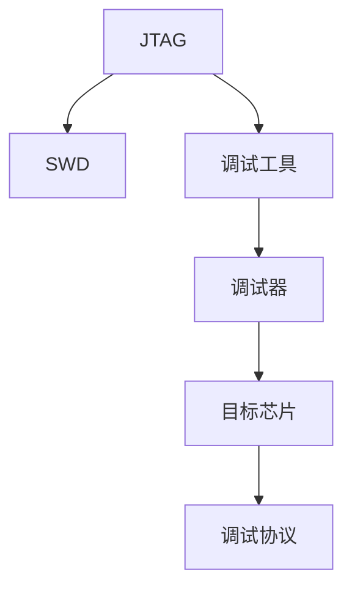

                 

# 嵌入式系统调试技巧：使用 JTAG 和 SWD

## 1. 背景介绍

### 1.1 问题由来

在嵌入式系统的开发和测试过程中，调试是至关重要的环节。传统的调试方式如通过console串口输出日志、设置断点、单步执行等方法，虽然能提供一定的信息，但对于复杂的系统来说，效率较低，且难以定位问题。此时，JTAG和SWD等调试接口技术应运而生，为嵌入式系统的调试提供了更为高效、灵活和全面的解决方案。

### 1.2 问题核心关键点

JTAG（Joint Test Action Group）和SWD（Serial Wire Debug）是两种常用的嵌入式调试接口技术，广泛应用于各种微控制器、FPGA和ASIC中。它们通过提供高性能、高效率的调试手段，支持复杂的调试任务，如单步调试、变量查看、内存访问、逻辑分析和状态监控等。

## 2. 核心概念与联系

### 2.1 核心概念概述

为了更好地理解JTAG和SWD的原理及其在嵌入式调试中的应用，本节将介绍几个密切相关的核心概念：

- **JTAG**：一种通用的标准接口，用于芯片测试和调试，具有全功能的调试能力，如串行逻辑分析、存储器访问等。JTAG接口标准由IEEE 1149.1定义，包括多个引脚，如TDI、TCK、TMS、TDO、GND、VCC等。

- **SWD**：一种串行调试接口，用于在嵌入式系统中进行快速、低成本的调试。SWD协议由IEEE 1149.1-2009定义，通常使用4个引脚，包括TDI、TCK、TMS、TDO。SWD支持部分JTAG功能，如单步调试、变量监控等，但更注重速度和灵活性。

- **调试工具**：JTAG和SWD通常通过专用的调试工具实现，如STLink、J-Link、Lauterbach等。这些工具支持多种芯片，能够通过串行总线与目标设备通信，实现全面的调试功能。

- **调试器**：调试器是一种应用程序，通过串行总线与调试工具通信，实现对目标芯片的远程调试。调试器通常提供图形化的界面和丰富的功能，支持断点设置、变量查看、内存操作等。

- **调试协议**：JTAG和SWD使用的调试协议是IEEE 1149.1标准，它定义了调试过程的各个阶段、操作码和响应码，确保调试数据的可靠传输。

这些核心概念之间的逻辑关系可以通过以下Mermaid流程图来展示：



这个流程图展示了大语言模型的核心概念及其之间的关系：

1. JTAG和SWD作为接口技术，支持对目标芯片的调试。
2. 调试工具通过串行总线与目标芯片通信，实现对JTAG和SWD协议的支持。
3. 调试器通过调试工具与目标芯片进行通信，实现对调试协议的调用。
4. 调试协议是JTAG和SWD调试过程中必不可少的一部分，确保数据传输的准确性。

## 3. 核心算法原理 & 具体操作步骤

### 3.1 算法原理概述

JTAG和SWD的调试原理基于IEEE 1149.1标准，通过特定的调试协议实现对目标芯片的监控和控制。调试过程通常包括以下几个阶段：

1. **连接建立**：通过调试器与调试工具的通信，建立与目标芯片的连接。
2. **芯片选择**：通过目标芯片的ID号或其他标识符进行选择。
3. **调试配置**：根据调试任务的需求，配置调试器与目标芯片的参数，如调试模式、断点设置、寄存器读写等。
4. **调试执行**：通过调试器发送调试命令，目标芯片执行相应的操作，并返回结果。
5. **调试终止**：完成调试任务后，断开与目标芯片的连接。

JTAG和SWD的调试过程使用特殊的调试协议，包括JTAG的ABPI协议和SWD的SWD协议。这些协议通过定义操作码和响应码，确保调试命令和数据的可靠传输。

### 3.2 算法步骤详解

以下详细讲解JTAG和SWD调试的各个步骤：

#### 3.2.1 连接建立

1. **硬件连接**：将调试器通过串行总线与目标芯片连接。JTAG通常使用14个引脚，SWD通常使用4个引脚。
2. **软件配置**：调试器通过驱动程序与调试工具建立连接，配置调试参数。例如，设置调试速度、调试模式、芯片标识符等。

#### 3.2.2 芯片选择

1. **读取ID码**：通过调试器发送读ID命令，目标芯片返回其ID码。
2. **选择芯片**：根据芯片ID码或其他标识符，调试器选择相应的目标芯片。

#### 3.2.3 调试配置

1. **设置断点**：在调试器界面设置断点，调试器将断点信息发送给调试工具。
2. **配置寄存器**：通过调试器发送读写寄存器的命令，设置调试配置。

#### 3.2.4 调试执行

1. **单步调试**：通过调试器发送单步执行命令，目标芯片执行相应操作，并返回状态。
2. **变量查看**：通过调试器发送读取变量命令，目标芯片返回变量的值。
3. **内存访问**：通过调试器发送读写内存命令，目标芯片执行相应的操作，并返回结果。

#### 3.2.5 调试终止

1. **断开连接**：完成调试任务后，调试器发送终止命令，断开与目标芯片的连接。

### 3.3 算法优缺点

JTAG和SWD接口技术在嵌入式系统调试中具有以下优点：

1. **全功能调试**：JTAG支持全面的调试功能，包括逻辑分析、存储器访问等。SWD虽然部分功能，但速度快、成本低，适合复杂芯片的调试。
2. **高效灵活**：通过调试工具和调试器，可以实现远程调试，方便快速定位和修复问题。
3. **易于集成**：JTAG和SWD接口标准通用，支持多种芯片，易于集成到不同的系统中。
4. **故障诊断**：通过调试器提供的分析工具，可以方便地进行系统性能分析和故障诊断。

同时，这些技术也存在一些局限性：

1. **速度较慢**：相比于传统的console调试方式，JTAG和SWD的调试速度较慢，尤其是在大规模系统中。
2. **调试成本较高**：高质量的调试工具和设备较贵，增加了调试成本。
3. **连接复杂**：硬件连接和软件配置较为复杂，需要一定的技术基础。

### 3.4 算法应用领域

JTAG和SWD技术在嵌入式系统调试中得到了广泛应用，覆盖了以下多个领域：

1. **微控制器调试**：通过JTAG和SWD接口，可以对各种微控制器进行全面调试，如ATmega、STM32、NXP等。
2. **FPGA和ASIC调试**：JTAG和SWD接口支持FPGA和ASIC的调试，如Xilinx、Altera等。
3. **系统测试**：在嵌入式系统的开发和测试过程中，通过JTAG和SWD接口进行系统测试，确保系统功能的正确性。
4. **单板调试**：对单板硬件进行调试和测试，如嵌入式软件、固件等。

## 4. 数学模型和公式 & 详细讲解 & 举例说明

### 4.1 数学模型构建

JTAG和SWD的调试过程可以使用数学模型来描述，其中调试命令和响应码是关键部分。以下是JTAG和SWD协议的简要描述：

- **JTAG协议**：包括TDI、TCK、TMS、TDO四个引脚。调试器通过调试工具发送调试命令，目标芯片返回响应码。
- **SWD协议**：包括TDI、TCK、TMS、TDO四个引脚。调试器通过调试工具发送调试命令，目标芯片返回响应码。

### 4.2 公式推导过程

JTAG和SWD协议的调试命令和响应码可以表示为如下形式：

$$
\text{Command} = \text{OpCode} + \text{Address} + \text{Data}
$$

其中，OpCode表示操作码，Address表示地址，Data表示数据。例如，JTAG的TPID命令格式为：

$$
\text{TPID} = 0x70 + \text{Address} + \text{Data}
$$

响应码同样由操作码、地址和数据组成，例如JTAG的TPID响应码格式为：

$$
\text{TPID响应} = \text{OpCode} + \text{Address} + \text{Data}
$$

### 4.3 案例分析与讲解

以下是一个JTAG调试的案例分析：

假设我们需要调试一个STM32芯片，使用JTAG接口进行调试。

1. **硬件连接**：将JTAG调试器通过14个引脚与STM32芯片连接。
2. **软件配置**：在调试工具中配置芯片型号、调试速度、调试模式等参数。
3. **芯片选择**：通过调试器读取STM32的ID码，并选择相应的芯片。
4. **调试配置**：设置断点，配置寄存器，进行调试配置。
5. **调试执行**：执行单步调试、变量查看等操作，观察调试结果。
6. **调试终止**：完成调试任务后，断开与STM32芯片的连接。

## 5. 项目实践：代码实例和详细解释说明

### 5.1 开发环境搭建

在进行JTAG和SWD调试的实践前，我们需要准备好开发环境。以下是使用STLink调试STM32芯片的环境配置流程：

1. 安装STLink V2 USB-to-JTAG调试器，确保其工作正常。
2. 安装STM32CubeIDE集成开发环境（IDE），配置STLink调试器。
3. 安装GDB调试器，并进行配置，确保能够与STLink调试器通信。
4. 安装JTAG调试工具，如ST-Link Utility、STM32CubeProgrammer等。

完成上述步骤后，即可在STM32CubeIDE中进行JTAG调试实践。

### 5.2 源代码详细实现

以下是使用GDB在STM32芯片上通过JTAG进行调试的代码实现。

```c
#include <stdio.h>
#include <stdbool.h>
#include <string.h>
#include <sys/types.h>
#include <unistd.h>
#include <gdbserver.h>

// 调试器初始化
void init_gdbserver(const char *gdbserver_addr, int gdbserver_port) {
    char gdbserver_path[] = "/path/to/stm32cubeide/gdbserver";
    gdbserver_init(gdbserver_path, gdbserver_addr, gdbserver_port, NULL, 0);
}

// 调试器运行函数
void run_gdbserver() {
    int gdbserver_fd = gdbserver_start(gdbserver_addr, gdbserver_port, NULL, 0);
    while (true) {
        gdbserver_process();
    }
}

// 调试器结束函数
void stop_gdbserver() {
    gdbserver_stop();
}

int main() {
    const char *gdbserver_addr = "localhost";
    const int gdbserver_port = 3333;
    init_gdbserver(gdbserver_addr, gdbserver_port);
    run_gdbserver();
    stop_gdbserver();
    return 0;
}
```

### 5.3 代码解读与分析

让我们再详细解读一下关键代码的实现细节：

**init_gdbserver函数**：
- `init_gdbserver`函数初始化调试器，打开GDB服务器，并配置调试参数。

**run_gdbserver函数**：
- `run_gdbserver`函数启动GDB服务器，进入循环，不断处理调试任务，直至收到终止命令。

**stop_gdbserver函数**：
- `stop_gdbserver`函数停止GDB服务器，释放资源。

在实际应用中，我们通常需要调试器与调试工具配合使用。通过调试工具（如STM32CubeIDE）配置调试参数，启动调试器，并发送调试命令。调试器通过JTAG接口与目标芯片通信，执行相应的调试操作，并将结果返回给调试工具。调试工具根据结果更新调试界面，方便开发者进行实时监控和调试。

## 6. 实际应用场景

### 6.1 嵌入式系统测试

JTAG和SWD技术在嵌入式系统的测试过程中得到了广泛应用。通过JTAG和SWD接口，可以对嵌入式系统进行全面的测试，包括功能测试、性能测试、稳定性测试等。在测试过程中，调试器可以实时监控系统状态，发现和定位问题，确保系统的可靠性。

### 6.2 单板调试

在嵌入式硬件开发中，单板调试是必不可少的环节。JTAG和SWD接口支持单板调试，开发者可以方便地进行硬件测试、固件调试等。例如，在开发STM32单板时，可以使用JTAG接口对单板进行全面的调试，确保系统正常工作。

### 6.3 系统优化

嵌入式系统的优化通常涉及硬件和软件两个方面。JTAG和SWD接口支持硬件和软件的调试，可以帮助开发者进行系统优化。例如，通过调试器对系统性能进行监控，发现和优化瓶颈，提升系统性能。

### 6.4 未来应用展望

随着嵌入式系统的不断发展和复杂化，JTAG和SWD接口技术将得到更广泛的应用。未来，JTAG和SWD技术将与其他新兴技术结合，如FPGA、ASIC、IoT等，为嵌入式系统的开发和测试提供更强大的支持。

## 7. 工具和资源推荐

### 7.1 学习资源推荐

为了帮助开发者系统掌握JTAG和SWD技术的理论基础和实践技巧，这里推荐一些优质的学习资源：

1. IEEE 1149.1标准文档：了解JTAG和SWD接口技术的标准和规范。
2. STLink官方文档：STLink调试器的官方文档，提供详细的配置和使用方法。
3. Lauterbach官方文档：Lauterbach调试器的官方文档，提供丰富的功能和应用案例。
4. STMicroelectronics嵌入式系统开发指南：STMicroelectronics提供的嵌入式系统开发指南，涵盖JTAG和SWD接口技术的应用。

通过对这些资源的学习实践，相信你一定能够快速掌握JTAG和SWD技术的精髓，并用于解决实际的嵌入式系统问题。

### 7.2 开发工具推荐

高效的开发离不开优秀的工具支持。以下是几款用于JTAG和SWD调试开发的常用工具：

1. STLink V2：STMicroelectronics提供的STM32芯片JTAG调试器。
2. J-Link：Lauterbach提供的调试工具，支持多种芯片的调试。
3. Lauterbach调试器：Lauterbach提供的调试工具，支持多种芯片的调试。
4. ST-Link Utility：STMicroelectronics提供的STLink调试器管理工具。
5. STM32CubeIDE：STMicroelectronics提供的嵌入式系统开发环境，支持JTAG和SWD接口的调试。

合理利用这些工具，可以显著提升嵌入式系统调试的效率和质量，加快创新迭代的步伐。

### 7.3 相关论文推荐

JTAG和SWD技术的发展源于学界的持续研究。以下是几篇奠基性的相关论文，推荐阅读：

1. JTAG技术标准IEEE 1149.1：JTAG技术标准的制定和改进。
2. SWD技术标准IEEE 1149.1-2009：SWD技术标准的制定和改进。
3. JTAG与SWD接口的对比研究：比较JTAG和SWD接口的优缺点和应用场景。
4. JTAG和SWD接口在嵌入式系统中的应用：探讨JTAG和SWD接口在嵌入式系统中的具体应用。

这些论文代表了大语言模型微调技术的发展脉络。通过学习这些前沿成果，可以帮助研究者把握学科前进方向，激发更多的创新灵感。

## 8. 总结：未来发展趋势与挑战

### 8.1 总结

本文对JTAG和SWD接口技术在嵌入式系统调试中的应用进行了全面系统的介绍。首先阐述了JTAG和SWD接口技术的背景和意义，明确了其在嵌入式系统调试中的重要价值。其次，从原理到实践，详细讲解了JTAG和SWD接口技术的调试过程，给出了完整的调试代码实现。同时，本文还广泛探讨了JTAG和SWD接口技术在嵌入式系统测试、单板调试、系统优化等多个领域的应用前景，展示了其广阔的适用性。此外，本文精选了JTAG和SWD技术的各类学习资源，力求为读者提供全方位的技术指引。

通过本文的系统梳理，可以看到，JTAG和SWD接口技术为嵌入式系统的调试提供了高效、灵活的解决方案，显著提高了系统开发和测试的效率。未来，伴随JTAG和SWD技术的不断演进，嵌入式系统的调试和测试将更加智能化、自动化，为系统性能和质量的提升带来新的机遇。

### 8.2 未来发展趋势

展望未来，JTAG和SWD接口技术将呈现以下几个发展趋势：

1. **速度和性能提升**：随着硬件技术的发展，JTAG和SWD接口的速度和性能将不断提升，支持更多的调试功能和更复杂的调试任务。
2. **智能化和自动化**：未来的JTAG和SWD接口技术将支持更智能化的调试过程，如自动定位问题、智能推荐调试方案等。
3. **多接口支持**：未来的调试接口将支持多种协议和标准，如JTAG、SWD、USB、IEEE 802.15.4等，满足不同应用场景的需求。
4. **嵌入式系统集成**：JTAG和SWD接口技术将进一步集成到嵌入式系统中，提升系统的调试和测试能力。
5. **安全性和可靠性增强**：未来的调试接口将更加注重安全性和可靠性，确保系统调试过程的安全和稳定。

这些趋势凸显了JTAG和SWD接口技术的广阔前景。这些方向的探索发展，必将进一步提升嵌入式系统调试的效率和质量，为系统性能和质量的提升带来新的机遇。

### 8.3 面临的挑战

尽管JTAG和SWD接口技术在嵌入式系统调试中已经取得了显著成就，但在迈向更加智能化、普适化应用的过程中，它仍面临诸多挑战：

1. **硬件成本高**：高质量的调试工具和设备较贵，增加了调试成本。
2. **软件配置复杂**：调试器与调试工具的配置较为复杂，需要一定的技术基础。
3. **调试速度慢**：相比于传统的console调试方式，JTAG和SWD的调试速度较慢，尤其是在大规模系统中。
4. **兼容性问题**：不同厂商的芯片和调试工具可能存在兼容性问题，增加了调试难度。
5. **系统集成困难**：嵌入式系统的集成复杂，调试接口的集成也需要考虑系统架构和接口规范。

正视JTAG和SWD接口技术面临的这些挑战，积极应对并寻求突破，将是在嵌入式系统调试中实现智能化、高效化的必由之路。相信随着学界和产业界的共同努力，这些挑战终将一一被克服，JTAG和SWD接口技术必将在嵌入式系统调试中发挥更大的作用。

### 8.4 研究展望

面对JTAG和SWD接口技术所面临的种种挑战，未来的研究需要在以下几个方面寻求新的突破：

1. **硬件优化**：开发更高效、低成本的硬件解决方案，如高性能FPGA芯片、低功耗调试接口等。
2. **软件优化**：开发更智能、易用的软件工具，如自动化调试工具、智能调试助手等。
3. **接口标准化**：推动JTAG和SWD接口技术标准的统一和国际化，促进不同厂商芯片的兼容。
4. **系统集成**：探索JTAG和SWD接口技术与其他技术的集成应用，如嵌入式系统集成、IoT系统集成等。
5. **智能化调试**：引入人工智能、机器学习等技术，提升调试过程的智能化水平，实现自动定位和调试。

这些研究方向的研究突破，将为嵌入式系统调试带来新的机遇，推动嵌入式系统的智能化、自动化发展。面向未来，JTAG和SWD接口技术需要在硬件、软件、标准化、集成和智能化等多个方面协同发力，共同推动嵌入式系统调试技术的进步。

## 9. 附录：常见问题与解答

**Q1：如何使用JTAG和SWD接口进行调试？**

A: 使用JTAG和SWD接口进行调试的基本步骤如下：

1. 硬件连接：将调试器通过串行总线与目标芯片连接。
2. 软件配置：调试器通过调试工具配置芯片型号、调试速度、调试模式等参数。
3. 芯片选择：通过调试器读取目标芯片的ID码，并选择相应的芯片。
4. 调试配置：在调试器界面设置断点、配置寄存器等。
5. 调试执行：执行单步调试、变量查看等操作，观察调试结果。
6. 调试终止：完成调试任务后，关闭调试器与目标芯片的连接。

**Q2：JTAG和SWD接口的调试速度和性能如何？**

A: JTAG和SWD接口的调试速度和性能取决于多种因素，如芯片型号、调试器性能、串行总线速率等。通常情况下，JTAG接口的调试速度较慢，SWD接口的调试速度较快。但SWD接口的调试能力有限，无法支持JTAG的全部功能。

**Q3：JTAG和SWD接口支持哪些芯片？**

A: JTAG和SWD接口支持多种芯片，包括各种微控制器、FPGA、ASIC等。具体支持芯片需要查看芯片的官方文档，或通过调试工具进行配置。

**Q4：如何进行JTAG和SWD接口的故障诊断？**

A: 使用调试器提供的分析工具，如逻辑分析、内存监控等，可以方便地进行系统性能分析和故障诊断。通过分析调试器的输出信息，定位问题并进行修复。

**Q5：JTAG和SWD接口的调试安全性如何？**

A: JTAG和SWD接口的调试安全性取决于多种因素，如调试器的安全性、调试工具的安全性等。通常情况下，需要加强安全措施，如访问鉴权、数据加密等，确保调试过程的安全性。

---

作者：禅与计算机程序设计艺术 / Zen and the Art of Computer Programming

