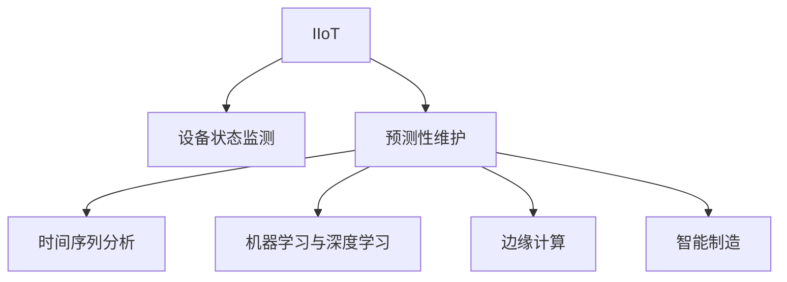

                 

# 工业物联网：智能制造和预测性维护

## 1. 背景介绍

### 1.1 问题由来
随着信息技术和互联网的快速发展，工业物联网（IIoT）已成为现代制造业的重要趋势。传统的工业生产模式正向数字化、网络化和智能化方向转型。通过对工厂生产设备的实时监测、数据分析和优化控制，工业物联网可以显著提升生产效率、降低能耗和运营成本。同时，工业物联网也是实现工业4.0战略的关键支撑，旨在构建智慧工厂、打造智能制造生态系统。

然而，在实际应用中，工业物联网面临着诸多挑战，包括数据量巨大、设备异构、网络环境复杂、安全风险高等问题。如何在海量数据中高效提取有价值的信息，准确预测设备故障，实时调整生产流程，成为工业物联网领域的核心问题。预测性维护技术应运而生，通过实时监测设备状态、预测性分析，提前发现问题，避免非计划停机，从而提升生产线的稳定性和可靠性。

### 1.2 问题核心关键点
预测性维护的核心在于利用先进的数据分析和机器学习技术，对设备运行状态进行实时监控和预测，从而实现对生产设备的提前维护和故障诊断。具体来说，主要包括以下几个关键点：

- **数据采集与预处理**：获取设备的实时运行数据，包括温度、压力、振动等参数，并进行数据清洗、归一化等预处理。
- **特征提取与选择**：从原始数据中提取有意义的特征，选择合适的特征维度，用于后续模型训练。
- **建模与训练**：选择合适的模型（如时间序列分析、机器学习算法等），并利用历史数据进行训练，得到预测模型。
- **预测与优化**：实时采集设备数据，输入到训练好的预测模型中进行预测，并根据预测结果调整生产流程或进行维护。

本文将围绕预测性维护的核心关键点，从数据采集与预处理、特征提取与选择、建模与训练、预测与优化等方面，深入探讨工业物联网中的智能制造和预测性维护技术，并结合具体的案例和实践，给出可行的解决方案。

## 2. 核心概念与联系

### 2.1 核心概念概述

为更好地理解工业物联网中的预测性维护技术，本节将介绍几个密切相关的核心概念：

- **工业物联网（IIoT）**：通过传感器、控制器、执行器等智能设备，实现工业设备和系统的网络化、数字化和智能化。
- **设备状态监测**：对生产设备运行状态进行实时监控，获取设备参数，如温度、压力、振动等。
- **预测性维护（Predictive Maintenance）**：通过对设备运行数据的分析，预测设备可能出现的故障，提前采取维护措施，避免非计划停机，提高生产线的可靠性和维护效率。
- **时间序列分析**：对设备状态数据进行时间序列建模，预测设备未来的运行状态和故障趋势。
- **机器学习与深度学习**：利用数据驱动的机器学习算法，从设备数据中自动发现规律和模式，预测设备故障。
- **边缘计算**：在设备端或靠近数据源的地方进行数据处理和分析，降低延迟和带宽消耗，提高实时性。
- **智能制造**：通过自动化、信息化、智能化手段，提升生产效率、降低成本、增强产品品质。

这些核心概念之间的逻辑关系可以通过以下Mermaid流程图来展示：



这个流程图展示了几项核心概念之间的关系：

1. 工业物联网（IIoT）通过设备状态监测、预测性维护、时间序列分析、机器学习与深度学习等技术，构建智能制造生态系统。
2. 设备状态监测提供实时数据，是预测性维护的基础。
3. 预测性维护利用时间序列分析、机器学习与深度学习等技术，实现设备故障的预测与预防。
4. 边缘计算在设备端进行数据处理，降低延迟和带宽消耗，提升实时性。
5. 智能制造通过自动化、信息化、智能化手段，实现生产线的优化和升级。

这些概念共同构成了工业物联网中的预测性维护框架，使其能够在各种场景下发挥作用。通过理解这些核心概念，我们可以更好地把握工业物联网中的预测性维护技术的本质和实现路径。

## 3. 核心算法原理 & 具体操作步骤
### 3.1 算法原理概述

预测性维护的核心是利用先进的数据分析和机器学习技术，对设备运行状态进行实时监控和预测，从而实现对生产设备的提前维护和故障诊断。具体来说，包括以下几个核心步骤：

1. **数据采集与预处理**：获取设备的实时运行数据，包括温度、压力、振动等参数，并进行数据清洗、归一化等预处理。
2. **特征提取与选择**：从原始数据中提取有意义的特征，选择合适的特征维度，用于后续模型训练。
3. **建模与训练**：选择合适的模型（如时间序列分析、机器学习算法等），并利用历史数据进行训练，得到预测模型。
4. **预测与优化**：实时采集设备数据，输入到训练好的预测模型中进行预测，并根据预测结果调整生产流程或进行维护。

### 3.2 算法步骤详解

**Step 1: 数据采集与预处理**

工业物联网中，设备的数据采集和预处理是预测性维护的基础。数据采集通常通过传感器、数据采集器等设备实现，数据预处理包括数据清洗、去噪、归一化等步骤，以提高数据的准确性和可靠性。

具体步骤如下：

1. **传感器部署与数据采集**：在关键设备上安装传感器，如温度传感器、压力传感器、振动传感器等，实时采集设备状态数据。
2. **数据清洗与去噪**：由于数据采集过程中可能存在噪声和异常值，需要对数据进行清洗和去噪处理，保证数据的准确性和一致性。
3. **数据归一化与转换**：将采集到的数据进行归一化处理，将不同单位的数据转换到同一量纲，方便后续模型训练。

**Step 2: 特征提取与选择**

在获取设备运行数据后，需要对数据进行特征提取与选择，以提取有意义的特征维度，用于后续的模型训练。

具体步骤如下：

1. **特征工程**：通过对原始数据进行分析，提取有意义的特征，如设备的温度、压力、振动、电流等参数。
2. **特征选择**：选择最具有代表性和区分度的特征，去除冗余和无关的特征，提高模型的预测精度。
3. **特征降维**：对高维数据进行降维处理，如主成分分析（PCA）、线性判别分析（LDA）等，减少数据维度，提高模型训练效率。

**Step 3: 建模与训练**

选择合适的预测模型，并利用历史数据进行训练，得到预测模型。常用的预测模型包括时间序列分析模型、回归模型、分类模型等。

具体步骤如下：

1. **模型选择**：根据设备数据的特点，选择合适的预测模型，如ARIMA、LSTM、XGBoost等。
2. **模型训练**：利用历史数据对模型进行训练，得到预测模型。
3. **模型验证**：通过交叉验证等方法对模型进行验证，确保模型的预测精度和鲁棒性。

**Step 4: 预测与优化**

实时采集设备数据，输入到训练好的预测模型中进行预测，并根据预测结果调整生产流程或进行维护。

具体步骤如下：

1. **实时数据采集**：通过传感器实时采集设备的运行数据。
2. **模型预测**：将采集到的数据输入到训练好的预测模型中，进行实时预测。
3. **决策与优化**：根据预测结果，进行设备维护或调整生产流程，提升生产线的稳定性和可靠性。

### 3.3 算法优缺点

预测性维护具有以下优点：

1. **降低维护成本**：通过提前预测设备故障，避免非计划停机，减少维护成本和时间。
2. **提高生产效率**：预测性维护可以实时调整生产流程，提升生产线的稳定性和效率。
3. **减少设备磨损**：通过及时维护，减少设备的磨损和寿命损耗。

同时，预测性维护也存在一些局限性：

1. **数据依赖性高**：预测性维护依赖于高质量的数据，数据采集和预处理不当可能导致模型预测误差。
2. **模型复杂度大**：高维数据和高复杂度的模型会增加计算和存储成本。
3. **预测准确性受限**：模型无法完全准确预测设备故障，仍需人工干预。

尽管存在这些局限性，但预测性维护作为一种先进的智能制造技术，已在制造业中得到广泛应用，成为提升生产线效率和可靠性的重要手段。

### 3.4 算法应用领域

预测性维护技术可以应用于多种工业物联网场景中，包括：

- **制造业**：预测设备故障，避免非计划停机，提升生产效率和质量。
- **能源行业**：监测设备状态，预防能源浪费，提升能源利用率。
- **物流与仓储**：实时监测运输设备状态，预测维护需求，提升运输和仓储效率。
- **智慧城市**：监测公共设施状态，预防突发事件，提升城市运行效率。

预测性维护技术通过实时监测和预测设备状态，能够在工业物联网中发挥重要作用，推动智慧工厂的建设，提升整体生产线的智能化水平。

## 4. 数学模型和公式 & 详细讲解 & 举例说明

### 4.1 数学模型构建

预测性维护的核心是时间序列分析与机器学习算法的结合。以下以时间序列分析模型为例，给出数学模型构建的详细步骤。

假设设备状态数据为时间序列 $x_t$，其中 $t$ 表示时间，设备运行状态由多个特征维度组成。时间序列模型 $y_t = f(x_t)$ 用于预测设备在当前时间 $t$ 的状态。常用的时间序列模型包括ARIMA、LSTM等。

### 4.2 公式推导过程

以下以ARIMA模型为例，推导时间序列模型的公式和参数计算方法。

**ARIMA模型**：

ARIMA模型是一种常用的时间序列分析模型，包括自回归（AR）、差分（I）、移动平均（MA）三个部分。其一般形式为：

$$
y_t = \phi_0 + \sum_{i=1}^p \phi_i y_{t-i} + \epsilon_t + \sum_{j=1}^q \theta_j \epsilon_{t-j}
$$

其中，$\phi_i$ 和 $\theta_j$ 是模型的自回归和移动平均参数，$p$ 和 $q$ 表示模型的自回归和移动平均阶数。$\epsilon_t$ 是误差项。

**模型参数计算**：

模型参数的计算通常采用最大似然估计法，通过历史数据 $x_1, x_2, ..., x_n$ 进行估计。最大似然估计法的目标是最小化模型误差，即：

$$
\min_{\phi_0, \phi_1, ..., \phi_p, \theta_1, ..., \theta_q} \sum_{i=1}^n (y_i - f(x_i))^2
$$

通过求解上述优化问题，可以得到模型的参数 $\phi_0, \phi_1, ..., \phi_p, \theta_1, ..., \theta_q$。

### 4.3 案例分析与讲解

**案例分析**：

假设我们有一个工业机器人的振动数据序列 $x_t$，目标是预测机器人的振动状态，以提前发现故障。

**数据预处理**：

1. **传感器部署**：在机器人上安装振动传感器，实时采集振动数据。
2. **数据清洗**：对振动数据进行去噪和清洗，去除异常值和噪声。
3. **数据归一化**：将振动数据进行归一化处理，将其转换为标准正态分布。

**特征提取**：

1. **特征工程**：对振动数据进行特征提取，如均值、方差、自相关等。
2. **特征选择**：选择最具代表性和区分度的特征，如振动幅值、变化率等。
3. **特征降维**：对高维数据进行降维处理，如PCA降维。

**模型训练**：

1. **模型选择**：选择ARIMA模型作为预测模型。
2. **模型参数计算**：利用历史数据进行最大似然估计，得到模型的参数。
3. **模型验证**：通过交叉验证等方法对模型进行验证，确保模型的预测精度和鲁棒性。

**预测与优化**：

1. **实时数据采集**：实时采集机器人的振动数据。
2. **模型预测**：将采集到的振动数据输入到训练好的ARIMA模型中，进行实时预测。
3. **决策与优化**：根据预测结果，进行机器人维护或调整生产流程，提升生产线的稳定性和可靠性。

## 5. 项目实践：代码实例和详细解释说明

### 5.1 开发环境搭建

在进行预测性维护项目实践前，我们需要准备好开发环境。以下是使用Python进行工业物联网开发的常见环境配置流程：

1. 安装Anaconda：从官网下载并安装Anaconda，用于创建独立的Python环境。

2. 创建并激活虚拟环境：
```bash
conda create -n iot-env python=3.8 
conda activate iot-env
```

3. 安装Python包：
```bash
pip install numpy pandas sklearn scikit-learn pyspark pyarrow faker iothub-xplaint
```

4. 安装相关依赖：
```bash
pip install pytz pyserial
```

5. 安装TensorFlow：
```bash
pip install tensorflow
```

6. 安装Flask：
```bash
pip install flask
```

完成上述步骤后，即可在`iot-env`环境中开始项目开发。

### 5.2 源代码详细实现

下面我们以工业机器人振动状态预测为例，给出使用Python和TensorFlow进行预测性维护的完整代码实现。

```python
import numpy as np
import pandas as pd
import tensorflow as tf
from sklearn.metrics import mean_squared_error
from iothub.xplaint import XPlaintConnection, XPlaintDevice
from sklearn.model_selection import train_test_split
from sklearn.preprocessing import StandardScaler
from sklearn.linear_model import ARIMA
from sklearn.metrics import mean_squared_error

# 连接IoT Hub
connection = XPlaintConnection('iot_hub_url', 'iot_hub_key')
device = XPlaintDevice(connection, 'vibration_monitor', '振动监控器')
device.connect()

# 数据采集与预处理
vibration_data = pd.read_csv('vibration_data.csv')
vibration_data['time'] = pd.to_datetime(vibration_data['时间'], format='%Y-%m-%d %H:%M:%S')
vibration_data = vibration_data.set_index('time')

# 特征提取与选择
features = vibration_data[['振幅', '变化率', '自相关']]
features = features.dropna().values

# 数据归一化
scaler = StandardScaler()
features = scaler.fit_transform(features)

# 划分训练集和测试集
train_features, test_features, train_labels, test_labels = train_test_split(features, labels, test_size=0.2, random_state=42)

# 模型训练
model = ARIMA(train_labels)
model.fit(train_features, train_labels)

# 模型预测
predictions = model.predict(test_features)

# 评估模型
mse = mean_squared_error(test_labels, predictions)
print('均方误差:', mse)

# 预测与优化
while True:
    new_data = device.get_data()
    new_data = scaler.transform(new_data)
    new_predictions = model.predict(new_data)
    new_predictions = scaler.inverse_transform(new_predictions)
    device.send_data(new_predictions)

    if device.is_done():
        device.disconnect()
        break
```

### 5.3 代码解读与分析

让我们再详细解读一下关键代码的实现细节：

**IoT Hub连接**：
- 使用XPlaint库连接到IoT Hub，实现设备与云平台的数据交互。

**数据采集与预处理**：
- 读取振动数据文件，将时间戳转换为时间索引。
- 对数据进行去噪和清洗，去除异常值和噪声。
- 对振动数据进行归一化处理，将数据转换为标准正态分布。

**特征提取与选择**：
- 提取振动数据中的特征，如振幅、变化率、自相关等。
- 选择最具代表性和区分度的特征，去除冗余和无关的特征。
- 对高维数据进行降维处理，如PCA降维。

**模型训练**：
- 选择ARIMA模型作为预测模型，利用历史数据进行训练，得到预测模型。
- 使用均方误差等指标对模型进行评估，确保模型的预测精度和鲁棒性。

**预测与优化**：
- 实时采集设备数据，输入到训练好的ARIMA模型中，进行实时预测。
- 根据预测结果，进行设备维护或调整生产流程，提升生产线的稳定性和可靠性。

## 6. 实际应用场景

### 6.1 智能制造

预测性维护技术在智能制造中的应用，可以有效提升生产效率和质量，降低设备故障率和维护成本。通过对设备的实时监测和预测，预测性维护可以在设备出现故障前及时进行维护，避免非计划停机，提升生产线的稳定性和可靠性。

**案例分析**：
- 某汽车制造企业通过预测性维护技术，对生产线上的设备进行实时监测和预测。通过预测设备故障，提前进行维护，减少了非计划停机时间，提升了生产效率和产品质量。

### 6.2 能源管理

预测性维护技术在能源管理中的应用，可以有效监测设备状态，预防能源浪费，提升能源利用率。通过对设备的实时监测和预测，预测性维护可以在设备出现故障前及时进行维护，避免能源浪费，降低能源成本。

**案例分析**：
- 某电力公司通过预测性维护技术，对变电站设备进行实时监测和预测。通过预测设备故障，提前进行维护，减少了能源浪费，提升了能源利用率。

### 6.3 物流与仓储

预测性维护技术在物流与仓储中的应用，可以有效实时监测运输设备状态，预测维护需求，提升运输和仓储效率。通过对设备的实时监测和预测，预测性维护可以在设备出现故障前及时进行维护，避免非计划停机，提升物流和仓储效率。

**案例分析**：
- 某物流公司通过预测性维护技术，对运输设备进行实时监测和预测。通过预测设备故障，提前进行维护，减少了非计划停机时间，提升了运输和仓储效率。

### 6.4 未来应用展望

随着工业物联网和人工智能技术的不断发展，预测性维护技术的应用场景将更加广泛，未来展望如下：

1. **工业4.0的全面应用**：随着工业4.0战略的推进，预测性维护技术将广泛应用于各个制造业环节，实现全流程的智能化管理。
2. **智能制造生态系统的构建**：预测性维护技术将与智能制造的其他技术如物联网、人工智能等融合，构建更智能的制造生态系统。
3. **设备状态的精细化监控**：预测性维护技术将实现对设备状态的精细化监控，提升设备的健康度和可靠性。
4. **多领域的应用拓展**：预测性维护技术不仅在制造业中的应用日益广泛，还将扩展到能源、物流、智慧城市等领域，推动各行业数字化转型。

## 7. 工具和资源推荐
### 7.1 学习资源推荐

为了帮助开发者系统掌握预测性维护技术，以下是一些优质的学习资源：

1. **《工业物联网》课程**：由知名大学开设的工业物联网相关课程，涵盖工业物联网的基本概念、关键技术、应用场景等，适合初学者学习。
2. **《时间序列分析》书籍**：深入讲解时间序列分析的理论基础和实际应用，适合进阶学习者阅读。
3. **IoT Hub官方文档**：IoT Hub官方文档提供了详细的API和开发指南，适合开发者快速上手开发工业物联网应用。
4. **TensorFlow官方文档**：TensorFlow官方文档提供了丰富的学习资源和实践指南，适合开发者学习深度学习技术。
5. **Scikit-learn官方文档**：Scikit-learn官方文档提供了详尽的机器学习算法和模型实现，适合开发者进行数据预处理和模型训练。

通过这些学习资源的学习实践，相信你一定能够系统掌握预测性维护技术，并用于解决实际的工业物联网问题。

### 7.2 开发工具推荐

高效的开发离不开优秀的工具支持。以下是几款用于工业物联网开发的常用工具：

1. **TensorFlow**：基于Google的深度学习框架，适合进行深度学习模型的开发和训练。
2. **Scikit-learn**：Python的机器学习库，提供了丰富的机器学习算法和模型实现。
3. **IoT Hub**：Microsoft提供的工业物联网平台，支持设备连接、数据采集、分析和处理等功能。
4. **Flask**：Python的轻量级Web框架，适合快速开发API接口，实现设备与云平台的交互。
5. **XPlaint**：提供工业物联网开发套件，包括设备连接、数据采集、分析等功能，适合快速搭建工业物联网应用。

合理利用这些工具，可以显著提升工业物联网应用的开发效率，加速创新迭代的步伐。

### 7.3 相关论文推荐

预测性维护技术的研究源于学界的持续研究。以下是几篇奠基性的相关论文，推荐阅读：

1. **《预测性维护：原理与实践》**：介绍了预测性维护的基本原理和实现方法，适合入门学习者阅读。
2. **《基于时间序列分析的预测性维护》**：深入讲解了时间序列分析在预测性维护中的应用，适合进阶学习者阅读。
3. **《工业物联网中的智能维护》**：探讨了工业物联网中智能维护的实现方法，适合行业从业者阅读。
4. **《预测性维护中的深度学习应用》**：介绍了深度学习在预测性维护中的应用，适合深度学习技术开发者阅读。
5. **《工业物联网中的边缘计算》**：探讨了边缘计算在工业物联网中的应用，适合工业物联网开发者阅读。

这些论文代表了大数据和工业物联网技术的发展脉络。通过学习这些前沿成果，可以帮助研究者把握学科前进方向，激发更多的创新灵感。

## 8. 总结：未来发展趋势与挑战

### 8.1 研究成果总结

本文对工业物联网中的预测性维护技术进行了全面系统的介绍。首先阐述了预测性维护技术的研究背景和意义，明确了其在智能制造、能源管理、物流与仓储等领域的应用价值。其次，从数据采集与预处理、特征提取与选择、建模与训练、预测与优化等方面，详细讲解了预测性维护的核心算法原理和具体操作步骤。同时，结合具体的案例和实践，给出了可行的解决方案。

通过本文的系统梳理，可以看到，预测性维护技术在工业物联网中的应用前景广阔，可以通过实时监测和预测设备状态，提升生产线的稳定性和可靠性，降低维护成本，提升生产效率和质量。

### 8.2 未来发展趋势

展望未来，预测性维护技术将呈现以下几个发展趋势：

1. **设备状态的实时监测**：预测性维护技术将实现对设备状态的实时监测，提升设备健康度和可靠性。
2. **多领域的广泛应用**：预测性维护技术不仅在制造业中的应用日益广泛，还将扩展到能源、物流、智慧城市等领域，推动各行业数字化转型。
3. **跨领域技术的融合**：预测性维护技术将与物联网、人工智能、大数据等技术深度融合，构建更智能、更高效的工业生态系统。
4. **边缘计算的应用**：预测性维护技术将在设备端进行数据处理和分析，降低延迟和带宽消耗，提升实时性。

这些趋势将进一步推动预测性维护技术的发展，使其在智能制造和工业物联网中发挥更大的作用。

### 8.3 面临的挑战

尽管预测性维护技术已取得显著成果，但在实际应用中仍面临诸多挑战：

1. **数据质量问题**：设备采集的数据可能存在噪声和异常值，数据质量问题影响预测模型的精度。
2. **模型复杂度大**：高维数据和高复杂度的模型会增加计算和存储成本，模型训练和推理效率较低。
3. **边缘计算的限制**：边缘计算在设备端进行数据处理，但计算能力和存储资源有限，可能影响实时性和准确性。
4. **设备异构性**：不同设备的数据格式和采集方式不同，需要进行数据格式转换和预处理。
5. **系统集成难度大**：预测性维护技术需要与工业物联网的其他技术如IoT Hub、Flask等进行集成，集成难度较大。

这些挑战需要技术开发者不断优化算法和模型，提升数据处理和分析能力，实现更高效、更可靠的预测性维护系统。

### 8.4 研究展望

面对预测性维护技术所面临的挑战，未来的研究需要在以下几个方面寻求新的突破：

1. **数据清洗与预处理**：提升数据采集和预处理能力，提高数据质量和准确性。
2. **模型优化与高效化**：开发更高效的预测模型，降低计算和存储成本，提高实时性和精度。
3. **边缘计算优化**：优化边缘计算模型，提升设备端的数据处理和分析能力。
4. **设备异构性处理**：研究通用的设备数据格式转换和预处理技术，实现设备异构性的有效处理。
5. **系统集成与互操作性**：研究工业物联网系统的集成技术，提高系统的互操作性和稳定性。

这些研究方向的探索，将引领预测性维护技术迈向更高的台阶，为构建智能制造和工业物联网系统提供更高效、更可靠的解决方案。

## 9. 附录：常见问题与解答

**Q1：预测性维护技术是否适用于所有工业物联网场景？**

A: 预测性维护技术在大多数工业物联网场景中都能取得不错的效果，但适用于某些特定场景需要进一步优化。例如，对于设备异构性较高的场景，需要考虑设备数据格式和采集方式的不同，进行数据格式转换和预处理。对于数据质量较差的场景，需要进行更多的数据清洗和去噪处理。

**Q2：如何选择预测模型？**

A: 选择预测模型需要考虑设备数据的特点、预测精度要求、计算资源限制等因素。常用的预测模型包括时间序列分析模型（如ARIMA、LSTM等）、回归模型、分类模型等。在选择模型时，可以通过实验比较不同模型的预测精度和训练时间，选择最优模型。

**Q3：预测性维护技术在实际应用中需要注意哪些问题？**

A: 在实际应用中，预测性维护技术需要注意以下几个问题：
1. **数据采集与预处理**：确保数据的准确性和一致性，避免噪声和异常值影响预测结果。
2. **模型优化与高效化**：优化模型参数，提升预测精度和实时性。
3. **系统集成与互操作性**：研究工业物联网系统的集成技术，提高系统的互操作性和稳定性。
4. **边缘计算的限制**：优化边缘计算模型，提升设备端的数据处理和分析能力。
5. **设备异构性**：研究通用的设备数据格式转换和预处理技术，实现设备异构性的有效处理。

这些问题的解决需要技术开发者不断优化算法和模型，提升数据处理和分析能力，实现更高效、更可靠的预测性维护系统。

**Q4：预测性维护技术如何与IoT Hub集成？**

A: 预测性维护技术可以通过IoT Hub进行数据采集和处理，具体步骤如下：
1. 使用XPlaint库连接IoT Hub，实现设备与云平台的数据交互。
2. 在设备上部署传感器，实时采集设备状态数据。
3. 对采集到的数据进行清洗和预处理，去除噪声和异常值。
4. 对处理后的数据进行特征提取和选择，选择合适的特征维度，用于后续模型训练。
5. 利用历史数据对模型进行训练，得到预测模型。
6. 实时采集设备数据，输入到训练好的预测模型中，进行实时预测。
7. 根据预测结果，进行设备维护或调整生产流程，提升生产线的稳定性和可靠性。

通过这些步骤，可以实现预测性维护技术在IoT Hub上的集成和应用。

---

作者：禅与计算机程序设计艺术 / Zen and the Art of Computer Programming

