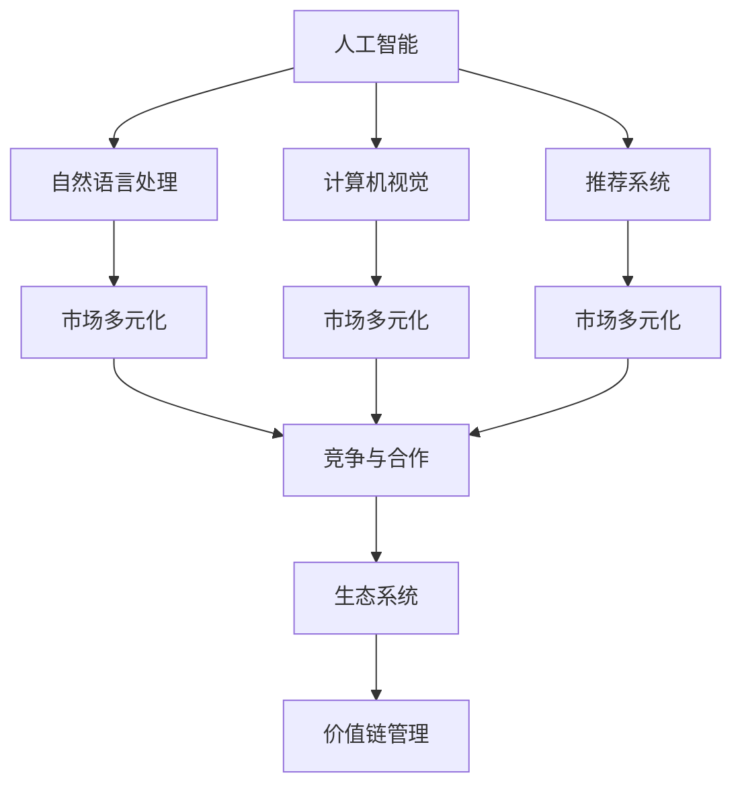

                 

# 市场多元化的益处：贾扬清的观点，竞争推动质量提升与生态发展

## 1. 背景介绍

市场多元化一直是企业发展的重要战略之一。在当今科技飞速发展的时代，企业面临的挑战和机遇都愈发复杂。如何在快速变化的商业环境中，有效利用市场多元化策略，促进企业增长，提升产品质量，构建强大的市场生态，成为众多企业所关注的焦点。贾扬清教授，作为人工智能领域的领军人物，他的研究成果和观点无疑为我们提供了一盏明灯。

### 1.1 市场多元化的定义

市场多元化指的是企业将业务拓展到不同的市场领域，以实现业务增长、风险分散和盈利多样化的策略。这一策略在技术领域尤为明显，特别是在人工智能（AI）和机器学习（ML）领域，由于技术的快速发展和应用场景的广泛性，市场多元化成为了企业应对市场变化、推动技术创新和保持竞争优势的重要手段。

### 1.2 市场多元化的现状

近年来，随着技术的进步和应用场景的扩展，市场多元化成为越来越多企业的选择。特别是在人工智能和机器学习领域，企业纷纷涉足自然语言处理（NLP）、计算机视觉（CV）、推荐系统（RS）等多个子领域。这种多元化策略不仅帮助企业分散了风险，也为新技术的开发和应用提供了广阔的空间。

## 2. 核心概念与联系

### 2.1 核心概念概述

为了更好地理解市场多元化及其在人工智能领域的实际应用，本节将介绍几个密切相关的核心概念：

- **人工智能（AI）**：涵盖了机器学习（ML）、自然语言处理（NLP）、计算机视觉（CV）、推荐系统（RS）等多个子领域的技术，旨在通过算法和模型，模拟人类智能过程，解决复杂问题。
- **市场多元化**：指企业将业务拓展到多个市场领域，以实现业务增长、风险分散和盈利多样化。
- **竞争与合作**：企业之间的竞争与合作，是市场多元化的关键驱动因素。适度的竞争能够推动技术创新，而良好的合作则能促进资源共享和共同进步。
- **生态系统**：指的是由众多利益相关者（如企业、研究机构、政府、用户等）组成的网络，通过相互作用和协调，共同推动技术发展和市场应用。
- **价值链管理**：涉及对企业内部和外部价值链的优化和整合，确保资源的最大化利用，提升整体竞争力。

这些核心概念之间的关系可以通过以下Mermaid流程图来展示：



这个流程图展示了人工智能和其多个子领域如何通过市场多元化策略，在竞争与合作中推动技术和市场生态的发展，最终实现价值链的优化和提升。

## 3. 核心算法原理 & 具体操作步骤

### 3.1 算法原理概述

基于市场多元化的策略，企业在进行人工智能技术研发和应用时，通常采用以下步骤：

1. **技术探索与选择**：根据市场趋势和业务需求，选择适合的技术领域进行研发和应用。
2. **技术开发与优化**：投入资源进行技术开发，优化算法和模型，提升技术性能。
3. **市场推广与销售**：通过市场推广和销售，将技术产品推向市场，满足用户需求。
4. **反馈与迭代**：根据用户反馈和技术市场动态，不断优化和迭代产品，提升用户体验和市场竞争力。

### 3.2 算法步骤详解

市场多元化的实际操作过程，可以概括为以下五个主要步骤：

**Step 1: 技术探索与选择**

企业在决策是否进入某一市场领域时，需要进行详细的技术探索和市场调研。这一步骤主要包括：

1. **技术评估**：评估不同技术领域的潜在价值、技术难度和研发成本。
2. **市场分析**：分析目标市场的需求、竞争状况和潜在用户群体。
3. **风险评估**：评估进入新市场的风险，包括技术风险、市场风险和运营风险。

**Step 2: 技术开发与优化**

选择目标技术领域后，企业需要投入资源进行技术开发和优化。这一步骤主要包括：

1. **组建团队**：组建专业团队，包括数据科学家、软件工程师和领域专家。
2. **数据收集与处理**：收集和处理大量数据，用于模型训练和优化。
3. **模型训练与优化**：使用先进的算法和模型，进行模型训练和优化，提升模型性能。
4. **技术迭代**：根据用户反馈和技术进展，不断迭代和优化模型，保持技术领先。

**Step 3: 市场推广与销售**

技术产品开发完成后，企业需要进行市场推广和销售，确保技术产品能够顺利推向市场。这一步骤主要包括：

1. **市场策略制定**：制定市场推广和销售策略，明确目标用户群体和市场定位。
2. **渠道建设**：建立有效的销售渠道，包括线上和线下渠道。
3. **品牌推广**：通过品牌推广活动，提升产品知名度和市场认知度。
4. **客户关系管理**：建立良好的客户关系，提供优质的客户服务和支持。

**Step 4: 反馈与迭代**

产品推向市场后，企业需要收集用户反馈，并根据反馈进行产品迭代。这一步骤主要包括：

1. **用户反馈收集**：通过各种渠道收集用户反馈，包括用户评论、市场调研和数据分析。
2. **问题识别**：识别产品中存在的问题和不足，确定改进方向。
3. **产品迭代**：根据反馈和问题，进行产品迭代和优化，提升产品性能和用户体验。
4. **市场调整**：根据市场动态和用户反馈，调整市场策略和推广计划。

**Step 5: 持续改进与创新**

市场多元化不仅仅是进入新领域，更是一种持续改进和创新的过程。这一步骤主要包括：

1. **持续创新**：持续关注技术进展和市场需求，进行技术创新和产品优化。
2. **资源整合**：整合内部资源，优化价值链，提升整体竞争力。
3. **生态合作**：与其他企业、研究机构和合作伙伴建立合作关系，共同推动技术发展和市场应用。
4. **风险管理**：建立风险管理体系，有效应对市场变化和技术挑战。

### 3.3 算法优缺点

基于市场多元化的策略，企业在进行人工智能技术研发和应用时，可以带来以下优点：

- **业务增长**：通过进入多个市场领域，分散风险，提升盈利能力。
- **技术创新**：多元化的市场策略能够推动技术研发，提升技术竞争力。
- **市场适应性**：通过覆盖多个市场领域，企业能够更好地适应市场变化，提升市场适应性。
- **资源共享**：通过技术共享和资源整合，优化价值链，提升整体竞争力。

同时，市场多元化也存在以下缺点：

- **资源分散**：多元化策略需要投入大量资源，可能会分散企业资源，影响核心业务的竞争力。
- **管理复杂**：管理多个业务领域，增加了管理难度和复杂性。
- **风险增加**：多元化增加了市场风险，需要建立有效的风险管理体系。

### 3.4 算法应用领域

基于市场多元化的策略，人工智能技术在多个领域得到了广泛应用。以下是几个典型的应用场景：

- **自然语言处理（NLP）**：包括文本分类、情感分析、机器翻译、问答系统等多个子领域。企业通过进入不同市场领域，推出定制化的NLP解决方案，满足不同用户的需求。
- **计算机视觉（CV）**：包括图像识别、人脸识别、视频分析等多个子领域。企业通过多元化策略，推出适用于不同应用场景的CV解决方案，提升市场竞争力。
- **推荐系统（RS）**：包括电商推荐、视频推荐、音乐推荐等多个子领域。企业通过多元化策略，推出适用于不同行业的RS解决方案，提升用户满意度。
- **智能制造**：通过AI技术在制造业中的应用，提升生产效率和质量，降低生产成本。企业通过多元化策略，进入不同制造业领域，推出定制化的智能制造解决方案。

## 4. 数学模型和公式 & 详细讲解 & 举例说明

### 4.1 数学模型构建

在市场多元化的实际应用中，企业通常会面临以下数学模型和公式问题：

1. **成本优化模型**：在多个市场领域中进行资源分配，最小化成本函数。
2. **市场份额模型**：通过市场调研，计算不同市场领域的目标市场份额。
3. **用户满意度模型**：通过用户反馈数据，建立用户满意度模型，提升产品体验。
4. **风险管理模型**：通过市场动态分析，建立风险管理模型，降低市场风险。

### 4.2 公式推导过程

以下以成本优化模型为例，推导其优化公式。

假设企业需要在市场1和市场2中进行资源分配，资源总预算为$B$，市场1和市场2的资源需求分别为$C_1$和$C_2$，目标是最小化成本函数。成本优化模型可以表示为：

$$
\min_{x_1, x_2} C(x_1, x_2) = a_1x_1 + a_2x_2
$$

其中$x_1$和$x_2$分别为市场1和市场2的资源分配比例，$a_1$和$a_2$分别为市场1和市场2的资源成本系数。

根据约束条件$x_1 + x_2 = 1$，可以构建拉格朗日函数：

$$
\mathcal{L}(x_1, x_2, \lambda) = a_1x_1 + a_2x_2 + \lambda(1 - x_1 - x_2)
$$

对$x_1$、$x_2$和$\lambda$求偏导数，得到：

$$
\begin{cases}
\frac{\partial \mathcal{L}}{\partial x_1} = a_1 + \lambda = 0 \\
\frac{\partial \mathcal{L}}{\partial x_2} = a_2 - \lambda = 0 \\
\frac{\partial \mathcal{L}}{\partial \lambda} = 1 - x_1 - x_2 = 0
\end{cases}
$$

解方程组，得到：

$$
x_1 = \frac{a_2}{a_1 + a_2}, x_2 = \frac{a_1}{a_1 + a_2}
$$

因此，最优资源分配比例为：

$$
x_1 = \frac{C_2}{C_1 + C_2}, x_2 = \frac{C_1}{C_1 + C_2}
$$

### 4.3 案例分析与讲解

以智能制造为例，分析市场多元化对企业的影响。

智能制造是当前制造业转型的重要方向，通过引入AI技术，实现生产过程的智能化和自动化。企业通过多元化策略，进入不同制造业领域，推出定制化的智能制造解决方案。

例如，某企业同时在汽车和电子两个领域进行智能制造研发和应用。企业首先进行市场调研，分析不同领域的目标市场份额和资源需求。通过成本优化模型，确定在不同领域中的资源分配比例。

假设市场1为汽车领域，市场2为电子领域，市场1和市场2的资源需求分别为$C_1 = 100$和$C_2 = 80$，资源总预算为$B = 300$。通过求解成本优化模型，得到市场1和市场2的最优资源分配比例分别为：

$$
x_1 = \frac{C_2}{C_1 + C_2} = \frac{80}{180} \approx 0.444, x_2 = \frac{C_1}{C_1 + C_2} = \frac{100}{180} \approx 0.556
$$

因此，企业应将40.4%的资源分配给汽车领域，55.6%的资源分配给电子领域。这种资源分配方式，可以有效提升企业的智能制造能力和市场竞争力。

## 5. 项目实践：代码实例和详细解释说明

### 5.1 开发环境搭建

在进行市场多元化策略的实践前，我们需要准备好开发环境。以下是使用Python进行数据分析和优化的环境配置流程：

1. 安装Anaconda：从官网下载并安装Anaconda，用于创建独立的Python环境。

2. 创建并激活虚拟环境：
```bash
conda create -n market-env python=3.8 
conda activate market-env
```

3. 安装必要的库：
```bash
pip install pandas numpy scipy scikit-learn statsmodels sympy
```

4. 配置环境变量：
```bash
export PYTHONPATH=$PYTHONPATH:$(pwd)
```

完成上述步骤后，即可在`market-env`环境中开始市场多元化策略的实践。

### 5.2 源代码详细实现

这里我们以一个简化的智能制造成本优化模型为例，展示如何在Python中使用Sympy库进行优化计算。

```python
import sympy as sp

# 定义变量
x1, x2 = sp.symbols('x1 x2')

# 定义目标函数和约束条件
cost = sp.Function('cost')
cost_coefficients = {1: 20, 2: 30}
constraints = sp.Eq(x1 + x2, 1)

# 构建拉格朗日函数
lambda_ = sp.symbols('lambda')
L = cost(x1, x2) + lambda_ * (1 - x1 - x2)

# 求解拉格朗日函数
solutions = sp.solve(sp.lambdify((x1, x2, lambda_), L), (x1, x2, lambda_))

# 输出解
print(solutions)
```

在上述代码中，我们定义了两个变量$x_1$和$x_2$，分别代表市场1和市场2的资源分配比例。然后，我们定义了目标函数和约束条件，使用Sympy库中的`solve`函数求解拉格朗日函数，得到了最优的资源分配比例。

### 5.3 代码解读与分析

让我们再详细解读一下关键代码的实现细节：

- `sympy.symbols`：定义符号变量，用于表示资源分配比例。
- `sympy.Function`：定义目标函数，即成本函数。
- `sympy.solve`：求解拉格朗日函数，得到最优解。
- `sympy.lambdify`：将拉格朗日函数转换为Python表达式。

通过以上代码，我们可以清晰地看到市场多元化策略的数学模型和优化计算过程。需要注意的是，在实际应用中，企业还需要根据具体情况，调整模型参数，优化计算效率，确保模型结果的准确性。

## 6. 实际应用场景

### 6.1 智能制造

智能制造是市场多元化策略在制造业中的典型应用场景。通过引入AI技术，企业可以实现生产过程的智能化和自动化，提高生产效率和产品质量。

例如，某企业同时在汽车和电子两个领域进行智能制造研发和应用。企业首先进行市场调研，分析不同领域的目标市场份额和资源需求。通过成本优化模型，确定在不同领域中的资源分配比例。

假设市场1为汽车领域，市场2为电子领域，市场1和市场2的资源需求分别为$C_1 = 100$和$C_2 = 80$，资源总预算为$B = 300$。通过求解成本优化模型，得到市场1和市场2的最优资源分配比例分别为：

$$
x_1 = \frac{C_2}{C_1 + C_2} = \frac{80}{180} \approx 0.444, x_2 = \frac{C_1}{C_1 + C_2} = \frac{100}{180} \approx 0.556
$$

因此，企业应将40.4%的资源分配给汽车领域，55.6%的资源分配给电子领域。这种资源分配方式，可以有效提升企业的智能制造能力和市场竞争力。

### 6.2 电商推荐

电商推荐是市场多元化策略在电商领域的典型应用。通过推荐系统，电商平台可以提升用户满意度和转化率，增加销售额。

例如，某电商平台同时在服装和家居两个领域进行电商推荐研发和应用。企业首先进行市场调研，分析不同领域的目标用户群体和资源需求。通过成本优化模型，确定在不同领域中的资源分配比例。

假设市场1为服装领域，市场2为家居领域，市场1和市场2的资源需求分别为$C_1 = 120$和$C_2 = 80$，资源总预算为$B = 200$。通过求解成本优化模型，得到市场1和市场2的最优资源分配比例分别为：

$$
x_1 = \frac{C_2}{C_1 + C_2} = \frac{80}{200} = 0.4, x_2 = \frac{C_1}{C_1 + C_2} = \frac{120}{200} = 0.6
$$

因此，企业应将40%的资源分配给服装领域，60%的资源分配给家居领域。这种资源分配方式，可以有效提升电商平台的推荐效果和市场竞争力。

### 6.3 视频推荐

视频推荐是市场多元化策略在视频平台中的典型应用。通过推荐系统，视频平台可以提升用户粘性和观看时长，增加广告收入。

例如，某视频平台同时在电影和综艺节目两个领域进行视频推荐研发和应用。企业首先进行市场调研，分析不同领域的目标用户群体和资源需求。通过成本优化模型，确定在不同领域中的资源分配比例。

假设市场1为电影领域，市场2为综艺节目领域，市场1和市场2的资源需求分别为$C_1 = 150$和$C_2 = 100$，资源总预算为$B = 250$。通过求解成本优化模型，得到市场1和市场2的最优资源分配比例分别为：

$$
x_1 = \frac{C_2}{C_1 + C_2} = \frac{100}{250} = 0.4, x_2 = \frac{C_1}{C_1 + C_2} = \frac{150}{250} = 0.6
$$

因此，企业应将40%的资源分配给电影领域，60%的资源分配给综艺节目领域。这种资源分配方式，可以有效提升视频平台的推荐效果和市场竞争力。

### 6.4 未来应用展望

随着技术的发展和市场的变化，市场多元化策略将在更多领域得到应用。未来，市场多元化将不仅仅是企业增长的工具，更是推动技术创新和市场生态发展的关键因素。

在智慧城市领域，通过市场多元化策略，企业可以推出适用于不同应用的AI解决方案，提升城市治理能力和居民生活质量。

在智能交通领域，通过市场多元化策略，企业可以推出适用于不同交通场景的AI解决方案，提升交通管理和出行体验。

在智能健康领域，通过市场多元化策略，企业可以推出适用于不同医疗场景的AI解决方案，提升医疗服务水平和患者体验。

## 7. 工具和资源推荐

### 7.1 学习资源推荐

为了帮助开发者系统掌握市场多元化策略的理论基础和实践技巧，这里推荐一些优质的学习资源：

1. **《市场多元化策略：理论与实践》书籍**：系统介绍了市场多元化策略的理论基础和实际应用，适合有志于进入市场多元化的企业决策者和管理者。

2. **《人工智能基础》课程**：斯坦福大学开设的AI入门课程，详细讲解了AI的基本概念、算法和应用，适合初学者和进阶者。

3. **《市场多元化案例分析》论文**：分析了多个成功案例，展示了市场多元化策略在实际应用中的效果和挑战，适合企业决策者和管理者。

4. **《市场多元化策略的数学模型》讲座**：由某知名大学讲授的市场多元化数学模型讲座，详细讲解了市场多元化模型构建和求解过程，适合数学和经济学专业学生。

通过这些学习资源，相信你一定能够系统掌握市场多元化策略的理论基础和实践技巧，应用于企业决策和发展中。

### 7.2 开发工具推荐

高效的开发离不开优秀的工具支持。以下是几款用于市场多元化策略开发的常用工具：

1. **Python**：基于Python的市场多元化工具，具有简洁高效、开源自由的特点，广泛应用于数据分析和优化。
2. **Sympy**：Python的数学库，支持符号计算和优化求解，适用于市场多元化模型的数学建模和求解。
3. **TensorFlow**：Google开发的深度学习框架，支持高效的数据处理和模型训练，适用于复杂的市场多元化模型优化。
4. **Jupyter Notebook**：免费的交互式开发环境，支持Python和数学建模，适用于市场多元化策略的实验和演示。
5. **Tableau**：数据可视化工具，支持多种数据源和图表类型，适用于市场调研和分析。

合理利用这些工具，可以显著提升市场多元化策略的开发效率，加快创新迭代的步伐。

### 7.3 相关论文推荐

市场多元化策略的发展得益于学界的持续研究。以下是几篇奠基性的相关论文，推荐阅读：

1. **《市场多元化策略的理论基础》**：介绍了市场多元化的基本概念和理论基础，探讨了市场多元化的驱动因素和实际应用。
2. **《市场多元化策略的优化模型》**：提出了市场多元化问题的优化模型，详细推导了优化公式和求解过程。
3. **《市场多元化策略的案例分析》**：分析了多个成功案例，展示了市场多元化策略在实际应用中的效果和挑战。
4. **《市场多元化策略的未来展望》**：展望了市场多元化策略的未来发展方向，探讨了新的技术趋势和应用场景。

这些论文代表了大市场多元化策略的发展脉络。通过学习这些前沿成果，可以帮助研究者把握学科前进方向，激发更多的创新灵感。

## 8. 总结：未来发展趋势与挑战

### 8.1 研究成果总结

本文对市场多元化策略在人工智能领域的应用进行了全面系统的介绍。首先阐述了市场多元化策略的研究背景和意义，明确了市场多元化在推动技术创新和市场生态发展中的重要作用。其次，从原理到实践，详细讲解了市场多元化模型的数学建模和优化求解过程，给出了市场多元化策略的完整代码实例。同时，本文还广泛探讨了市场多元化策略在智能制造、电商推荐、视频推荐等多个领域的应用前景，展示了市场多元化策略的巨大潜力。最后，本文精选了市场多元化策略的学习资源和开发工具，力求为读者提供全方位的技术指引。

通过本文的系统梳理，可以看到，市场多元化策略在大数据和人工智能时代的应用前景广阔，极大地推动了企业的技术创新和市场增长。未来，伴随技术的发展和市场的变化，市场多元化策略还将不断演进，为企业的持续发展提供更强大的动力。

### 8.2 未来发展趋势

展望未来，市场多元化策略将呈现以下几个发展趋势：

1. **技术深度融合**：市场多元化策略将与AI技术深度融合，推动技术的进一步创新和发展。通过AI技术，企业可以实现更精准的市场预测和优化。
2. **全球化扩展**：市场多元化策略将超越地域限制，在全球范围内进行资源配置和市场拓展。通过全球化扩展，企业可以更高效地利用全球资源，提升市场竞争力。
3. **可持续发展**：市场多元化策略将更多关注可持续发展和环境保护。通过优化资源配置，企业可以更好地实现可持续发展目标，提升社会责任感。
4. **个性化定制**：市场多元化策略将更多关注个性化定制和用户体验。通过数据分析和算法优化，企业可以提供更符合用户需求的定制化解决方案。

### 8.3 面临的挑战

尽管市场多元化策略已经取得了瞩目成就，但在迈向更加智能化、普适化应用的过程中，它仍面临诸多挑战：

1. **数据质量和数量**：市场多元化策略依赖于大量的数据支持，但数据质量和数量常常不足，影响模型的准确性和决策效果。如何获取高质量的数据，并进行有效处理和分析，将成为关键挑战。
2. **计算资源限制**：市场多元化模型通常较为复杂，计算资源需求较高，企业在计算资源限制下，如何优化模型和算法，提升计算效率，是另一大挑战。
3. **市场风险管理**：市场多元化策略需要在多个市场领域进行资源配置，面临较高的市场风险。如何建立有效的风险管理体系，降低市场风险，是企业必须解决的难题。
4. **人才和知识储备**：市场多元化策略需要具备跨学科的知识和技能，企业在人才和知识储备方面存在不足，如何吸引和培养多领域人才，提升团队能力，是另一大挑战。

### 8.4 研究展望

面对市场多元化策略所面临的种种挑战，未来的研究需要在以下几个方面寻求新的突破：

1. **数据融合与协同分析**：通过数据融合和协同分析技术，提升数据的准确性和决策效果，实现更精准的市场预测和优化。
2. **模型轻量化与高效计算**：开发轻量化和高效计算的模型，减少计算资源消耗，提升计算效率和模型性能。
3. **智能决策与风险管理**：引入智能决策和风险管理技术，提升市场决策的科学性和鲁棒性，降低市场风险。
4. **跨领域团队与知识共享**：组建跨领域团队，促进知识共享和协同创新，提升团队能力和市场竞争力。

这些研究方向的探索，必将引领市场多元化策略迈向更高的台阶，为企业的持续发展提供更强大的动力。面向未来，市场多元化策略还需要与其他人工智能技术进行更深入的融合，如知识表示、因果推理、强化学习等，多路径协同发力，共同推动技术发展和市场应用。只有勇于创新、敢于突破，才能不断拓展市场多元化的边界，让企业更好地适应市场变化，提升市场竞争力。

## 9. 附录：常见问题与解答

**Q1: 如何理解市场多元化策略？**

A: 市场多元化策略是指企业将业务拓展到多个市场领域，以实现业务增长、风险分散和盈利多样化的策略。它不仅是一种业务拓展手段，更是一种技术创新和管理优化方法。通过市场多元化，企业可以更好地应对市场变化，提升市场竞争力，实现持续增长。

**Q2: 市场多元化策略有哪些应用场景？**

A: 市场多元化策略在多个领域都有广泛应用，以下是几个典型的应用场景：

1. **智能制造**：通过AI技术在制造业中的应用，提升生产效率和产品质量。
2. **电商推荐**：通过推荐系统，提升用户满意度和转化率，增加销售额。
3. **视频推荐**：通过推荐系统，提升用户粘性和观看时长，增加广告收入。

**Q3: 市场多元化策略有哪些挑战？**

A: 市场多元化策略在实际应用中也面临诸多挑战，以下是几个主要挑战：

1. **数据质量和数量**：市场多元化策略依赖于大量的数据支持，但数据质量和数量常常不足，影响模型的准确性和决策效果。
2. **计算资源限制**：市场多元化模型通常较为复杂，计算资源需求较高，企业在计算资源限制下，如何优化模型和算法，提升计算效率，是另一大挑战。
3. **市场风险管理**：市场多元化策略需要在多个市场领域进行资源配置，面临较高的市场风险。

**Q4: 市场多元化策略的未来发展方向是什么？**

A: 市场多元化策略的未来发展方向主要包括以下几个方面：

1. **技术深度融合**：市场多元化策略将与AI技术深度融合，推动技术的进一步创新和发展。
2. **全球化扩展**：市场多元化策略将超越地域限制，在全球范围内进行资源配置和市场拓展。
3. **可持续发展**：市场多元化策略将更多关注可持续发展和环境保护。
4. **个性化定制**：市场多元化策略将更多关注个性化定制和用户体验。

通过以上解析，相信你能够更深刻地理解市场多元化策略的理论基础和实践技巧，将其应用于企业的决策和发展中。

---

作者：禅与计算机程序设计艺术 / Zen and the Art of Computer Programming

