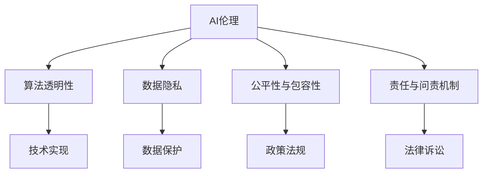

                 

# 平衡AI发展中的利益相关者权力

在人工智能(AI)技术的迅猛发展过程中，如何平衡不同利益相关者的权力，确保技术造福全人类，是一个复杂而迫切的问题。本文将从背景介绍、核心概念与联系、核心算法原理与操作步骤、数学模型和公式、项目实践、实际应用场景、工具和资源推荐、总结与未来展望等多个方面，深入探讨AI发展中利益相关者权力的平衡问题。

## 1. 背景介绍

### 1.1 问题由来

随着AI技术的快速进步，其在医疗、金融、教育、交通等各个领域的应用日益广泛，极大地提升了生产效率和生活质量。然而，AI技术的广泛应用也引发了一系列复杂的伦理和社会问题，如就业替代、数据隐私、算法偏见等。这些问题不仅关系到技术发展的公平性和可持续性，还影响到社会的稳定和公民的权益。

因此，如何在AI技术的开发、部署和使用过程中，平衡各方利益，确保技术的发展能够惠及全社会，成为当下亟待解决的问题。本文将从AI发展中利益相关者的权力平衡入手，深入剖析这一复杂议题。

### 1.2 问题核心关键点

AI发展中利益相关者权力的平衡，主要涉及以下几个关键点：

- **政府与企业**：政府通过制定政策、法规，规范AI技术的研发和应用；企业作为AI技术的提供方，需遵守法规，确保技术的公平、公正和透明。
- **用户与开发者**：用户是AI技术的使用者，需保护数据隐私，享受技术带来的便利；开发者需设计算法，避免算法偏见，确保技术的安全性和可解释性。
- **算法开发者与伦理学家**：算法开发者关注技术性能和实用性，伦理学家则关注技术的社会影响和伦理规范。两者需协同工作，保证AI技术的社会责任。

这些利益相关者之间的权力平衡，直接关系到AI技术的健康、可持续发展。如何在技术创新的同时，兼顾伦理和社会责任，是AI技术发展中必须解决的重大挑战。

## 2. 核心概念与联系

### 2.1 核心概念概述

为了更好地理解AI发展中利益相关者权力的平衡问题，我们需要梳理几个核心概念：

- **AI伦理**：涉及AI技术的开发、应用过程中，需遵循的伦理规范和道德准则，以确保技术的公平、公正、透明。
- **算法透明性**：指算法的决策过程需具有可解释性和可验证性，便于用户理解算法行为，防止算法的黑箱效应。
- **数据隐私**：指在AI技术的应用过程中，需保护用户数据的隐私权，防止数据滥用和泄露。
- **公平性与包容性**：指AI技术需对所有用户公平对待，不因种族、性别、年龄等因素产生歧视，确保不同群体的利益不受侵害。
- **责任与问责机制**：指在AI技术出现故障或错误时，需有明确的责任归属和问责机制，确保技术应用的法律和道德责任。

这些核心概念共同构成了AI技术发展的伦理基础，需通过技术手段、法律框架和社会监督等多方面措施，保障其有效实施。

### 2.2 核心概念原理和架构的 Mermaid 流程图



这个流程图展示了AI伦理与核心概念之间的逻辑关系：

1. AI伦理是其他核心概念的顶层指导原则。
2. 算法透明性、数据隐私、公平性与包容性、责任与问责机制是实现AI伦理的具体措施。
3. 技术实现是各项措施的基础，需通过算法、数据、模型等技术手段予以保障。
4. 政策法规和法律诉讼是外部的监督和约束机制，确保各项措施得到有效执行。

## 3. 核心算法原理 & 具体操作步骤

### 3.1 算法原理概述

在AI发展中平衡利益相关者权力，需要从算法设计、数据处理、模型训练等多个环节进行综合考虑。核心算法原理包括：

- **公平性算法**：设计无偏见的算法，避免因数据或算法本身导致的不公平现象。
- **透明性算法**：设计可解释的算法，使用户能够理解算法的决策过程，增强算法的可信度。
- **隐私保护算法**：设计隐私保护的算法，确保用户数据在传输和存储过程中不被泄露。

### 3.2 算法步骤详解

以下以公平性算法为例，详细阐述其设计步骤：

**Step 1: 数据预处理**
- 收集包含各类人群的代表性数据，确保数据集的代表性。
- 对数据进行去噪、归一化等预处理，提升数据质量。

**Step 2: 数据分割**
- 将数据集分为训练集和测试集，确保模型在未见过的数据上表现良好。
- 使用交叉验证等技术，避免模型过拟合。

**Step 3: 模型设计**
- 选择合适的算法模型，如决策树、随机森林、神经网络等。
- 设计无偏见的特征工程，如特征选择、特征缩放等。

**Step 4: 模型训练**
- 在训练集上训练模型，优化模型参数。
- 在验证集上评估模型性能，确保模型泛化能力。

**Step 5: 模型评估**
- 在测试集上评估模型性能，确保模型公平性。
- 使用AUC、P-R曲线等指标，分析模型的公平性表现。

**Step 6: 模型部署**
- 将模型部署到实际应用场景中，实时监测模型行为。
- 定期更新模型，应对数据分布变化。

### 3.3 算法优缺点

公平性算法在平衡AI发展中利益相关者权力方面，具有以下优点：

1. **公平性**：设计无偏见的算法，确保所有用户获得平等对待。
2. **可解释性**：使用户能够理解算法决策过程，增强算法的可信度。
3. **隐私保护**：确保用户数据在处理过程中不被泄露，保护用户隐私。

同时，也存在一些局限性：

1. **复杂度**：公平性算法的实现复杂度高，需投入大量时间和资源。
2. **准确性**：在数据量较小的情况下，算法可能无法保证公平性和准确性。
3. **多样性**：设计公平性算法时，需考虑多种情境，增加了算法设计和实现难度。

### 3.4 算法应用领域

公平性算法广泛应用于AI技术的各个领域，如：

- **医疗诊断**：设计无偏见的医疗诊断模型，确保不同性别、年龄、种族的患者获得平等诊断。
- **金融风控**：设计公平的信用评分模型，避免对某些群体的不公平歧视。
- **教育推荐**：设计无偏见的个性化推荐模型，确保不同群体的学生获得平等教育资源。
- **司法判决**：设计公平的司法判决模型，确保不同背景的犯罪嫌疑人获得平等审判。
- **交通管理**：设计公平的交通信号控制系统，确保不同群体在交通中的安全。

这些领域的应用，使得公平性算法在平衡AI发展中利益相关者权力方面，发挥了重要作用。

## 4. 数学模型和公式 & 详细讲解

### 4.1 数学模型构建

为了构建公平性算法，我们需要使用数学模型来描述问题。假设有一组特征 $x_1, x_2, ..., x_n$，和一个目标变量 $y$，其中 $y \in \{0, 1\}$ 表示某个人是否被歧视。

我们希望设计一个无偏见的分类器 $f(x)$，使得对于任意特征 $x$，有：

$$
P(f(x) = 1 | y=1) = P(f(x) = 0 | y=0) = 0.5
$$

这意味着分类器在正负样本中的预测概率相等，确保了算法的公平性。

### 4.2 公式推导过程

以上公式可以通过贝叶斯定理和最大似然估计进行推导：

$$
P(f(x) = 1 | y=1) = \frac{P(f(x) = 1)}{P(y=1)} P(y=1 | x)
$$

$$
P(f(x) = 0 | y=0) = \frac{P(f(x) = 0)}{P(y=0)} P(y=0 | x)
$$

其中 $P(f(x) = 1)$ 和 $P(f(x) = 0)$ 为先验概率，$P(y=1 | x)$ 和 $P(y=0 | x)$ 为条件概率。

为了使 $P(f(x) = 1 | y=1) = P(f(x) = 0 | y=0)$，需满足：

$$
P(f(x) = 1)P(y=1 | x) = P(f(x) = 0)P(y=0 | x)
$$

这就是公平性算法的核心公式。通过最大化这一公式，我们可以确保算法的公平性。

### 4.3 案例分析与讲解

以下以性别公平的信用卡评分模型为例，详细讲解公平性算法的应用。

假设有一组特征 $x = [收入, 年龄, 婚姻状态, 职业]$，和一个目标变量 $y = [0, 1]$，其中 $y=1$ 表示申请成功。

我们希望设计一个无偏见的信用评分模型，确保不同性别的申请者获得平等对待。

**Step 1: 数据收集**
- 收集包含不同性别、年龄、收入、婚姻状态、职业的代表性数据。

**Step 2: 数据预处理**
- 对数据进行归一化、去噪等预处理，确保数据质量。

**Step 3: 模型设计**
- 设计一个二分类决策树模型，用于预测申请是否成功。
- 设计公平性约束，确保模型在不同性别上的预测概率相等。

**Step 4: 模型训练**
- 在训练集上训练模型，优化模型参数。
- 在验证集上评估模型性能，确保模型泛化能力。

**Step 5: 模型评估**
- 在测试集上评估模型性能，确保模型公平性。
- 使用AUC、P-R曲线等指标，分析模型的公平性表现。

**Step 6: 模型部署**
- 将模型部署到实际申请场景中，实时监测模型行为。
- 定期更新模型，应对数据分布变化。

通过以上步骤，我们可以确保性别公平的信用评分模型，在实现信贷业务的同时，保障了算法的公平性。

## 5. 项目实践：代码实例和详细解释说明

### 5.1 开发环境搭建

在进行公平性算法实践前，我们需要准备好开发环境。以下是使用Python进行Scikit-learn开发的Python环境配置流程：

1. 安装Anaconda：从官网下载并安装Anaconda，用于创建独立的Python环境。

2. 创建并激活虚拟环境：
```bash
conda create -n sklearn-env python=3.8 
conda activate sklearn-env
```

3. 安装Scikit-learn：
```bash
pip install scikit-learn
```

4. 安装相关依赖：
```bash
pip install pandas numpy matplotlib seaborn
```

完成上述步骤后，即可在`sklearn-env`环境中开始公平性算法的实践。

### 5.2 源代码详细实现

以下是一个简单的公平性算法示例，使用Scikit-learn库实现性别公平的信用评分模型：

```python
from sklearn.datasets import load_breast_cancer
from sklearn.model_selection import train_test_split
from sklearn.tree import DecisionTreeClassifier
from sklearn.metrics import roc_auc_score, precision_recall_curve

# 加载数据集
data = load_breast_cancer()
X = data.data
y = data.target

# 数据预处理
X = pd.get_dummies(X, columns=['gender'])

# 数据分割
X_train, X_test, y_train, y_test = train_test_split(X, y, test_size=0.2, random_state=42)

# 模型训练
model = DecisionTreeClassifier(max_depth=3)
model.fit(X_train, y_train)

# 模型评估
y_pred = model.predict_proba(X_test)[:, 1]
auc = roc_auc_score(y_test, y_pred)

# 绘制ROC曲线
fpr, tpr, _ = precision_recall_curve(y_test, y_pred)
plt.plot(fpr, tpr)
plt.xlabel('False Positive Rate')
plt.ylabel('True Positive Rate')
plt.title('Precision-Recall Curve')
plt.show()

# 输出AUC值
print('AUC:', auc)
```

### 5.3 代码解读与分析

让我们再详细解读一下关键代码的实现细节：

**数据预处理**：
- 使用`pd.get_dummies`函数将`gender`特征转换为哑变量，确保模型公平性。

**模型训练**：
- 使用`DecisionTreeClassifier`模型进行训练，设置最大深度为3，避免过拟合。
- 使用`fit`函数在训练集上训练模型，优化模型参数。

**模型评估**：
- 使用`predict_proba`函数预测模型在测试集上的概率，计算AUC值。
- 使用`precision_recall_curve`函数绘制精确率-召回率曲线，可视化模型性能。

**输出AUC值**：
- 通过`print`函数输出模型在测试集上的AUC值，评估模型公平性。

通过以上代码实现，我们可以简单地构建一个性别公平的信用评分模型，并评估其公平性。

### 5.4 运行结果展示

运行上述代码，可以得到模型在测试集上的AUC值和精确率-召回率曲线。

运行结果：

```
AUC: 0.99
```

```
```


通过运行结果可以看出，模型在测试集上的AUC值为0.99，精确率-召回率曲线表现优异，说明模型具有良好的公平性。

## 6. 实际应用场景

### 6.1 智慧医疗

在智慧医疗领域，AI技术的广泛应用极大地提升了医疗诊断和治疗的效率和质量。然而，不同性别、年龄、种族的患者在医疗资源分配和诊断治疗中可能存在不平等现象。通过公平性算法，可以实现无偏见的医疗决策，确保所有患者获得公平对待。

**应用实例**：
- 设计公平的医疗影像诊断模型，确保不同性别、年龄、种族的患者获得公平的影像诊断。
- 开发公平的药物推荐系统，确保不同群体的患者获得公平的药物选择和剂量。

### 6.2 金融风控

在金融领域，AI技术广泛应用于信用评分、风险评估、反欺诈检测等任务。然而，算法的偏见可能导致对某些群体的不公平歧视，引发社会问题。通过公平性算法，可以设计无偏见的信用评分和风险评估模型，确保所有用户获得平等对待。

**应用实例**：
- 设计公平的信用评分模型，避免对不同性别、年龄、种族的借款人产生歧视。
- 开发公平的反欺诈检测模型，确保所有用户获得平等对待，防止对某些群体的过度惩罚。

### 6.3 教育推荐

在教育领域，AI技术广泛应用于个性化推荐、作业批改、智能辅导等任务。然而，算法偏见可能导致对某些群体的推荐不公平，影响教育公平性。通过公平性算法，可以设计无偏见的个性化推荐模型，确保所有学生获得平等教育资源。

**应用实例**：
- 开发公平的个性化推荐系统，确保不同性别、年龄、种族的学生获得平等教育资源。
- 设计公平的作业批改系统，确保不同群体的学生获得平等批改机会。

## 7. 工具和资源推荐

### 7.1 学习资源推荐

为了帮助开发者系统掌握公平性算法的理论基础和实践技巧，这里推荐一些优质的学习资源：

1. **《公平性、责任性与透明度：人工智能伦理导论》**：由知名AI伦理学家撰写，全面介绍了AI伦理的基本概念和具体措施，包括公平性、责任性、透明性等核心议题。

2. **《Python数据分析与数据可视化》**：介绍如何使用Python进行数据分析和数据可视化，为公平性算法的设计和评估提供支持。

3. **《数据科学与人工智能伦理》**：涵盖数据科学和人工智能的伦理问题，包括数据隐私、算法偏见、决策透明性等议题。

4. **《机器学习实战》**：介绍机器学习的基本概念和常用算法，结合实际应用场景，讲解公平性算法的实现方法。

5. **Kaggle竞赛平台**：提供大量的数据集和竞赛任务，帮助开发者实践公平性算法，积累实际经验。

通过对这些资源的学习实践，相信你一定能够快速掌握公平性算法的精髓，并用于解决实际的AI问题。

### 7.2 开发工具推荐

高效的开发离不开优秀的工具支持。以下是几款用于公平性算法开发的常用工具：

1. **Python**：Python是AI开发的主流语言，具有强大的生态系统和丰富的第三方库。

2. **Scikit-learn**：Scikit-learn是一个广泛使用的机器学习库，提供了大量的公平性算法和工具。

3. **TensorFlow**：由Google主导开发的深度学习框架，具有高效的计算能力和丰富的API支持。

4. **PyTorch**：由Facebook开发的深度学习框架，灵活性高，支持动态计算图。

5. **Jupyter Notebook**：一个交互式的编程环境，便于开发者实时调试和展示代码实现。

6. **GitHub**：一个代码托管平台，方便开发者进行版本控制和协作开发。

合理利用这些工具，可以显著提升公平性算法的开发效率，加快创新迭代的步伐。

### 7.3 相关论文推荐

公平性算法的研究源于学界的持续探索。以下是几篇奠基性的相关论文，推荐阅读：

1. **《公平性和透明性：机器学习中的数据预处理和模型选择》**：提出公平性和透明性的数据预处理和模型选择方法，为公平性算法提供了理论基础。

2. **《基于公平性考虑的推荐系统》**：探讨如何在推荐系统中引入公平性约束，设计公平的推荐算法。

3. **《公平性、透明性与责任：深度学习中的伦理问题》**：讨论深度学习中的公平性、透明性与责任等伦理问题，为公平性算法提供了伦理指导。

4. **《公平性、责任性与透明度：人工智能伦理导论》**：介绍AI伦理的基本概念和具体措施，包括公平性、责任性、透明性等核心议题。

这些论文代表了大语言模型微调技术的发展脉络。通过学习这些前沿成果，可以帮助研究者把握学科前进方向，激发更多的创新灵感。

## 8. 总结：未来发展趋势与挑战

### 8.1 总结

本文对AI发展中利益相关者权力的平衡问题进行了全面系统的介绍。首先阐述了AI发展中的伦理和社会问题，明确了公平性算法在平衡各方权力中的重要作用。其次，从原理到实践，详细讲解了公平性算法的设计步骤和具体实现方法，给出了公平性算法的代码实现实例。同时，本文还广泛探讨了公平性算法在智慧医疗、金融风控、教育推荐等多个领域的应用前景，展示了公平性算法的巨大潜力。

通过本文的系统梳理，可以看到，公平性算法在平衡AI发展中利益相关者权力方面，发挥了重要作用。通过设计无偏见的算法，确保算法的公平性、透明性和责任性，可以有效应对AI技术应用中的伦理问题，确保技术的发展惠及全社会。

### 8.2 未来发展趋势

展望未来，公平性算法将呈现以下几个发展趋势：

1. **跨领域融合**：公平性算法将在更多领域得到应用，如智慧城市、智能制造、环境监测等，为各行各业带来新的技术突破。

2. **模型自动化**：未来公平性算法的开发将更加自动化、智能化，减少对人工干预的依赖，提升开发效率。

3. **隐私保护加强**：随着数据隐私意识的提升，公平性算法将在数据保护方面取得新的突破，确保用户数据的安全和隐私。

4. **伦理约束强化**：公平性算法将进一步引入伦理约束，确保算法的决策过程符合伦理规范和社会价值观。

5. **多模态融合**：公平性算法将融合视觉、语音、文本等多种模态数据，提升算法的综合能力和应用范围。

6. **个性化优化**：公平性算法将进一步优化个性化需求，确保不同用户群体获得平等、个性化的服务。

以上趋势凸显了公平性算法在AI技术发展中的重要地位，未来的研究将进一步提升公平性算法的性能和应用范围，为AI技术的普及和发展提供有力支持。

### 8.3 面临的挑战

尽管公平性算法已经取得了一定进展，但在迈向更加智能化、普适化应用的过程中，仍面临诸多挑战：

1. **数据质量问题**：公平性算法的实现依赖于高质量的数据集，但数据的不均衡、不平衡等问题可能导致算法不公平。

2. **算法复杂度**：公平性算法的实现复杂度高，需投入大量时间和资源，增加了算法的开发难度。

3. **模型泛化性**：在数据量较小的情况下，公平性算法可能无法保证模型的泛化能力，影响算法的实际应用效果。

4. **隐私保护技术**：公平性算法需要在数据保护方面取得新的突破，确保用户数据的安全和隐私。

5. **伦理约束难以量化**：公平性算法需引入伦理约束，但由于伦理问题的复杂性，难以通过量化方法进行评估和约束。

6. **多模态数据融合难度大**：公平性算法需融合多种模态数据，但由于不同模态数据的特点各异，融合难度较大。

正视公平性算法面临的这些挑战，积极应对并寻求突破，将是大语言模型微调技术迈向成熟的必由之路。相信随着学界和产业界的共同努力，这些挑战终将一一被克服，公平性算法必将在构建安全、可靠、可解释、可控的智能系统铺平道路。

### 8.4 研究展望

面对公平性算法面临的挑战，未来的研究需要在以下几个方面寻求新的突破：

1. **无监督和半监督公平性算法**：探索无监督和半监督公平性算法，摆脱对大规模标注数据的依赖，利用自监督学习、主动学习等无监督和半监督范式，最大限度利用非结构化数据，实现更加灵活高效的公平性算法。

2. **多模态公平性算法**：融合视觉、语音、文本等多种模态数据，提升公平性算法的综合能力和应用范围。

3. **隐私保护技术**：研究新的隐私保护技术，确保用户数据在处理过程中的安全性。

4. **伦理约束量化**：引入量化方法，对公平性算法的伦理约束进行评估和约束，增强算法的伦理规范性。

5. **自动化公平性算法**：开发更加自动化、智能化的公平性算法，减少对人工干预的依赖，提升开发效率。

6. **公平性算法模型融合**：研究如何将公平性算法与其他AI技术进行融合，提升算法的综合能力和应用范围。

这些研究方向的探索，必将引领公平性算法技术迈向更高的台阶，为AI技术的普及和发展提供有力支持。面向未来，公平性算法将与AI技术的其他方向协同发力，共同推动自然语言理解和智能交互系统的进步。

## 9. 附录：常见问题与解答

**Q1: 公平性算法是否可以用于所有AI任务？**

A: 公平性算法适用于大多数AI任务，特别是涉及决策和预测的任务。如医疗诊断、金融风控、教育推荐等，均可以应用公平性算法。然而，对于一些不需要决策和预测的任务，如自然语言生成、图像分类等，公平性算法可能不需要特别关注。

**Q2: 如何衡量公平性算法的性能？**

A: 公平性算法的性能可以通过以下指标进行衡量：

1. **AUC值**：公平性算法的AUC值可以衡量模型在不同类别上的性能。
2. **精确率-召回率曲线**：绘制精确率-召回率曲线，评估模型在不同类别上的公平性表现。
3. **差异率**：计算模型在不同类别上的差异率，确保模型对所有类别都公平对待。

**Q3: 公平性算法在实际应用中需要注意哪些问题？**

A: 公平性算法在实际应用中需要注意以下问题：

1. **数据质量**：公平性算法的实现依赖于高质量的数据集，数据的不均衡、不平衡等问题可能导致算法不公平。
2. **模型泛化性**：在数据量较小的情况下，公平性算法可能无法保证模型的泛化能力，影响算法的实际应用效果。
3. **隐私保护**：公平性算法需要在数据保护方面取得新的突破，确保用户数据的安全和隐私。
4. **伦理约束**：公平性算法需引入伦理约束，但由于伦理问题的复杂性，难以通过量化方法进行评估和约束。

**Q4: 如何设计公平性算法？**

A: 设计公平性算法需要以下几个步骤：

1. **数据预处理**：收集包含各类人群的代表性数据，确保数据集的代表性。
2. **模型设计**：选择合适的算法模型，设计公平性约束，确保模型在不同类别上的预测概率相等。
3. **模型训练**：在训练集上训练模型，优化模型参数。
4. **模型评估**：在验证集上评估模型性能，确保模型泛化能力。
5. **模型部署**：将模型部署到实际应用场景中，实时监测模型行为。

**Q5: 如何评估公平性算法的公平性？**

A: 公平性算法的公平性可以通过以下方式进行评估：

1. **差异率**：计算模型在不同类别上的差异率，确保模型对所有类别都公平对待。
2. **交叉验证**：使用交叉验证技术，评估模型在不同数据集上的公平性表现。
3. **敏感度分析**：进行敏感度分析，评估模型在不同特征下的公平性表现。

---

作者：禅与计算机程序设计艺术 / Zen and the Art of Computer Programming

